```{r setup, include = FALSE}
source(paste0(getwd(), "/../source/style.R"))
library(DT)
library(shiny)
stargazer <- stargazer::stargazer
theme_minimal <- theme_Rcourse
options(htmltools.dir.version = F)
knitr::opts_chunk$set(echo = T, message = F, warning = F, fig.align = "center", dpi = 300, out.width = "100%")
set.seed(1)
```

<style> .left-column {width: 65%;} .right-column {width: 35%;} </style>

### Last time we saw

--

#### Shapefiles and rasters

<center><b>Two main types of geolocalized datasets:</b></center>

--

<p style = "margin-bottom:.5cm;"></p>

.pull-left[

<center><b>Shapefiles</b></center>

<ul>
  <li>One row per entity/one column per variable</li>
  <li>A geometry variable with the coordinates of the points/polylines/polygons</li>
</ul>

```{r, echo = F, fig.height = 3.6, fig.width = 7, out.width = '100%'}
fakeshp <- tibble(x = c(1, 3, 7, 8, 10, 11, 12, 13, 14),
       y1 = c(4, 3, 1, 1.75, 3.25, 4, 6, 7, 6),
       y2 = c(4, 8, 5.6, 5, 7, 4, 6, 5, 6),
       `Median income` = c(rep("High", 6), rep("Low", 3)))

ggplot() +
  geom_line(data = fakeshp, aes(x = x, y = y1, group = `Median income`, color = `Median income`)) + 
  geom_line(data = fakeshp, aes(x = x, y = y2, group = `Median income`, color = `Median income`)) + 
  geom_ribbon(data = fakeshp %>% filter(`Median income` == "High"), aes(x = x, ymin = y1, ymax = y2), fill = "#014D64") +
  geom_ribbon(data = fakeshp %>% filter(`Median income` == "Low"), aes(x = x, ymin = y1, ymax = y2), fill = "#00A2D9") +
  theme_void() +
  theme(plot.background = element_rect(color = "#DFE6EB", fill = "#DFE6EB"),
        panel.background = element_rect(color = "#DFE6EB", fill = "#DFE6EB"))
```
  
]

--

.pull-right[

<center><b>Rasters</b></center>

<ul>
  <li>Works like a picture, with cells like pixels</li>
  <li>And each cell can take a given value, e.g. pollution observed from satellites</li>
</ul>
 
```{r, echo = F, fig.height = 3.6, fig.width = 7, out.width = '100%'}
fakeraster <- tibble(x = rep(2:14, 7) - .5,
       y = rep(8:2, each = 13) - .5,
       z = c(NA, .5, .45, .45, NA, NA, NA, NA, NA, NA, NA, NA, NA,
             NA, .45, .45, .4, .2, .2, NA, NA, 1, 1, NA, .9, .85,
             .4, .4, .4, .3, .2, .2, .5, .6, .8, 1, NA, .85, .8,
             .3, .3, .3, .3, .2, .2, .5, .7, .9, 1, NA, NA, NA,
             .2, .2, .2, .2, .2, .2, .4, .5, .7, 1, NA, NA, NA,
             NA, NA, .2, .2, .2, .2, .3, .4, .6, NA, NA, NA, NA,
             NA, NA, NA, NA, .2, .1, .2, .3, NA, NA, NA, NA, NA))

ggplot() +
  geom_tile(data = fakeraster %>%
              mutate(pollution = z), aes(x = x, y = y, fill = pollution), color = "black") +
  theme_void() +
  theme(plot.background = element_rect(color = "#DFE6EB", fill = "#DFE6EB"),
        panel.background = element_rect(color = "#DFE6EB", fill = "#DFE6EB"))
```

]

---

### Last time we saw

#### Coordinates Reference Systems

<ul>
  <li>A Coordinate Reference System (CRS) is a model of the Earth in which each location is coded using degrees</li>
  <ul>
    <li>It allows to <b>project the surface of the globe on a plane</b></li>
    <li>But there is a <b>tradeoff</b> between preserving:</li>
</ul>

--

<p style = "margin-bottom:.5cm;"></p>
 
.pull-left[

<center><b>Shape</b> (like the Mercator projection)</center>

```{r, echo = F, fig.height = 11.63, fig.width = 13, out.width = '70%'}
library(sf)
world <- read_sf("World_Countries__Generalized_.shp")

ggplot(st_crop(st_transform(world, "+proj=merc"), 
               xmin = -20037507, xmax = 20037507, ymin = -17198185, ymax = 18375859)) + 
  geom_sf(fill = "#6794A7", color = "#014D64", alpha = .6) + 
  theme(axis.line = element_blank(), axis.ticks = element_blank(), axis.text = element_blank())
```

]

--

.pull-right[

<center><b>Scale</b> (like the Equal-Area Cylindrical projection)</center>

```{r, echo = F, fig.height = 5.95, fig.width = 18, out.width = '100%'}
ggplot(st_transform(world, "+proj=cea")) + geom_sf(fill = "#6794A7", color = "#014D64", alpha = .6)
```

<p style = "margin-bottom:1cm;"></p>

<ul>
  <li>Most projections are somewhere in between</li>
  <li>For France: Lambert 93 projection (EPSG:2154)</li>
</ul>

<p style = "margin-bottom:.5cm;"></p>

<center><i>&#10140; First thing to do: <b>reprojection</b></i></center>

]

---

### Last time we saw

#### Operations on geolocalized data

.pull-left[

<center><b>Zonal statistics</b></center>

<ul>
  <li>Computing statistics on areas delimited by a shapefile from values of a raster</li>
  <ul>
    <li>Project shapefile and raster the same way</li>
    <li>Compute the mean/max/... of cell values</li>
</ul>


```{r, echo = F, fig.height = 4, fig.width = 5.505, out.width = "90%"}
library(tidyverse)
library(viridis)
library(sf)
library(raster)
select <- dplyr::select
library(ncdf4)

# Import data
dep_shp <- read_sf("data_lecture14/dep_shp/DEPARTEMENT.shp")
pm_data <- raster("data_lecture14/acag_2016.nc")

# Reproject data
dep_shp <- st_set_crs(dep_shp, "EPSG:4326")
crs(pm_data) <- "EPSG:4326"

# Rename PM 2.5 layer
names(pm_data) <- "pm2.5"

idf_shp <- read_sf("data_lecture14/idf_shp/idf.shp")
idf_shp <- st_set_crs(idf_shp, "EPSG:4326")

dep_shp <- dep_shp %>% filter(INSEE_REG == 11)
pm_data <- crop(pm_data, extent(dep_shp))
pm_data <- mask(pm_data, dep_shp)

ggplot() +
  geom_tile(data = as_tibble(rasterToPoints(pm_data)), 
            aes(x = x, y = y, fill = pm2.5))  +
  geom_sf(data = dep_shp, fill = NA, color = alpha("grey20", .6), size = 1.2) +
  geom_sf(data = idf_shp, fill = NA , color = alpha("grey20", .4)) +
  scale_fill_viridis(option = "B") + theme_void() +
  theme(plot.background = element_rect(color = "#DFE6EB", fill = "#DFE6EB"),
        panel.background = element_rect(color = "#DFE6EB", fill = "#DFE6EB"))
```

]

--

.pull-right[
 
<center><b>Centroids</b></center>

<ul>
  <li>The centroid is the arithmetic mean position of all the points in the polygon</li>
  <ul>
    <li>To compute distances between polygons</li>
    <li>A centroid is not always within its polygon</li>
</ul>

```{r, echo = F, fig.height = 8, fig.width = 9.95, out.width = "82%"}
idf_shp <- idf_shp %>%
  mutate(centroid = st_centroid(geometry))

ggplot() +
  geom_sf(data = dep_shp, fill = NA, color = alpha("grey20", .6), size = 1.2) +
  geom_sf(data = idf_shp$geometry, fill = "#6794A7", color = "#014D64", alpha = .6, size = .8) +
  geom_sf(data = idf_shp$centroid, color = "#014D64", size = .8) + theme_void() +
  theme(plot.background = element_rect(color = "#DFE6EB", fill = "#DFE6EB"),
        panel.background = element_rect(color = "#DFE6EB", fill = "#DFE6EB"))
```

]

---

### Before we start: More on controls and interactions

--

<ul>
  <li>We've seen in previous lectures that when regressing y on x:</li>
  <ul>
    <li><b>Controlling for z</b> allows to <b>net out</b> the relationship between x and y from how they both relate to <b>z</b></li>
    <li><b>Interacting x with z</b> allows to <b>estimate how the relationship</b> between x and y <b>varies with z</b></li>
  </ul>
</ul>

--

<ul>
  <li>Given what I've seen in the homeworks it seems unclear for many of you</li>
</ul>

--

<p style = "margin-bottom:.75cm;"></p>

<center><i><b>&#10140; So let's get back to it with some visualization</b></i></center>

--

.pull-left[
```{r}
library(tidyverse)
data <- read.csv("household_data.csv")
head(data, 7) # fake data
```
]

--

.pull-right[
```{r, echo = F, fig.width = 6, fig.height = 3.75, out.width = '100%'}
ggplot(data, aes(x = Income, y = Children)) +
  geom_point() + geom_smooth(method = "lm", se = F)
```
]

---

### Before we start: More on controls and interactions

<ul>
  <li>There's a clear positive relationship</li>
</ul>
  
```{r, echo = F}
round(summary(lm(Children ~ Income, data))$coefficients[, c(1, 4)], 3)
```

--

<ul>
  <ul>
    <li>But what if this relationship was driven by a third variable?</li>
    <li>Maybe it's just that more educated parents tend to earn more and to have more children</li>
  </ul>
</ul>

--

```{r, echo = F, fig.width = 7.5, fig.height = 4.375, out.width = '50%'}
ggplot(data, aes(x = Income, y = Children)) +
  geom_point(aes(color = Education, shape = Education), size = 3) + 
  geom_smooth(method = "lm", se = F)
```

--

.pull-right[
<ul>
  <li>In this example, <b>education</b> is indeed <b>positively correlated with both variables</b></li>
  <ul>
    <li>So at least part of the positive relationship we observe is actually due to education</li>
    <li><b>Controlling</b> for education estimates the relationship by <b>netting our the contribution of education</b></li>
  </ul>
</ul>
]

---

### Before we start: More on controls and interactions

 * <b>Controlling</b> for education does the same to the slope <b>as recentering</b> the graph with respect to education :

<p style = "margin-bottom:-.5cm;"></p>

--

.pull-left[
```{r, echo = F, fig.width = 6, fig.height = 3.75, out.width = '100%'}
ggplot(data %>%
         group_by(Education) %>%
         mutate(meaninc = mean(Income),
                meanchi = mean(Children)) %>%
         ungroup(), aes(x = Income, y = Children)) +
  geom_point(aes(color = Education, shape = Education)) + 
  geom_point(aes(x = meaninc, y = meanchi, color = Education), shape = 3, size = 10, show.legend = F, alpha = .8) +
  geom_smooth(method = "lm", se = F)
```

<ul>
  <li>The crosses are located at the average x and y values for each education group</li>
  <ul>
    <li>Controlling for education shifts x and y by group such that crosses superimpose</li>
  </ul>
</ul>

]

--

.pull-right[
```{r, echo = F, fig.width = 6, fig.height = 3.75, out.width = '100%'}
recentered <- data %>%
  mutate(meaninc = mean(Income),
         meanchi = mean(Children)) %>%
  group_by(Education) %>%
  mutate(Income = Income - mean(Income) + meaninc,
         Children = Children - mean(Children) + meanchi) %>%
  ungroup()

ggplot(recentered, aes(x = Income, y = Children)) +
  geom_point(aes(color = Education, shape = Education)) + 
  geom_point(aes(x = meaninc, y = meanchi, color = Education), shape = 3, size = 10, show.legend = F, alpha = .8) +
  geom_smooth(method = "lm", se = F)
```
```{r, echo = F}
round(summary(lm(Children ~ Income + Education, data))$coefficients[, c(1, 4)], 3)
```
]

---

### Before we start: More on controls and interactions

<ul>
  <li>Here when we <b>do not control</b> for education:</li>
</ul>

$$Children_i = \alpha + \beta Income_i + \varepsilon_i$$

<ul><ul>
  <li>We estimate the overall relationship (here, significantly positive)</li>
</ul></ul>

--

<p style = "margin-bottom:1.25cm;"></p>

<ul>
  <li>But when we <b>control</b> for education:</li>
</ul>

$$Children_i = \alpha + \beta Income_i + \gamma_1 1\{Education_i=\text{Highschool}\} + \gamma_2 1\{Education_i=\text{College}\} +\varepsilon_i$$

<ul><ul>
  <li>We estimate the relationship net of the effect of education (here, not significant)</li>
</ul></ul>

--

<p style = "margin-bottom:1.25cm;"></p>

<ul>
  <li><b>Interacting</b> the two variables is going one step further:</li>
</ul>

$$\begin{align}Children_i & = \alpha + \beta Income_i + \gamma_1 1\{Education_i=\text{Highschool}\} + \gamma_2 1\{Education_i=\text{College}\} + \\ 
& \delta_1 Income_i\times1\{Education_i=\text{Highschool}\} + \delta_2 Income_i \times 1\{Education_i=\text{College}\} + \varepsilon_i\end{align}$$

<ul><ul>
  <li>It is not simply taking into account the fact that education may plays a role</li>
  <li>It estimates by how much the relationship between x and y varies according to z</li>
</ul></ul>

---

### Before we start: More on controls and interactions

 * <b>Interacting</b> income with education provides <b>one slope per education group</b>:

--

.pull-left[
```{r, echo = F, fig.width = 6, fig.height = 3.75, out.width = '100%'}
ggplot(recentered, aes(x = Income, y = Children, color = Education)) +
  geom_point(aes(, shape = Education)) + 
  #geom_point(aes(x = meaninc, y = meanchi, color = Education), shape = 3, size = 10, show.legend = F, alpha = .8) +
  geom_smooth(method = "lm", se = F)
```
]

.pull-right[
<p style = "margin-bottom:2.5cm;"></p>
```{r, echo = F}
round(summary(lm(Children ~ Income + Education + Income * Education, data))$coefficients[, c(1, 4)], 3)
```
]

--

<ul>
  <li>The principle is the same when the third variable is continuous:</li>
  <ul>
    <li>Controlling nets out the slope from how the third variable enters the relationship</li>
    <li>Interacting gives by how much the slope changes on expectation when the third variable increases by 1</li>
    <li>And we can control for/interact with multiple third variables</li>
  </ul>
</ul>

---

### Today: Interactive data visualization

<p style = "margin-bottom:1.25cm;">

#### 1. Introduction to shiny apps
<p style = "margin-bottom:-.5cm;">
 * 1.1. General structure
 * 1.2. User interface
 * 1.3. Server
 * 1.4. Layout

#### 2. Our first shiny app
<p style = "margin-bottom:-.5cm;">
 * 2.1. Import data in Shiny
 * 2.2. Interactive plot
 * 2.3. Interactive regression results

#### 3. More advanced tools
<p style = "margin-bottom:-.5cm;">
 * 3.1. Input randomization
 * 3.2. HTML formatting
 
#### 4. Wrap up!

---

### Today: Interactive data visualization

<p style = "margin-bottom:1.25cm;">

#### 1. Introduction to shiny apps
<p style = "margin-bottom:-.5cm;">
 * 1.1. General structure
 * 1.2. User interface
 * 1.3. Server
 * 1.4. Layout

---

### 1. Introduction to shiny apps

#### 1.1. General structure

--

<ul>
  <li><b>Shiny</b> is an R package that makes it easy to build <b>interactive web apps</b> straight from R:</li>
  <ul>
    <li><a href="https://gpilgrim.shinyapps.io/SwimmingProject-Click/">Shiny app to find the colleges that fit your criteria</a></li>
    <li><a href="https://shiny.rstudio.com/gallery/movie-explorer.html">Shiny app to visualize data on movies</a></li>
    <li>The online quizzes of this course</li>
  </ul>
</ul>

--

<ul>
  <li>To make a Shiny app you should create an R script and name it <b>app.R</b></li>
  <li>You shiny app should contain two components</li>
  <ol>
    <li>The <b>user interface:</b> What is displayed on the screen, what the user can interact with</li>
    <li>The <b>server:</b> Where the calculations are made to display the interactive components accordingly</li>
  </ol>
</ul>

--

```{r, eval = F}
library(shiny)

ui <- fluidPage()
server <- function(input, output) {}

shinyApp(ui = ui, server = server)
```

--

<center><b>&#10140; R will detect that you are creating a shiny app and you will have access to the  button</b></center>

---

### 1. Introduction to shiny apps

#### 1.1. General structure 

 * You can already click on it to view you blank app:

--

<center>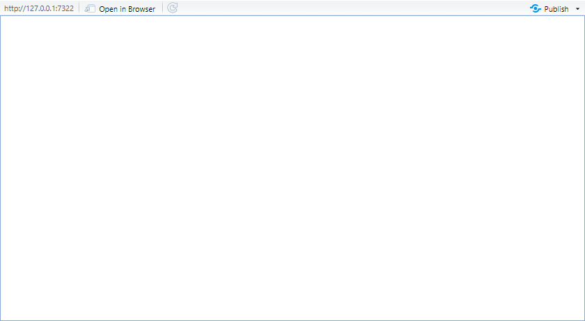</center>

--

<p style = "margin-bottom:.75cm;"></p>

<center><b>&#10140; We have to program what we want to appear in the user interface</b></center>

---

### Introduction to shiny apps

#### 1.2. User interface

<ul>
  <li>There are many different types of <b>input widgets</b> to place in the UI:</li>
  <ul>
    <li><b>numericInput():</b> Write a numeric input</li>
    <li><b>textInput():</b> Write a character input</li>
    <li><b>checkbox[Group]Input():</b> Box[es] to tick</li>
    <li><b>radioButtons():</b> One item to tick</li>
    <li><b>selectInput():</b> Select an item from a dropdown list</li>
    <li>...</li>
  </ul>
</ul>
    
--

<ul>
  <li>These functions take the following <b>arguments</b>:</li>
  <ul>
    <li><b>inputId:</b> The identifier of the input for use in the server function </li>
    <li><b>label:</b> The title of the input widget that will appear in the UI</li>
    <li><b>choices:</b> The list of input options for multiple choices inputs</li>
    <li><b>selected:</b> Which option is selected by default when multiple choices</li>
    <li><b>value:</b> What is filled by default in the text/numeric input boxes</li>
  </ul>
</ul>

--

<p style = "margin-bottom:1cm;"></p>

<center><b>&#10140; Let's try out a few of them</b></center>

---

### 1. Introduction to shiny apps

#### 1.2. User interface

<p style = "margin-bottom:-.5cm;"></p>

.pull-left[
```{r}
numericInput(inputId = "number", 
             label = "Write a number", 
             value = 0)

textInput(inputId = "text", 
          label = "Write text", 
          value = "...")

checkboxInput(inputId = "box",
              label = "Tick the box",
              value = F)
```
]

--

.pull-right[
```{r}
checkboxGroupInput(inputId = "boxes", 
                   label = "Boxes to check",  
                   choices = c("A", "B", "C"),
                   selected = "B")

selectInput(inputId = "select", 
            label = "Select option", 
            choices = c("A", "B", "C"), 
            selected = "A")
```
]

---

### 1. Introduction to shiny apps

#### 1.2. User interface

<ul>
  <li>In the UI these elements should be separated with a commas</li>
  <ul>
    <li>Let's do a user interface with radio buttons and a slider:</li>
  </ul>
</ul>

<p style = "margin-bottom:.75cm;"></p>

--

```{r, eval = F}
library(shiny)

ui <- fluidPage(
  radioButtons(inputId = "radio", label = "Radio buttons:",
               choices = c("A", "B", "C"), selected = "A"),
  
  sliderInput(inputId = "slider", label = "Slide:", 
              min = 1, max = 10, step = 1, value = 5)
)

server <- function(input, output) {
  
}

shinyApp(ui = ui, server = server)
```

---

### 1. Introduction to shiny apps

#### 1.2. User interface

 * Now we have some inputs but nothing happens when we use them

<center>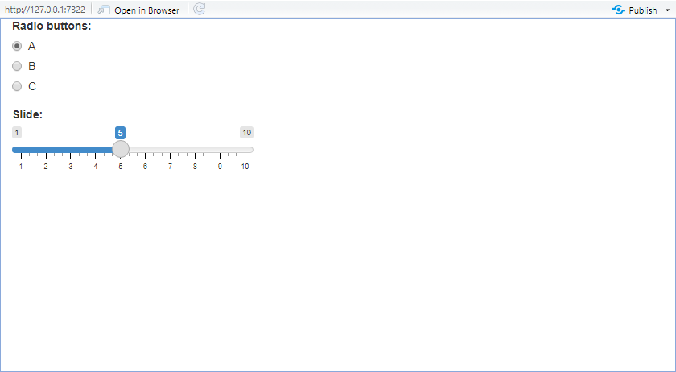</center>

--

<p style = "margin-bottom:.75cm;"></p>

<center><b>&#10140; We should make an output that will react to these inputs</b></center>

---

### 1. Introduction to shiny apps

#### 1.3. Server
 
<ul>
  <li>We can add a reactive table in the server function:</li>
  <ul>
    <li>Put a standard tibble() in a <b>reactive({})</b> environment</li>
    <li>Fill this table with the inputs that should be called by their id as <b>input$inputId</b></li>
    <li>Assign it to an output through <b>renderTable({})</b></li>
  </ul>
</ul>

--

<p style = "margin-bottom:.75cm;"></p>

```{r, eval = F}
server <- function(input, output) {
  
  reactive_tibble <- reactive({
    tibble(letter = input$radio,
           number = input$slider)
  })
  
  output$table <- renderTable({reactive_tibble()})
  
}
```

--

<p style = "margin-bottom:.75cm;"></p>

<ul>
  <li>Every time an input will change, <b>reactive({})</b> function will notice it</li>
  <ul>
    <li>And the updated table will be stored into the output named "table" through <b>renderTable({})</b></li>
  </ul>
</ul>

---

### 1. Introduction to shiny apps

#### 1.3. Server

<ul>
  <li>But for this reactive table to appear on the app, we should put it in the UI</li>
  <ul>
    <li>Use <b>tableOutput("output_label")</b> to render a reactive table</li>
    <li>Don't forget the comma!</li>
  </ul>
</ul>

--

<p style = "margin-bottom:.5cm;"></p>

```{r, eval = F}
ui <- fluidPage(
  radioButtons(inputId = "radio", label = "Radio buttons:",
               choices = c("A", "B", "C"), selected = "A"),
  
  sliderInput(inputId = "slider", label = "Slide:", 
              min = 1, max = 10, step = 1, value = 5),
  
* tableOutput("table")
)

```

--

<p style = "margin-bottom:.5cm;"></p>

<ul>
  <li>We now have all the components of a shiny app:</li>
  <ul>
    <li>Some input widgets in the UI</li>
    <li>Reactive functions in the server</li>
    <li>The processed output in the UI</li>
  </ul>
</ul>

---

### 1. Introduction to shiny apps

#### 1.3. Server

```{r, eval = F}
library(shiny)
library(tidyverse)

ui <- fluidPage(
  radioButtons(inputId = "radio", label = "Radio buttons:",
               choices = c("A", "B", "C"), selected = "A"),
  sliderInput(inputId = "slider", label = "Slide:", 
              min = 1, max = 10, step = 1, value = 5),
* tableOutput("table")
)

server <- function(input, output) {
* reactive_tibble <- reactive({tibble(letter = input$radio,
*                                     number = input$slider)})
* 
* output$table <- renderTable({reactive_tibble()})
}

shinyApp(ui = ui, server = server)
```

---

### 1. Introduction to shiny apps

#### 1.3. Server

 * We created an interactive table:

<center>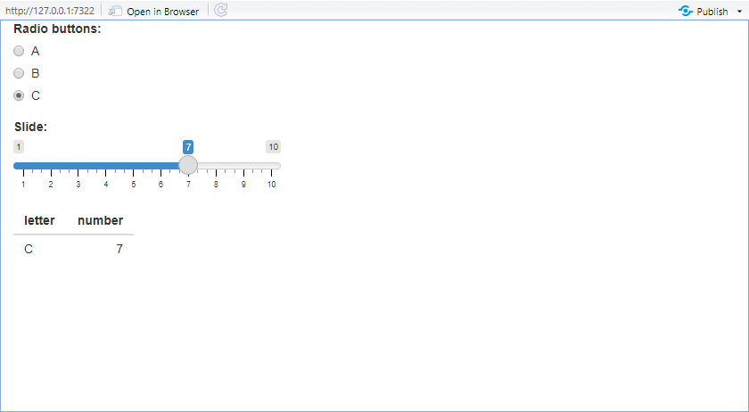</center>

---

### 1. Introduction to shiny apps

#### 1.3. Server

<ul>
  <li>As you might have guessed, tableOutput() and renderTable() only work for tables</li>
  <ul>
    <li>There are specific UI and server function for each type of interactive element</li>
  </ul>
</ul>

--

<p style = "margin-bottom:1.5cm;"></p>

<center><h4>Main interactive elements in Shiny:</h4></center>

<p style = "margin-bottom:-.25cm;"></p>

```{r, echo = F}
tibble(`Interactive element` = c("Table", "Plot", "Console output", "Text", "UI element"),
       `Server render function` = c("renderTable()", "renderPlot()", "renderPrint()", "renderText()", "renderUI()"),
       `UI output function` = c("tableOutput()", "plotOutput()", "verbatimTextOutput()", "textOutput()", "uiOutput()")) %>%
  kable(., caption = "", align = "lcc") %>%
  column_spec(1, bold = T)
```

---

### 1. Introduction to shiny apps

#### 1.4. Layout

<ul>
  <li>Right now the presentation is not very convenient</li>
  <ul>
    <li>Everything is stacked at the left of the page</li>
  </ul>
</ul>

--

<p style = "margin-bottom:.75cm;"></p>

<ul>
  <li>The sidebarLayout() allows to display:</li>
  <ul>
    <li>A control panel on the left with the inputs</li>
    <li>A main panel on the right with the reactive outputs</li>
  </ul>
</ul>

--

<p style = "margin-bottom:.75cm;"></p>
 
```{r, eval = F}
ui <- fluidPage(
  sidebarLayout(
    sidebarPanel(width = 3,
      #INPUTS_HERE
    ),
    mainPanel(width = 9,
      #OUTPUTS_HERE
    )
  )
)
```

---

### 1. Introduction to shiny apps

#### 1.4. Layout

 * We can also add a title to our app using the titlePanel() function:

--

```{r, eval = F}
ui <- fluidPage(
  
  titlePanel("My shiny app"),
  
  sidebarLayout(
    
    sidebarPanel(width = 3,
      radioButtons(inputId = "radio", label = "Radio buttons:",
                   choices = c("A", "B", "C"), selected = "A"),
      sliderInput(inputId = "slider", label = "Slide:", 
                  min = 1, max = 10, step = 1, value = 5)
    ),
    
    mainPanel(width = 9, tableOutput("table"))
  )
  
)
```

---

### 1. Introduction to shiny apps

#### 1.4. Layout

<center>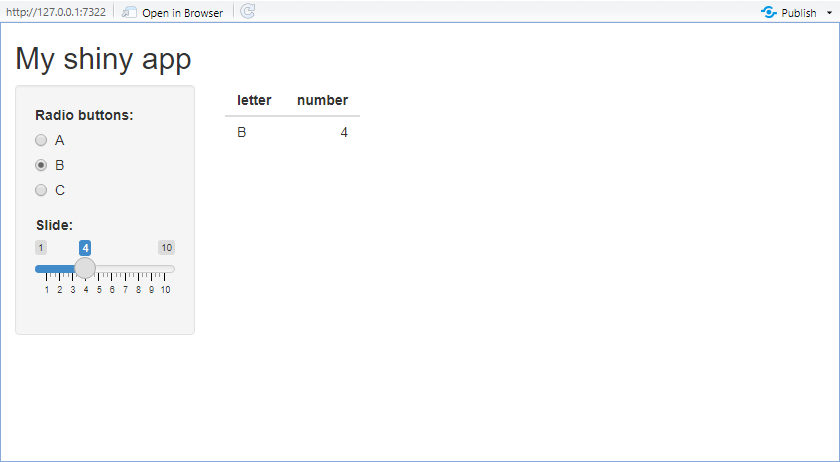</center>

---

### Overview

<p style = "margin-bottom:1.25cm;">

#### 1. Introduction to shiny apps &#10004;
<p style = "margin-bottom:-.5cm;">
 * 1.1. General structure
 * 1.2. User interface
 * 1.3. Server
 * 1.4. Layout

#### 2. Our first shiny app
<p style = "margin-bottom:-.5cm;">
 * 2.1. Import data in Shiny
 * 2.2. Interactive plot
 * 2.3. Interactive regression results

#### 3. More advanced tools 
<p style = "margin-bottom:-.5cm;">
 * 3.1. Input randomization
 * 3.2. HTML formatting
 
#### 4. Wrap up!

---

### Overview

<p style = "margin-bottom:1.25cm;">

#### 1. Introduction to shiny apps &#10004;
<p style = "margin-bottom:-.5cm;">
 * 1.1. General structure
 * 1.2. User interface
 * 1.3. Server
 * 1.4. Layout

#### 2. Our first shiny app 
<p style = "margin-bottom:-.5cm;">
 * 2.1. Import data in Shiny
 * 2.2. Interactive plot
 * 2.3. Interactive regression results

---

### 2. Our first shiny app

#### 2.1. Import data on shiny

<ul>
  <li>We now know everything we need to build our first app</li>
  <ul>
    <li>Let's make an app that allows to visualize the relationship between department-level characteristics</li>
    <li>dep_data.csv contains department characteristics at the department-year level from 2012 to 2017</li>
  </ul>
</ul>

--

```{r}
dep_data <- as_tibble(read.csv("dep_data.csv"))
head(dep_data)
```

---

### 2. Our first shiny app

#### 2.1. Import data on shiny

<ul>
  <li>Importing data in a Shiny app is no different than usual</li>
  <ul>
    <li>We can simply assign it to an object before specifying the UI and the server functions</li>
    <li>Every object stored at the beginning of the script is accessible by the app</li>
  </ul>
</ul>

--

```{r, eval = F}
library(shiny)
library(tidyverse)

*dep_data <- as_tibble(read.csv("dep_data.csv"))

ui <- fluidPage(
  selectInput(inputId = "variable", label = "Select variable:", 
*             choices = names(dep_data), selected = names(dep_data)[1])
)

server <- function(input, output) {
  
}

shinyApp(ui = ui, server = server)
```

---

### 2. Our first shiny app

#### 2.1. Import data on shiny

 * We can now access the variable of the dataset from the dropdown list:

<center>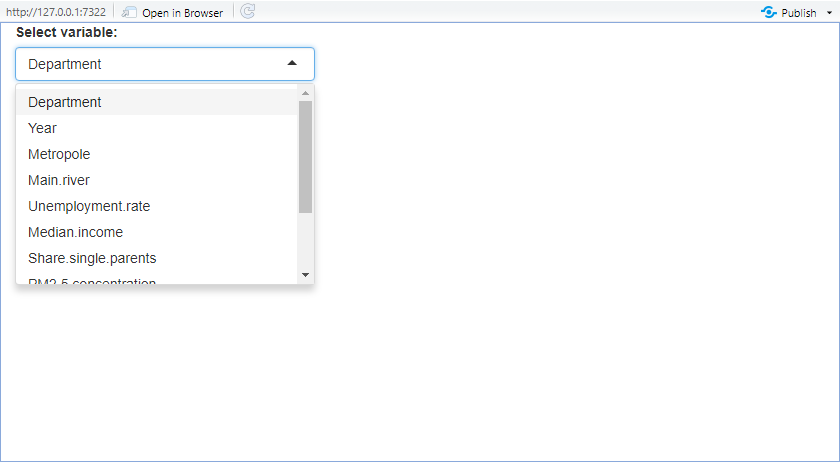</center>

---

### 2. Our first shiny app

#### 2.1. Import data on shiny

<p style = "margin-bottom:1cm;"></p>

<ul>
  <li>Let's make a control panel containing:</li>
  <ul>
    <li>Two dropdown lists for the x and y variables</li>
    <li>A slider for the year of observation</li>
  </ul>
</ul>

--

<p style = "margin-bottom:1cm;"></p>

<ul>
  <li>But using sliderInput() would display years with a comma, e.g., 2,012</li>
  <ul>
    <li>To display years conveniently we should use sliderTextInput() from shinyWidgets</li>
  </ul>
</ul>
 
--

```{r, eval = F}
library(shiny)
library(tidyverse)
library(shinyWidgets)
```

--

<p style = "margin-bottom:1cm;"></p>

 * And we do not want the `Department` and `Year` variables to appear in our lists

--

```{r, eval = F}
dep_data <- as_tibble(read.csv("dep_data.csv"))
depvars <- names(dep_data)[!names(dep_data) %in% c("Department", "Year")]
```


---

### 2. Our first shiny app

#### 2.1. Import data on shiny

 * The desired UI writes as follows

```{r, eval = F}
ui <- fluidPage(
  sidebarLayout(
    sidebarPanel(width = 3,
      selectInput(inputId = "xvar", label = "X variable:", 
                  choices = depvars, selected = "Log.population"),
      
      selectInput(inputId = "yvar", label = "Y variable:", 
                  choices = depvars, selected = "PM2.5.concentration"),
      
      sliderTextInput(inputId = "year", label = "Select Year:",
                      choices = 2012:2017, selected = 2015)
    ), 
    mainPanel(width = 9)
  )
)
server <- function(input, output) {}
shinyApp(ui = ui, server = server)
```

---

### 2. Our first shiny app

#### 2.1. Import data on shiny

 * We now have a control panel that is linked to our data:
 
<center>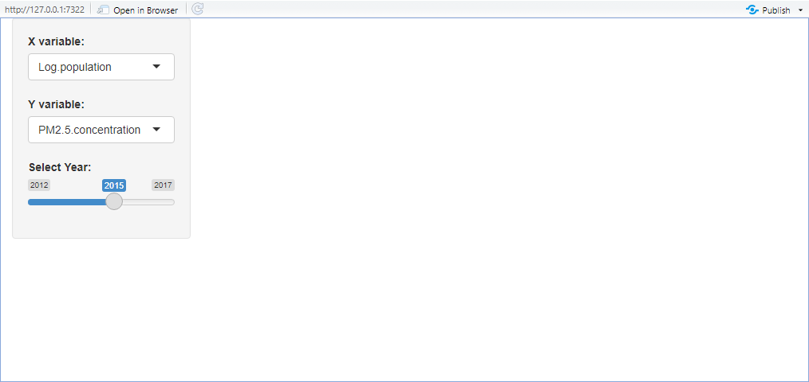</center>

---

### 2. Our first shiny app

#### 2.2. Interactive plot

<ul>
  <li>To do an interactive plot that reacts to these inputs we should:</li>
  <ol>
    <li>Program the plot in a reactive({}) environment for the inputs to be updated</li>
    <li>Put the reactive plot in a render function to render the updated plot</li>
    <li>Include the resulting output in the user interface</li>
  </ol>
</ul>

--

 * Because in aes() `input$xvar` and `input$yvar` should be treated as variable names instead of strings, they should be put in the `get()` function

--

```{r, eval = F}
server <- function(input, output) {
  
  reactive_plot <- reactive({
    ggplot(dep_data %>% filter(Year == input$year), 
           aes(x = get(input$xvar), y = get(input$yvar))) +
      geom_point(alpha = .6) + geom_smooth(method = "lm", se = F) + 
      xlab(input$xvar) + ylab(input$yvar)
  })
   output$plot <- renderPlot({reactive_plot()})
}
```

---

### 2. Our first shiny app

#### 2.2. Interactive plot

 * Adding `plotOutput("plot")` in the `mainPanel()` ui function we get:
 
<center>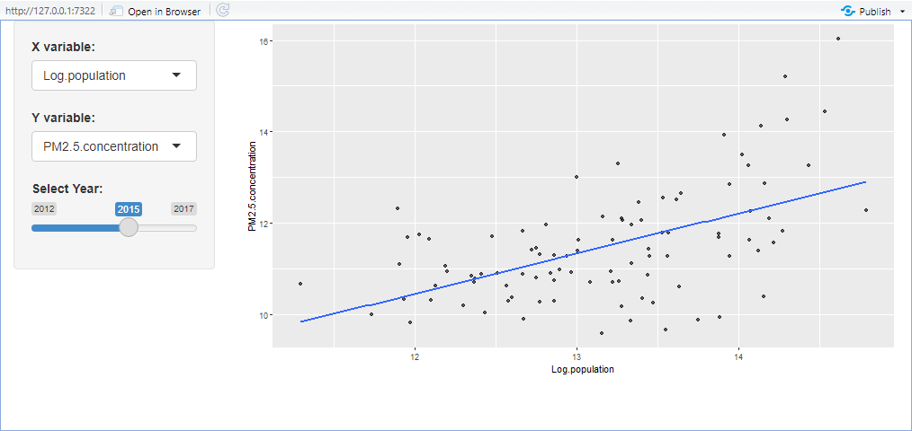</center>

---

### 2. Our first shiny app

#### 2.2. Interactive plot

<ul>
  <li>But we can make the graph even more interactive using the <b>plotly</b> package</li>
  <ul>
    <li>It allows to have information on a data point in a tooltip on hover</li>
  </ul>
</ul>

--

<ul>
  <li>In the reactive({}) environment we should:
</ul>

<p style = "margin-bottom:2.67cm;"></p>

```{r, eval = F}
#
   ggplot(dep_data %>% filter(Year == input$year),
          aes(x = get(input$xvar), y = get(input$yvar))) +
     geom_point(alpha = .6) +
#
#
#
     geom_smooth(method = "lm", se = F) + xlab(input$xvar) + ylab(input$yvar)
#
#            
```

---

### 2. Our first shiny app

#### 2.2. Interactive plot

<ul>
  <li>But we can make the graph even more interactive using the <b>plotly</b> package</li>
  <ul>
    <li>It allows to have information on a data point in a tooltip on hover</li>
  </ul>
</ul>


<ul>
  <li>In the reactive({}) environment we should:
  <ol>
    <li>Put the ggplot in the ggplotly() function</li>
  </ol>
</ul>

<p style = "margin-bottom:1.97cm;"></p>

```{r, eval = F}
*ggplotly(
   ggplot(dep_data %>% filter(Year == input$year),
          aes(x = get(input$xvar), y = get(input$yvar))) +
     geom_point(alpha = .6) +
#
#
#
     geom_smooth(method = "lm", se = F) + xlab(input$xvar) + ylab(input$yvar)
#
*)
```

---

### 2. Our first shiny app

#### 2.2. Interactive plot

<ul>
  <li>But we can make the graph even more interactive using the <b>plotly</b> package</li>
  <ul>
    <li>It allows to have information on a data point in a tooltip on hover</li>
  </ul>
</ul>

<ul>
  <li>In the reactive({}) environment we should:
  <ol>
    <li>Put the ggplot in the ggplotly() function</li>
    <li>Format the tooltip as the 'text' axis in aes()</li>
  </ol>
</ul>

<p style = "margin-bottom:1.25cm;"></p>

```{r, eval = F}
*ggplotly(
   ggplot(dep_data %>% filter(Year == input$year),
          aes(x = get(input$xvar), y = get(input$yvar))) +
     geom_point(alpha = .6,
*               aes(text = paste0(Department, "<br>",
*                                 input$xvar, ": ", round(get(input$xvar), 2), "<br>",
*                                 input$yvar, ": ", round(get(input$yvar), 2)))) + 
     geom_smooth(method = "lm", se = F) + xlab(input$xvar) + ylab(input$yvar)
#
*)
```

---

### 2. Our first shiny app

#### 2.2. Interactive plot

<ul>
  <li>But we can make the graph even more interactive using the <b>plotly</b> package</li>
  <ul>
    <li>It allows to have information on a data point in a tooltip on hover</li>
  </ul>
</ul>

<ul>
  <li>In the reactive({}) environment we should:
  <ol>
    <li>Put the ggplot in the ggplotly() function</li>
    <li>Format the tooltip as the 'text' axis in aes()</li>
    <li>Assign the text axis to the tooltip argument of ggplotly()</li>
  </ol>
</ul>

```{r, eval = F}
*ggplotly(
   ggplot(dep_data %>% filter(Year == input$year),
          aes(x = get(input$xvar), y = get(input$yvar))) +
     geom_point(alpha = .6,
*               aes(text = paste0(Department, "<br>",
*                                 input$xvar, ": ", round(get(input$xvar), 2), "<br>",
*                                 input$yvar, ": ", round(get(input$yvar), 2)))) + 
     geom_smooth(method = "lm", se = F) + xlab(input$xvar) + ylab(input$yvar),
*  tooltip = "text"
*)
```

---

### 2. Our first shiny app

#### 2.2. Interactive plot

<ul>
  <li>We also have to:</li>
  <ul>
    <li>Replace the server renderPlot() function by <b>renderPlotly()</b></li>
    <li>Replace the UI plotOutput() function by <b>plotlyOutput()</b></li>
  </ul>
</ul>

--

<center>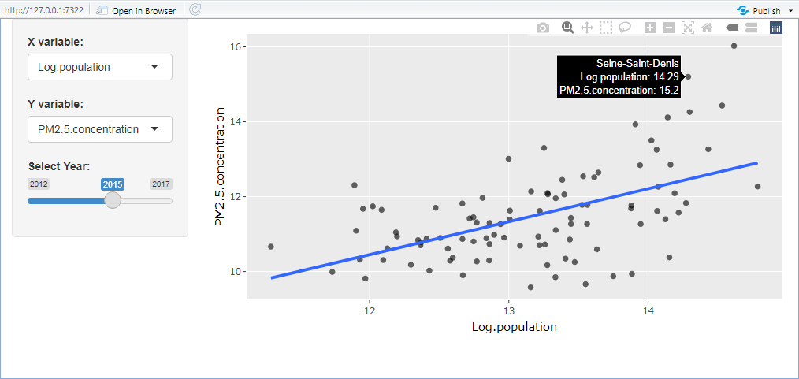</center>

---

### 2. Our first shiny app

#### 2.3. Interactive regression results

<ul>
  <li>We can also include an interactive regression table</li>
  <ul>
    <li>We should put the <b>stargazer()</b> function in a reactive({}) environment:</li>
  </ul>
</ul>

--

```{r, eval = F}
reg_table <- reactive({
  
  stargazer(lm(formula(paste0(c(input$yvar, input$xvar), collapse = "~")), 
               dep_data %>% filter(Year == input$year)), type  = "html",
            dep.var.labels = input$yvar, keep.stat = c("n", "rsq"))
    
})
```

--

<p style = "margin-bottom:.5cm;"></p>

<ul>
  <ul>
    <li>Then use the render function dedicated to console output: <b>renderPrint():</b></li>
  </ul>
</ul>
 
```{r, eval = F}
output$reg_table <- renderPrint({reg_table()})
```

--

<p style = "margin-bottom:.5cm;"></p>

<ul>
  <ul>
    <li>And use the <b>htmlOuput()</b> UI output function in a column layout to put it side to side with the plot:</li>
  </ul>
</ul>

```{r, eval = F}
mainPanel(width = 9, column(7, plotlyOutput("plot")), column(5, htmlOutput("reg_table")))
```

---

### 2. Our first shiny app

#### 2.3. Interactive regression results
  
<center>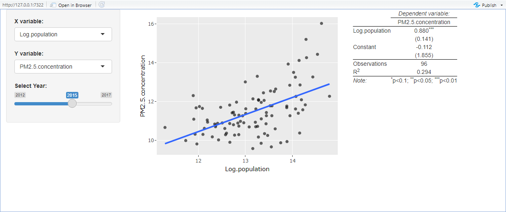</center>

---

### Overview

<p style = "margin-bottom:1.25cm;">

#### 1. Introduction to shiny apps &#10004;
<p style = "margin-bottom:-.5cm;">
 * 1.1. General structure
 * 1.2. User interface
 * 1.3. Server
 * 1.4. Layout

#### 2. Our first shiny app &#10004;
<p style = "margin-bottom:-.5cm;">
 * 2.1. Import data in Shiny
 * 2.2. Interactive plot
 * 2.3. Interactive regression results

#### 3. More advanced tools
<p style = "margin-bottom:-.5cm;">
 * 3.1. Input randomization
 * 3.2. HTML formatting
 
#### 4. Wrap up!

---

### Overview

<p style = "margin-bottom:1.25cm;">

#### 1. Introduction to shiny apps &#10004;
<p style = "margin-bottom:-.5cm;">
 * 1.1. General structure
 * 1.2. User interface
 * 1.3. Server
 * 1.4. Layout

#### 2. Our first shiny app &#10004;
<p style = "margin-bottom:-.5cm;">
 * 2.1. Import data in Shiny
 * 2.2. Interactive plot
 * 2.3. Interactive regression results

#### 3. More advanced tools 
<p style = "margin-bottom:-.5cm;">
 * 3.1. Input randomization
 * 3.2. HTML formatting

---

### 3. More advanced tools

#### 3.1. Input randomization

&#10140; A nice feature would be a button to <b>randomly select</b> the x and y <b>variables</b> and the year

--

 * Adding a button is easy, we can simply add an `actionButton()` widget in the control panel:

--

```{r, eval = F}
ui <- fluidPage(
  sidebarLayout(
    sidebarPanel(...,
*     actionButton(inputId = "random", label = "Random selection")
    ), 
    mainPanel(...)
  )
)
```

--

<ul>
  <li>But what should happen in the server when clicking on it is different from what we're used to:</li>
  <ul>
    <li>We do not want a reactive output to place in the UI</li>
    <li>We want the selected inputs to change</li>
  </ul>
</ul>

--

<center><i><b>&#10140; This is why we're gonna use observeEvent() instead of reactive()</b></i></li>

---

### 3. More advanced tools

#### 3.1. Input randomization
 
<ul>
  <li>The arguments of <b>observeEvent()</b> are:</li>
  <ul>
    <li>The <b>id</b> of the input that should trigger the actions</li>
    <li>The <b>actions</b> to take when the input is triggered</li>
  </ul>
</ul>

--

```{r, eval = F}
observeEvent(input$random, {
    # SELECT RANDOM INPUTS
})
```

--

<ul>
  <li>The action we want is to change the status of the input widgets</li>
  <ul>
    <li>This can be done with functions of the form <b>update[SelectInput/SliderTextInput/...]()</b></li>
    <li>The first argument should be "session"</li>
    <li>And the following arguments are those of the widget that we can update</li>
  </ul>
</ul>
 
--

```{r, eval = F}
updateSelectInput(session, inputId = "xvar", label = "X variable:", 
                  choices = depvars, selected = sample(depvars, 1))
```
 
--

`sample(depvars, 1)` picks 1 variable name randomly from the vector `depvars`
 
---

### 3. More advanced tools

#### 3.1. Input randomization

 * For it to work, the `session` argument should also be added to the `server()` function

```{r, eval = F}
server <- function(input, output, session) {
  
  ...
  
  observeEvent(input$random, {
    
    updateSelectInput(session, inputId = "xvar", label = "X variable:", 
                      choices = depvars, selected = sample(depvars, 1))
    
    updateSelectInput(session, inputId = "yvar", label = "Y variable:",
                      choices = depvars, selected = sample(depvars, 1))
    
    updateSliderTextInput(session, inputId = "year", label = "Select Year:",
                          choices = 2012:2017, selected = sample(2012:2017, 1))
    
  })
  
}
```

---

### 3. More advanced tools

#### 3.1. Input randomization
 
<center>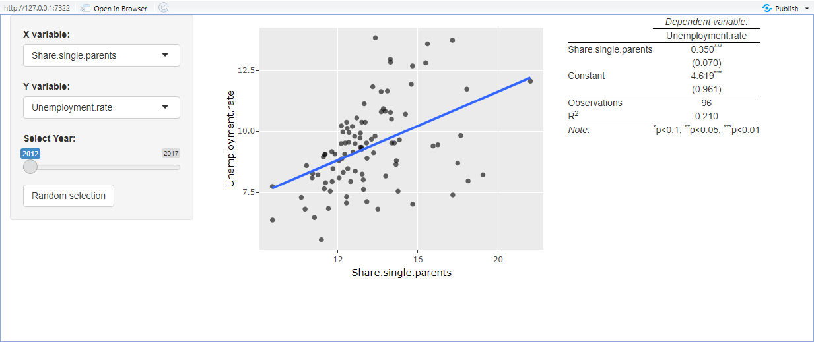</center>
 
---

### 3. More advanced tools

#### 3.2. HTML formatting

<ul>
  <li>We can apply the final touch to our application by including some <b>html formatting</b></li>
  <ul>
    <li>To include html in the UI we can simply use the <b>HTML()</b> function</li>
  </ul>
</ul>

--

<p style = "margin-bottom:.7cm;"></p>

<center><h4>Some html tags</h4></center>

<p style = "margin-bottom:-.75cm;"></p>

.pull-left[


```{r, results='asis'}
HTML("<b>Text</b>")
HTML("<i>Text</i>")
HTML("<center>Text</center>")
```

]
 
.pull-right[

```{r}
HTML("<h1>Text</h1>")
HTML("<h3>Text</h3>")
```

]

---

### 3. More advanced tools

#### 3.2. HTML formatting
 
```{r, eval = F}
ui <- fluidPage(
  
* HTML("<center><h2>Relationships between department characteristics</h2></center><br><br>"),
  
  sidebarLayout(
    sidebarPanel(width = 3,
                 
*     HTML("<center><h4><b>Select inputs</b></h4></center><br>"),
      
      selectInput(...), selectInput(...), sliderTextInput(...),
      
*     HTML("<br><br><center>"), actionButton(...), HTML("</center><br>")
    ), 
    
    mainPanel(width = 9,
*             HTML("<center><h4><b>Regression results</b></h4></center>"),
              column(width = 7, plotlyOutput("plot")),
*             column(width = 5, HTML("<br><br><br><br><br>"), htmlOutput("reg_table")))
  )
)
```
 
---

### 3. More advanced tools

#### 3.2. HTML formatting
 
<center><a href="https://sirugue.shinyapps.io/lecture15/">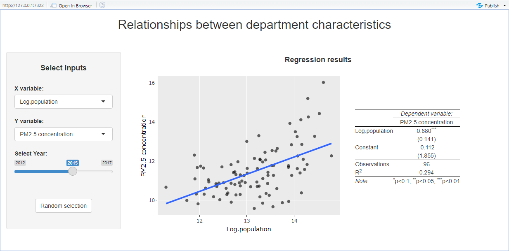</a></center>

---

### Overview

<p style = "margin-bottom:1.25cm;">

#### 1. Introduction to shiny apps &#10004;
<p style = "margin-bottom:-.5cm;">
 * 1.1. General structure
 * 1.2. User interface
 * 1.3. Server
 * 1.4. Layout

#### 2. Our first shiny app &#10004;
<p style = "margin-bottom:-.5cm;">
 * 2.1. Import data in Shiny
 * 2.2. Interactive plot
 * 2.3. Interactive regression results

#### 3. More advanced tools &#10004;
<p style = "margin-bottom:-.5cm;">
 * 3.1. Input randomization
 * 3.2. HTML formatting
 
#### 4. Wrap up!

---

### 4. Wrap up!
 
#### General structure

<p style = "margin-bottom:-1cm;"></p>

<center><b>A shiny app is composed of</b></center>

--

<p style = "margin-bottom:.75cm;"></p>

.pull-left[
<center>A <b>user interface</b> function</center>

<ul>
  <li>It is what is displayed to the user</li>
  <ul>
    <li></li>
    <li></li>
  </ul>
</ul>
 
```{r, eval = F}
library(shiny)

ui <- fluidPage(
  
  #
  #
  #
  #
  #
  
  #  
  
)
```
]

--

.pull-left[
<center>A <b>server</b> function</center>

<ul>
  <li>It is what should be computed in the background</li>
  <ul>
    <li></li>
    <li></li>
  </ul>
</ul>

```{r, eval = F}
server <- function(input, output) {
  
  #
  #
  #
  
  #
  
}

shinyApp(ui = ui, server = server)

# The file should be named app.R
```
]

---

### 4. Wrap up!
 
#### General structure

<p style = "margin-bottom:-1cm;"></p>

<center><b>A shiny app is composed of</b></center>

<p style = "margin-bottom:.75cm;"></p>

.pull-left[
<center>A <b>user interface</b> function</center>

<ul>
  <li>It is what is displayed to the user, including:</li>
  <ul>
    <li><b>Input widgets</b></li>
    <li></li>
  </ul>
</ul>
 
```{r, eval = F}
library(shiny)

ui <- fluidPage(
  
  checkboxGroupInput(
    inputId = "boxes",
    label = "Boxes to check",
    choices = c("A", "B", "C"),
    selected = "B"),
  
  #  
  
)
```
]

.pull-left[
<center>A <b>server</b> function</center>

<ul>
  <li>It is what should be computed in the background</li>
  <ul>
    <li></li>
    <li></li>
  </ul>
</ul>

```{r, eval = F}
server <- function(input, output) {
  
  #
  #
  #
  
  #
  
}

shinyApp(ui = ui, server = server)

# The file should be named app.R
```
]

---

### 4. Wrap up!
 
#### General structure

<p style = "margin-bottom:-1cm;"></p>

<center><b>A shiny app is composed of</b></center>

<p style = "margin-bottom:.75cm;"></p>

.pull-left[
<center>A <b>user interface</b> function</center>

<ul>
  <li>It is what is displayed to the user, including:</li>
  <ul>
    <li><b>Input widgets</b></li>
    <li></li>
  </ul>
</ul>
 
```{r, eval = F}
library(shiny)

ui <- fluidPage(
  
  checkboxGroupInput(
    inputId = "boxes",
    label = "Boxes to check",
    choices = c("A", "B", "C"),
    selected = "B"),
  
  #  
  
)
```
]

.pull-left[
<center>A <b>server</b> function</center>

<ul>
  <li>It is what should be computed in the background:</li>
  <ul>
    <li>Update inputs with <b>reactive({})</b></li>
    <li></li>
  </ul>
</ul>

```{r, eval = F}
server <- function(input, output) {
  
  react_tb <- reactive({
    tibble(selected = input$boxes)
  })
  
  #
  
}

shinyApp(ui = ui, server = server)

# The file should be named app.R
```
]

---

### 4. Wrap up!
 
#### General structure

<p style = "margin-bottom:-1cm;"></p>

<center><b>A shiny app is composed of</b></center>

<p style = "margin-bottom:.75cm;"></p>

.pull-left[
<center>A <b>user interface</b> function</center>

<ul>
  <li>It is what is displayed to the user, including:</li>
  <ul>
    <li><b>Input widgets</b></li>
    <li></li>
  </ul>
</ul>
 
```{r, eval = F}
library(shiny)

ui <- fluidPage(
  
  checkboxGroupInput(
    inputId = "boxes",
    label = "Boxes to check",
    choices = c("A", "B", "C"),
    selected = "B"),
  
  #  
  
)
```
]

.pull-left[
<center>A <b>server</b> function</center>

<ul>
  <li>It is what should be computed in the background:</li>
  <ul>
    <li>Update inputs with <b>reactive({})</b></li>
    <li>Render output with <b>render[Table/Plot/...]()</b></li>
  </ul>
</ul>

```{r, eval = F}
server <- function(input, output) {
  
  react_tb <- reactive({
    tibble(selected = input$boxes)
  })
  
  output$table <- renderTable({react_tb()})
  
}

shinyApp(ui = ui, server = server)

# The file should be named app.R
```
]

---

### 4. Wrap up!
 
#### General structure

<p style = "margin-bottom:-1cm;"></p>

<center><b>A shiny app is composed of</b></center>

<p style = "margin-bottom:.75cm;"></p>

.pull-left[
<center>A <b>user interface</b> function</center>

<ul>
  <li>It is what is displayed to the user, including:</li>
  <ul>
    <li><b>Input widgets</b></li>
    <li><b>Reactive outputs</b></li>
  </ul>
</ul>
 
```{r, eval = F}
library(shiny)

ui <- fluidPage(
  
  checkboxGroupInput(
    inputId = "boxes",
    label = "Boxes to check",
    choices = c("A", "B", "C"),
    selected = "B"),
  
  tableOutput("table")
  
)
```
]

.pull-left[
<center>A <b>server</b> function</center>

<ul>
  <li>It is what should be computed in the background:</li>
  <ul>
    <li>Update inputs with <b>reactive({})</b></li>
    <li>Render output with <b>render[Table/Plot/...]()</b></li>
  </ul>
</ul>

```{r, eval = F}
server <- function(input, output) {
  
  react_tb <- reactive({
    tibble(selected = input$boxes)
  })
  
  output$table <- renderTable({react_tb()})
  
}

shinyApp(ui = ui, server = server)

# The file should be named app.R
```
]

---

### 4. Wrap up!

.left-column[
```{r, eval = F}
library(shiny)
#
#

ui <- fluidPage(
#
#
#
#
#
)

server <- function(input, output) {
#
#
#
#
#
}

shinyApp(ui = ui, server = server)
```

]

---

### 4. Wrap up!

.left-column[
```{r, eval = F}
library(shiny)
#
data(iris) 

ui <- fluidPage(
  selectInput(inputId = "x", label = "Select X variable:", 
              choices = names(iris), selected = names(iris)[1]),
  selectInput(inputId = "y", label = "Select Y variable:", 
              choices = names(iris), selected = names(iris)[2]),
#
)

server <- function(input, output) {
#
#
#
#
#
}

shinyApp(ui = ui, server = server)
```

]

---

### 4. Wrap up!

.left-column[
```{r, eval = F}
library(shiny)
library(tidyverse)
data(iris) 

ui <- fluidPage(
  selectInput(inputId = "x", label = "Select X variable:", 
              choices = names(iris), selected = names(iris)[1]),
  selectInput(inputId = "y", label = "Select Y variable:", 
              choices = names(iris), selected = names(iris)[2]),
#
)

server <- function(input, output) {
  reactive_plot <- reactive({
    ggplot(iris, aes(x = get(input$x), y = get(input$y))) +
      geom_point() + xlab(input$x) + ylab(input$y)
  })
#
}

shinyApp(ui = ui, server = server)
```

]

---

### 4. Wrap up!

.left-column[
```{r, eval = F}
library(shiny)
library(tidyverse)
data(iris) 

ui <- fluidPage(
  selectInput(inputId = "x", label = "Select X variable:", 
              choices = names(iris), selected = names(iris)[1]),
  selectInput(inputId = "y", label = "Select Y variable:", 
              choices = names(iris), selected = names(iris)[2]),
#
)

server <- function(input, output) {
  reactive_plot <- reactive({
    ggplot(iris, aes(x = get(input$x), y = get(input$y))) +
      geom_point() + xlab(input$x) + ylab(input$y)
  })
  output$plot <- renderPlot({reactive_plot()})
}

shinyApp(ui = ui, server = server)
```

]

---

### 4. Wrap up!

.left-column[
```{r, eval = F}
library(shiny)
library(tidyverse)
data(iris) 

ui <- fluidPage(
  selectInput(inputId = "x", label = "Select X variable:", 
              choices = names(iris), selected = names(iris)[1]),
  selectInput(inputId = "y", label = "Select Y variable:", 
              choices = names(iris), selected = names(iris)[2]),
  plotOutput("plot")
)

server <- function(input, output) {
  reactive_plot <- reactive({
    ggplot(iris, aes(x = get(input$x), y = get(input$y))) +
      geom_point() + xlab(input$x) + ylab(input$y)
  })
  output$plot <- renderPlot({reactive_plot()})
}

shinyApp(ui = ui, server = server)
```

]

--

.right-column[
<center>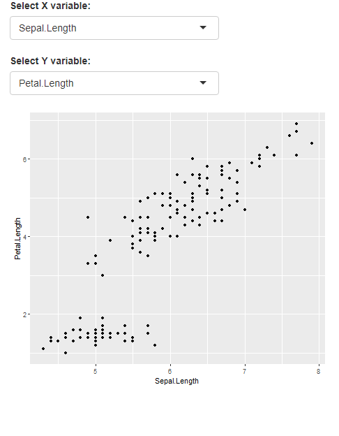</center>
]
