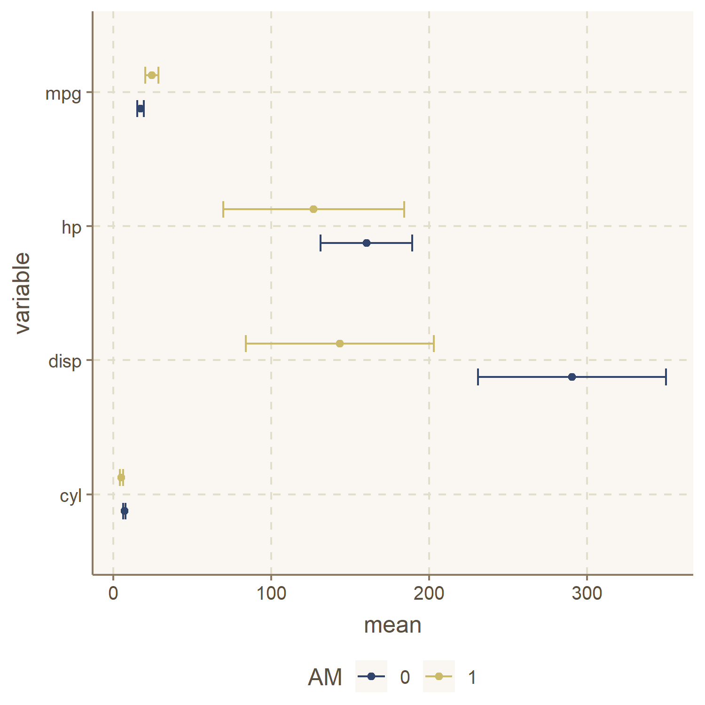

<style type="text/css"> h1.title {text-align: center;} h4.author {text-align: center;} h4.date {color: DarkBlue; text-align: center;} h3 {margin-top: 1cm; font-weight: bold; font-size: 1.15em;} p {margin-top: .5cm; font-size: 1.15em;}</style><br>

***

### Guidelines:

 * This homework can be done by **groups of 2 at most**. 
 * Write your **answers directly in this .Rmd** file, which must compile without errors. 
 * Make sure that your answers are unambiguous and that your code is annotated with comments. 
 * You can write either in English or in French.
 * Save and knit your file regularly to avoid any last-minute technical inconvenience. 
 * Both the .Rmd and the knitted .html or .pdf should be sent in a **.zip by email** (louis.sirugue@psemail.eu)
   * If you are not familiar with .zip files, first download and install [winRAR](https://www.win-rar.com/).
   * Then select your .Rmd and .html files > right click > Add to archive > select ''zip'' and save.
 * Deadline: **Sunday the 16<sup>th</sup> of October 2022, 23:59**.
 * Late submissions will be penalized by half a point for each 30min beyond the deadline.
 * The number of points associated with each question is indicative and may be subject to modifications.  

This homework covers the material from lectures 1 to 5. I encourage you to start **working on it progressively** as we go through the course. Contrarily to the online quizzes, this homework is meant to be challenging. **Partial answers will be taken into account**, so if you cannot do everything, **write down your thought process**.

***

## Context:

This homework consists in analyzing data from a survey conducted for the academic article available [here](https://eml.berkeley.edu/~saez/kuziemko-norton-saez-stantchevaAER15.pdf). In this article, authors study individuals' **preferences regarding income redistribution**, and how these preferences may vary if individuals are more or less aware of the extent and consequences of income inequality.  

Authors conducted an online survey in which respondents had to answer to two waves of questions:  

 * **Wave 1: General information:** gender, age, education, marital status, household income, ...
 * **Wave 2: Questions on income inequality/redistribution:** if inequality is a problem, if high incomes deserve their income, whether income is due to effort or luck, ...  
 
Each participant to the survey was allocated to one of **two groups:** either to the **control** group, or to the **treatment** group. Between the two waves of questions, **information** on the extent and consequences of income inequality **were given to individuals in the treatment group** but not to individuals in the control group.  

## Data:

The datasets for this homework are available at [this webpage](https://www.aeaweb.org/articles?id=10.1257/aer.20130360). To **download the data** you will have to create an ICPSR account. You can do it with your @psl.eu address. You will also find an **Online Appendix** containing documentation on the experiment and the dataset, including the questions and possible answers of the survey.

## Questions: 

### 1) Load the `haven` package and import the file `Inequality_AER_Omnibus.dta` using the dedicated function (/1)

*Note:* `.dta` *data imported with haven often come with labels. These labels can cause errors when reshaping the data with* `pivot_longer()` *and plotting the data with* `ggplot()`. *You can remove these labels at any point using the function* `zap_labels()`.

```{r}
# Write your answer here
```


### 2) Use the `filter()` function from `dplyr` to keep only individuals older than 18, who finished the survey, and who belong either to the `Treatment Group` or `Control` group. (/1)

```{r}
# Write your answer here
```


### 3) Given the answers of the survey, do people with higher household income tend to be more or less satisfied with their income? (/1)

```{r}
# Write your answer here
```

Write your answer here  

### 4) We are interested in knowing whether or not treated individuals answered differently to the questions *'Inequality is a problem?'*, *'Inequality has increased?'*, and *'Do you think high incomes deserve their income?'*. Find out a convenient way to summarise the 3 corresponding variables into their mean, their standard deviation, and their number of non-missing values, separately for the treatment and control group. Display your results in a good-looking table. (/2)

```{r}
# Write your answer here
```

### 5) Write down the formula of the standard error of the mean using a LaTeX equation, and compute the 97% confidence interval of each mean. (/2)

$$\text{Write your answer here}$$

```{r}
# Write your answer here
```

### 6) Produce a graph like the following one to represent the mean and confidence interval of the three variables separately for the two groups. Do you notice a specific pattern? (/3)  

{width=60%}

```{r}
# Write your answer here
```

Write your answer here

### 7) Consider the mean of the variable `inequality_increase` for the treatment group. What is the confidence level below which you would not consider, and above which you would consider, that this mean value could be equal to 2.75. (/3)

*Hint: While* `qt(proba, df)` *gives the t-stat corresponding to a given probability to fall below this t-stat in a Student t distribution with a given number of degrees of freedom,* `pt(t_stat, df)` *gives the probability to fall below a given t-stat in a Student t distribution with a given number of degrees of freedom.*

```{r}
# Write your answer here
```

Write your answer here  

### 8) We would like to know whether the difference in opinion on *'deserving'* between the control and the treatment group persisted over time. A followup survey has been conducted, and the results are stored in `Inequality_AER_Followup.dta`. In this dataset, variables from the follow up survey end with the suffix `_s2`. Import the followup dataset, keep only the variables you need, and join it to the omnibus data. (/1)

```{r}
# Write your answer here
```

### 9) Compute the fraction of the initial sample that appears in the followup dataset, and the response rate to the *'deserving'* question in the followup survey. (/1)

```{r}
# Write your answer here
```

### 10) Would you conclude that the difference in opinion on *'deserving'* between the control and the treatment group persisted over time? (/2)

```{r}
# Write your answer here
```

Write your answer here

### 11) Make the best graph you can using the variables of your choice. The graph should be preceded by a description of the variables used, both in words and using appropriate statistics. The aim of the graph can be to document a relationship that has not been explored in this homework, to investigate the heterogeneity of a relationship that was studied in the homework, etc. The graph should be clear and relevant. The interest of your graph could lie in how efficient it is to convey a story about your data, or in how it helps uncover underlying patterns in your data. (/3)

*If you do not find inspiration with the variables available in the dataset, feel free to do this exercise using variables from another dataset (from the list below or other sources). Using another dataset will not grant extra points, but if it helps you making an interesting graph it can be worth it.*

 * [data.gouv.fr](https://www.data.gouv.fr/)
 * [data.gov](https://www.data.gov/)
 * [data.oecd.org](https://data.oecd.org/)
 * [data.worldbank.org](https://data.worldbank.org/)
 * [ec.europa.eu](https://ec.europa.eu/eurostat/web/main/data/database) 
 * [www.bfi.org.uk](https://www.bfi.org.uk/industry-data-insights)
 * [apps.who.int](https://apps.who.int/gho/data/node.home)
 * [dataverse.harvard.edu](https://dataverse.harvard.edu/)
 * [archive.ics.uci.edu](https://archive.ics.uci.edu/ml/datasets.php)
 * [kaggle.com](https://www.kaggle.com/datasets)
 * [datahub.io](https://datahub.io/collections)
 * [wid.world](https://wid.world/data/)
 * [opportunityinsights.org](https://opportunityinsights.org/data/)
 * ...
