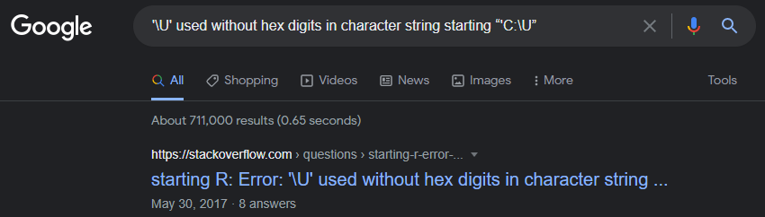

```{css, echo = F, eval = F}
body{background-color:black;filter:invert(1)}
```

```{r setup, include = FALSE}
source(paste0(getwd(), "/../source/style.R"))
stargazer <- stargazer::stargazer
theme_minimal <- theme_Rcourse
options(htmltools.dir.version = F)
knitr::opts_chunk$set(echo = T, message = F, warning = F, fig.align = "center")
```

### Welcome to the course!

--

<p style = "margin-bottom:-.75cm;"></p>

.pull-left[

#### About me:

<p style = "margin-bottom:1.5cm;"></p>

<ul>
  <li style = "margin-bottom:.75cm;">PhD student at the Paris School of Economics</li>
  <li>I work primarily on:</li>
  <ul>
    <li>Intergenerational (income) mobility</li> 
    <li>Residential segregation</li>
    <li style = "margin-bottom:.75cm;">Discrimination</li>
  </ul>
  <li style = "margin-bottom:.75cm;">I do empirical research, so I use Econometrics and (R) programming on a daily basis</li>
  <li>You can reach me at <a href="mailto:louis.sirugue@psemail">louis.sirugue@psemail</a> for any question or comment about the course</li>
</ul>
]

--

.pull-right[

#### About the course:

<p style = "margin-bottom:-.25cm;"></p>

<ul>
  <li><b>Objective:</b></li>
  <ul>
    <li style = "margin-bottom:.3cm;">Give you the necessary statistical and data visualization tools to perform data analyses</li>
  </ul>

  <li><b>Prerequisites:</b></li>
  <ul>
    <li style = "margin-bottom:.3cm;">None (middle-school maths level)</li>
  </ul>

  <li><b>What you'll learn:</b></li>
  <ul>
    <li>Find and manipulate data</li>
    <li>Summarize data with relevant statistics and compelling graphics</li>
    <li style = "margin-bottom:.3cm;">Carry out an empirical research project</li>
  </ul>

  <li><b>Thus, this course is a mix of:</b></li>
  <ul>
    <li>Programming on R</li>
    <li>Basic Statistics</li>
    <li>Introductory Econometrics</li>
  </ul>
</ul>
]


---

### First semester

#### Course format:

<p style = "margin-bottom:-.25cm;">

<p style = "margin-left:.5cm;"> &#10140; 15 formal lectures divided into 3 parts:</p>
<p style = "margin-bottom:-.25cm;">

--

<ol style = "padding-left:4em">
  <li>Introduction to R Programming </li>
  <li>Data analysis</li>
  <li>Data visualization</li>
</ol>
 
--

<p style = "margin-bottom:1cm;">

#### Grading:

<p style = "margin-bottom:-.25cm;">

<ul>
  <li>Weekly short online quizzes (25% of the grade) </li>
  <ul>
    <li>5 shorts questions related to the content of the previous class </li>
    <li>The quiz opens at the end of the lecture and closes at the beginning of the following one</li>
    <li>Possibility to retry the quiz as many times as you want before submitting</li>
  </ul>
</ul> 

--

<p style = "margin-bottom:.15cm;">
  
<ul>
  <li>Homeworks (3, one for each part, 25% of the grade each)</li>
  <ul>
    <li>Homeworks are already available <a href="https://louissirugue.github.io/data-analysis-course/home.html">here</a>, work on it progressively as we go through the course </li>
  </ul>
</ul>

---

### Second semester

#### Course format:

<p style = "margin-bottom:-.25cm;">

<ul>
  <li style = "margin-bottom:.25cm;">Apart from 2 refreshers at the beginning, the whole semester will be dedicated to you research projects </li>
  <li style = "margin-bottom:.25cm;">At each session a T.A. will guide you through the research process </li>
  <ul>
    <li>From framing a relevant question and finding appropriate data </li>
    <li>To the final details of your data analysis</li>
  </ul>
</ul> 

<p style = "margin-bottom:1cm;">

--

#### Grading:
<ul>
  <li style = "margin-bottom:.25cm;">Basically the whole grade will be based on your research project </li>
  <li style = "margin-bottom:.25cm;">The detailed (indicative) grading scheme is available <a href="https://louissirugue.github.io/data-analysis-course/project/grading.html">here</a>. </li>
</ul> 

--

<p style = "margin-bottom:1.75cm;">

<center><h3 style = "font-size: 20pt;"><i> &#10140; Visit the <a href="https://louissirugue.github.io/data-analysis-course/home.html">course webpage</a> for more detail, everything's there!</i></h3></center>

---

<h3>Let's delve into it!</h3>

.pull-left[
#### 1. Getting started
<p style = "margin-bottom:-.5cm;">
 * 1.1. About R
 * 1.2. The R Studio environment

#### 2. Classes of R objects
<p style = "margin-bottom:-.5cm;">
 * 2.1. Numeric values
 * 2.2. Character values
 * 2.3. Logical values
 * 2.4. Manipulate classes

#### 3. Vectors
<p style = "margin-bottom:-.5cm;">
 * 3.1. Definition
 * 3.2. Operations with vectors
 * 3.3. Useful functions
 * 3.4. Classes of vectors
]

.pull-right[
#### 4. Functions and packages
<p style = "margin-bottom:-.5cm;">
 * 4.1. Functions
 * 4.2. Packages

#### 5. A few words on learning R

#### 6. Wrap up!
]

---

<h3>Let's delve into it!</h3>

.pull-left[
#### 1. Getting started
<p style = "margin-bottom:-.5cm;">
 * 1.1. About R
 * 1.2. The R Studio environment
]

---

### 1. Getting started

#### 1.1. About R

 * R is a **programming language** and free software environment for **statistical computing and graphics**

--

<p style = "margin-bottom:.75cm;"></p>

<ul>
 <li style = "margin-bottom:.25cm;">The R language is widely (and increasingly) used in <b>academic and non-academic research</b> in fields like:</li>
   <ul>
     <li>Economics</li>
     <li>Statistics</li>
     <li>Biostats</li>
   </ul>
</ul>

--

<p style = "margin-bottom:.75cm;"></p>

<ul>
 <li style = "margin-bottom:.25cm;">Things you can do with R:</li>
   <ul>
     <li><a href="https://louissirugue.github.io/data-analysis-course/project/example.html">Reports</a></li>
     <li><a href="https://www.r-graph-gallery.com/bubble_chart_interactive_ggplotly.html">Nice plots</a></li>
     <li><a href="https://louissirugue.github.io/data-analysis-course/home.html">All the material of this course</a></li>
     <li><a href="https://pubs.aeaweb.org/doi/pdfplus/10.1257/app.20200447">Academic research</a></li>
     <li><a href="https://www.kaggle.com/xavierconort">Win kaggle competitions</a></li>
     <li><a href="https://vac-lshtm.shinyapps.io/ncov_tracker/?_ga=2.29922175.1739025613.1656421238-871875772.1628005923">Interactive data visualization</a></li>
     <li><a href="https://www.data-to-art.com/">Art</a></li>
   </ul>
</ul>
 
---

### 1. Getting started

#### 1.2. The R studio environment

<center>

</center>

---

### 1. Getting started

#### 1.2. The R studio environment

&#10140; <b>The Console panel</b>

<p style = "margin-bottom:-.3cm;">

 * This is where you **communicate with R**. You can write instructions after the `>`, press enter and R will **execute**  
    - Try with `1+1`:

--

```{r}
1+1
```

--

<p style = "margin-bottom:1cm;">

&#10140; <b>The Source panel</b>

<p style = "margin-bottom:-.3cm;">

* This is where you **write and save your code** (File > New File > R Script) 
 * Separate different commands with a line break 
 * The `#` symbol allows to annotate the code, everything after `#` will be ignored by R until the next line break

--

```{r, results='hide'}
1+1 # Do not put 2+2 on the same line, press enter to go to next line 
2+2
```

---

### 1. Getting started

#### 1.2. The R studio environment

&#10140; <b>The Source panel</b>

<p style = "margin-bottom:-.3cm;">

 * To send the command from the source panel to the console panel:
   1. Highlight the lines you want to execute 
   2. Press `crtl` + `enter`
 * If you do not highlight anything the line of code where your cursor stands will be executed
 * Check the console to see the output of your code
 
--

<p style = "margin-bottom:1cm;">

&#10140; <b>The Environment panel</b>

<p style = "margin-bottom:-.3cm;">

 * Data analysis requires manipulating datasets, vectors, functions, etc. 
    * These **elements are stored in the environment** panel.
 * For instance we can assign a value to an object using `<-`

--

```{r}
x <- 1
```

--

<center><i> &#10140; You now have an object called 'x' in your environment, which takes the value 1</i></center>

---

### 1. Getting started

#### 1.2. The R studio environment

&#10140; <b>The Environment panel</b>

 * Now that the object `x` is stored in your environment, you can use it:

--

```{r}
x + 1
```

--

<p style = "margin-bottom:1cm;">

 * You can also modify that object at any point:

```{r}
x <- x + 1 # What's gonna be the value of x?
```

--

```{r}
x
```


---

### 1. Getting started

<style> .left-column {width: 60%;} .right-column {width: 36%;} </style>

<p style = "margin-bottom:-.7cm;">

.left-column[

#### 1.2. The R studio environment

<p style = "margin-bottom:2cm;">

&#10140; <b>The Files/Plots/... panel</b>

<p style = "margin-bottom:.5cm;">

 * In this panel we'll mainly be interested in the following 4 tabs
   * **Files:** Shows your working directory
   * **Plots:** Where R returns plots
   * **Packages:** A library of tools that we can load if needed
   * **Help:** Where to look for documentation on R functions

<p style = "margin-bottom:1cm;">

 * Enter `?getwd()` in the console to see what a **help file** looks like
   * It **describes** what the command does
   * It **explains** the different parameters of the command
   * It **gives examples** of how to use the command
]

--

.right-column[


]

---

<h3>Overview</h3>


.pull-left[
#### 1. Getting started &#10004;
<p style = "margin-bottom:-.5cm;">
 * 1.1. About R
 * 1.2. The R Studio environment

#### 2. Classes of R objects
<p style = "margin-bottom:-.5cm;">
 * 2.1. Numeric values
 * 2.2. Character values
 * 2.3. Logical values
 * 2.4. Manipulate classes

#### 3. Vectors
<p style = "margin-bottom:-.5cm;">
 * 3.1. Definition
 * 3.2. Operations with vectors
 * 3.3. Useful functions
 * 3.4. Classes of vectors
]

.pull-right[
#### 4. Functions and packages
<p style = "margin-bottom:-.5cm;">
 * 4.1. Functions
 * 4.2. Packages

#### 5. A few words on learning R

#### 6. Wrap up!
]

---

<h3>Overview</h3>

.pull-left[
#### 1. Getting started &#10004;
<p style = "margin-bottom:-.5cm;">
 * 1.1. About R
 * 1.2. The R Studio environment

#### 2. Classes of R objects
<p style = "margin-bottom:-.5cm;">
 * 2.1. Numeric values
 * 2.2. Character values
 * 2.3. Logical values
 * 2.4. Manipulate classes
]

---

### 2. Classes of R objects

<p style = "margin-bottom:1.5cm;">

<center><b>&#10140; There are 3 main classes of R objects</b></center>

--

.pull-left[

<p style = "margin-bottom:1cm;"></p>

<ul style = "margin-left:1cm;">
  <li><b>Numeric values:</b></li>
  <ul>
    <li>42</li>
    <li>-10^3</li>
    <li>2.6879098767</li>
  </ul>
</ul>

<p style = "margin-bottom:1cm;"></p>

<ul style = "margin-left:1cm;">
  <li><b>Character values:</b></li>
  <ul>
    <li>A</li>
    <li>Hello world</li>
    <li>PM2.5</li>
  </ul>
</ul>

<p style = "margin-bottom:1cm;"></p>

<ul style = "margin-left:1cm;">
  <li><b>Logical values:</b></li>
  <ul>
    <li>TRUE (<i>or equivalently</i> T)</li>
    <li>FALSE (<i>or equivalently</i> F)</li>
  </ul>
</ul>

]

--

.pull-right[

<p style = "margin-bottom:2.5cm;">

The class of an object is a <b>key attribute</b>:

<ul style = "margin-left:-2.5cm;">
  <li>Different types of operations are available for different classes of object</li>
</ul>

<ul style = "margin-left:-2.5cm;">
  <li>Objects of different classes may react differently to a same operation</li>
</ul>

<ul style = "margin-left:-2.5cm;">
  <li>Class mistakes is a common source of programming errors</li>
</ul>

]

---

### 2. Classes of R objects

#### 2.1. Numeric values

<center><b>Basic operations with numeric values:</b></center>

--

.pull-left[
 
```{r}
2 + 3 # Addition
```

```{r}
2 - 3 # Subtraction
```

```{r}
2 * 3 # Multiplication
```

```{r}
2 / 3 # Division
```

]

--

.pull-right[

```{r}
2 ^ 2 # Exponent
```

```{r}
4 ^ (1/2) # Root
```

<p style = "margin-bottom:1.5cm;"></p>

 * Store the result of a computation in an object:

```{r}
result <-((2 + 2)^(2 / (2 * 2))) - 2
result
```

]

---

### 2. Classes of R objects

#### 2.2. Character values

<center><b>Character values need to be surrounded by quotation marks (' or ")</b></center>

--

```{r}
language <- "R"
language
```

--

<p style = "margin-bottom:.75cm;"></p>

<center><b>Without quotation marks, R will think that you refer to an object</b></center>

```{r, error=TRUE}
R
```

--

<p style = "margin-bottom:1cm;"></p>

<center><b>Characters are not necessarily letters</b></center>

```{r}
character_string <- "R'{ç^*µ,,,_hi3"
```

---

### 2. Classes of R objects

#### 2.2. Character values

<center><b>Useful functions with characters</b></center>

<p style = "margin-bottom:1cm;"></p>

.pull-left[

<center><b>Combining strings</b></center>

```{r}
paste("Hello", "world") 
```

<p style = "margin-bottom:1cm;"></p>

```{r}
paste("a", "b", "c", sep = "-") 
```

<p style = "margin-bottom:1cm;"></p>

```{r}
paste0("a", "b", "c") 
```

]

--

.pull-right[

<center><b>Splitting strings</b></center>

```{r}
substr("abcdefghijklmnopqrstuvwxyz", 3, 5)
```

<p style = "margin-bottom:1cm;"></p>

```{r}
nchar("Hello world")
```

<p style = "margin-bottom:1cm;"></p>

```{r}
substr("Hello world", 5, nchar("Hello world"))
```

]

---

### 2. Classes of R objects

#### 2.3. Logical values

.pull-left[

A logical value/**Boolean**, is a value that can be either:
 
<p style = "margin-bottom:1.25cm;"></p>
 
<ul><ul><li><b>TRUE</b> (can be abbreviated as <b>T</b>)</li></ul></ul>

```{r}
T
```

<p style = "margin-bottom:1.25cm;"></p>

<ul><ul><li>or <b>FALSE</b> (can be abbreviated as <b>F</b>)</li></ul></ul>

```{r}
F
```

]
 
--

.pull-right[
 
```{r}
2 + 2 == 4 # Equality
```

<p style = "margin-bottom:.75cm;"></p>

```{r}
2 + 2 != 4 # Inequality
```

<p style = "margin-bottom:.75cm;"></p>

```{r}
1 > 2 # Strictly lower/greater
```

<p style = "margin-bottom:.75cm;"></p>

```{r}
2 <= 2 # Weakly lower/greater
```

]

---

### 2. Classes of R objects

#### 2.3. Logical values


.pull-left[

<center><b>And (&) / or (|)</b></center>
 
```{r}
(1 == 1) & (1 == 2) #AND
```

```{r}
(1 == 1) | (1 == 2) #OR
```

```{r}
1 == 1 | (2 == 2 & 1 == 2) #Parentheses matter
```

```{r}
(1 == 1 | 2 == 2) & 1 == 2 #Parentheses matter
```

]

--

.pull-right[

<center><b>Opposite (!)</b></center>
 
```{r}
is.numeric(1)
```

```{r}
!is.numeric(1)
```

```{r}
3 < 2
```

```{r}
!3 < 2
```

]

---

### 2. Classes of R objects

#### 2.4. Manipulate classes

--

<ul>
  <li>It is important to <b>keep in mind the class</b> of the object you are working with because they work differently</li>
  <ul>
    <li>For instance, you can add two numeric values together but not two characters</li>
  </ul>
</ul>

--

<ul>
  <li>You can <b>find the class</b> of an object by hovering your mouse over its name in the environment panel, or using the <b>class()</b> function:</li>
</ul>

--

```{r}
class(2)
```

--

```{r}
class("a")
```

--

```{r}
class(FALSE)
```

---

### 2. Classes of R objects

#### 2.4. Manipulate classes

<ul><li>You can <b>change the class</b> of an object using functions of the form <b>as.[character/numeric/logical]()</b></li></ul>

--

<p style = "margin-bottom:.5cm;"></p>

<center><b>Class conversion table:</b></center>

```{r, echo = F}
tibble(` ` = c("<b>numeric</b>", 
               "<b>character</b>", 
               "<b>logical</b>"),
       `as.numeric()` = c("No effect", 
                          'Converts strings of numbers <br> into numeric values <p style = "margin-bottom:-.25cm;"></p> Returns NA if characters in the string',
                          'Returns 1 if TRUE  <p style = "margin-bottom:-.25cm;"></p> Returns 0 if FALSE'),
       `as.character()` = c("Converts numeric values <br> into strings of numbers", 
                            "No effect", 
                            'Returns "TRUE" if TRUE <p style = "margin-bottom:-.25cm;"></p> Returns "FALSE" if FALSE'),
       `as.logical()` = c('Returns TRUE if != 0 <p style = "margin-bottom:-.25cm;"></p> Returns FALSE if 0', 
                          'Returns TRUE if "T" or"TRUE" <br> Returns FALSE if "F" or "FALSE" <p style = "margin-bottom:-.25cm;"></p> Returns NA otherwise', 
                          "No effect")) %>%
  kable(., caption = "", align = 'lccc', escape = F)
```

<p style = "margin-bottom:.75cm;"></p>

<ul>
  <li><b>NA</b> stands for <i>'Not Available'</i>, it corresponds to a <b>missing value</b></li>
  <ul>
    <li><b>Beware of NAs</b>, it is a common source of programming errors (more on that next week)</li>
  </ul>
</ul>

---

### 2. Classes of R objects

#### 2.4. Manipulate classes

<center><b>Some examples</b></center>

--

.pull-left[

```{r}
as.numeric("2022")
```

```{r}
as.numeric("2022-2023")
```

```{r}
as.numeric(T)
```

```{r}
as.numeric(FALSE)
```

]

--

.pull-right[

```{r}
as.character(2022)
```

```{r}
as.logical(0)
```

```{r}
as.logical(1)
```

```{r}
as.logical(-.75)
```

]

---

<h3>Overview</h3>

.pull-left[
#### 1. Getting started &#10004;
<p style = "margin-bottom:-.5cm;">
 * 1.1. About R
 * 1.2. The R Studio environment

#### 2. Classes of R objects &#10004;
<p style = "margin-bottom:-.5cm;">
 * 2.1. Numeric values
 * 2.2. Character values
 * 2.3. Logical values
 * 2.4. Manipulate classes

#### 3. Vectors
<p style = "margin-bottom:-.5cm;">
 * 3.1. Definition
 * 3.2. Operations with vectors
 * 3.3. Useful functions
 * 3.4. Classes of vectors
]

.pull-right[
#### 4. Functions and packages
<p style = "margin-bottom:-.5cm;">
 * 4.1. Functions
 * 4.2. Packages

#### 5. A few words on learning

#### 6. Wrap up!
]

---

<h3>Overview</h3>

.pull-left[
#### 1. Getting started &#10004;
<p style = "margin-bottom:-.5cm;">
 * 1.1. About R
 * 1.2. The R Studio environment

#### 2. Classes of R objects &#10004;
<p style = "margin-bottom:-.5cm;">
 * 2.1. Numeric values
 * 2.2. Character values
 * 2.3. Logical values
 * 2.4. Manipulate classes
 
#### 3. Vectors
<p style = "margin-bottom:-.5cm;">
 * 3.1. Definition
 * 3.2. Operations with vectors
 * 3.3. Useful functions
 * 3.4. Classes of vectors
]

---

### 3. Vectors

#### 3.1. Definition

<ul>
  <li>In R, a vector is a <b>sequence of objects that have the same class</b></li>
  <ul>
    <li>To create a vector you should list its elements separated by commas inside <b>c()</b></li>
  </ul>
</ul>

--

```{r}
months <- c("January", "February", "March", "April", "May", "June", "July", 
            "August", "September", "October", "November", "December")
```

--

 * Vectors are <b>ordered</b>, you can recover elements of a vector using their position in the sequence using `[]`

--

```{r}
months[3]
```

--

 * Conversely, the function `match()` allows you to recover the position of specific elements in a vector:

--

```{r}
match(c("August", "December"), months)
```

---

### 3. Vectors

#### 3.2. Operations with vectors

 * Numeric operations apply to every element of the vector:

```{r}
4 + c(10, 20, 30)
```

--

```{r}
c(1, 2, 3) * 4
```

--

```{r}
4 ^ c(1, 2, 3)
```

--

```{r}
c(1, 2, 3) ^ 4
```

---

### 3. Vectors

#### 3.3. Useful functions

<p style = "margin-bottom:1cm;"></p>

 * The `length()` function for the <b>number of elements</b> in a vector

--

```{r}
length(months)
```

--

<p style = "margin-bottom:2cm;"></p>

 * The `rep()` function for <b>repeating a vector</b>

--

.pull-left[

<ul><ul><li>Vector-wise:</li></ul></ul>

```{r}
rep(c(1, 2, 3), 2)
```

]

--

.pull-right[
<ul><ul><li>Or element-wise:</li></ul></ul>

```{r}
rep(c(1, 2, 3), each = 2)
```
]

---

### 3. Vectors

#### 3.3. Useful functions

<p style = "margin-bottom:1cm;"></p>

 * The `seq()` function for <b>sequences</b>

--

```{r}
seq(0, 100, 10)
```
--
```{r}
seq(2, 3, .2)
```

--

<p style = "margin-bottom:1.5cm;"></p>

 * Sequences of <b>consecutive integers</b> can be easily produced using `:`
 
```{r}
1:10
```

---

### 3. Vectors

#### 3.3. Useful functions

 * The `paste()` function also applies to all the elements of the vector

--

```{r}
paste0("A", 1:5) 
```

--

<p style = "margin-bottom:1.5cm;"></p>

 * And can merge the elements of a vector with the `collapse` argument

--

```{r}
sentence <- c("Lorem", "ipsum", "dolor", "sit", "amet")
sentence
paste0(sentence, collapse = " ")
```

---

### 3. Vectors

#### 3.4. Classes of vectors

 * As the elements of a vector should be of the same class, the class of a vector is always that of its elements:

```{r}
class(c(1, 2, 3))
```

<p style = "margin-bottom:1.25cm;">

--

<ul>
  <li>But there is <b>another class</b> you should know for vectors: the <b>factor</b> class</li>
  <ul>
    <li>It's made for vectors with numeric values that can't be interpreted but simply indicate a <b>group/category</b></li>
  </ul>
</ul>

<p style = "margin-bottom:1cm;">

--

<ul>
  <li>Consider for instance the following age vectors:</li>
  <ol>
    <li>Vector age1 indicates the actual age of an individual, it should be of class numeric</li>
    <li>Vector age2 indicates an age group (1 = 1 to 10, 2 = 10 to 20, ...) it should be of class factor</li>
  </ol>
</ul>

<p style = "margin-bottom:1cm;">

***&#10140; In vector age2, numbers don't mean anything, they're just group indicators and R should interpret it as such***

---

### 3. Vectors

#### 3.4. Classes of vectors

 * R understands that multiplying the values of a factor by 2 makes no sense
 
--
 
```{r, error = TRUE}
as.factor(c(1, 2, 2)) * 2
```

--

<p style = "margin-bottom:.75cm;">

 * R converts a factor to the numeric format by attributing a number from 1 to $n$ to each category
 
```{r}
as.numeric(as.factor(c(46, 44, 46, 45)))
```

--

<p style = "margin-bottom:.75cm;">

 * To have a numeric vector with the values of a factor, you should thus go through the character class
 
```{r}
as.numeric(as.character(as.factor(c(46, 44, 46, 45))))
```

---

### Practice

#### &#10140; You have the social security number of 4 individuals

```{r}
ssn <- c("1970248765890", "2891135987473", "17875109483", "29931298043")
```

--

<p style = "margin-bottom:1.5cm;"></p>

$$\text{How SSNs are constructed:}\hspace{2em}\underbrace{1}_{\text{Sex}}\underbrace{97}_{\substack{\text{Year} \\ \text{of birth}}}\underbrace{02}_{\substack{\text{Month} \\ \text{of birth}}}\underbrace{48}_{\substack{\text{Department} \\ \text{of birth}}}\underbrace{765}_{\substack{\text{Municipality} \\ \text{INSEE code}}}\underbrace{890}_{\substack{\text{Registration} \\ \text{number}}}$$

--

<p style = "margin-bottom:1cm;"></p>

#### Task: Use R programming to compute the age of these 4 individuals

<p style = "margin-bottom:-.5cm;"></p>

--

<ol>
  <li>Copy/paste the line above into an .R script and run it</li>
  <li>Extract the second to third characters from the SSNs</li>
  <li>Convert these values to the numeric class</li>
  <li>Add 1900 to these number to obtain the year of birth</li>
  <li>Substract these number from 2022 to get the age</li>
</ol>

--

<center><h3><i>You've got 10 minutes!</i></h3></center>

---

### Solution

#### 1) Copy/paste the line above into an .R script and run it

```{r}
ssn <- c("1970248765890", "2891135987473", "17875109483", "29931298043")
```

--

#### 2) Extract the second to third characters from the SSNs

```{r}
birth_year <- substr(ssn, 2, 3)
```

--

#### 3) Convert these values to the numeric class

```{r}
birth_year <- as.numeric(birth_year)
```

--

#### 4) Add 1900 to these numbers and substract from 2022 to get the age

```{r}
age <- 2022 - (birth_year + 1900)
age
```

--

#### 5) 

```{r}
age <- 2022 - birth_year
age
```
---

<h3>Overview</h3>

.pull-left[
#### 1. Getting started &#10004;
<p style = "margin-bottom:-.5cm;">
 * 1.1. About R
 * 1.2. The R Studio environment

#### 2. Classes of R objects &#10004;
<p style = "margin-bottom:-.5cm;">
 * 2.1. Numeric values
 * 2.2. Character values
 * 2.3. Logical values
 * 2.4. Manipulate classes

#### 3. Vectors &#10004;
<p style = "margin-bottom:-.5cm;">
 * 3.1. Definition
 * 3.2. Operations with vectors
 * 3.3. Useful functions
 * 3.4. Classes of vectors
]

.pull-right[
#### 4. Functions and packages
<p style = "margin-bottom:-.5cm;">
 * 4.1. Functions
 * 4.2. Packages

#### 5. A few words on learning

#### 6. Wrap up!
]

---

<h3>Overview</h3>

.pull-left[
#### 1. Getting started &#10004;
<p style = "margin-bottom:-.5cm;">
 * 1.1. About R
 * 1.2. The R Studio environment

#### 2. Classes of R objects &#10004;
<p style = "margin-bottom:-.5cm;">
 * 2.1. Numeric values
 * 2.2. Character values
 * 2.3. Logical values
 * 2.4. Manipulate classes
 
#### 3. Vectors &#10004;
<p style = "margin-bottom:-.5cm;">
 * 3.1. Definition
 * 3.2. Operations with vectors
 * 3.3. Useful functions
 * 3.4. Classes of vectors
] 

.pull-right[
#### 4. Functions and packages
<p style = "margin-bottom:-.5cm;">
 * 4.1. Functions
 * 4.2. Packages
]

---

### 4. Functions and packages

#### 4.1. Functions

 * <b>Functions</b>, like `paste()`, `match()`, `sep()`, etc., are <b>sequences of operations</b> condensed into one command.  
 * Functions take <b>arguments as inputs</b>, specified in the parentheses and separated by commas, and <b>return an output</b> given these arguments.  

--

<p style = "margin-bottom:1cm;">

Consider the following example: 

```{r}
paste("Hello", "world")
```

<p style = "margin-bottom:1cm;">

--

 * Here the **function** `paste()`:
   * Takes `"Hello"` and `"world"` as **inputs** 
   * Produces `"Hello world"` as an **output**  

--

<p style = "margin-bottom:1cm;">

<center><h4><i> &#10140; Let's make our own function! </i></h4></center>

---

### 4. Functions and packages

#### 4.1. Functions

 * Imagine you have the following grade distribution

```{r} 
grades <- c(8, 10, 12, 13, 15, 15, 16, 17.5, 18, 19.5, 20)
```

--

 * You want to add two points to everybody but grades should not be higher than 20

```{r}
grades <- grades + 2 # add 2 each element of the vector
grades # Some grades are greater than 20
grades > 20 # Their location in the vector can be found with a logical statement...
grades[grades > 20] <- 20 # ... so we can easily replace their values
```

---

### 4. Functions and packages

#### 4.1. Functions

 * If you need to do such computations frequently, it is handy to make a function so that it boils down to a single line of code

--

```{r}
shift_grades <- function(grades, shift) {
  grades <- grades + shift # Shift grades
  grades[grades > 20] <- 20 # Cap to 20
  return(grades) # Return output
}
```
--
```{r}
shift_grades(grades = c(0, 10, 20), shift = 5)
```
--
```{r}
shift_grades(grades = 10:20, shift = 3)
```


---

### 4. Functions and packages

#### 4.2. Packages

It is often the case that user-created functions can be very useful to many other users. That's what packages are about. **Packages are bundles of functions** that R users put to the disposal of other R users. Packages are centralized on the [Comprehensive R Archive Network (CRAN)](https://cran.r-project.org/). **To download a CRAN package** you can simply use **`install.packages()`**. Next time we will use functions from the `tidyverse` package. Let's install it already.

--

```{r}
install.packages("tidyverse") # Requires and internet connection
```

--

<p style = "margin-bottom:1cm;"></p>

 * The `tidyverse` package is now installed on your computer and you won't have to do it again. But to be able to use `tidyverse` functions the **package should also be loaded** in our R session with the function `library()`.

--

```{r}
library(tidyverse)
```

--

<p style = "margin-bottom:1cm;"></p>

 * Once this command is run you have access to all the tidyverse functions in your environment. But even though the package is permanently installed, it is **loaded only for your current session**. So each time you start a new R session, you'll have to load the packages you need with the `library()` command.

---

<h3>Overview</h3>

.pull-left[
#### 1. Getting started &#10004;
<p style = "margin-bottom:-.5cm;">
 * 1.1. About R
 * 1.2. The R Studio environment

#### 2. Classes of R objects &#10004;
<p style = "margin-bottom:-.5cm;">
 * 2.1. Numeric values
 * 2.2. Character values
 * 2.3. Logical values
 * 2.4. Manipulate classes

#### 3. Vectors &#10004;
<p style = "margin-bottom:-.5cm;">
 * 3.1. Definition
 * 3.2. Operations with vectors
 * 3.3. Useful functions
 * 3.4. Classes of vectors
]

.pull-right[
#### 4. Functions and packages &#10004;
<p style = "margin-bottom:-.5cm;">
 * 4.1. Functions
 * 4.2. Packages

#### 5. A few words on learning R

#### 6. Wrap up!
]

---

<h3>Overview</h3>

.pull-left[
#### 1. Getting started &#10004;
<p style = "margin-bottom:-.5cm;">
 * 1.1. About R
 * 1.2. The R Studio environment

#### 2. Classes of R objects &#10004;
<p style = "margin-bottom:-.5cm;">
 * 2.1. Numeric values
 * 2.2. Character values
 * 2.3. Logical values
 * 2.4. Manipulate classes

#### 3. Vectors &#10004;
<p style = "margin-bottom:-.5cm;">
 * 3.1. Definition
 * 3.2. Operations with vectors
 * 3.3. Useful functions
 * 3.4. Classes of vectors
]

.pull-right[
#### 4. Functions and packages &#10004;
<p style = "margin-bottom:-.5cm;">
 * 4.1. Functions
 * 4.2. Packages

#### 5. A few words on learning R
]

---

### 5. A few words on learning R

<p style = "margin-bottom:1cm;"></p>

#### We're finally done with the "theoretical" part of programming!

 * That's normal if some concepts we saw are not completely obvious to you, fluency will comes with practice 
 * Take time to go through the first two lectures by yourself and tell me if anything's unclear. 
 * There are still some important coding tools you need to learn but we'll see that progressively throughout the course.

--

#### When your code won't work

To finish the Lecture I'd like to give you some tips about learning programming. Often times it can be quite frustrating when you can't make your code work.
 * When it doesn't not work the way you want 
 * When it doesn't work at all

---

### 5. A few words on learning R

#### When it doesn't work the way you want

 * When things do not work the way you want, NAs are the usual suspects. For instance, this is how the mean function reacts to NAs.
 
--

```{r}
mean(c(1, 2, NA))
```
--
```{r}
mean(c(1, 2, NA), na.rm = T)
```

--

 * From the output it obvious in this case that NAs are the problem, but sometimes it's not that transparent. So take a look at your data to see whether NAs could mess things up. You can seek for NAs using `is.na()`:
 
```{r, eval = F}
is.na(c(1, 2, NA))
```
--
```{r, echo = F}
is.na(c(1, 2, NA))
```

---

### 5. A few words on learning R

#### Where to find help

 * Help files are made for that. Sometimes things don't work just because you did not understand a function's argument or you don't know that there exists an argument you should use. Every function has a help file, just enter the name of the function preceded by a question mark in your console and it will appear in the Help tab of R studio.
 
```{r, eval = F}
?pivot_longer
```

--

<center>

</center>

---

### 5. A few words on learning R

#### Where to find help

 * Search on the internet. I'm pretty sure that any question you might have during these first months of programming is already asked and answered on https://stackoverflow.com/.
 
--

<center>

</center>

---

### 5. A few words on learning R

#### When it doesn't work at all

 * Sometimes R breaks and returns an error. And errors are usually kind of cryptic.

--

```{r, error = TRUE}
read.csv("C:\Users\l.sirugue\Documents\R")
```

--

 * Try to look for keywords that might help you understand where it comes from, and paste your it in Google with the name of your command. Chances are many people already struggled with that 

--

<center>

</center>

---

<h3>Overview</h3>

.pull-left[
#### 1. Getting started &#10004;
<p style = "margin-bottom:-.5cm;">
 * 1.1. About R
 * 1.2. The R Studio environment

#### 2. Classes of R objects &#10004;
<p style = "margin-bottom:-.5cm;">
 * 2.1. Numeric values
 * 2.2. Character values
 * 2.3. Logical values
 * 2.4. Manipulate classes

#### 3. Vectors &#10004;
<p style = "margin-bottom:-.5cm;">
 * 3.1. Definition
 * 3.2. Operations with vectors
 * 3.3. Useful functions
 * 3.4. Classes of vectors
]

.pull-right[
#### 4. Functions and packages &#10004;
<p style = "margin-bottom:-.5cm;">
 * 4.1. Functions
 * 4.2. Packages

#### 5. A few words on learning R &#10004;

#### 6. Wrap up!
]

---

### 6. Wrap up!

<p style = "margin-bottom:.5cm;">

#### 1. Main classes of R objects: numeric, character, logical

```{r, results = 'hide'}
is.numeric("a") # What would be the output?
``` 
--
```{r, echo = F}
is.numeric("a") # What would be the output?
``` 

--

<p style = "margin-bottom:1.75cm;">

#### 2. Vectors

```{r, results = 'hide'}
week <- c("Mon", "Tue", "Wed", "Thu", "Fri", "Sat", "Sun")
length(week) # What would be the output?
``` 
--
```{r, echo = F}
length(week)
``` 
--
```{r, results = 'hide'}
match(7, week) # What would be the output?
```
--
```{r, echo = F}
match(7, week)
```

---

### 6. Wrap up!

#### 3. Functions

```{r}
shift_grades <- function(grades, shift) { # Inputs
  grades <- grades + shift
  grades[grades > 20] <- 20 
  return(grades) # Output
}

shift_grades(grades = c(0, 10, 20), shift = 5)
```

--

<p style = "margin-bottom:2cm;">

#### 4. Packages

```{r, eval = F}
install.packages("tidyverse") # Run only once to download the package
library(tidyverse) # Run at each session to load the package
```

---

### To do by next time

<p style = "margin-bottom:2.5cm;">

--

#### 1) Go through the slides once again

--

#### 2) Do Quiz 1 and send me your results

--

#### 3) Install all the packages required for this course

```{r, eval = F}
install.packages()
```

--

#### 4) Send me your questions if you have some

--

<p style = "margin-bottom:3cm;">

<center><h3><i>See you next week!</i></h3></center>

