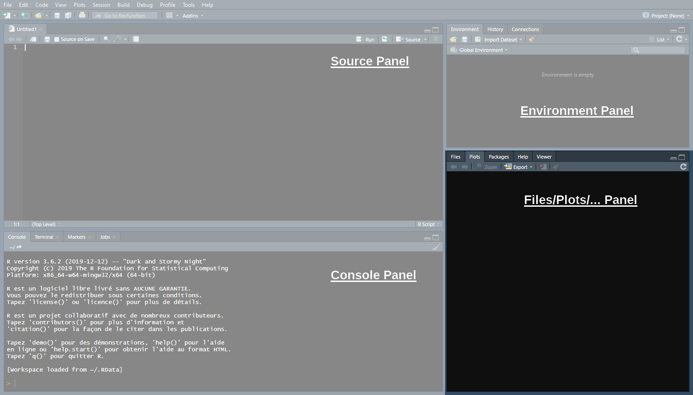
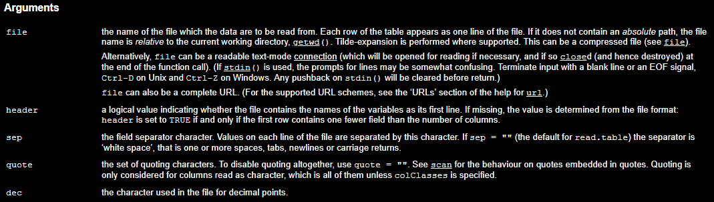

<style> .left-column {width: 65%;} .right-column {width: 31%;} </style>

```{css, echo = F, eval = params$dark}
body{background-color:black;filter:invert(1)}
```

```{r setup, include = FALSE}
source(paste0(getwd(), "/../source/style.R"))
stargazer <- stargazer::stargazer
theme_minimal <- theme_Rcourse
options(htmltools.dir.version = F)
knitr::opts_chunk$set(echo = T, message = F, warning = F, fig.align = "center")
Sys.setenv(LANG = "en")
```

### Welcome to the course

<p style = "margin-bottom:1.5cm;"></p>

--

.pull-left[

<center><b>About me</b></center>

<p style = "margin-bottom:1cm;"></p>

<ul>
  <li>PhD student at the Paris School of Economics</li>
</ul>

<p style = "margin-bottom:1.25cm;"></p>

<ul>
  <li>I work primarily on:</li>
  <ul>
    <li>Intergenerational (income) mobility</li>
    <li>Residential segregation</li>
    <li>Discrimination</li>
  </ul>
</ul>

<p style = "margin-bottom:1.25cm;"></p>

<ul>
  <li>I do empirical research, so I use Econometrics and (R) programming on a daily basis</li>
</ul>

<p style = "margin-bottom:1.25cm;"></p>

<ul>
  <li>You can reach me at <a href="mailto:louis.sirugue@psemail.eu">louis.sirugue@psemail.eu</a> for any question or comment about the course</li>
</ul>
]

--

.pull-right[

<center><b>About the course</b></center>

<p style = "margin-bottom:-.25cm;"></p>

<ul>
  <li><b>Objective:</b></li>
  <ul>
    <li style = "margin-bottom:.3cm;">Give you the necessary statistical and data visualization tools to perform data analyses</li>
  </ul>
</ul>

<ul>
  <li><b>Prerequisites:</b></li>
  <ul>
    <li style = "margin-bottom:.3cm;">None</li>
  </ul>
</ul>

<ul>
  <li><b>What you'll learn:</b></li>
  <ul>
    <li>Find and manipulate data</li>
    <li>Summarize data with relevant statistics and compelling graphics</li>
    <li style = "margin-bottom:.3cm;">Carry out an empirical research project</li>
  </ul>
</ul>

<ul>
  <li><b>Thus, this course is a mix of:</b></li>
  <ul>
    <li>Programming on R</li>
    <li>Basic Statistics</li>
    <li>Introductory Econometrics</li>
  </ul>
</ul>
]

---

### First semester

#### Course format

<ul>
  <li>The course is divided into <b>2 parts</b> that are <b>structured</b> the same way:</li>
  <ul>
    <li></li>
    <li></li>
    <li></li>
    <li></li>
  </ul>
</ul>
 
.pull-left[
```{r, echo = F}
knitr::kable(tibble(a = paste("Lecture", 1:7),
             b = c("Introduction to R", "Descriptive statistics", 
                   "Basic data manipulation", "Data visualization", 
                   "R Markdown & LaTeX", "Text data & sentiment analysis", 
                   "Homework correction")),
      caption = "Part I: Introduction to R programming", col.names = NULL) %>% 
 row_spec(1:7, background = "#DFE6EB", color = "#DFE6EB")  %>%
  kable_styling(full_width = T)
```
]

.pull-right[
<p style = "margin-bottom:-1.6cm;"></p>
```{r, echo = F}
knitr::kable(tibble(a = paste("Lecture", 8:15),
             b = c("Univariate regressions", "Multivariate regressions", 
                   "Inference", "Causality", 
                   "Interpretation", "Applications in academic research", 
                   "Maps and geolocalized data", "Final Exam")),
      caption = "Part II: Introduction to Econometrics", col.names = NULL) %>% 
 row_spec(1:8, background = "#DFE6EB", color = "#DFE6EB")  %>%
  kable_styling(full_width = T)
```
]

---

### First semester

#### Course format

<ul>
  <li>The course is divided into <b>2 parts</b> that are <b>structured</b> the same way:</li>
  <ul>
    <li>3 core <b>lectures with</b> weekly online <b>quizzes</b></li>
    <li></li>
    <li></li>
    <li></li>
  </ul>
</ul>
 
.pull-left[
```{r, echo = F}
knitr::kable(tibble(a = paste("Lecture", 1:7),
             b = c("Introduction to R*", "Descriptive statistics*", 
                   "Basic data manipulation*", "Data visualization", 
                   "R Markdown & LaTeX", "Text data & sentiment analysis", 
                   "Homework correction")),
      caption = "Part I: Introduction to R programming", col.names = NULL) %>% 
 row_spec(1:3, background = "#DFE6EB") %>% 
 row_spec(4:7, background = "#DFE6EB", color = "#DFE6EB")  %>%
  kable_styling(full_width = T)
```
]

.pull-right[
<p style = "margin-bottom:-1.6cm;"></p>
```{r, echo = F}
knitr::kable(tibble(a = paste("Lecture", 8:15),
             b = c("Univariate regressions*", "Multivariate regressions*", 
                   "Inference*", "Causality", 
                   "Interpretation", "Applications in academic research", 
                   "Maps and geolocalized data", "Final Exam")),
      caption = "Part II: Introduction to Econometrics", col.names = NULL) %>% 
 row_spec(1:3, background = "#DFE6EB") %>% 
 row_spec(4:8, background = "#DFE6EB", color = "#DFE6EB")  %>%
  kable_styling(full_width = T)
```
]

---

### First semester

#### Course format

<ul>
  <li>The course is divided into <b>2 parts</b> that are <b>structured</b> the same way:</li>
  <ul>
    <li>3 core <b>lectures with</b> weekly online <b>quizzes</b></li>
    <li>2-3 core <b>lectures without quizzes</b></li>
    <li></li>
    <li></li>
  </ul>
</ul>
 
.pull-left[
```{r, echo = F}
knitr::kable(tibble(a = paste("Lecture", 1:7),
             b = c("Introduction to R*", "Descriptive statistics*", 
                   "Basic data manipulation*", "Data visualization", 
                   "R Markdown & LaTeX", "Text data & sentiment analysis", 
                   "Homework correction")),
      caption = "Part I: Introduction to R programming", col.names = NULL) %>% 
 row_spec(1:5, background = "#DFE6EB") %>% 
 row_spec(6:7, background = "#DFE6EB", color = "#DFE6EB")  %>%
  kable_styling(full_width = T)
```
]

.pull-right[
<p style = "margin-bottom:-1.6cm;"></p>
```{r, echo = F}
knitr::kable(tibble(a = paste("Lecture", 8:15),
             b = c("Univariate regressions*", "Multivariate regressions*", 
                   "Inference*", "Causality", 
                   "Interpretation", "Applications in academic research", 
                   "Maps and geolocalized data", "Final Exam")),
      caption = "Part II: Introduction to Econometrics", col.names = NULL) %>% 
 row_spec(1:6, background = "#DFE6EB") %>% 
 row_spec(7:8, background = "#DFE6EB", color = "#DFE6EB")  %>%
  kable_styling(full_width = T)
```
]

---

### First semester

#### Course format

<ul>
  <li>The course is divided into <b>2 parts</b> that are <b>structured</b> the same way:</li>
  <ul>
    <li>3 core <b>lectures with</b> weekly online <b>quizzes</b></li>
    <li>2-3 core <b>lectures without quizzes</b></li>
    <li>1 buffer <b>lecture</b> that will <b>not</b> be <b>in the exams</b></li>
    <li></li>
  </ul>
</ul>
 
.pull-left[
```{r, echo = F}
knitr::kable(tibble(a = paste("Lecture", 1:7),
             b = c("Introduction to R*", "Descriptive statistics*", 
                   "Basic data manipulation*", "Data visualization", 
                   "R Markdown & LaTeX", "Text data & sentiment analysis", 
                   "Homework correction")),
      caption = "Part I: Introduction to R programming", col.names = NULL) %>% 
 row_spec(1:5, background = "#DFE6EB") %>% 
 row_spec(6:6, background = "#DFE6EB", color = "#6794A7")  %>%
 row_spec(7:7, background = "#DFE6EB", color = "#DFE6EB")  %>%
  kable_styling(full_width = T)
```
]

.pull-right[
<p style = "margin-bottom:-1.6cm;"></p>
```{r, echo = F}
knitr::kable(tibble(a = paste("Lecture", 8:15),
             b = c("Univariate regressions*", "Multivariate regressions*", 
                   "Inference*", "Causality", 
                   "Interpretation", "Applications in academic research", 
                   "Maps and geolocalized data", "Final Exam")),
      caption = "Part II: Introduction to Econometrics", col.names = NULL) %>% 
 row_spec(1:6, background = "#DFE6EB") %>% 
 row_spec(7:7, background = "#DFE6EB", color = "#6794A7")  %>%
 row_spec(8:8, background = "#DFE6EB", color = "#DFE6EB")  %>%
  kable_styling(full_width = T)
```
]

---

### First semester

#### Course format

<ul>
  <li>The course is divided into <b>2 parts</b> that are <b>structured</b> the same way:</li>
  <ul>
    <li>3 core <b>lectures with</b> weekly online <b>quizzes</b></li>
    <li>2-3 core <b>lectures without quizzes</b></li>
    <li>1 buffer <b>lecture</b> that will <b>not</b> be <b>in the exams</b></li>
    <li>1 <b>exam</b> (homework/final exam)</li>
  </ul>
</ul>
 
.pull-left[
```{r, echo = F}
knitr::kable(tibble(a = paste("Lecture", 1:7),
             b = c("Introduction to R*", "Descriptive statistics*", 
                   "Basic data manipulation*", "Data visualization", 
                   "R Markdown & LaTeX", "Text data & sentiment analysis", 
                   "Homework correction")),
      caption = "Part I: Introduction to R programming", col.names = NULL) %>% 
 row_spec(1:5, background = "#DFE6EB") %>% 
 row_spec(6:6, background = "#DFE6EB", color = "#6794A7")  %>%
 row_spec(7:7, background = "#DFE6EB", color = "#00A2D9")  %>%
  kable_styling(full_width = T)
```
]

.pull-right[
<p style = "margin-bottom:-1.6cm;"></p>
```{r, echo = F}
knitr::kable(tibble(a = paste("Lecture", 8:15),
             b = c("Univariate regressions*", "Multivariate regressions*", 
                   "Inference*", "Causality", 
                   "Interpretation", "Applications in academic research", 
                   "Maps and geolocalized data", "Final Exam")),
      caption = "Part II: Introduction to Econometrics", col.names = NULL) %>% 
 row_spec(1:6, background = "#DFE6EB") %>% 
 row_spec(7:7, background = "#DFE6EB", color = "#6794A7")  %>%
 row_spec(8:8, background = "#DFE6EB", color = "#00A2D9")  %>%
  kable_styling(full_width = T)
```
]

---

### First semester

#### Grading:


.pull-left[
<p style = "margin-bottom:1.5cm;"></p>

<ul style = "margin-left:3cm;">
  <li>The exam <b>coefficients</b> are:</li>
  <ul>
    <li></li>
    <li></li>
    <li></li>
  </ul>
</ul>
]

.pull-right[
<p style = "margin-bottom:-2.5cm;"></p>
```{r echo = F, fig.width = 4, fig.height = 4, dpi=300, out.width = "70%", fig.align='left'}
exams <- tibble(exam = c("Online quizzes", "Homework", "Final exam"),
                order_exam = 1:3,
                coef = as.numeric(c(NA, NA, NA)))

ggplot(exams, aes(x = reorder(exam, order_exam), y = coef)) +
  geom_bar(stat = "identity", color = "#014D64", fill = "#6794A7", alpha = .8) + 
  scale_y_continuous(name = "Coefficient", limits = c(0, 50), breaks = seq(0, 50, 10),
                     labels = paste0(seq(0, 50, 10), "%")) +
  theme(axis.title.x = element_blank())
```
<ul style = "margin-bottom:-.75cm;">
]

---

### First semester

#### Grading:


.pull-left[
<p style = "margin-bottom:1.5cm;"></p>

<ul style = "margin-left:3cm;">
  <li>The exam <b>coefficients</b> are:</li>
  <ul>
    <li>Online quizzes: 25%</li>
    <li></li>
    <li></li>
  </ul>
</ul>
]

.pull-right[
<p style = "margin-bottom:-2.5cm;"></p>
```{r echo = F, fig.width = 4, fig.height = 4, dpi=300, out.width = "70%", fig.align='left'}
exams <- tibble(exam = c("Online quizzes", "Homework", "Final exam"),
                order_exam = 1:3,
                coef = c(25, NA, NA))

ggplot(exams, aes(x = reorder(exam, order_exam), y = coef)) +
  geom_bar(stat = "identity", color = "#014D64", fill = "#6794A7", alpha = .8) + 
  scale_y_continuous(name = "Coefficient", limits = c(0, 50), breaks = seq(0, 50, 10),
                     labels = paste0(seq(0, 50, 10), "%")) +
  theme(axis.title.x = element_blank())
```
<ul style = "margin-bottom:-.75cm;">
]

---

### First semester

#### Grading:


.pull-left[
<p style = "margin-bottom:1.5cm;"></p>

<ul style = "margin-left:3cm;">
  <li>The exam <b>coefficients</b> are:</li>
  <ul>
    <li>Online quizzes: 25%</li>
    <li>Homework: 30%</li>
    <li></li>
  </ul>
</ul>
]

.pull-right[
<p style = "margin-bottom:-2.5cm;"></p>
```{r echo = F, fig.width = 4, fig.height = 4, dpi=300, out.width = "70%", fig.align='left'}
exams <- tibble(exam = c("Online quizzes", "Homework", "Final exam"),
                order_exam = 1:3,
                coef = c(25, 30, NA))

ggplot(exams, aes(x = reorder(exam, order_exam), y = coef)) +
  geom_bar(stat = "identity", color = "#014D64", fill = "#6794A7", alpha = .8) + 
  scale_y_continuous(name = "Coefficient", limits = c(0, 50), breaks = seq(0, 50, 10),
                     labels = paste0(seq(0, 50, 10), "%")) +
  theme(axis.title.x = element_blank())
```
<ul style = "margin-bottom:-.75cm;">
]

---

### First semester

#### Grading:

.pull-left[
<p style = "margin-bottom:1.5cm;"></p>

<ul style = "margin-left:3cm;">
  <li>The exam <b>coefficients</b> are:</li>
  <ul>
    <li>Online quizzes: 25%</li>
    <li>Homework: 30%</li>
    <li>Final exam: 45%</li>
  </ul>
</ul>
]

.pull-right[
<p style = "margin-bottom:-2.5cm;"></p>
```{r echo = F, fig.width = 4, fig.height = 4, dpi=300, out.width = "70%", fig.align='left'}
exams <- tibble(exam = c("Online quizzes", "Homework", "Final exam"),
                order_exam = 1:3,
                coef = c(25, 30, 45))

ggplot(exams, aes(x = reorder(exam, order_exam), y = coef)) +
  geom_bar(stat = "identity", color = "#014D64", fill = "#6794A7", alpha = .8) + 
  scale_y_continuous(name = "Coefficient", limits = c(0, 50), breaks = seq(0, 50, 10),
                     labels = paste0(seq(0, 50, 10), "%")) +
  theme(axis.title.x = element_blank())
```
<ul style = "margin-bottom:-.75cm;">
]

--
<ul>
  <li><b>Online quizzes:</b></li>
  <ul>
    <li>Available in the <i>Material</i> section of the course webpage</li>
    <li>Log in using the verification received by email</li>
    <li><b>3-5 shorts questions</b> on to the content of the previous class </li>
    <li>Quizzes open at the end of the lecture and <b>close at the beginning of the next one</b></li>
    <li>You can retry the quiz as many times as you want before submitting</li>
    <li>To submit click on <i>download results</i> and <b>send the downloaded file</b> to me by email before the next lecture</li>
  </ul>
</ul> 

---

### First semester

#### Grading:


<ul>
  <li><b>Homework:</b></li>
  <ul>
    <li><b>Set of exercises</b> related to the first five lectures of the course</li>
    <li>It can be done <b>alone or by pairs</b></li>
    <li>Must be handed over via email by the end of the sixth week <b>(15th of October 18:00)</b></li>
    <li><b>Late submissions will be penalized</b> by half a point for each 30 min. beyond the deadline</li>
    <li>You can help each other but write your answers yourselves <b>(no copy-pasting)</b></li>
  </ul>
</ul>

--

<p style = "margin-bottom:1.5cm;"></p>

<ul>
  <li><b>Final exam:</b></li>
  <ul>
    <li><b>Paper exam in classroom</b></li>
    <li>You can <b>bring a cheatsheet</b> with you as long as:</li>
    <ul>
      <li>It is <b>handwritten</b> on paper</li>
      <li>It stands on a single A4 (21cm x 29.7cm) page, i.e., <b>recto only</b></li>
    </ul>
    <li>Cheatsheets that do not comply with these rules will be confiscated</li>
    <li>Beyond that, standard examination rules apply</li>
  </ul>
</ul>

---

### Second semester

#### Course format

<ul>
  <li>The <b>second semester</b> will be all about carrying out your <b>own research project:</b></li>
  <ul>
    <li></li>
    <li></li>
    <li></li>
  </ul>
</ul>

---

### Second semester

#### Course format

<ul>
  <li>The <b>second semester</b> will be all about carrying out your <b>own research project:</b></li>
  <ul>
    <li><b>Guidelines and refreshers</b> will give you time find data and a research question</li>
    <li></li>
    <li></li>
  </ul>
</ul>
 
.pull-left[
```{r, echo = F}
knitr::kable(tibble(a = paste("Lecture", 1:3),
             b = c("How to conduct a research project", 
                   "Refresher: R Programming", 
                   "Refresher: Econometrics")),
      caption = "", col.names = NULL) %>% 
 row_spec(1:3, background = "#DFE6EB", color = "#6794A7") %>% 
  kable_styling(full_width = T)
```

]

.pull-right[

]

---

### Second semester

#### Course format

<ul>
  <li>The <b>second semester</b> will be all about carrying out your <b>own research project:</b></li>
  <ul>
    <li><b>Guidelines and refreshers</b> will give you time find data and a research question</li>
    <li>The rest of the semester will be made of <b>follow-up sessions</b></li>
    <li></li>
  </ul>
</ul>
 
.pull-left[
```{r, echo = F}
knitr::kable(tibble(a = paste("Lecture", 1:3),
             b = c("How to conduct a research project", 
                   "Refresher: R Programming", 
                   "Refresher: Econometrics")),
      caption = "", col.names = NULL) %>% 
 row_spec(1:3, background = "#DFE6EB", color = "#6794A7") %>% 
  kable_styling(full_width = T)
```

<p style = "margin-bottom:1cm;"></p>

```{r, echo = F}
knitr::kable(tibble(a = paste("Lecture", 4:7),
             b = c("Presentation of question and data", 
                   "Follow-up: Data cleaning I", 
                   "Follow-up: Data cleaning II", 
                   "Follow-up: Descriptive statistics")),
      caption = "", col.names = NULL) %>% 
   row_spec(1:4, background = "#DFE6EB") %>% 
  kable_styling(full_width = T)
```
]

.pull-right[
```{r, echo = F}
knitr::kable(tibble(a = paste("Lecture", 8:15),
             b = c("Follow-up: Visualizing the data", "Follow-up: Regression analysis", 
                   "Follow-up: Midterm report feedback", "Follow-up: Causality assessment", 
                   "Follow-up: Robustness", "Follow-up: Heterogeneity", 
                   "Follow-up: Last tips", "Final presentation")),
      caption = "", col.names = NULL) %>% 
 row_spec(c(1:8), background = "#DFE6EB") %>% 
  kable_styling(full_width = T)
```
]

---

### Second semester

#### Course format

<ul>
  <li>The <b>second semester</b> will be all about carrying out your <b>own research project:</b></li>
  <ul>
    <li><b>Guidelines and refreshers</b> will give you time find data and a research question</li>
    <li>The rest of the semester will be made of <b>follow-up sessions</b></li>
    <li><b>Exams</b> will take place at <b>3 stages</b> of the research process</li>
  </ul>
</ul>
 
.pull-left[
```{r, echo = F}
knitr::kable(tibble(a = paste("Lecture", 1:3),
             b = c("How to conduct a research project", 
                   "Refresher: R Programming", 
                   "Refresher: Econometrics")),
      caption = "", col.names = NULL) %>% 
 row_spec(1:3, background = "#DFE6EB", color = "#6794A7") %>% 
  kable_styling(full_width = T)
```

<p style = "margin-bottom:1cm;"></p>

```{r, echo = F}
knitr::kable(tibble(a = paste("Lecture", 4:7),
             b = c("Presentation of question and data", 
                   "Follow-up: Data cleaning I", 
                   "Follow-up: Data cleaning II", 
                   "Follow-up: Descriptive statistics")),
      caption = "", col.names = NULL) %>% 
   row_spec(1:1, background = "#DFE6EB", color = "#00A2D9")  %>%
 row_spec(2:4, background = "#DFE6EB") %>% 
  kable_styling(full_width = T)
```
]

.pull-right[
```{r, echo = F}
knitr::kable(tibble(a = paste("Lecture", 8:15),
             b = c("Follow-up: Visualizing the data", "Follow-up: Regression analysis", 
                   "Follow-up: Midterm report feedback", "Follow-up: Causality assessment", 
                   "Follow-up: Robustness", "Follow-up: Heterogeneity", 
                   "Follow-up: Last tips", "Final presentation")),
      caption = "", col.names = NULL) %>% 
 row_spec(c(1:2, 4:7), background = "#DFE6EB") %>% 
 row_spec(c(3, 8), background = "#DFE6EB", color = "#00A2D9")  %>%
  kable_styling(full_width = T)
```
]

---

### Second semester

#### Grading:


.pull-left[
<p style = "margin-bottom:1.5cm;"></p>

<ul style = "margin-left:1.5cm;">
  <li>The exam <b>coefficients</b> are:</li>
  <ul>
    <li></li>
    <li></li>
    <li></li>
  </ul>
</ul>
]

.pull-right[
<p style = "margin-bottom:-2.5cm;"></p>
```{r echo = F, fig.width = 4, fig.height = 4, dpi=300, out.width = "70%", fig.align='left'}
exams <- tibble(exam = c("Presentation of\nresearch idea", "Midterm\nreport", "Final project/\npresentation"),
                order_exam = 1:3,
                coef = as.numeric(c(NA, NA, NA)))

ggplot(exams, aes(x = reorder(exam, order_exam), y = coef)) +
  geom_bar(stat = "identity", color = "#014D64", fill = "#6794A7", alpha = .8) + 
  scale_y_continuous(name = "Coefficient", limits = c(0, 50), breaks = seq(0, 50, 10),
                     labels = paste0(seq(0, 50, 10), "%")) +
  theme(axis.title.x = element_blank())
```
]

---

### Second semester

#### Grading:


.pull-left[
<p style = "margin-bottom:1.5cm;"></p>

<ul style = "margin-left:1.5cm;">
  <li>The exam <b>coefficients</b> are:</li>
  <ul>
    <li>Presentation of research idea: 25%</li>
    <li></li>
    <li></li>
  </ul>
</ul>
]

.pull-right[
<p style = "margin-bottom:-2.5cm;"></p>
```{r echo = F, fig.width = 4, fig.height = 4, dpi=300, out.width = "70%", fig.align='left'}
exams <- tibble(exam = c("Presentation of\nresearch idea", "Midterm\nreport", "Final project/\npresentation"),
                order_exam = 1:3,
                coef = c(25, NA, NA))

ggplot(exams, aes(x = reorder(exam, order_exam), y = coef)) +
  geom_bar(stat = "identity", color = "#014D64", fill = "#6794A7", alpha = .8) + 
  scale_y_continuous(name = "Coefficient", limits = c(0, 50), breaks = seq(0, 50, 10),
                     labels = paste0(seq(0, 50, 10), "%")) +
  theme(axis.title.x = element_blank())
```
]

---

### Second semester

#### Grading:


.pull-left[
<p style = "margin-bottom:1.5cm;"></p>

<ul style = "margin-left:1.5cm;">
  <li>The exam <b>coefficients</b> are:</li>
  <ul>
    <li>Presentation of research idea: 25%</li>
    <li>Midterm report: 30%</li>
    <li></li>
  </ul>
</ul>
]

.pull-right[
<p style = "margin-bottom:-2.5cm;"></p>
```{r echo = F, fig.width = 4, fig.height = 4, dpi=300, out.width = "70%", fig.align='left'}
exams <- tibble(exam = c("Presentation of\nresearch idea", "Midterm\nreport", "Final project/\npresentation"),
                order_exam = 1:3,
                coef = c(25, 30, NA))

ggplot(exams, aes(x = reorder(exam, order_exam), y = coef)) +
  geom_bar(stat = "identity", color = "#014D64", fill = "#6794A7", alpha = .8) + 
  scale_y_continuous(name = "Coefficient", limits = c(0, 50), breaks = seq(0, 50, 10),
                     labels = paste0(seq(0, 50, 10), "%")) +
  theme(axis.title.x = element_blank())
```
]

---

### Second semester

#### Grading:


.pull-left[
<p style = "margin-bottom:1.5cm;"></p>

<ul style = "margin-left:1.5cm;">
  <li>The exam <b>coefficients</b> are:</li>
  <ul>
    <li>Presentation of research idea: 25%</li>
    <li>Midterm report: 30%</li>
    <li>Final project/presentation: 45%</li>
  </ul>
</ul>
]

.pull-right[
<p style = "margin-bottom:-2.5cm;"></p>
```{r echo = F, fig.width = 4, fig.height = 4, dpi=300, out.width = "70%", fig.align='left'}
exams <- tibble(exam = c("Presentation of\nresearch idea", "Midterm\nreport", "Final project/\npresentation"),
                order_exam = 1:3,
                coef = c(25, 30, 45))

ggplot(exams, aes(x = reorder(exam, order_exam), y = coef)) +
  geom_bar(stat = "identity", color = "#014D64", fill = "#6794A7", alpha = .8) + 
  scale_y_continuous(name = "Coefficient", limits = c(0, 50), breaks = seq(0, 50, 10),
                     labels = paste0(seq(0, 50, 10), "%")) +
  theme(axis.title.x = element_blank())
```
<ul style = "margin-bottom:-.75cm;">
]

--

.pull-left[
<ul>
  <li><b>Additional information:</b></li>
  <ul>
    <li>Research projects must be done <b>by pairs</b></li>
    <li>It can be written in <b>French or in English</b></li>
    <li>Follow-ups are <b>short meetings</b> with each group individually</li>
    <li>Find an <b>example</b> of what is expected <a href = "https://louissirugue.github.io/metrics_on_R/project/example.html">here</a></li>
    <li>We'll come back to that in due time (January)</li>
  </ul>
</ul> 
]

--

.pull-right[
<p style = "margin-bottom:-3.5cm;"></p>
<center><b><i>&#10140; Check out the <a href = "https://louissirugue.github.io/metrics_on_R/home.html">course webpage</a> for<br>more details, all the information is there!</i></b></center>
]
    
---

<h3>Let's delve into it!</h3>

<p style = "margin-bottom:1.75cm;"></p>

.pull-left[

<ul style = "margin-left:1.5cm;list-style: none">
  <li><b>1. Getting started</b></li>
  <ul style = "list-style: none">
    <li>1.1. About R</li>
    <li>1.2. The R Studio IDE</li>
    <li>1.3. Import and eyeball data</li>
    <li>1.4. Use functions</li>
  </ul>
</ul>

<p style = "margin-bottom:1cm;"></p>

<ul style = "margin-left:1.5cm;list-style: none">
  <li><b>2. Anatomy of a data.frame</b></li>
  <ul style = "list-style: none">
    <li>2.1. Data structure</li>
    <li>2.2. Classes</li>
    <li>2.3. Vectors</li>
    <li>2.4. Subsetting</li>
  </ul>
</ul>


<p style = "margin-bottom:1cm;"></p>

<ul style = "margin-left:1.5cm;list-style: none"><li><b>3. Wrap up!</b></li></ul>
]

---

<h3>Let's delve into it!</h3>

<p style = "margin-bottom:1.75cm;"></p>

.pull-left[

<ul style = "margin-left:1.5cm;list-style: none">
  <li><b>1. Getting started</b></li>
  <ul style = "list-style: none">
    <li>1.1. About R</li>
    <li>1.2. The R Studio IDE</li>
    <li>1.3. Import and eyeball data</li>
    <li>1.4. Use functions</li>
  </ul>
</ul>
]

---

### 1. Getting started

#### 1.1. About R

 * R is a **programming language** and free software environment for **statistical computing and graphics**
 


<p style = "margin-bottom:-11cm;"></p>

--

<p style = "margin-bottom:.75cm;"></p>

<ul>
 <li style = "margin-bottom:.25cm;">The R language is widely (and increasingly) used in <b>academic and non-academic research</b> in fields like:</li>
   <ul>
     <li>Economics</li>
     <li>Statistics</li>
     <li>Biostats</li>
   </ul>
</ul>

--

<p style = "margin-bottom:.75cm;"></p>

<ul>
 <li style = "margin-bottom:.25cm;">Things you can do with R:</li>
   <ul>
     <li><a href="https://louissirugue.github.io/data-analysis-course/project/example.html">Reports</a></li>
     <li><a href="https://www.r-graph-gallery.com/bubble_chart_interactive_ggplotly.html">Nice plots</a></li>
     <li><a href="https://louissirugue.github.io/metrics_on_R/home.html">All the material of this course</a></li>
     <li><a href="https://pubs.aeaweb.org/doi/pdfplus/10.1257/app.20200447">Academic research</a></li>
     <li><a href="https://www.kaggle.com/xavierconort">Win kaggle competitions</a></li>
     <li><a href="https://vac-lshtm.shinyapps.io/ncov_tracker/?_ga=2.29922175.1739025613.1656421238-871875772.1628005923">Interactive data visualization</a></li>
     <li><a href="https://www.data-to-art.com/">Art</a></li>
   </ul>
</ul>
 
---

### 1. Getting started

#### 1.2. The R Studio IDE

<center>

</center>
 
---

### 1. Getting started

#### 1.2. The R Studio IDE

<center>

</center>

&#10140; <b>The Console panel</b>

<ul>
  <li>This is where you <b>communicate with R</b>
  <ul>
    <li>You can write instructions after the <b>></b>, <b>press enter</b> and R will <b>execute</b></li>
    <li>Try with <b>1+1:</b></li>
  </ul>
</ul>

--

```{r}
1+1
```
 
---

### 1. Getting started

#### 1.2. The R Studio IDE

<center>

</center>

&#10140; <b>The Source panel</b>

<ul>
  <li>This is where you <b>write and save your code</b> (File > New File > R Script)</li>
  <ul>
    <li><b>Separate</b> different commands with a <b>line break</b></li>
    <li>The <b>#</b> symbol allows to <b>comment</b> your code</li>
    <li>Everything after <b>#</b> will be <b>ignored</b> by R until the next line break</li>
  </ul>
</ul>

--

```{r, results='hide'}
1+1 # Do not put 2+2 on the same line, press enter to go to next line 
2+2
```
 
---

### 1. Getting started

#### 1.2. The R Studio IDE

<center>

</center>

&#10140; <b>The Source panel</b>

<ul>
  <li>To send the command from the source panel to the console panel:</li>
  <ol>
    <li><b>Highlight</b> the lines you want to execute</li>
    <li>Press <b>ctrl + enter</b></li>
  </ol>
</ul>

--

<ul><li>If you do not highlight anything the line of code where your cursor stands will be executed</li></ul>

--

<ul><li>Check the console to see the output of your code</li></ul>
 
---

### 1. Getting started

#### 1.2. The R Studio IDE

<center>

</center>

&#10140; <b>The Environment panel</b>

<ul>
  <li>Data analysis requires manipulating datasets, vectors, functions, etc.</li>
  <ul>
    <li>These <b>elements are stored in the environment</b> panel</li>
  </ul>
</ul>

--

 * For instance we can assign a value to an object using `<-`

```{r}
x <- 1
```

--

<center><i><b> &#10140; You now have an object called 'x' in your environment, which takes the value 1</b></i></center>

---

### 1. Getting started

#### 1.2. The R Studio IDE

<center>

</center>

&#10140; <b>The Environment panel</b>

.pull-left[

 * Now that the object `x` is stored in your environment, you can use it:

```{r}
x + 1
```

]

--

.pull-right[

 * You can also modify that object at any point:

```{r}
x <- x + 1
x
```

]

---

### 1. Getting started

#### 1.2. The R Studio IDE

<center>

</center>

&#10140; <b>The Files/Plots/... panel</b>

 * In this panel we'll mainly be interested in the following 4 tabs

--
<ul style = "margin-top:1em;"><li><b>Files:</b> Shows your working directory</li></ul>
--
<ul style = "margin-top:1em;"><li><b>Plots:</b> Where R returns plots</li></ul>
--
<ul style = "margin-top:1em;"><li><b>Packages:</b> A library of tools that we can load if needed</li></ul>
--
<ul style = "margin-top:1em;"><li><b>Help:</b> Where to look for documentation on R functions</li></ul>

---

### 1. Getting started

#### 1.2. The R Studio IDE

<center>

</center>   

&#10140; <b>The Files/Plots/... panel</b>

 *  Enter `?getwd()` in the console to see what a **help file** looks like
 
---

### 1. Getting started

#### 1.2. The R Studio IDE


&#10140; <b>The Files/Plots/... panel</b>

 *  Enter `?getwd()` in the console to see what a **help file** looks like

<ul><ul><li>It <b>describes</b> what the command does</li></ul></ul>
<ul><ul><li>It <b>explains</b> the different parameters of the command</li></ul></ul>
<ul><ul><li>It <b>gives examples</b> of how to use the command</li></ul></ul>


---

class: inverse, hide-logo

### Practice

#### 1) Open a new R script (`Ctrl + Shift + N`) and write a code to create these objects:

```{r, echo = F}
tibble(a = c("Object name:", "Assigned value:"), 
       b = c("a", 2), 
       c = c("b", 4), 
       d = c("c", 5)) %>%
   knitr::kable(col.names = NULL, align = "lccc", caption = "Objects to create")  %>% 
 row_spec(2, background = "#014D64")
```

--

<p style = "margin-bottom:1cm;"></p>

#### 2) Run this code and create a new object named `result` that takes the value $\frac{b\times c}{a} + (b-a)^c$

```{r, echo = F}
tibble(a = c("Operation:", "Symbol in R:"), 
       b = c("Addition", "+"), 
       c = c("Subtraction", "-"), 
       d = c("Multiplication", "*"), 
       e = c("Division", "/"), 
       f = c("Exponentiation", "^"),
       g = c("Parentheses", "()")) %>%
  kable(col.names = NULL, align = "lcccccc", caption = "Basic operations in R") %>% 
 row_spec(2, background = "#014D64")
```

--

<p style = "margin-bottom:1cm;"></p>

#### 3) Print `result` in your console and save your script somewhere in your computer (`Ctrl+S`)

--

<p style = "margin-bottom:-.25cm;"></p>

<center><h3><i>You've got 3 minutes!</i></h3></center>

`r countdown(minutes = 3, top = 0, right = 0, play_sound = F, color_border = "#DFE6EB", color_text = "#DFE6EB", color_running_background = "#DFE6EB", color_running_text = "#014D64", color_finished_background = "#014D64", color_finished_text = "#DFE6EB", start_immediately = T)`

---

class: inverse, hide-logo

### Solution

#### 1) Open a new R script (`Ctrl + Shift + N`) and write a code to create these objects:

.pull-left[
```{r, echo = F}
tibble(a = c("Object name:", "Assigned value:"), 
       b = c("a", 2), 
       c = c("b", 4), 
       d = c("c", 5)) %>%
  kable(col.names = NULL, align = "lccc", caption = "Objects to create")  %>% 
 row_spec(2, background = "#014D64")
```
]

--

.pull-right[
```{r}
a <- 2
b <- 4
c <- 5
```
]


--

<p style = "margin-bottom:1.25cm;"></p>

#### 2) Run this code and create a new object named `result` that takes the value $\frac{b\times c}{a} + (b-a)^c$

--

```{r}
result <- b*c/a + (b-a)^c
```

--

<p style = "margin-bottom:1.25cm;"></p>

#### 3) Print `result` in your console and save your script somewhere in your computer (`Ctrl + S`)

--

```{r}
result
```

---

### 1. Getting started

#### 1.3. Import and eyeball data

 * We now know how to <b>use R</b> as a calculator, but our goal is <b>to analyze data!</b>

--

<center><i>&#10140; Take for instance the statistics from the last season of Ligue 1 available at <a href = "https://fbref.com/en/comps/13/schedule/Ligue-1-Scores-and-Fixtures">fbref.com</a></i></center>

<p style = "margin-bottom:.5cm;"></p>

<center>

</center>

---

### 1. Getting started

#### 1.3. Import and eyeball data

<ul>
  <li>You can <b>download</b> this dataset <a href = "https://louissirugue.github.io/metrics_on_R/lecture1/data.zip">here</a> or from the course webpage</li>
  <ul>
    <li>Note that the extension of the file is <b>.csv</b> (for <i><b>C</b>omma <b>S</b>eparated <b>V</b>alues</i>)</li>
    <li>Let's have a look at <b>first 5 lines</b> of the raw csv file</li>
  </ul>
</ul>

--
 
<p style = "margin-bottom:1.25cm;"></p>

```{r, eval = F, highlight=F}
Wk,Day,Date,Time,Home,xG,Score,xG,Away,Attendance,Venue,Referee,Match Report,Notes
1,Fri,2021-08-06,21:00,Monaco,2.0,1–1,0.3,Nantes,7500,Stade Louis II.,Antony Gautier,Match Report,
1,Sat,2021-08-07,17:00,Lyon,1.4,1–1,0.8,Brest,29018,Groupama Stadium,Mikael Lesage,Match Report,
1,Sat,2021-08-07,21:00,Troyes,0.8,1–2,1.2,Paris S-G,15248,Stade de l'Aube,Amaury Delerue,Match Report,
1,Sun,2021-08-08,13:00,Rennes,0.6,1–1,2.0,Lens,22567,Roazhon Park,Bastien Dechepy,Match Report,
```

--

<p style = "margin-bottom:1.25cm;"></p>

<ul>
  <li>The <b>.csv format</b> is very common and has a very <b>codified structure</b></li>
  <ul>
    <li>We can see that <b>each line</b> corresponds to <b>a row</b> (the first row generally contains column names)</li>
    <li>And for each row the <b>values</b> of each column are <b>separated by commas</b></li>
  </ul>
</ul>

--

<p style = "margin-bottom:1cm;"></p>

<center><b><i>&#10140; But how to get it in our R studio environment?</i></b></center>

---

### 1. Getting started

#### 1.3. Import and eyeball data

.pull-left[
<ul>
  <li>To <b>import</b> stuff in R we use <b><i>read</i> functions</b></li>
  <ul>
    <li>They take the <b>file directory</b> as an <b>input</b></li>
    <li>And give the <b>file content</b> as an <b>output</b></li>
  </ul>
</ul>
]

.pull-right[
```{r, eval = F}
function(input)
```
```{r, echo = F}
"output"
```
]

--

<p style = "margin-bottom:1cm;"></p>

<ul>
  <li>The read function dedicated to .csv files is <b>read.csv()</b></li>
</ul>

```{r, eval = F}
fb <- read.csv("C:\User\Documents\ligue1.csv")
```

--

```{r, echo = F, error = T}
fb <- read.csv("C:\User\Documents\ligue1.csv")
```

<center>Oops, slashes must be the other way around!</center>


<p style = "margin-bottom:1cm;"></p>

--

```{r, eval = F}
fb <- read.csv("C:/User/Documents/ligue1.csv")
```

--

```{r, echo = F}
fb <- read.csv("ligue1.csv")
```

<center><i>&#10140; Let's <b>inspect</b> this new object to check that it worked</i></center>

---

### 1. Getting started

#### 1.3. Import and eyeball data

 * The first thing we can do is to use `head()` to print the **top rows**
 
```{r, eval = F}
head(fb, 4)
```
--
```{r, echo = F}
head(fb, 4)
```

--

<p style = "margin-bottom:1cm;"></p>

 * `tail()` would print the **bottom rows**

 * We can also run **`View(`**`fb`**`)`** *(a new tab will pop-up in your Source panel)*
 
---

### 1. Getting started

#### 1.3. Import and eyeball data

<center>


<p style = "margin-bottom:.5cm;"></p>

<b>Seems like it worked!</b>
</center>
 
---

### 1. Getting started

#### 1.3. Import and eyeball data

<center>


<p style = "margin-bottom:.5cm;"></p>

<b>... or kind of worked?</b>
</center>
 
---

### 1. Getting started

#### 1.4. Use functions

<ul>
  <li>That kind of <b>weird characters</b> kicks in when there is an <b>encoding issue</b></li>
  <ul>
    <li>Thankfully, <b>read.csv()</b> has <b>many options</b> that can be set as <b>inputs</b>, including encoding!</li>
    <li>Usually the UTF-8 encoding is the solution to French characters</li>
  </ul>
</ul>

--

```{r, eval = F}
fb <- read.csv("C:/User/Documents/ligue1.csv", encoding = "UTF-8")
```

```{r, echo = F}
fb <- read.csv("ligue1.csv", encoding = "UTF-8")
```

<p style = "margin-bottom:1cm;"></p>

--

<ul>
  <li>When you will be facing <b>similar issues</b>, check out the arguments of read.csv() using <b>?read.csv</b></li>
</ul>

--

<center>

</center>

---

### 1. Getting started

#### 1.4. Use functions

<ul>
  <li>From the <b>documentation</b> you can see that functions have <b>many arguments</b></li>
  <ul>
    <li>Some <b>without default</b> values: You need to specify the argument for the function to work</li>
    <li>Some <b>with default</b> values: If you don't specify these arguments, defaults will be used</li>
  </ul>
</ul>
 
```{r, eval = F}
read.csv(file, header = TRUE, sep = ",", quote = "\"",
         dec = ".", fill = TRUE, comment.char = "", ...)
```

--

 * You don't need to write the argument names only for those written in the <b>correct order</b>


.left-column[
.pull-left[

<p style="margin-bottom:-.5cm"></p>
```{r, eval = F}
read.csv(file = "dt.csv")
```

```{r, eval = F}
read.csv("dt.csv")
```

]
.pull-right[
$$\Longleftrightarrow$$

<p style="margin-bottom:.5cm"></p>

$$\underset{\Longleftrightarrow}{?}$$


]
]
.right-column[
<p style="margin-bottom:-1.07cm"></p>
```{r, eval = F}
read.csv("dt.csv")
```

```{r, eval = F}
read.csv("dt.csv", sep = ",")
```
]
 
---

### 1. Getting started

#### 1.4. Use functions

<ul>
  <li>From the <b>documentation</b> you can see that functions have <b>many arguments</b></li>
  <ul>
    <li>Some <b>without default</b> values: You need to specify the argument for the function to work</li>
    <li>Some <b>with default</b> values: If you don't specify these arguments, defaults will be used</li>
  </ul>
</ul>
 
```{r, eval = F}
read.csv(file, header = TRUE, sep = ",", quote = "\"",
         dec = ".", fill = TRUE, comment.char = "", ...)
```

 * You don't need to write the argument names only for those written in the <b>correct order</b>

.left-column[
.pull-left[

<p style="margin-bottom:-.5cm"></p>
```{r, eval = F}
read.csv(file = "dt.csv")
```

```{r, eval = F}
read.csv("dt.csv")
```

```{r, eval = F}
read.csv("dt.csv", sep = ",")
```

]
.pull-right[
$$\Longleftrightarrow$$

<p style="margin-bottom:1cm"></p>

$$\Longleftrightarrow$$

<p style="margin-bottom:.5cm"></p>

$$\underset{\Longleftrightarrow}{?}$$

]
]
.right-column[
<p style="margin-bottom:-1.07cm"></p>
```{r, eval = F}
read.csv("dt.csv")
```

```{r, eval = F}
read.csv("dt.csv", sep = ",")
```

```{r, eval = F}
read.csv("dt.csv", ",")
```
]
 
---

### 1. Getting started

#### 1.4. Use functions

<ul>
  <li>From the <b>documentation</b> you can see that functions have <b>many arguments</b></li>
  <ul>
    <li>Some <b>without default</b> values: You need to specify the argument for the function to work</li>
    <li>Some <b>with default</b> values: If you don't specify these arguments, defaults will be used</li>
  </ul>
</ul>
 
```{r, eval = F}
read.csv(file, header = TRUE, sep = ",", quote = "\"",
         dec = ".", fill = TRUE, comment.char = "", ...)
```

 * You don't need to write the argument names only for those written in the <b>correct order</b>

.left-column[
.pull-left[

<p style="margin-bottom:-.5cm"></p>
```{r, eval = F}
read.csv(file = "dt.csv")
```

```{r, eval = F}
read.csv("dt.csv")
```

```{r, eval = F}
read.csv("dt.csv", sep = ",")
```

```{r, eval = F}
read.csv("dt.csv", sep = ",")
```

]
.pull-right[
$$\Longleftrightarrow$$

<p style="margin-bottom:1cm"></p>

$$\Longleftrightarrow$$
<p style="margin-bottom:1cm"></p>

$$\not\not\Longleftrightarrow$$

<p style="margin-bottom:.5cm"></p>

$$\underset{\Longleftrightarrow}{?}$$

]
]
.right-column[
<p style="margin-bottom:-1.07cm"></p>
```{r, eval = F}
read.csv("dt.csv")
```

```{r, eval = F}
read.csv("dt.csv", sep = ",")
```

```{r, eval = F}
read.csv("dt.csv", ",")
```

```{r, eval = F}
read.csv("dt.csv", TRUE, ",")
```
]
 
---

### 1. Getting started

#### 1.4. Use functions

<ul>
  <li>From the <b>documentation</b> you can see that functions have <b>many arguments</b></li>
  <ul>
    <li>Some <b>without default</b> values: You need to specify the argument for the function to work</li>
    <li>Some <b>with default</b> values: If you don't specify these arguments, defaults will be used</li>
  </ul>
</ul>
 
```{r, eval = F}
read.csv(file, header = TRUE, sep = ",", quote = "\"",
         dec = ".", fill = TRUE, comment.char = "", ...)
```

 * You don't need to write the argument names only for those written in the <b>correct order</b>

.left-column[
.pull-left[

<p style="margin-bottom:-.5cm"></p>
```{r, eval = F}
read.csv(file = "dt.csv")
```

```{r, eval = F}
read.csv("dt.csv")
```

```{r, eval = F}
read.csv("dt.csv", sep = ",")
```

```{r, eval = F}
read.csv("dt.csv", sep = ",")
```

]
.pull-right[
$$\Longleftrightarrow$$

<p style="margin-bottom:1cm"></p>

$$\Longleftrightarrow$$
<p style="margin-bottom:1cm"></p>

$$\not\not\Longleftrightarrow$$

<p style="margin-bottom:1cm"></p>

$$\Longleftrightarrow$$

]
]
.right-column[
<p style="margin-bottom:-1.07cm"></p>
```{r, eval = F}
read.csv("dt.csv")
```

```{r, eval = F}
read.csv("dt.csv", sep = ",")
```

```{r, eval = F}
read.csv("dt.csv", ",")
```

```{r, eval = F}
read.csv("dt.csv", TRUE, ",")
```
]

---

<h3>Overview</h3>

<p style = "margin-bottom:1.75cm;"></p>

.pull-left[

<ul style = "margin-left:1.5cm;list-style: none">
  <li><b>1. Getting started &#10004;</b></li>
  <ul style = "list-style: none">
    <li>1.1. About R</li>
    <li>1.2. The R Studio IDE</li>
    <li>1.3. Import and eyeball data</li>
    <li>1.4. Use functions</li>
  </ul>
</ul>

<p style = "margin-bottom:1cm;"></p>

<ul style = "margin-left:1.5cm;list-style: none">
  <li><b>2. Anatomy of a data.frame</b></li>
  <ul style = "list-style: none">
    <li>2.1. Data structure</li>
    <li>2.2. Classes</li>
    <li>2.3. Vectors</li>
    <li>2.4. Subsetting</li>
  </ul>
</ul>


<p style = "margin-bottom:1cm;"></p>

<ul style = "margin-left:1.5cm;list-style: none"><li><b>3. Wrap up!</b></li></ul>
]

---

<h3>Overview</h3>

<p style = "margin-bottom:1.75cm;"></p>

.pull-left[

<ul style = "margin-left:1.5cm;list-style: none">
  <li><b>1. Getting started &#10004;</b></li>
  <ul style = "list-style: none">
    <li>1.1. About R</li>
    <li>1.2. The R Studio IDE</li>
    <li>1.3. Import and eyeball data</li>
    <li>1.4. Use functions</li>
  </ul>
</ul>

<p style = "margin-bottom:1cm;"></p>

<ul style = "margin-left:1.5cm;list-style: none">
  <li><b>2. Anatomy of a data.frame</b></li>
  <ul style = "list-style: none">
    <li>2.1. Data structure</li>
    <li>2.2. Classes</li>
    <li>2.3. Vectors</li>
    <li>2.4. Subsetting</li>
  </ul>
</ul>
]
---

### 2. Anatomy of a `data.frame`

#### 2.1. Data structure

 * Now that we imported the data properly, we can check out its **`str()`ucture** in more details

```{r, eval = F}
str(fb)
```

---

### 2. Anatomy of a `data.frame`

#### 2.1. Data structure

 * *Don't be scared of the output!*

```{r}
str(fb)
```

---

### 2. Anatomy of a `data.frame`

#### 2.1. Data structure

 * `str()` says that `fb` is a `data.frame`, and gives its numbers of **observations** (rows) and **variables** (columns)

```{r, eval = F}
str(fb)
```
```{r, eval= F, highlight=F}
## 'data.frame':    380 obs. of  14 variables:
```

---

### 2. Anatomy of a `data.frame`

#### 2.1. Data structure

 * It also gives the **variables names**

```{r, eval = F}
str(fb)
```
```{r, eval= F, highlight=F}
## 'data.frame':    380 obs. of  14 variables:
##  $ Wk          
##  $ Day         
##  $ Date        
##  $ Time        
##  $ Home        
##  $ xG          
##  $ Score       
##  $ xG.1        
##  $ Away        
##  $ Attendance  
##  $ Venue       
##  $ Referee     
##  $ Match.Report
##  $ Notes       
```

---

### 2. Anatomy of a `data.frame`

#### 2.1. Data structure

 * The **first values** of each variable

```{r, eval = F}
str(fb)
```
```{r, eval= F, highlight=F}
## 'data.frame':    380 obs. of  14 variables:
##  $ Wk          :      1 1 1 1 1 1 1 1 1 1 ...
##  $ Day         :      "Fri" "Sat" "Sat" "Sun" ...
##  $ Date        :      "2021-08-06" "2021-08-07" "2021-08-07" "2021-08-08" ...
##  $ Time        :      "21:00" "17:00" "21:00" "13:00" ...
##  $ Home        :      "Monaco" "Lyon" "Troyes" "Rennes" ...
##  $ xG          :      2 1.4 0.8 0.6 0.7 0.4 0.8 2.1 0.7 0.5 ...
##  $ Score       :      "1–1" "1–1" "1–2" "1–1" ...
##  $ xG.1        :      0.3 0.8 1.2 2 3.3 0.9 0.2 1.3 1.4 2 ...
##  $ Away        :      "Nantes" "Brest" "Paris S-G" "Lens" ...
##  $ Attendance  :      7500 29018 15248 22567 18748 23250 18030 20461 15551 13500 ...
##  $ Venue       :      "Stade Louis II." "Groupama Stadium" "Stade de l'Aube" "Roazhon Park" ...
##  $ Referee     :      "Antony Gautier" "Mikael Lesage" "Amaury Delerue" "Bastien Dechepy" ...
##  $ Match.Report:      "Match Report" "Match Report" "Match Report" "Match Report" ...
##  $ Notes       :       NA NA NA NA NA NA ...
```

---

### 2. Anatomy of a `data.frame`

#### 2.1. Data structure

 * As well as the **class** of each variable

```{r, eval = F}
str(fb)
```
```{r, eval= F, highlight=F}
## 'data.frame':    380 obs. of  14 variables:
##  $ Wk          : int  1 1 1 1 1 1 1 1 1 1 ...
##  $ Day         : chr  "Fri" "Sat" "Sat" "Sun" ...
##  $ Date        : chr  "2021-08-06" "2021-08-07" "2021-08-07" "2021-08-08" ...
##  $ Time        : chr  "21:00" "17:00" "21:00" "13:00" ...
##  $ Home        : chr  "Monaco" "Lyon" "Troyes" "Rennes" ...
##  $ xG          : num  2 1.4 0.8 0.6 0.7 0.4 0.8 2.1 0.7 0.5 ...
##  $ Score       : chr  "1–1" "1–1" "1–2" "1–1" ...
##  $ xG.1        : num  0.3 0.8 1.2 2 3.3 0.9 0.2 1.3 1.4 2 ...
##  $ Away        : chr  "Nantes" "Brest" "Paris S-G" "Lens" ...
##  $ Attendance  : int  7500 29018 15248 22567 18748 23250 18030 20461 15551 13500 ...
##  $ Venue       : chr  "Stade Louis II." "Groupama Stadium" "Stade de l'Aube" "Roazhon Park" ...
##  $ Referee     : chr  "Antony Gautier" "Mikael Lesage" "Amaury Delerue" "Bastien Dechepy" ...
##  $ Match.Report: chr  "Match Report" "Match Report" "Match Report" "Match Report" ...
##  $ Notes       : logi  NA NA NA NA NA NA ...
```

---

### 2. Anatomy of a `data.frame`

#### 2.1. Data structure

 * But what does the **class** correspond to?
 
```{r, eval = F}
str(fb)
```
```{r, eval= F, highlight=F}
## 'data.frame':    380 obs. of  14 variables:
##  $ Wk          : int  ?
##  $ Day         : chr  ?
##  $ Date        : chr  ?
##  $ Time        : chr  ?
##  $ Home        : chr  ?
##  $ xG          : num  ?
##  $ Score       : chr  ?
##  $ xG.1        : num  ?
##  $ Away        : chr  ?
##  $ Attendance  : int  ?
##  $ Venue       : chr  ?
##  $ Referee     : chr  ?
##  $ Match.Report: chr  ?
##  $ Notes       : logi  ?
```

---

### 2. Anatomy of a `data.frame`

#### 2.2. Classes

.left-column[
.pull-left[
<center><b>Numeric</b></center>
]
.pull-right[
<center><b>Character</b></center>
]
]
.right-column[
<p style="margin-bottom:-1.07cm"></p>
<center><b>Logical</b></center>
]

---

### 2. Anatomy of a `data.frame`

#### 2.2. Classes

.left-column[
.pull-left[
<center><b>Numeric</b></center>

<p style="margin-bottom:1cm"></p>

These are simply numbers:

```{r}
class(3)
```

```{r}
class(-1.6180339)
```

<p style="margin-bottom:1.25cm"></p>

Numeric variable classes include:
<p style="margin-bottom:-.5cm"></p>

<ul>
  <li><b>int</b> for round numbers</li>
  <li><b>dbl</b> for 2-decimal numbers</li>
</ul>
]
.pull-right[
<center><b>Character</b></center>
]
]
.right-column[
<p style="margin-bottom:-1.07cm"></p>
<center><b>Logical</b></center>
]

---

### 2. Anatomy of a `data.frame`

#### 2.2. Classes

.left-column[
.pull-left[
<center><b>Numeric</b></center>

<p style="margin-bottom:1cm"></p>

These are simply numbers:

```{r}
class(3)
```

```{r}
class(-1.6180339)
```

<p style="margin-bottom:1.25cm"></p>

Numeric variable classes include:
<p style="margin-bottom:-.5cm"></p>

<ul>
  <li><b>int</b> for round numbers</li>
  <li><b>dbl</b> for 2-decimal numbers</li>
</ul>
]
.pull-right[
<center><b>Character</b></center>

<p style="margin-bottom:1cm"></p>

They must be surrounded by `"`:

```{r}
class("Roazhon Park")
```

```{r}
class("35")
```
<p style="margin-bottom:1.25cm"></p>

We also call these values:
<p style="margin-bottom:-.5cm"></p>

<ul>
  <li>Character strings</li>
  <li>Or just strings</li>
</ul>

]
]
.right-column[
<p style="margin-bottom:-1.07cm"></p>
<center><b>Logical</b></center>
]

---

### 2. Anatomy of a `data.frame`

#### 2.2. Classes

.left-column[
.pull-left[
<center><b>Numeric</b></center>

<p style="margin-bottom:1cm"></p>

These are simply numbers:

```{r}
class(3)
```

```{r}
class(-1.6180339)
```

<p style="margin-bottom:1.25cm"></p>

Numeric variable classes include:
<p style="margin-bottom:-.5cm"></p>

<ul>
  <li><b>int</b> for round numbers</li>
  <li><b>dbl</b> for 2-decimal numbers</li>
</ul>
]
.pull-right[
<center><b>Character</b></center>

<p style="margin-bottom:1cm"></p>

They must be surrounded by `"`:

```{r}
class("Roazhon Park")
```

```{r}
class("35")
```
<p style="margin-bottom:1.25cm"></p>

We also call these values:
<p style="margin-bottom:-.5cm"></p>

<ul>
  <li>Character strings</li>
  <li>Or just strings</li>
</ul>

]
]
.right-column[
<p style="margin-bottom:-1.07cm"></p>
<center><b>Logical</b></center>

<p style="margin-bottom:1cm"></p>

Something either `TRUE` of `FALSE`:

```{r}
3 >= 4
```

```{r}
class(T)
```
<p style="margin-bottom:1.25cm"></p>

Most common logical operators:
<p style="margin-bottom:-.5cm"></p>

<ul>
  <li>== > < <= >=</li>
  <li>& (and) | (or) ! (opposite)</li>
</ul>
]

---

### 2. Anatomy of a `data.frame`

#### 2.2. Classes

<center><b>Guess the output!</b></center>
 
```{r, eval = F}
as.numeric("2022")
```
--
```{r, echo = F}
as.numeric("2022")
```
--

<p style="margin-bottom:.75cm"></p>

<center><b>What about this one?</b></center>
```{r, eval = F}
as.character(2022-2023)
```
--
```{r, echo = F}
as.character(2022-2023)
```
--

<p style="margin-bottom:.75cm"></p>

<center><b>A final one:</b></center>
```{r, eval = F}
as.character(2022>2023)
```
--
```{r, echo = F}
as.character(2022>2023)
```

---

### 2. Anatomy of a `data.frame`

#### 2.2. Classes

 * To know everything:

<p style = "margin-bottom:.5cm;"></p>

<center><b>Class conversion table:</b></center>

```{r, echo = F, eval = F}
tibble(` ` = c("<b>numeric</b>", 
               "<b>character</b>", 
               "<b>logical</b>"),
       `as.numeric()` = c("No effect", 
                          'Converts strings of numbers <br> into numeric values <p style = "margin-bottom:-.25cm;"></p> Returns NA if characters in the string',
                          'Returns 1 if TRUE  <p style = "margin-bottom:-.25cm;"></p> Returns 0 if FALSE'),
       `as.character()` = c("Converts numeric values <br> into strings of numbers", 
                            "No effect", 
                            'Returns "TRUE" if TRUE <p style = "margin-bottom:-.25cm;"></p> Returns "FALSE" if FALSE'),
       `as.logical()` = c('Returns TRUE if != 0 <p style = "margin-bottom:-.25cm;"></p> Returns FALSE if 0', 
                          'Returns TRUE if "T" or"TRUE" <br> Returns FALSE if "F" or "FALSE" <p style = "margin-bottom:-.25cm;"></p> Returns NA otherwise', 
                          "No effect")) %>%
  kable(., caption = "", align = 'lccc', escape = F)
```

```{r, echo = F}
tibble(` ` = c("<b>as.numeric()</b>", 
               "<b>as.character()</b>", 
               "<b>as.logical</b>()"),
       `numeric` = c("No effect", 
                     "Converts numeric values <br> into strings of numbers",
                     'Returns TRUE if != 0 <p style = "margin-bottom:-.25cm;"></p> Returns FALSE if 0'),
       `character` = c('Converts strings of numbers <br> into numeric values <p style = "margin-bottom:-.25cm;"></p> Returns NA if characters in the string',
                       "No effect", 
                       'Returns TRUE if "T" or"TRUE" <br> Returns FALSE if "F" or "FALSE" <p style = "margin-bottom:-.25cm;"></p> Returns NA otherwise'),
       `logical` = c('Returns 1 if TRUE  <p style = "margin-bottom:-.25cm;"></p> Returns 0 if FALSE',
                     'Returns "TRUE" if TRUE <p style = "margin-bottom:-.25cm;"></p> Returns "FALSE" if FALSE',
                     "No effect")) %>%
  kable(., caption = "", align = 'lccc', escape = F)
```

<p style = "margin-bottom:1cm;"></p>

<center><b>NA</b> stands for <i>'Not Available'</i>, it corresponds to a <b>missing value</b></center>

---

### 2. Anatomy of a `data.frame`

#### 2.2. Classes

 * Great! But there is one last mystery...

```{r, eval = F}
str(fb)
```
```{r, eval= F, highlight=F}
## 'data.frame':    380 obs. of  14 variables:
##  $ Wk          : int  1 1 1 1 1 1 1 1 1 1 ...
##  $ Day         : chr  "Fri" "Sat" "Sat" "Sun" ...
##  $ Date        : chr  "2021-08-06" "2021-08-07" "2021-08-07" "2021-08-08" ...
##  $ Time        : chr  "21:00" "17:00" "21:00" "13:00" ...
##  $ Home        : chr  "Monaco" "Lyon" "Troyes" "Rennes" ...
##  $ xG          : num  2 1.4 0.8 0.6 0.7 0.4 0.8 2.1 0.7 0.5 ...
##  $ Score       : chr  "1–1" "1–1" "1–2" "1–1" ...
##  $ xG.1        : num  0.3 0.8 1.2 2 3.3 0.9 0.2 1.3 1.4 2 ...
##  $ Away        : chr  "Nantes" "Brest" "Paris S-G" "Lens" ...
##  $ Attendance  : int  7500 29018 15248 22567 18748 23250 18030 20461 15551 13500 ...
##  $ Venue       : chr  "Stade Louis II." "Groupama Stadium" "Stade de l'Aube" "Roazhon Park" ...
##  $ Referee     : chr  "Antony Gautier" "Mikael Lesage" "Amaury Delerue" "Bastien Dechepy" ...
##  $ Match.Report: chr  "Match Report" "Match Report" "Match Report" "Match Report" ...
##  $ Notes       : logi  NA NA NA NA NA NA ...
```

---

### 2. Anatomy of a `data.frame`

#### 2.2. Classes

 * Are these dollar signs here for a reason?

```{r, eval = F}
str(fb)
```
```{r, eval= F, highlight=F}
## 'data.frame':    380 obs. of  14 variables:
##  $ Wk          
##  $ Day         
##  $ Date        
##  $ Time        
##  $ Home        
##  $ xG          
##  $ Score       
##  $ xG.1        
##  $ Away        
##  $ Attendance  
##  $ Venue       
##  $ Referee     
##  $ Match.Report
##  $ Notes       
```

---

### 2. Anatomy of a `data.frame`

#### 2.3. Vectors

 * It's actually just a reference to the fact that <b>`$`</b> allows to <b>extract a variable</b> from a dataset

--

```{r, echo = F}
options(width = 92)
```

```{r}
fb$Wk
```

```{r, echo = F}
options(width = 80)
```
 
---

### 2. Anatomy of a `data.frame`

#### 2.3. Vectors

<ul>
  <li>We call these objects <b>vectors</b></li>
  <ul>
    <li>Vectors are basically <b>sequences of values that have the same class</b></li>
    <li>R won't let you create a vector containing elements of different classes</li>
  </ul>
</ul>


<p style = "margin-bottom:1.25cm;"></p>


--

 * We make our own vectors using the **`c()`oncatenate** function
 
--

```{r}
c("Hello world", 35, FALSE)
```


<p style = "margin-bottom:1.25cm;"></p>


--

<ul>
  <li>The fact that vectors are homogeneous in class allows that <b>operations apply to all their elements</b></li>
</ul>

--


<p style = "margin-bottom:-.5cm;"></p>


.pull-left[
```{r}
c(1, 2, 3) / 3
```
]

--

.pull-right[
```{r}
3 / c(1, 2, 3)
```
]

---

### 2. Anatomy of a `data.frame`

#### 2.4. Subsetting

<ul>
  <li>But <b>$</b> is not the only way to <b>extract</b> a variable from a dataset</li>
  <ul>
    <li>You can also make use of the <b>[ ]</b> subsetting operator</li>
  </ul>
</ul>

--

<p style = "margin-bottom:1cm;"></p>

$$\text{data}[\text{row}, \:\:\text{columns}] $$

--

<ul>
  <li>Inside the <b>brackets</b>, indicate what you want to <b>keep using:</b></li>
  <ul>
    <li><b>Indices:</b> e.g., the third column has index 3</li>
    <li><b>Logical:</b> A vector of TRUE and FALSE</li>
    <li><b>Names:</b> They must be in quotation marks</li>
  </ul>
</ul>

<p style = "margin-bottom:0cm;"></p>

--

.pull-left[

 * Example:

```{r}
fb[1, c("Venue", "Attendance")]
```
]

--

.pull-right[

 * Brackets also work for vectors:
 
```{r}
vec <- c(3, 2, 1)
vec[c(T, F, T)]
```
]

---

class: inverse, hide-logo

### Practice

<p style = "margin-bottom:3cm;"></p>

#### 1) Download and import the dataset if you haven't already

--

<p style = "margin-bottom:2cm;"></p>

#### 2) Combine the use of `[ ]` and `nrow()` to obtain the last value of the `Wk` variable

--

<p style = "margin-bottom:2cm;"></p>

#### 3) Subset the home team, the score, and the away team for matches that occured during the last week

--

<p style = "margin-bottom:2.5cm;"></p>

<center><h3><i>You've got 6 minutes!</i></h3></center>

`r countdown(minutes = 6, top = 0, right = 0, play_sound = F, color_border = "#DFE6EB", color_text = "#DFE6EB", color_running_background = "#DFE6EB", color_running_text = "#014D64", color_finished_background = "#014D64", color_finished_text = "#DFE6EB", start_immediately = T)`

---

class: inverse, hide-logo

### Solution

<p style = "margin-bottom:3cm;"></p>

#### 1) Download and import the dataset if you haven't already

--

```{r, eval = F}
fb <- read.csv("C:/User/Documents/ligue1.csv", encoding = "UTF-8")
```

--

<p style = "margin-bottom:2.5cm;"></p>

#### 2) Combine the use of `[ ]` and `nrow()` to obtain the last value of the `Wk` variable

--

```{r}
last_week <- fb[nrow(fb), "Wk"]
last_week
```


---

class: inverse, hide-logo

### Solution

<p style = "margin-bottom:1.5cm;"></p>

#### 3) Subset the home team, the score, and the away team for matches that occured during the last week

--

```{r, error = T}
fb[Wk == last_week, c("Home", "Score", "Away")]
```

<p style = "margin-bottom:1.5cm;"></p>

--

.pull-left[

<ul>
  <li>Oops! Seems like <b>R couldn't find</b> the Wk variable</li>
  <ul>
    <li>R was looking for Wk <b>in our environment</b></li>
    <li>But there is no Wk there</li>
  </ul>
</ul>

<p style = "margin-bottom:1cm;"></p>

<ul>
  <li>We must <b>refer to fb</b> which is in our environment</li>
  <ul>
    <li>Then we can <b>access Wk using the $</b> symbol</li>
  </ul>
</ul>

<p style = "margin-bottom:1cm;"></p>


```{r, eval = F}
fb[fb$Wk == 38, c("Home", "Score", "Away")]
```

]

--

.pull-right[
```{r, echo = F}
fb[fb$Wk == 38, c("Home", "Score", "Away")]
```
]

---

<h3>Overview</h3>

<p style = "margin-bottom:1.75cm;"></p>

.pull-left[

<ul style = "margin-left:1.5cm;list-style: none">
  <li><b>1. Getting started &#10004;</b></li>
  <ul style = "list-style: none">
    <li>1.1. About R</li>
    <li>1.2. The R Studio IDE</li>
    <li>1.3. Import and eyeball data</li>
    <li>1.4. Use functions</li>
  </ul>
</ul>

<p style = "margin-bottom:1cm;"></p>

<ul style = "margin-left:1.5cm;list-style: none">
  <li><b>2. Anatomy of a data.frame &#10004;</b></li>
  <ul style = "list-style: none">
    <li>2.1. Data structure</li>
    <li>2.2. Classes</li>
    <li>2.3. Vectors</li>
    <li>2.4. Subsetting</li>
  </ul>
</ul>


<p style = "margin-bottom:1cm;"></p>

<ul style = "margin-left:1.5cm;list-style: none"><li><b>3. Wrap up!</b></li></ul>
]

---

### 3. Wrap up!

#### 1. Import data

```{r, eval = F}
fb <- read.csv("C:/User/Documents/ligue1.csv", encoding = "UTF-8")
```

--

<p style = "margin-bottom:1.5cm;"></p>

#### 2. Class

```{r, eval = F}
is.numeric("1.6180339") # What would be the output?
```

--

```{r, echo = F}
is.numeric("1.6180339") # What would be the output?
```

--

<p style = "margin-bottom:1.5cm;"></p>

#### 3. Subsetting

```{r}
fb$Home[3]
```
