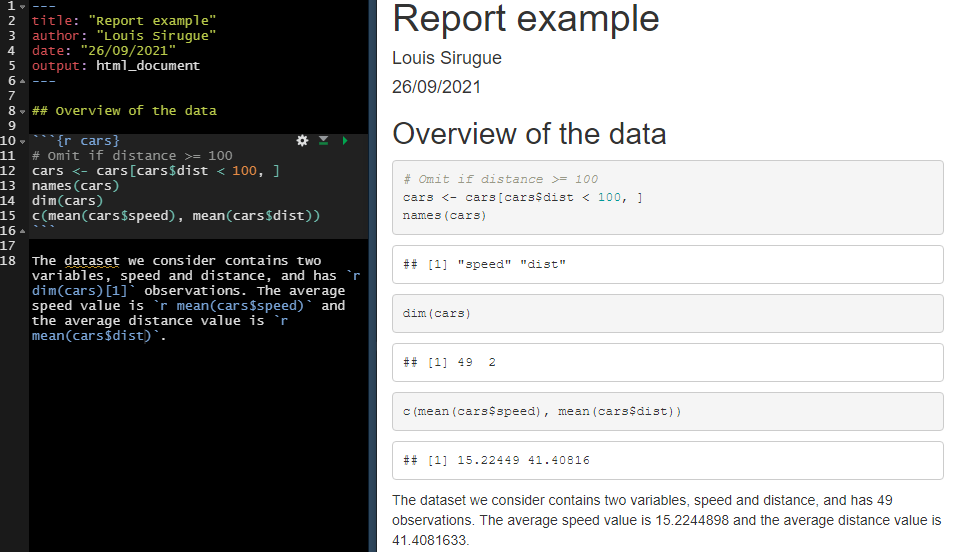

```{r setup, include = FALSE}
source(paste0(getwd(), "/../source/style.R"))
stargazer <- stargazer::stargazer
theme_minimal <- theme_Rcourse
options(htmltools.dir.version = F)
knitr::opts_chunk$set(echo = T, message = F, warning = F, fig.align = "center", dpi = 300, out.width = "100%")
set.seed(1)
```

### In Part I we saw

<p style = "margin-bottom:1.5cm;"></p>

--

 * **Different classes of R objects**

```{r, eval = F}
class("numeric") # What would be the output and why?
```

--

 * **Vectors**
 
```{r, eval = F}
match(8, c(6, 1, 9, 5, 8, 4)) # What would be the output and why?
```
 
--
 
 * **Functions**
 
```{r, eval = F}
age_from_ssn <- function(ssn) {
  return(2022 - (as.numeric(substr(ssn, 2, 3)) + 1900))
}
```

--

 * **Packages**

```{r}
library(tidyverse)
```

---

### In Part I we saw

#### Distributions

  * The **distribution** of a variable documents all its possible values and how frequent they are

--

```{r, echo = F, fig.width = 12, fig.height = 4, dpi=300, out.width="95%"}
library("ggpubr")

myhist <- function(b) {
  ggplot(hist_data, aes(x = x)) + 
    geom_histogram(fill = "#6794A7", color = "#014D64", alpha = .8, bins = b) +
    ylab("") + xlab("") + ggtitle(paste(b, "bins")) + theme_minimal(base_size = 14)
}

mydens <- function(b) {
  ggplot(hist_data, aes(x = x)) +
  geom_density(fill = "#6794A7", color = "#014D64", alpha = .8, bw = b) +
    ylab("") + xlab("") + ggtitle(paste("Bandwidth:", b)) + theme_minimal(base_size = 14)
}

hist_data <- read.csv("hist_illustration.csv") %>%
  mutate(y = runif(1000, 0, 1.45))

data <- read.csv("distribution_data.csv")

ggarrange(ggplot(data, aes(x = V1)) +
  geom_bar(stat = "count", fill = "#6794A7", color = "#014D64", alpha = .8) +
  scale_y_continuous(limits = c(0, 9), breaks = 0:9) + 
  scale_x_discrete(name = "", limits = 1:8) + ylab("") +
  theme_minimal(base_size = 16) + ggtitle("Barplot"),
  myhist(50) + ggtitle("Histogram"), mydens(.25) + ggtitle('Density'), 
  nrow = 1)
```

--

<p style = "margin-bottom:-1cm;">

 * We can describe a distribution with:
  
---

### In Part I we saw

#### Distributions

  * The **distribution** of a variable documents all its possible values and how frequent they are

```{r, echo = F, fig.width = 12, fig.height = 4, dpi=300, out.width="95%"}
ggarrange(ggplot(data, aes(x = V1)) +
            geom_bar(stat = "count", fill = "#6794A7", color = "#014D64", alpha = .8) +
            scale_y_continuous(limits = c(0, 9), breaks = 0:9) + 
            scale_x_discrete(name = "", limits = 1:8) + ylab("") +
            theme_minimal(base_size = 16) + ggtitle("Barplot") +
            geom_vline(xintercept = mean(data$V1)),
          myhist(50) + ggtitle("Histogram") +
            geom_vline(xintercept = mean(hist_data$x)), 
          mydens(.25) + ggtitle('Density') +
            geom_vline(xintercept = mean(hist_data$x)), 
  nrow = 1)
```

<p style = "margin-bottom:-1cm;">

 * We can describe a distribution with:
  * Its **central tendency**

---

### In Part I we saw

#### Distributions

  * The **distribution** of a variable documents all its possible values and how frequent they are

```{r, echo = F, fig.width = 12, fig.height = 4, dpi=300, out.width="95%"}
ggarrange(ggplot(data, aes(x = V1)) +
            geom_bar(stat = "count", fill = "#6794A7", color = "#014D64", alpha = .8) +
            scale_y_continuous(limits = c(0, 9), breaks = 0:9) + 
            scale_x_discrete(name = "", limits = 1:8) + ylab("") +
            theme_minimal(base_size = 16) + ggtitle("Barplot") +
            geom_vline(xintercept = mean(data$V1)) + 
            annotate("segment", x = mean(data$V1), xend = mean(data$V1) - sd(data$V1), y = 5.65, yend = 5.65, 
                     arrow = arrow(length = unit(0.25, "cm"))) + 
            annotate("segment", x = mean(data$V1), xend = mean(data$V1) + sd(data$V1), y = 5.65, yend = 5.65, 
                     arrow = arrow(length = unit(0.25, "cm"))),
          
          myhist(50) + ggtitle("Histogram") +
            geom_vline(xintercept = mean(hist_data$x)) + 
            annotate("segment", x = mean(hist_data$x), xend = mean(hist_data$x) - sd(hist_data$x), y = 35.2, yend = 35.2, 
                     arrow = arrow(length = unit(0.25, "cm"))) + 
            annotate("segment", x = mean(hist_data$x), xend = mean(hist_data$x) + sd(hist_data$x), y = 35.2, yend = 35.2, 
                     arrow = arrow(length = unit(0.25, "cm"))), 
          
          mydens(.25) + ggtitle('Density') +
            geom_vline(xintercept = mean(hist_data$x)) + 
            annotate("segment", x = mean(hist_data$x), xend = mean(hist_data$x) - sd(hist_data$x), y = .165, yend = .165, 
                     arrow = arrow(length = unit(0.25, "cm"))) + 
            annotate("segment", x = mean(hist_data$x), xend = mean(hist_data$x) + sd(hist_data$x), y = .165, yend = .165, 
                     arrow = arrow(length = unit(0.25, "cm"))), 
  nrow = 1)
```

<p style = "margin-bottom:-1cm;">

 * We can describe a distribution with:
  * Its **central tendency**
  * And its **spread**
  
---

### In Part I we saw

#### Central tendency

--

.pull-left[

 * The **mean** is the sum of all values divided by the number of observations

$$\bar{x} = \frac{1}{N}\sum_{i = 1}^Nx_i$$ 

]

--

.pull-right[

 * The **median** is the value that divides the (sorted) distribution into two groups of equal size

$$\text{Med}(x) = \begin{cases} x[\frac{N+1}{2}] & \text{if } N \text{ is odd}\\
\frac{x[\frac{N}{2}]+x[\frac{N}{2}+1]}{2} & \text{if } N \text{ is even}
\end{cases}$$

]

--

#### Spread

--

.pull-left[

 * The **standard deviation** is square root of the average squared deviation from the mean

$$\text{SD}(x) = \sqrt{\text{Var}(x)} = \sqrt{\frac{1}{N}\sum_{i = 1}^N(x_i-\bar{x})^2}$$
 
]

--

.pull-right[

<p style = "margin-bottom:-5.5cm;"></p>

 * The **interquartile range** is the difference between the maximum and the minimum value from the middle half of the distribution

<p style = "margin-bottom:1cm;"></p>

$$\text{IQR} = Q_3 - Q_1 $$

]

---

### In Part I we saw

#### Inference

<ul> 
  <li>In Statistics, we view variables as a given realization of a <b>data generating process</b></li>
  <ul>
    <li>Hence, the <b>mean</b> is what we call an <b>empirical moment</b>, which is an <b>estimation</b>...</li>
    <li>... of the <b>expected value</b>, the <b>theoretical moment</b> of the DGP we're interested in</li>
  </ul>
</ul>

--

<ul> 
  <li>To know how confident we can be in this estimation, we need to compute a <b>confidence interval</b></li>
</ul>

$$[\bar{x} - t_{n-1, \:97.5\%}\times\frac{\text{SD}(x)}{\sqrt{n}}; \:\bar{x} + t_{n-1, \:97.5\%}\times\frac{\text{SD}(x)}{\sqrt{n}}]$$

--

<ul>
  <ul>
    <li>It gets <b>larger</b> as the <b>variance</b> of the distribution of \(x\) increases</li>
    <li>And gets <b>smaller</b> as the <b>sample size</b> \(n\) increases</li>
  </ul>
</ul>

--

```{r, echo = F, fig.width = 12, fig.height = 1.75, dpi=300, out.width="95%"}
distribs <- tibble(val = c(rnorm(30, 0, 1), rnorm(100, 0, 1), rnorm(30, 0, 2), rnorm(100, 0, 2)),
                   dist = c(rep("d1",30), rep("d2", 100), rep("d3", 30), rep("d4", 100)),
                   y = 1) 

distribs <-distribs %>%
  bind_rows(distribs %>%
              group_by(dist) %>%
              summarise(lb = mean(val) - qt(.999, n()-1)*(sd(val)/sqrt(n())),
                        ub = mean(val) + qt(.999, n()-1)*(sd(val)/sqrt(n())),
                        val = mean(val),
                        y = 1.75) %>%
              pivot_longer(c(lb, ub), names_to = "interlab", values_to = "interval"))

ggplot() +
  geom_point(data = distribs %>% filter(y == 1), 
             aes(x = val, y = y, color = dist, fill = dist), 
             position = "jitter", show.legend = F) +
  geom_point(data = distribs %>% filter(y == 1.75), 
             aes(x = val, y = y, color = dist, fill = dist), 
             show.legend = F, size = 2) +
  geom_line(data = distribs, aes(x = interval, y = y, color = dist, fill = dist), show.legend = F, size = 1) +
  facet_wrap(~dist, nrow = 1) +
  theme(axis.title = element_blank(),
        axis.text.y = element_blank(),
        strip.text = element_blank(),
        strip.background = element_blank())
```


---

### In Part I we saw

#### Read data

```{r, eval = F}
starbucks <- read.csv("C:/User/Documents/folder/starbucks.csv", sep = ";", encoding = "UTF-8")
```

```{r, echo = F}
starbucks <- read.csv("starbucks.csv", sep = ";", encoding = "UTF-8")
```

<center><b><i>&#10140; Make sure to use / and not \</i></b></center>

--

#### Chaining operations


```{r}
starbucks %>%
  arrange(-Calories) %>%
  select(Beverage_category, Beverage_prep, Calories) %>%
  filter(row_number() <= 3)
```

<p style = "margin-bottom:.8cm;"></p>
<center><b><i>&#10140; Make sure to view your data at each step</i></b></center>

---

### In Part I we saw

<p style = "margin-bottom:1.5cm;"></p>

```{r, echo = F}
kable(tibble(Function = c("mutate()", "select()", "filter()", 
                    "arrange()", "group_by()", "summarise()", 
                    "bind_rows()", "left/right/inner/full_join()", "pivot_longer/wider()"),
       Meaning = c("Modify or create a variable", "Keep a subset of variables", "Keep a subset of observations",
                   "Sort the data", "Group the data", "Summarizes variables into 1 observation per group",
                   "Append data", "Merge data", "Reshape data")),
      caption = "<b>Important functions of the dplyr grammar</b>")
```

---

### In Part I we saw

<p style = "margin-bottom:2cm;">

<center><h4> The 3 core components of the ggplot() function </h4></center>

```{r, echo = F}
kable(tibble(Component = c("Data", "Mapping", "Geometry"),
             Contribution = c("Underlying values", "Axis assignment", "Type of plot"),
             Implementation = c("ggplot(data, | data %>% ggplot(.,", 
                                "aes(x = V1, y = V2, ...))",
                                "+ geom_point() + geom_line() + ...")), 
      caption = "",
      align = "lcc")
```

<p style = "margin-bottom:2cm;">

--

 * Any **other element** should be added with a **`+` sign**

```{r, eval = F}
ggplot(data, aes(x = V1, y = V2)) + 
  geom_point() + geom_line() +
  anything_else()
```

---

### In Part I we saw

.pull-left[
<p style = "margin-bottom:1.75cm;">
<center><h4> Main customization tools </h4></center>
```{r, echo = F}
kable(tibble(`Item to customize` = c("Axes", "Baseline theme", "Annotations", "Theme"),
             `Main functions` = c("scale_[x/y]_[continuous/discrete]", 
                                  "theme_[void/minimal/.../dark]()", 
                                  "geom_[[h/v]line/text](), annotate()",
                                  "theme(axis.[line/ticks].[x/y] = ...,")), 
      caption = "", align = "ll")
```
]

--

.pull-right[
<center><h4> Main types of geometry </h4></center>
```{r, echo = F}
kable(tibble(Geometry = c("Bar plot", "Histogram", "Area", "Line", 
                          "Density", "Boxplot", "Violin", "Scatter plot"),
             Function = c("geom_bar()", "geom_histogram()", "geom_area()", 
                          "geom_line()", "geom_density()", "geom_boxplot()",
                          "geom_violin()", "geom_point()")), caption = "", align = "lc") 
```
]

---

### In Part I we saw

.pull-left[

<center><h4> Main types of aesthetics </h4></center>

```{r, echo = F}
kable(tibble(Argument = c("alpha", "color", "fill", "size", "shape", "linetype"),
             Meaning = c("opacity from 0 to 1",
                         "color of the geometry", 
                         "fill color of the geometry", 
                         "size of the geometry", 
                         "shape for geometries like points", 
                         "solid, dashed, dotted, etc.")), caption = "")
```
]

--

.pull-right[

<p style = "margin-bottom:3.25cm;"></p>

<ul>
  <li>If specified <b>in the geometry</b></li>
  <ul>
    <li>It will apply uniformly to every <b>all the geometry</b></li>
  </ul>
</ul>
 
<p style = "margin-bottom:1cm;"></p>

<ul>
  <li>If assigned to a variable <b>in aes</b></li>
  <ul>
    <li>it will <b>vary with the variable</b> according to a scale documented in legend</li>
  </ul>
</ul>
]

<br>

--

```{r, eval = F}
ggplot(data, aes(x = V1, y = V2, size = V3)) + 
  geom_point(color = "steelblue", alpha = .6)
```


---

### In Part I we saw

#### R Markdown: Three types of content

.left-column[



]

.right-column[
<p style = "margin-bottom:1.5cm;">

<b>YAML header</b>

<p style = "margin-bottom:1.75cm;">

<b>Code chunks</b>

<p style = "margin-bottom:5cm;">

<b>Text</b>
]

---

### In Part I we saw

#### Useful features

&#10140; **Inline code** allows to include the output of some **R code within text areas** of your report

<p style = "margin-bottom:-.5cm;">

--

.pull-left[
<center> <h4> Syntax </h4> </center>

```{r, eval=F}
`paste("a", "b", sep = "-")`
```

```{r, eval=F}
`r paste("a", "b", sep = "-")`
```

]

.pull-right[
<center> <h4> Output </h4> </center>

`paste("a", "b", sep = "-")`

<p style = "margin-bottom:1cm;">

`r paste("a", "b", sep = "-")`
 
]

<p style = "margin-bottom:2cm;">

--

&#10140; **`kable()`** for clean **html tables** and **`datatable()`** to navigate in **large tables**
 
```{r, eval = FALSE}
kable(results_table)
datatable(results_table)
```

---

### In Part I we saw

#### LaTeX for equations

 * $\LaTeX$ is a convenient way to display **mathematical** symbols and to structure **equations**
  * The **syntax** is mainly based on **backslashes \ and braces {}**

--

<p style = "margin-bottom:1cm;">

&nbsp;&nbsp;&nbsp;&nbsp;&#10140; What you **type** in the text area: `$x \neq \frac{\alpha \times \beta}{2}$`  
&nbsp;&nbsp;&nbsp;&nbsp;&#10140; What is **rendered** when knitting the document: $x \neq \frac{\alpha \times \beta}{2}$

--

<p style = "margin-bottom:1.5cm;">

<center>To <b>include</b> a <b>LaTeX equation</b> in R Markdown, you simply have to surround it with the <b>$ sign</b></center>

<p style = "margin-bottom:0cm;">

.pull-left[

<h4 style = "margin-bottom:0cm;">The mean formula with one `$` on each side</h4>  
&nbsp;&nbsp;&nbsp;&nbsp;&#10140; For inline equations  
 
$\overline{x}=\frac{1}{N}\sum_{i=1}^N x_i$ 

]

.pull-right[

<h4 style = "margin-bottom:0cm;">The mean formula with two `$` on each side</h4>  
&nbsp;&nbsp;&nbsp;&nbsp;&#10140; For large/emphasized equations  
 
$$\overline{x}=\frac{1}{N}\sum_{i=1}^N x_i$$ 

]

---

<h3>Today: <i>We start Econometrics!</i></h3>

<p style = "margin-bottom:1.25cm;">

--

#### 1. Joint distributions &#10004;
<p style = "margin-bottom:-.5cm;">
 * 1.1. Definition
 * 1.2. Covariance
 * 1.3. Correlation

#### 2. Univariate regressions
<p style = "margin-bottom:-.5cm;">
 * 2.1. Introduction to regressions
 * 2.2. Coefficients estimation
 * 2.3. Regression fit
 
#### 2. Inference
<p style = "margin-bottom:-.5cm;">
 * 2.1. Standard error
 * 2.2. Confidence interval
 * 2.3. P-value
 
#### 3. Multivariate regressions and lm()
<p style = "margin-bottom:-.5cm;">
 * 3.1. Multivariate regressions
 * 3.2. The `lm()` function

#### 4. Wrap up!

---

<h3>Today: <i>We start Econometrics!</i></h3>

<p style = "margin-bottom:1.25cm;">

#### 1. Univariate regressions
<p style = "margin-bottom:-.5cm;">
 * 1.1. Introduction to regressions
 * 1.2. Coefficients estimation
 * 1.3. Regression fit

---

### 4. Joint distributions

#### 4.1. Definition

 * The joint distribution shows the possible values and associated frequencies for two variable simultaneously
  * Remember how I plotted each observation of a variable on a line and shifted them randomly on the vertical axis

--

<p style = "margin-bottom: .75cm;"></p>

```{r, echo = F, fig.width = 12, fig.height = 5, dpi=300, out.width="80%"}
ggplot(hist_data, aes(x = x, y = y)) + 
  geom_point(alpha = .15, size = 2, fill = "#6794A7", color = "#014D64", height = .5, width = 0) + 
  scale_x_continuous(name = "Variable A", limits = c(-1.1775, 10.4925), breaks = seq(0, 10, 2.5)) +
  scale_y_continuous(name = "Random shift", limits = c(0, 1.6)) + 
  theme_minimal(base_size = 16) + theme(axis.text.y = element_blank()) 
```

---

### 4. Joint distributions

#### 4.1. Definition

 * The joint distribution shows the possible values and associated frequencies for two variable simultaneously
  * Remember how I plotted each observation of a variable on a line and shifted them randomly on the vertical axis
  * Instead of shifting observations randomly, vertical coordinates can indicate the value of a second variable

<p style = "margin-bottom: -.5cm;"></p>

```{r, echo = F, fig.width = 12, fig.height = 5, dpi=300, out.width="80%"}
hist_data <- hist_data %>%
  mutate(z = 3*x + rnorm(dim(hist_data)[1], 0, 4))

ggplot(hist_data, aes(x = x, y = z)) + 
  geom_point(alpha = .15, size = 2, fill = "#6794A7", color = "#014D64", height = .5, width = 0) + 
  scale_x_continuous(name = "Variable A", limits = c(-1.1775, 10.4925), breaks = seq(0, 10, 2.5)) +
  scale_y_continuous(name = "Variable B") + 
  theme_minimal(base_size = 16) 
```

---

### 4. Joint distributions

#### 4.1. Definition

 * But now, to show the frequency of each pair of values, we need a third axis

--

```{r, echo = F, fig.width = 12, fig.height = 6}
library(MASS)
den3d <- kde2d(hist_data$x, hist_data$z)

library(plotly)
plot_ly(x=den3d$x, y=den3d$y, z=den3d$z, colorscale ='YlGnBu') %>% add_surface() %>% 
  layout(plot_bgcolor = "#DFE6EB", paper_bgcolor = "#DFE6EB", fig_bgcolor = "#DFE6EB",
         scene = list(camera = list(eye = list(x = 0, y = -1, z = 0.75),
                                    center = list(x = 0, y = 0, z = -0.25)),
                      aspectratio = list(x = .9, y = .8, z = 0.4),
                      xaxis = list(title = "Variable A"),
                      yaxis = list(title = "Variable B"),
                      zaxis = list(title = "Joint density")))
```

---

### 4. Joint distributions

#### 4.2. Covariance 

 * When describing a single distribution, we're interested in its spread and central tendency
 * When describing a joint distribution, we're interested in the relationship between the two variables
  * This can be characterized by the covariance
 
--

$$ \text{Cov}(x, y) = \frac{1}{N}\sum_{i=1}^{N}(x_i − \bar{x})(y_i − \bar{y}) $$

--

 * When both $x_i$ and $y_i$ are above their respective mean, the contribution of observation $i$ to $\text{Cov}(x, y)$ is positive
 * This is also the case when both $x_i$ and $y_i$ are below their respective mean
 * But when $x_i$ and $y_i$ are not on the same side of their respective mean, the contribution of observation $i$ to $\text{Cov}(x, y)$ is negative
 
--
 
<center><h4>  &#10140; <i> If y tends to be large relative to its mean when x is large relative to its mean, their covariance is positive. Conversly, if one tends to be large when the other tends to be low, the covariance is negative.</i></h4></center>

---

### 4. Joint distributions

#### 4.2. Covariance 

```{r, echo = F, fig.width = 15, fig.height = 6.25, dpi=300, out.width="100%"}
data1 <- mvrnorm(2000, c(1, 10), matrix(c(1, -.8, -.8, 1), nrow = 2, byrow = T))
data2 <- mvrnorm(2000, c(1, 10), matrix(c(1, 0, 0, 1), nrow = 2, byrow = T))
data3 <- mvrnorm(2000, c(1, 10), matrix(c(1, .8, .8, 1), nrow = 2, byrow = T))

tibble(`Variable A` = c(data1[,1], data2[,1], data3[,1]),
       `Variable B` = c(data1[,2], data2[,2], data3[,2]),
       relationship = rep(c("Negative covariance", "Null covariance", "Positive covariance"), each = 2000)) %>%
  ggplot(., aes(x = `Variable A`, y = `Variable B`)) +
  geom_point(alpha = .15, size = 2, fill = "#6794A7", color = "#014D64") + 
  facet_wrap(~relationship) + theme_minimal(base_size = 16)
```

---

### 4. Joint distributions

#### 4.3. Correlation

 * One disadvantage of the covariance is that is it not standardized: you cannot directly compare the covariance of two pairs of completely different variables
 
  * Theoretically the covariance can take values from $-\infty$ to $+\infty$

<br>

--

 * This is why we often use the correlation coefficient
 
  * It is obtained by dividing the covariance by the product of the standard deviation of the two variables
  * This allows to standardize the coefficient between -1 and 1

<br>

--

$$\text{Corr}(x, y) = \frac{\text{Cov}(x, y)}{\text{SD}(x)\times\text{SD}(y)}$$

---

### 4. Joint distributions

#### 4.3. Correlation 

```{r, echo = F, fig.width = 15, fig.height = 6.25, dpi=300, out.width="100%"}

corr_set <- c(-.9, -.7, -.5, -.3, 0, .2, .4, .6, .8, 1)
corr_data <- mvrnorm(2000, c(1, 10), matrix(c(1, corr_set[1], corr_set[1], 1), nrow = 2, byrow = T))

for (i in corr_set[2:length(corr_set)]) {
  corr_data <- rbind(corr_data, mvrnorm(2000, c(1, 10), matrix(c(1, i, i, 1), nrow = 2, byrow = T)))
}

tibble(`Variable A` = corr_data[, 1],
       `Variable B` = corr_data[, 2],
       relationship = rep(paste("Correlation =", corr_set), each = 2000),
       order = rep(1:10, each = 2000)) %>%
  ggplot(., aes(x = `Variable A`, y = `Variable B`)) +
  geom_point(alpha = .15, size = 2, fill = "#6794A7", color = "#014D64") + 
  facet_wrap(~reorder(relationship, order), nrow = 2) + theme_minimal(base_size = 16)
```

---

### 4. Joint distributions

#### 4.3. But a same correlation can hide very different relationships

```{r, echo = F, fig.width = 15, fig.height = 6.25, dpi=300, out.width="100%"}
tibble(`Variable A` = c(10, 8, 13, 9, 11, 14, 6, 4, 12, 7, 5,
                        10, 8, 13, 9, 11, 14, 6, 4, 12, 7, 5,
                        10, 8, 13, 9, 11, 14, 6, 4, 12, 7, 5,
                        8, 8, 8, 8, 8, 8, 8, 19, 8, 8, 8),
       `Variable B` = c(8.04, 6.95,  7.58, 8.81,  8.33,  9.96, 7.24,  4.26, 10.84,  4.82,  5.68,
             9.14, 8.14,  8.74, 8.77,  9.26,  8.10, 6.13,  3.10,  9.13,  7.26,  4.74,
             7.46, 6.77, 12.74, 7.11,  7.81,  8.84, 6.08,  5.39,  8.15,  6.42,  5.73,
             6.58, 5.76,  7.71, 8.84,  8.47,  7.04, 5.25, 12.50,  5.56,  7.91,  6.89),
       relationship = as.character(rep(paste("Relationship", c("A", "B", "C", "D")), each = 11))) %>%
  ggplot(., aes(x = `Variable A`, y = `Variable B`)) +
  #geom_smooth(method = "lm", color = "#333333", linetype = "dotted", se = F) +
  geom_point(alpha = .4, size = 4, fill = "#6794A7", color = "#014D64") + 
  facet_wrap(~relationship, nrow = 1) + theme_minimal(base_size = 16) 
```


---

### 4. Joint distributions

#### 4.3. Covariance and correlation in R

--

Consider the following variables:

```{r}
mydata <- tibble(age = 2:10,
                 weight = c(12.7, 14.6, 15.9, 18.1, 21.1, 22.9, 26.1, 28.2, 32.3))
```

--

<p style = "margin-bottom:1cm;">

* The covariance can be obtain with the function `cov()`

```{r}
cov(mydata$age, mydata$weight)
```

<p style = "margin-bottom:1cm;">

--

* The correlation can be obtain with the function `cor()`

```{r}
cor(mydata$age, mydata$weight)
```

---


### 1. Univariate regressions

#### 1.1. Introduction to regressions

.pull-left[
 * Consider the following dataset
 
```{r}
ggcurve <- read.csv("ggcurve.csv")
kable(head(ggcurve, 5), "First 5 rows")
```
]

--

.pull-right[
  
  <p style = "margin-bottom:2cm;"></p>
  The data contains 2 variables at the country level:
  <p style = "margin-bottom:1cm;">
  <ol>
    <li><b>IGE:</b> Intergenerational elasticity, which captures the % average increase in child income for a 1% increase in parental income</li>
    <p style = "margin-bottom:1cm;">
    <li><b>Gini:</b> Gini index of income inequality from 0 (everybody has the same income) to 1 (a single individual has all the income)</li>
  </ol>
  
]


---

### 1. Univariate regressions

#### 1.1. Introduction to regressions

 * To investigate the relationship between these two variables we can start with a scatterplot:

--

```{r, fig.width = 8, fig.height = 4.5, out.width = "60%"}
ggplot(ggcurve , aes(x = gini, y = ige, label = country)) + geom_text()
```

---

### 1. Univariate regressions

#### 1.1. Introduction to regressions

 * We see that the two variables are positively correlated with each other:
  * When one tends to be high relative to its mean, the other as well
  * When one tends to be low relative to its mean, the other as well
  
--

<p style = "margin-bottom:1cm;">

```{r}
cor(ggcurve$gini, ggcurve$ige)
```
<p style = "margin-bottom:1cm;">

 * The correlation coefficient is equal to .65, 
  * Remember that the correlation can take values from -1 to 1
  * Here the correlation is indeed positive and fairly strong

<p style = "margin-bottom:1cm;">

--

<center><h4><i>&#10140; But the correlation does not indicate whether or not a given change in x is associated with a large change in y</i></h4></center>

---

<style> .left-column {width: 70%;} .right-column {width: 30%;} </style>

### 1. Univariate regressions

#### 1.1. Introduction to regressions

 * Consider these two relationships :

.left-column[

```{r, echo = F, fig.width = 8, fig.height = 4.5, out.width = "90%", fig.align='left'}
x <- rnorm(1000, 10, 1)
y1 <- 35 +(1.5*x) + rnorm(1000, -1.33, 1.33)
y2 <- (5*x) + rnorm(1000, -4.65, 4.65)

example <- tibble(x = c(x, x), y = c(y1, y2),
                  z = rep(paste("Relationship", 1:2), each = 1000))

ggplot(example, aes(x = x, y = y)) +
  geom_point(alpha = .3, color = "#014D64") + 
  facet_wrap(~z)
```

]

--

.right-column[

<p style = "margin-bottom:2.5cm;">
 
&#10140; One is less noisy but flatter
 
<p style = "margin-bottom:.5cm;">
 
&#10140; One is noisier but steeper

<p style = "margin-bottom:1.5cm;">
 
<h4>Both have a correlation of .75</h4>
 
]

---

### 1. Univariate regressions

#### 1.1. Introduction to regressions

 * Consider these two relationships :

.left-column[

```{r, echo = F, fig.width = 8, fig.height = 4.5, out.width = "90%", fig.align='left'}
ols1 <- summary(lm(y ~ x, example %>% filter(z == "Relationship 1")))$coefficients
ols2 <- summary(lm(y ~ x, example %>% filter(z == "Relationship 2")))$coefficients

example <- example %>%
  mutate(cross1 = ifelse(z == "Relationship 1", 
                         ols1[1, 1] + (ols1[2, 1] * 8), 
                         ols2[1, 1] + (ols2[2, 1] * 8)),
         cross2 = ifelse(z == "Relationship 1", 
                         ols1[1, 1] + (ols1[2, 1] * 10), 
                         ols2[1, 1] + (ols2[2, 1] * 10)),
         border = ifelse(z == "Relationship 1", 6.9, 6.9),
         miny = ifelse(z == "Relationship 1",
                       ols1[1, 1] + (ols1[2, 1] * 6.9), 
                       ols2[1, 1] + (ols2[2, 1] * 6.9)),
         maxy = ifelse(z == "Relationship 1",
                       ols1[1, 1] + (ols1[2, 1] * 13.9), 
                       ols2[1, 1] + (ols2[2, 1] * 13.9)))

dash_color <- "black"

ggplot(example, aes(x = x, y = y)) +
  geom_point(alpha = .3, color = "#014D64") + 
  
  geom_segment(aes(x = 6.9, y = miny, xend = 13.9, yend = maxy), linetype = "dashed", color = dash_color) +
  
  geom_segment(aes(x = 8, y = 25, xend = 8, yend = cross1), linetype = "dashed", color = dash_color) +
  geom_segment(aes(x = 10, y = 25, xend = 10, yend = cross2), linetype = "dashed", color = dash_color) +
  geom_segment(aes(x = 8, y = cross1, xend = border, yend = cross1), linetype = "dashed", color = dash_color) +
  geom_segment(aes(x = 10, y = cross2, xend = border, yend = cross2), linetype = "dashed", color = dash_color) +
  
  geom_segment(aes(x = border, y = cross1, xend = border, yend = cross2), arrow = arrow(length = unit(0.2, "cm")), color = dash_color) +
  geom_segment(aes(x = border, y = cross2, xend = border, yend = cross1), arrow = arrow(length = unit(0.2, "cm")), color = dash_color) +
  facet_wrap(~z) 
```

]

.right-column[

<p style = "margin-bottom:3cm;">

***But a given increase in x is not associated with a same increase in y!***
 
]

---

### 1. Univariate regressions

#### 1.1. Introduction to regressions

 * Knowing that the income inequality is correlated to intergenerational mobility is one thing

--

 * But should we expect a given increase in income inequality to be associated with a high or low change in intergenerational mobility?

<p style = "margin-bottom:1.5cm;">

--

<ul>
  <li>It is usually the type of question we're interested in:</li>
  <ul>
    <li>How much more should I expect to earn for an additional year of education?</li>
    <li>By how many years would life expectancy be expected to decrease for a given increase in air pollution?</li>
    <li>By how much would test scores increase for a given decrease in the number of students per teacher?</li>
  </ul>
</ul>

--

 * And this is typically what is of interest for policymakers

<p style = "margin-bottom:2cm;">

--

<center><h4><i>&#10140; But how to compute this expected change in y for a given change of x?</i></h4></center>

---

### 1. Univariate regressions

#### 1.2. Coefficients estimation

 * The idea is to find the line that fits the data the best
  * Such that its slope can indicate how we expect y to change if we increase x by 1 unit
 
--

```{r, echo = F, fig.width = 8, fig.height = 4.5, out.width = "65%"}
ols <- summary(lm(ige ~ gini, ggcurve))$coefficients
ggplot(ggcurve , aes(x = gini, y = ige, label = country)) +
  geom_point(alpha = .8, color = "#014D64") + geom_text(nudge_y = .02, alpha = .8, color = "#014D64") + 
  geom_segment(aes(x = min(ggcurve$gini), xend = max(ggcurve$gini), 
                   y = ols[1, 1] + (min(ggcurve$gini) * ols[2, 1]), 
                   yend = ols[1, 1] + (max(ggcurve$gini) * ols[2, 1])),
               color = "#014D64") +
  geom_segment(aes(x = .5, y = ols[1, 1] + (.5 * ols[2, 1]), xend = .6, yend = ols[1, 1] + (.5 * ols[2, 1])), 
               linetype = "dashed", color = dash_color) +
  geom_segment(aes(x = .6, y = ols[1, 1] + (.5 * ols[2, 1]), xend = .6, yend = ols[1, 1] + (.6 * ols[2, 1])), 
               linetype = "dashed", color = dash_color) +
  annotate("text", x = .625, y = .465, label = "slope (/10)")
```

---

### 1. Univariate regressions

#### 1.2. Coefficients estimation

 * But how do we find that line ?
 
--
 
```{r, echo = F, fig.width = 9.5, fig.height = 3.75, out.width = "100%"}
attempts <- ggcurve %>%
  mutate(`Attempt 3` = ols[1, 1] + (gini * ols[2, 1]),
         `Attempt 2` = (3 * gini) - 1,
         `Attempt 1` = .45) %>%
  pivot_longer(c(`Attempt 1`, `Attempt 2`, `Attempt 3`), names_to = "line_id", values_to = "line_value")

ggplot(attempts, aes(x = gini, y = ige)) + 
  geom_point(alpha = .4, color = "#014D64") +
  geom_line(aes(y = line_value), alpha = .8, color = "#014D64") +
  facet_wrap(~line_id)
```

---

### 1. Univariate regressions

#### 1.2. Coefficients estimation

 * We try to minimize the distance between each point and our line

--
 
```{r, echo = F, fig.width = 9.5, fig.height = 3.75, out.width = "100%"}
test <- attempts %>%
  mutate(obs = row_number()) %>%
  pivot_longer(c(ige, line_value), names_to = "dot_id", values_to = "dot")

dists <- attempts %>%
  group_by(line_id) %>%
  summarise(dist = sum(abs(ige-line_value))) %>%
  select(dist) %>%
  deframe() %>%
  round(., 2)

attempts %>%
  mutate(line_id = case_when(line_id == "Attempt 1" ~ paste("Attempt 1: sum dist. =", dists[1]),
                             line_id == "Attempt 2" ~ paste("Attempt 2: sum dist. =", dists[2]),
                             line_id == "Attempt 3" ~ paste("Attempt 3: sum dist. =", dists[3]))) %>%
  ggplot(., aes(x = gini, y = ige)) + 
  geom_point(alpha = .4, color = "#014D64") +
  geom_line(aes(y = line_value), alpha = .8, color = "#014D64") +
  geom_line(data = test%>%
  mutate(line_id = case_when(line_id == "Attempt 1" ~ paste("Attempt 1: sum dist. =", dists[1]),
                             line_id == "Attempt 2" ~ paste("Attempt 2: sum dist. =", dists[2]),
                             line_id == "Attempt 3" ~ paste("Attempt 3: sum dist. =", dists[3]))), 
  aes(x = gini, y = dot, group = obs), linetype = "dashed", alpha = .7, color = "#014D64") +
  facet_wrap(~line_id)
```


---


### 1. Univariate regressions

#### 1.2. Coefficients estimation
 
.pull-left[

<p style = "margin-bottom:1cm;"></p>

Take for instance the 20<sup>th</sup> observation: Peru

```{r, echo = F, fig.width = 5.5, fig.height = 3.5, out.width = "100%"}
library(latex2exp)
xperu <- deframe(attempts[attempts$country == "Peru" & attempts$line_id == "Attempt 3", "gini"])
y1peru <- deframe(attempts[attempts$country == "Peru" & attempts$line_id == "Attempt 3", "line_value"])
y2peru <- deframe(attempts[attempts$country == "Peru" & attempts$line_id == "Attempt 3", "ige"])

attempts %>%
  mutate(focus = ifelse(country == "Peru", 1, 0)) %>%
  filter(line_id == "Attempt 3") %>%
  ggplot(., aes(x = gini, y = ige)) + 
  geom_point(aes(size = focus), alpha = .4, color = "#014D64", show.legend = F) +
  geom_point(aes(size = focus), alpha = .4, color = "#014D64", show.legend = F) +
  geom_line(aes(y = line_value), alpha = .8, color = "#014D64") +
  geom_segment(aes(x = xperu, xend = xperu, y = y1peru, yend = y2peru), arrow = arrow(length = unit(0.2, "cm"))) + 
  geom_segment(aes(x = xperu, xend = xperu, y = y2peru, yend = y1peru), arrow = arrow(length = unit(0.2, "cm"))) + 
  annotate("text", x = xperu - .015, y = y1peru, label = TeX("$\\widehat{y_{20}}$", output = "character"), parse = T) +
  annotate("text", x = xperu - .015, y = y2peru, label = TeX("$y_{20}$", output = "character"), parse = T) +
  annotate("text", x = xperu + .01, y = (y1peru + y2peru) / 2, label = TeX("$\\widehat{\\epsilon_{20}}$", output = "character"), parse = T)
```

]

--

.pull-right[

And consider the following notations:

  * We denote $y_i$ the ige of the $i^{\text{th}}$ country
  
  * We denote $x_i$ the gini of the $i^{\text{th}}$ country
  
  * We denote $\widehat{y_i}$ the value of the $y$ coordinate of our line when $x = x_i$

<p style = "margin-bottom:1.5cm;"></p>
  
&#10140; The distance between the $i^{\text{th}}$ y value and the line is thus $y_i - \widehat{y_i}$

 * We label that distance $\widehat{\varepsilon_i}$

]

---

### 1. Univariate regressions

#### 1.2. Coefficients estimation

.pull-left[

<p style = "margin-bottom:2cm;"></p>

```{r, echo = F, fig.width = 5.5, fig.height = 3.5, out.width = "100%"}
attempts %>%
  filter(line_id == "Attempt 3") %>%
  ggplot(., aes(x = gini, y = ige)) + 
  geom_point(alpha = .4, color = "#014D64") +
  geom_line(aes(y = line_value), alpha = .8, color = "#014D64") +
  geom_line(data = test %>% filter(line_id == "Attempt 3"), 
  aes(x = gini, y = dot, group = obs), linetype = "dashed", alpha = .7, color = "#014D64")
```

]

.pull-right[

 * Because $\widehat{\varepsilon_i}$ is the value of the distance between a point $y_i$ and its corresponding value on the line $\widehat{y_i}$ we can write:

$$y_i = \widehat{y_i} + \widehat{\varepsilon_i}$$

 * And because $\widehat{y_i}$ is a straight line, it can be expressed as
 
$$\widehat{y_i} = \hat{\alpha} + \hat{\beta}x_i$$

 * Where:
  * $\hat{\alpha}$ is the y-intercept
  * $\hat{\beta}$ is the slope
]

---

### 1. Univariate regressions

#### 1.2. Coefficients estimation

 * Combining these two definitions yields the equation:

$$y_i = \hat{\alpha} + \hat{\beta}x_i + \widehat{\varepsilon_i} \begin{cases}  y_i = \widehat{y_i} + \widehat{\varepsilon_i}& \text{Definition of distance}\\
\widehat{y_i} = \hat{\alpha} + \hat{\beta}x_i & \text{Definition of the line}
\end{cases}$$

--

<p style = "margin-bottom:1cm;"></p>

 * Depending on the values of $\hat{\alpha}$ and $\hat{\beta}$, the value of every $\widehat{\varepsilon_i}$ will change

--

<p style = "margin-bottom:-.5cm;"></p>

.left-column[
```{r, echo = F, fig.width = 9.5, fig.height = 3.75, out.width = "90%", fig.align='left'}
attempts %>%
  mutate(line_id = case_when(line_id == "Attempt 1" ~ paste("Attempt 1: sum dist. =", dists[1]),
                             line_id == "Attempt 2" ~ paste("Attempt 2: sum dist. =", dists[2]),
                             line_id == "Attempt 3" ~ paste("Attempt 3: sum dist. =", dists[3]))) %>%
  ggplot(., aes(x = gini, y = ige)) + 
  geom_point(alpha = .4, color = "#014D64") +
  geom_line(aes(y = line_value), alpha = .8, color = "#014D64") +
  geom_line(data = test%>%
  mutate(line_id = case_when(line_id == "Attempt 1" ~ paste("Attempt 1: sum dist. =", dists[1]),
                             line_id == "Attempt 2" ~ paste("Attempt 2: sum dist. =", dists[2]),
                             line_id == "Attempt 3" ~ paste("Attempt 3: sum dist. =", dists[3]))), 
  aes(x = gini, y = dot, group = obs), linetype = "dashed", alpha = .7, color = "#014D64") +
  facet_wrap(~line_id)
```

]

.right-column[

<p style = "margin-bottom:-.25cm;"></p>

**Attempt 1:** $\hat{\alpha}$ is too high and $\hat{\beta}$ is too low &#10140; $\widehat{\varepsilon_i}$ are large
 
**Attempt 2:** $\hat{\alpha}$ is too low and $\hat{\beta}$ is too high &#10140; $\widehat{\varepsilon_i}$ are large
 
**Attempt 3:** $\hat{\alpha}$ and $\hat{\beta}$ seem appropriate &#10140; $\widehat{\varepsilon_i}$ are low

]

---

### 1. Univariate regressions

#### 1.2. Coefficients estimation

 * We want to find the values of $\hat{\alpha}$ and $\hat{\beta}$ that minimize the overall distance between the points and the line

--

$$\min_{\hat{\alpha}, \hat{\beta}}\sum_{i=1}^{n}\widehat{\varepsilon_i}^2$$
<ul>
  <ul>
    <li>Note that we square \(\widehat{\varepsilon_i}\) to avoid that its positive and negative values compensate</li>
    <li>This method is what we call <b>Ordinary Least Squares (OLS)</b></li>
  </ul>
</ul>

<p style = "margin-bottom:1.5cm;"></p>

--

 * To solve this optimization problem, we need to express $\widehat{\varepsilon_i}$ it in terms of alpha $\hat{\alpha}$ and $\hat{\beta}$

$$y_i = \hat{\alpha} + \hat{\beta}x_i + \widehat{\varepsilon_i}$$ 
$$\Longleftrightarrow$$
$$\widehat{\varepsilon_i} = y_i -\hat{\alpha} - \hat{\beta}x_i$$

---

### 1. Univariate regressions

#### 1.2. Coefficients estimation

 * And our minimization problem writes

$$\min_{\hat{\alpha}, \hat{\beta}}\sum_{i=1}^{n}(y_i -\hat{\alpha} - \hat{\beta}x_i)^2$$

--

$$
\begin{align}
\frac{\partial}{\partial\hat{\alpha}} = 0 & \:\: \Longleftrightarrow \:\: -2\sum_{i=1}^n(y_i - \hat{\alpha} - \hat{\beta}x_i) = 0 \\
\frac{\partial}{\partial\hat{\beta}}  = 0 & \:\: \Longleftrightarrow \:\: -2x_i\sum_{i=1}^n(y_i - \hat{\alpha} - \hat{\beta}x_i) = 0
\end{align}
$$

<p style = "margin-bottom:1cm;"></p>

--

 * Rearranging the first equation yields
 
$$\sum_{i=1}^ny_i - n\hat{\alpha} - \sum_{i=1}^n\hat{\beta}x_i = 0 \:\: \Longleftrightarrow \:\: \hat{\alpha} =\bar{y} - \hat{\beta}\bar{x}$$

---

### 1. Univariate regressions

#### 1.2. Coefficients estimation

 * Replacing $\hat{\alpha}$ in the second equation by its new expression writes

$$-2\sum_{i=1}^n(y_i - \hat{\alpha} - \hat{\beta}x_i) = 0  \:\: \Longleftrightarrow \:\: -2\sum_{i=1}^n\left[y_i - (\bar{y} - \hat{\beta}\bar{x}) - \hat{\beta}x_i\right] = 0$$

--

<p style = "margin-bottom:1.25cm;"></p>

 * And by rearranging the terms we obtain
 
$$\hat{\beta} = \frac{\sum_{i = 1}^n(x_i-\bar{x})(y_i-\bar{y})}{\sum_{i = 1}^n(x_i-\bar{x})^2}$$

--

<p style = "margin-bottom:1.25cm;"></p>

  * Notice that multiplying the nominator and the denominator by $1/n$ yields:
  
$$\hat{\beta} = \frac{\text{Cov}(x_i, y_i)}{\text{Var}(x_i)} \:\:\:\:\:\:\:\:\: ; \:\:\:\:\:\:\:\:\: \hat{\alpha} = \bar{y} - \frac{\text{Cov}(x_i, y_i)}{\text{Var}(x_i)} \times\bar{x}$$

---

### Practice

<p style = "margin-bottom:1cm;"></p>

 **1) Write a function that takes two variables `x` and `y` as inputs, computes the $\hat{\alpha}$ and $\hat{\beta}$ coefficients, and returns the two coefficients in a vector as the output**

--

<p style = "margin-bottom:1cm;"></p>

 **2) Import the data `ggcurve.csv` and use your function to compute by how much the IGE increases on expectation for a one unit increase in the Gini index**

--

<p style = "margin-bottom:1cm;"></p>

 **3) Plot your results (scatter plot + line)**

--

<p style = "margin-bottom:1cm;"></p>
 
Remember:

$$\hat{\beta} = \frac{\text{Cov}(x_i, y_i)}{\text{Var}(x_i)} \:\:\:\:\:\:\:\:\:\:\:\:\:\:\:\:\:\:\:\:\:\:\:\: \hat{\alpha} = \bar{y} - \frac{\text{Cov}(x_i, y_i)}{\text{Var}(x_i)} \times\bar{x}$$

--

<p style = "margin-bottom:1.5cm;"></p>

<center><h3><i>You've got 5 minutes!</i></h3></center>

---

### Solution

```{r}
# Define the function
alpha_beta <- function(x, y) {
  
  # Compute the beta coefficient
  beta <- cov(x, y)/var(x)
  
  # Compute the alpha coefficient
  alpha <- mean(y) - (beta * mean(x))
  
  # Return the two coefficients in a vector
  return(c(alpha, beta))
  
}


# Read the data
ggcurve <- read.csv("ggcurve.csv") 

# Apply the fouction to the data using gini as 
# the x variable and ige as the y variable
alpha_beta(ggcurve$gini, ggcurve$ige)
```
 
---

### Solution

```{r, fig.width = 5.5, fig.height = 3.5, out.width = "45%"}
# Store the coefficients
coefs <- alpha_beta(ggcurve$gini, ggcurve$ige)

ggcurve %>% # Compute the values on the line
  mutate(line = coefs[1] + gini * coefs[2]) %>%
  # Do the plot
  ggplot(., aes(x = gini)) + geom_point(aes(y = ige)) + geom_line(aes(y = line))
```
 
---

<center><h3> Vocabulary </h3></center>

 * This equation we're working on is called a regression model
 
$$y_i = \hat{\alpha} + \hat{\beta}x_i + \widehat{\varepsilon_i}$$ 

--

<ul><ul>
<li> We say that we regress \(y\) on \(x\) to find the coefficients \(\hat{\alpha}\) and \(\hat{\beta}\) that characterize the regression line</li> <li> We often call \(\hat{\alpha}\) and \(\hat{\beta}\) <i>parameters</i> of the regression because it is what we tune to fit our model to the data</li>
</ul></ul>

<p style = "margin-bottom:1.5cm;"></p>

--

<ul>
  <li>We also have different names for the \(x\) and \(y\) variables</li>
  <ul>
    <li> \(y\) is called the <i>dependent</i> or <i>explained</i> variable
    <li> \(x\) is called the <i>independent</i> or <i>explanatory</i> variable
  </ul>
</ul>


--

<p style = "margin-bottom:1.5cm;"></p>

 * We call $\widehat{\varepsilon_i}$ the residuals because it is what is left after we fitted the data the best we could

--

<p style = "margin-bottom:1.5cm;"></p>

 * And $\hat{y_i} = \hat{\alpha} + \hat{\beta}x_i$, i.e., the value on the regression line for a given $x_i$ are called the fitted values

---

### 1. Univariate regressions

#### 1.3. Regression fit


<p style = "margin-bottom:-.5cm;"></p>

.pull-left[

  * Now we know how to compute the expected change in y for a one unit increase in x by fitting the best straight line we can

<p style = "margin-bottom:1.5cm;"></p>

```{r, echo = F, fig.width = 5.5, fig.height = 3.5, out.width = "100%"}
x1 <- rnorm(1000, 4, 1)
y1 <- 10 + 3*x1 + rnorm(1000, 0, .5)
y2 <- 10 + 3*x1 + rnorm(1000, 0, 4)

ggplot(tibble(x = x1, y = y1, fit = 3 * x1 + 10), aes(x = x, y = y)) +
  geom_point(alpha = .1, color = "#014D64") + 
  geom_segment(aes(x = 0, y = 10, xend = 8, yend = 34), linetype = "solid", color = dash_color) +
  geom_segment(aes(x = 1, y = 1*3+10, xend = 2, yend = 1*3+10), linetype = "dashed", color = dash_color) +
  geom_segment(aes(x = 2, y = 1*3+10, xend = 2, yend = 2*3+10), linetype = "dashed", color = dash_color) +
  annotate("text", x = .2, y = 11.5, label = TeX("$\\hat{\\alpha} = 10$", output = "character"), size = 5, parse = T) +
  annotate("text", x = 2.5, y = 14.5, label = TeX("$\\hat{\\beta} = 3$", output = "character"), size = 5, parse = T)
```

]

--

.pull-right[

 * But even the best line may fail to explain a lot a the variation in y, we need to evaluate the extent to which our model does explain the y variations

<p style = "margin-bottom:1.5cm;"></p>
 
```{r, echo = F, fig.width = 5.5, fig.height = 3.5, out.width = "95%"}
x1 <- rnorm(1000, 4, 1)
y1 <- 10 + 3*x1 + rnorm(1000, 0, .5)
y2 <- 10 + 3*x1 + rnorm(1000, 0, 4)

ggplot(tibble(x = x1, y = y2, fit = 3 * x1 + 10), aes(x = x, y = y)) +
  geom_point(alpha = .1, color = "#014D64") + 
  geom_segment(aes(x = 0, y = 10, xend = 8, yend = 34), linetype = "solid", color = dash_color) +
  geom_segment(aes(x = 1, y = 1*3+10, xend = 2, yend = 1*3+10), linetype = "dashed", color = dash_color) +
  geom_segment(aes(x = 2, y = 1*3+10, xend = 2, yend = 2*3+10), linetype = "dashed", color = dash_color) +
  annotate("text", x = .2, y = 11.5, label = TeX("$\\hat{\\alpha} = 10$", output = "character"), size = 5, parse = T) +
  annotate("text", x = 2.5, y = 14.5, label = TeX("$\\hat{\\beta} = 3$", output = "character"), size = 5, parse = T)
```

]

---

### 1. Univariate regressions

#### 1.3. Regression fit

 * We can have an idea of the extent to which our linear model explains the variations in y using
  * The total variation of the y variable (its variance $\sum_{i = 1}^n(y_i-\bar{y})^2$)
  * The remaining variation of the y variable once its modeled (the sum of squared residuals $\sum_{i = 1}^n\hat{\varepsilon_i}^2$)

<p style = "margin-bottom:1cm;"></p>

--

```{r, echo = F, fig.width = 7.5, fig.height = 3.3, out.width = "70%"}
rbind(attempts %>%
        mutate(obs = row_number(),
               mean = mean(ige)) %>%
        pivot_longer(c(ige, mean), names_to = "dot_id", values_to = "dot") %>%
        filter(line_id == "Attempt 3") %>%
        select(-line_value) %>%
        mutate(facet = "Total variation \n(deviation from mean)",
               order = 1),
      attempts %>%
        mutate(obs = row_number()) %>%
        pivot_longer(c(ige, line_value), names_to = "dot_id", values_to = "dot") %>%
        filter(line_id == "Attempt 3") %>%
        mutate(facet = "Remaining variation \n(deviation from fit)",
      order = 2))%>% 
  ggplot(.) +
  geom_line(aes(x = gini, y = dot, group = obs), 
            linetype = "dashed", alpha = .7, color = "#014D64") +
    facet_wrap(~reorder(facet, order)) +
  geom_point(data = attempts %>% filter(line_id == "Attempt 3"),
             aes(x = gini, y = ige), alpha = .4, color = "#014D64") +
  geom_line(data = . %>% filter(dot_id != "ige"),
             aes(x = gini, y = dot), alpha = .4, color = "#014D64") +
  ylab("ige")
```


---

### 1. Univariate regressions

#### 1.3. Regression fit

 * We can then obtain a proper formula from the following reasoning
 
<p style = "margin-bottom:.75cm;"></p>

$$\text{Total variation} = \text{Explained variation} + \text{Remaining variation} $$

--

<p style = "margin-bottom:.75cm;"></p>


$$\frac{\text{Explained variation}}{\text{Total variation}} = 1 - \frac{\text{Remaining variation}}{\text{Total variation}}$$

--

<p style = "margin-bottom:.75cm;"></p>

$$\frac{\text{Explained variation}}{\text{Total variation}} = 1 - \frac{\sum_{i = 1}^n\hat{\varepsilon_i}^2}{\sum_{i = 1}^n(y_i-\bar{y})^2} \equiv \text{R}^2$$

<p style = "margin-bottom:1cm;"></p>

--

 * Because all the terms are sums of squares, we usually talk about *Total Sum of Squares* (TSS), *Explained Sum of Squares* (ESS) and *Residual Sum of Squares* (RSS)

--

 * Because the total sum of squares is the variance of y, the R<sup>2</sup> (also called *coefficient of determination*) can be interpreted as the share of the variance of y explained by the model
 

---

<h3>Overview</h3>

<p style = "margin-bottom:1.25cm;">

#### 1. Univariate regressions &#10004;
<p style = "margin-bottom:-.5cm;">
 * 1.1. Introduction to regressions
 * 1.2. Coefficients estimation
 * 1.3. Regression fit
 
#### 2. Inference
<p style = "margin-bottom:-.5cm;">
 * 2.1. Standard error
 * 2.2. Confidence interval
 * 2.3. P-value
 
#### 3. Multivariate regressions and lm()
<p style = "margin-bottom:-.5cm;">
 * 3.1. Multivariate regressions
 * 3.2. The `lm()` function

#### 4. Wrap up!

---

<h3>Overview</i></h3>

<p style = "margin-bottom:1.25cm;">


#### 1. Univariate regressions &#10004;
<p style = "margin-bottom:-.5cm;">
 * 1.1. Introduction to regressions
 * 1.2. Coefficients estimation
 * 1.3. Regression fit
 
#### 2. Inference
<p style = "margin-bottom:-.5cm;">
 * 2.1. Standard error
 * 2.2. Confidence interval
 * 2.3. P-value

---

### 2. Inference

#### 2.1. Standard error

 * In practice we estimate the parameters of a regression on a given sample of the population of interest

--

<p style = "margin-bottom:1.5cm;"></p>

 * In our case we have computed $\hat{\alpha}$ and $\hat{\beta}$ using 22 countries
  * But what if instead of having Japan and Canada we had Austria and Latvia?

--

<p style = "margin-bottom:1.5cm;"></p>

 * The $\hat{\beta}$ from our sample is actually an estimation of the unobserved $\beta$ of the underlying population

--

<p style = "margin-bottom:2cm;"></p>

<center><h4><i>&#10140; To make inference possible we would like to know how reliable \(\hat{\beta}\) is, how confident we are in its estimation</i><h4></center>

---

### 2. Inference

#### 2.1. Standard error

<ul>
  <li>To get an idea of the precision of \(\beta\), we can estimate its <i>standard error</i></li>
  <ul>
    <li>We won't go through the theoretical computations together, but let's have a look at the formula</li>
  </ul>
</ul>

<p style = "margin-bottom:1cm;"></p>
 
$$\text{se}(\hat{\beta}) = \sqrt{\widehat{\text{Var}(\hat{\beta})}} = \sqrt{\frac{\sum_{i = 1}^n\hat{\varepsilon_i}^2}{(n-\#\text{parameters})\sum_{i = 1}^n(x_i-\bar{x})^2}}$$

<p style = "margin-bottom:1.25cm;"></p>

--

<ul>
  <li>Notice that the variance, and thus the standard error of our estimate:</li>
  <ul>
    <li>Decreases as our sample gets bigger</li>
    <li>Gets larger if the points are further away from the regression line on average for a given variance of \(x\)</li>
  </ul>
</ul>

<p style = "margin-bottom:1.25cm;"></p>

--

<center><i>And keep in mind that while the <b>standard deviation</b> measures the amount of variability, or dispersion, from the individual data values to the mean, the <b>standard error</b> measures how far an estimate from a given sample is likely to be from the true parameter of interest</i></center>

---

### Practice

<p style = "margin-bottom:2cm;"></p>

 **1) Compute the standard error of our $\hat{\beta}$ coefficient estimate**

--

<p style = "margin-bottom:2cm;"></p>
 
Remember:

$$\text{se}(\hat{\beta}) = \sqrt{\widehat{\text{Var}(\hat{\beta})}} = \sqrt{\frac{\sum_{i = 1}^n\hat{\varepsilon_i}^2}{(n-\#\text{parameters})\sum_{i = 1}^n(x_i-\bar{x})^2}}$$

--

<p style = "margin-bottom:3cm;"></p>

<center><h3><i>You've got 5 minutes!</i></h3></center>

---

### Solution

.pull-left[
```{r}
# Store the alpha and beta parameters
coefs <- alpha_beta(ggcurve$gini, ggcurve$ige)

data <- ggcurve %>%

  # Rename x and y for convenience
  rename(x = gini, y = ige) %>%
  
  # Compute what we need
  mutate(yhat = coefs[1] + (x * coefs[2]),
         e2 = (y - yhat)^2,
         x_xbar2 = (x - mean(x))^2)

# Compute numerator and denominator
num <- sum(data$e2)
den <- (nrow(data) - 2) * sum(data$x_xbar2)

se_beta <- sqrt(num/den) # Square root 
se_beta
```
]

.pull-right[

<p style = "margin-bottom:5cm;"></p>

$$\text{se}(\hat{\beta}) = \sqrt{\frac{\sum_{i = 1}^n\hat{\varepsilon_i}^2}{(n-\#\text{parameters})\sum_{i = 1}^n(x_i-\bar{x})^2}}$$
]

---

### 2. Inference

#### 2.2. Confidence intervals

 * The magnitude of the standard error gives an indication of the precision of our estimate:
  * The larger the estimate relative to its standard error, the more precise the estimate

<p style = "margin-bottom:1cm;"></p>

--

 * But standard errors are not easily interpretable by themselves
  * A more direct way to get a sense of the precision for inference is to construct a confidence interval

<p style = "margin-bottom:1cm;"></p>

--

<center>&#10140; <b>Instead of saying that our estimation \(\hat{\beta}\) is equal to 1.02, we would like to say that we are 95% sure that the actual \(\beta\) lies between two given values</b></center>

<p style = "margin-bottom:.5cm;"></p>

--

 * To obtain a confidence interval we can use the fact that under specific conditions (that you're gonna see next year) it is possible to derive how this object is distributed:

$$\hat{t} \equiv \frac{\hat{\beta} - \beta}{\text{se}(\hat{\beta})}$$

---

### 2. Inference

#### 2.2. Confidence intervals

 * Theory shows that $\hat{t} \equiv \frac{\hat{\beta} - \beta}{\text{se}(\hat{\beta})}$ follows a Student t distribution whose number of degrees of freedom is equal to $n$ (in our case 22 countries) minus the number of parameters estimated in the model (in our case 2: $\alpha$ and $\beta$)

--

```{r, echo = F, fig.width = 6, fig.height = 3.3, out.width = "65%"}
ggplot(tibble(x = c(rt(10000, 1), rt(10000, 5), rt(10000, 60)),
              df = rep(c("1", "5", "60"), each = 10000)) %>%
         filter(x>-4&x<4),
       aes(x = x, color = df, fill = df)) + 
  geom_density(alpha = .1, bw = .8) + xlab("") +
  ggtitle("Student t distributions") +
  theme(legend.direction = "vertical",
        legend.position = "right")
```

---

### 2. Inference

#### 2.2. Confidence intervals

 * Denote $t_{97.5\%}$ the value such that 97.5% of the distribution is below that value
  * Then 95% of the distribution lies between $-t_{97.5\%}$ and $t_{97.5\%}$

--

<p style = "margin-bottom:1cm;"></p>

```{r, echo = F, fig.width = 6, fig.height = 3.3, out.width = "67%"}
ggplot(tibble(x = rt(10000, 20)) %>%
         filter(x>-4&x<4),
       aes(x = x)) + 
  geom_density(alpha = .1, bw = .8, fill = "#014D64", color ="#014D64") + 
  scale_x_continuous(" ", breaks = c(-2.5, 2.5), labels = c("-t[97.5%]", "t[97.5%]")) +
  geom_segment(x = -2.5, y = 0, xend = -2.5, yend = .0485, linetype = "dashed") +
  geom_segment(x = 2.5, y = 0, xend = 2.5, yend = .0485, linetype = "dashed") +
  annotate("text", x = 0, y = .16, label = "95%") +
  annotate("text", x = -2.82, y = .01, label = "2.5%") +
  annotate("text", x = 2.82, y = .01, label = "2.5%") +
  ylab("density")
```

---

### 2. Inference

#### 2.2. Confidence intervals


 * Because we know that $\hat{t} \equiv \frac{\hat{\beta} - \beta}{\text{se}(\hat{\beta})}$ follows this distribution, we know that it has a 95% chance to fall within the two values $-t_{97.5\%}$ and $t_{97.5\%}$

--
 
$$\text{Pr}\left[-t_{97.5\%}\leq\frac{\hat{\beta} - \beta}{\text{se}(\hat{\beta})}\leq t_{97.5\%}\right] = 95\%$$

--

 * Rearranging the terms yields:

$$\text{Pr}\left[\hat{\beta} - t_{97.5\%}\times\text{se}(\hat{\beta})\leq \beta \leq\hat{\beta} + t_{97.5\%}\times\text{se}(\hat{\beta})\right] = 95\%$$

--

<p style = "margin-bottom:1.5cm;"></p>

 * Thus, we can say that there is a 95% chance for $\beta$ to be within
 
$$\hat{\beta} \pm t_{97.5\%}\times\text{se}(\hat{\beta}) $$

---

### 2. Inference

#### 2.2. Confidence intervals

 * We already know $\hat{\beta}$ and $\text{se}(\hat{\beta})$, but we can't compute $t_{97.5\%}$ manually

--

<ul>
  <li>To know the value of \(t_{97.5\%}\) we need to rely on the qt() function</li>
  <ul>
    <li>The first argument is the share of the distribution that should be below the value we're looking for (97.5%)</li>
    <li>The second argument is the number of degrees of freedom of our model (the number of observations minus the number of parameters)</li>
  </ul>
</ul>

--

```{r}
qt(.975, 20)
```

--

<p style = "margin-bottom:.5cm;"></p>

 * We can then compute the 95% confidence interval of the true $\beta$ from our previous computations:
 
```{r}
c(coefs[2] - (qt(.975, 20) * se_beta), coefs[2] + (qt(.975, 20) * se_beta))
```

---

### 2. Inference

#### 2.3. P-value

 * ***Confidence intervals*** are very effective to get a sense of the precision of our estimates and of the **range of values the true parameters could reasonably take**

--

 * But the ***p-value*** is what we tend to ultimately focus on, it is the **% chance that the our estimation of the true parameter is different from 0 just coincidentally**
 
<p style = "margin-bottom:1cm;"></p>

--

<ul>
  <li><b>Confidence intervals and p-values are tightly linked</b></li>
  <ul>
    <li>If there is a 4% chance that a parameter equal to 2 is different from 0, I know that the 95% confidence interval will start above 0 but quite close, and stop a bit before 4</li>
    <li>If a 95% confidence interval is bounded by 4 and 5, I know the the p-value will be way below 5%</li>
  </ul>
</ul>

<p style = "margin-bottom:1cm;"></p>

--

<ul>
  <li>But these two indicators are <b>complementary</b> to easily get the full picture:</li>
  <ul>
    <li>With a p-value we can easily know how sure we are that the parameter is different from 0, but it is difficult to get a sense of the set of values the parameters can reasonably take</li>
    <li>With the confidence interval it is the opposite</li>
  </ul>
</ul>


---

### 2. Inference

#### 2.3. P-value

<ul>
  <li><b>Computation:</b> The principle is the same as for standard errors but the reasoning is reversed</li>
  <ul>
    <li>For <i>confidence intervals</i>: we want to know among which values the parameter has a given percentage chance to fall into</li>
    <li>For <i>p-value</i>: we want to know with which percentage chance 0 is out of the set of values that the parameter could reasonably take</li>
  </ul>
</ul>

<p style = "margin-bottom:1cm;"></p>

--

<ul>
  <li><b>Vocabulary:</b> We talk about <i>significance level</i></li>
  <ul>
    <li> When \(\text{P-value} \leq .05\), we say that the estimate is significant(ly different from 0) at the 5% level</li>
    <li> When the p-value is greater than a given threshold of acceptability, we say that the estimate is not significant</li>
  </ul>
</ul>

<p style = "margin-bottom:1²cm;"></p>

--

<ul>
  <li><b>In practice:</b> Usually in Economics we use the 5% threshold</li>
  <ul>
    <li>But this is arbitrary, in other fields the benchmark p-value is different</li>
    <li>With this threshold we're wrong once in 20 times</li>
  </ul>
</ul>

---

<h3>Overview</h3>

<p style = "margin-bottom:1.25cm;">

#### 1. Univariate regressions &#10004;
<p style = "margin-bottom:-.5cm;">
 * 1.1. Introduction to regressions
 * 1.2. Coefficients estimation
 * 1.3. Regression fit
 
#### 2. Inference &#10004;
<p style = "margin-bottom:-.5cm;">
 * 2.1. Standard error
 * 2.2. Confidence interval
 * 2.3. P-value
 
#### 3. Multivariate regressions and lm()
<p style = "margin-bottom:-.5cm;">
 * 3.1. Multivariate regressions
 * 3.2. The `lm()` function

#### 4. Wrap up!

---

<h3>Overview</i></h3>

<p style = "margin-bottom:1.25cm;">


#### 1. Univariate regressions &#10004;
<p style = "margin-bottom:-.5cm;">
 * 1.1. Introduction to regressions
 * 1.2. Coefficients estimation
 * 1.3. Regression fit
 
#### 2. Inference &#10004;
<p style = "margin-bottom:-.5cm;">
 * 2.1. Standard error
 * 2.2. Confidence interval
 * 2.3. P-value
 
#### 3. Multivariate regressions and lm()
<p style = "margin-bottom:-.5cm;">
 * 3.1. Multivariate regressions
 * 3.2. The `lm()` function

---

### 3. Multivariate regressions and lm()

#### 3.1. Multivariate regressions

.pull-left[

 * So far we fit a line in a relationship between two variables

```{r, echo = F, fig.width = 6, fig.height = 4.5, out.width = "100%"}
ggplot(ggcurve , aes(x = gini, y = ige, label = country)) +
  geom_point(alpha = .8, color = "#014D64") + 
  geom_segment(aes(x = min(ggcurve$gini), xend = max(ggcurve$gini), 
                   y = ols[1, 1] + (min(ggcurve$gini) * ols[2, 1]), 
                   yend = ols[1, 1] + (max(ggcurve$gini) * ols[2, 1])),
               color = "#014D64") 
```

]

--

.pull-right[

 * What should we do if we want to account for a third variable? *(pivot the plot)*


```{r, echo = F, fig.width = 6, fig.height = 1.25, out.width= '100%'}
library(plotly)

ggcurve <- ggcurve %>%
  mutate(third_variable = (4 * gini)  + rnorm(nrow(.), 0, 1))

plot_ly(ggcurve, x = ~gini, y = ~third_variable, z = ~ige) %>% 
  add_markers(opacity = .8) %>%
  layout(plot_bgcolor = "#DFE6EB", paper_bgcolor = "#DFE6EB", fig_bgcolor = "#DFE6EB",
         aspectratio = list(x = 2, y = 1, z = .5),
         scene = list(xaxis = list(title = 'Gini'),
                      yaxis = list(title = 'Third variable'),
                      zaxis = list(title = 'IGE'),
                      camera = list(eye = list(x = 0, 
                                               y = -2, 
                                               z = 0))))
```

]

---

### 3. Multivariate regressions and lm()

#### 3.1. Multivariate regressions

.pull-left[
```{r, echo = F, fig.width = 6, fig.height = 1.25, out.width= '100%'}
library(reshape2)

petal_lm <- lm(ige ~ 0 + gini + third_variable, ggcurve)
graph_reso <- 0.05

#Setup Axis
axis_x <- seq(min(ggcurve$gini), max(ggcurve$gini), by = graph_reso)
axis_y <- seq(min(ggcurve$third_variable), max(ggcurve$third_variable), by = graph_reso)

#Sample points
petal_lm_surface <- expand.grid(gini = axis_x, third_variable = axis_y, KEEP.OUT.ATTRS = F)
petal_lm_surface$ige <- predict.lm(petal_lm, newdata = petal_lm_surface)
petal_lm_surface <- acast(petal_lm_surface, third_variable ~ gini, value.var = "ige") #y ~ x

plot_ly(ggcurve, x = ~gini, y = ~third_variable, z = ~ige) %>% 
  add_markers(opacity = .8) %>%
  add_trace(z = petal_lm_surface,
            x = axis_x,
            y = axis_y,
            type = "surface", 
            colorscale ='YlGnBu',
            opacity = .8) %>% 
  layout(plot_bgcolor = "#DFE6EB", paper_bgcolor = "#DFE6EB", fig_bgcolor = "#DFE6EB",
         aspectratio = list(x = 2, y = 1, z = .5),
         scene = list(xaxis = list(title = 'Gini'),
                      yaxis = list(title = 'Third variable'),
                      zaxis = list(title = 'IGE'),
                      camera = list(eye = list(x = -.75, 
                                               y = -2, 
                                               z = .75))))
```
]

.pull-right[

&#10140; We can fit a plane characterized by the parameters $\hat{\alpha}$, $\hat{\beta_1}$, and $\hat{\beta_2}$ from the multivariate regression estimation:
 
$$y_i = \hat{\alpha} + \hat{\beta_1}x_{1,i} + \hat{\beta_2}x_{2,i} + \hat{\varepsilon_i}$$

<p style = "margin-bottom:1.5cm;"></p>

 * $\hat{\alpha}$ is the expected value of $y$ when both $x_1$ and $x_2$ equal 0
 
 * $\hat{\beta_1}$ and $\hat{\beta_2}$ are the slopes of the plane along the $x_1$ and $x_2$ axes
 
]

---

### 3. Multivariate regressions and lm()

#### 3.1. Multivariate regressions

<ul>
  <li>We can follow this reasoning and add more dimensions</li>
  <ul>
    <li>Adding a third independent variable and fit a hyperplane in \(\mathbb{R}^4\), and so on</li>
    <li>But we can't have more variables than we have observations for the parameters to be identified</li>
  </ul>
</ul>

<p style = "margin-bottom:1cm;"></p>

--

<ul>
  <li>Note that the plane that best fits the data does not necessarily has the slopes of the lines that best fit the separate 2D scatterplots</li>
  <ul>
    <li>Imagine regressing earnings on sex and then adding occupation to the model</li>
    <li>This may change the initial \(\hat{\beta_1}\) and \(\text{se}(\hat{\beta_1})\) because part of the relationship between sex and earnings can be explained by occupation segregation</li>
  </ul>
</ul>

<p style = "margin-bottom:1cm;"></p>

--

<ul>
  <li>If you add an \(x_2\) to your model, you estimate how \(y\) is expected to change for a given increase in \(x_1\) by taking into account the fact that \(x_2\) may play a role in the relationship of interest between \(y\) and \(x_1\)</li>
  <ul>
    <li>In that case we say that we <i>control</i> for \(x_2\), that \(x_2\) is a <i>control variable</i></li>
  </ul>
</ul>

---

### 3. lm() and multivariate regressions

#### 3.2. The `lm()` function

 * In R there is a function that computes everything we saw today
  * The `lm()` function for **l**inear **m**odel
  * You have to indicate your regression model in the `formula` argument, and to specify the data

--

```{r}
lm(formula = ige ~ gini, data = ggcurve)
```

--

 * We recover the $\hat{\alpha}$ and $\hat{\beta}$ estimates we computed manually

--

 * To get more information on the model we can use the summary() function
 
---

### 3. lm() and multivariate regressions
 
.pull-left[
```{r}
summary(lm(ige ~ gini, ggcurve))
```
]

--

.pull-right[

<p style = "margin-bottom:4cm;"></p>

<ul style = "margin-left:1.25cm;">
  <li style = "margin-bottom:.75cm;">It gives information on:</li>
  <ul>
    <li style = "margin-bottom:1cm;">The distribution of \(\hat{\varepsilon_i}\)</li>
    <li style = "margin-bottom:.25cm;">The estimated parameters of our model (estimate, standard error, t-value = estimate \(\div\) standard error, p-value)</li>
    <li style = "margin-bottom:.25cm;">It puts symbols next to p-values when they exceed a given threshold</li>
    <li>And general information about the model, R squared, degrees of freedom, etc.</li>
  </ul>
</ul>

]

---

### 3. lm() and multivariate regressions

#### 3.2. The `lm()` function

 * To get specific components from the lm summary, you can use the `$` and `[]` subsetting symbols:
 
--

<p style = "margin-bottom:.75cm;"></p>

```{r}
summary(lm(ige ~ gini, ggcurve))$r.squared
```
 
--

<p style = "margin-bottom:1cm;"></p>

```{r}
summary(lm(ige ~ gini, ggcurve))$coefficients
```
--

<p style = "margin-bottom:1cm;"></p>

```{r}
summary(lm(ige ~ gini, ggcurve))$coefficients[2, "Estimate"]
```

---

<h3>Overview</h3>

<p style = "margin-bottom:1.25cm;">

#### 1. Univariate regressions &#10004;
<p style = "margin-bottom:-.5cm;">
 * 1.1. Introduction to regressions
 * 1.2. Coefficients estimation
 * 1.3. Regression fit
 
#### 2. Inference &#10004;
<p style = "margin-bottom:-.5cm;">
 * 2.1. Standard error
 * 2.2. Confidence interval
 * 2.3. P-value
 
#### 3. Multivariate regressions and lm() &#10004;
<p style = "margin-bottom:-.5cm;">
 * 3.1. Multivariate regressions
 * 3.2. The `lm()` function

#### 4. Wrap up!


---

### 4. Non-linearities

#### 4.1. Log vs. level

.pull-left[

 * Consider the relationship between these two variables:
 
<p style = "margin-bottom:1.25cm;"></p>
 
```{r, echo = F, fig.width = 7, fig.height = 4, out.width = "100%"}
data <- tibble(x = rnorm(1000, 15, 2),
               y = x + rnorm(1000, 73, 3))

ggplot(data, aes(x = x, y = y)) +
  geom_point(alpha = .5, color = "#014D64") +
  geom_smooth(method = 'lm', se = F, color = "#014D64")
```
]

--

.pull-right[

<p style = "margin-bottom:1.25cm;"></p>

<ul>
 <li>The slope tells us by how many <b>units</b> the \(y\) variable would increase for a <b>1 unit</b> in \(x\)</li>
</ul>

<p style = "margin-bottom:1.25cm;"></p>

<ul>
 <li>But often times in Economics we're interested in the elasticity between the two variables:</li>
 <ul>
   <li>What is the expected <b>percentage change</b> in \(y\) for a <b>one percent increase</b> in \(x\)?</li>
 </ul>
</ul>

<p style = "margin-bottom:1.75cm;"></p>
  
  <i>&#10140; The log transformation can be used for to easily get an approximation of that</i>

]

---

### 4. Non-linearities

#### 4.1. Log vs. level

.pull-left[

 * Instead of considering 
 
<p style = "margin-bottom:1cm;"></p>

$$y_i = \widehat{\alpha_{lvl}} + \widehat{\beta_{lvl}}x_i + \hat{\varepsilon_i}$$

<p style = "margin-bottom:1.25cm;"></p>

```{r, echo = F, fig.width = 7, fig.height = 4, out.width = "100%"}
ggplot(data, aes(x = x, y = y)) +
  geom_point(alpha = .5, color = "#014D64") +
  geom_smooth(method = 'lm', se = F, color = "#014D64")
```

]

--

.pull-right[

 * We consider

<p style = "margin-bottom:1cm;"></p>

$$\log(y_i) = \widehat{\alpha_{log}} + \widehat{\beta_{log}}\log(x_i) + \hat{\varepsilon_i}$$

<p style = "margin-bottom:1.25cm;"></p>

```{r, echo = F, fig.width = 7, fig.height = 4, out.width = "100%"}
ggplot(data, aes(x = log(x), y = log(y))) +
  geom_point(alpha = .5, color = "#014D64") +
  geom_smooth(method = 'lm', se = F, color = "#014D64")
```

]

---

### 4. Non-linearities

#### 4.1. Log vs. level

.pull-left[

$\widehat{\beta_{lvl}} =$ `r summary(lm(y ~ x, data))$coefficients[2, 1]`

```{r, echo = F, fig.width = 7, fig.height = 4, out.width = "100%"}
ggplot(data, aes(x = x, y = y)) +
  geom_point(alpha = .5, color = "#014D64") +
  geom_smooth(method = 'lm', se = F, color = "#014D64")
```

$$\begin{align}(15\div100) \times \widehat{\beta_{lvl}} &\approx (15\div100) \times 1.08\\ &\approx 0.162\end{align}$$
]

--

.pull-right[

$\widehat{\beta_{log}} =$ `r summary(lm(log(y) ~ log(x), data))$coefficients[2, 1]`

```{r, echo = F, fig.width = 7, fig.height = 4, out.width = "100%"}
ggplot(data, aes(x = log(x), y = log(y))) +
  geom_point(alpha = .5, color = "#014D64") +
  geom_smooth(method = 'lm', se = F, color = "#014D64")
```

$$\begin{align}0.162\div90 &= 0.0018\\ & \approx \beta_{log}\%\end{align}$$
]

---

### 4. Non-linearities

#### 4.1. Log vs. level

<ul>
  <li>Thus the interpretation differs depending on whether variables are in log or in level:</li>
  <ul>
    <li>When variables are in <b>level</b> we should interpret the coefficients in terms of <b>unit</b> increase</li>
    <li>When variables are in <b>log</b> we should interpret the coefficients in terms of <b>percentage</b> increase</li>
  </ul>
</ul>

<p style = "margin-bottom:1.25cm;"></p>
 
--

```{r, echo = F}
kable(tibble(` ` = c("x", "log(x)"),
             y = c("\\(\\hat{\\beta}\\) is the unit increase in \\(y\\) due\n to a 1 unit increase in \\(x\\)",
                   "\\(\\hat{\\beta}\\div 100\\) is the unit increase in \\(y\\) due\n to a 1% increase in \\(x\\)"),
             `log(y)` = c("\\(\\hat{\\beta}\\times 100\\) is the % increase in \\(y\\) due\n to a 1 unit increase in \\(x\\)",
                   "\\(\\hat{\\beta}\\) is the % increase in \\(y\\) due\n to a 1% increase in \\(x\\)")),
      caption = "Interpretation of the regression coefficient", align = "ccc") %>%
  column_spec(1, bold = T) %>%
  column_spec(c(2, 3), width = "10em")
```


---

### 4. Non-linearities

#### 4.2. Polynomials

 * In Economics we often encounter elasticities, but also decreasing marginal returns:
 
--

.left-column[

```{r, echo = F, fig.width = 8, fig.height = 4.5, out.width = "95%", fig.align='left'}
quadratic <- tibble(Age = runif(1000, 24, 60),
                    Wage = -2800 + (200 * Age) - (2*Age*Age) + rnorm(1000, 0, 200))

ggplot(quadratic, aes(x = Age, y = Wage)) +
  geom_point(alpha = .5, color = "#014D64")
```

]

--

.right-column[

<p style = "margin-bottom:3cm;"></p>

 * The age-earnings profile is concave
  * So a straight line would do a pretty bad job fitting the data

]

---

### 4. Non-linearities

#### 4.2. Polynomials

 * Fitting a regression line:
 
.left-column[

```{r, echo = F, fig.width = 8, fig.height = 4.5, out.width = "95%", fig.align='left'}
ggplot(quadratic, aes(x = Age, y = Wage)) +
  geom_point(alpha = .5, color = "#014D64") +
  geom_smooth(method = 'lm', se = F, color = "#014D64")
```

]

--

.right-column[

  * Indeed, the model is not linear in x
  
$$\text{Wage}_i = \hat{\alpha} + \hat{\beta}\text{Age}_i + \hat{\varepsilon}_i$$

<p style = "margin-bottom:1.25cm;"></p>

  * But clearly quadratic in x
  
$$\text{Wage}_i = \hat{\alpha} + \hat{\beta_1}\text{Age}_i + \hat{\beta_2}\text{Age}_i^2 + \hat{\varepsilon}_i$$
 
<p style = "margin-bottom:1.5cm;"></p>

*&#10140; Note that the model is still linear with respect to the parameters of the model*

]

---

### 4. Non-linearities

#### 4.2. Polynomials

 * Let's run the following regression:
 
$$\text{Wage}_i = \hat{\alpha} + \hat{\beta_1}\text{Age}_i + \hat{\beta_2}\text{Age}_i^2 + \hat{\varepsilon}_i$$

--

<p style = "margin-bottom:1.25cm;"></p>

<center>&#10140; What sign do we expect for \(\hat{\beta_1}\) and \(\hat{\beta_2}\)? </center>

--

<p style = "margin-bottom:1cm;"></p>

Results:
```{r, echo = F}
summary(lm(Wage ~ Age + Age2, quadratic %>% mutate(Age2 = Age * Age)))$coefficients
```


<p style = "margin-bottom:1.5cm;"></p>

&#10140; The concavity of the relationship is captured by the negative coefficient associated to the squared term

---

### 4. Non-linearities

#### 4.2. Polynomials

 * The fitted values from this regression do a much better job:

```{r, echo = F, fig.width = 8, fig.height = 4.5, out.width = "70%"}
ggplot(quadratic, aes(x = Age, y = Wage)) +
  geom_point(alpha = .5, color = "#014D64") +
  geom_smooth(method = 'lm', formula = y ~ poly(x, 2), se = F, color = "#014D64")
```


---

### 5. Wrap up!

#### 4. Joint distribution

 * The **joint distribution** shows the possible values and associated frequencies for two variable simultaneously

--

.pull-left[
```{r, echo = F, fig.width = 7, fig.height = 5.5, dpi=300, out.width="100%"}
ggplot(hist_data, aes(x = x, y = z)) + 
  geom_point(alpha = .15, size = 2, fill = "#6794A7", color = "#014D64", height = .5, width = 0) + 
  scale_x_continuous(name = "Variable A", limits = c(-1.1775, 10.4925), breaks = seq(0, 10, 2.5)) +
  scale_y_continuous(name = "Variable B") + 
  theme_minimal(base_size = 16) 
```
]

--

.pull-right[
```{r, echo = F, fig.width = 7, fig.height = 6.5}
plot_ly(x=den3d$x, y=den3d$y, z=den3d$z, colorscale ='YlGnBu') %>% add_surface() %>% 
  layout(plot_bgcolor = "#DFE6EB", paper_bgcolor = "#DFE6EB", fig_bgcolor = "#DFE6EB",
         scene = list(camera = list(eye = list(x = 0, y = -1, z = 0.75),
                                    center = list(x = 0, y = 0, z = -0.25)),
                      aspectratio = list(x = .9, y = .8, z = 0.4),
                      xaxis = list(title = "Variable A"),
                      yaxis = list(title = "Variable B"),
                      zaxis = list(title = "Joint density")))
```
]


---

### 5. Wrap up!

#### 4. Joint distribution

<center><h4>  &#10140; <i> When describing a joint distribution, we're interested in the relationship between the two variables </i></h4></center>

<br>

--
 
 * The **covariance** quantifies the joint deviation of two variables from their respective mean
 
$$ \text{Cov}(x, y) = \frac{1}{N}\sum_{i=1}^{N}(x_i − \bar{x})(y_i − \bar{y})$$

<br>

--

 * The **correlation** is the covariance of two variables divided by the product of their standard deviation
 
 $$\text{Corr}(x, y) = \frac{\text{Cov}(x, y)}{\text{SD}(x)\times\text{SD}(y)}$$
 
---

### 4. Wrap up!

#### 1) The regression line minimizes the distance between the line and the data points

.pull-left[

<p style = "margin-bottom:2.5cm;"></p>

```{r, echo = F, fig.width = 5.5, fig.height = 3.5, out.width = "100%"}
attempts %>%
  filter(line_id == "Attempt 3") %>%
  ggplot(., aes(x = gini, y = ige)) + 
  geom_point(alpha = .4, color = "#014D64") +
  geom_line(aes(y = line_value), alpha = .8, color = "#014D64") +
  geom_line(data = test %>% filter(line_id == "Attempt 3"), 
  aes(x = gini, y = dot, group = obs), linetype = "dashed", alpha = .7, color = "#014D64") +
  xlab("x") + ylab("y")
```

]

--

.pull-right[

 * This can be expressed with the regression equation
 
$$y_i = \hat{\alpha} + \hat{\beta}x_i + \hat{\varepsilon_i}$$

 * Where $\hat{\alpha}$ is the intercept and $\hat{\beta}$ the slope of the line $\hat{y_i} = \hat{\alpha} + \hat{\beta}x_i$, and $\hat{\varepsilon_i}$ the distances between the points and the line

<p style = "margin-bottom:1cm;">

$$\hat{\beta} = \frac{\text{Cov}(x_i, y_i)}{\text{Var}(x_i)}$$ 

$$\hat{\alpha} = \bar{y} - \hat{\beta} \times\bar{x}$$

]

---

### 4. Wrap up!

#### 2) The estimated coefficient is not enough to draw any conclusion

 * In practice we estimate the parameters of a regression on a given sample of the population of interest

 * The $\hat{\beta}$ from our sample is actually an estimation of the unobserved true $\beta$ of the underlying population

--

<p style = "margin-bottom:1.75cm;"></p>

<center><b><i>&#10140; To make inference possible we would like to know how reliable \(\hat{\beta}\) is, how confident we are in its estimation</i></b></center>

<p style = "margin-bottom:.5cm;"></p>

--

**X% confidence interval**: Range of values in which we are X% sure that the true value we want to estimate will fall

**P-value**: Probability that our estimate is different from 0 just by chance

--

<p style = "margin-bottom:1.75cm;"></p>

<center><b><i>&#10140; A coefficient is significant at the 95% confidence level (5% significance level) if 0 is outside its 95% confidence interval \(\Leftrightarrow\) if the p-value is smaller than 5%</i></b></center>

---

### 4. Wrap up!

.pull-left[

**3) There can be more than 1 independent**  
**variable in a regression model**  

```{r, echo = F, fig.width = 6, fig.height = 1.25, out.width= '100%'}
plot_ly(ggcurve, x = ~gini, y = ~third_variable, z = ~ige) %>% 
  add_markers(opacity = .8) %>%
  add_trace(z = petal_lm_surface,
            x = axis_x,
            y = axis_y,
            type = "surface", 
            colorscale ='YlGnBu',
            opacity = .8) %>% 
  layout(plot_bgcolor = "#DFE6EB", paper_bgcolor = "#DFE6EB", fig_bgcolor = "#DFE6EB",
         aspectratio = list(x = 2, y = 1, z = .5),
         scene = list(xaxis = list(title = 'Gini'),
                      yaxis = list(title = 'Third variable'),
                      zaxis = list(title = 'IGE'),
                      camera = list(eye = list(x = -.75, 
                                               y = -2, 
                                               z = .75))))
```
]

.pull-left[

**4) And regression models can be estimated**  
**with the `lm()` R function**  

```{r, echo = F}
x1 <- rnorm(1000, 0, 1)
x2 <- rnorm(1000, 0, 1)
x3 <- rnorm(1000, 0, 1)
y <- 4 + 3*x1 -6*x2 + rnorm(1000, 0, 50)
```


<p style = "margin-bottom:1.75cm;"></p>

```{r, eval=F}
model <- summary(lm(y ~ x1 + x2 + x3))
model$coefficients[, c(1, 2, 4)]
```

```{r, echo=F}
model <- summary(lm(y ~ x1 + x2 + x3))
round(model$coefficients[, c(1, 2, 4)], 4)
```

```{r}
model$r.squared
```

]

---

### 5. Wrap up!

#### 5) Non-linearities

.pull-left[

 * Log vs. level
 
 <p style = "margin-bottom:1.5cm;"></p>

```{r, echo = F}
kable(tibble(` ` = c("x", "log(x)"),
             y = c("\\(\\hat{\\beta}\\) is the unit increase in \\(y\\) due\n to a 1 unit increase in \\(x\\)",
                   "\\(\\hat{\\beta}\\div 100\\) is the unit increase in \\(y\\) due\n to a 1% increase in \\(x\\)"),
             `log(y)` = c("\\(\\hat{\\beta}\\times 100\\) is the % increase in \\(y\\) due\n to a 1 unit increase in \\(x\\)",
                   "\\(\\hat{\\beta}\\) is the % increase in \\(y\\) due\n to a 1% increase in \\(x\\)")),
      caption = "Interpretation of the regression coefficient", align = "ccc") %>%
  column_spec(1, bold = T) %>%
  column_spec(c(2, 3), width = "10em")
```

]

--

.pull-right[

 * Polynomials
 
$$\text{Wage}_i = -2644 +  192 \times \text{Age}_i -2 \times\text{Age}_i^2 + \hat{\varepsilon}_i$$

 <p style = "margin-bottom:.75cm;"></p>
 
```{r, echo = F, fig.width = 6, fig.height = 4, out.width = "100%"}
ggplot(quadratic, aes(x = Age, y = Wage)) +
  geom_point(alpha = .5, color = "#014D64") +
  geom_smooth(method = 'lm', formula = y ~ poly(x, 2), se = F, color = "#014D64")
```

]


```{r, eval = F, include = F, echo = F}
tval <- summary(lm(y ~ x, full_calc))$coefficients[2, 3]
hist(rt(10000, 20, tval))


summary(lm(y ~ x, full_calc))$coefficients[2, 1] + qt(.975, 20) * summary(lm(y ~ x, full_calc))$coefficients[2, 2]
summary(lm(y ~ x, full_calc))$coefficients[2, 1] - qt(.975, 20) * summary(lm(y ~ x, full_calc))$coefficients[2, 2]

summary(lm(y ~ x, full_calc))$coefficients[2, 1] + qt(.995, 20) * summary(lm(y ~ x, full_calc))$coefficients[2, 2]
summary(lm(y ~ x, full_calc))$coefficients[2, 1] - qt(.995, 20) * summary(lm(y ~ x, full_calc))$coefficients[2, 2]

summary(lm(y ~ x, full_calc))$coefficients[2, 1] + qt(.9995, 20) * summary(lm(y ~ x, full_calc))$coefficients[2, 2]
summary(lm(y ~ x, full_calc))$coefficients[2, 1] - qt(.9995, 20) * summary(lm(y ~ x, full_calc))$coefficients[2, 2]
```

```{r, eval = F, include = F, echo = F}
truc1 <- rnorm(1000, 0, 1)
truc2 <- 3 * truc1 + rnorm(1000, 0, 50)
summary(lm(y ~ x, data = tibble(x = truc1, y = truc2)))
truuc <- summary(lm(y ~ x, data = tibble(x = truc1, y = truc2)))$coefficients
2*(1 - pt(truuc[2, 3],998))
c(truuc[2, 1] - qt(.98, 20) * truuc[2, 2], truuc[2, 1] + qt(.98, 20) * truuc[2, 2])

# Pour beta ça marche mais pas pour alpha
```

```{r, eval = F, include = F, echo = F}
coefs <- reg(ggcurve$gini, ggcurve$ige)
full_calc <- ggcurve %>%
  mutate(yhat = coefs[1] + (gini * coefs[2]),
         x = gini,
         y = ige,
         e = y - yhat,
         e2 = e^2,
         ybar = mean(y),
         xbar = mean(x))

(1 - (sum(full_calc$e2) / sum((full_calc$y - full_calc$ybar)^2)))

summary(lm(y ~ x, full_calc))

#.26425

sqrt(mean(full_calc$e2) / (sum((full_calc$x - full_calc$xbar)^2)*(1-summary(lm(y ~ x, full_calc))$r.squared)))

var(full_calc$y)

sqrt((sum(full_calc$e2)/20)/sum((full_calc$x-full_calc$xbar)^2))

```
