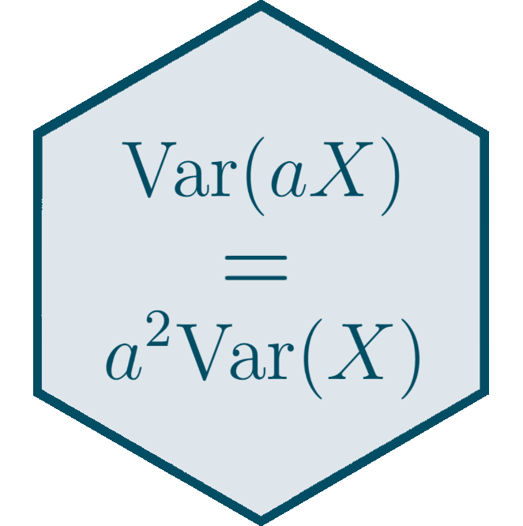
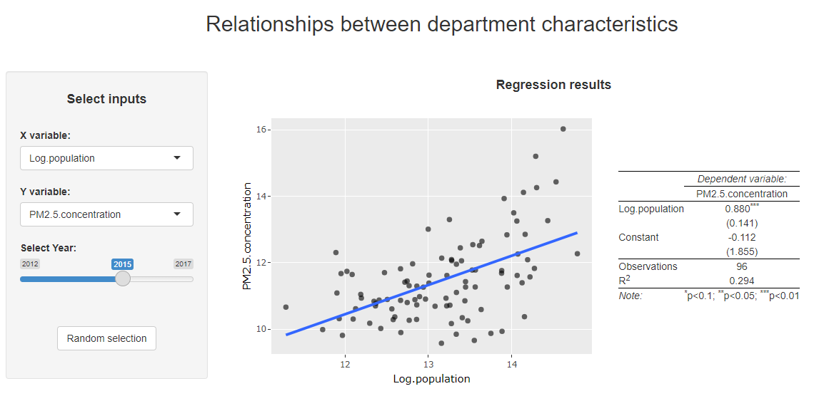

<style> .left-column {width: 70%;} .right-column {width: 30%;} </style>

```{css, echo = F, eval = params$dark}
body{background-color:black;filter:invert(1)}
```

```{r setup, include = FALSE}
source(paste0(getwd(), "/../source/style.R"))
stargazer <- stargazer::stargazer
theme_minimal <- theme_Rcourse
options(htmltools.dir.version = F)
knitr::opts_chunk$set(echo = T, message = F, warning = F, fig.align = "center", dpi = 300, out.width = "100%")
set.seed(1)
```

### Quick reminder

#### Omitted variable bias

<ul>
  <li>If a third <b>variable</b> is correlated with both \(x\) and \(y\), it would <b>bias the relationship</b></li>
  <ul>
    <li>We must then <b>control</b> for such variables</li>
    <li>And if we can't we must acknowledge that our estimate is not causal with <i><b>'ceteris paribus'</b></i></li>
  </ul>
</ul>

```{r, echo = F, fig.width = 8, fig.height = 3.75, out.width = "75%"}
illuedu <- tibble(Education = rnorm(1000, 0, 1),
                  Skills = rep(c("High", "Low"), each = 500)) %>%
  mutate(Education = ifelse(Skills == "High", Education + .75, Education),
         Earnings = ifelse(Skills == "High", 
                           1 + Education + rnorm(500, 0, 1),
                           Education + rnorm(500, 0, 1))) 

coefs <- lm(Earnings ~ Education + Skills, illuedu)$coefficients
min_high <- min(illuedu[illuedu$Skills == "High", "Education"])
max_high <- max(illuedu[illuedu$Skills == "High", "Education"])
min_low <- min(illuedu[illuedu$Skills == "Low", "Education"])
max_low <- max(illuedu[illuedu$Skills == "Low", "Education"])

ggplot(illuedu) + 
  geom_point(alpha = .4, aes(x = Education, y = Earnings, color = Skills)) + 
  geom_segment(aes(x = min_high,
                   xend =max_high,
                   y = coefs[1] + coefs[2] * min_high,
                   yend = coefs[1] + coefs[2] * max_high), color = "#014D64", alpha = .7) +
  geom_segment(aes(x = min_low,
                   xend =max_low,
                   y = coefs[1] + coefs[3] + (coefs[2] * min_low),
                   yend = coefs[1] + coefs[3] + (coefs[2] * max_low)), color = "#00A2D9", alpha = .7) +
  geom_smooth(aes(x = Education, y = Earnings), method = "lm", se = F, color  = "black", alpha = .7) +
  theme(axis.text = element_blank(),
        axis.ticks = element_blank(),
        legend.position = "right",
        legend.direction = "vertical")
```

---

### Quick reminder

#### Functional form

<ul>
  <li>Not capturing the <b>right functional</b> form correctly might also lead to biased estimations:</li>
  <ul>
    <li>Polynomial order, interactions, logs, discretization matter</li>
    <li><b>Visualizing the relationship</b> is key</li>
  </ul>
</ul>

```{r, echo = F, fig.width = 8, fig.height = 3.75, out.width = "75%"}
quadratic <- tibble(Education = runif(1000, 24, 60),
                    Earnings = -2800 + (200 * Education) - (2*Education*Education) + rnorm(1000, 0, 200))

ggplot(quadratic, aes(x = Education, y = Earnings)) +
  geom_point(alpha = .5, color = "#014D64") +
  geom_smooth(method = "lm", formula = y ~ poly(x, 2),
              se = F, color  = "black", alpha = .7) +
  geom_smooth(method = "lm",
              se = F, color  = "black", alpha = .7) +
  theme(axis.text = element_blank(),
        axis.ticks = element_blank())
```

---

### Quick reminder

#### Selection bias

<ul>
  <li><b>Self-selection</b> is also a common threat to causality</li>
</ul>

<p style = "margin-bottom:.75cm;"></p>

<ul>
  <li>What is the impact of going to a better neighborhood on your children outcomes?</li>
  <ul>
    <li>We cannot just regress children outcomes on a mobility dummy</li>
    <li>Individuals who move may be different from those who stay: <b>self-selection issue</b></li>
    <li>Here it is not that the sample is not representative of the population, but that <b>the outcomes of those who stayed are different from the outcomes those who moved would have had, if they had stayed</b></li>
  </ul>
</ul>

--

<p style = "margin-bottom:1.25cm;"></p>

#### Simultaneity

<ul>
  <li>Consider the relationship between <b>crime</b> rate and <b>police coverage</b> intensity</li>
</ul>

<p style = "margin-bottom:.75cm;"></p>

<ul>
  <li>What is the <b>direction of the relationship?</b></li>
  <ul>
    <li>We cannot just regress crime rate on police intensity</li>
    <li>It's likely that more crime would cause a positive response in police activity</li>
    <li>And also that police activity would deter crime</li>
  </ul>
</ul>

---

### Quick reminder

#### Measurement error

<ul>
  <li><b>Measurement error</b> in the independent variable also induces a bias</li>
  <ul>
    <li>The resulting estimation would mechanically be <b>downward biased</b></li>
    <li>The <b>noisier</b> the measure, the <b>larger the bias</b></li>
  </ul>
</ul>

```{r, echo = F, fig.width = 8, fig.height = 3.75, out.width = "75%"}
dat <- tibble(x = rnorm(1000, 100, 15),
              y = 1 + (2 * x) + rnorm(1000, 0, 1)) %>% 
  mutate(noisy_x = x + rnorm(1000, 0, 1))

# Vector of standard deviations from 0 to 20
sd_noise <- 0:20

# Empty vector for beta...
beta <- c()

# ... to be filled in a loop
for (i in sd_noise) {
  
  # Generate noisy x with corresponding SD(eta)
  dat_i <- dat %>% mutate(noisy_x = x + rnorm(1000, 0, i))
  
  # Estimate the regression
  beta_i <- lm(y ~ noisy_x, dat_i)$coefficient[2]
  
  # Store the coefficient
  beta <- c(beta, beta_i)
}

ggplot(tibble(sd_noise = sd_noise, beta = beta), 
       aes(x = sd_noise, y = beta)) + 
  scale_x_continuous(name = "Standard deviation of the measurement error",
                     limits = c(0, 20), breaks = seq(0, 20, 5)) +
  scale_y_continuous(name = "Estimate",
                     limits = c(.75, 2.05), breaks = seq(.8, 2, .2)) +
  geom_hline(yintercept = 2, linetype = "dashed") +
  geom_point()
```

---

### Quick reminder

#### Randomized Controlled Trials

<ul>
  <li>A Randomized Controlled Trial (RCT) is a type of experiment in which the thing we want to know the impact of (called the treatment) is <b>randomly allocated</b> in the population</li>
  <ul>
    <li>The two <b>groups</b> would then have the same characteristics on expectation, and would be <b>comparable</b></li>
    <li>It is a way to obtain <b>causality</b> from randomness</li>
  </ul>
</ul>

--

<p style = "margin-bottom:1cm;"></p>

<ul>
  <li>RCTs are very <b>powerful tools</b> to sort out issues of:</li>
  <ul>
    <li>Omitted variables</li>
    <li>Selection bias</li>
    <li>Simultaneity</li>
  </ul>
</ul>

--

<p style = "margin-bottom:1cm;"></p>

<ul>
  <li>But RCTs are <b>not immune</b> to every problem:</li>
  <ul>
    <li>The sample must be representative and large enough</li>
    <li>Participants should comply with their treatment status</li>
    <li>Independent variables must not be noisy measures of the variable of interest</li>
    <li>...</li>
  </ul>
</ul>

---

<h3>Today: Interpretation</h3>

--

<p style = "margin-bottom:4cm;"></p>

.pull-left[

<ul style = "margin-left:1.5cm;list-style: none">
  <li><b>1. Point estimates</b></li>
  <ul style = "list-style: none">
    <li>1.1. Continuous variables</li>
    <li>1.2. Discrete variables</li>
    <li>1.3. Log vs. level</li>
  </ul>
</ul>

<p style = "margin-bottom:1cm;"></p>

<ul style = "margin-left:1.5cm;list-style: none">
  <li><b>2. Practice interpretation</b></li>
</ul> 
]

.pull-right[
<ul style = "margin-left:-1cm;list-style: none">
  <li><b>3. Regression tables</b></li>
  <ul style = "list-style: none">
    <li>3.1. Layout</li>
    <li>3.2. Reported significance</li>
    <li>3.3. R squared</li>
  </ul>
</ul>
 
<p style = "margin-bottom:1cm;"></p>

<ul style = "margin-left:-1cm;list-style: none"><li><b>4. Wrap up!</b></li></ul>
]

---

<h3>Today: Interpretation</h3>

<p style = "margin-bottom:4cm;"></p>

.pull-left[

<ul style = "margin-left:1.5cm;list-style: none">
  <li><b>1. Point estimates</b></li>
  <ul style = "list-style: none">
    <li>1.1. Continuous variables</li>
    <li>1.2. Discrete variables</li>
    <li>1.3. Log vs. level</li>
  </ul>
</ul>
]

---

### 1. Point estimates

#### 1.1. Continuous variables

<ul>
  <li>In this first part, we're going to consider the <b>relationship</b> between:</li>
  <ul>
    <li>The <b>income level</b> of young parents</li>
    <li>The <b>health</b> of their <b>newborn</b></li>
  </ul>
</ul>

<p style = "margin-bottom:.8cm;"></p>

--

<ul>
  <li>Consider first the following specification of the two variables:</li>
  <ul>
    <li>A continuous measure of <b>annual household income in euros</b></li>
    <li>A continuous measure of <b>birth weight in grams</b></li>
  </ul>
</ul>

<p style = "margin-bottom:.8cm;"></p>

$$\text{Birth weight}_i = \alpha + \beta \times \text{Household income}_i  + \varepsilon_i$$


```{r, echo = F}
data <- tibble(household_income = rlnorm(1000, 10, 1)) %>%
  mutate(birth_weight = 2200 + 100 * log(household_income) + rnorm(1000, 0, 400))
```

--

```{r}
lm(birth_weight ~ household_income, data)$coefficients
```

<p style = "margin-bottom:.85cm;"></p>

<center><b>&#10140; How would you interpret \(\hat{\beta}\) here?</b> <i>(Note that</i> e+03 <i>and</i> e-03 <i>mean \(\times 10^3\) and \(\times 10^{-3}\))</i></center>

---

### 1. Point estimates

#### 1.1. Continuous variables

<ul>
  <li>When both \(x\) and \(y\) are continuous, the <b>general</b> template for the <b>interpretation</b> of \(\hat{\beta}\) is:</li>
</ul>

<center><i>"Everything else equal, a 1 [unit] increase in [x] is associated with<br> an [in/de]crease of [beta] [units] in [y] on average."</i></center>

<p style = "margin-bottom:1.6cm;"></p>

--

<ul>
  <li>So in our case the <b>adequate interpretation</b> would be:</li>
</ul>

<center><i>"Everything else equal, a <b>1 euro increase in annual household income</b> is associated with<br> an <b>increase of 0.002 gram in newborn birth weight</b> on average."</i></center>

<p style = "margin-bottom:1.6cm;"></p>

--

<ul>
  <li>But it would be even better to <b>interpret</b> the results for a <b>meaningful variation</b> of \(x\)</li>
  <ul>
    <li>For an annual household income, a <b>1 euro variation</b> is not really meaningful</li>
    <li>1 euro increase &#10140; 0.002 gram increase \(\Leftrightarrow\) <b>1,000 euro increase</b> &#10140; 2 gram increase</li>
  </ul>
</ul>

---

### 1. Point estimates

#### 1.1. Continuous variables

<ul>
  <li>A common way to obtain a coefficient for a <b>meaningful variation</b> of \(x\) is to <b>standardize \(x\)</b></li>
  <ul>
    <li>If we divide \(x\) by \(\text{SD}(x)\), the 1 <b>unit increase</b> in \(\frac{x}{\text{SD}(x)}\) is equivalent to an <b>\(\text{SD}(x)\) increase</b> in \(x\)</li>
    <li>An \(\text{SD}(x)\) change in \(x\) is meaningful: it's low if \(x\) is very concentrated and high if \(x\) is highly spread out</li>
  </ul>
</ul>

--

```{r, echo = F, fig.width = 8, fig.height = 3.75, out.width = "70%"}
library(ggpubr)

sd_dat <- tibble(V1 = rnorm(10000, 5, .5), 
                 V2 = rnorm(10000, 10, 2)) %>%
  mutate(`V1 / SD(V1)` = V1/sd(V1),
         `V2 / SD(V2)` = V2/sd(V2))

ggarrange(ggplot(sd_dat, aes(x = V1)) +
            geom_density(alpha = .1, color = "#014D64", fill = "#014D64") +
            annotate("segment", x = 4.5, xend = 5.5, y = .4, yend = .4, arrow = arrow(ends = "both", angle = 90, length = unit(.2,"cm"))) +
            scale_x_continuous(limits = c(0, 20)) +
            theme(axis.text.y = element_blank(),
                  axis.ticks.y = element_blank(),
                  axis.title.y = element_blank()),
          ggplot(sd_dat, aes(x = V2)) +
            geom_density(alpha = .1, color = "#014D64", fill = "#014D64") +
            annotate("segment", x = 9.5, xend = 10.5, y = .1, yend = .1, arrow = arrow(ends = "both", angle = 90, length = unit(.2,"cm"))) +
            scale_x_continuous(limits = c(0, 20)) +
            theme(axis.text.y = element_blank(),
                  axis.ticks.y = element_blank(),
                  axis.title.y = element_blank()))
```

---

### 1. Point estimates

#### 1.1. Continuous variables

<ul>
  <li>A common way to obtain a coefficient for a <b>meaningful variation</b> of \(x\) is to <b>standardize \(x\)</b></li>
  <ul>
    <li>If we divide \(x\) by \(\text{SD}(x)\), the 1 <b>unit increase</b> in \(\frac{x}{\text{SD}(x)}\) is equivalent to an <b>\(\text{SD}(x)\) increase</b> in \(x\)</li>
    <li>An \(\text{SD}(x)\) change in \(x\) is meaningful: it's low if \(x\) is very concentrated and high if \(x\) is highly spread out</li>
  </ul>
</ul>

```{r, echo = F, fig.width = 8, fig.height = 3.75, out.width = "70%"}
ggarrange(ggplot(sd_dat, aes(x = `V1 / SD(V1)`)) +
            geom_density(alpha = .1, color = "#014D64", fill = "#014D64") +
            annotate("segment", x = 9.5, xend = 10.5, y = .15, yend = .15, arrow = arrow(ends = "both", angle = 90, length = unit(.2,"cm"))) +
            scale_x_continuous(limits = c(5, 15)) +
            theme(axis.text.y = element_blank(),
                  axis.ticks.y = element_blank(),
                  axis.title.y = element_blank()),
          ggplot(sd_dat, aes(x = `V2 / SD(V2)`)) +
            geom_density(alpha = .1, color = "#014D64", fill = "#014D64") +
            annotate("segment", x = 4.5, xend = 5.5, y = .15, yend = .15, arrow = arrow(ends = "both", angle = 90, length = unit(.2,"cm"))) +
            scale_x_continuous(limits = c(0, 10)) +
            theme(axis.text.y = element_blank(),
                  axis.ticks.y = element_blank(),
                  axis.title.y = element_blank()))
```

---

### 1. Point estimates

#### 1.1. Continuous variables

<ul>
  <li>Note that if you <b>standardize both \(x\) and \(y\)</b>, the resulting \(\hat\beta\) equals the <b>correlation</b> between \(x\) and \(y\)</li>
  <ul>
    <li>To show that, let's first rewrite the formula of the beta coefficient:</li>
  </ul>
</ul>


$$\hat{\beta} = \frac{\text{Cov}(x, \, y)}{\text{Var}(x)} = \frac{\text{Cov}(x, \, y)}{\text{SD}(x)\times\text{SD}(x)}$$

--

<p style = "margin-bottom:1.1cm;"></p>

$$\hat{\beta} = \frac{\text{Cov}(x, \, y)}{\text{SD}(x)\times\text{SD}(x)} \times \frac{\text{SD}(y)}{\text{SD}(y)}$$

--

<p style = "margin-bottom:1.1cm;"></p>

$$\hat{\beta} = \frac{\text{Cov}(x, \, y)}{\text{SD}(x)\times\text{SD}(y)} \times \frac{\text{SD}(y)}{\text{SD}(x)}$$

--

<p style = "margin-bottom:1.1cm;"></p>

$$\hat{\beta} = \text{Cor}(x, \, y) \times \frac{\text{SD}(y)}{\text{SD}(x)}$$

---

### 1. Point estimates

#### 1.1. Continuous variables

<ul>
  <li>Starting with the previous expression, the <b>\(\hat\beta\) coefficient with the standardized variables</b> writes:</li>
</ul>

$$\hat{\beta} = \frac{\text{Cov}\big(\frac{x}{\text{SD}(x)}, \, \frac{y}{\text{SD}(y)}\big)}{\text{SD}\big(\frac{x}{\text{SD}(x)}\big)\times\text{SD}\big(\frac{y}{\text{SD}(y)}\big)} \times \frac{\text{SD}\big(\frac{y}{\text{SD}(y)}\big)}{\text{SD}\big(\frac{x}{\text{SD}(x)}\big)}$$

--

<p style = "margin-bottom:1.2cm;"></p>


<ul>
  <li>But by construction, the standard deviation of a standardized variable is 1:</li>
</ul>

.pull-left[
<p style = "margin-bottom:-.25cm;"></p>

$$\hat{\beta} = \frac{\text{Cov}\big(\frac{x}{\text{SD}(x)}, \, \frac{y}{\text{SD}(y)}\big)}{1\times1} \times \frac{1}{1}$$


$$\hat{\beta} = \text{Cov}\bigg(\frac{x}{\text{SD}(x)}, \, \frac{y}{\text{SD}(y)}\bigg)$$


$$\hat{\beta} = \frac{\text{Cov}(x, \, y)}{\text{SD}(x)\times\text{SD}(y)} = \text{Cor}(x, y)$$
]

.pull-right[

<ul>
  <li>Learn the cheatsheet on moments properties:</li>
</ul>

<center><a href = "https://louissirugue.github.io/metrics_on_R/cheatsheets/moments.pdf"></a>
]
---

### 1. Point estimates

#### 1.2. Discrete variables

<ul>
  <li>Consider the following specification of the two variables:</li>
  <ul>
    <li>A categorical variable for <b>annual household income divided in terciles</b></li>
    <li>Still a continuous measure of <b>birth weight in grams</b></li>
  </ul>
</ul>

--

<p style = "margin-bottom:.8cm;"></p>

$$\text{Birth weight}_i = \alpha + \beta_1 \text{T2}_i + \beta_2 \text{T3}_i  + \varepsilon_i$$

<p style = "margin-bottom:1.3cm;"></p>

<ul>
  <li>Recall that when including a <b>categorical variable</b> in a regression, a <b>reference category</b> must be <b>omitted</b></li>
</ul>

--

```{r, echo = F}
data <- data %>%
  arrange(household_income) %>%
  mutate(income_tercile = paste0("T", ceiling(3 * (row_number() / n()))))
```

```{r}
lm(birth_weight ~ income_tercile, data)$coefficients
```

<p style = "margin-bottom:1.3cm;"></p>

<center><b>&#10140; How would you interpret \(\hat{\beta}_1\) and \(\hat{\beta}_2\) here?</b></center>

---

### 1. Point estimates

#### 1.2. Discrete variables

<ul>
  <li>With a discrete \(x\), the interpretation of the coefficient must be <b>relative to the reference category:</b></li>
</ul>

<center><i>"Everything else equal, belonging to the [x category] is associated with<br> a [beta] [unit] [higher/lower] average [y] relative to the [reference category]."</i></center>

<p style = "margin-bottom:1.5cm;"></p>

--

<ul>
  <li>So in our case, the <b>adequate interpretations</b> would be:</li>
</ul>

<center><i>"Everything else equal, belonging to the <b>second income tercile</b> is associated with<br> a <b>88 grams higher average birth weight</b> relative to the <b>first income tercile.</b>"</i></center>


<p style = "margin-bottom:.75cm;"></p>

<center><i>"Everything else equal, belonging to the <b>third income tercile</b> is associated with<br> a <b>223 grams higher average birth weight</b> relative to the <b>first income tercile.</b>"</i></center>

<p style = "margin-bottom:1.5cm;"></p>

--

<ul>
  <li>And the <b>intercept</b> is the <b>average birth weight</b> for newborns to parents in the <b>first income tercile</b></li>
</ul>

---

### 1. Point estimates

#### 1.2. Discrete variables

<ul>
  <li>Consider now the following specification of the two variables:</li>
  <ul>
    <li>A continuous measure of <b>annual household income in euros</b></li>
    <li>A <b>binary variable</b> taking the value 1 if <b>the newborn is underweight</b> and 0 otherwise</li>
  </ul>
</ul>

<p style = "margin-bottom:1.25cm;"></p>

--

$$\text{Underweight}_i = \alpha + \beta \times \text{Household income}_i  + \varepsilon_i$$

<p style = "margin-bottom:1.25cm;"></p>

```{r, echo = F}
data <- data %>%
  mutate(underweight = as.numeric(birth_weight < 2500))
```

```{r}
lm(underweight ~ household_income, data)$coefficients
```

--

<p style = "margin-bottom:1.25cm;"></p>

<center><b>&#10140; How would you interpret \(\hat{\beta}\) here?</b></center>

<p style = "margin-bottom:.5cm;"></p>

<center><b>&#10140; And would you consider its magnitude high?</b></center>

---

### 1. Point estimates

#### 1.2. Discrete variables

<ul>
  <li>With a <b>binary \(y\) variable</b>, the coefficient must be interpreted in <b>percentage points:</b></li>
</ul>

<center><i>"Everything else equal, a 1 [unit] increase in [x] is associated with<br> a [beta \(\times\) 100] percentage point [in/de]crease in the probability that [y equals 1] on average."</i></center>

<p style = "margin-bottom:1.75cm;"></p>

--

<ul>
  <li>So in our case, the <b>adequate interpretation</b> would be:</li>
</ul>

<center><i>"Everything else equal, a <b>1 euro increase in annual household income</b> is associated with<br> a <b>0.00004 percentage point decrease in the probability that the newborn is underweight</b> on average."</i></center>

<p style = "margin-bottom:1.75cm;"></p>

--

<ul>
  <li>Here the <b>interpretation</b> would be more <b>meaningful:</b></li>
  <ul>
    <li>For a <b>1,000 euro</b> increase &#10140; 0.04 percentage point decrease</li>
    <li>Compared to the <b>typical probability</b> to have an underweight newborn</li>
  </ul>
</ul>

---

### 1. Point estimates

#### 1.2. Discrete variables

<ul>
  <li>The mean of a dummy variable corresponds to the share of 1s:</li>
</ul>

```{r}
mean(data$underweight)
```

--

<p style = "margin-bottom:1.5cm;"></p>

<ul>
  <li>We can also compute the probability that \(y = 1\) for the average \(x\) with our estimated coefficients:</li>
</ul>

```{r}
5.214013e-02 + mean(data$household_income) * -4.084787e-07
```

--

<p style = "margin-bottom:1.5cm;"></p>

<center>For the <b>average household</b>, a <b>1,000 euro increase</b> in annual income would be associated<br> with a <b>0.0004 / 0.037 \(\approx\) 1% decrease in the probability</b> that the newborn is <b>underweight</b></center>

---

### 1. Point estimates

#### 1.2. Discrete variables

<ul>
  <li>Finally if <b>both</b> the \(y\) and the \(x\) variables are <b>discrete</b>, the coefficient must be interpreted:</li>
  <ul>
    <li>In <b>percentage points</b></li>
    <li><b>Relative</b> to the reference category</li>
  </ul>
</ul>

<p style = "margin-bottom:1.25cm;"></p>

$$\text{Underweight}_i = \alpha + \beta_1 \text{T2}_i + \beta_2 \text{T3}_i  + \varepsilon_i$$

<p style = "margin-bottom:1.25cm;"></p>

--

```{r}
lm(underweight ~ income_tercile, data)$coefficients
```

--
<p style = "margin-bottom:1.25cm;"></p>

<center><i>"Everything else equal, belonging to the <b>second income tercile</b> is associated with<br> a <b>3.9 percentage point lower probability that the newborn is underweight</b><br> relative to the <b>first income tercile.</b>"</i></center>

---

### 1. Point estimates

#### 1.3. Log vs. level

<ul>
  <li>Consider now the following hypothetical relationship:</li>
</ul>

.pull-left[

 
<p style = "margin-bottom:2.94cm;"></p>
 
```{r, echo = F, fig.width = 7, fig.height = 4, out.width = "100%"}
data_log <- tibble(x = rnorm(1000, 15, 2),
               y = x + rnorm(1000, 73, 3))

ggplot(data_log, aes(x = x, y = y)) +
  geom_point(alpha = .5, color = "#014D64") +
  geom_smooth(method = 'lm', se = F, color = "#014D64")
```
]

--

.pull-right[

<p style = "margin-bottom:1.1cm;"></p>

<ul>
 <li>The slope tells us by how many <b>units</b> the \(y\) variable would increase for a <b>1 unit</b> increase in \(x\)</li>
</ul>

<p style = "margin-bottom:1.25cm;"></p>

<ul>
 <li>But often times in Economics we're interested in the elasticity between the two variables:</li>
 <ul>
   <li>What is the expected <b>percentage change</b> in \(y\) for a <b>one percent increase</b> in \(x\)?</li>
 </ul>
</ul>

<p style = "margin-bottom:1.25cm;"></p>

<center><i>&#10140; The log transformation can be used<br> to easily get an approximation of that</i></center>

]

---

### 1. Point estimates

#### 1.3. Log vs. level

.pull-left[

 * Instead of considering 
 
<p style = "margin-bottom:1cm;"></p>

$$y_i = \alpha_{lvl} + \beta_{lvl}x_i + \varepsilon_i$$

<p style = "margin-bottom:1.25cm;"></p>

```{r, echo = F, fig.width = 7, fig.height = 4, out.width = "100%"}
ggplot(data_log, aes(x = x, y = y)) +
  geom_point(alpha = .5, color = "#014D64") +
  geom_smooth(method = 'lm', se = F, color = "#014D64")
```

]

--

.pull-right[

 * We consider

<p style = "margin-bottom:1cm;"></p>

$$\log(y_i) = \alpha_{log} + \beta_{log}\log(x_i) + \varepsilon_i$$

<p style = "margin-bottom:1.25cm;"></p>

```{r, echo = F, fig.width = 7, fig.height = 4, out.width = "100%"}
ggplot(data_log, aes(x = log(x), y = log(y))) +
  geom_point(alpha = .5, color = "#014D64") +
  geom_smooth(method = 'lm', se = F, color = "#014D64")
```

]

---

### 1. Point estimates

#### 1.3. Log vs. level

.pull-left[

```{r, echo = F}
beta_lvl <- summary(lm(y ~ x, data_log))$coefficients[2, 1]
```

$\widehat{\beta_{lvl}} = `r beta_lvl`$

```{r, echo = F, fig.width = 7, fig.height = 4, out.width = "100%"}
test <- lm(y  ~ x, data_log)$coefficients[2]

ggplot(data_log, aes(x = x, y = y)) +
  geom_point(alpha = .5, color = "#014D64") +
  geom_smooth(method = 'lm', se = F, color = "#014D64")
```

$$\begin{align}(15\div100) \times \widehat{\beta_{lvl}} &\approx (15\div100) \times `r beta_lvl` \\ &\approx `r 0.15 * beta_lvl` \end{align}$$
]

--

.pull-right[

```{r, echo = F}
beta_log <- summary(lm(log(y) ~ log(x), data_log))$coefficients[2, 1]
```


$\widehat{\beta_{log}} = `r beta_log`$

```{r, echo = F, fig.width = 7, fig.height = 4, out.width = "100%"}
ggplot(data_log, aes(x = log(x), y = log(y))) +
  geom_point(alpha = .5, color = "#014D64") +
  geom_smooth(method = 'lm', se = F, color = "#014D64")
```

$$\begin{align}`r 0.15 * beta_lvl` \div90 &= `r sprintf("%.7f", (0.15 * beta_lvl) / 90)`\\ & \approx \beta_{log}\%\end{align}$$
]

---

### 1. Point estimates

#### 1.3. Log vs. level

<ul>
  <li>Thus the interpretation differs depending on whether variables are in log or in level:</li>
  <ul>
    <li>When variables are in <b>level</b> we should interpret the coefficients in terms of <b>unit</b> increase</li>
    <li>When variables are in <b>log</b> we should interpret the coefficients in terms of <b>percentage</b> increase</li>
  </ul>
</ul>

<p style = "margin-bottom:1.25cm;"></p>
 
--

```{r, echo = F, eval = F}
kable(tibble(` ` = c("x", "log(x)"),
             y = c("\\(\\hat{\\beta}\\) is the unit increase in \\(y\\) due\n to a 1 unit increase in \\(x\\)",
                   "\\(\\hat{\\beta}\\div 100\\) is the unit increase in \\(y\\) due\n to a 1% increase in \\(x\\)"),
             `log(y)` = c("\\(\\hat{\\beta}\\times 100\\) is the % increase in \\(y\\) due\n to a 1 unit increase in \\(x\\)",
                   "\\(\\hat{\\beta}\\) is the % increase in \\(y\\) due\n to a 1% increase in \\(x\\)")),
      caption = "Interpretation of the regression coefficient", align = "ccc") %>%
  column_spec(1, bold = T) %>%
  column_spec(c(2, 3), width = "10em")
```

<table class="table table-hover table-condensed" style="width: auto !important; margin-left: auto; margin-right: auto;font-size: 20px;">
<caption>Interpretation of the regression coefficient</caption>
 <thead>
  <tr style = "background-color: #CCD5D9;">
   <th style="text-align:center;">   </th>
   <th style="text-align:center;"> y </th>
   <th style="text-align:center;"> log(y) </th>
  </tr>
 </thead>
<tbody>
  <tr>
   <td style="text-align:center;font-weight: bold;"> x </td>
   <td style="text-align:center;width: 10em; "> \(\hat{\beta}\) is the unit increase in \(y\) due
 to a 1 unit increase in \(x\) </td>
   <td style="text-align:center;width: 10em; "> \(\hat{\beta}\times 100\) is the % increase in \(y\) due
 to a 1 unit increase in \(x\) </td>
  </tr>
  <tr style = "background-color: #CCD5D9;">
   <td style="text-align:center;font-weight: bold;"> log(x) </td>
   <td style="text-align:center;width: 10em;"> \(\hat{\beta}\div 100\) is the unit increase in \(y\) due
 to a 1% increase in \(x\) </td>
   <td style="text-align:center;width: 10em;"> \(\hat{\beta}\) is the % increase in \(y\) due
 to a 1% increase in \(x\) </td>
  </tr>
</tbody>
</table>

---

### 1. Point estimates

#### 1.3. Log vs. level

<ul>
  <li>Let's give it a try with our example on household income and birth weight</li>
  <ul>
    <li>We've already seen that because income is log-normally distributed, it should be included in log</li>
  </ul>
</ul>

--

```{r, echo = F, fig.width = 8, fig.height = 3.75, out.width = "75%"}
data %>% 
  mutate(`log(household_income)` = log(household_income)) %>%
  pivot_longer(c(household_income, `log(household_income)`), names_to = "variable", values_to = "value") %>%
  ggplot(aes(x = value, y = birth_weight)) +
  geom_point(alpha = .2, color = "#014D64") +
  geom_smooth(method = "lm", se = F, color = "#014D64") +
  facet_wrap(~variable, scales = "free_x") +
  ylab("Birth weight (grams)") +
  theme(axis.title.x = element_blank())
```

---

### 1. Point estimates

#### 1.3. Log vs. level

<ul>
  <li>So what would be your interpretation of the slope estimated from the following regression?</li>
</ul>

<p style = "margin-bottom:1cm;"></p>


$$\text{Birth weight}_i = \alpha + \beta \log(\text{Household income}_i) + \varepsilon$$

```{r}
lm(birth_weight ~ log(household_income), data)$coefficients
```


<p style = "margin-bottom:1cm;"></p>

--

<ul>
  <li>With a continuous <b>\(y\) in level</b> and a <b>logged \(x\)</b> variable, the template would be:</li>
</ul>

<center><i>"Everything else equal, a 1 percent increase in [x] is associated with a [beta/100] [unit] [in/de]crease in [y] on average."</i></center>

--

<ul>
  <li>So in our case, the <b>adequate interpretation</b> would be:</li>
</ul>

<center><i>"Everything else equal, a <b>1 percent increase in annual household income</b> is associated with<br> a <b>1.12 grams increase in the birth weight of the newborn</b> on average."</i></center>


---

<h3>Overview</h3>

<p style = "margin-bottom:4cm;"></p>

.pull-left[

<ul style = "margin-left:1.5cm;list-style: none">
  <li><b>1. Point estimates &#10004;</b></li>
  <ul style = "list-style: none">
    <li>1.1. Continuous variables</li>
    <li>1.2. Discrete variables</li>
    <li>1.3. Log vs. level</li>
  </ul>
</ul>

<p style = "margin-bottom:1cm;"></p>

<ul style = "margin-left:1.5cm;list-style: none">
  <li><b>2. Practice interpretation</b></li>
</ul> 
]

.pull-right[
<ul style = "margin-left:-1cm;list-style: none">
  <li><b>3. Regression tables</b></li>
  <ul style = "list-style: none">
    <li>3.1. Layout</li>
    <li>3.2. Reported significance</li>
    <li>3.3. R squared</li>
  </ul>
</ul>
 
<p style = "margin-bottom:1cm;"></p>

<ul style = "margin-left:-1cm;list-style: none"><li><b>4. Wrap up!</b></li></ul>
]

---

<h3>Overview</h3>

<p style = "margin-bottom:4cm;"></p>

.pull-left[

<ul style = "margin-left:1.5cm;list-style: none">
  <li><b>1. Point estimates &#10004;</b></li>
  <ul style = "list-style: none">
    <li>1.1. Continuous variables</li>
    <li>1.2. Discrete variables</li>
    <li>1.3. Log vs. level</li>
  </ul>
</ul>

<p style = "margin-bottom:1cm;"></p>

<ul style = "margin-left:1.5cm;list-style: none">
  <li><b>2. Practice interpretation</b></li>
</ul> 
]

---

class: inverse, hide-logo

### 2. Practice interpretation

#### &#10140; Let's practice coefficient interpration with randomly generated relationships:

<center><a href = "https://sirugue.shinyapps.io/lecture15/"></a></center>

---

<h3>Overview</h3>

<p style = "margin-bottom:4cm;"></p>

.pull-left[

<ul style = "margin-left:1.5cm;list-style: none">
  <li><b>1. Point estimates &#10004;</b></li>
  <ul style = "list-style: none">
    <li>1.1. Continuous variables</li>
    <li>1.2. Discrete variables</li>
    <li>1.3. Log vs. level</li>
  </ul>
</ul>

<p style = "margin-bottom:1cm;"></p>

<ul style = "margin-left:1.5cm;list-style: none">
  <li><b>2. Practice interpretation &#10004;</b></li>
</ul> 
]

.pull-right[
<ul style = "margin-left:-1cm;list-style: none">
  <li><b>3. Regression tables</b></li>
  <ul style = "list-style: none">
    <li>3.1. Layout</li>
    <li>3.2. Reported significance</li>
    <li>3.3. R squared</li>
  </ul>
</ul>
 
<p style = "margin-bottom:1cm;"></p>

<ul style = "margin-left:-1cm;list-style: none"><li><b>4. Wrap up!</b></li></ul>
]

---

<h3>Overview</h3>

<p style = "margin-bottom:4cm;"></p>

.pull-left[

<ul style = "margin-left:1.5cm;list-style: none">
  <li><b>1. Point estimates &#10004;</b></li>
  <ul style = "list-style: none">
    <li>1.1. Continuous variables</li>
    <li>1.2. Discrete variables</li>
    <li>1.3. Log vs. level</li>
  </ul>
</ul>

<p style = "margin-bottom:1cm;"></p>

<ul style = "margin-left:1.5cm;list-style: none">
  <li><b>2. Practice interpretation &#10004;</b></li>
</ul> 
]

.pull-right[
<ul style = "margin-left:-1cm;list-style: none">
  <li><b>3. Regression tables</b></li>
  <ul style = "list-style: none">
    <li>3.1. Layout</li>
    <li>3.2. Reported significance</li>
    <li>3.3. R squared</li>
  </ul>
</ul>

]

---

### 3. Regression tables

#### 3.1. Layout

<ul>
  <li><b>So far</b> we've been <b>used to</b> regression results <b>displayed this way:</b></li>
</ul>

```{r}
lm(birth_weight ~ household_income, data)$coefficients
```

<p style = "margin-bottom:1cm;"></p>

--

<ul>
  <li>Or with the more exhaustive <b>summary()</b> coefficients output:</li>
</ul>

```{r}
summary(lm(birth_weight ~ household_income, data))$coefficients
```

<p style = "margin-bottom:1cm;"></p>

--

<center><i>&#10140; But in <b>formal</b> reports and academic papers, the <b>layout</b> of regression tables is <b>a bit different</b></i></center>

---

### 3. Regression tables

#### 3.1. Layout

```{css, echo = F}
.remark-slide table{
  font-size: 15px;
  margin: auto;
  border-top: 0px;
  border-bottom: 0px;
}

tr th td{
  font-size: 15px;
  margin: auto;
  border-top: 0px;
  border-bottom: 0px;
}

.remark-slide thead, .remark-slide tfoot, .remark-slide tr:nth-child(even) {
  background: var(--background-color);
}
```


.pull-left[
```{r, echo = F, results = "asis"}
data <- data %>%
  mutate(Sex = ifelse((birth_weight - mean(birth_weight))/sd(birth_weight) + rnorm(n(), -5, 5) > 0, "Boy", "Girl"),
         Sex = ifelse(row_number() %in% sample(1:1000, 37, F), NA, Sex))

list(lm(birth_weight ~ household_income, data), 
     lm(birth_weight ~ household_income + Sex, data)) %>%
  stargazer(type = "html", keep.stat = c("n"), 
            covariate.labels = c("Household income", "Girl (ref: Boy)", "Constant"), 
            dep.var.labels = "Birth weight")
```
]

--

.pull-right[

Regression tables often contain multiple regressions:
<p style = "margin-bottom:1cm;"></p>
<ul>
  <li>With <b>one regression in each column</b></li>
  <ul>
    <li>Regression models are numbered</li>
    <li>Dependent variable mentioned above</li>
  </ul>
</ul>
<p style = "margin-bottom:1cm;"></p>
<ul>
  <li>And one variable in <b>each row</b></li>
  <ul>
    <li>With the <b>point estimate</b></li>
    <li>And a <b>precision measure</b> below</li>
  </ul>
</ul>
<p style = "margin-bottom:1cm;"></p>
<ul>
  <li><b>General info</b> on each model <b>at the bottom</b></li>
</ul>
<p style = "margin-bottom:1cm;"></p>
<ul>
  <li>A <b>symbology</b> for the <b>p-value</b> testing whether the coefficient is significantly different from 0 or not</li>
</ul>

]

---

### 3. Regression tables

#### 3.1. Layout

.pull-left[
```{r, echo = F, results = "asis"}
list(lm(birth_weight ~ household_income, data), 
     lm(birth_weight ~ household_income + Sex, data)) %>%
  stargazer(type = "html", keep.stat = c("n"), 
            covariate.labels = c("Household income", "Girl (ref: Boy)", "Constant"), 
            dep.var.labels = "Birth weight")
```
]

.pull-right[

It makes it easy to compare the different models:

<p style = "margin-bottom:1cm;"></p>

<ul>
  <li>We can <b>add controls progressively</b></li>
  <ul>
    <li>Check the <b>stability</b> of the main <b>coefficient</b></li>
  </ul>
</ul>

<p style = "margin-bottom:1.5cm;"></p>

<center><i>&#10140; If it gets significantly closer to 0 it might indicate that the raw relationship was fallaciously driven by a confounding factor</i></center>

<p style = "margin-bottom:1.5cm;"></p>

<ul>
  <li>And <b>compare general statistics</b></li>
  <ul>
    <li>N is lower in the second regression</li>
    <li>It means that there are missing values</li>
    <li>Could this induce a selection bias?</li>
  </ul>
</ul>
]

---

### 3. Regression tables

#### 3.2. Reported significance

.pull-left[
```{r, echo = F, results = "asis"}
list(lm(birth_weight ~ household_income, data), 
     lm(birth_weight ~ household_income + Sex, data)) %>%
  stargazer(type = "html", keep.stat = c("n"), 
            covariate.labels = c("Household income", "Girl (ref: Boy)", "Constant"), 
            dep.var.labels = "Birth weight")
```
]

.pull-right[

It makes it easy to compare the different models:

<p style = "margin-bottom:1cm;"></p>

<ul>
  <li>The <b>evolution</b> of the <b>significance</b> matters as well</li>
  <ul>
    <li>The main coefficient should stay significant</li>
  </ul>
</ul>

<p style = "margin-bottom:1.25cm;"></p>

<ul>
  <li>But don't rely too much on the <b>symbology</b></li>
  <ul>
    <li>Thresholds are <b>not always the same</b></li>
    <li><b>Sometimes</b> there are <b>none</b></li>
  </ul>
</ul>

<p style = "margin-bottom:1.25cm;"></p>

<ul>
  <li>Instead, keep in mind this <b>rule of thumb:</b></li>
</ul>

<p style = "margin-bottom:1.25cm;"></p>

<center><i><b>&#10140; A coefficient \(\approx\) twice larger than its standard error has a p-value of \(\approx\) 5%</b></i></center>
]

---

### 3. Regression tables

#### 3.2. Reported significance

<ul>
  <li>Remember the formula for the <b>confidence interval:</b></li>
  <ul>
  <li>We can <b>fix</b> the <b>confidence level</b> \(1 - \alpha\) to 95% and check <b>how \(t\) varies with \(\text{df}\)</b></li>
  </ul>
</ul>

$$\hat{\beta}\pm t(\text{df})_{1-\frac{\alpha}{2}}\times\text{se}(\hat{\beta})$$

<p style = "margin-bottom:-1cm;"></p>

--

```{r, echo = F, fig.width = 7, fig.height = 3.75, out.width = "67%"}
tibble(df = 0:100,
       t = qt(.975, df)) %>%
  ggplot(aes(x =  df, y = t)) + geom_point(alpha = .5, color = "#014D64") + 
  geom_hline(yintercept = 2, linetype = 'dashed', color = "#014D64") +
  ylab("t(df) 95%") + scale_y_continuous(limits = c(0, 4))
```

---

### 3. Regression tables

#### 3.2. Reported significance

<ul>
  <li><b>As soon as</b> you have <b>about 20 observations more than</b> you have <b>parameters</b> to estimate:</li>
  <ul>
    <li>The <b>\(t\) value</b> gets very <b>close to 2</b></li>
    <li>And as \(\text{df}\) increases it quickly converges to \(\approx\) 2</li>
  </ul>
</ul>


<p style = "margin-bottom:1cm;"></p>

--

<ul>
  <li>The coefficient is statistically significant if the lower bound of its (absolute) confidence interval is larger than 0</li>
  <ul>
    <li>Which is an easy calculation if we <b>approximate the \(t\) value by 2</b></li>
    <li>A reasonable approximation for a back of the envelope calculation unless there are very few observations</li>
  </ul>
</ul>

--

.pull-left[

<ul>
  <li>The <i>(absolute)</i> lower bound of the CI writes:</li>
</ul>

$$|\hat{\beta}| - t(\text{df})_{1-\frac{\alpha}{2}}\times\text{se}(\hat{\beta})$$
$$|\hat{\beta}| - 2\times\text{se}(\hat{\beta}) > 0$$

$$|\hat{\beta}| > 2\times\text{se}(\hat{\beta})$$
]

--

.pull-right[

<p style = "margin-bottom:1cm;"></p>

<center><i>So if the <b>coefficient</b> is clearly more than <b>twice larger</b> than it's <b>standard error</b>, it must be <b>statistically significant</b> at the <b>5% significance</b> level</i></center>

<p style = "margin-bottom:1cm;"></p>

<center>&#10140; But sometimes the p-value or the confidence interval is reported instead of the standard error</center>

]

---

### 3. Regression tables

#### 3.2. Reported significance

.pull-left[
```{r, echo = F, results = "asis"}
list(lm(birth_weight ~ household_income, data), 
                      lm(birth_weight ~ household_income + Sex, data)) %>%
  stargazer(type = "html", keep.stat = c("n"), 
                      covariate.labels = c("Household income", "Girl (ref: Boy)", "Constant"), 
                      dep.var.labels = "Birth weight", report=('vc*p'))
```
]
.pull-right[
```{r, echo = F, results = "asis"}
list(lm(birth_weight ~ household_income, data), 
                      lm(birth_weight ~ household_income + Sex, data)) %>%
  stargazer(type = "html", keep.stat = c("n"), 
                      covariate.labels = c("Household income", "Girl (ref: Boy)", "Constant"), 
                      dep.var.labels = "Birth weight", ci = T)
```
]

---

### 3. Regression tables

#### 3.3. R squared

<ul>
  <li>In <b>regression tables</b>, the <b>R<sup>2</sup></b> of the model is <b>always reported</b> below the number of observations</li>
  <ul>
    <li>The R<sup>2</sup> captures how well the <b>model fits the data</b></li>
    <li></li>
  </ul>
</ul>

---

### 3. Regression tables

#### 3.3. R squared

<ul>
  <li>In <b>regression tables</b>, the <b>R<sup>2</sup></b> of the model is <b>always reported</b> below the number of observations</li>
  <ul>
    <li>The R<sup>2</sup> captures how well the <b>model fits the data</b></li>
    <li>The model has a <b>good fit (high R<sup>2</sup>)</b> on dataset A but a <b>poor fit (low R<sup>2</sup>)</b> on dataset B</li>
  </ul>
</ul>

```{r, echo = F, fig.width = 8, fig.height = 3.75, out.width = "75%"}
tibble(x = rnorm(1000, 4, 1)) %>%
  mutate(y1 = 10 + 3*x + rnorm(1000, 0, .5),
         y2 = 10 + 3*x + rnorm(1000, 0, 4)) %>%
  pivot_longer(c(y1, y2), names_to = "dataset", values_to = "y") %>%
  mutate(dataset = ifelse(dataset == "y1", "Dataset A", "Dataset B")) %>%
  ggplot(aes(x = x, y = y)) + 
  geom_point(alpha = .1, color = "#014D64") + 
  geom_smooth(method = "lm", se = F, color = "black") + 
  facet_wrap(~dataset, nrow= 1) 
```

---

### 3. Regression tables

#### 3.3. R squared

<ul>
  <li>The <b>standard error</b> already gives an idea on the goodness of the fit, but it is expressed in the <b>same unit as \(y\)</b></li>
  <ul>
    <li>So we <b>cannot compare</b> two different models based on that statistic</li>
    <li></li>
  </ul>
</ul>

---

### 3. Regression tables

#### 3.3. R squared

<ul>
  <li>The <b>standard error</b> already gives an idea on the goodness of the fit, but it is expressed in the <b>same unit as \(y\)</b></li>
  <ul>
    <li>So we <b>cannot compare</b> two different models based on that statistic</li>
    <li>The standard error of the slope would be larger on dataset A than on dataset B</li>
  </ul>
</ul>

```{r, echo = F, fig.width = 8, fig.height = 3.75, out.width = "75%"}
tibble(x = rnorm(1000, 4, 1)) %>%
  mutate(y1 = 10 + 3*x + rnorm(1000, 0, .5),
         y2 = (10 + 3*x + rnorm(1000, 0, 4))/100) %>%
  pivot_longer(c(y1, y2), names_to = "dataset", values_to = "y") %>%
  mutate(dataset = ifelse(dataset == "y1", "Dataset A", "Dataset B")) %>%
  ggplot(aes(x = x, y = y)) + 
  geom_point(alpha = .1, color = "#014D64") + 
  geom_smooth(method = "lm", se = F, color = "black", ) + 
  facet_wrap(~dataset, nrow= 1, scales = "free_y") 
```

---

### 3. Regression tables

#### 3.3. R squared

<ul>
  <li>The <b>R<sup>2</sup></b> captures the <b>goodness of fit</b> as the <b>percentage</b> of the \(y\) variation captured by the model, from:</li>
  <ul>
    <li></li>
    <li></li>
  </ul>
</ul>

```{r, echo = F, fig.width = 8, fig.height = 3.5, out.width = "75%"}
ggcurve <- read.csv("ggcurve.csv")
ols <- summary(lm(ige ~ gini, ggcurve))$coefficients
attempts <- ggcurve %>%
  mutate(`Attempt 3` = ols[1, 1] + (gini * ols[2, 1]),
         `Attempt 2` = (3 * gini) - 1,
         `Attempt 1` = .45) %>%
  pivot_longer(c(`Attempt 1`, `Attempt 2`, `Attempt 3`), names_to = "line_id", values_to = "line_value")

dataR2 <- rbind(attempts %>%
        mutate(obs = row_number(),
               mean = mean(ige)) %>%
        pivot_longer(c(ige, mean), names_to = "dot_id", values_to = "dot") %>%
        filter(line_id == "Attempt 3") %>%
        select(-line_value) %>%
        mutate(facet = "Total variation \n(deviation from mean)",
               order = 1),
      attempts %>%
        mutate(obs = row_number()) %>%
        pivot_longer(c(ige, line_value), names_to = "dot_id", values_to = "dot") %>%
        filter(line_id == "Attempt 3") %>%
        mutate(facet = "Remaining variation \n(deviation from fit)",
      order = 2))

ggplot(dataR2) +
  #geom_line(aes(x = gini, y = dot, group = obs), 
  #          linetype = "dashed", alpha = .7, color = "#014D64") +
    facet_wrap(~reorder(facet, order)) +
  geom_point(data = attempts %>% filter(line_id == "Attempt 3"),
             aes(x = gini, y = ige), alpha = .4, color = "#014D64") +
  #geom_line(data = . %>% filter(dot_id != "ige"),
  #           aes(x = gini, y = dot), alpha = .4, color = "#014D64") +
  ylab("ige")
```

---

### 3. Regression tables

#### 3.3. R squared

<ul>
  <li>The <b>R<sup>2</sup></b> captures the <b>goodness of fit</b> as the <b>percentage</b> of the \(y\) variation captured by the model, from:</li>
  <ul>
    <li>The <b>total variation</b> of the y variable (its variance \(\sum_{i = 1}^n(y_i-\bar{y})^2\))</li>
    <li></li>
  </ul>
</ul>


```{r, echo = F, fig.width = 8, fig.height = 3.5, out.width = "75%"}
ggplot(dataR2) +
  geom_line(data = . %>% filter(order == 1), aes(x = gini, y = dot, group = obs), 
            linetype = "dashed", alpha = .7, color = "#014D64") +
    facet_wrap(~reorder(facet, order)) +
  geom_point(data = attempts %>% filter(line_id == "Attempt 3"),
             aes(x = gini, y = ige), alpha = .4, color = "#014D64") +
  geom_line(data = . %>% filter(dot_id != "ige" & order == 1),
             aes(x = gini, y = dot), alpha = .4, color = "#014D64") +
  ylab("ige")
```

---

### 3. Regression tables

#### 3.3. R squared

<ul>
  <li>The <b>R<sup>2</sup></b> captures the <b>goodness of fit</b> as the  <b>percentage</b> of the \(y\) variation captured by the model, from:</li>
  <ul>
    <li>The <b>total variation</b> of the y variable (its variance \(\sum_{i = 1}^n(y_i-\bar{y})^2\))</li>
    <li>The <b>remaining variation</b> of the y variable once its modeled (the sum of squared residuals \(\sum_{i = 1}^n\hat{\varepsilon_i}^2\))</li>
  </ul>
</ul>

```{r, echo = F, fig.width = 8, fig.height = 3.5, out.width = "75%"}
ggplot(dataR2) +
  geom_line(aes(x = gini, y = dot, group = obs), 
            linetype = "dashed", alpha = .7, color = "#014D64") +
    facet_wrap(~reorder(facet, order)) +
  geom_point(data = attempts %>% filter(line_id == "Attempt 3"),
             aes(x = gini, y = ige), alpha = .4, color = "#014D64") +
  geom_line(data = . %>% filter(dot_id != "ige"),
             aes(x = gini, y = dot), alpha = .4, color = "#014D64") +
  ylab("ige")
```

---

### 3. Regression tables

#### 3.3. R squared

<ul>
  <li>We can then obtain a proper formula from the following reasoning</li>
</ul>
 
<p style = "margin-bottom:1cm;"></p>

$$\text{Total variation} = \text{Explained variation} + \text{Remaining variation} $$

--

<p style = "margin-bottom:1cm;"></p>


$$\frac{\text{Explained variation}}{\text{Total variation}} = 1 - \frac{\text{Remaining variation}}{\text{Total variation}}$$

--

<p style = "margin-bottom:1cm;"></p>

$$\frac{\text{Explained variation}}{\text{Total variation}} = 1 - \frac{\sum_{i = 1}^n\hat{\varepsilon_i}^2}{\sum_{i = 1}^n(y_i-\bar{y})^2} \equiv \text{R}^2$$


<p style = "margin-bottom:1.25cm;"></p>

<ul>
  <li>Because all the terms are sums of squares, we usually talk about:</li>
  <ul>
    <li><b>Total Sum of Squares</b> (TSS)</li>
    <li><b>Explained Sum of Squares</b> (ESS)</li>
    <li><b>Residual Sum of Squares</b> (RSS)</li>
  </ul>
</ul>

---

### 3. Regression tables

#### 3.3. R squared

<ul>
  <li>Note that the <b>TSS</b> is actually the <b>variance of \(y\):</b></li>
  <ul>
    <li>So the <b>R<sup>2</sup></b> is interpreted as the <b>share of the variance of \(y\)</b> which is <b>explained</b> by the model</li>
    <li>And as such, the R<sup>2</sup> is always comprised <b>between 0 and 1</b></li>
  </ul>
</ul>

<p style = "margin-bottom:1cm;"></p>
    
$$\text{R}^2 = 1 - \frac{\sum_{i = 1}^n\hat{\varepsilon_i}^2}{\sum_{i = 1}^n(y_i-\bar{y})^2} = \frac{\text{Explained variation}}{\text{Total variation}}$$

--

<p style = "margin-bottom:1.5cm;"></p>

<ul>
  <li>An undesirable property of the <b>R<sup>2</sup></b> is that it <b>mechanically increases</b> with the number of <b>dependent variables</b></li>
  <ul>
    <li>Such that with many variables the R<sup>2</sup> tends to overestimate the goodness of the fit</li>
    <li>This is why you will sometimes see some <b>Adjusted R<sup>2</sup></b></li>
  </ul>
</ul>

--

<p style = "margin-bottom:1cm;"></p>

$$\text{Adjusted R}^2 = 1 - \frac{(1 - \text{R}^2)(n-1)}{n - \#\text{parameters}}$$

---

<h3>Overview</h3>

<p style = "margin-bottom:4cm;"></p>

.pull-left[

<ul style = "margin-left:1.5cm;list-style: none">
  <li><b>1. Point estimates &#10004;</b></li>
  <ul style = "list-style: none">
    <li>1.1. Continuous variables</li>
    <li>1.2. Discrete variables</li>
    <li>1.3. Log vs. level</li>
  </ul>
</ul>

<p style = "margin-bottom:1cm;"></p>

<ul style = "margin-left:1.5cm;list-style: none">
  <li><b>2. Practice interpretation &#10004;</b></li>
</ul> 
]

.pull-right[
<ul style = "margin-left:-1cm;list-style: none">
  <li><b>3. Regression tables &#10004;</b></li>
  <ul style = "list-style: none">
    <li>3.1. Layout</li>
    <li>3.2. Reported significance</li>
    <li>3.3. R squared</li>
  </ul>
</ul>
 
<p style = "margin-bottom:1cm;"></p>

<ul style = "margin-left:-1cm;list-style: none"><li><b>4. Wrap up!</b></li></ul>
]

---

### 4. Wrap up!

#### Standard interpretations

<ul>
  <li>When both \(x\) and \(y\) are continuous, the <b>general</b> template for the <b>interpretation</b> of \(\hat{\beta}\) is:</li>
</ul>

<center><i>"Everything else equal, a 1 [unit] increase in [x] is associated with<br> an [in/de]crease of [beta] [units] in [y] on average."</i></center>

--

<p style = "margin-bottom:1.5cm;"></p>

<ul>
  <li>With a discrete \(x\), the interpretation of the coefficient must be <b>relative to the reference category:</b></li>
</ul>

<center><i>"Everything else equal, belonging to the [x category] is associated with<br> a [beta] [unit] [higher/lower] average [y] relative to the [reference category]."</i></center>

--

<p style = "margin-bottom:1.5cm;"></p>

<ul>
  <li>With a <b>binary \(y\) variable</b>, the coefficient must be interpreted in <b>percentage points:</b></li>
</ul>

<center><i>"Everything else equal, a 1 [unit] increase in [x] is associated with<br> a [beta \(\times\) 100] percentage point [in/de]crease in the probability that [y equals 1] on average."</i></center>

---

### 4. Wrap up!

#### Interpretations with variable transformation

<p style = "margin-bottom:1.25cm;"></p>

.pull-left[
<center><b>Standardization</b></center>

<ul>
  <li>To standardize a variable is to <b>divide it by its SD</b></li>
  <ul>
    <li>The variation of a standardized variable should not be <b>interpreted</b> in units but <b>in SD</b></li>
    <li>For instance if \(x\) and \(y\) are continuous and \(x\) is standardized, the interpretation becomes:</li>
  </ul>
</ul>

<p style = "margin-bottom:1cm;"></p>

<center><i>"Everything else equal, a 1 <b>standard deviation</b> increase in [x] is associated with an [in/de]crease of [beta] [units] in [y] on average."</i></center>

<p style = "margin-bottom:1cm;"></p>

<ul>
  <li>If both \(x\) and \(y\) are standardized, the slope is the correlation coefficient between \(x\) and \(y\)</li>
</ul>

]

--

.pull-right[
<center><b>Log-transformation</b></center>

<ul>
  <li>The log transformation allows to interpret the coefficient in percentage:</li>
</ul>

<p style = "margin-bottom:1.25cm;"></p>

<table class="table table-hover table-condensed" style="width: auto !important; margin-left: auto; margin-right: auto;font-size: 20px;">
<caption>Interpretation of the regression coefficient</caption>
 <thead>
  <tr style = "background-color: #CCD5D9;">
   <th style="text-align:center;">   </th>
   <th style="text-align:center;"> y </th>
   <th style="text-align:center;"> log(y) </th>
  </tr>
 </thead>
<tbody>
  <tr>
   <td style="text-align:center;font-weight: bold;"> x </td>
   <td style="text-align:center;width: 10em; "> \(\hat{\beta}\) is the unit increase in \(y\) due
 to a 1 unit increase in \(x\) </td>
   <td style="text-align:center;width: 10em; "> \(\hat{\beta}\times 100\) is the % increase in \(y\) due
 to a 1 unit increase in \(x\) </td>
  </tr>
  <tr style = "background-color: #CCD5D9;">
   <td style="text-align:center;font-weight: bold;"> log(x) </td>
   <td style="text-align:center;width: 10em;"> \(\hat{\beta}\div 100\) is the unit increase in \(y\) due
 to a 1% increase in \(x\) </td>
   <td style="text-align:center;width: 10em;"> \(\hat{\beta}\) is the % increase in \(y\) due
 to a 1% increase in \(x\) </td>
  </tr>
</tbody>
</table>
]

---

### 4. Wrap up!

#### Regression table layout

.pull-left[
```{r, echo = F, results = "asis"}
list(lm(birth_weight ~ household_income, data), 
          lm(birth_weight ~ household_income + Sex, data)) %>%
  stargazer(type = "html", keep.stat = c("n", "rsq"), 
          covariate.labels = c("Household income", "Girl (ref: Boy)", "Constant"), 
          dep.var.labels = "Birth weight", dep.var.caption = "")
```
]

.pull-right[

Regression tables often contain multiple regressions:
<p style = "margin-bottom:.8cm;"></p>
<ul>
  <li>With <b>one regression in each column</b></li>
</ul>
<p style = "margin-bottom:.8cm;"></p>
<ul>
  <li>And one variable in <b>each row</b></li>
  <ul>
    <li>With the <b>point estimate</b></li>
    <li>And a <b>precision measure</b> below</li>
  </ul>
</ul>
<p style = "margin-bottom:.8cm;"></p>
<ul>
  <li><b>General info</b> on each model <b>at the bottom</b></li>
  <ul>
    <li>Number of observations</li>
    <li>\(\text{R}^2 = 1 - \frac{\sum_{i = 1}^n\hat{\varepsilon_i}^2}{\sum_{i = 1}^n(y_i-\bar{y})^2}\)</li>
  </ul>
</ul>
<p style = "margin-bottom:.8cm;"></p>
<ul>
  <li>A <b>symbology</b> for the <b>p-value</b> testing whether the coefficient is significantly different from 0 or not</li>
</ul>

]
