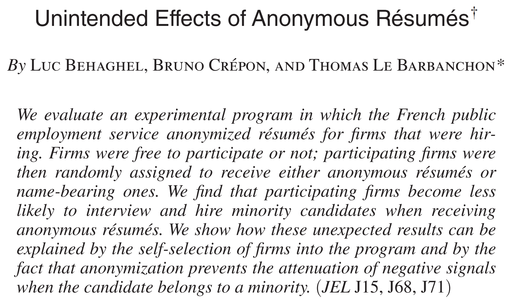
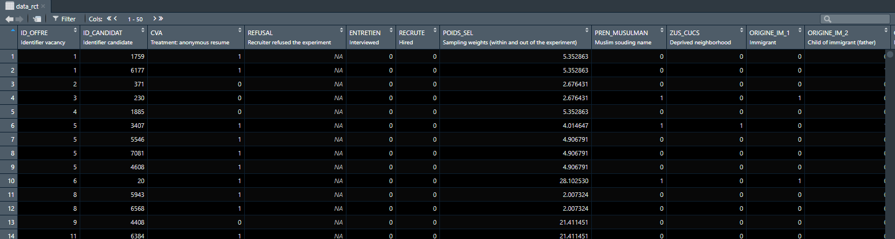
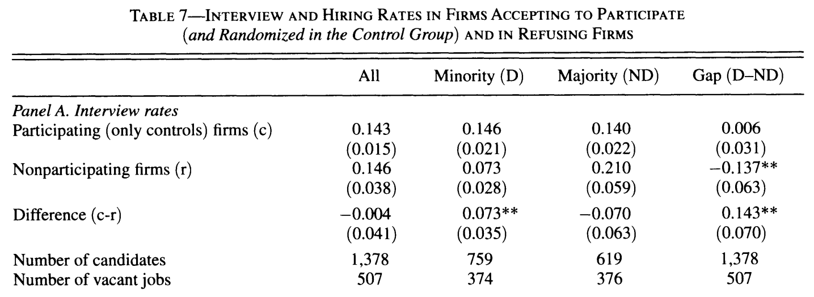
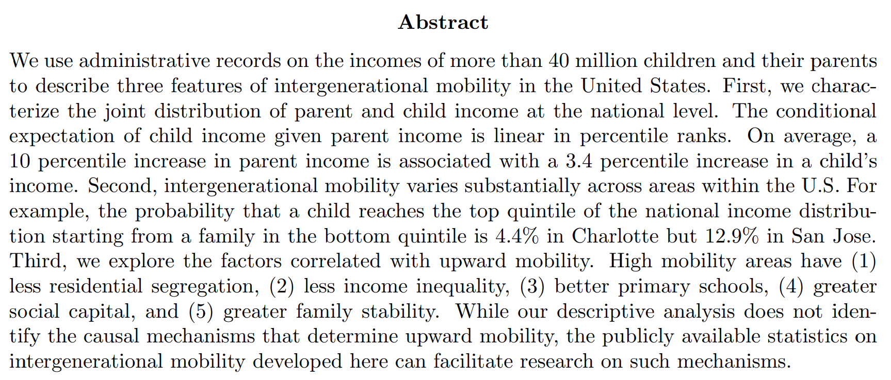
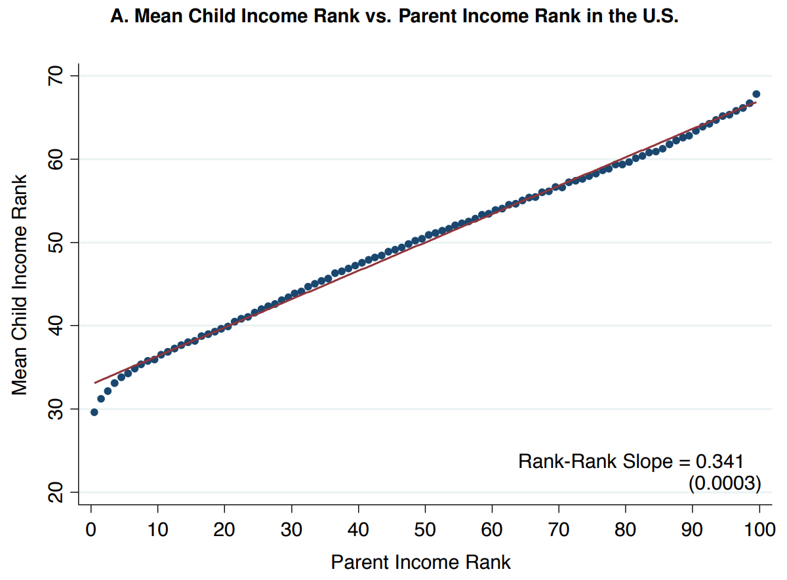
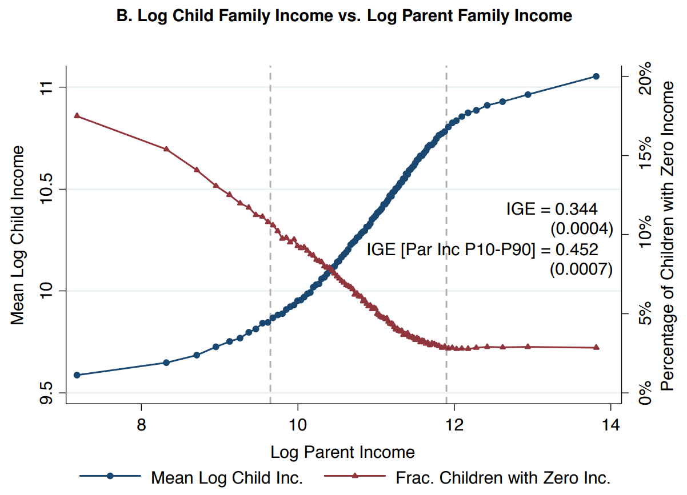
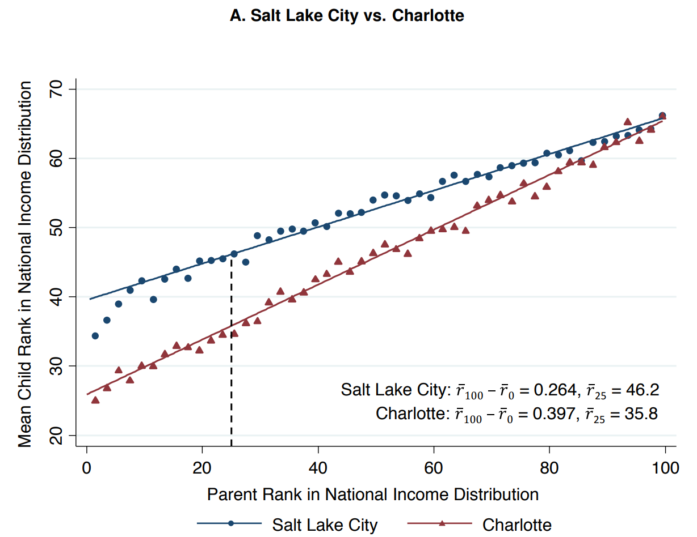
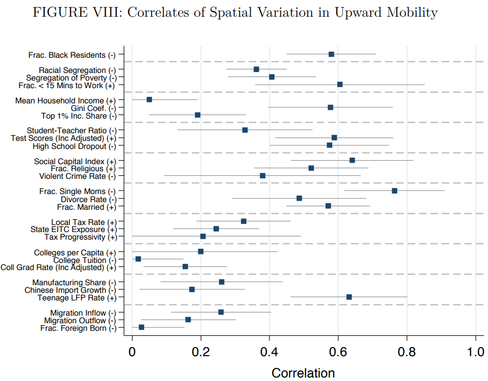

```{css, echo = F, eval = params$dark}
body{background-color:black;filter:invert(1)}
```

```{r setup, include = FALSE}
source(paste0(getwd(), "/../source/style.R"))
stargazer <- stargazer::stargazer
theme_minimal <- theme_Rcourse
options(htmltools.dir.version = F)
knitr::opts_chunk$set(echo = T, message = F, warning = F, fig.align = "center", dpi = 300, out.width = "100%")
set.seed(1)
```

<style> .left-column {width: 65%;} .right-column {width: 35%;} </style>

### Quick reminder

#### Standard interpretations

<ul>
  <li>When both \(x\) and \(y\) are continuous, the <b>general</b> template for the <b>interpretation</b> of \(\hat{\beta}\) is:</li>
</ul>

<center><i>"Everything else equal, a 1 [unit] increase in [x] is associated with<br> an [in/de]crease of [beta] [units] in [y] on average."</i></center>

--

<p style = "margin-bottom:1.5cm;"></p>

<ul>
  <li>With a discrete \(x\), the interpretation of the coefficient must be <b>relative to the reference category:</b></li>
</ul>

<center><i>"Everything else equal, belonging to the [x category] is associated with<br> a [beta] [unit] [higher/lower] average [y] relative to the [reference category]."</i></center>

--

<p style = "margin-bottom:1.5cm;"></p>

<ul>
  <li>With a <b>binary \(y\) variable</b>, the coefficient must be interpreted in <b>percentage points:</b></li>
</ul>

<center><i>"Everything else equal, a 1 [unit] increase in [x] is associated with<br> a [beta \(\times\) 100] percentage point [in/de]crease in the probability that [y equals 1] on average."</i></center>

---

### Quick reminder

#### Interpretations with variable transformation

<p style = "margin-bottom:1.25cm;"></p>

.pull-left[
<center><b>Standardization</b></center>

<ul>
  <li>To standardize a variable is to <b>divide it by its SD</b></li>
  <ul>
    <li>The variation of a standardized variable should not be <b>interpreted</b> in units but <b>in SD</b></li>
    <li>For instance if \(x\) and \(y\) are continuous and \(x\) is standardized, the interpretation becomes:</li>
  </ul>
</ul>

<p style = "margin-bottom:1cm;"></p>

<center><i>"Everything else equal, a 1 <b>standard deviation</b> increase in [x] is associated with an [in/de]crease of [beta] [units] in [y] on average."</i></center>

<p style = "margin-bottom:1cm;"></p>

<ul>
  <li>If both \(x\) and \(y\) are standardized, the slope is the correlation coefficient between \(x\) and \(y\)</li>
</ul>

]

--

.pull-right[
<center><b>Log-transformation</b></center>

<ul>
  <li>The log transformation allows to interpret the coefficient in percentage terms:</li>
</ul>

<p style = "margin-bottom:1.25cm;"></p>

<table class="table table-hover table-condensed" style="width: auto !important; margin-left: auto; margin-right: auto;font-size: 20px;">
<caption>Interpretation of the regression coefficient</caption>
 <thead>
  <tr style = "background-color: #CCD5D9;">
   <th style="text-align:center;">   </th>
   <th style="text-align:center;"> y </th>
   <th style="text-align:center;"> log(y) </th>
  </tr>
 </thead>
<tbody>
  <tr>
   <td style="text-align:center;font-weight: bold;"> x </td>
   <td style="text-align:center;width: 10em; "> \(\hat{\beta}\) is the unit increase in \(y\) due
 to a 1 unit increase in \(x\) </td>
   <td style="text-align:center;width: 10em; "> \(\hat{\beta}\times 100\) is the % increase in \(y\) due
 to a 1 unit increase in \(x\) </td>
  </tr>
  <tr style = "background-color: #CCD5D9;">
   <td style="text-align:center;font-weight: bold;"> log(x) </td>
   <td style="text-align:center;width: 10em;"> \(\hat{\beta}\div 100\) is the unit increase in \(y\) due
 to a 1% increase in \(x\) </td>
   <td style="text-align:center;width: 10em;"> \(\hat{\beta}\) is the % increase in \(y\) due
 to a 1% increase in \(x\) </td>
  </tr>
</tbody>
</table>
]

---

### Quick reminder

#### Regression table layout

```{css, echo = F}
.remark-slide table{
  font-size: 15px;
  margin: auto;
  border-top: 0px;
  border-bottom: 0px;
}

tr th td{
  font-size: 15px;
  margin: auto;
  border-top: 0px;
  border-bottom: 0px;
}

.remark-slide thead, .remark-slide tfoot, .remark-slide tr:nth-child(even) {
  background: var(--background-color);
}
```

.pull-left[
```{r, echo = F, results = "asis"}
data <- tibble(household_income = rlnorm(1000, 10, 1)) %>%
  mutate(birth_weight = 2200 + 100 * log(household_income) + rnorm(1000, 0, 400)) %>%
  mutate(Sex = ifelse((birth_weight - mean(birth_weight))/sd(birth_weight) + rnorm(n(), -5, 5) > 0, "Boy", "Girl"),
         Sex = ifelse(row_number() %in% sample(1:1000, 37, F), NA, Sex))

stargazer(lm(birth_weight ~ household_income, data), 
          lm(birth_weight ~ household_income + Sex, data), 
          type = "html", keep.stat = c("n", "rsq"), 
          covariate.labels = c("Household income", "Girl (ref: Boy)", "Constant"), 
          dep.var.labels = "Birth weight", dep.var.caption = "")
```
]

.pull-right[

Regression tables often contain multiple regressions:
<p style = "margin-bottom:.8cm;"></p>
<ul>
  <li>With <b>one regression in each column</b></li>
</ul>
<p style = "margin-bottom:.8cm;"></p>
<ul>
  <li>And one variable in <b>each row</b></li>
  <ul>
    <li>With the <b>point estimate</b></li>
    <li>And a <b>precision measure</b> below</li>
  </ul>
</ul>
<p style = "margin-bottom:.8cm;"></p>
<ul>
  <li><b>General info</b> on each model <b>at the bottom</b></li>
  <ul>
    <li>Number of observations</li>
    <li>\(\text{R}^2 = 1 - \frac{\sum_{i = 1}^n\hat{\varepsilon_i}^2}{\sum_{i = 1}^n(y_i-\bar{y})^2}\)</li>
  </ul>
</ul>
<p style = "margin-bottom:.8cm;"></p>
<ul>
  <li>A <b>symbology</b> for the <b>p-value</b> testing whether the coefficient is significantly different from 0 or not</li>
</ul>

]

---

<h3>Today: Applications in academic research</h3>

--

<p style = "margin-bottom:3cm;"></p>

.pull-left[

<ul style = "margin-left:-.5cm;list-style: none">
  <li><b>1. Causal approach (Behaghel et al., 2015)</b></li>
  <ul style = "list-style: none">
    <li>1.1. Structure</li>
    <li>1.2. Data</li>
    <li>1.3. Analysis</li>
  </ul>
</ul>

<p style = "margin-bottom:1cm;"></p>


<ul style = "margin-left:-.5cm;list-style: none">
  <li><b>2. Correlational approach (Chetty et al., 2014)</b></li>
  <ul style = "list-style: none">
    <li>2.1. Empirical approach</li>
    <li>2.2. National results</li>
    <li>2.3. Spatial variations</li>
    <li>2.4. Correlational analysis</li>
  </ul>
</ul>

]

.pull-right[
<ul style = "margin-left:-1cm;list-style: none">
  <li><b>3. Structural approach (Nerlove, 1963)</b></li>
  <ul style = "list-style: none">
    <li>3.1. Motivation</li>
    <li>3.2. Theoretical modeling</li>
    <li>3.3. Regression expression</li>
  </ul>
</ul>
 
<p style = "margin-bottom:1cm;"></p>

<ul style = "margin-left:-1cm;list-style: none"><li><b>4. Wrap up!</b></li></ul>
]

---

<h3>Today: Applications in academic research</h3>

<p style = "margin-bottom:3cm;"></p>

.pull-left[

<ul style = "margin-left:-.5cm;list-style: none">
  <li><b>1. Causal approach (Behaghel et al., 2015)</b></li>
  <ul style = "list-style: none">
    <li>1.1. Structure</li>
    <li>1.2. Data</li>
    <li>1.3. Analysis</li>
  </ul>
</ul>

]

---

### 1. Causal approach (Behaghel et al., 2015)

#### 1.1. Structure

 * Research papers always start with an <b>abstract</b> that briefly <b>describes the study:</b>
 
--

<p style = "margin-bottom:.75cm;"></p>

<center></center>

---

### 1. Causal approach (Behaghel et al., 2015)

#### 1.1. Structure

<p style = "margin-bottom:-.5em;"></p>

.pull-left[

<b>Typical structure</b> of an empirical research paper:

<p style = "margin-bottom:2em;"></p>

<ul>
  <li>Introduction/literature</li>
  <p style = "margin-bottom:.5cm;"></p>
  <li>Data/Descriptive statistics</li>
  <p style = "margin-bottom:.5cm;"></p>
  <li>Empirical framework</li>
  <p style = "margin-bottom:.5cm;"></p>
  <li>Results</li>
  <p style = "margin-bottom:.5cm;"></p>
  <li>(Heterogeneity)</li>
  <p style = "margin-bottom:.5cm;"></p>
  <li>Robustness checks</li>
  <p style = "margin-bottom:.5cm;"></p>
  <li>Conclusion</li>
</ul>

]

--

.pull-right[

<b>Structure of Behaghel et al. (2015)</b> is this one:

<ul>
  <li>Introduction</li>
  <li>Institutional Background</li>
  <li>Experiment and Data Collection</li>
  <ul>
    <li>Program and Experimental Design</li>  
    <li>Data Collection</li>  
  </ul>
  <li>Impact of Anonymous Résumés</li>
  <ul>
    <li>Interview Rates</li>  
    <li>Hiring Rates</li>  
    <li>Recruitment Success</li>  
    <li>Robustness Checks</li>  
  </ul>
  <li>Mechanisms</li>
  <ul>
    <li>Firms’ Participation Decision</li>  
    <li>Résumé Valuation by Participating Firms</li>  
  </ul>
  <li>Conclusion</li>
</ul>

]

---

### 1. Causal approach (Behaghel et al., 2015)

#### 1.1. Structure

<p style = "margin-bottom:2em;"></p>

<center><h4>Program and Experimental Design</h4></center>

<p style = "margin-bottom:2em;"></p>

<ol>
  <li><b>Firm entry in the program:</b> Firms with more than 50 employees posting vacancies lasting at least three months at the public employment service (PES) were offered to enter the program, which consists in having a 50% chance to receive anonymized instead of standard resumes for that vacancy.</li>
    <p style = "margin-bottom:.5cm;"></p>
  <li><b>Matching of resumes with vacancies:</b> The PES posts the vacancy on a variety of media, including a public website asking interested job seekers to apply through the PES branch. The PES agent selects resumes from these applicants and from internal databases of job seekers.</li>
    <p style = "margin-bottom:.5cm;"></p>
  <li><b>Randomization and anonymization:</b> Resumes are randomly anonymized or not with a 50% probability and sent to the employer.</li>
    <p style = "margin-bottom:.5cm;"></p>
  <li><b>Selection of resumes by the employer:</b> The employer selects the resumes of applicants she would like to interview and contact them (through the PES if resumes are anonymized).</li>
</ol>

---

### 1. Causal approach (Behaghel et al., 2015)

#### 1.2. Data

<p style = "margin-bottom:2em;"></p>

<center><h4>Data sources</h4></center>

<p style = "margin-bottom:2em;"></p>

<ol>
  <li><b>Administrative data</b></li>
  <ul>
    <li><b>Coverage:</b> All firms and all job seekers who used the public employment services in the experimental areas during (and after) the program</li>
    <li><b>Content:</b> information on the firm (size, sector), on the job position offered (occupation level, type of contract) and limited information on candidates (unless the candidate is filed as unemployed)</li>
  </ul>
    <p style = "margin-bottom:.5cm;"></p>
  <li><b>Telephone interviews:</b></li>
  <ul>
    <li><b>Coverage:</b> All firms entering the program, a subsample of firms that declined to participate, subsamples of applicants to vacancies posted by these two groups of firms both during and after the experiment</li>
    <li><b>Content:</b> additional characteristics of the vacancy and of the recruiter (characteristics that could be associated with a differential treatment of candidates), questions on the result of the recruitment (time to hiring and match quality)</li>
  </ul>
</ol>

---

### 1. Causal approach (Behaghel et al., 2015)

#### 1.2. Data

<p style = "margin-bottom:2em;"></p>

<center><b>Sample description</b></center>

<p style = "margin-bottom:1em;"></p>

.left-column[

<ul>
  <li><b>1,005 firms entered the program (608 declined):</b></li>
  <ul>
    <li>385 firms in the control group</li>
    <li>366 firms in the treatment group</li>
    <li>254 firms not allocated because canceled or job filled too early</li>
  </ul>
    <p style = "margin-bottom:.5cm;"></p>
  <li><b>Sample of 1,268 applicants:</b></li>
  <ul>
    <li>660 to vacancies from the control group</li>
    <li>608 to vacancies from the treatment group</li>
    <li>203 to vacancies from firms that withdrew before randomization</li>
  </ul>
  <p style = "margin-bottom:.5cm;"></p>
  <li><b>Main variables:</b></li>
  <ul>
    <li>Whether the candidates is from the minority or the majority</li>
    <li>Whether the resume was anonymized</li>
    <li>Whether the employer called back for an interview</li>
  </ul>
</ul>

]

.right-column[

<p style = "margin-bottom:2.5em;"></p>

<ul>
  <li><b>Authors use sampling weights:</b></li>
  <ul>
    <li>Representativity of the sample</li>
    <li>Non-response bias correction</li>
    <li>The weight associated with an individual can be viewed as the number of individuals she represents</li>
  </ul>
</ul>

]

---

### 1. Causal approach (Behaghel et al., 2015)

#### 1.2. Data

* Import the data

```{r, echo = F}
library(haven)
data_rct <- read_dta("data_candidates_mainsample.dta")
```

```{r, eval = F}
library(haven)
data_rct <- read_dta("data_candidates_mainsample.dta")
View(data_rct)
```

<p style = "margin-bottom:1.5em;"></p>

--

<center></center>

---

### 1. Causal approach (Behaghel et al., 2015)

#### 1.2. Data

* Subset the data

```{r, eval = F}
data_rct <- data_rct %>% 
  filter(!is.na(CVA)) %>%                                       # Keep participating firms
  rename(treatment = CVA, minority = ZouI,                      # Rename variables of interest
         interview = ENTRETIEN, weight = POIDS_SEL) %>% 
  select(treatment, minority, interview, weight)                # Select variables of interest

head(data_rct, 5)
```

--

.pull-left[
```{r, echo = F}
data_rct <- data_rct %>% 
  filter(!is.na(CVA)) %>%                                       # Keep participating firms
  rename(treatment = CVA, minority = ZouI,                      # Rename variables of interest
         interview = ENTRETIEN, weight = POIDS_SEL) %>% 
  select(treatment, minority, interview, weight)                # Select variables of interest

head(data_rct, 5)
```
]

--

.pull-right[


<p style = "margin-bottom:3.5em;"></p>

<center><i>&#10140; We want to know whether anonymizing resume helped reducing labor market discrimination toward the minority group</i></center>


]

---

### 1. Causal approach (Behaghel et al., 2015)

#### 1.3. Analysis

<p style = "margin-bottom:1.5em;"></p>

<ul>
  <li>Authors use the following <b>notations</b></li>
  <ul>
    <li>\(An\) indicates whether the resume is <b>anonymous</b></li>
    <li>\(D\) indicates whether the candidate is from the <b>minority</b></li>
    <li>\(Y\) indicates whether the candidate obtained an <b>interview</b></li>
  </ul>
</ul>

--

<p style = "margin-bottom:2.75em;"></p>

<ul>
  <li>The <b>parameter of interest</b> then writes:</li>
</ul>

$$\delta = \underbrace{(\overline{Y}^{An = 1, D = 1} - \overline{Y}^{An = 1, D = 0})}_{\substack{\text{Difference in interview rates}\\ \text{between the majority and the minority}\\ \text{when resumes are anonymized}}} - \underbrace{(\overline{Y}^{An = 0, D = 1} - \overline{Y}^{An = 0, D = 0})}_{\substack{\text{Difference in interview rates}\\ \text{between the majority and the minority}\\ \text{when resumes are } \underline{\text{not}} \text{ anonymized}}}$$

--

<p style = "margin-bottom:2.75em;"></p>

<center><b>&#10140; What sign do you expect for \(\delta\)?</b></center>

---

### 1. Causal approach (Behaghel et al., 2015)

#### 1.3. Analysis

```{r, results='hide'}
means <- data_rct %>% 
  group_by(treatment, minority) %>%
  summarise(means = weighted.mean(interview, weight))
```

--

<p style = "margin-bottom:-.75em;"></p>

```{r, echo = F}
kable(means, caption = "")
```

--

<p style = "margin-bottom:.8em;"></p>

.pull-left[

```{r, results='hide'}
means <- means %>% group_by(treatment) %>%
  summarise(discrim = means[2] - means[1])  
```

<p style = "margin-bottom:-.75em;"></p>

```{r, echo = FALSE}
kable(means, caption = "")
```


]

--

.pull-right[

```{r}
means$discrim[2] - means$discrim[1]
```

<p style = "margin-bottom:1.25em;"></p>

<center><i>The interview rate of the minority is even lower than the majority in the treatment group</i></center>

]

---

class: inverse, hide-logo

### Practice

#### 1) Estimate this parameter of interest using a regression 

*Hint: To apply weights in a regression you can indicate the weighting variable in the* `weights` *argument*

```{r, eval=F}
lm(y ~ x1 + x2 + ..., data, weights = )
```

--

 * Reminder:

```{r, eval = F}
library(tidyverse)
library(haven)
data_rct <- read_dta("data_candidates_mainsample.dta") %>%      # read .dta data
  filter(!is.na(CVA)) %>%                                       # Keep participating firms
  rename(treatment = CVA, minority = ZouI,                      # Rename variables of interest
         interview = ENTRETIEN, weight = POIDS_SEL) %>% 
  select(treatment, minority, interview, weight)                # Select variables of interest
```


<p style = "margin-bottom:1em;"></p>

$$\delta = \underbrace{(\overline{Y}^{An = 1, D = 1} - \overline{Y}^{An = 1, D = 0})}_{\substack{\text{Difference in interview rates}\\ \text{between the majority and the minority}\\ \text{when resumes are anonymized}}} - \underbrace{(\overline{Y}^{An = 0, D = 1} - \overline{Y}^{An = 0, D = 0})}_{\substack{\text{Difference in interview rates}\\ \text{between the majority and the minority}\\ \text{when resumes are } \underline{\text{not}} \text{ anonymized}}}$$

--

`r countdown(minutes = 7, top = 0, right = 0, play_sound = F, color_border = "#DFE6EB", color_text = "#DFE6EB", color_running_background = "#DFE6EB", color_running_text = "#014D64", color_finished_background = "#014D64", color_finished_text = "#DFE6EB", start_immediately = T)`


---

class: inverse, hide-logo

### Solution

<ul>
  <li>We want to see how the effect of the minority variable varies with the treatment variable</li>
  <ul>
    <li>In the regression framework, this is what interactions allow to capture</li>
  </ul>
</ul>

--

<p style = "margin-bottom:1cm;"></p>
 
$$Y_i = \alpha + \beta D_i +\gamma An_i + \delta D_i\times An_i + \varepsilon_i$$

--

```{r}
summary(lm(interview ~ minority + treatment + minority*treatment, 
           data_rct, weights = weight))$coefficients
```

--

<p style = "margin-bottom:1cm;"></p>

<ul>
  <ul>
    <li>\(\alpha\) is the interview rate for individuals in both reference groups (majority/control)</li>
    <li>\(\beta\) is the difference in means between the minority and the majority in the control group</li>
    <li>\(\gamma\) is the difference in means between the treatment and the control group for the majority group</li>
    <li>\(\delta\) is how this difference in means between the minority and the majority differ between the treatment and the control group</li>
  </ul>
</ul>

---

### 1. Causal approach (Behaghel et al., 2015)

#### 1.3. Analysis

<ul>
  <li>Why the effect is negative?</li>
</ul>
 
--
 
<center></center>

<p style = "margin-bottom:1cm;"></p>

<ul>
  <li>Compare the <b>interview rates</b> of the <b>control group</b> to those of <b>non-participating firms</b></li>
  <ul>
    <li><b>Non-participating firms interview way less the minority</b> compared to the control group</li>
    <li>Only firms who interview as much from the minority as from the majority entered the program</li>
  </ul>
</ul>

--

<p style = "margin-bottom:.75cm;"></p>

<center><i><b>&#10140; Selection bias</b></i></center>

---

<h3>Overview</h3>

<p style = "margin-bottom:3cm;"></p>

.pull-left[

<ul style = "margin-left:-.5cm;list-style: none">
  <li><b>1. Causal approach (Behaghel et al., 2015) &#10004;</b></li>
  <ul style = "list-style: none">
    <li>1.1. Structure</li>
    <li>1.2. Data</li>
    <li>1.3. Analysis</li>
  </ul>
</ul>

<p style = "margin-bottom:1cm;"></p>


<ul style = "margin-left:-.5cm;list-style: none">
  <li><b>2. Correlational approach (Chetty et al., 2014)</b></li>
  <ul style = "list-style: none">
    <li>2.1. Empirical approach</li>
    <li>2.2. National results</li>
    <li>2.3. Spatial variations</li>
    <li>2.4. Correlational analysis</li>
  </ul>
</ul>

]

.pull-right[
<ul style = "margin-left:-1cm;list-style: none">
  <li><b>3. Structural approach (Nerlove, 1963)</b></li>
  <ul style = "list-style: none">
    <li>3.1. Motivation</li>
    <li>3.2. Theoretical modeling</li>
    <li>3.3. Regression expression</li>
  </ul>
</ul>
 
<p style = "margin-bottom:1cm;"></p>

<ul style = "margin-left:-1cm;list-style: none"><li><b>4. Wrap up!</b></li></ul>
]

---

<h3>Overview</h3>

<p style = "margin-bottom:3cm;"></p>

.pull-left[

<ul style = "margin-left:-.5cm;list-style: none">
  <li><b>1. Causal approach (Behaghel et al., 2015) &#10004;</b></li>
  <ul style = "list-style: none">
    <li>1.1. Structure</li>
    <li>1.2. Data</li>
    <li>1.3. Analysis</li>
  </ul>
</ul>

<p style = "margin-bottom:1cm;"></p>


<ul style = "margin-left:-.5cm;list-style: none">
  <li><b>2. Correlational approach (Chetty et al., 2014)</b></li>
  <ul style = "list-style: none">
    <li>2.1. Empirical approach</li>
    <li>2.2. National results</li>
    <li>2.3. Spatial variations</li>
    <li>2.4. Correlational analysis</li>
  </ul>
</ul>

]

---

### 2. Correlational approach (Chetty et al., 2014)

#### 2.1. Empirical approach

<p style = "margin-bottom:3em;"></p>

<center></center>
    
---

### 2. Correlational approach (Chetty et al., 2014)

#### 2.1. Empirical approach

 * How to characterize the joint distribution of parent and child income?
 
--

<p style = "margin-bottom:3em;"></p>

**The intergenerational elasticity:**

$$\log(y^c_i) = \alpha + \beta_{IGE}\log(y^p_i)+\varepsilon_i$$
&#10140; $\hat{\beta}$ would be the expected percentage increase in child income for a 1% increase in parent income

<p style = "margin-bottom:3em;"></p>

--

**The rank-rank correlation:**


$$\text{percentile}(y^c_i) = \alpha + \beta_{RRC}\text{percentile}(y^p_i)+\varepsilon_i$$

 * In this particular case, because the dependant and the independant variables have the same variance, the regression coefficient equals the correlation coefficient
    
---

### 2. Correlational approach (Chetty et al., 2014)

#### 2.1. Empirical approach

<p style = "margin-bottom:1.5cm;"></p>

.pull-left[

$$\begin{align}\beta & = \frac{\text{Cov}(x, y)}{\text{Var}(x)}\\[1em]
& = \frac{\text{Cov}(x, y)}{\text{SD}(x)\times\text{SD}(x)} \times \frac{\text{SD}(y)}{\text{SD}(y)}\\[1em]
& = \frac{\text{Cov}(x, y)}{\text{SD}(x)\times\text{SD}(y)} \times \frac{\text{SD}(y)}{\text{SD}(x)}\\[1em]
& = \text{Cor}(x, y) \times \frac{\text{SD}(y)}{\text{SD}(x)}\end{align}$$

]

--

.pull-right[

<p style = "margin-bottom:2em;"></p>

<ul>
  <li>\(\text{SD}(\log(y^c_i)) \lesseqgtr \text{SD}(\log(y^p_i))\)</li>
  <ul>
    <li>The standard deviation of log income can be viewed as a measure of inequality</li>
    <li>The IGE is sensitive to relative inequality across generations</li>
  </ul>
</ul>

<p style = "margin-bottom:2em;"></p>

<ul>
  <li>\(\text{SD}(\text{percentile}(y^c_i)) = \text{SD}(\text{percentile}(y^p_i))\)</li>
  <ul>
    <li>The RRC is <i>not</i> sensitive to relative inequality across generations</li>
    <li>And the regression coefficient indeed equals the correlation coefficient</li>
  </ul>
</ul>
]
    
---

### 2. Correlational approach (Chetty et al., 2014)

#### 2.1. Empirical approach

<ul>
  <li>Here is what the fit of the relationship between parents and child income ranks looks like</li>
  <ul>
    <li>We can't see much, even at 1% opacity</li>
    <li>We can't even tell whether or not a linear fit is appropriate</li>
  </ul>
</ul>


```{r, echo = F, fig.width = 7, fig.height = 3.75, out.width = "65%"}
chetty <- read.csv("chetty_data.csv")

ggplot(chetty, aes(x = parent_rank, y = child_rank)) + 
  geom_point(alpha = .01, color = "#014D64") + 
  geom_smooth(method = "lm", se = F, color = "black") +
  xlab("Parent rank") + ylab("Child rank")
```

---

### 2. Correlational approach (Chetty et al., 2014)

#### 2.1. Empirical approach

<ul>
  <li>So authors compute the average child rank for each parent percentile group</li>
  <ul>
    <li>The resulting visual representation is much clearer</li>
    <li>And it allows to see whether or not a linear specification is appropriate</li>
  </ul>
</ul>

```{r, echo = F, fig.width = 7, fig.height = 3.75, out.width = "65%"}
library(readxl)
cef <- read_xls("online_data_tables.xls", skip = 8, sheet = 2) %>%
  rename(child_quantile = `...1`) %>%
  pivot_longer(-child_quantile, names_to = "parent_quantile", values_to = "pct") %>%
  mutate(parent_quantile = as.numeric(parent_quantile)) %>%
  group_by(parent_quantile) %>%
  summarise(mean_child = 100 * mean(child_quantile * pct))
  
ggplot(cef, aes(x = parent_quantile, y = mean_child)) + 
  geom_point(alpha = .8, color = "#014D64") + 
  geom_smooth(method = "lm", se = F, color = "black") +
  xlab("Parent rank") + 
  ylab("Average child rank")
```


---

### 2. Correlational approach (Chetty et al., 2014)

#### 2.2. National results

<center></center>

---

### 2. Correlational approach (Chetty et al., 2014)

#### 2.2. National results

.left-column[
<center></center>
]

.right-column[

<p style = "margin-bottom:6em;"></p>

<ul>
  <li>Authors do the same for the IGE</li>
</ul>

<p style = "margin-bottom:2em;"></p>

<ul>
  <li>For each parent income percentile:</li>
  <ul>
    <li>\(x\): Mean parent log income</li>
    <li>\(y\): Mean child log income</li>
  </ul>
</ul>

<p style = "margin-bottom:2em;"></p>

<ul>
  <li>The relationship is non-linear</li>
</ul>
]

---

### 2. Correlational approach (Chetty et al., 2014)

#### 2.3. Spatial variations

<ul>
  <li>Then authors estimate the rank-rank regression separately for each commuting zone</li>
</ul>

$$\text{percentile}(y^c_i) = \alpha + \beta_{RRC}\text{percentile}(y^p_i)+\varepsilon_i$$

<p style = "margin-bottom:2cm;"></p>

<ul>
  <li>From these local estimations they derive <b>two statistics:</b></li>
</ul>

.pull-left[

<p style = "margin-bottom:1cm;"></p>
<center><b>Relative mobility:</b> \(\hat\beta_{RRC}\)</center>
<p style = "margin-bottom:.75cm;"></p>

<ul>
  <li>The slope of the rank-rank relationship</li>
  <ul>
    <li><b>Expected rank increase</b> for a children had their parents been ranked 1 percentile higher</li>
    <li>The estimated increase indicates where the children would locate in <b>relative terms</b></li>
  </ul>
</ul>

]

.pull-right[

<p style = "margin-bottom:1cm;"></p>
<center><b>Absolute mobility:</b> \(\widehat{\alpha} + 25\times\hat\beta_{RRC}\)</center>
<p style = "margin-bottom:.75cm;"></p>

<ul>
  <li>The fitted value at \(x = 25\)</li>
  <ul>
    <li><b>Expected percentile rank</b> for children whose parents locate at the 25<sup>th</sup> percentile</li>
    <li>The estimated percentile indicates where the children would locate in <b>absolute terms</b></li>
  </ul>
</ul>
]

---

### 2. Correlational approach (Chetty et al., 2014)

#### 2.3. Spatial variations

<ul>
  <li>Here is an illustration on the national-level relationship:</li>
  <ul>
    <li></li>
    <li></li>
  </ul>
</ul>

```{r, echo = F, fig.width = 7, fig.height = 3.75, out.width = "65%"}
ggplot(cef, aes(x = parent_quantile, y = mean_child)) + 
  geom_point(alpha = .8, color = "#014D64") + 
  xlab("Parent rank") + 
  ylab("Average child rank")
```

---

### 2. Correlational approach (Chetty et al., 2014)

#### 2.3. Spatial variations

<ul>
  <li>Here is an illustration on the national-level relationship:</li>
  <ul>
    <li>The <b>relative mobility</b> is the slope - the rank-rank correlation</li>
    <li></li>
  </ul>
</ul>

```{r, echo = F, fig.width = 7, fig.height = 3.75, out.width = "65%"}
coefs <- summary(lm(mean_child ~ parent_quantile, cef))$coefficients[, 1]

ggplot(cef, aes(x = parent_quantile, y = mean_child)) + 
  geom_point(alpha = .8, color = "#014D64") + 
  geom_smooth(method = "lm", se = F, color = "black") +
  geom_segment(aes(x = 50, xend = 60, y = coefs[1] + 50*coefs[2], yend = coefs[1] + 50*coefs[2]), linetype = "dashed") + 
  geom_segment(aes(x = 60, xend = 60, y = coefs[1] + 50*coefs[2], yend = coefs[1] + 60*coefs[2]), linetype = "dashed") + 
  annotate("text", x = 65, y = coefs[1] + 55*coefs[2], label = 0.34) +
  xlab("Parent rank") + 
  ylab("Average child rank")
```

---

### 2. Correlational approach (Chetty et al., 2014)

#### 2.3. Spatial variations

<ul>
  <li>Here is an illustration on the national-level relationship:</li>
  <ul>
    <li>The <b>relative mobility</b> is the slope - the rank-rank correlation</li>
    <li>The <b>absolute mobility</b> is the fitted value for x = 25</li>
  </ul>
</ul>

```{r, echo = F, fig.width = 7, fig.height = 3.75, out.width = "65%"}
ggplot(cef, aes(x = parent_quantile, y = mean_child)) + 
  geom_point(alpha = .8, color = "#014D64") + 
  geom_smooth(method = "lm", se = F, color = "black") +
  geom_segment(aes(x = 50, xend = 60, y = coefs[1] + 50*coefs[2], yend = coefs[1] + 50*coefs[2]), linetype = "dashed") + 
  geom_segment(aes(x = 60, xend = 60, y = coefs[1] + 50*coefs[2], yend = coefs[1] + 60*coefs[2]), linetype = "dashed") + 
  annotate("text", x = 65, y = coefs[1] + 55*coefs[2], label = 0.34) +
  geom_segment(aes(x = 25, xend = 25, y = 32, yend = coefs[1] + 25*coefs[2]), linetype = "dashed") + 
  geom_segment(aes(x = 1, xend = 25, y = coefs[1] + 25*coefs[2], yend = coefs[1] + 25*coefs[2]), linetype = "dashed") + 
  annotate("text", x = 4, y = coefs[1] + 25*coefs[2] + 2, label =  round(coefs[1] + 25*coefs[2], 2)) +
  xlab("Parent rank") + 
  ylab("Average child rank")
```

---

### 2. Correlational approach (Chetty et al., 2014)

#### 2.3. Spatial variations

.left-column[

<center></center>

]

.right-column[


<p style = "margin-bottom:6em;"></p>

<ul>
  <li>Authors compute intergenerational persistence in each commuting zone separately</li>
</ul>

<p style = "margin-bottom:2em;"></p>

<ul>
  <li>And plot the results on a map</li>
</ul>

]


---

### 2. Correlational approach (Chetty et al., 2014)

#### 2.3. Spatial variations

<center></center>

---

### 2. Correlational approach (Chetty et al., 2014)

#### 2.4. Correlational analysis

<ul>
  <li>Then they investigate whether local <b>characteristics of commuting zones</b> are related to mobility</li>
  <li>But regressing directly upward mobility on different characteristics would give:</li>
  <ul>
    <li>Lower coefficients for variables with bigger metrics (test scores)</li>
    <li>Higher coefficients for variables with smaller metrics (frac. single moms)</li>
  </ul>
</ul>

--

<p style = "margin-bottom:1em;"></p>

<ul>
  <li>So authors <b>standardize</b> their <b>variables</b> for the comparability of their estimates</li>
</ul>

<p style = "margin-bottom:2.5em;"></p>

--

$$\beta = \frac{\text{Cov}(\frac{x}{\text{SD}(x)}, \frac{y}{\text{SD}(y)})}{\text{Var}(\frac{x}{\text{SD}(x)})}$$

--

<p style = "margin-bottom:1cm;"></p>

.pull-left[
<ul>
  <li>To simplify this equation, you need to know that:</li>
  <ul>
    <li>\(\text{Var}(aX) = a^2\text{Var}(X)\)</li>
    <li>\(\text{Cov}(aX, bY) =ab\text{Cov}(X, Y)\)</li>
  </ul>
</ul>
]

.pull-right[
<center><a href = "https://louissirugue.github.io/metrics_on_R/cheatsheets/moments.pdf"></a>
]

---

### 2. Correlational approach (Chetty et al., 2014)

#### 2.4. Correlational analysis

<p style = "margin-bottom:2em;"></p>

$$\begin{align}\beta & = \frac{\text{Cov}(\frac{x}{\text{SD}(x)}, \frac{y}{\text{SD}(y)})}{\text{Var}(\frac{x}{\text{SD}(x)})}\\[1em]
& = \frac{\frac{1}{\text{SD}(x)\text{SD}(y)}\text{Cov}(x, y)}{\frac{1}{\text{SD}(x)^2}\text{Var}(x)}\\[1em]
& = \frac{\text{Cov}(x, y)}{\text{SD}(x)\text{SD}(y)}\times\frac{\text{SD}(x)^2}{\text{Var}(x)}\\[1em]
& = \text{Corr}(x, y)\end{align}$$

<p style = "margin-bottom:2em;"></p>

--

<center><h4><i>&#10140; Standardizing variables allows to obtain a correlation coefficient from a regression</i></h4></center>

---

### 2. Correlational approach (Chetty et al., 2014)

#### 2.4. Correlational analysis

.left-column[
<center></center>
]

--

.right-column[

<p style = "margin-bottom:6em;"></p>

Note that these coefficients combine:
<ul>
  <li>A neighborhood effect</li>
  <li>A selection effect</li>
</ul>
]

---

<h3>Overview</h3>

<p style = "margin-bottom:3cm;"></p>

.pull-left[

<ul style = "margin-left:-.5cm;list-style: none">
  <li><b>1. Causal approach (Behaghel et al., 2015) &#10004;</b></li>
  <ul style = "list-style: none">
    <li>1.1. Structure</li>
    <li>1.2. Data</li>
    <li>1.3. Analysis</li>
  </ul>
</ul>

<p style = "margin-bottom:1cm;"></p>


<ul style = "margin-left:-.5cm;list-style: none">
  <li><b>2. Correlational approach (Chetty et al., 2014) &#10004;</b></li>
  <ul style = "list-style: none">
    <li>2.1. Empirical approach</li>
    <li>2.2. National results</li>
    <li>2.3. Spatial variations</li>
    <li>2.4. Correlational analysis</li>
  </ul>
</ul>

]

.pull-right[
<ul style = "margin-left:-1cm;list-style: none">
  <li><b>3. Structural approach (Nerlove, 1963)</b></li>
  <ul style = "list-style: none">
    <li>3.1. Motivation</li>
    <li>3.2. Theoretical modeling</li>
    <li>3.3. Regression expression</li>
  </ul>
</ul>
 
<p style = "margin-bottom:1cm;"></p>

<ul style = "margin-left:-1cm;list-style: none"><li><b>4. Wrap up!</b></li></ul>
]

---

<h3>Overview</h3>

<p style = "margin-bottom:3cm;"></p>

.pull-left[

<ul style = "margin-left:-.5cm;list-style: none">
  <li><b>1. Causal approach (Behaghel et al., 2015) &#10004;</b></li>
  <ul style = "list-style: none">
    <li>1.1. Structure</li>
    <li>1.2. Data</li>
    <li>1.3. Analysis</li>
  </ul>
</ul>

<p style = "margin-bottom:1cm;"></p>


<ul style = "margin-left:-.5cm;list-style: none">
  <li><b>2. Correlational approach (Chetty et al., 2014) &#10004;</b></li>
  <ul style = "list-style: none">
    <li>2.1. Empirical approach</li>
    <li>2.2. National results</li>
    <li>2.3. Spatial variations</li>
    <li>2.4. Correlational analysis</li>
  </ul>
</ul>

]

.pull-right[
<ul style = "margin-left:-1cm;list-style: none">
  <li><b>3. Structural approach (Nerlove, 1963)</b></li>
  <ul style = "list-style: none">
    <li>3.1. Motivation</li>
    <li>3.2. Theoretical modeling</li>
    <li>3.3. Regression expression</li>
  </ul>
</ul>
 
]

---

### 3. Structural approach (Nerlove, 1963)

#### 3.1. Motivation

<ul>
  <li>The <b>structural approach</b> refers to the following methodology:</li>
  <ol>
    <li><b>Theoretical modeling</b> of the phenomenon of interest</li>
    <li><b>Expressing the model</b> parameters <b>as</b> the coefficients of <b>a regression</b></li>
    <li>Run the corresponding regressions on data to <b>estimate the parameters</b> of the model</li>
  </ol>
</ul>

<p style = "margin-bottom:1.75cm;"></p>

--

<ul>
  <li>Structural paper are <b>more and more complex</b> on the theoretical side</li>
  <ul>
    <li>The current standards in this literature are beyond the scope of this course</li>
    <li>So we are going to explore a quite <b>old study</b> for this section</li>
  </ul>
</ul>

<p style = "margin-bottom:1.75cm;"></p>

--

<ul>
  <li>Nerlove (1963) studies the <b>returns to scale in the electricity supply industry</b></li>
  <ul>
    <li>What is the output elasticity of each input?</li>
    <li>Are the returns to scale <b>positive or negative?</b></li>
  </ul>
</ul>

---

### 3. Structural approach (Nerlove, 1963)

#### 3.1. Motivation

 * Nerlove (1963) assume the following <b>production function:</b>

$$Y = A L^\lambda K^\kappa F^\varphi u$$

<p style = "margin-bottom:1cm;"></p>

--

 * And the following <b>cost function:</b>
 
$$C = p_LL + p_KK+p_FF$$

<p style = "margin-bottom:1.5cm;"></p>

--

<center>With:</center>

<p style = "margin-bottom:.5cm;"></p>
 
.pull-left[
.pull-left[
<center><b>Inputs</b></center>

$$\begin{align}
L:& \text{ Labor input}\\
K:& \text{ Capital input}\\
F:& \text{ Fuel input}
\end{align}$$
]
.pull-right[
<center><b>Output elasticities</b></center>

$$\begin{align}
\lambda:& \text{ OE of labor}\\
\kappa:& \text{ OE of capital}\\
\varphi:& \text{ OE of fuel}
\end{align}$$
]
]

.pull-right[
.pull-left[
<center><b>Prices</b></center>

$$\begin{align}
p_L:& \text{ Wage rate}\\
p_K:& \text{ Price of capital}\\
p_F:& \text{ Price of fuel}
\end{align}$$
]
.pull-right[
<center><b>Other parameters</b></center>

$$\begin{align}
A:& \text{ Total factor}\\
       & \text{ productivity}\\
u:& \text{ Efficiency residual}
\end{align}$$
]
]

---

### 3. Structural approach (Nerlove, 1963)

#### 3.1. Motivation

<ul>
  <li><b>Theoretically</b> we could <b>estimate</b> the output elasticities <b>directly from the production function</b></li>
  <ul>
    <li>The trick is to <b>put everything in log</b> such that the exponents become the parameters of the equation</li>
    <li>We call this transformation a <b>log-linearization</b></li>
  </ul>
</ul>

<p style = "margin-bottom:1.25cm;"></p>

$$\begin{align}
\log(Y) & = \log\big(A L^\lambda K^\kappa F^\varphi u\big)\\
 &= \log(A) + \log\big(L^\lambda\big) + \log\big(K^\kappa\big) + \log\big(F^\varphi\big) + \log(u)\\
 &= \underbrace{\log(A)}_{\text{Constant}} + \lambda\log(L) + \kappa\log(K) + \varphi\log(F) + \underbrace{\log(u)}_{\text{Residuals}}
\end{align}$$

<p style = "margin-bottom:1.25cm;"></p>

--

<ul>
  <li>Regressing log output on the log inputs directly gives the <b>elasticities</b></li>
  <ul>
    <li>But Nerlove (1963) does not have access to data on firms' inputs</li>
    <li>Still, he has <b>data on the price</b> of each input</li>
    <li>His solution is to derive an expression that allows to <b>estimate the elasticities from the price</b></li>
  </ul>
</ul>

---

### 3. Structural approach (Nerlove, 1963)

#### 3.2. Theoretical modeling

<ul>
  <li>To <b>simplify</b> algebra, we're going to consider <b>capital and labor only</b></li>
  <ul>
    <li>But the principle remains the same</li>
    <li>We need to <b>solve the model</b> by minimizing the cost constrained by the production function</li>
  </ul>
</ul>

$$\begin{cases}
\text{min } & C = p_LL + p_KK\\
\text{s.t. } & Y = A L^\lambda K^\kappa  u
\end{cases} \,\,
\Longleftrightarrow \,\, \text{min }\,\mathcal{L} = p_LL + p_KK + \mu(Y - A L^\lambda K^\kappa  u)$$

--

.pull-left[

 * Equate partial derivatives to 0

$$\frac{\partial \mathcal{L}}{\partial L} = 0 \Leftrightarrow p_L = \mu A \lambda L^{\lambda-1}K^\kappa  u$$
$$\frac{\partial \mathcal{L}}{\partial K} = 0 \Leftrightarrow p_K = \mu A \kappa L^\lambda K^{\kappa-1} u$$

$$\frac{\partial \mathcal{L}}{\partial \lambda} = 0 \Leftrightarrow Y = A L^\lambda K^\kappa  u$$
]

--

.pull-right[

 * Same with $K$ and $L$ as functions of each other

$$\begin{align}
\frac{p_L}{p_K} & = \frac{\mu A \lambda L^{\lambda-1}K^\kappa  u}{\mu A \kappa L^\lambda K^{\kappa-1} u}\\
 & = \frac{\lambda L^{\lambda-1}K^\kappa}{\kappa L^\lambda K^{\kappa-1}} = \frac{\lambda K}{\kappa L}
\end{align}$$

<p style = "margin-bottom:-.5cm;"></p>

.pull-left[
$$L = K \frac{p_K}{p_L}\frac{\lambda}{\kappa}$$
]
.pull-right[
$$K = L \frac{p_L}{p_K}\frac{\kappa}{\lambda}$$
]
]

---

### 3. Structural approach (Nerlove, 1963)

#### 3.2. Theoretical modeling


.pull-left[

 * Express $Y$ as a function of $L$ only and solve for $L$

$$Y = A L^\lambda \bigg(L \frac{p_L}{p_K}\frac{\kappa}{\lambda}\bigg)^\kappa u$$

$$L^{\lambda+\kappa} =\frac{Y}{Au}\frac{1}{\bigg(\frac{p_L}{p_K}\frac{\kappa}{\lambda}\bigg)^\kappa}$$


$$ L= \left[\frac{Y}{Au}\frac{1}{\bigg(\frac{p_L}{p_K}\frac{\kappa}{\lambda}\bigg)^\kappa}\right]^{\frac{1}{\lambda + \kappa}} = \bigg(\frac{Y}{Au}\bigg)^\frac{1}{\lambda + \kappa}\bigg(\frac{p_K}{p_L}\frac{\lambda}{\kappa}\bigg)^\frac{\kappa}{\lambda+\kappa}$$

]

--

.pull-right[

 * Same with $K$
 
$$Y = A \bigg(K \frac{p_K}{p_L}\frac{\lambda}{\kappa}\bigg)^\lambda K^\kappa u$$
$$K^{\lambda+\kappa} =\frac{Y}{Au}\frac{1}{\bigg(\frac{p_K}{p_L}\frac{\lambda}{\kappa}\bigg)^\lambda}$$


$$K = \left[\frac{Y}{Au}\frac{1}{\bigg(\frac{p_K}{p_L}\frac{\lambda}{\kappa}\bigg)^\lambda}\right]^{\frac{1}{\lambda + \kappa}}  = \bigg(\frac{Y}{Au}\bigg)^\frac{1}{\lambda + \kappa}\bigg(\frac{p_L}{p_K}\frac{\kappa}{\lambda}\bigg)^\frac{\lambda}{\lambda+\kappa}$$
]

---

### 3. Structural approach (Nerlove, 1963)

#### 3.2. Theoretical modeling

 * Inject $K$ and $L$ back in the cost function and factorize

$$C =p_L\bigg(\frac{Y}{Au}\bigg)^\frac{1}{\lambda + \kappa}\bigg(\frac{p_K}{p_L}\frac{\lambda}{\kappa}\bigg)^\frac{\kappa}{\lambda+\kappa} + p_K\bigg(\frac{Y}{Au}\bigg)^\frac{1}{\lambda + \kappa}\bigg(\frac{p_L}{p_K}\frac{\kappa}{\lambda}\bigg)^\frac{\lambda}{\lambda+\kappa}$$


--

<p style = "margin-bottom:.8cm;"></p>

$$C =\bigg(\frac{Y}{Au}\bigg)^\frac{1}{\lambda + \kappa}\left[p_L\bigg(\frac{p_K}{p_L}\frac{\lambda}{\kappa}\bigg)^\frac{\kappa}{\lambda+\kappa} + p_K\bigg(\frac{p_L}{p_K}\frac{\kappa}{\lambda}\bigg)^\frac{\lambda}{\lambda+\kappa}\right]$$

--

<p style = "margin-bottom:.8cm;"></p>

$$C =\bigg(\frac{Y}{Au}\bigg)^\frac{1}{\lambda + \kappa}\left[p_L^{1 -\frac{\kappa}{\lambda+\kappa}}p_K^{\frac{\kappa}{\lambda+\kappa} }\bigg(\frac{\lambda}{\kappa}\bigg)^\frac{\kappa}{\lambda+\kappa} + p_K^{1 - \frac{\lambda}{\lambda+\kappa}}p_L^{\frac{\lambda}{\lambda+\kappa} }\bigg(\frac{\kappa}{\lambda}\bigg)^\frac{\lambda}{\lambda+\kappa}\right]$$

--

<p style = "margin-bottom:.8cm;"></p>

$$C =\bigg(\frac{Y}{Au}\bigg)^\frac{1}{\lambda + \kappa}\left[p_L^{\frac{\lambda}{\lambda+\kappa}}p_K^{\frac{\kappa}{\lambda+\kappa} }\bigg(\frac{\lambda}{\kappa}\bigg)^\frac{\kappa}{\lambda+\kappa} + p_K^{\frac{\kappa}{\lambda+\kappa}}p_L^{\frac{\lambda}{\lambda+\kappa} }\bigg(\frac{\kappa}{\lambda}\bigg)^\frac{\lambda}{\lambda+\kappa}\right]$$

---

### 3. Structural approach (Nerlove, 1963)

#### 3.2. Theoretical modeling

$$C =\bigg(\frac{Y}{Au}\bigg)^\frac{1}{\lambda + \kappa}\left[p_L^{\frac{\lambda}{\lambda+\kappa}}p_K^{\frac{\kappa}{\lambda+\kappa} }\bigg(\frac{\lambda}{\kappa}\bigg)^\frac{\kappa}{\lambda+\kappa} + p_K^{\frac{\kappa}{\lambda+\kappa}}p_L^{\frac{\lambda}{\lambda+\kappa} }\bigg(\frac{\kappa}{\lambda}\bigg)^\frac{\lambda}{\lambda+\kappa}\right]$$

--

<p style = "margin-bottom:1cm;"></p>

 
$$C =\bigg(\frac{Y}{Au}\bigg)^\frac{1}{\lambda + \kappa}p_L^{\frac{\lambda}{\lambda+\kappa}}p_K^{\frac{\kappa}{\lambda+\kappa} }\left[\bigg(\frac{\lambda}{\kappa}\bigg)^\frac{\kappa}{\lambda+\kappa} +\bigg(\frac{\kappa}{\lambda}\bigg)^\frac{\lambda}{\lambda+\kappa}\right]$$
--

<p style = "margin-bottom:1.5cm;"></p>

 * Isolate what's constant, each variable, and the residual term:

<p style = "margin-bottom:1cm;"></p>

$$C =\underbrace{\left[\frac{\big(\frac{\lambda}{\kappa}\big)^\kappa +\big(\frac{\kappa}{\lambda}\big)^\lambda}{A}\right]^\frac{1}{\lambda + \kappa}}_{\text{Constant}} \times\underbrace{Y^\frac{1}{\lambda + \kappa}}_{\text{Output}} \times\underbrace{p_L^{\frac{\lambda}{\lambda+\kappa}}}_{\text{Wage}}\times\underbrace{p_K^{\frac{\kappa}{\lambda+\kappa} }}_{\substack{\text{Price of}\\\text{Capital}}}\times\underbrace{u^\frac{1}{\lambda+\kappa}}_{\substack{\text{Residual}\\\text{term}}}$$

---

### 3. Structural approach (Nerlove, 1963)

#### 3.3. Regression expression

<ul>
  <li>At this stage we can <b>log-linearize the equation:</b></li>
</ul>

$$C =\underbrace{\left[\frac{\big(\frac{\lambda}{\kappa}\big)^\kappa +\big(\frac{\kappa}{\lambda}\big)^\lambda}{A}\right]^\frac{1}{\lambda + \kappa}}_{\text{Constant}} \times\underbrace{Y^\frac{1}{\lambda + \kappa}}_{\text{Output}} \times\underbrace{p_L^{\frac{\lambda}{\lambda+\kappa}}}_{\text{Wage}}\times\underbrace{p_K^{\frac{\kappa}{\lambda+\kappa} }}_{\substack{\text{Price of}\\\text{Capital}}}\times\underbrace{u^\frac{1}{\lambda+\kappa}}_{\substack{\text{Residual}\\\text{term}}}$$


--

<p style = "margin-bottom:.8cm;"></p>

$$\log (C) =\log \Bigg(\left[\frac{\big(\frac{\lambda}{\kappa}\big)^\kappa +\big(\frac{\kappa}{\lambda}\big)^\lambda}{A}\right]^\frac{1}{\lambda + \kappa} \Bigg) + \log \bigg(Y^\frac{1}{\lambda + \kappa}\bigg) + \log \bigg(p_L^{\frac{\lambda}{\lambda+\kappa}}\bigg) + \log \bigg(p_K^{\frac{\kappa}{\lambda+\kappa} }\bigg) + \log \bigg(u^\frac{1}{\lambda+\kappa}\bigg)$$
--

<p style = "margin-bottom:.8cm;"></p>

$$\log (C) = \underbrace{\log \Bigg(\left[\frac{\big(\frac{\lambda}{\kappa}\big)^\kappa +\big(\frac{\kappa}{\lambda}\big)^\lambda}{A}\right]^\frac{1}{\lambda + \kappa} \Bigg)}_{\alpha}  +  \underbrace{\frac{1}{\lambda + \kappa}}_{\beta}\log(Y) + \underbrace{\frac{\lambda}{\lambda+\kappa}}_{\gamma}\log(p_L) + \underbrace{\frac{\kappa}{\lambda+\kappa}}_{\delta}\log(p_K) + \underbrace{\log \bigg(u^\frac{1}{\lambda+\kappa}\bigg)}_{\varepsilon}$$

---

### 3. Structural approach (Nerlove, 1963)

#### 3.3. Regression expression

<ul>
  <li>Finally we end up with this <b>regression model:</b></li>
  <ul>
    <li>Where <b>coefficients</b> are <b>composite</b> objects of the <b>parameters</b> of the structural model</li>
  </ul>
</ul>

$$\log(C)= \alpha + \beta\log(Y) + \gamma\log(p_L) + \delta\log(p_K) + \varepsilon$$

--

<p style = "margin-bottom:1.5cm;"></p>


<ul>
  <li>But note that to <b>test for CRS</b>, we don't even need to derive \(\kappa\) and \(\lambda\) explicitely</li>
</ul>

$$\gamma = \frac{\lambda}{\lambda + \kappa} \,\,\,\, ; \,\,\,\, \delta = \frac{\kappa}{\lambda + \kappa}$$


--

<p style = "margin-bottom:1.5cm;"></p>

<ul>
  <li>Indeed, the <b>null hypothesis</b> for constant returns to scales writes</li>
</ul>

$$H_0: \lambda + \kappa = 1 \,\,\,\, \Leftrightarrow \,\,\,\, \frac{\lambda + \kappa}{\lambda + \kappa} = \frac{1}{1} \,\,\,\, \Leftrightarrow \,\,\,\, \frac{\lambda}{\lambda + \kappa} + \frac{\kappa}{\lambda + \kappa} = 1 \,\,\,\, \Leftrightarrow \,\,\,\, \gamma + \delta = 1 $$
---

class: inverse, hide-logo

### Practice

#### 1) Import the dataset from Nerlove (1963)

```{r}
library(haven)
nerlove <- read_dta("nerlove63.dta")
str(nerlove, give.attr = F)
```


--

<p style = "margin-bottom:1cm;"></p>

#### 2) Estimate the parameters of this regression:

$$\log(C)= \alpha + \beta\log(Y) + \gamma\log(p_L) + \delta\log(p_K) + \varepsilon$$

<p style = "margin-bottom:1.25cm;"></p>

--

#### 3) Use `linearHypothesis()` from the `car` package to test for CRS

--

`r countdown(minutes = 7, top = 0, right = 0, play_sound = F, color_border = "#DFE6EB", color_text = "#DFE6EB", color_running_background = "#DFE6EB", color_running_text = "#014D64", color_finished_background = "#014D64", color_finished_text = "#DFE6EB", start_immediately = T)`

---

class: inverse, hide-logo

### Solution

#### Estimate the parameters of this regression:

$$\log(C)= \alpha + \beta\log(Y) + \gamma\log(p_L) + \delta\log(p_K) + \varepsilon$$

--

```{r}
summary(lm(log(totcost) ~ log(output) + log(plabor) + log(pkap), nerlove))$coefficients
```

--

<p style = "margin-bottom:1.25em;"></p>

#### Use `linearHypothesis()` from the `car` package to test for CRS

--

```{r, eval = F}
library(car)
linearHypothesis(lm(log(totcost) ~ log(output) + log(plabor) + log(pkap), nerlove),
                 "log(output) + log(plabor) = 1")
```

---

class: inverse, hide-logo

### Solution

```{r, eval = F}
linearHypothesis(lm(log(totcost) ~ log(output) + log(plabor) + log(pkap), nerlove),
                 "log(output) + log(plabor) = 1")
```


```{r, echo = F}
library(car)
linearHypothesis(lm(log(totcost) ~ log(output) + log(plabor) + log(pkap), nerlove),
                 "log(output) + log(plabor) = 1")
```

--

<p style = "margin-bottom:1cm;"></p>

<ul>
  <li>The p-value is equal to 3.56%</li>
  <ul>
    <li>We can reject the hypothesis of constant returns to scale at the 5% confidence level</li>
    <li>But we cannot reject the hypothesis at the 1% confidence level</li>
  </ul>
</ul>

---

<h3>Overview</h3>

<p style = "margin-bottom:3cm;"></p>

.pull-left[

<ul style = "margin-left:-.5cm;list-style: none">
  <li><b>1. Causal approach (Behaghel et al., 2015) &#10004;</b></li>
  <ul style = "list-style: none">
    <li>1.1. Structure</li>
    <li>1.2. Data</li>
    <li>1.3. Analysis</li>
  </ul>
</ul>

<p style = "margin-bottom:1cm;"></p>


<ul style = "margin-left:-.5cm;list-style: none">
  <li><b>2. Correlational approach (Chetty et al., 2014) &#10004;</b></li>
  <ul style = "list-style: none">
    <li>2.1. Empirical approach</li>
    <li>2.2. National results</li>
    <li>2.3. Spatial variations</li>
    <li>2.4. Correlational analysis</li>
  </ul>
</ul>

]

.pull-right[
<ul style = "margin-left:-1cm;list-style: none">
  <li><b>3. Structural approach (Nerlove, 1963) &#10004;</b></li>
  <ul style = "list-style: none">
    <li>3.1. Motivation</li>
    <li>3.2. Theoretical modeling</li>
    <li>3.3. Regression expression</li>
  </ul>
</ul>
 
<p style = "margin-bottom:1cm;"></p>

<ul style = "margin-left:-1cm;list-style: none"><li><b>4. Wrap up!</b></li></ul>
]

---

### 4. Wrap up!

#### Causal approach (Behaghel et al., 2015)

 * Applicants resumes randomly anonymized or not before being sent to employers
 
--
 
$$Y_i = \alpha + \beta D_i +\gamma An_i + \delta D_i\times An_i + \varepsilon_i$$

 * $\hat{\delta}$ captures how the difference in interview rates between the minority and the majority differs between the treated and the control employers

--

```{r}
summary(lm(interview ~ minority + treatment + minority*treatment, 
           data_rct, weights = weight))$coefficients
```

<p style = "margin-bottom:1cm;"></p>

<center><h4> &#10140; Self-selection issue: discriminatory employers did not enter the program </h4></center>

---

### 4. Wrap up!

#### Correlational approach (Chetty et al., 2014)

$$\text{percentile}(y^c_i) = \alpha + \beta_{RRC}\text{percentile}(y^p_i)+\varepsilon_i$$
--

.left-column[

<center></center>

]

--

.right-column[

**Relative mobility:** $\widehat{\beta_{RRC}}$  
**Absolute mobility:** $\widehat{\alpha} + 25\times\widehat{\beta_{RRC}}$

<p style = "margin-bottom:1cm;"></p>

<ul>
  <li>Strong persitence in the United-States</li>
  <li>Large variations across commuting zones</li>
  <li>Intergenerational mobility correlated with characteristics of childhood environment</li>
</ul>
]

---

### 4. Wrap up!

#### Structural approach (Nerlove, 1963)

 * **Theoretical modeling**

$$\begin{cases}
\text{min } & C = p_LL + p_KK\\
\text{s.t. } & Y = A L^\lambda K^\kappa  u
\end{cases} \,\,
\Longleftrightarrow \,\, \text{min }\,\mathcal{L} = p_LL + p_KK + \mu(Y - A L^\lambda K^\kappa  u)$$

--

<p style = "margin-bottom:1cm;"></p>

 * **Regression expression**
 
$$\log (C) = \underbrace{\log \Bigg(\left[\frac{\big(\frac{\lambda}{\kappa}\big)^\kappa +\big(\frac{\kappa}{\lambda}\big)^\lambda}{A}\right]^\frac{1}{\lambda + \kappa} \Bigg)}_{\alpha}  +  \underbrace{\frac{1}{\lambda + \kappa}}_{\beta}\log(Y) + \underbrace{\frac{\lambda}{\lambda+\kappa}}_{\gamma}\log(p_L) + \underbrace{\frac{\kappa}{\lambda+\kappa}}_{\delta}\log(p_K) + \underbrace{\log \bigg(u^\frac{1}{\lambda+\kappa}\bigg)}_{\varepsilon}$$


--

<p style = "margin-bottom:1cm;"></p>

 * **Estimation**
 
$$\log(C)= \alpha + \beta\log(Y) + \gamma\log(p_L) + \delta\log(p_K) + \varepsilon \,\,\,\, \Rightarrow \,\,\,\, H_0: \gamma + \delta = 1$$
