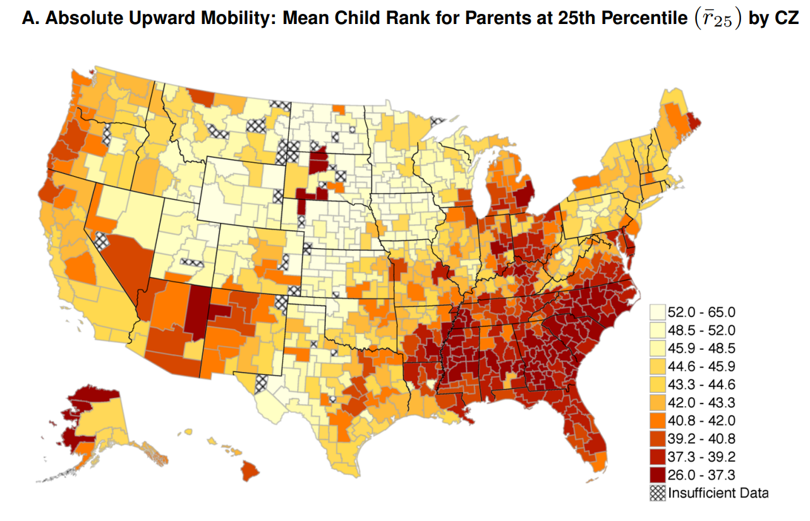

```{r setup, include = FALSE}
source(paste0(getwd(), "/../source/style.R"))
stargazer <- stargazer::stargazer
theme_minimal <- theme_Rcourse
options(htmltools.dir.version = F)
knitr::opts_chunk$set(echo = T, message = F, warning = F, fig.align = "center", dpi = 300, out.width = "100%")
set.seed(1)
```

<style> .left-column {width: 65%;} .right-column {width: 35%;} </style>

### Last time we saw

--

#### Causality 

<p style = "margin-bottom:-.5cm;"></p>

.pull-left[

1) Omitted variable bias

<p style = "margin-bottom:1.5cm;"></p>

<ul>
  <li>Regressing Earnings on Sex = Male without controls yields \(\hat{\beta} = 21612.33\)</li>
</ul>

<ul>
  <li>But controlling for weekly hours we obtain \(\hat{\beta} = 13794.39\)</li>
</ul>

<p style = "margin-bottom:1.5cm;"></p>

&#10140; Variables that are correlated to both $x$ and $y$ should be controlled for  

&#10140; And the coefficients must unambiguously be interpreted <i>ceteris paribus</i>

]

--

.pull-left[

2) Selection bias

<p style = "margin-bottom:-.35cm;"></p>
 
```{r, echo = F, fig.width = 7, fig.height = 4, out.width = "100%"}
data_bin <- tibble(x = rnorm(1000, 15, 1), 
                   noisy_x = x + runif(1000, -1, 1),
                   y = ifelse(noisy_x > mean(x), 1, 0))

data_bin2 <- data_bin %>%
  mutate(Observation = "Observed")%>%
  bind_rows(data_bin %>%
              mutate(x = ifelse(y == 0, x - 2, x + 2),
                     Observation = "Unobserved"))

ggplot(data_bin2, aes(x = x, y = y)) +
  geom_smooth(method = "lm", se = F, color = "black", linetype = "dashed") +
  geom_smooth(data = data_bin, aes(x = x, y = y), method = "lm", se = F, color = "#014D64") +
  geom_point(alpha = .1, aes(x = x, y = y, color = Observation)) + xlab("GPA") +
  scale_y_continuous(name = "", limits = c(-.5, 1.5), breaks = 0:1) +
  guides(color = guide_legend(override.aes = list(alpha = 1) ) )
```

<p style = "margin-bottom:-.35cm;"></p>

<ul><ul>
  <li>Self-selection selection into the population studied causes problems of <b>external validity</b></li>
  <li>Self-selection into the treatment variable causes problems of <b>counterfactual validity</b></li>
</ul></ul>

]

---

### Last time we saw

#### Theoretical vs. empirical moments

<p style = "margin-bottom:1.25cm;"></p>

.pull-left[

.pull-left[

<p style = "margin-bottom:4cm;"></p>

<b>First moment:</b>  

<p style = "margin-bottom:3.5cm;"></p>

<b>Second moment:</b>

]

.pull-right[

<center><h4>Theoretical moment</h4></center>

$$\text{E}(X_{\text{discrete}}) = \sum_{i=1}^{k}x_ip_i$$

$$\text{E}(X_{\text{continuous}}) = \int_{\text{R}}xf(x)dx$$

<p style = "margin-bottom:2cm;"></p>

$$\text{Var}(X) = \text{E}\left[(X - \text{E}(X))^2\right] \equiv \sigma^2$$

]

]

.pull-right[

<center><h4>Empirical moment</h4></center>

<p style = "margin-bottom:1.9cm;"></p>

$$\overline{X} = \frac{1}{N}\sum_{i=1}^Nx_i$$

<p style = "margin-bottom:2.25cm;"></p>

$$\hat{\sigma}^2 = \frac{1}{N}\sum_{i=1}^N(x_i-\bar{x})^2$$

]

---

### Today: Catch up and Applications in academic research

<p style = "margin-bottom:1.75cm;">

#### 1. Catch up: Randomness
<p style = "margin-bottom:-.5cm;">
 * 1.1. $\beta$ vs. $\hat{\beta}$

#### 2. Catch up: Causality from randomness
<p style = "margin-bottom:-.5cm;">
 * 2.1. Randomized Controlled Trials
 * 2.2. Types of randomization
 * 2.3. Multiple testing

<p style = "margin-bottom:1cm;">

#### 3. Applications in academic research
<p style = "margin-bottom:-.5cm;">
 * 3.1. Labor market discrimination (Behaghel et al., 2015)
 * 3.2. Intergenerational mobility (Chetty et al., 2014)

#### 4. Wrap up!

---

### Today: Catch up and Applications in academic research

<p style = "margin-bottom:1.75cm;">

#### 1. Catch up: Randomness
<p style = "margin-bottom:-.5cm;">
 * 1.1. $\beta$ vs. $\hat{\beta}$

---

### 1. Catch up: Randomness

#### 1.1. $\beta$ vs. $\hat{\beta}$

<ul>
  <li>Last time we simulated two normally distributed random variables \(X\) and \(Y\) of 1,000 observations according to the following theoretical moments:</i>
  <ul>
    <li>\(N = 1000\)</li>
    <li>\(\text{E}\left[X\right] = 5\)</li>
    <li>\(\text{E}\left[Y\right] = 30\)</li>
    <li>\(\text{Var}(X) = 2\)</li>
    <li>\(\text{Var}(Y) = 10\)</li>
    <li>\(\text{Cov}(X, Y) = 4\)</li>
  </ul>
</ul>

<p style = "margin-bottom:1cm;"></p>

```{r}
library(MASS)
data <- as_tibble(mvrnorm(1000, c(5, 30), matrix(c(2, 4, 4, 10), 2)))
colnames(data) <- c("x", "y")
c(mean(data$x), mean(data$y))
```

---

### 1. Catch up: Randomness

#### 1.1. $\beta$ vs. $\hat{\beta}$

 * Because we know the joint DGP of $X$ and $Y$, we do know the actual values of $\alpha$ and $\beta$ from the regression
 
$$y_i = \alpha + \beta x_i + \varepsilon_i$$

--

<p style = "margin-bottom:1cm;"></p>

$$\beta = \frac{\text{Cov}(X, Y)}{\text{Var}(X)} = \frac{4}{2} = 2$$

$$\alpha = \text{E}\left[Y\right] - \beta\times\text{E}\left[X\right] = 30 - 2\times5 = 20$$

<p style = "margin-bottom:1cm;"></p>

--

 * And the coefficients $\hat{\alpha}$ and $\hat{\beta}$ we can compute using observed data are estimates of these true parameters
 
```{r}
summary(lm(y ~ x, data))$coefficients
```

---

### 1. Catch up: Randomness

#### 1.1. $\beta$ vs. $\hat{\beta}$

 * The higher the number of observations, the closer $\hat{\beta}$ from $\beta$ on expectation:
 
```{r, eval = F}
beta_hat <- function(n){
  data <- as_tibble(mvrnorm(n, c(5, 30), matrix(c(2, 4, 4, 10), 2)))
  colnames(data) <- c("x", "y")
  return(summary(lm(y ~ x, data))$coefficients[2, 1])
}
c(beta_hat(10), beta_hat(1000), beta_hat(100000))
detach("package:MASS", unload = TRUE)
```

--

```{r, echo = F}
beta_hat <- function(n){
  data <- as_tibble(mvrnorm(n, c(5, 30), matrix(c(2, 4, 4, 10), 2)))
  colnames(data) <- c("x", "y")
  return(summary(lm(y ~ x, data))$coefficients[2, 1])
}
c(beta_hat(10), beta_hat(1000), beta_hat(100000))
detach("package:MASS", unload = TRUE)
```

--

<p style = "margin-bottom:1.25cm;"></p>

<ul>
  <li>This is what we call <i>consistency</i></li>
  <ul>
    <li>With this DGP the OLS estimator is consistent</li>
    <li>But this is not always the case</li>
    <li>You'll see the conditions for that next year</li>
  </ul>
</ul>

---

### 1. Catch up: Randomness

#### 1.1. $\beta$ vs. $\hat{\beta}$

<ul>
  <li>Keep in mind that consistency, unbiasedness, and precision, are very distinct concepts</li>
  <ul>
    <li>Consider these 4 cases where we compare the distribution of estimations \(\hat{\beta}\) from 1,000 randomly drawn samples to the true \(\beta\)</li>
  </ul>
</ul>

--

.left-column[

<p style = "margin-bottom:-.25cm;"></p>

```{r, echo = F, fig.width = 7, fig.height = 4, out.width = "90%"}
tibble(Estimation = c(rnorm(1000, 2, .1), rnorm(1000, 3, .1), 
                      rnorm(1000, 2, 1), rnorm(1000, 3, 1)),
       Precision = rep(c("Precise", "Imprecise"), each = 2000),
       Biasedness = rep(rep(c("Unbiased", "Biased"), each = 1000), 2)) %>%
  ggplot(., aes(x = Estimation)) +
  geom_density(fill = "#6794A7", color = "#014D64", alpha = .8, bw = .5) + facet_grid(Precision ~ Biasedness) +
  geom_vline(xintercept = 2, linetype = "dashed") +
  scale_x_continuous(limits = c(0, 5))
```
]

--

.right-column[

<p style = "margin-bottom:-.5cm;"></p>

<ul>
  <li>An estimator is <b>unbiased</b> if on expectation it gives the true value we want to estimate</li>
</ul>

<p style = "margin-bottom:.5cm;"></p>

<ul>
  <li>An estimator is <b>precise</b> if the estimations it provides are close to each other (low variance)</li>
</ul>

<p style = "margin-bottom:.5cm;"></p>

<ul>
  <li>An estimator is <b>consistent</b> if the larger the sample size the higher the probability that we obtain the true value we want to estimate</li>
</ul>
  
]

---

### Overview

<p style = "margin-bottom:1.75cm;">

#### 1. Catch up: Randomness &#10004;
<p style = "margin-bottom:-.5cm;">
 * 1.1. $\beta$ vs. $\hat{\beta}$

#### 2. Catch up: Causality from randomness
<p style = "margin-bottom:-.5cm;">
 * 2.1. Randomized Controlled Trials
 * 2.2. Types of randomization
 * 2.3. Multiple testing

<p style = "margin-bottom:1cm;">

#### 3. Applications in academic research
<p style = "margin-bottom:-.5cm;">
 * 3.1. Labor market discrimination (Behaghel et al., 2015)
 * 3.2. Intergenerational mobility (Chetty et al., 2014)

#### 4. Wrap up!

---

### Overview

<p style = "margin-bottom:1.75cm;">

#### 1. Catch up: Randomness &#10004;
<p style = "margin-bottom:-.5cm;">
 * 1.1. $\beta$ vs. $\hat{\beta}$

#### 2. Catch up: Causality from randomness
<p style = "margin-bottom:-.5cm;">
 * 2.1. Randomized Controlled Trials
 * 2.2. Types of randomization
 * 2.3. Multiple testing

---

### 2. Causality from randomness

#### 2.1. Randomized Controlled Trials

<ul>
  <li>A Randomized Controlled Trial (RCT) is a type of experiment in which the thing we want to know the impact of (called the treatment) is randomly allocated in the population</li>
  <ul>
    <li>It is a way to obtain causality from randomness</li>
  </ul>
</ul>

--

Take for instance the `asec_2020.csv` dataset we've been working with:

```{r, echo = F}
asec_2020 <- read.csv("asec_2020.csv")
```

```{r}
asec_2020 %>% group_by(n()) %>%
  summarise(`Mean Earnings` = mean(Earnings),
         `% Female` = 100 * mean(Sex == "Female"),
         `% Black` = 100 * mean(Race == "Black"),
         `% Asian` = 100 * mean(Race == "Asian"),
         `% Other` = 100 * mean(Race == "Other"),
         `Mean Hours` = mean(Hours))
```


---

### 2. Causality from randomness

#### 2.1. Randomized Controlled Trials

 * Let's compare the average characteristics for two randomly selected groups:
 
--

```{r}
asec_2020 %>%
  mutate(Group = ifelse(rnorm(n(), 0, 1) > 0, 1, 0)) %>%
  group_by(Group) %>%
  summarise(`Mean Earnings` = mean(Earnings),
            `% Female` = 100 * mean(Sex == "Female"),
            `% Black` = 100 * mean(Race == "Black"),
            `% Asian` = 100 * mean(Race == "Asian"),
            `% Other` = 100 * mean(Race == "Other"),
            `Mean Hours` = mean(Hours))
```

---

### 2. Causality from randomness

#### 2.1. Randomized Controlled Trials

<ul>
  <li>Their average characteristics are very close!</li>
  <ul>
    <li>On expectation their average characteristics are the same</li>
  </ul>
</ul>

--

<ul>
  <li>And just as the two randomly selected populations are comparable in terms of their observable characteristics</li>
  <ul>
    <li>On expectation they are also <b>comparable</b> in terms of their <b>unobservable characteristics!</b></li>
    <li>Randomization, if properly conducted, thus solves the problem of omitted variable bias</li>
  </ul>
</ul>

--

<center><h4><i>If we assign a treatment to Group 1, Group 2 would then be a valid counterfactual to estimate a causal effect!</i></h4></center>

--

<ul>
  <li>But RCTs are not immune to every problem:</li>
  <ul>
    <li>If individuals self-select in participating to the experiment their would be a selection bias</li>
    <li>Even without self-selection, if the population among which treatment is randomized is not representative there is a problem of external validity</li>
    <li>For the RCT to work, individuals should comply with the treatment allocation</li>
    <li>The sample must be sufficiently large for the average characteristics across groups to be close enough to their expected value</li>
    <li>...</li>
  </ul>
</ul>

---

### 2. Causality from randomness

#### 2.2. Types of randomization

 * To some extent their are ways to deal with these problems 

--

<ul>
  <li>For instance if we want to ensure that a characteristic is well balanced among the two groups, we can <b>randomize within categories of this variable</b></li>
  <ul>
    <li>Instead of giving the treatment randomly and hoping that we will obtain the same % of females in both groups</li>
    <li>We assign the treatment randomly among females and among males separately</li>
    <li>This is called <b>randomizing by block</b></li>
    <li><i>Note that this only works with observable characteristics!</i></li>
  </ul>
</ul>

--

<p style = "margin-bottom:1cm;"></p>

```{r, eval = F}
asec_2020 %>%
  group_by(Sex) %>% # Randomize treatment by sex
  mutate(Group = ifelse(rnorm(n(), 0, 1) > 0, 1, 0)) %>%
  ungroup() %>% group_by(Group) %>%
  summarise(...)
```

---

### 2. Causality from randomness

#### 2.2. Types of randomization

<ul>
  <li>Now imagine that you want to estimate the impact of calory intake at the 10am break on pupils grades</li>
  <ul>
    <li>You regularly give a snack to a sample of randomly selected children and a few months later you test whether there is a significant difference between their grades and that of untreated children</li>
    <li>Do you expect the estimated effect to reflect the actual impact you aim to measure?</li>
  </ul>
</ul>

--

<ul>
  <li>What if some children shared their snack with untreated children?</li>
  <ul>
    <li>These <i>treated children</i> would have <i>less calories</i> and then possibly lower grades than under full compliance</li>
    <li>And their <i>untreated</i> friends would have <i>more calories</i> than expected and then possibly higher grades</li>
    <li>Thus, this <b><i>spillover effect</i></b> would tend to fallaciously shrink the observed effect of the treatment</li>
  </ul>
</ul>

--

.left-column[

<p style = "margin-bottom:.75cm;"></p>

<ul>
  <li>One solution to that problem is to <b>randomize by cluster</b></li>
  <ul>
    <li>Instead of considering the treatment to be at the child level</li>
    <li>Consider that the treatment is a the school level</li>
    <li>A treated unit is a school where some/all children are treated</li>
    <li>An untreated school is a school where no child is treated</li>
  </ul>
</ul>
]

--

.right-column[
<center><i>Beware that in terms of inference, computing standard errors the usual way while the treatment is at a broader observational level than the outcome would give fallaciously low standard errors, which would need to be corrected</i></center>
]

---

### 2. Causality from randomness

#### 2.3. Multiple testing

<ul>
  <li>Another inference issue that RCTs can be subject to is multiple testing</li>
  <ul>
    <li>If you conduct a well-designed RCT you might be tempted to exploit the causal framework to test a myriad of effects</li>
  </ul>
</ul>

--

<ul>
  <li>You randomize your treatment and you compare the averages of many outcomes between treated and untreated individuals</li>
  <ul>
    <li>You would be tempted to conclude that there is a significant effect for every variable whose corresponding p-value is lower that .05</li>
    <li>But you cannot do that!</li>
  </ul>
</ul>

--

<ul>
  <li>The probability to have a p-value lower than .05 just by chance for one test is indeed 5%</li>
  <ul>
    <li>But if you do multiple tests in a row, the probability to have a p-value lower than .05 among these multiple tests is greater than 5%</li>
    <li>The greater the number of tests you perform, the higher the probability to get a significant result just by chance</li>
  </ul>
</ul>

--

<center><h4>This is what we call <i>multiple testing</i></h4></center>

---

### 2. Causality from randomness

#### 2.3. Multiple testing
 
```{r, echo = F, fig.width = 7, fig.height = 4, out.width = "75%"}
tibble(ntest = 1:50,
       proba = 1 - (.95^ntest)) %>%
  ggplot(., aes(x = ntest, y = proba)) + 
  geom_point(alpha = .8, color = "#6794A7") +
  scale_x_continuous("Number of tests", breaks = c(1, seq(10, 50, 10))) +
  scale_y_continuous("Probability to find at least\n one significant variable",
                     limits = 0:1, breaks = c(.05, seq(.2, 1, .2)),
                     labels = paste0(100*c(.05, seq(.2, 1, .2)), "%")) +
  geom_segment(x = 1, xend = 1, y = 0, yend = .05, linetype = "dashed") +
  geom_segment(x = 0, xend = 1, y = .05, yend = .05, linetype = "dashed") 
```


---

### 2. Causality from randomness

#### 2.3. Multiple testing

 * There are many ways to correct for multiple testing

<p style = "margin-bottom:1.25cm;"></p>

--

<ul>
  <li>The simplest one is called the <b>Bonferroni</b> correction</li>
  <ul>
    <li>It consists in <b>multiplying the p-value by the number of tests</b></li>
    <li>But it also leads to a large <b>loss of power</b> (the probability to find an effect when there is indeed an effect decreases a lot)</li>
  </ul>
</ul>

<p style = "margin-bottom:1.25cm;"></p>

--

<ul>
  <li>There are more sophisticated ways to deal with the problem, which can be categorized into two approaches</li>
  <ul>
    <li><b>Family Wise Error Rate</b>: Control the probability that there is at least one true assumption rejected</li>
    <li><b>False Discovery Rate</b>: Control the share of true assumptions among rejected assumptions</li>
  </ul>
</ul>

<p style = "margin-bottom:1.25cm;"></p>

--

<center><i>&#10140; We won't cover these methods in this course but keep the multiple testing issue in mind when you encounter a long series of statistical tests</i></center>


---

### Overview

<p style = "margin-bottom:1.75cm;">

#### 1. Catch up: Randomness &#10004;
<p style = "margin-bottom:-.5cm;">
 * 1.1. $\beta$ vs. $\hat{\beta}$

#### 2. Catch up: Causality from randomness &#10004;
<p style = "margin-bottom:-.5cm;">
 * 2.1. Randomized Controlled Trials
 * 2.2. Types of randomization
 * 2.3. Multiple testing

<p style = "margin-bottom:1cm;">

#### 3. Applications in academic research
<p style = "margin-bottom:-.5cm;">
 * 3.1. Labor market discrimination (Behaghel et al., 2015)
 * 3.2. Intergenerational mobility (Chetty et al., 2014)

#### 4. Wrap up!

---

### Overview

<p style = "margin-bottom:1.75cm;">

#### 1. Catch up: Randomness &#10004;
<p style = "margin-bottom:-.5cm;">
 * 1.1. $\beta$ vs. $\hat{\beta}$

#### 2. Catch up: Causality from randomness &#10004;
<p style = "margin-bottom:-.5cm;">
 * 2.1. Randomized Controlled Trials
 * 2.2. Types of randomization
 * 2.3. Multiple testing

<p style = "margin-bottom:1cm;">

#### 3. Applications in academic research
<p style = "margin-bottom:-.5cm;">
 * 3.1. Labor market discrimination (Behaghel et al., 2015)
 * 3.2. Intergenerational mobility (Chetty et al., 2014)
 
 
---

### 3. Applications in academic research

#### 3.1. Labor market discrimination (Behaghel et al., 2015)

 * Research papers always start with an abstract that briefly describes the study:
 
--

<p style = "margin-bottom:.75cm;"></p>

<center></center>

---

### 3. Applications in academic research

#### 3.1. Labor market discrimination (Behaghel et al., 2015)

<p style = "margin-bottom:-.5em;"></p>

.pull-left[

Typical structure of an empirical research paper:

<p style = "margin-bottom:2em;"></p>

<ul>
  <li>Introduction/literature</li>
  <p style = "margin-bottom:.5cm;"></p>
  <li>Data/Descriptive statistics</li>
  <p style = "margin-bottom:.5cm;"></p>
  <li>Empirical framework</li>
  <p style = "margin-bottom:.5cm;"></p>
  <li>Results</li>
  <p style = "margin-bottom:.5cm;"></p>
  <li>(Heterogeneity)</li>
  <p style = "margin-bottom:.5cm;"></p>
  <li>Robustness checks</li>
  <p style = "margin-bottom:.5cm;"></p>
  <li>Conclusion</li>
</ul>

]

--

.pull-right[

Structure of Behaghel et al. (2015) is this one:

<ul>
  <li>Introduction</li>
  <li>Institutional Background</li>
  <li>Experiment and Data Collection</li>
  <ul>
    <li>Program and Experimental Design</li>  
    <li>Data Collection</li>  
  </ul>
  <li>Impact of Anonymous Résumés</li>
  <ul>
    <li>Interview Rates</li>  
    <li>Hiring Rates</li>  
    <li>Recruitment Success</li>  
    <li>Robustness Checks</li>  
  </ul>
  <li>Mechanisms</li>
  <ul>
    <li>Firms’ Participation Decision</li>  
    <li>Résumé Valuation by Participating Firms</li>  
  </ul>
  <li>Conclusion</li>
</ul>

]

---

### 3. Applications in academic research

#### 3.1. Labor market discrimination (Behaghel et al., 2015)

<p style = "margin-bottom:2em;"></p>

<center><h4>Program and Experimental Design</h4></center>

<p style = "margin-bottom:2em;"></p>

<ol>
  <li><b>Firm entry in the program:</b> Firms with more than 50 employees posting vacancies lasting at least three months at the public employment service (PES) were offered to enter the program, which consists in having a 50% chance to receive anonymized instead of standard resumes for that vacancy.</li>
    <p style = "margin-bottom:.5cm;"></p>
  <li><b>Matching of resumes with vacancies:</b> The PES posts the vacancy on a variety of media, including a public website asking interested job seekers to apply through the PES branch. The PES agent selects resumes from these applicants and from internal databases of job seekers.</li>
    <p style = "margin-bottom:.5cm;"></p>
  <li><b>Randomization and anonymization:</b> Resumes are randomly anonymized or not with a 50% probability and sent to the employer.</li>
    <p style = "margin-bottom:.5cm;"></p>
  <li><b>Selection of resumes by the employer:</b> The employer selects the resumes of applicants she would like to interview and contact them (through the PES if resumes are anonymized).</li>
</ol>

---

### 3. Applications in academic research

#### 3.1. Labor market discrimination (Behaghel et al., 2015)

<p style = "margin-bottom:2em;"></p>

<center><h4>Data sources</h4></center>

<p style = "margin-bottom:2em;"></p>

<ol>
  <li><b>Administrative data</b></li>
  <ul>
    <li><b>Coverage:</b> All firms and all job seekers who used the public employment services in the experimental areas during (and after) the program</li>
    <li><b>Content:</b> information on the firm (size, sector), on the job position offered (occupation level, type of contract) and limited information on candidates (unless the candidate is filed as unemployed)</li>
  </ul>
    <p style = "margin-bottom:.5cm;"></p>
  <li><b>Telephone interviews:</b></li>
  <ul>
    <li><b>Coverage:</b> All firms entering the program, a subsample of firms that declined to participate, subsamples of applicants to vacancies posted by these two groups of firms both during and after the experiment</li>
    <li><b>Content:</b> additional characteristics of the vacancy and of the recruiter (characteristics that could be associated with a differential treatment of candidates), questions on the result of the recruitment (time to hiring and match quality)</li>
  </ul>
</ol>

---

### 3. Applications in academic research

#### 3.1. Labor market discrimination (Behaghel et al., 2015)

<p style = "margin-bottom:2em;"></p>

<center><h4>Sample description</h4></center>

<p style = "margin-bottom:1.5em;"></p>

.left-column[

<ul>
  <li><b>1,005 firms entered the program (608 declined):</b></li>
  <ul>
    <li>385 firms in the control group</li>
    <li>366 firms in the treatment group</li>
    <li>254 firms not allocated because canceled or job filled too early</li>
  </ul>
    <p style = "margin-bottom:.5cm;"></p>
  <li><b>Sample of 1,268 applicants:</b></li>
  <ul>
    <li>660 to vacancies from the control group</li>
    <li>608 to vacancies from the treatment group</li>
    <li>203 to vacancies from firms that withdrew before randomization</li>
  </ul>
  <p style = "margin-bottom:.5cm;"></p>
  <li><b>Main variables:</b></li>
  <ul>
    <li>Whether the candidates is from the minority or the majority</li>
    <li>Whether the resume was anonymized</li>
    <li>Whether the employer called back for an interview</li>
  </ul>
</ul>

]

.right-column[

<p style = "margin-bottom:2.5em;"></p>

<ul>
  <li><b>Authors use sampling weights:</b></li>
  <ul>
    <li>Representativity of the sample</li>
    <li>Non-response bias correction</li>
    <li>The weight associated with an individual can be viewed as the number of individuals she represents</li>
  </ul>
</ul>

]

---

### 3. Applications in academic research

#### 3.1. Labor market discrimination (Behaghel et al., 2015)

* Import the data

```{r}
library(haven)
data_rct <- read_dta("data_candidates_mainsample.dta")
View(data_rct)
```

<p style = "margin-bottom:1.5em;"></p>

--

<center></center>

---

### 3. Applications in academic research

#### 3.1. Labor market discrimination (Behaghel et al., 2015)

* Recode the data

```{r, eval = F}
data_rct <- data_rct %>% filter(!is.na(CVA)) %>%                    # Keep participating firms
   mutate(treatment = ifelse(CVA == 1, "Treatment", "Control"),     # Recode treatment variable
          minority = ifelse(ZouI == 1, "Minority", "Majority")) %>% # Recode minority variable
  rename(interviewed = ENTRETIEN, weight = POIDS_SEL)               # Rename outcome and weight

head(data_rct %>% select(treatment, minority, interviewed, weight), 5)
```

--

.pull-left[
```{r, echo = F}
data_rct <- data_rct %>% filter(!is.na(CVA)) %>%                    # Keep participating firms
   mutate(treatment = ifelse(CVA == 1, "Treatment", "Control"),     # Recode treatment variable
          minority = ifelse(ZouI == 1, "Minority", "Majority")) %>% # Recode minority variable
  rename(interview = ENTRETIEN, weight = POIDS_SEL)                 # Rename outcome and weight

head(data_rct %>% select(treatment, minority, interview, weight), 5)
```
]

--

.pull-right[


<p style = "margin-bottom:3.5em;"></p>

<center><i>&#10140; We want to know whether anonymizing resume helped reducing labord market discrimination toward the minority group</i></center>


]

---

### 3. Applications in academic research

#### 3.1. Labor market discrimination (Behaghel et al., 2015)

<p style = "margin-bottom:1.5em;"></p>

<ul>
  <li>Authors use the following notations</li>
  <ul>
    <li>\(An\) indicates whether the resume is anonymous</li>
    <li>\(D\) indicates whether the candidate is from the minority</li>
    <li>\(Y\) indicates whether the candidate obtained an interview</li>
  </ul>
</ul>

--

<p style = "margin-bottom:2.5em;"></p>

<ul>
  <li>The parameter of interest then writes:</li>
</ul>

$$\delta = \underbrace{(\overline{Y}^{An = 1, D = 1} - \overline{Y}^{An = 1, D = 0})}_{\substack{\text{Difference in interview rates}\\ \text{between the majority and the minority}\\ \text{when resumes are anonymized}}} - \underbrace{(\overline{Y}^{An = 0, D = 1} - \overline{Y}^{An = 0, D = 0})}_{\substack{\text{Difference in interview rates}\\ \text{between the majority and the minority}\\ \text{when resumes are } \underline{\text{not}} \text{ anonymized}}}$$

--

<p style = "margin-bottom:2.5em;"></p>

<h4>&#10140; What sign do you expect for \(\delta\)?</h4>

---

### 3. Applications in academic research

#### 3.1. Labor market discrimination (Behaghel et al., 2015)

```{r, results='hide'}
means <- data_rct %>% group_by(treatment, minority) %>%
  summarise(means = weighted.mean(interview, weight))
```

--

```{r, echo = F}
kable(means, caption = "")
```

--

```{r, results = 'hide'}
means %>%
  summarise(discrim = means[minority == "Minority"] - means[minority == "Majority"]) %>%
  summarise(delta = discrim[treatment == "Treatment"] - discrim[treatment == "Control"])
```

--

```{r, echo = F}
means %>%
  summarise(discrim = means[minority == "Minority"] - means[minority == "Majority"]) %>%
  summarise(delta = discrim[treatment == "Treatment"] - discrim[treatment == "Control"]) %>%
  deframe()
```

---

### Practice

<b>1) Estimate this parameter of interest using a regression</b>

*Hint: To apply weights in a regression you can indicate the weighting variable in the* `weights` *argument*

```{r, eval=F}
lm(y ~ x1 + x2 + ..., data, weights = )
```

--

 * Reminder:

```{r, eval = F}
library(tidyverse)
library(haven)
data_rct <- read_dta("data_candidates_mainsample.dta") %>%          # read .dta data
  filter(!is.na(CVA)) %>%                                           # Keep participating firms
  mutate(treatment = ifelse(CVA == 1, "Treatment", "Control"),      # Recode treatment variable
         minority = ifelse(ZouI == 1, "Minority", "Majority")) %>%  # Recode minority variable
  rename(interview = ENTRETIEN, weight = POIDS_SEL)                 # Rename outcome and weight
```


<p style = "margin-bottom:1em;"></p>

$$\delta = \underbrace{(\overline{Y}^{An = 1, D = 1} - \overline{Y}^{An = 1, D = 0})}_{\substack{\text{Difference in interview rates}\\ \text{between the majority and the minority}\\ \text{when resumes are anonymized}}} - \underbrace{(\overline{Y}^{An = 0, D = 1} - \overline{Y}^{An = 0, D = 0})}_{\substack{\text{Difference in interview rates}\\ \text{between the majority and the minority}\\ \text{when resumes are } \underline{\text{not}} \text{ anonymized}}}$$

---

### Solution

 * To see how the difference in means between the minority and the majority varies between the treatment and the control group, these two variables should be interacted:
 
$$Y_i = \alpha + \beta D_i +\gamma An_i + \delta D_i\times An_i + \varepsilon_i$$

--

```{r}
summary(lm(interview ~ minority + treatment + minority*treatment, 
           data_rct, weights = weight))$coefficients[, c(1, 4)]
```

--

<ul>
  <ul>
    <li>The constant is the interview rate for individuals in both reference groups (majority/control), and interview rates for each group can be retrieved by adding the relevant coefficients to the constant</li>
    <li>The coefficient associated with the minority variable is thus the difference in means between the minority and the majority group</li>
    <li>And the coefficient associated with the interaction is how this difference in means differ between the treatment and the control group</li>
  </ul>
</ul>

---

### 3. Applications in academic research

#### 3.1. Labor market discrimination (Behaghel et al., 2015)

 * Why the effect is negative?
 
--
 
<center></center>

 * Self-selection issue: 
  * There is a large difference between participating and non-participating firms in how their interview rates differ between the minority and the majority group
  * Participating firms are not less likely to interview a candidate from the minority group, while it is the case for non-participating firm
  * The difference in the interview gap between participating and non-participating firms amount to 14pp


---

### 3. Applications in academic research

#### 3.2. Intergenerational mobility (Chetty et al., 2014)

<p style = "margin-bottom:3em;"></p>

<center></center>
    
---

### 3. Applications in academic research

#### 3.2. Intergenerational mobility (Chetty et al., 2014)

 * How to characterize the joint distribution of parent and child income?
 
--

<p style = "margin-bottom:3em;"></p>

**The intergenerational elasticity:**

$$\log(y^c_i) = \alpha + \beta_{IGE}\log(y^p_i)+\varepsilon_i$$
&#10140; $\hat{\beta}$ would be the expected percentage increase in child income for a 1% increase in parent income

<p style = "margin-bottom:3em;"></p>

--

**The rank-rank correlation:**


$$\text{percentile}(y^c_i) = \alpha + \beta_{RRC}\text{percentile}(y^p_i)+\varepsilon_i$$

 * In this particular case, because the dependant and the independant variables have the same variance, the regression coefficient equals the correlation coefficient
    
---

### 3. Applications in academic research

#### 3.2. Intergenerational mobility (Chetty et al., 2014)

<p style = "margin-bottom:2em;"></p>

.pull-left[

$$\begin{align}\beta & = \frac{\text{Cov}(x, y)}{\text{Var}(x)}\\[1em]
& = \frac{\text{Cov}(x, y)}{\text{SD}(x)\times\text{SD}(x)} \times \frac{\text{SD}(y)}{\text{SD}(y)}\\[1em]
& = \frac{\text{Cov}(x, y)}{\text{SD}(x)\times\text{SD}(y)} \times \frac{\text{SD}(y)}{\text{SD}(x)}\\[1em]
& = \text{Cor}(x, y) \times \frac{\text{SD}(y)}{\text{SD}(x)}\end{align}$$

]

--

.pull-right[

<p style = "margin-bottom:2em;"></p>

<ul>
  <li>\(\text{SD}(\log(y^c_i)) \lesseqgtr \text{SD}(\log(y^p_i))\)</li>
  <ul>
    <li>The standard deviation of log income can be viewed as a measure of inequality</li>
    <li>The IGE is sensitive to relative inequality across generations</li>
  </ul>
</ul>

<p style = "margin-bottom:2em;"></p>

<ul>
  <li>\(\text{SD}(\text{percentile}(y^c_i)) = \text{SD}(\text{percentile}(y^p_i))\)</li>
  <ul>
    <li>The RRC is <i>not</i> sensitive to relative inequality across generations</li>
    <li>And the regression coefficient indeed equals the correlation coefficient</li>
  </ul>
</ul>
]
---

### 3. Applications in academic research

#### 3.2. Intergenerational mobility (Chetty et al., 2014)

.left-column[
<center></center>
]

.right-column[

<p style = "margin-bottom:6em;"></p>

<ul>
  <li>The IGE also implies to manage 0 and negative income</li>
</ul>

<p style = "margin-bottom:2em;"></p>

<ul>
  <li>Which is not the case with the RRC</li>
</ul>
]

---

### 3. Applications in academic research

#### 3.2. Intergenerational mobility (Chetty et al., 2014)

<center></center>

---

### 3. Applications in academic research

#### 3.2. Intergenerational mobility (Chetty et al., 2014)

.left-column[

<center></center>

]

.right-column[

Recall:

$$\begin{align}&\text{percentile}(y^c_i) = \\&\hspace{2em}\alpha + \beta_{RRC}\text{percentile}(y^p_i)+\varepsilon_i\end{align}$$

<p style = "margin-bottom:3em;"></p>

From this equation we can estimate:

 * Relative mobility: $\widehat{\beta_{RRC}}$
 * Absolute mobility: $\widehat{\alpha} + 25\times\widehat{\beta_{RRC}}$


<p style = "margin-bottom:2.5em;"></p>

And then estimate it separately for each commuting zone

]


---

### 3. Applications in academic research

#### 3.2. Intergenerational mobility (Chetty et al., 2014)

<center></center>

---

### 3. Applications in academic research

#### 3.2. Intergenerational mobility (Chetty et al., 2014)

<ul>
  <li>Authors then investigate whether local characteristics of commuting zones are related to upward mobility</li>
  <li>But regressing directly upward mobility on different characteristics would give:</li>
  <ul>
    <li>Lower coefficients for variables with bigger metrics (test scores)</li>
    <li>Higher coefficients for variables with smaller metrics (frac. single moms)</li>
  </ul>
</ul>

--

<p style = "margin-bottom:1em;"></p>

<ul>
  <li>So authors standardize their variables for the comparability of their estimates</li>
</ul>

<p style = "margin-bottom:2.5em;"></p>

--

$$\beta = \frac{\text{Cov}(\frac{x}{\text{SD}(x)}, \frac{y}{\text{SD}(y)})}{\text{Var}(\frac{x}{\text{SD}(x)})}$$

--

<p style = "margin-bottom:2.5em;"></p>

<ul>
  <li>To simplify this equation, you need to know that:</li>
  <ul>
    <li>\(\text{Var}(kX) = k^2\text{Var}(X)\)</li>
    <li>\(\text{Cov}(k_1X, k_2Y) = k_1k_2\text{Cov}(X, Y)\)</li>
  </ul>
</ul>

---

### 3. Applications in academic research

#### 3.2. Intergenerational mobility (Chetty et al., 2014)

<p style = "margin-bottom:2em;"></p>

$$\begin{align}\beta & = \frac{\text{Cov}(\frac{x}{\text{SD}(x)}, \frac{y}{\text{SD}(y)})}{\text{Var}(\frac{x}{\text{SD}(x)})}\\[1em]
& = \frac{\frac{1}{\text{SD}(x)\text{SD}(y)}\text{Cov}(x, y)}{\frac{1}{\text{SD}(x)^2}\text{Var}(x)}\\[1em]
& = \frac{\text{Cov}(x, y)}{\text{SD}(x)\text{SD}(y)}\times\frac{\text{SD}(x)^2}{\text{Var}(x)}\\[1em]
& = \text{Corr}(x, y)\end{align}$$

<p style = "margin-bottom:2em;"></p>

--

<center><h4><i>&#10140; Standardizing variables allows to obtain a correlation coefficient from a regression</i></h4></center>

---

### 3. Applications in academic research

#### 3.2. Intergenerational mobility (Chetty et al., 2014)

.left-column[
<center></center>
]

--

.right-column[

<p style = "margin-bottom:6em;"></p>

Note that these coefficients combine:
<ul>
  <li>A neighborhood effect</li>
  <li>A selection effect</li>
</ul>
]
---

### Overview

<p style = "margin-bottom:1.75cm;">

#### 1. Catch up: Randomness &#10004;
<p style = "margin-bottom:-.5cm;">
 * 1.1. $\beta$ vs. $\hat{\beta}$

#### 2. Catch up: Causality from randomness &#10004;
<p style = "margin-bottom:-.5cm;">
 * 2.1. Randomized Controlled Trials
 * 2.2. Types of randomization
 * 2.3. Multiple testing

<p style = "margin-bottom:1cm;">

#### 3. Applications in academic research &#10004;
<p style = "margin-bottom:-.5cm;">
 * 3.1. Labor market discrimination (Behaghel et al., 2015)
 * 3.2. Intergenerational mobility (Chetty et al., 2014)

#### 4. Wrap up!

---

### 4. Wrap up!

#### $\beta$ vs. $\hat{\beta}$

<ul>
  <li>Keep in mind that consistency, unbiasedness, and precision, are very distinct concepts</li>
  <ul>
    <li>Consider these 4 cases where we compare the distribution of estimations \(\hat{\beta}\) from 1,000 randomly drawn samples to the true \(\beta\)</li>
  </ul>
</ul>

--

.left-column[

<p style = "margin-bottom:-.25cm;"></p>

```{r, echo = F, fig.width = 7, fig.height = 4, out.width = "90%"}
tibble(Estimation = c(rnorm(1000, 2, .1), rnorm(1000, 3, .1), 
                      rnorm(1000, 2, 1), rnorm(1000, 3, 1)),
       Precision = rep(c("Precise", "Imprecise"), each = 2000),
       Biasedness = rep(rep(c("Unbiased", "Biased"), each = 1000), 2)) %>%
  ggplot(., aes(x = Estimation)) +
  geom_density(fill = "#6794A7", color = "#014D64", alpha = .8, bw = .5) + facet_grid(Precision ~ Biasedness) +
  geom_vline(xintercept = 2, linetype = "dashed") +
  scale_x_continuous(limits = c(0, 5))
```
]


--

.right-column[

<p style = "margin-bottom:-.5cm;"></p>


<ul>
  <li>An estimator is <b>unbiased</b> if on expectation it gives the true value we want to estimate</li>
</ul>

<p style = "margin-bottom:.5cm;"></p>

<ul>
  <li>An estimator is <b>precise</b> if the estimations it provides are close to each other (low variance)</li>
</ul>

<p style = "margin-bottom:.5cm;"></p>

<ul>
  <li>An estimator is <b>consistent</b> if the larger the sample size the higher the probability that we obtain the true value we want to estimate</li>
</ul>

  
]


---

### 4. Wrap up!

#### Randomized controlled trials 

<ul>
  <li>A Randomized Controlled Trial (RCT) is a type of experiment in which the thing we want to know the impact of (called the treatment) is randomly allocated in the population</li>
  <ul>
    <li>It is a way to obtain causality from randomness as on expectation two randomly drawn population have the same average observable and unobservable characteristics, which solves the omitted variable bias</li>
  </ul>
</ul>

--

.pull-left[

<p style = "margin-bottom:1.75cm;"></p>

<ul>
  <li>But RCTs are not immune to every problem:</li>
  <ul>
    <li>Self-selection issues can arise</li>
    <li>The population should be representative for external validity</li>
    <li>Individuals should comply with the treatment allocation</li>
    <li>The sample must be sufficiently large</li>
    <li>...</li>
  </ul>
</ul>

]

--

.pull-right[

<ul>
  <li>There are different types of randomization to help dealing with such problems</li>
  <ul>
    <li><b>Randomization by block for small samples:</b> Randomly assign the treatment within groups of individuals whose characteristic should be balanced</li>
    <li><b>Randomization by cluster for spillovers:</b> If spillovers may occur within given units, consider these units as the observational level for the treatment allocation</li>
    <li>...</li>
  </ul>
</ul>

]

---

### 4. Wrap up!

#### Labor market discrimination (Behaghel et al., 2015)

 * Applicants resumes randomly anonymized or not before being sent to employers
 
--
 
$$Y_i = \alpha + \beta D_i +\gamma An_i + \delta D_i\times An_i + \varepsilon_i$$

 * $\hat{\delta}$ captures how the difference in interview rates between the minority and the majority differs between the treated and the control employers

--

```{r}
summary(lm(interview ~ minority + treatment + minority*treatment, 
           data_rct, weights = weight))$coefficients[, c(1, 4)]
```

<p style = "margin-bottom:1cm;"></p>

<center><h4> &#10140; Self-selection issue: discriminatory employers did not enter the program </h4></center>

---

### 4. Wrap up!

#### Intergenerational mobility (Chetty et al., 2014)

$$\text{percentile}(y^c_i) = \alpha + \beta_{RRC}\text{percentile}(y^p_i)+\varepsilon_i$$
--

.left-column[

<center></center>

]

--

.right-column[

**Relative mobility:** $\widehat{\beta_{RRC}}$  
**Absolute mobility:** $\widehat{\alpha} + 25\times\widehat{\beta_{RRC}}$

<p style = "margin-bottom:1cm;"></p>

<ul>
  <li>Strong persitence in the United-States</li>
  <li>Large variations across commuting zones</li>
  <li>Intergenerational mobility correlated with characteristics of childhood environment</li>
</ul>
]

