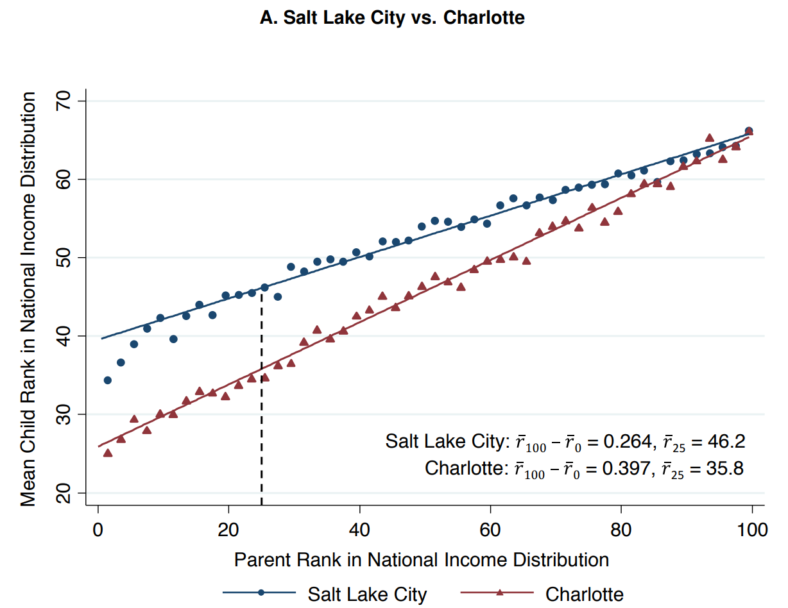

```{css, echo = F, eval = params$dark}
body{background-color:black;filter:invert(1)}
```

```{r setup, include = FALSE}
source(paste0(getwd(), "/../source/style.R"))
library(DT)
stargazer <- stargazer::stargazer
theme_minimal <- theme_Rcourse
options(htmltools.dir.version = F)
knitr::opts_chunk$set(echo = T, message = F, warning = F, fig.align = "center", dpi = 300, out.width = "100%")
set.seed(1)
```

<style> .left-column {width: 65%;} .right-column {width: 35%;} </style>

### Quick reminder

#### Causal approach (Behaghel et al., 2015)

 * Applicants resumes randomly anonymized or not before being sent to employers
 
--
 
$$Y_i = \alpha + \beta D_i +\gamma An_i + \delta D_i\times An_i + \varepsilon_i$$

 * $\hat{\delta}$ captures how the difference in interview rates between the minority and the majority differs between the treated and the control employers

--

```{r, echo= F, warning = F, message = F}
library(haven)
library(haven)
data_rct <- read_dta("data_candidates_mainsample.dta") %>%      # read .dta data
  filter(!is.na(CVA)) %>%                                       # Keep participating firms
  rename(treatment = CVA, minority = ZouI,                      # Rename variables of interest
         interview = ENTRETIEN, weight = POIDS_SEL) %>% 
  select(treatment, minority, interview, weight) 
```


```{r}
summary(lm(interview ~ minority + treatment + minority*treatment, 
           data_rct, weights = weight))$coefficients
```

<p style = "margin-bottom:1cm;"></p>

<center><h4> &#10140; Self-selection issue: discriminatory employers did not enter the program </h4></center>

---

### Quick reminder

#### Correlational approach (Chetty et al., 2014)

$$\text{percentile}(y^c_i) = \alpha + \beta_{RRC}\text{percentile}(y^p_i)+\varepsilon_i$$
--

.left-column[

<center></center>

]

--

.right-column[

**Relative mobility:** $\widehat{\beta_{RRC}}$  
**Absolute mobility:** $\widehat{\alpha} + 25\times\widehat{\beta_{RRC}}$

<p style = "margin-bottom:1cm;"></p>

<ul>
  <li>Strong persitence in the United-States</li>
  <li>Large variations across commuting zones</li>
  <li>Intergenerational mobility correlated with characteristics of childhood environment</li>
</ul>
]

---

### Quick reminder

#### Structural approach (Nerlove, 1963)

 * **Theoretical modeling**

$$\begin{cases}
\text{min } & C = p_LL + p_KK\\
\text{s.t. } & Y = A L^\lambda K^\kappa  u
\end{cases} \,\,
\Longleftrightarrow \,\, \text{min }\,\mathcal{L} = p_LL + p_KK + \mu(Y - A L^\lambda K^\kappa  u)$$

--

<p style = "margin-bottom:1cm;"></p>

 * **Regression expression**
 
$$\log (C) = \underbrace{\log \Bigg(\left[\frac{\big(\frac{\lambda}{\kappa}\big)^\kappa +\big(\frac{\kappa}{\lambda}\big)^\lambda}{A}\right]^\frac{1}{\lambda + \kappa} \Bigg)}_{\alpha}  +  \underbrace{\frac{1}{\lambda + \kappa}}_{\beta}\log(Y) + \underbrace{\frac{\lambda}{\lambda+\kappa}}_{\gamma}\log(p_L) + \underbrace{\frac{\kappa}{\lambda+\kappa}}_{\delta}\log(p_K) + \underbrace{\log \bigg(u^\frac{1}{\lambda+\kappa}\bigg)}_{\varepsilon}$$

--

<p style = "margin-bottom:1cm;"></p>

 * **Estimation**
 
$$\log(C)= \alpha + \beta\log(Y) + \gamma\log(p_L) + \delta\log(p_K) + \varepsilon \,\,\,\, \Rightarrow \,\,\,\, H_0: \gamma + \delta = 1$$

---

<h3>Today: Maps and geolocalized data</h3>

--

<p style = "margin-bottom:2cm;"></p>

.pull-left[

<ul style = "margin-left:1.5cm;list-style: none">
  <li><b>1. Geolocalized data</b></li>
  <ul style = "list-style: none">
    <li>1.1. Shapefiles and rasters</li>
    <li>1.2. Opening geolocalized data</li>
    <li>1.3. Coordinate Reference Systems</li>
    <li>1.4. Subsetting geolocalized data</li>
  </ul>
</ul>

<p style = "margin-bottom:1cm;"></p>

<ul style = "margin-left:1.5cm;list-style: none">
  <li><b>2. Geographic variables</b></li>
  <ul style = "list-style: none">
    <li>2.1. Import from csv</li>
    <li>2.2. Zonal statistics</li>
    <li>2.3. Centroids and distance</li>
  </ul>
</ul>
 
<p style = "margin-bottom:1cm;"></p>

<ul style = "margin-left:1.5cm;list-style: none"><li><b>3. Wrap up!</b></li></ul>
]

---

<h3>Today: Maps and geolocalized data</h3>

<p style = "margin-bottom:2cm;"></p>

.pull-left[

<ul style = "margin-left:1.5cm;list-style: none">
  <li><b>1. Geolocalized data</b></li>
  <ul style = "list-style: none">
    <li>1.1. Shapefiles and rasters</li>
    <li>1.2. Opening geolocalized data</li>
    <li>1.3. Coordinate Reference Systems</li>
    <li>1.4. Subsetting geolocalized data</li>
  </ul>
</ul>
]
---

### 1. Geolocalized data

#### 1.1. Shapefiles and rasters

&#10140; The <b>shapefile</b> is a format for storing <b>geographic location</b> and associated attribute information

<p style = "margin-bottom:1cm;"></p>

--

.left_column[
<ul>
  <li>Out-software it <b>can seem quite complicated:</b></li>
  <ul>
    <li>There are several files for a single dataset</li>
    <li>Always the necessary .shp, .shx, and .dbf</li>
    <li>Sometimes other files such as .prj, .cpg, etc.</li>
  </ul>
</ul>
]

.right-column[
<p style = "margin-bottom:-4.5cm;"></p>
<center></center>
]

--

<ul>
  <li>But in-software, it is <b>not so far from what we're used to:</b></li>
  <ul>
    <li>There is one line per geographic entity</li>
    <li>And one column per variable about these entities</li>
    <li>But there is one non-standard variable: the <b>geometry</b></li>
  </ul>
</ul>

--

<ul>
  <li>The geometry can be:</li>
  <ul>
    <li><b>Points</b> at given coordinates: location of weather stations/of a phone</li>
    <li><b>Polylines</b> that link sets of points: rivers/roads</li>
    <li><b>Polygons</b> that link sets of points to form a closed shape: countries/land parcels</li>
  </ul>
</ul>

---

### 1. Geolocalized data

#### 1.1. Shapefiles and rasters

 * For instance consider a shapefile
  * With two observations
  * And a polygon geometry
  
--
 
```{r, echo = F, fig.height = 5, fig.width = 8, out.width = '55%'}
fakeshp <- tibble(x = c(1, 3, 7, 8, 10, 11, 12, 13, 14),
       y1 = c(4, 3, 1, 1.75, 3.25, 4, 6, 7, 6),
       y2 = c(4, 8, 5.6, 5, 7, 4, 6, 5, 6),
       `Median income` = c(rep("High", 6), rep("Low", 3)))

ggplot() +
  geom_line(data = fakeshp, aes(x = x, y = y1, group = `Median income`)) + 
  geom_line(data = fakeshp, aes(x = x, y = y2, group = `Median income`)) + 
  theme_void() +
  theme(plot.background = element_rect(color = "#DFE6EB", fill = "#DFE6EB"),
        panel.background = element_rect(color = "#DFE6EB", fill = "#DFE6EB"))
```

---

### 1. Geolocalized data

#### 1.1. Shapefiles and rasters

 * The shapefile can also contain **attribute variable**
  * For instance the **median income** of residents of the area delimited by the polygon
  * We can plot this attribute variable using the fill aesthetic of the polygon geometry

--

```{r, echo = F, fig.height = 3.6, fig.width = 7, out.width = '65%'}
ggplot() +
  geom_line(data = fakeshp, aes(x = x, y = y1, group = `Median income`, color = `Median income`)) + 
  geom_line(data = fakeshp, aes(x = x, y = y2, group = `Median income`, color = `Median income`)) + 
  geom_ribbon(data = fakeshp %>% filter(`Median income` == "High"), aes(x = x, ymin = y1, ymax = y2), fill = "#014D64") +
  geom_ribbon(data = fakeshp %>% filter(`Median income` == "Low"), aes(x = x, ymin = y1, ymax = y2), fill = "#00A2D9") +
  theme_void() +
  theme(plot.background = element_rect(color = "#DFE6EB", fill = "#DFE6EB"),
        panel.background = element_rect(color = "#DFE6EB", fill = "#DFE6EB"))
```

---

### 1. Geolocalized data

#### 1.1. Shapefiles and rasters

 * The <b>raster</b> is another type of format for storing geolocalized data

--

<p style = "margin-bottom:-.55cm;"></p>
<ul><ul><li>It works <b>like a picture</b>, with cells like pixels</li></ul></ul>
<p style = "margin-bottom:1.22cm;"></p>

```{r, echo = F, fig.height = 3.6, fig.width = 7, out.width = '65%'}
fakeraster <- tibble(x = rep(2:14, 7) - .5,
       y = rep(8:2, each = 13) - .5,
       z = c(NA, .5, .45, .45, NA, NA, NA, NA, NA, NA, NA, NA, NA,
             NA, .45, .45, .4, .2, .2, NA, NA, 1, 1, NA, .9, .85,
             .4, .4, .4, .3, .2, .2, .5, .6, .8, 1, NA, .85, .8,
             .3, .3, .3, .3, .2, .2, .5, .7, .9, 1, NA, NA, NA,
             .2, .2, .2, .2, .2, .2, .4, .5, .7, 1, NA, NA, NA,
             NA, NA, .2, .2, .2, .2, .3, .4, .6, NA, NA, NA, NA,
             NA, NA, NA, NA, .2, .1, .2, .3, NA, NA, NA, NA, NA))

ggplot() +
  geom_tile(data = fakeraster, aes(x = x, y = y), color = "black", fill = "#DFE6EB") +
  theme_void() +
  theme(plot.background = element_rect(color = "#DFE6EB", fill = "#DFE6EB"),
        panel.background = element_rect(color = "#DFE6EB", fill = "#DFE6EB"))
```

---

### 1. Geolocalized data

#### 1.1. Shapefiles and rasters

 * The <b>raster</b> is another type of format for storing geolocalized data

<p style = "margin-bottom:-.55cm;"></p>
<ul><ul><li>It works <b>like a picture</b>, with cells like pixels</li></ul></ul>
<p style = "margin-bottom:-.55cm;"></p>
<ul><ul><li>And each cell can take a given value, e.g. pollution observed from satellites</li></ul></ul>

```{r, echo = F, fig.height = 3.6, fig.width = 7, out.width = '65%'}
ggplot(fakeraster, aes(x = x, y = y, label = z)) +
  geom_tile(color = "black", fill = "#DFE6EB") +
  geom_text() +
  theme_void() +
  theme(plot.background = element_rect(color = "#DFE6EB", fill = "#DFE6EB"),
        panel.background = element_rect(color = "#DFE6EB", fill = "#DFE6EB"))
```

---

### 1. Geolocalized data

#### 1.1. Shapefiles and rasters

 * The <b>raster</b> is another type of format for storing geolocalized data

<p style = "margin-bottom:-.55cm;"></p>
<ul><ul><li>It works <b>like a picture</b>, with cells like pixels</li></ul></ul>
<p style = "margin-bottom:-.55cm;"></p>
<ul><ul><li>And each cell can take a given value, e.g. pollution observed from satellites</li></ul></ul>

```{r, echo = F, fig.height = 3.6, fig.width = 7, out.width = '65%'}
ggplot(fakeraster, aes(x = x, y = y, label = z, fill = z)) +
  geom_tile(color = "black", show.legend = F) +
  geom_text() +
  theme_void() +
  theme(plot.background = element_rect(color = "#DFE6EB", fill = "#DFE6EB"),
        panel.background = element_rect(color = "#DFE6EB", fill = "#DFE6EB"))
```

---

### 1. Geolocalized data

#### 1.1. Shapefiles and rasters

 * Today we're gonna use this to estimate the relationship between <b>income and exposure to air pollution</b>

--

<p style = "margin-bottom:-.55cm;"></p>
<ul><ul><li>Using <b>raster</b> satellite data on pollution level</li></ul></ul>
<p style = "margin-bottom:1.22cm;"></p>

```{r, echo = F, fig.height = 3.6, fig.width = 7, out.width = '65%'}
ggplot() +
  geom_tile(data = fakeraster, aes(x = x, y = y, fill = z), color = "black", show.legend = F) +
  theme_void() +
  theme(plot.background = element_rect(color = "#DFE6EB", fill = "#DFE6EB"),
        panel.background = element_rect(color = "#DFE6EB", fill = "#DFE6EB"))
```

---

### 1. Geolocalized data

#### 1.1. Shapefiles and rasters

 * Today we're gonna use this to estimate the relationship between <b>income and exposure to air pollution</b>

<p style = "margin-bottom:-.55cm;"></p>
<ul><ul><li>Using <b>raster</b> satellite data on pollution level</li></ul></ul>
<p style = "margin-bottom:-.55cm;"></p>
<ul><ul><li>And a <b>shapefile</b> to compute the average exposure in different location and merge it with income data</li></ul></ul>

```{r, echo = F, fig.height = 3.6, fig.width = 7, out.width = '65%'}
ggplot() +
  geom_tile(data = fakeraster, aes(x = x, y = y, fill = z), color = "black", show.legend = F) + 
  geom_line(data = fakeshp, aes(x = x, y = y1, group = `Median income`), size = 1.2) + 
  geom_line(data = fakeshp, aes(x = x, y = y2, group = `Median income`), size = 1.2) + 
  theme_void() +
  theme(plot.background = element_rect(color = "#DFE6EB", fill = "#DFE6EB"),
        panel.background = element_rect(color = "#DFE6EB", fill = "#DFE6EB"))
```
 
---

### 1. Geolocalized data

#### 1.2. Opening geolocalized data
 
 * We can read shapefiles in R using the `read_sf()` function from the `sf` package (data from  [IGN](https://geoservices.ign.fr/adminexpress))

--

```{r, eval = F}
library(sf)
dep_shp <- read_sf("data/dep_shp/DEPARTEMENT.shp") 
head(dep_shp, 5)
```

--

```{r, echo = F}
library(sf)
dep_shp <- read_sf("data/dep_shp/DEPARTEMENT.shp")
head(dep_shp, 5)
```

---

### 1. Geolocalized data

#### 1.2. Opening geolocalized data

 * We can then view the data using the `geom_sf()` geometry
  * It will understand that the `geometry` variable contains the coordinates of the polygons to be plotted

--

```{r, eval = F}
library(tidyverse)
ggplot(dep_shp) + geom_sf(fill = "#6794A7", color = "#014D64", alpha = .6) + theme_void()
```

--

```{r, echo = F, fig.height = 7.2, fig.width = 11.3, out.width = '45%'}
library(tidyverse)
ggplot(dep_shp) + 
  geom_sf(fill = "#6794A7", color = "#014D64", alpha = .6) + 
  theme_void() +
  theme(plot.background = element_rect(color = "#DFE6EB", fill = "#DFE6EB"),
        panel.background = element_rect(color = "#DFE6EB", fill = "#DFE6EB"))
```

---

### 1. Geolocalized data

#### 1.2. Opening geolocalized data

 * There are several **formats of raster** files (.tif, .nc, ...)
  * We're gonna use **NetCDF** satellite data on PM<sub>2.5</sub> from the [Atmospheric Composition Analysis Group](https://sites.wustl.edu/acag/datasets/surface-pm2-5/)
  * So we're gonna need the packages `raster` and `ncdf4`

--

```{r}
library(raster)
select <- dplyr::select # The raster packages has an overriding select function
library(ncdf4)
```

--

<p style = "margin-bottom:-.55cm;"></p>

```{r, eval = F}
pm_data <- raster("data/acag_2016.nc")
pm_data
```

<p style = "margin-bottom:-.55cm;"></p>

.left-column[
```{r, echo = F}
pm_data <- raster("data/acag_2016.nc")
pm_data
```
]

--

.right-column[
<ul>
  <li>As you can see NetCDFs are complex objects:</li>
  <ul>
    <li><b>Not a simple table</b> with figures</li>
    <li>Note that the PM<sub>2.5</sub> variable is Hybrid.PM_2_._5...mug.m.3.</li>
  </ul>
</ul>
]

---

### 1. Geolocalized data

#### 1.2. Opening geolocalized data

 * We can **rename** the PM<sub>2.5</sub> variable into something more convenient

```{r}
names(pm_data) <- "pm2.5"
```

--

 * And convert the data into a standard dataset using the `rasterToPoints()` function
  * It will **generate a table** with 1 row per cell
  * An x variable for the longitude, y for latitude, and pm2.5 for pollution

--

```{r}
head(as_tibble(rasterToPoints(pm_data)), 5)
```

---

### 1. Geolocalized data

#### 1.2. Opening geolocalized data

 * This table format allows to easily **plot raster data** using the `geom_tile` geometry:

<p style = "margin-bottom:1.25cm;"></p>

--

```{r, eval = F}
library(viridis) # for nice color gradient

ggplot(as_tibble(rasterToPoints(pm_data)), # Data converted in table
       aes(x = x,                          # Longitude on the x-axis
           y = y,                          # Latitude on the y-axis
           fill = pm2.5)) +                # Pollution on the fill-axis 
  geom_tile() +                            # One filled square per cell
  scale_fill_viridis(option = "B",         # Nice color gradient
                     direction = -1) +     # The darker the more polluted
  theme_void()                             # Remove axes and grid
```

<p style = "margin-bottom:1.25cm;"></p>

--

 * This is gonna plot the 2,300 x 5,000 = 11,500,000 cells
  * With a color that is proportional to the value of `pm2.5`
  * Like the pixels of picture
  
---

### 1. Geolocalized data

#### 1.2. Opening geolocalized data

```{r, echo = F, fig.height = 6, fig.width = 9, out.width = '65%'}
library(viridis) # for nice color gradient

ggplot(as_tibble(rasterToPoints(pm_data)), # data converted in table
       aes(x = x, y = y, fill = pm2.5)) + 
  geom_tile() + scale_fill_viridis(option = "A", direction = -1) + theme_void() +
  theme(plot.background = element_rect(color = "#DFE6EB", fill = "#DFE6EB"),
        panel.background = element_rect(color = "#DFE6EB", fill = "#DFE6EB"))
```

---

### 1. Geolocalized data

#### 1.3. Coordinate Reference Systems

<ul>
  <li>You might have noticed that France does not look the same on the two graphs</li>
  <ul>
    <li>This is because we have not <b>reprojected the data</b> yet</li>
    <li>But this is the <b>first thing to do</b> when working with geolocalized data</li>
  </ul>
</ul> 
  
--

<p style = "margin-bottom:.75cm;"></p>

<ul>
  <li>Right now our two maps may not be in the same CRS</li>
  <ul>
    <li>CRS stands for <b>Coordinate Reference System</b></li>
    <li>It is a model of the Earth in which each location is coded using degrees</li>
    <li>WGS84 is the standard CRS used by GPS, Google maps, ...</li>
    <li>But it is <b>not suited to all applications</b></li>
  </ul>
</ul>

--

<p style = "margin-bottom:.75cm;"></p>

<ul>
  <li>To visualize spatial data, we need to <b>project the surface of the globe on a plane</b></li>
  <ul>
    <li>There is <b>no correct way of doing that</b></li>
    <li>Like you cannot flatten an orange peel without distorting it</li>
  </ul>
</ul>

--

<p style = "margin-bottom:1cm;"></p>

<center><h4><i>&#10140; There is a tradeoff between shape and scale preservation</i></h4></center>

---

### 1. Geolocalized data

#### 1.3. Coordinate Reference Systems

 * For instance the **Mercator projection** preserves shape but distorts scale:
 
<p style = "margin-bottom:-.58cm;"></p>

```{r, echo = F, fig.height = 11.63, fig.width = 13, out.width = '45%'}
world <- read_sf("World_Countries__Generalized_.shp")
ggplot(st_crop(st_transform(world, "+proj=merc"), 
               xmin = -20037507, xmax = 20037507, ymin = -17198185, ymax = 18375859)) + 
  geom_sf(fill = "#6794A7", color = "#014D64", alpha = .6) + 
  theme(axis.line = element_blank(), axis.ticks = element_blank(), axis.text = element_blank())
```

---

### 1. Geolocalized data

#### 1.3. Coordinate Reference Systems

 * While the **Equal-Area Cylindrical projection** preserves scale but distorts shape:

<p style = "margin-bottom:1.5cm;"></p>

```{r, echo = F, fig.height = 5.95, fig.width = 18, out.width = '90%'}
ggplot(st_transform(world, "+proj=cea")) + geom_sf(fill = "#6794A7", color = "#014D64", alpha = .6)
```

---

### 1. Geolocalized data

#### 1.3. Coordinate Reference Systems

 * This is also the case for the **Mollweide projection:**

```{r, echo = F, fig.height = 9.18, fig.width = 18, out.width = '75%'}
ggplot(st_transform(world, "+proj=moll")) + geom_sf(fill = "#6794A7", color = "#014D64", alpha = .6)
```

---

### 1. Geolocalized data

#### 1.3. Coordinate Reference Systems

 * But most projections are in between, like the **Robin projection:**

```{r, echo = F, fig.height = 9.25, fig.width = 18, out.width = '75%'}
ggplot(st_transform(world, "+proj=robin")) + geom_sf(fill = "#6794A7", color = "#014D64", alpha = .6)
```

---

### 1. Geolocalized data

#### 1.3. Coordinate Reference Systems

<ul>
  <li>The <b>smaller</b> the <b>area</b> you want to map the <b>less</b> it is a <b>problem</b></li>
  <ul>
    <li>While you would have a hard time flatten the whole orange peel</li>
    <li>Flattening a tiny bit of orange peel wouldn't require to distort it too much</li>
  </ul>
</ul>

--

<ul>
  <li>Even though there's <b>no perfect projection</b>, some are more suited to specific regions</li>
  <ul>
    <li>You wouldn't use the Mercator projection if you focus on the poles</li>
  </ul>
</ul>

--

<ul>
  <li>The website <a href="https://epsg.io/?q=France">epsg.io</a> allows you to <b>find the appropriate CRS</b> for the area you want to map</li>
  <ul>
    <li>For <b>France</b>, the recommended projection is <b>Lambert 93</b>, the corresponding EPSG code is 2154</li>
    <li>The most common projection is WGS84, the corresponding EPSG code is 4326</li>
    <li>What is important is that all the datasets are projected the same way</li>
  </ul>
</ul>

--

.pull-left[

 * For shapefile: `st_transform()`
 
```{r}
dep_shp <- st_transform(dep_shp, "EPSG:4326")
```

]
  
.pull-right[

 * For raster: `crs()`
 
```{r}
crs(pm_data) <- "EPSG:4326"
```

]

---

### 1. Geolocalized data

#### 1.3. Coordinate Reference Systems

 * Data projected in WGS84:
 
.pull-left[
```{r, echo = F, fig.height = 7.2, fig.width = 11.3, out.width = '100%'}
ggplot(dep_shp) + 
  geom_sf(fill = "#6794A7", color = "#014D64", alpha = .6) + 
  theme_void() +
  theme(plot.background = element_rect(color = "#DFE6EB", fill = "#DFE6EB"),
        panel.background = element_rect(color = "#DFE6EB", fill = "#DFE6EB"))
```

]

.pull-right[
```{r, echo = F, fig.height = 6, fig.width = 9, out.width = '100%'}
ggplot(as_tibble(rasterToPoints(pm_data)), # data converted in table
       aes(x = x, y = y, fill = pm2.5)) + 
  geom_tile() + scale_fill_viridis(option = "A", direction = -1) + theme_void() +
  theme(plot.background = element_rect(color = "#DFE6EB", fill = "#DFE6EB"),
        panel.background = element_rect(color = "#DFE6EB", fill = "#DFE6EB"))
```

]

---

### 1. Geolocalized data

#### 1.4. Subsetting geolocalized data

 * To keep only metropolitan France in the shapefile, we can filter 2-digit department codes

--

```{r}
dep_shp <- dep_shp %>% filter(nchar(INSEE_DEP) == 2)
```

--

```{r, echo = F, fig.height = 10.84, fig.width = 11.3, out.width = '35%'}
dep_shp <- dep_shp %>% filter(nchar(INSEE_DEP) == 2)
ggplot(dep_shp) + geom_sf(fill = "#6794A7", color = "#014D64", alpha = .6, size = 1) + theme_void() +
  theme(plot.background = element_rect(color = "#DFE6EB", fill = "#DFE6EB"),
        panel.background = element_rect(color = "#DFE6EB", fill = "#DFE6EB"))
```

---

### 1. Geolocalized data

#### 1.4. Subsetting geolocalized data

 * Then, we can drop from the raster everything outside the longitude/latitude frame of our shapefile

--

```{r}
pm_data <- crop(pm_data, extent(dep_shp))
```

--

```{r, echo = F, fig.height = 4.8, fig.width = 5.65, out.width = '40%'}
ggplot(as_tibble(rasterToPoints(pm_data)), aes(x = x, y = y, fill = pm2.5)) + 
  geom_tile() + scale_fill_viridis(option = "A", direction = -1) + theme_void() +
  theme(plot.background = element_rect(color = "#DFE6EB", fill = "#DFE6EB"),
        panel.background = element_rect(color = "#DFE6EB", fill = "#DFE6EB"))
```

---

### 1. Geolocalized data

#### 1.4. Subsetting geolocalized data

 * We can then replace everything that is not in a polygon of the shapefile by missing values

--

```{r}
pm_data <- mask(pm_data, dep_shp)
```

--

```{r, echo = F, fig.height = 4.8, fig.width = 5.65, out.width = '40%'}
ggplot(as_tibble(rasterToPoints(pm_data)), aes(x = x, y = y, fill = pm2.5)) + 
  geom_tile() + scale_fill_viridis(option = "A", direction = -1) + theme_void() +
  theme(plot.background = element_rect(color = "#DFE6EB", fill = "#DFE6EB"),
        panel.background = element_rect(color = "#DFE6EB", fill = "#DFE6EB"))
```

---

### 1. Geolocalized data

#### 1.4. Subsetting geolocalized data

 * The two datasets can now be overlaid:
 
```{r, eval = F}
ggplot() +
  geom_tile(data = as_tibble(rasterToPoints(pm_data)), aes(x = x, y = y, fill = pm2.5))  +
  geom_sf(data = dep_shp, fill = NA, color = alpha("grey20", .6)) +
  scale_fill_viridis(option = "A", direction = -1) + theme_void()
```

--

```{r, echo = F, fig.height = 3.6, fig.width = 4.285, out.width = '30%'}
ggplot() +
  geom_tile(data = as_tibble(rasterToPoints(pm_data)), aes(x = x, y = y, fill = pm2.5))  +
  geom_sf(data = dep_shp, fill = NA, color = alpha("grey20", .6)) +
  scale_fill_viridis(option = "A", direction = -1) + theme_void() +
  theme(plot.background = element_rect(color = "#DFE6EB", fill = "#DFE6EB"),
        panel.background = element_rect(color = "#DFE6EB", fill = "#DFE6EB"))
```

---

### 1. Geolocalized data

#### 1.4. Subsetting geolocalized data

 * We do not see much variation... Let's take a look at the PM<sub>2.5</sub> distribution

--

```{r, eval = F}
subset_data <- as_tibble(rasterToPoints(pm_data))

ggplot(subset_data, aes(x = pm2.5)) + 
  geom_density(fill = "#6794A7", color = "#014D64", alpha = .6)
```

--

.left-column[
```{r, echo = F, fig.height = 3, fig.width = 6, out.width = "80%"}
subset_data <- as_tibble(rasterToPoints(pm_data))

ggplot(subset_data, aes(x = pm2.5)) + 
  geom_density(fill = "#6794A7", color = "#014D64", alpha = .6)
```
]

--

.right-column[

<ul style = "margin-top:1cm;">
  <li style = "margin-left:-1.1cm;">There are <b>few</b> very high and very low <b>values that stretch the scale</b></li>
</ul>

<p style = "margin-bottom:1cm;"></p>

<i>&#10140; To better visualize the variations, we can <b>discretize the variable into deciles</b></i>
 
]

---

### 1. Geolocalized data

#### 1.4. Subsetting geolocalized data

<ul>
  <li>To convert a continuous into deciles we should:</li>
  <ol>
    <li>Arrange the values in ascending order</li>
    <li>Compute the ratio of their index over N to get something \(\in (0; 1]\)</li>
    <li>Multiply by the desired number of quantiles and take the ceiling</li>
    <li>Set as factor so that R does not interpret it as continuous</li>
  </ol>
</ul>

--

```{r}
subset_data <- subset_data %>%
  arrange(pm2.5) %>%
  mutate(decile = as.factor(ceiling(10 * row_number()/n())))
```

--

<p style = "margin-bottom:.75cm;"></p>

 * And plot the deciles instead of the continuous values

```{r, eval = F}
ggplot() +
  geom_tile(data = subset_data, aes(x = x, y = y, fill = decile))  +
  geom_sf(data = dep_shp, fill = NA, color = alpha("grey20", .6)) +
  scale_fill_viridis_d(option = "A", direction = -1) + theme_void()
```

---

### 1. Geolocalized data

#### 1.4. Subsetting geolocalized data

```{r, echo = F, fig.height = 7.16, fig.width = 8, out.width = "48%"}
ggplot() +
  geom_tile(data = subset_data, aes(x = x, y = y, fill = decile))  +
  geom_sf(data = dep_shp, fill = NA, color = alpha("grey20", .6)) +
  scale_fill_viridis_d(option = "A", direction = -1) + theme_void() +
  theme(plot.background = element_rect(color = "#DFE6EB", fill = "#DFE6EB"),
        panel.background = element_rect(color = "#DFE6EB", fill = "#DFE6EB"))
```

---

class: inverse, hide-logo

### Practice

<p style = "margin-bottom:.5cm;"></p>

#### First, make sure we're on the same page

```{r}
# Load packages
library(tidyverse)
library(viridis)
library(sf)
library(raster)
select <- dplyr::select
library(ncdf4)

# Import data
dep_shp <- read_sf("data/dep_shp/DEPARTEMENT.shp")
pm_data <- raster("data/acag_2016.nc")

# Reproject data
dep_shp <- st_set_crs(dep_shp, "EPSG:4326")
crs(pm_data) <- "EPSG:4326"

# Rename PM 2.5 layer
names(pm_data) <- "pm2.5"
```

---

class: inverse, hide-logo

### Practice

<p style = "margin-bottom:2.5cm;"></p>

#### 1) Filter only the Île-de-France region both in the shapefile and the raster

*Hint: The Île-de-France geographic code is 11*

--

<p style = "margin-bottom:1.5cm;"></p>

#### 2) Plot the PM<sub>2.5</sub> concentration in Île-de-France and overlay the department shapefile 

<p style = "margin-bottom:3.5cm;"></p>

--

<center><h3><i>You've got 8 minutes!</i></h3></center>

`r countdown(minutes = 8, top = 0, right = 0, play_sound = F, color_border = "#DFE6EB", color_text = "#DFE6EB", color_running_background = "#DFE6EB", color_running_text = "#014D64", color_finished_background = "#014D64", color_finished_text = "#DFE6EB", start_immediately = T)`

---

class: inverse, hide-logo

### Solution

#### 1) Filter only the Île-de-France region both in the shapefile and the raster

--

```{r}
# Filter only departments of Île-de-France in shapefile
dep_shp <- dep_shp %>% filter(INSEE_REG == 11)
```

--

<p style = "margin-bottom:-.8cm;"></p>

```{r}
# Drop fromraster everything outside the lon/lat frame of the shapefile
pm_data <- crop(pm_data, extent(dep_shp))
```

--

<p style = "margin-bottom:-.8cm;"></p>

```{r}
# Replace everything that is not in a polygon of the shapefile by NA
pm_data <- mask(pm_data, dep_shp)
```

--

#### 2) Plot the PM<sub>2.5</sub> concentration in Île-de-France and overlay the department shapefile 

```{r, eval = F}
ggplot() +
```

--

<p style = "margin-bottom:-.8cm;"></p>

```{r, eval = F}
  # Plot the raster
  geom_tile(data = as_tibble(rasterToPoints(pm_data)), aes(x = x, y = y, fill = pm2.5))  +
```

--

<p style = "margin-bottom:-.8cm;"></p>

```{r, eval = F}
  # Plot the shapefile
  geom_sf(data = dep_shp, fill = NA) +
```

--

<p style = "margin-bottom:-.8cm;"></p>

```{r, eval = F}
  # Custom scale
  scale_fill_viridis(option = "B") + theme_void()
```

---

class: inverse, hide-logo

### Solution

```{r, echo = F, fig.height = 4, fig.width = 5.7, out.width = "65%"}
ggplot() +
  geom_tile(data = as_tibble(rasterToPoints(pm_data)), 
            aes(x = x, y = y, fill = pm2.5))  +
  geom_sf(data = dep_shp, fill = NA, color = "#dfe6eb") +
  scale_fill_viridis(option = "B") + theme_void() +
  theme(plot.background = element_rect(color = "#014d64", fill = "#014d64"),
        panel.background = element_rect(color = "#014d64", fill = "#014d64"),
        panel.grid = element_blank(),
        axis.title = element_text(color = "#dfe6eb"),
        legend.title = element_text(color = "#dfe6eb"),
        legend.text = element_text(color = "#dfe6eb"),
        axis.text = element_text(color = "#dfe6eb"),
        axis.line = element_line(color = "#dfe6eb"),
        axis.ticks = element_line(color = "#dfe6eb"))
```

---

<h3>Overview</h3>

<p style = "margin-bottom:2cm;"></p>

.pull-left[

<ul style = "margin-left:1.5cm;list-style: none">
  <li><b>1. Geolocalized data &#10004;</b></li>
  <ul style = "list-style: none">
    <li>1.1. Shapefiles and rasters</li>
    <li>1.2. Opening geolocalized data</li>
    <li>1.3. Coordinate Reference Systems</li>
    <li>1.4. Subsetting geolocalized data</li>
  </ul>
</ul>

<p style = "margin-bottom:1cm;"></p>

<ul style = "margin-left:1.5cm;list-style: none">
  <li><b>2. Geographic variables</b></li>
  <ul style = "list-style: none">
    <li>2.1. Import from csv</li>
    <li>2.2. Zonal statistics</li>
    <li>2.3. Centroids and distance</li>
  </ul>
</ul>
 
<p style = "margin-bottom:1cm;"></p>

<ul style = "margin-left:1.5cm;list-style: none"><li><b>3. Wrap up!</b></li></ul>
]

---

<h3>Overview</h3>

<p style = "margin-bottom:2cm;"></p>

.pull-left[

<ul style = "margin-left:1.5cm;list-style: none">
  <li><b>1. Geolocalized data &#10004;</b></li>
  <ul style = "list-style: none">
    <li>1.1. Shapefiles and rasters</li>
    <li>1.2. Opening geolocalized data</li>
    <li>1.3. Coordinate Reference Systems</li>
    <li>1.4. Subsetting geolocalized data</li>
  </ul>
</ul>

<p style = "margin-bottom:1cm;"></p>

<ul style = "margin-left:1.5cm;list-style: none">
  <li><b>2. Geographic variables</b></li>
  <ul style = "list-style: none">
    <li>2.1. Import from csv</li>
    <li>2.2. Zonal statistics</li>
    <li>2.3. Centroids and distance</li>
  </ul>
</ul>
]

---

### 2. Geographic variables

#### 2.1. Import from csv

<ul>
  <li>Geographic variables can simply be stored in csv:</li>
  <ul>
    <li>The Gini index of inequality of countries</li>
    <li>The unemployment rate of departments</li>
    <li>The number of inhabitants of cities</li>
    <li>...</li>
  </ul>
</ul>
  
--

<ul>
  <li>In this case you can simply</li>
  <ul>
    <li>Import the csv data you need</li>
    <li>Join it to the shapefile as you would do with any other data</li>
  </ul>
</ul>

--

<p style = "margin-bottom:1cm;"></p>

<center><i><b>&#10140; Let's study the relationship between income and exposure to air pollution at the city level in Île-de-France</b></i></center>

<p style = "margin-bottom:1cm;"></p>

--

<ul>
  <li>We need:</li>
  <ol>
    <li>To import the shapefile of cities in Île-de-France</li>
    <li>To import and join median income by city</li>
  </ol>
</ul>

---

### 2. Geographic variables

#### 2.1. Import from csv

 * Import shapefile of cities in Île-de-France and project it in WGS84

--

```{r, eval = F}
idf_shp <- read_sf("data/idf_shp/idf.shp")
idf_shp <- st_set_crs(idf_shp, "EPSG:4326")
head(idf_shp, 5)
```

--

```{r, echo = F}
idf_shp <- read_sf("data/idf_shp/idf.shp")
idf_shp <- st_set_crs(idf_shp, "EPSG:4326")
head(idf_shp, 5)
```

---

### 2. Geographic variables

#### 2.1. Import from csv

<ul>
  <li>Join csv data on median income by city and plot together with department shapefile</li>
  <ul>
    <li>We shall make sure that the <b>join variable(s)</b> have the <b>same name and class</b></li>
  </ul>
</ul>

--

```{r}
insee_data <- as_tibble(read.csv("data/insee_2016.csv"))
head(insee_data, 1)
```

--

<p style = "margin-bottom:.75cm;"></p>

 * Same name but not same class

--

```{r, eval = F}
idf_shp <- idf_shp %>% mutate(INSEE_COM = as.numeric(INSEE_COM)) %>% left_join(insee_data)

ggplot() + geom_sf(data = idf_shp, aes(fill = MED16), color = alpha("grey20", .4)) +
  geom_sf(data = dep_shp, fill = NA, color = alpha("grey20", .6), size = 1.2) +
  scale_fill_viridis(option = "B") + theme_void()
```

---

### 2. Geographic variables

#### 2.1. Import from csv

```{r, echo = F, fig.height = 5.96, fig.width = 8, out.width = "60%"}
idf_shp <- idf_shp %>% 
  mutate(INSEE_COM = as.numeric(INSEE_COM)) %>%
  left_join(insee_data, by = "INSEE_COM")

ggplot() +
  geom_sf(data = idf_shp, aes(fill = MED16), color = alpha("grey20", .4)) +
  geom_sf(data = dep_shp, fill = NA, color = alpha("grey20", .6), size = 1.2) +
  scale_fill_viridis(option = "B") + theme_void() +
  theme(plot.background = element_rect(color = "#DFE6EB", fill = "#DFE6EB"),
        panel.background = element_rect(color = "#DFE6EB", fill = "#DFE6EB"))
```

---

### 2. Geographic variables

#### 2.2. Zonal statistics

 * Right now we have pollution at the cell level in our raster

--

```{r, echo = F, fig.height = 4, fig.width = 5.505, out.width = "55%"}
ggplot() +
  geom_tile(data = as_tibble(rasterToPoints(pm_data)), 
            aes(x = x, y = y, fill = pm2.5))  +
  geom_sf(data = dep_shp, fill = NA, color = alpha("grey20", .6), size = 1.2) +
  scale_fill_viridis(option = "B") + theme_void() +
  theme(plot.background = element_rect(color = "#DFE6EB", fill = "#DFE6EB"),
        panel.background = element_rect(color = "#DFE6EB", fill = "#DFE6EB"))
```

---

### 2. Geographic variables

#### 2.2. Zonal statistics

 * And a shapefile delimiting the cities in which we want to know the pollution level
 
```{r, echo = F, fig.height = 4, fig.width = 5.505, out.width = "55%"}
ggplot() +
  geom_tile(data = as_tibble(rasterToPoints(pm_data)), 
            aes(x = x, y = y, fill = pm2.5))  +
  geom_sf(data = dep_shp, fill = NA, color = alpha("grey20", .6), size = 1.2) +
  geom_sf(data = idf_shp, fill = NA , color = alpha("grey20", .4)) +
  scale_fill_viridis(option = "B") + theme_void() +
  theme(plot.background = element_rect(color = "#DFE6EB", fill = "#DFE6EB"),
        panel.background = element_rect(color = "#DFE6EB", fill = "#DFE6EB"))
```

---

### 2. Geographic variables

#### 2.2. Zonal statistics

<ul>
  <li>This is the principle of <b>zonal statistics:</b></li>
  <ul>
    <li>Compute <b>statistics on areas delimited by a shapefile from values of a raster</b></li>
    <li>We want the average PM<sub>2.5</sub> value of the cells that fall within the municipality geometry</li>
    <li>With our shapefile and raster that cover the same area and are projected the same way</li>
  </ul>
</ul>

--

<p style = "margin-bottom:1cm;"></p>

<ul>
  <li>In R zonal statistics can be computed with the function <b>extract()</b></li>
  <ul>
    <li><b>x:</b> the data containing the values to compute statistics from</li>
    <li><b>y:</b> the data delimiting the zones in which to compute statistics</li>
    <li><b>FUN:</b> the statistic to compute (min, max, median, mean, ...) </li>
  </ul>
</ul>

--

<p style = "margin-bottom:1cm;"></p>

```{r, eval = F}
idf_shp <- idf_shp %>% mutate(pm2.5 = extract(x = pm_data, y = ., fun = mean))

ggplot() +
  geom_sf(data = idf_shp, aes(fill = pm2.5), color = alpha("grey20", .4)) +
  geom_sf(data = dep_shp, fill = NA, color = alpha("grey20", .6), size = 1.2) +
  scale_fill_viridis(option = "B") + theme_void()
```

---

### 2. Geographic variables

#### 2.2. Zonal statistics

```{r, echo = F, fig.height = 5.82, fig.width = 7.77, out.width = "60%"}
idf_shp <- idf_shp %>% mutate(pm2.5 = extract(x = pm_data, y = ., fun = mean))

ggplot() +
  geom_sf(data = idf_shp, aes(fill = pm2.5), color = alpha("grey20", .4)) +
  geom_sf(data = dep_shp, fill = NA, color = alpha("grey20", .6), size = 1.2) +
  scale_fill_viridis(option = "B") + theme_void() +
  theme(plot.background = element_rect(color = "#DFE6EB", fill = "#DFE6EB"),
        panel.background = element_rect(color = "#DFE6EB", fill = "#DFE6EB"))
```

---

### 2. Geographic variables

#### 2.2. Zonal statistics

.pull-left[

<p style = "margin-bottom:1.25cm;"></p>

<ul>
  <li>We now have in the same dataset:</li>
  <ul>
    <li>Average exposure to PM<sub>2.5</sub></li>
    <li>Median income</li>
    <li>Both at the city level</li>
  </ul>
</ul>

<p style = "margin-bottom:1.5cm;"></p>

<center><h4><i>&#10140; Let's do the regression</i><h4></center>

<p style = "margin-bottom:1.5cm;"></p>

```{r, eval = F}
stargazer(lm(pm2.5 ~ MED16, idf_shp), 
          type = "text", 
          keep.stat = c("n", "rsq"))
```

]

--

.pull-right[

```{r, echo = F}
stargazer(lm(pm2.5 ~ MED16, idf_shp), type = "text", keep.stat = c("n", "rsq"))
```

]

---

### 2. Geographic variables

#### 2.3. Centroids and distances

<center><i><b>Results indicate that at the city level in Île-de-France, an increase of 1,000 euros is associated</b></i></center>

<p style = "margin-bottom:-.65cm;"></p>

<center><i><b>with a reduction of 0.05 μg/m<sup>3</sup> in the concentration of PM<sub>2.5</sub>, ceteris paribus</b></i></center>

--

<p style = "margin-bottom:.75cm;"></p>

<ul>
  <li>But could this <b>effect</b> just be due to the <b>distance to Paris?</b></li>
  <ul>
    <li>Maybe richer individuals tend to live away from the urban center</li>
    <li>And thus to be less exposed to pollution</li>
  </ul>
</ul>

--

<p style = "margin-bottom:.75cm;"></p>

<ul>
  <li>We need to <b>control</b> for the distance to Paris</li>
  <ul>
    <li>To do so we can find the location of the <b>centroid</b> of each municipality with st_centroid()</li>
    <li>It corresponds to the arithmetic mean position of all the points in the polygon</li>
  </ul>
</ul>

--

<p style = "margin-bottom:.75cm;"></p>

```{r, eval = F}
idf_shp <- idf_shp %>%
  mutate(centroid = st_centroid(geometry))

ggplot() +
  geom_sf(data = idf_shp$geometry, fill = "#6794A7", color = "#014D64", alpha = .6) +
  geom_sf(data = idf_shp$centroid, color = "#014D64") + theme_void()
```

---

### 2. Geographic variables

#### 2.3. Centroids and distances

```{r, echo = F, fig.height = 8, fig.width = 9.95, out.width = "55%"}
idf_shp <- idf_shp %>%
  mutate(centroid = st_centroid(geometry))
         
ggplot() +
  geom_sf(data = dep_shp, fill = NA, color = alpha("grey20", .6), size = 1.2) +
  geom_sf(data = idf_shp$geometry, fill = "#6794A7", color = "#014D64", alpha = .6, size = .8) +
  geom_sf(data = idf_shp$centroid, color = "#014D64", size = .8) + theme_void() +
  theme(plot.background = element_rect(color = "#DFE6EB", fill = "#DFE6EB"),
        panel.background = element_rect(color = "#DFE6EB", fill = "#DFE6EB"))
```

---

### 2. Geographic variables

#### 2.3. Centroids and distances

<ul><li>Note that the centroid of a polygon can be outside the polygon</li></ul>

--

<p style = "margin-bottom:-.5cm;"></p>

<ul><ul><li>Take for instance the municipality Les Ulis:</li></ul></ul>

```{r, echo = F, fig.height = 8, fig.width = 10.13, out.width = "45%"}
ulis <- idf_shp %>%
  filter(NOM_COM == "Les Ulis")

ggplot() +
  geom_sf(data = ulis$geometry, fill = "#6794A7", color = "#014D64", alpha = .6, size = .8) +
  geom_sf(data = ulis$centroid, color = "#014D64", size = 4) + theme_void() +
  theme(plot.background = element_rect(color = "#DFE6EB", fill = "#DFE6EB"),
        panel.background = element_rect(color = "#DFE6EB", fill = "#DFE6EB"))
```

---

### 2. Geographic variables

#### 2.3. Centroids and distances

 * To compute distances we should first convert the centroid variable into a longitude and a latitude variable

--

```{r}
idf_shp <- idf_shp %>%
  group_by(INSEE_COM) %>%
  mutate(cent_lon = unlist(centroid)[1], cent_lat = unlist(centroid)[2]) 
```

--

 * And store the coordinates of Paris
 
```{r}
paris <- idf_shp %>%
  filter(NOM_COM == "Paris") %>%
  select(cent_lon, cent_lat) %>% st_drop_geometry() # Specific function to drop geometry
  
paris
```

---

### 2. Geographic variables

#### 2.3. Centroids and distances

 * We can now compute the distance between each centroid and that of Paris using `geodist_vec()` 

--

```{r}
library(geodist)
idf_shp <- idf_shp %>% mutate(dist_paris = geodist_vec(x1 = cent_lon, y1 = cent_lat, 
                                                       x2 = paris$cent_lon, y2 = paris$cent_lat, 
                                                       measure = "geodesic") / 1000)
```

<p style = "margin-bottom:.7cm;"></p>

--

 * We can plot this new variable
 
```{r, eval = F}
ggplot() +
  geom_sf(data = idf_shp, aes(fill = dist_paris), color = alpha("grey20", .4)) +
  geom_sf(data = dep_shp, fill = NA, color = alpha("grey20", .6), size = 1.2) +
  scale_fill_viridis(option = "B") + theme_void()
```

<p style = "margin-bottom:.7cm;"></p>

--

 * And add it in the regression

```{r, eval = F}
stargazer(lm(pm2.5 ~ MED16 + dist_paris, idf_shp), type = "text", keep.stat = c("n", "rsq"))
```

---

### 2. Geographic variables

#### 2.3. Centroids and distances

```{r, echo = F, fig.height = 6, fig.width = 8.2, out.width = "60%"}
ggplot() +
  geom_sf(data = idf_shp, aes(fill = dist_paris), color = alpha("grey20", .4)) +
  geom_sf(data = dep_shp, fill = NA, color = alpha("grey20", .6), size = 1.2) +
  scale_fill_viridis(option = "B") + theme_void() +
  theme(plot.background = element_rect(color = "#DFE6EB", fill = "#DFE6EB"),
        panel.background = element_rect(color = "#DFE6EB", fill = "#DFE6EB"))
```

---

### 2. Geographic variables

#### 2.3. Centroids and distances

.pull-left[

<p style = "margin-bottom:-.7cm;"></p>

```{r, echo = F}
stargazer(lm(pm2.5 ~ MED16 + dist_paris, idf_shp), type = "text", keep.stat = c("n", "rsq"))
```
]

--

.pull-right[

<p style = "margin-bottom:.75cm;"></p>

<ul>
  <li style = "margin-left:-.5cm;">Once controlling for distance to Paris, the coefficients associated with median income is even more negative</li>
  <ul>
    <li style = "margin-left:-.5cm;">Distance to Paris has opposite relationships with pollution and median income</li>
    <li style = "margin-left:-.5cm;">Richer municipalities tend to be closer to Paris</li>
    <li style = "margin-left:-.5cm;">But also to be less polluted than poorer municipalities</li>
  </ul>
</ul>

<p style = "margin-bottom:1cm;"></p>

<ul>
  <li style = "margin-left:-.5cm;">In Île-de-France the relationship between exposure to PM<sub>2.5</sub> and median income (in thousand euros) is even stronger than with distance to Paris (in km)</li>
  <ul>
    <li style = "margin-left:-.5cm;">Both coefficients are significant at 99% confidence level</li>
  </ul>
</ul>
 
]

---


<h3>Overview</h3>

<p style = "margin-bottom:2cm;"></p>

.pull-left[

<ul style = "margin-left:1.5cm;list-style: none">
  <li><b>1. Geolocalized data &#10004;</b></li>
  <ul style = "list-style: none">
    <li>1.1. Shapefiles and rasters</li>
    <li>1.2. Opening geolocalized data</li>
    <li>1.3. Coordinate Reference Systems</li>
    <li>1.4. Subsetting geolocalized data</li>
  </ul>
</ul>

<p style = "margin-bottom:1cm;"></p>

<ul style = "margin-left:1.5cm;list-style: none">
  <li><b>2. Geographic variables &#10004;</b></li>
  <ul style = "list-style: none">
    <li>2.1. Import from csv</li>
    <li>2.2. Zonal statistics</li>
    <li>2.3. Centroids and distance</li>
  </ul>
</ul>
 
<p style = "margin-bottom:1cm;"></p>

<ul style = "margin-left:1.5cm;list-style: none"><li><b>3. Wrap up!</b></li></ul>
]


---

### 3. Wrap up!

#### Shapefiles and rasters

<center><b>Two main types of geolocalized datasets:</b></center>

--

<p style = "margin-bottom:.5cm;"></p>

.pull-left[

<center><b>Shapefiles</b></center>

<ul>
  <li>One row per entity/one column per variable</li>
  <li>A geometry variable with the coordinates of the points/polylines/polygons</li>
</ul>

```{r, echo = F, fig.height = 3.6, fig.width = 7, out.width = '100%'}
ggplot() +
  geom_line(data = fakeshp, aes(x = x, y = y1, group = `Median income`, color = `Median income`)) + 
  geom_line(data = fakeshp, aes(x = x, y = y2, group = `Median income`, color = `Median income`)) + 
  geom_ribbon(data = fakeshp %>% filter(`Median income` == "High"), aes(x = x, ymin = y1, ymax = y2), fill = "#014D64") +
  geom_ribbon(data = fakeshp %>% filter(`Median income` == "Low"), aes(x = x, ymin = y1, ymax = y2), fill = "#00A2D9") +
  theme_void() +
  theme(plot.background = element_rect(color = "#DFE6EB", fill = "#DFE6EB"),
        panel.background = element_rect(color = "#DFE6EB", fill = "#DFE6EB"))
```
  
]

--

.pull-right[

<center><b>Rasters</b></center>

<ul>
  <li>Works like a picture, with cells like pixels</li>
  <li>And each cell can take a given value, e.g. pollution observed from satellites</li>
</ul>
 
```{r, echo = F, fig.height = 3.6, fig.width = 7, out.width = '100%'}
ggplot() +
  geom_tile(data = fakeraster %>%
              mutate(pollution = z), aes(x = x, y = y, fill = pollution), color = "black") +
  theme_void() +
  theme(plot.background = element_rect(color = "#DFE6EB", fill = "#DFE6EB"),
        panel.background = element_rect(color = "#DFE6EB", fill = "#DFE6EB"))
```

]

---

### 3. Wrap up!

#### Coordinates Reference Systems

<ul>
  <li>A Coordinate Reference System (CRS) is a model of the Earth in which each location is coded using degrees</li>
  <ul>
    <li>It allows to <b>project the surface of the globe on a plane</b></li>
    <li>But there is a <b>tradeoff</b> between preserving:</li>
</ul>

--

<p style = "margin-bottom:.5cm;"></p>
 
.pull-left[

<center><b>Shape</b> (like the Mercator projection)</center>

```{r, echo = F, fig.height = 11.63, fig.width = 13, out.width = '70%'}
ggplot(st_crop(st_transform(world, "+proj=merc"), 
               xmin = -20037507, xmax = 20037507, ymin = -17198185, ymax = 18375859)) + 
  geom_sf(fill = "#6794A7", color = "#014D64", alpha = .6) + 
  theme(axis.line = element_blank(), axis.ticks = element_blank(), axis.text = element_blank())
```

]

--

.pull-right[

<center><b>Scale</b> (like the Equal-Area Cylindrical projection)</center>

```{r, echo = F, fig.height = 5.95, fig.width = 18.1, out.width = '100%'}
ggplot(st_transform(world, "+proj=cea")) + geom_sf(fill = "#6794A7", color = "#014D64", alpha = .6)
```

<p style = "margin-bottom:1cm;"></p>

<ul>
  <li>Most projections are somewhere in between</li>
  <li>For France: Lambert 93 projection (EPSG:2154)</li>
</ul>

<p style = "margin-bottom:.5cm;"></p>

<center><i>&#10140; First thing to do: <b>reprojection</b></i></center>

]

---

### 3. Wrap up!

#### Operations on geolocalized data

.pull-left[

<center><b>Zonal statistics</b></center>

<ul>
  <li>Computing statistics on areas delimited by a shapefile from values of a raster</li>
  <ul>
    <li>Project shapefile and raster the same way</li>
    <li>Compute the mean/max/... of cell values</li>
</ul>


```{r, echo = F, fig.height = 4, fig.width = 5.505, out.width = "90%"}
ggplot() +
  geom_tile(data = as_tibble(rasterToPoints(pm_data)), 
            aes(x = x, y = y, fill = pm2.5))  +
  geom_sf(data = dep_shp, fill = NA, color = alpha("grey20", .6), size = 1.2) +
  geom_sf(data = idf_shp, fill = NA , color = alpha("grey20", .4)) +
  scale_fill_viridis(option = "B") + theme_void() +
  theme(plot.background = element_rect(color = "#DFE6EB", fill = "#DFE6EB"),
        panel.background = element_rect(color = "#DFE6EB", fill = "#DFE6EB"))
```

]

--

.pull-right[
 
<center><b>Centroids</b></center>

<ul>
  <li>The centroid is the arithmetic mean position of all the points in the polygon</li>
  <ul>
    <li>To compute distances between polygons</li>
    <li>A centroid is not always within its polygon</li>
</ul>

```{r, echo = F, fig.height = 8, fig.width = 9.95, out.width = "82%"}
ggplot() +
  geom_sf(data = dep_shp, fill = NA, color = alpha("grey20", .6), size = 1.2) +
  geom_sf(data = idf_shp$geometry, fill = "#6794A7", color = "#014D64", alpha = .6, size = .8) +
  geom_sf(data = idf_shp$centroid, color = "#014D64", size = .8) + theme_void() +
  theme(plot.background = element_rect(color = "#DFE6EB", fill = "#DFE6EB"),
        panel.background = element_rect(color = "#DFE6EB", fill = "#DFE6EB"))
```

]
