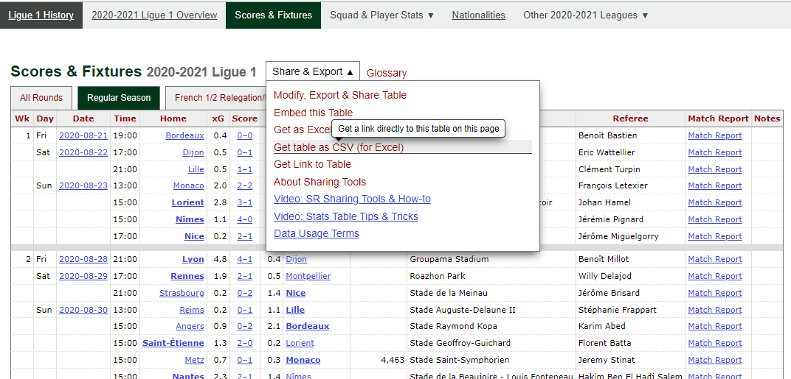

```{r setup, include = FALSE}
source(paste0(getwd(), "/../source/style.R"))
library(DT)
library(shiny)
stargazer <- stargazer::stargazer
theme_minimal <- theme_Rcourse
options(htmltools.dir.version = F)
knitr::opts_chunk$set(echo = T, message = F, warning = F, fig.align = "center", dpi = 300, out.width = "100%")
set.seed(1)
```

<style> .left-column {width: 65%;} .right-column {width: 35%;} </style>


<center><h3> Welcome to the second semester of this course!</h3></center>

--

<p style = "margin-bottom:-.5cm;"></P>

.pull-left[

<ul>
  <li>Dedicated to an empirical <b>research project</b>:</li>
  <ul>
    <li><b>By pairs</b>, apply programming & econometric tools from S1 to your own research question</li>
    <li>Find an example of what is expected <a href="https://louissirugue.github.io/data-analysis-course/project/example.html">here</a></li>
  </ul>
</ul>

<p style = "margin-bottom:.8cm;"></P>

<ul>
  <li>The <b>first part</b> will be <b>formal lectures</b>:</li>
  <ul>
    <li>Today: The steps of the research process</li>
    <li>The next two lectures: Refreshers from S1</li>
  </ul>
</ul>

```{r, echo = F}
s2 <- data.frame(a = c(paste("Lecture", 1:7), "Lecture 8-9", paste("Lecture", 10:15)),
                 b = c("How to conduct a research project",
                       "Refresher: R Programming",
                       "Refresher: Econometrics",
                       "Presentation of your project",
                       "Follow-up: Data cleaning",
                       "Follow-up: Descriptive statistics",
                       "Follow-up: Visualizing the data",
                       "Follow-up: Regression analysis",
                       "Follow-up: Causality assessment",
                       "Follow-up: Robustness",
                       "Follow-up: Heterogeneity",
                       "Follow-up: Tidy your html report",
                       "Follow-up: Last tips", 
                       "Final presentation"))

kable(s2 %>% filter(row_number() < 4), col.names = NULL, caption = "<b>Part 1: Guidelines and refreshers</b>")  %>%
  kable_styling(bootstrap_options = c("hover", "condensed"))
```

<p style = "margin-bottom:.8cm;"></P>

<ul>
  <li>The <b>second part</b> will be <b>follow-ups</b>:</li>
  <ul>
    <li>Meetings to help you at each step</li>
    <li>Graded presentations (see last slides)</li>
  </ul>
</ul>

]

--

.pull-right[
<p style = "margin-bottom:1.15cm;"></P>
```{r, echo = F}
kable(s2 %>% filter(row_number() > 3), col.names = NULL, caption = "<b>Part 2: Research project</b>")  %>%
  kable_styling(bootstrap_options = c("hover", "condensed"))
```
]

---

### Today: How to conduct a research project

<p style = "margin-bottom:1.25cm;">

#### 1. Preliminary steps
<p style = "margin-bottom:-.5cm;">
 * 1.1. Research question
 * 1.2. Finding data
 * 1.3. Literature review

#### 2. Data description
<p style = "margin-bottom:-.5cm;">
 * 2.1. Data cleaning
 * 2.2. Descriptive statistics
 * 2.3. Data visualization

#### 3. Analysis
<p style = "margin-bottom:-.5cm;">
 * 3.1. Regression analysis
 * 3.2. Robustness
 * 3.2. Heterogeneity
 
#### 4. Wrap up!

---

### Today: How to conduct a research project

<p style = "margin-bottom:1.25cm;">

#### 1. Preliminary steps
<p style = "margin-bottom:-.5cm;">
 * 1.1. Research question
 * 1.2. Finding data
 * 1.3. Literature review

---

### 1. Preliminary steps

#### 1.1. Research question

<ul>
  <li>The starting point of the research project is the <b>research question</b></li>
  <ul>
    <li>It is not easy to find a suitable research question, and not all questions are relevant</li>
    <li>Here are some guidelines to help you in the process</li>
  </ul>
</ul>

--

<p style = "margin-bottom:1cm;"></p>

<ul>
  <li>The question should lead to <b>explain rather than describe</b> a phenomenon</li>
  <ul>
    <li style="color:#9B0000";>Do football teams win more home than away?</li>
    <li>This basically calls to a descriptive statistic, not any explanation</li>
  </ul>
</ul>

--

<p style = "margin-bottom:1cm;"></p>

<ul>
  <li>The question should be <b>specific enough</b></li>
  <ul>
    <li style="color:#9B0000";>What are the reasons why football teams win more often home than away?</li>
    <li>You won't be able to cover all the determinants</li>
    <li>Closed-ended questions recommended (Yes/No, to what extent, ...)</li>
  </ul>
</ul>

--

<p style = "margin-bottom:1cm;"></p>

<ul>
  <li>It should be relatively <b>original</b> and <b>interesting to you!</b></li>
  <ul>
    <li>You're gonna spend the whole semester on that</li>
  </ul>
</ul>

---

### 1. Preliminary steps

#### 1.1. Research question

 * Here is an example of valid research question:
 
<center><i><b><p style="color:#1E5128";>Do supporters help the home team win the match?</p></b></i></center>

--

<p style = "margin-bottom:1cm;"></p>

 * This is the research question we will take as an example to see all the steps of the research process

--

<p style = "margin-bottom:.75cm;"></p>

<ul>
  <li>It is:</li>
  <ul>
    <li>More about explanation than description</li>
    <li>Specific enough, not too broad</li>
    <li>Relatively original</li>
    <li>Relatively interesting with respect to the sports literature</li>
  </ul>
</ul>

--

<p style = "margin-bottom:.75cm;"></p>

<ul>
  <li>And importantly there is <b>data available</b> to answer this question</li>
  <ul>
    <li>There's no point having a good research question if you can't find data to answer it</li>
    <li>Usually finding data comes after the idea of research question</li>
    <li>But given the time constraint you should look for data while thinking about your research question</li>
  </ul>
</ul>

---

### 1. Preliminary steps

#### 1.2. Finding data

 * Open access online data is increasingly common
 
<ul>
  <li>Academic journals start asking authors to share their data</li>
  <ul>
    <li>Academic papers is a great source of data</li>
    <li>Especially RCTs as they usually include many variables</li>
  </ul>
</ul>

--

<p style = "margin-bottom:1cm;"></p>

<ul>
  <li>At these two links you'll find an incredibly rich set of academic datasets</li>
  <ul>
    <li><a href="https://www.openicpsr.org/openicpsr/search/studies">openICPSR</a></li>
    <li><a href="https://dataverse.harvard.edu/dataverse/harvard?q=&fq0=subject_ss%3A%22Social%20Sciences%22&types=dataverses%3Adatasets&sort=dateSort&order=desc">Harvard Dataverse</a></li>
    <li>Browse the available datasets and check the corresponding academic articles, this may give you inspiration</li>
  </ul>
</ul>

--

<p style = "margin-bottom:1cm;"></p>

<ul>
  <li>The <a href="https://www.aeaweb.org/resources/data">American Economic Association</a> also gathered a lot of data sources</li>
  <ul>
    <li>Mostly from national statistical institutes</li>
    <li>Here you may not find so much individual level data but rather local data</li>
    <li>If relevant it is also possible to combine different data sources</li>
  </ul>
</ul>

---

### 1. Preliminary steps

#### 1.2. Finding data

 * Sometimes a simple Google search can be sufficient:
 
<center></center>

---

### 1. Preliminary steps

#### 1.2. Finding data

 * At [fbref.com](https://fbref.com/) data on scores and attendance of football matches are available:

<center></center>

---

### 1. Preliminary steps

#### 1.2. Finding data

<ul>
  <li>This data is appropriate for the exercise for two reasons</li>
</ul>

--

<p style = "margin-bottom:1cm;"></p>

<ul>
  <li>It contains the <b>necessary variables</b> to study the research question</li>
  <ul>
    <li>For each match the score and who played home and away</li>
    <li>The number of people in the stadium</li>
  </ul>
</ul>

--

<p style = "margin-bottom:1cm;"></p>

<ul>
  <li>And <b>additional variables</b> to use for robustness and heterogeneity analysis</li>
  <ul>
    <li>The time in the day and day in the week of the match</li>
    <li>The league/season (data available for several leagues/seasons)</li>
    <li>(We'll come back to that point in a few slides)</li>
  </ul>
</ul>

--

<p style = "margin-bottom:1cm;"></p>

<ul>
  <li>So we now have a valid research question and appropriate data to work with</li>
  <ul>
    <li>But there is one last preliminary step</li>
  </ul>
</ul>

---

### 1. Preliminary steps

#### 1.3. Literature review

<ul>
  <li>A good research project should be relevant with respect to the academic literature on the issue</li>
</ul>

--

<p style = "margin-bottom:1cm;"></p>

<ul>
  <li>You should find academic articles to get a sense of where your analysis will stand in the literature</li>
  <ul>
    <li>What do we <b>already know</b> on the topic?</li>
    <li>What <b>remains to be known</b>?</li>
    <li>What is your <b>contribution</b> to the literature?</li>
  </ul>
</ul>

--

<p style = "margin-bottom:1cm;"></p>

<ul>
  <li>You should refer to articles that are published in (peer reviewed) academic journals</li>
  <ul>
    <li>You can find such articles on <a href="https://scholar.google.com/">Google scholar</a></li>
    <li>And via <a href="https://catalogue.explore.psl.eu/">PSL explore</a></li>
  </ul>
</ul>

--

<p style = "margin-bottom:1cm;"></p>

<ul>
  <li>The articles you should start by looking for are:</li>
  <ul>
    <li><b>Reviews/meta analyses</b> that will have a lot of references that may be relevant</li>
    <li>Articles that are <b>as close as possible</b> to what you intend to do</li>
  </ul>
</ul>

---

### 1. Preliminary steps

#### 1.3. Literature review

<p style = "margin-bottom:1.5cm;"></p>

<center></center>

---

### 1. Preliminary steps

#### 1.3. Literature review

<center></center>

---

### 1. Preliminary steps

#### 1.3. Literature review

<ul>
  <li>Almost every academic article includes some review of the literature</li>
  <ul>
    <li>You can go through it to find some inspiration and references</li>
  </ul>
</ul>

<p style = "margin-bottom:1.25cm;"></p>

<center></center>

---

### 1. Preliminary steps

#### 1.3. Literature review

<ul>
  <li>In an academic paper, every article mentioned in the text can be found in the <i>References</i> section at the end</li>
</ul>

<p style = "margin-bottom:.75cm;"></p>

<center></center>

--

<p style = "margin-bottom:.5cm;"></p>

<center><i><b>&#10140; Citing articles this way is also something you will have to do</b></i></center>

---

### 1. Preliminary steps

#### 1.3. Literature review

 * The way you should refer to academic articles in the text is codified:

<p style = "margin-bottom:1cm;"></p>

```{r, echo = F}
kable(tibble(` ` = c("Within the sentence", "Outside the sentence"),
             `One author` = c("Smith (2012) showed that ...", "It has been shown that ... (Smith, 2012)"),
             `Two authors` = c("Smith and Watson (2012) showed that ...", "It has been shown that ... (Smith and Watson, 2012)"),
             `More authors` = c("Smith et al. (2012) showed that ...", "It has been shown that ... (Smith et al., 2012)")),
      caption = "Referring to an academic article in-text", align = 'lccc')
```

<p style = "margin-bottom:1.25cm;"></p>

 * Conventionally (in Economics) authors are listed by alphabetical order of surname

<ul>
  <li>The reference of every article you cite should be added by alphabetical order in a Reference section at the end</li>
  <ul>
    <li>How to write the reference in this last section is also codified</li>
    <li>Take a look at the research project example available <a href="https://louissirugue.github.io/data-analysis-course/project/example.html">here</a> to see what it should look like</li>
  </ul>
</ul>
 
---

### 1. Preliminary steps

#### 1.3. Literature review

 * To find the proper reference of an article, click on the Cite button and copy-paste it in your *References* section

--

.pull-left[
<center><b>On Google scholar</b></center>
<p style = "margin-bottom:.5cm;"></p>
<center></center>
<center></center>
]

--

.pull-right[
<center><b>On PSL explore</b></center>
<p style = "margin-bottom:.5cm;"></p>
<center></center>
<center></center>
]

---

### Overview

<p style = "margin-bottom:1.25cm;">

#### 1. Preliminary steps &#10004;
<p style = "margin-bottom:-.5cm;">
 * 1.1. Research question
 * 1.2. Finding data
 * 1.3. Literature review

#### 2. Data description
<p style = "margin-bottom:-.5cm;">
 * 2.1. Data cleaning
 * 2.2. Descriptive statistics
 * 2.3. Data visualization

#### 3. Analysis
<p style = "margin-bottom:-.5cm;">
 * 3.1. Regression analysis
 * 3.2. Robustness
 * 3.2. Heterogeneity
 
#### 4. Wrap up!
 
---

### Overview

<p style = "margin-bottom:1.25cm;">

#### 1. Preliminary steps &#10004;
<p style = "margin-bottom:-.5cm;">
 * 1.1. Research question
 * 1.2. Finding data
 * 1.3. Literature review

#### 2. Data description
<p style = "margin-bottom:-.5cm;">
 * 2.1. Data cleaning
 * 2.2. Descriptive statistics
 * 2.3. Data visualization
 
---

### 2. Data description

#### 2.1. Data cleaning

<ul>
  <li>The first thing to do with the data is to clean it</li>
  <ul>
    <li>You should open the data and take a close look at it to understand what's inside</li>
  </ul>
</ul>

--

```{r}
library(tidyverse)
data_match <- read.csv("data/data_match.csv")
dim(data_match)
```

<ul>
  <li>The data contains 4845 rows and 16 variables</li>
  <ul>
    <li>Let's see what these variables are</li>
  </ul>
</ul>

--

```{r}
names(data_match)
```
 
---

### 2. Data description

#### 2.1. Data cleaning

<ul>
  <li>The dataset contains the following 16 variables:</li>
  <ul>
    <li><b>Wk:</b> Season week when the match took place</li>
    <li><b>Day:</b> Week day when the match took place</li>
    <li><b>Date:</b> Date of the match</li>
    <li><b>Time:</b> Time of the match</li>
    <li><b>Home:</b> Team that played home</li>
    <li><b>xG:</b> Expected number of goals for home team</li>
    <li><b>Score:</b> Score of the match</li>
    <li><b>xG.1:</b> Expected number of goals for away team</li>
    <li><b>Away:</b> Team that played away</li>
    <li><b>Attendance:</b> Number of supporters in the stadium</li>
    <li><b>Venue:</b> Name of the stadium where the match took place</li>
    <li><b>Referee:</b> Name of the referee</li>
    <li><b>Match.Report:</b> Link to an online report of the match</li>
    <li><b>Notes:</b> Miscellaneous information on the match</li>
    <li><b>League:</b> Name of the league</li>
    <li><b>Season:</b> Season from 2018-2019 to 2020-2021</li>
  </ul>
</ul>

---

### 2. Data description

#### 2.1. Data cleaning

 * We can keep only the relevant variables and look at the first rows of the data

--

```{r, eval = F}
data_match <- data_match %>%
  select(Day, Date, Time, Home, Score, Away, Attendance, League, Season)

kable(head(data_match, n = 5), caption = "Outlook of the data:")
```

--

```{r, echo = F}
data_match <- data_match %>%
  select(Day, Date, Time, Home, Score, Away, Attendance, League, Season)

kable(head(data_match, n = 5), caption = "Outlook of the data:")
```

---

### 2. Data description

#### 2.1. Data cleaning

<ul>
  <li>Data cleaning involves:</li>
  <ul>
    <li><b>Recoding variables</b> in a practical way (it may imply <b>creating new variables</b>)</li>
    <li><b>Removing observations</b> that are not relevant, if any, typically <b>missing values</b></li>
    <li>Potentially <b>joining</b> data, and <b>pivoting</b> variables from wide to long or conversely</li>
  </ul>
</ul>

--

<p style = "margin-bottom:1cm;"></p>

```{r, echo = F}
kable(head(data_match, n = 1), caption = "")
```

<p style = "margin-bottom:1cm;"></p>

<ul>
  <li>Here at least two variables should be recoded:</li>
  <ul>
    <li>The score variable should be divided into two variables, for home and away</li>
    <li>A variable indicating who won should be created</li>
    <li>If we consider Time as continuous, it should be numeric and in hours</li>
  </ul>
</ul>

--

<p style = "margin-bottom:1cm;"></p>

 * Some datasets are cleaner than others, but there's always some data cleaning to do

---

### 2. Data description

#### 2.1. Data cleaning

 * Recoding variables

```{r}
data_match <- data_match %>%
  
         # Assign the first and third characters of the string Score to Goals_home and Goals_away
  mutate(Goals_home = as.numeric(substr(Score, 1, 1)),
         Goals_away = as.numeric(substr(Score, 3, 3)),
         
         # Generate a variable for the outcome of the match depending on who scored the most
         Winner = case_when(Goals_home > Goals_away ~ "Home",
                            Goals_home == Goals_away ~ "Draw",
                            Goals_home < Goals_away ~ "Away"),
         
         # Recode the Time variable as a continuous variable
         Time = as.numeric(substr(Time, 1, 2)) + as.numeric(substr(Time, 4, 5)) / 60)
```

--

<p style = "margin-bottom:1cm;"></p>

<ul>
  <li>Let's take a look at the cleaned data</li>
  <ul>
    <li>(Pay attention to rows 11, 22, ...)</li>
  </ul>
</ul>

---

### 2. Data description

#### 2.1. Data cleaning

```{r, echo = F}
datatable(data_match, width = '100%', options = list(scrollX = TRUE, pageLength = 4))
```

---

### 2. Data description

#### 2.1. Data cleaning

<ul>
  <li>Between each week of competition there is a empty line with missing values</li>
  <ul>
    <li>These rows are not actual observations so we should delete them</li>
  </ul>
</ul>

```{r}
data_match <- data_match %>% filter(Score != "")
```

--

<p style = "margin-bottom:1cm;"></p>

 * But we still need to check for actual missing values
 
```{r}
data_match %>% summarise_all(~sum(is.na(.)))
```

--

<p style = "margin-bottom:1cm;"></p>

<ul>
  <li>There is no missing value except for the Attendance variable that has many NAs</li>
  <ul>
    <li>This is suspicious, we should investigate more</li>
  </ul>
</ul>

---

### 2. Data description

#### 2.1. Data cleaning

```{r}
summary(data_match$Attendance)
```

--

<p style = "margin-bottom:1.5cm;"></p>

<ul>
  <li>Except for NAs, the distribution seems fine</li>
  <ul>
    <li>But the number of spectators per match starts at 13 while the COVID-19 pandemic prevented many matches from having any attendance</li>
    <li>These NAs for attendance may actually mean 0 attendance</li>
    <li> This is particularly plausible given that there is no other variable with missing values in the data</li>
  </ul>
</ul>

--

<p style = "margin-bottom:1.5cm;"></p>

<center><i>&#10140; To check this hypothesis we can plot the evolution of the monthly attendance, <b>replacing NAs by 0s</b></i></center>
<center><i>(code in the <a href="https://louissirugue.github.io/data-analysis-course/project/example.html">research project example</a>)</i></center>

---

### 2. Data description

#### 2.1. Data cleaning

.left-column[
```{r, echo = F, fig.width = 8, fig.height = 5, out.width = '100%'}
attendance_data <- data_match %>%
         # Replace missing values of Attendance by 0
  mutate(Attendance = ifelse(is.na(Attendance), 0, Attendance),
         # Keep only the YYYY-MM part of the Date variable (YYYY-MM-DD)
         Month = substr(Date, 1, 7)) %>%
  # Do computations separately for each month and each league
  group_by(Month, League) %>%
  # Compute the average number of supporters in the stadium
  summarize(Attendance = mean(Attendance)) %>%
  # Sort the data by ascending order of month and group by month
  ungroup() %>% arrange(Month) %>%  group_by(Month) %>%
  # Attribute a number from 1 to N to each month whatever the league
  mutate(Month_id = cur_group_id())

ggplot(attendance_data, 
       # Assign month/attendance to the x-/y-axis and one color per league
       aes(x = Month_id, y = Attendance, color = League), alpha = .75) +
  # Draw a line and a point geometry and rename legend
  geom_line(size = 1.2) + geom_point(size = 1.5) + labs(color = "League:") +
  # Label the x axis with months in character format
  scale_x_continuous(name = "Month", breaks = unique(attendance_data$Month_id), 
                     labels = unique(attendance_data$Month)) + 
  # Rotate the month labels by 90 degrees
  theme(axis.text.x = element_text(angle = 90, vjust = 0.5, hjust = 1))
```
]

--

.right-column[

<p style = "margin-bottom:1cm;"></p>

<ul>
  <li>This graph confirms the hypothesis</li>
  <ul>
    <li>There is a drop to 0 attendance (the NAs) due to the pandemic right after March 2020</li>
    <li>Missing values for the Attendance variable should indeed be recoded as 0</li>
  </ul>
</ul>

<p style = "margin-bottom:1.5cm;"></p>

```{r}
data_match <- data_match %>% 
  mutate(Attendance = 
    ifelse(is.na(Attendance), 0, 
           Attendance))
```
]

---

### 2. Data description

#### 2.2. Descriptive statistics

<ul>
  <li>Now that the data is clean, we should describe it with <b>relevant statistics</b></li>
  <ul>
    <li>For <b>categorical variables</b>: Number of observations per category</li>
    <li>For <b>continuous variables</b>: Summarizing the distribution</li>
  </ul>
</ul>

--

```{r}
data_match %>%
  group_by(Winner) %>%
  summarise(N = n(), Pct = 100 * (n() / nrow(.))) %>%
  kable(., "Distribution of match outcomes")
```

---

### 2. Data description

#### 2.2. Descriptive statistics

<ul>
  <li>The number of observations per season/league is also interesting to know:</li>
  <ul>
    <li><i>(code in the <a href="https://louissirugue.github.io/data-analysis-course/project/example.html">research project example</a>)</i>
  </ul>
</ul>

--

<p style = "margin-bottom:1cm;"></p>

```{r, echo = F}
nb_obs <- data_match %>%
  # Do computations separately for each season and each league
  group_by(League, Season) %>%
  # Compute the number of match per season/league
  summarise(n_match = n()) %>% 
  # Put these values in separate columns for each season
  pivot_wider(names_from = "Season", values_from = "n_match") %>%
  # Compute the total number of match per league
  mutate(Total = `2018-2019` + `2019-2020` + `2020-2021`) %>%
  rename(` ` = League)

nb_obs %>%
  # Add one Total row which is the sum of all the above
  bind_rows(nb_obs %>% mutate(` ` = "Total") %>% group_by(` `) %>% summarise_all(~sum(.))) %>%
  # Display in an htlm table
  kable(.,  caption = "Number of matches:") %>%
  # Set characters in the column Total in bold
  column_spec(5, bold = T) %>%
  # Set characters in the row Total in bold
  row_spec(5, bold = T) 
```

--

<p style = "margin-bottom:1cm;"></p>

<ul>
  <li>The distribution of the main continuous variables can also be summarized by season/league</li>
  <ul>
    <li><i>(code in the <a href="https://louissirugue.github.io/data-analysis-course/project/example.html">research project example</a>)</i>
  </ul>
</ul>

---

```{r, echo = F}
descriptive_data <- data_match %>%
  # Put the variables of interest in long format
  pivot_longer(c(Attendance, Goals_home, Goals_away), 
               names_to = "Variable", values_to = "Value") %>%
  # Group the data by variable of interest, season and league
  group_by(Variable, Season, League) %>%
  # Compute the descriptive statistics
  summarise(Min = min(Value), 
            Q1 = quantile(Value, 1/4),
            Median = median(Value), 
            Mean = mean(Value), 
            Q3 = quantile(Value, 3/4),
            Max = max(Value)) %>%
  # Ungroup the data
  ungroup()
```

```{r, echo = F}
descriptive_data %>% 
  # Keep only the observations of the 2018-2019 season
  filter(Season == "2018-2019") %>% 
  # Keep only the variables to display
  select(-c(Variable, Season)) %>%
  rename(` ` = League) %>%
  # Add a caption to the table
  kable(., caption = paste("Season", "2018-2019")) %>%
  # Display the name of the variable for the corresponding row
  pack_rows("Attendance", 1, 4) %>%
  pack_rows("Goals away", 5, 8) %>%
  pack_rows("Goals home", 9, 12)
```

---

```{r, echo = F}
descriptive_data %>% 
  # Keep only the observations of the 2019-2020 season
  filter(Season == "2019-2020") %>% 
  # Keep only the variables to display
  select(-c(Variable, Season)) %>%
  rename(` ` = League) %>%
  # Add a caption to the table
  kable(., caption = paste("Season", "2019-2020")) %>%
  # Display the name of the variable for the corresponding row
  pack_rows("Attendance", 1, 4) %>%
  pack_rows("Goals away", 5, 8) %>%
  pack_rows("Goals home", 9, 12)
```

---

```{r, echo = F}
descriptive_data %>% 
  # Keep only the observations of the 2020-2021 season
  filter(Season == "2020-2021") %>% 
  # Keep only the variables to display
  select(-c(Variable, Season)) %>%
  rename(` ` = League) %>%
  # Add a caption to the table
  kable(., caption = paste("Season", "2020-2021")) %>%
  # Display the name of the variable for the corresponding row
  pack_rows("Attendance", 1, 4) %>%
  pack_rows("Goals away", 5, 8) %>%
  pack_rows("Goals home", 9, 12)
```

---

### 2. Data description

#### 2.3. Data visualization

<ul>
  <li>The last step before the analysis is to <b>visualize the data</b></li>
  <ul>
    <li>The idea is also to describe the data, but <b>with relevant graphs</b></li>
  </ul>
</ul>

--

<b>&#10140; Attendance:</b>

```{r, eval = F}
ggplot(data_match, aes(x = Season, y = Attendance, fill = Season)) +
  geom_boxplot(show.legend = F, alpha = .75) + coord_flip()
```

--

```{r, echo = F, fig.width = 8, fig.height = 2.75, out.width = '70%'}
ggplot(data_match, aes(x = Season, y = Attendance, fill = Season)) +
  geom_boxplot(show.legend = F, alpha = .75) + coord_flip()
```

---

### 2. Data description

#### 2.3. Data visualization

<b>&#10140; Goals home vs. away:</b>

```{r, eval = F}
data_match %>%
  pivot_longer(c(Goals_home, Goals_away), names_to = "Variable", values_to = "Value") %>%
  ggplot(., aes(x = Season, y = Value, fill = Variable)) + geom_boxplot(alpha = .75) 
```

--

```{r, echo = F, fig.width = 8, fig.height = 3.25, out.width = '70%'}
data_match %>%
  pivot_longer(c(Goals_home, Goals_away), names_to = "Variable", values_to = "Value") %>%
  ggplot(., aes(x = Season, y = Value, fill = Variable)) + geom_boxplot(alpha = .75) 
```

---

### 2. Data description

#### 2.3. Data visualization

<b>&#10140; Winner:</b>

```{r, eval = F}
ggplot(data_match, aes(x = Season, fill = Winner)) + ylab("Number of matches") +
  geom_bar(stat = "count", position = position_dodge(width = .8), width = .7, alpha = .85)   
```

--

```{r, echo = F, fig.width = 8, fig.height = 3.5, out.width = '70%'}
ggplot(data_match, aes(x = Season, fill = Winner)) + ylab("Number of matches") +
  geom_bar(stat = "count", position = position_dodge(width = .8), width = .7, alpha = .85)  
```

---

### Overview

<p style = "margin-bottom:1.25cm;">

#### 1. Preliminary steps &#10004;
<p style = "margin-bottom:-.5cm;">
 * 1.1. Research question
 * 1.2. Finding data
 * 1.3. Literature review

#### 2. Data description &#10004;
<p style = "margin-bottom:-.5cm;">
 * 2.1. Data cleaning
 * 2.2. Descriptive statistics
 * 2.3. Data visualization

#### 3. Analysis
<p style = "margin-bottom:-.5cm;">
 * 3.1. Regression analysis
 * 3.2. Robustness
 * 3.2. Heterogeneity
 
#### 4. Wrap up!
 
---

### Overview

<p style = "margin-bottom:1.25cm;">

#### 1. Preliminary steps &#10004;
<p style = "margin-bottom:-.5cm;">
 * 1.1. Research question
 * 1.2. Finding data
 * 1.3. Literature review

#### 2. Data description &#10004;
<p style = "margin-bottom:-.5cm;">
 * 2.1. Data cleaning
 * 2.2. Descriptive statistics
 * 2.3. Data visualization

#### 3. Analysis
<p style = "margin-bottom:-.5cm;">
 * 3.1. Regression analysis
 * 3.2. Robustness
 * 3.2. Heterogeneity
 
---

### 3. Analysis

#### 3.1. Regression analysis

 * The first step of the regression analysis is to write down properly the <b>equation</b> you want to estimate:

--

<p style = "margin-bottom:1.25cm;"></p>

$$1\{Winner_m=\text{Home}\}=\alpha+\beta \times1\{Public_m=\text{Yes}\}+\varepsilon_m$$

<p style = "margin-bottom:1.25cm;"></p>

<ul>
  <li>Where for a given match \(m\):</li>
  <ul>
    <li>\(1\{Winner_m=\text{Home}\}\) takes the value \(1\) if the winning team is that playing home and \(0\) otherwise</li>
    <li>\(1\{Public_m=\text{Yes}\}\) takes the value \(1\) if there is public in the stadium and and \(0\) otherwise</li>
  </ul>
</ul>

--

<p style = "margin-bottom:1.5cm;"></p>

 * The two variables of interest should be coded properly for the regression:

```{r}
data_match <- data_match %>% 
  mutate(Winner_home = ifelse(Winner == "Home", 1, 0),
         Public = ifelse(Attendance > 0, "Public", "No public")) 
```

---

### 3. Analysis

#### 3.1. Regression analysis

.pull-left[

 * Then the regression should be properly reported:
 
```{r, eval = F}
stargazer(lm(Winner_home~Public, data_match),
          dep.var.labels = c("Home win"), 
          keep.stat = c("n", "adj.rsq"), 
          type = "text")
```


<ul>
  <li>And the coefficient of interest properly interpreted:</li>
</ul> 

<center><b><i>The presence of supporters in the audience increases by 5.9 percentage points on expectation the probability for the home team to win the match relative to loose or draw, everything else equal. The coefficient is statistically significantly different from 0 at the 1% significance level.</i></b></center>

]

.pull-right[
```{r, echo = F}
stargazer(lm(Winner_home ~ Public, data_match), 
          dep.var.labels = c("Home win"), 
          type = "text", keep.stat = c("n", "adj.rsq"))
```
]
 
---

### 3. Analysis

#### 3.1. Regression analysis

<ul>
  <li>It is also a good practice to provide a visual representation of the relationship you estimate</li>
  <ul>
    <li>In this case it is not simple because both variables are binary</li>
    <li>But geom_jitter() allows to add noise in the location of each data point around the 4 possible coordinates</li>
    <li><i>(code in the <a href="https://louissirugue.github.io/data-analysis-course/project/example.html">research project example</a>)</i>
  </ul>
</ul>

--

.pull-left[
```{r, echo = F, fig.width = 6, fig.height = 3.75, out.width = '100%'}
# Assign the dependent and the independent variables to x and y axes
ggplot(data_match, aes(x = Public, y = Winner_home)) +
  # Plot the data points with some noise to avoid overplotting
  geom_jitter(width = .25, height = .25, alpha = .5, color = "#6794A7") +
  # Plot the regression line centered with respect to the data points
  geom_smooth(data = data_match %>% 
                mutate(Public = ifelse(Public == "Public", 1, 0) + 1), 
              aes(x = Public, y = Winner_home), 
              method = "lm", se = F, color = "#014D64") +
  # Custom axes
  scale_x_discrete(name = "1{Public[m] = Yes}", labels = 0:1) +
  ylab("Home win probability") 
```
]

--

.pull-right[
```{r, echo = F, fig.width = 6, fig.height = 3.75, out.width = '100%'}
data_match %>%
  group_by(Public) %>%
  summarize(`Home win probability` = mean(Winner_home)) %>%
  ungroup() %>%
  ggplot(., aes(x = Public, y = `Home win probability`)) +
  geom_bar(stat = "identity", fill = "#6794A7", alpha = .5, color = "#014D64") +
  geom_line(data = data_match %>%
              mutate(Public = 1+ ifelse(Public == "Public", 1, 0)) %>%
              group_by(Public) %>%
              summarize(`Home win probability` = mean(Winner_home)),  
            aes(x = Public, y = `Home win probability`), color = "#014D64", size = 1.5) + 
  scale_x_discrete(name = "1{Public[m] = Yes}", labels = 0:1) +
    scale_y_continuous(limits = c(0, .7))
```

]
 
---

### 3. Analysis

#### 3.1. Regression analysis

<ul>
  <li>It is also crucial to discuss whether or not the effect is <b>causal</b></li>
  <ul>
    <li>Self-selection issue?</li>
    <li>Omitted variable bias?</li>
    <li>Under which assumptions the effect would be causal?</li>
  </ul>
</ul>

--

<ul>
  <li><b>Self-selection</b> issue</li>
  <ul>
    <li>Teams that play home or away cannot self-select into whether there is public or not</li>
    <li>Variations in x are fully driven by decision teams have no control over</li>
  </ul>
</ul>

--

<ul>
  <li><b>Omitted variable</b> bias</li>
  <ul>
    <li>There may be other variables correlated with both x and y that drive this relationship</li>
    <li>When no public (i.e., pandemic), the trip to the stadium may be less tiring because there is less congestion on the roads due to remote working, or for any other reason</li>
  </ul>
</ul>

--

<p style = "margin-bottom:1.25cm;"></p>

<center><i><b>Thus, this result can be considered as causal only if there was no change concomitant to the attendance restrictions that could have a differentiated impact on the teams that play home and away</b></i></center>

---

### 3. Analysis

#### 3.2. Robustness

<ul>
  <li>Assessing the robustness of the result consists in progressively <b>adding control variables</b> in the regression</li>
  <ul>
    <li>If the result is robust this should <b>not affect too much the magnitude</b> of the coefficient</li>
    <li>If the result is robust the coefficient should <b>remain statistically significant</b></li>
  </ul>
</ul>

<p style = "margin-bottom:1.25cm;"></p>

--

<ul>
  <li>We can control for the day and time of the match</li>
  <ul>
    <li>These factors could be linked to the mechanism related to transport</li>
    <li>Even though it cannot rule out this mechanism, it can suggest whether or not time and day is a channel</li>
    <li>We can also control for the league in case the effect is driven by differences across leagues</li>
  </ul>
</ul>

<p style = "margin-bottom:1.25cm;"></p>

--

```{r, eval = F}
stargazer(lm(Winner_home ~ Public, data_match), 
          lm(Winner_home ~ Public + League, data_match), 
          lm(Winner_home ~ Public + League + Time, data_match), 
          lm(Winner_home ~ Public + League + Time + Day, data_match), 
          dep.var.labels = c("Home win"), type = "text", keep.stat = c("n", "adj.rsq"))
```

---

.left-column[
```{r, echo = F}
data_match <- data_match %>% mutate(League = relevel(as.factor(League), "Ligue 1"))

stargazer(lm(Winner_home ~ Public, data_match), 
          lm(Winner_home ~ Public + League, data_match), 
          lm(Winner_home ~ Public + League + Time, data_match), 
          lm(Winner_home ~ Public + League + Time + Day, data_match), 
          dep.var.labels = c("Home win"), type = "text", keep.stat = c("n", "adj.rsq"), model.numbers = FALSE)
```
]

.right-column[
<p style = "margin-bottom:5cm;"></p>
<ul>
  <li>As control variables are included:</li>
  <ul>
    <li>The <b>magnitude</b> of the coefficient does not vary much</li>
    <li>The statistical <b>significance</b> does not change either</li>
  </ul>
</ul>
<p style = "margin-bottom:1.25cm;"></p>
<center><i>&#10140; So the result is robust to controlling for these characteristics</i></center>

]

---

### 3. Analysis

#### 3.2. Robustness

<ul>
  <li>Note that robustness is not necessarily about including controls</li>
  <ul>
    <li>It can be about <b>excluding/including</b> some observations (e.g., outliers)</li>
    <li>About <b>changing the definition</b> of one or several variables, etc.</li>
  </ul>
</ul>

--

<p style = "margin-bottom:1.25cm;"></p>

<ul>
  <li>For instance, the independent variable of the regression could be defined in two ways:</li>
  <ul>
    <li>So far: Probability of winning relative to loosing or draw</li>
    <li>Alternative: Probability of winning relative to loosing only, omitting draws</li>
  </ul>
</ul>

--

<p style = "margin-bottom:1.25cm;"></p>

```{r, eval = F}
data_match <- data_match %>%
  mutate(Winner_home2 = ifelse(Winner != "Draw", Winner_home, NA))

stargazer(lm(Winner_home ~ Public, data_match), 
          lm(Winner_home2 ~ Public, data_match), 
          keep.stat = c("n", "adj.rsq"), model.numbers = FALSE, 
          dep.var.labels = c("Home win vs. Home loss", "Home win vs. Home loss/Draw"))
```

---

### 3. Analysis

#### 3.2. Robustness

.left-column[
```{r, echo = F}
data_match <- data_match %>%
  mutate(Winner_home2 = ifelse(Winner != "Draw", Winner_home, NA))

stargazer(lm(Winner_home ~ Public, data_match), 
          lm(Winner_home2 ~ Public, data_match), type = "text",
          dep.var.labels = c("Home win vs. Home loss", "Home win vs. Home loss/Draw"), 
          keep.stat = c("n", "adj.rsq"), model.numbers = FALSE)
```
]

.right-column[
<p style = "margin-bottom:-1.25cm;"></p>
<ul>
  <li>Coefficients cannot be compared directly because they are mechanically inflated by the omission of the possibility of draw</li>
</ul>
<ul><ul>
    <li>But the ratio of the effect of public in the stadium on the probability to win, relative to the probability to win when there is no public, is very similar in the two cases (\(\approx\)0.15)</li>
</ul></ul>
<ul><ul>
    <li>And both statistically significantly different from 0 at the 99% confidence level</li>
</ul></ul>

<center><i><b>&#10140; Also robust</b></i></center>
]

---

### 3. Analysis

#### 3.3. Heterogeneity

<ul>
  <li>The last step of the analysis is to investigate the potential heterogeneity of the results</li>
  <ul>
    <li><b>Homogenous</b> effect: The coefficient is more or less <b>the same</b> for everybody</li>
    <li><b>Heterogenous</b> effects: The coefficient <b>varies a lot</b> depending on individual (/match) characteristics</li>
    <li>It can be according to sex, education, income, or here league for instance</li>
  </ul>
</ul>

<p style = "margin-bottom:1.25cm;"></p>

--

<ul>
  <li>While <b>robustness</b> consisted in controlling for variables</li>
  <ul>
    <li>Estimating the relationship <b>net of the effect</b> of other (potentially confounding) <b>variables</b></li>
  </ul>
</ul>

<ul>
  <li><b>Heterogeneity</b> consists in interacting x with a third variable</li>
  <ul>
    <li>By how much the relationship between x and y <b>varies depending on</b> the value of a <b>third variable</b></li>
  </ul>
</ul>

<p style = "margin-bottom:1.25cm;"></p>

--

```{r, eval = F}
stargazer(lm(Winner_home ~ Public, data_match), 
          lm(Winner_home ~ Public + League, data_match), 
          lm(Winner_home ~ Public + League + Public * League, data_match), 
          dep.var.labels = c("Home win"), type = "text", keep.stat = c("n", "adj.rsq"))
```

---

.left-column[
```{r, echo = F}
stargazer(lm(Winner_home ~ Public, data_match), 
          lm(Winner_home ~ Public + League, data_match), 
          lm(Winner_home ~ Public + League + Public * League, data_match), 
          dep.var.labels = c("Home win"), type = "text", keep.stat = c("n", "adj.rsq"), model.numbers = FALSE)
```
]

.right-column[
<p style = "margin-bottom:3cm;"></p>
<ul>
  <li style = "margin-left:.5cm;">Point estimates are:</li>
  <ul>
    <li>Ligue 1: 7.5pp</li>
    <li>Bundesliga: 7.5-3.4=4.1pp</li>
    <li>La Liga: 7.5-2.6=4.9pp</li>
    <li>Premier League: 7.5-0.2=7.3pp</li>
  </ul>
</ul>

<p style = "margin-bottom:1.25cm;"></p>

<ul>
  <li style = "margin-left:.5cm;">But none of the coefficients associated with interaction terms are statistically significantly different from 0</li>
  <ul>
    <li>It's sufficiently likely that these variations across groups are just random noise for us not being able to conclude that there is heterogeneity across leagues, at least none we can detect</li>
  </ul>
</ul>
]

---

### Overview

<p style = "margin-bottom:1.25cm;">

#### 1. Preliminary steps &#10004;
<p style = "margin-bottom:-.5cm;">
 * 1.1. Research question
 * 1.2. Finding data
 * 1.3. Literature review

#### 2. Data description &#10004;
<p style = "margin-bottom:-.5cm;">
 * 2.1. Data cleaning
 * 2.2. Descriptive statistics
 * 2.3. Data visualization

#### 3. Analysis &#10004;
<p style = "margin-bottom:-.5cm;">
 * 3.1. Regression analysis
 * 3.2. Robustness
 * 3.2. Heterogeneity
 
#### 4. Wrap up!
 
---

### Wrap up!

#### Preliminary steps

<ul>
  <li>It all starts with a good <b>research question</b>:</li>
  <ul>
    <li>More about <b>explanation</b> than description</li>
    <li><b>Specific</b> enough, not too broad (Yes/No question, to what extent, ...)</li>
    <li>Relatively <b>original and interesting</b> to you!</li>
  </ul>
</ul>

--

<p style = "margin-bottom:.75cm;"></p>

<ul>
  <li>That can be studied with <b>data</b>:</li>
  <ul>
    <li><a href="https://www.openicpsr.org/openicpsr/search/studies">openICPSR</a>, <a href="https://dataverse.harvard.edu/dataverse/harvard?q=&fq0=subject_ss%3A%22Social%20Sciences%22&types=dataverses%3Adatasets&sort=dateSort&order=desc">Harvard Dataverse</a>, <a href="https://www.aeaweb.org/resources/data">American Economic Association</a>, ...</li>
    <li>With the <b>necessary variables</b> to study the research question</li>
    <li>And <b>additional variables</b> to use for robustness and heterogeneity analysis</li>
  </ul>
</ul>

--

<p style = "margin-bottom:.75cm;"></p>

<ul>
  <li>And that is relevant with respect to the academic <b>literature</b> on the issue:</li>
  <ul>
    <li>What do we <b>already know</b> on the topic?</li>
    <li>What <b>remains to be known</b>?</li>
    <li>What is your <b>contribution</b> to the literature?</li>
  </ul>
</ul>

<p style = "margin-bottom:.75cm;"></p>

<center><b>&#10140; That's what you have to do for the next 3 weeks!</b></center>

---

### Wrap up!

#### Preliminary steps

<ul>
  <li>During <b>lecture 4</b> you'll have to do at <b>5 to 10-minute presentation</b> with slides in which you should:</li>
  <ul>
    <li>Present and motivate your <b>research question</b></li>
    <li>Present your <b>data</b> (source, main variables description)</li>
    <li>Present a short review of the <b>related literature</b></li>
  </ul>
</ul>

--

<ul>
  <li>You can come up with <b>your own</b> research question or take one <b>from an existing article</b></li>
  <ul>
    <li>When you have an idea send it by e-mail with the data to be sure it's fine and not taken already</li>
  </ul>
</ul>

--

<ul>
  <li>It will be <b>graded</b>:</li>
  <ul>
    <li>20% of the grade on this presentation</li>
    <li>80% of the grade on the final research project/regularity/final presentation</li>
    <li>The detailed grading scheme is available <a href="https://louissirugue.github.io/data-analysis-course/project/grading.html">here</a></li>
  </ul>
</ul>

--

<p style = "margin-bottom:1cm;"></p>

<center><b><i>Please go through the <a href="https://louissirugue.github.io/data-analysis-course/project/example.html">example</a> to get familiar with what is expected from you</i></b></center>

<p style = "margin-bottom:1cm;"></p>

 * All the following steps of the research process will be subject to weekly 10mn follow-ups by group

---

### Wrap up!

#### Data description

<ul>
  <li>After opening and eyeballing the data, the first thing to do is <b>data cleaning</b></li>
  <ul>
    <li><b>Recoding variables</b> in a practical way (it may imply <b>creating new variables</b>)</li>
    <li><b>Removing observations</b> that are not relevant, if any, typically <b>missing values</b></li>
    <li>Potentially <b>joining</b>, and <b>pivoting</b> variables from wide to long or conversely</li>
  </ul>
</ul>

```{r, eval = F}
mutate() %>% filter() %>% select()
```


--

<ul>
  <li>It should then be summarized with relevant <b>descriptive statistics</b></li>
  <ul>
    <li>For <b>categorical variables:</b> Number of observations per category</li>
    <li>For <b>continuous variables:</b> Summarizing the distribution</li>
  </ul>
</ul>

```{r, eval = F}
summarise(N = n()) // summary(variable)
```

--

<ul>
  <li>And the last step of the data description is <b>data visualization</b> (+/- same thing but with graphs)</li>
</ul>

```{r, eval = F}
ggplot(., aes()) +
```

---

### Wrap up!

#### Analysis

<ul>
  <li>The analysis should be carried out as follows</li>
  <ul>
    <li><b>Write down the equation</b> to estimate</li>
    <li>Estimate it and <b>interpret properly the coefficient(s)</b> of interest</li>
    <li><b>Represent graphically</b> the estimated relationship</li>
  </ul>
</ul>

<p style = "margin-bottom:1cm;"></p>

$$1\{Winner_m=\text{Home}\}=\alpha+\beta \times1\{Public_m=\text{Yes}\}+\varepsilon_m$$

```{r, eval = F}
stargazer(lm(Winner_home~Public, data_match))
```

--

<p style = "margin-bottom:1.25cm;"></p>

<ul>
  <li>And it should be followed by these three steps</li>
  <ul>
    <li>A discussion on the <b>causality</b> of the estimated effect: OVB, selection, ...</li>
    <li>A <b>robustness</b> assessment: Include control variables, omit groups, ...</li>
    <li>A <b>heterogeneity</b> analysis: Interact with third variable(s)</li>
  </ul>
</ul>

--

<p style = "margin-bottom:.75cm;"></p>

 * At some point, add the introduction (with literature review), conclusion, and references sections

---

### Wrap up!

#### Some important remarks

<ul>
  <li>Your final document should be an html file produced with <b>R Markdown</b></li>
  <ul>
    <li>It should be well formatted (stargazer, kable, LaTeX, inline code, ...)</li>
    <li>It can be written in English or in French</li>
  </ul>
</ul>

--

<p style = "margin-bottom:.75cm;"></p>

<ul>
  <li>It should be <b>reproducible</b></li>
  <ul>
    <li>The R Markdown should knit without error</li>
    <li>Every data modification should be in the code, it should produce the html document from the raw data</li>
  </ul>
</ul>

--

<p style = "margin-bottom:.75cm;"></p>

<ul>
  <li><b>When you send an email</b> related to a coding issue</li>
  <ul>
    <li>Send your .Rmd and the data in attachment, do not copy-paste your code in the mail nor send screenshots</li>
    <li>You should first have viewed your data at each step to see where the problem comes from</li>
    <li>And copy-pasted your error message with keywords on Google to try to understand the problem</li>
  </ul>
</ul>

<p style = "margin-bottom:.75cm;"></p>

--

<ul>
  <li>Beware of <b>technical issues</b></li>
  <ul>
    <li>Knit your .Rmd regularly to check it works</li>
    <li>Save your files regularly and on multiples devices/on your mailbox</li>
  </ul>
</ul>
