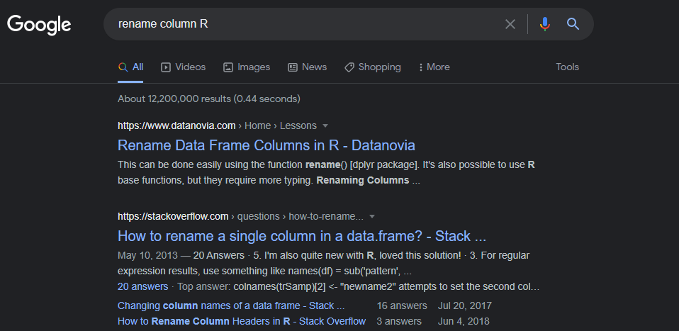

```{css, echo = F, eval = params$dark}
body{background-color:black;filter:invert(1)}
```


```{r setup, include = FALSE}
source(paste0(getwd(), "/../source/style.R"))
stargazer <- stargazer::stargazer
theme_minimal <- theme_Rcourse
options(htmltools.dir.version = F)
knitr::opts_chunk$set(echo = T, message = F, warning = F, fig.align = "center")
```

<h3>Today: Refresher on R Programming and Descriptive Statistics</h3>

--

<p style = "margin-bottom:3cm;"></p>

.pull-left[

<ul style = "margin-left:1.5cm;list-style: none">
  <li><b>1. The basics of R programming</b></li>
  <ul style = "list-style: none">
    <li>1.1. Types of R objects</li>
    <li>1.2. The dplyr grammar</li>
    <li>1.3. Data visualization</li>
  </ul>
</ul>

<p style = "margin-bottom:1cm;"></p>

<ul style = "margin-left:1.5cm;list-style: none">
  <li><b>2. Descriptive statistics</b></li>
  <ul style = "list-style: none">
    <li>2.1. Distributions</li>
    <li>2.2. Central tendency</li>
    <li>2.3. Spread</li>
    <li>2.4. Joint distributions</li>
  </ul>
</ul>

]

.pull-right[

<ul style = "margin-left:-1cm;list-style: none">
  <li><b>3. A few words on using R</b></li>
  <ul style = "list-style: none">
    <li>3.1. When it doesn't work the way you want</li>
    <li>3.2. Where to find help</li>
    <li>3.3. When it doesn't work at all</li>
  </ul>
</ul>

]

---

<h3>Today: Refresher on R Programming and Descriptive Statistics</h3>

<p style = "margin-bottom:3cm;"></p>

.pull-left[

<ul style = "margin-left:1.5cm;list-style: none">
  <li><b>1. The basics of R programming</b></li>
  <ul style = "list-style: none">
    <li>1.1. Types of R objects</li>
    <li>1.2. The dplyr grammar</li>
    <li>1.3. Data visualization</li>
  </ul>
</ul>

]
 
---

### 1. The basics of R programming

#### 1.1. Types of R objects

 * The most <b>basic</b> element in R is just a <b>value</b>, an object of dimension $1\times1$:

--

```{r}
a <- 1
a
```
<p style = "margin-bottom:1cm;">

--

```{r}
b <- "monday"
b
```
<p style = "margin-bottom:1cm;">

--

```{r}
c <- a == b
c
```

---

### 1. The basics of R programming

#### 1.1. Types of R objects

<ul>
  <li>Next, there are <b>vectors</b>, objects of dimension \(n\times1\):</li>
  <ul>
    <li>Vectors can be created with <b>c()</b></li>
    <li>The elements of a vector should be of the <b>same class</b></li>
    <li>Class can be changed with <b>as</b> functions: as.[numeric/character/logical]()</li>
  </ul>
</ul>

--

<p style = "margin-bottom:.75cm;">

.pull-left[
.pull-left[
<center><b>Numeric</b></center>
```{r}
a <- 1:4
a
```
<p style = "margin-bottom:1.5cm;">
```{r}
a * 2
```

]
.pull-right[
<center><b>Character</b></center>
```{r}
b <- c("a", "xyz")
b
```
<p style = "margin-bottom:1.5cm;">
```{r}
paste0("b", b)
```
]
]

--

.pull-left[
.pull-left[
<center><b>Logical</b></center>
```{r}
c <- c(F, 1 < 2)
c
```
<p style = "margin-bottom:1.5cm;">
```{r}
!c
```
]
.pull-right[
<center><b>Factor</b></center>
```{r}
d <- as.factor(a)
d
```
<p style = "margin-bottom:.9cm;">
```{r}
relevel(d, 3)
```
]
]

---

### 1. The basics of R programming

#### 1.1. Types of R objects

 * Some useful functions/operators for vectors

```{r}
vec <- c("a", "b", "c", "d")
```

--
<p style = "margin-bottom:1cm;">
```{r}
length(vec)
```

--
<p style = "margin-bottom:.8cm;">
```{r}
match("b", vec)
```

--
<p style = "margin-bottom:.8cm;">
```{r}
vec[3]
```

---

### 1. The basics of R programming

#### 1.1. Types of R objects

<ul>
  <li>Finally, there are <b>tables</b>, objects of dimension \(n\times m\):</li>
  <ul>
    <li>Gather \(m\) vectors (columns) of \(n\)  observations</li>
    <li>Several possible classes, e.g., <b>tibble()</b> from tidyverse</li>
  </ul>
</ul>

--

```{r}
library(tidyverse)

data <- tibble(name = c("Bob", "Tom", "Kim"),
               age = c(43, 19, 27),
               male = c(T, T, F))
```

--

```{r}
data
```

---

### 1. The basics of R programming

#### 1.1. Types of R objects

<ul>
  <li>Such datasets can be imported on R with <b>read functions</b></li>
  <ul>
    <li>There is one read function per <b>data format</b> (csv, xls, dta, ...)</li>
    <li>The main argument is the <b>path</b>, with slashes: "C:/User/.../data.csv"</li>
  </ul>
</ul>

<p style = "margin-bottom:1cm;">

--

```{r, eval = F}
data <- read.csv("data/cereals.csv") # Import csv data
data <- as_tibble(data)              # Put in tibble format
head(data, 5)                        # Print first 5 rows 
```

--

```{r, echo = F}
data <- read.csv("cereals.csv")
data <- as_tibble(data)
head(data, 5)
```

---

### 1. The basics of R programming

#### 1.2. The dplyr grammar

 * `dplyr` provides **useful functions** to manipulate data and the **pipe operator (%>%)** to chain operations

--

<p style = "margin-bottom:1.25cm;">

```{r, echo = F}
kable(tibble(Function = c("mutate()", 
                          "select()", 
                          "filter()", 
                          "arrange()", 
                          "group_by()", 
                          "summarise()", 
                          "left/right/inner/full_join()"),
       Meaning = c("Modify or create a variable", 
                   "Keep a subset of variables", 
                   "Keep a subset of observations",
                   "Sort the data", 
                   "Group the data", 
                   "Summarizes variables into 1 observation per group",
                   "Merge data")),
      caption = "<b>Important functions of the dplyr grammar</b>")
```

---

### 1. The basics of R programming

#### 1.2. The dplyr grammar

<ul>
  <li>We can first subset the data:</li>
  <ul>
    <li>The type <b>variable</b> only takes the value "C", we can remove it with <b>select()</b></li>
    <li>Some <b>observations</b> have negative values of potassium, we can remove them with <b>filter()</b></li>
    <li>These two operations can be <b>chained</b> using the pipe operator <b>%>%</b>
  </ul>
</ul>

--

<p style = "margin-bottom:1cm;">

```{r}
dim(data) # Dimensions of the data before the operation
```

--

```{r}
data <- data %>% 
  select(-type) %>% 
  filter(potass >= 0)
```

--

```{r}
dim(data) # Dimensions of the data after the operation
```
 
---

### 1. The basics of R programming

#### 1.2. The dplyr grammar

<ul>
  <li>The <b>mutate()</b> function allows to modify and create variables</li>
  <ul>
    <li>Using simple <b>vector operations</b></li>
    <li>With <b>ifelse()</b> to create a binary variable based on a condition</li>
    <li>With <b>case_when()</b> to create a categorical variable</li>
  </ul>
</ul>

--

<p style = "margin-bottom:1cm;"></p>

```{r, eval = F}
data <- data %>% 
  mutate(cal_100g = 100 * (calories / weight),
```

--
<p style = "margin-bottom:-.7cm;"></p>

```{r, eval = F}
         low_cal = ifelse(cal_100g < 100, T, F),
```

--
<p style = "margin-bottom:-.7cm;"></p>
```{r, eval = F}
         mfr = case_when(mfr == "N"           ~ "Nestlé",
                         mfr == "Q"           ~ "Quaker Oats",
                         mfr == "K"           ~ "Kellogg's",
                         mfr %in% c("G", "R") ~ "General Mills",
                         mfr == "P"           ~ "Post Consumer Brands LLC",
                         mfr == "A"           ~ "Maltex Co."))
```

```{r, echo = F}
data <- data %>% 
  mutate(cal_100g = 100 * (calories / weight),
         low_cal = ifelse(cal_100g < 100, T, F),
         mfr = case_when(mfr == "N"           ~ "Nestlé",
                         mfr == "Q"           ~ "Quaker Oats",
                         mfr == "K"           ~ "Kellogg's",
                         mfr %in% c("G", "R") ~ "General Mills",
                         mfr == "P"           ~ "Post Consumer Brands LLC",
                         mfr == "A"           ~ "Maltex Co."))
```

---

### 1. The basics of R programming

#### 1.2. The dplyr grammar

 * Such computations can also be done <b>separately</b> for each value of a variable <b>with group_by()</b>

--

```{r}
data <- data %>% 
  group_by(mfr) %>% 
  mutate(n_brands = n()) %>% 
  ungroup()
``` 

<p style = "margin-bottom:.75cm;"></p>

--

.pull-left[

<ul>
  <li>Using <b>summarise()</b> instead of mutate() allows to:</li>
  <ul>
    <li>Keep only the grouping and summarized variables</li>
    <li>Keep one value per group (no duplicate row)</li>
  </ul>
</ul>


```{r, eval = F}
data %>% 
  group_by(mfr) %>% 
  summarise(n_brands = n())
```
]

--

.pull-right[
```{r, echo = F}
data %>% 
  group_by(mfr) %>% 
  summarise(n_brands = n())
```
]
---

### 1. The basics of R programming

#### 1.2. The dplyr grammar

 * `dplyr` also provides functions to:

--

<ul><ul><li>Rename variables &#10140; <b>rename()</b></li></ul></ul>
 
```{r}
data <- data %>% rename(manufacturer = mfr)
```

--

<ul><ul><li>Sort rows according to the values of one or several variables &#10140; <b>arrange()</b></li></ul></ul>

```{r}
data <- data %>% arrange(cal_100g)
```

--

<ul><ul><li>Joining another dataset with a common variable &#10140; <b>[left/right/full/inner]_join()</b>:</li></ul></ul>

```{r}
data <- data %>% 
  left_join(tibble(manufacturer = c("Kellogg's", "Nestlé", "General Mills", 
                                    "Post Consumer Brands LLC", "Quaker Oats", "Maltex Co."),
                   creation = c(1906, 1966, 1928, 1895, 1877, 1899)),
            by = "manufacturer")
```

---

### 1. The basics of R programming

#### 1.3. Data visualization

 * The tidyverse packages also gives access to the <b>ggplot</b> grammar for data visualization

--

<ul>
  <li>The core arguments of the ggplot() function are the following</li>
  <ul>
    <li><b>Data</b>: the values to plot</li>
    <li><b>Mapping</b> (aes, for aesthetics): the structure of the plot</li>
    <li><b>Geometry</b>: the type of plot</li>
  </ul>
</ul>

--

<ul>
  <li>These arguments should be specified as follows:</li>
  <ul>
    <li>Data and mapping should be specified within the parentheses</li>
    <li>The geometry and any other element should be added with a <b>+</b> sign</li>
  </ul>
</ul>

```{r, eval = F}
ggplot(data, aes) + geometry + anything_else
```

--

 * You can also apply the `ggplot()` function to your data with a pipe:

```{r, eval = F}
data %>% ggplot(., aes) + geometry
```

---

### 1. The basics of R programming

#### 1.3. Data visualization

```{r, eval = F}
test_data <- tibble(V1 = 1:6, 
                    V2 = c(64, 60, 16, 8, 16, 32))
ggplot(test_data, aes(x = V1, y = V2)) + geom_point(size = 3)
```

<p style = "margin-bottom:.75cm;">

--

.pull-left[

<p style = "margin-bottom:1cm;">

 * We first specified our data: 
 
```{r, echo = F}
test_data <- tibble(V1 = 1:6, V2 = c(64, 60, 16, 8, 16, 32))
kable(t(test_data), caption = "")
```

 * Then assigned `V1` to the x-axis and `V2` to the y-axis with `aes()` 
 
 * And chose the `point` geometry with a size of 3

]

--

.pull-right[
```{r, echo = F, fig.height = 4.5, dpi = 300}
ggplot(test_data, aes(x = V1, y = V2)) + geom_point(size = 3)
```
]

---

### 1. The basics of R programming

#### 1.3. Data visualization

<ul>
  <li>In some cases you would convey information with other means than a position on axis</li>
  <ul>
    <li>It can be with the color, size or shape of a geometry, ...</li>
    <li>For instance if you have two groups</li>
  </ul>
</ul>

 
```{r}
test_data <- test_data %>% mutate(Group = paste("Group", c(1, 1, 2, 2, 2, 2)))
```

--

.pull-left[
```{r, echo = F}
kable(test_data, caption = "")
```
]

--

.pull-right[

 * Just as we assigned the two numeric variables to the x an y axis with aes, we have to assign the group variable to the 'color axis' with aes

```{r, eval = F}
ggplot(test_data, aes(x = V1, y = V2, 
                      color = Group)) + ...
```

 * But there is no proper 'color axis', that's why a legend will be generated

]

---

### 1. The basics of R programming

#### 1.3. Data visualization

```{r, echo = F, fig.width = 8, fig.height = 4.5, out.width = "75%", dpi = 300}
ggplot(test_data, aes(x = V1, y = V2, color = Group)) + geom_point(size = 3) 
```

---

### 1. The basics of R programming

#### 1.3. Data visualization

<p style = "margin-bottom:.5cm;">

<b>&#10140; Case 1:</b> The style does not depend on the value of a variable

--

<ul>
  <li>The style element should be <b>uniform</b> across all data points</li>
  <ul>
    <li>So it should be specified <b>within the geometry</b> function</li>
  </ul>
</ul>
 
```{r, eval = F}
ggplot(test_data, aes(x = V1, y = V2)) + 
  geom_point(color = "red", shape = 18)
```

--

<p style = "margin-bottom:1.25cm;">

<b>&#10140; Case 2:</b> The style element depends on the value of a variable

--

<ul>
  <li>The style should <b>depend on the value of the variable</b> it has been assign to in <b>aes</b></li>
  <ul>
    <li>So just as for regular axes, modifications should take place in a scale function</li>
  </ul>
</ul>

```{r, eval = F}
ggplot(test_data, aes(x = V1, y = V2, color = Group)) + 
  scale_color_manual(name = "Group:", values = c("red", "blue"))  + 
  geom_point(shape = 18)
```

---

class: inverse, hide-logo

### Practice

<p style = "margin-bottom:2cm;"></p>

#### 1) Import the dataset `cereals.csv`

--

<p style = "margin-bottom:2cm;"></p>

#### 2) There is no documentation on the variable `rating`. Use the summary() function to deduce the unit of the variable based on its distribution.

--

<p style = "margin-bottom:2cm;"></p>

#### 3) Generate a scatter plot with  `sugars` on the `x` axis and `rating` on the `y` axis to deduce whether the rating was made by nutritionists or consumers

--

<p style = "margin-bottom:3cm;"></p>

<center><h3><i>You've got 10 minutes!</i></h3></center>

`r countdown(minutes = 10, top = 0, right = 0, play_sound = F, color_border = "#DFE6EB", color_text = "#DFE6EB", color_running_background = "#DFE6EB", color_running_text = "#014D64", color_finished_background = "#014D64", color_finished_text = "#DFE6EB", start_immediately = T)`


---

class: inverse, hide-logo

### Solution

<p style = "margin-bottom:2cm;"></p>

#### 1) Import the dataset `cereals.csv`

```{r, eval = F}
cereals <- read.csv("C:/User/Documents/cereals.csv")
```

```{r, echo = F}
cereals <- read.csv("cereals.csv")
```

--

<p style = "margin-bottom:2cm;"></p>

#### 2) There is no documentation on the variable `rating`. Use the summary() function to deduce the unit of the variable based on its distribution.

--

```{r}
summary(cereals$rating)
```

<p style = "margin-bottom:1.5cm;"></p>

<center>The variable is probably in percentages</center>

---

class: inverse, hide-logo

### Solution

#### 3) Generate a scatter plot with `sugars` on the `x` axis and `rating` on the `y` axis to deduce whether the rating was made by nutritionists or consumers

--

```{r, eval = F}
ggplot(cereals, aes(x = sugars, y = rating)) +
  geom_point(alpha = .8)
```

--

.left-column[
```{r, echo = F, fig.width = 7, fig.height = 4.25, out.width = "80%", dpi = 300}
ggplot(cereals, aes(x = sugars, y = rating)) +
  geom_point(color = "#dfe6eb", alpha = .8) +
  theme(plot.background = element_rect(color = "#014d64", fill = "#014d64"),
        panel.background = element_rect(color = "#014d64", fill = "#014d64"),
        panel.grid = element_blank(),
        axis.title = element_text(color = "#dfe6eb"),
        axis.text = element_text(color = "#dfe6eb"),
        axis.line = element_line(color = "#dfe6eb"),
        axis.ticks = element_line(color = "#dfe6eb"))
```
]

--

.right-column[
<p style = "margin-bottom:4cm;"></p>
<center>The rating was probably made by nutritionists</center>
]
---

<h3>Overview</h3>

<p style = "margin-bottom:3cm;"></p>

.pull-left[

<ul style = "margin-left:1.5cm;list-style: none">
  <li><b>1. The basics of R programming &#10004;</b></li>
  <ul style = "list-style: none">
    <li>1.1. Types of R objects</li>
    <li>1.2. The dplyr grammar</li>
    <li>1.3. Data visualization</li>
  </ul>
</ul>

<p style = "margin-bottom:1cm;"></p>

<ul style = "margin-left:1.5cm;list-style: none">
  <li><b>2. Descriptive statistics</b></li>
  <ul style = "list-style: none">
    <li>2.1. Distributions</li>
    <li>2.2. Central tendency</li>
    <li>2.3. Spread</li>
    <li>2.4. Joint distributions</li>
  </ul>
</ul>

]

.pull-right[

<ul style = "margin-left:-1cm;list-style: none">
  <li><b>3. A few words on using R</b></li>
  <ul style = "list-style: none">
    <li>3.1. When it doesn't work the way you want</li>
    <li>3.2. Where to find help</li>
    <li>3.3. When it doesn't work at all</li>
  </ul>
</ul>

]

---

<h3>Overview</h3>

<p style = "margin-bottom:3cm;"></p>

.pull-left[

<ul style = "margin-left:1.5cm;list-style: none">
  <li><b>1. The basics of R programming &#10004;</b></li>
  <ul style = "list-style: none">
    <li>1.1. Types of R objects</li>
    <li>1.2. The dplyr grammar</li>
    <li>1.3. Data visualization</li>
  </ul>
</ul>

<p style = "margin-bottom:1cm;"></p>

<ul style = "margin-left:1.5cm;list-style: none">
  <li><b>2. Descriptive statistics</b></li>
  <ul style = "list-style: none">
    <li>2.1. Distributions</li>
    <li>2.2. Central tendency</li>
    <li>2.3. Spread</li>
    <li>2.4. Joint distributions</li>
  </ul>
</ul>

]
 
---

### 2. Descriptive statistics

#### 2.1. Distributions

--

 * The point of <b>descriptive statistics</b> is to <b>summarize variables</b> into a small set of tractable statistics. 
 * The most comprehensive way to characterize a variable is to compute its distribution:
  * What are the values the variable takes?
  * How frequently does each of these values appear?

--

<b> &#10140; Consider for instance the following variable:</b>

```{r, echo = F}
data <- read.csv("distribution_data.csv")
kable(t(data$V1), "Variable 1")
```

--

.pull-left[

 * We can count how many times each value appears

```{r, echo = F}
kable(data %>% group_by(V1) %>% tally() %>% rename(`Variable 1` = V1) %>% t(), caption = "")
```

]

--

.pull-right[

<p style = "margin-bottom: 1.5cm;"></p>

 * And we can represent this distribution graphically with a bar plot
  * Each possible value on the x-axis
  * Their number of occurrences on the y-axis
]

---

### 2. Descriptive statistics

#### 2.1. Distributions

```{r, echo = F, fig.width = 12, fig.height = 6.25, dpi=300, out.width = "83%"}
ggplot(data, aes(x = V1)) +
  geom_bar(stat = "count", fill = "#6794A7", color = "#014D64", alpha = .8) +
  scale_y_continuous(limits = c(0, 9), breaks = 0:9) + 
  scale_x_discrete(name = "Variable 1", limits = 1:8) +
  theme_minimal(base_size = 16)
```

---

### 2. Descriptive statistics

#### 2.1. Distributions

 * But what if we would like to do the same thing for the following variable?

--

```{r, echo = F}
knitr::kable(matrix(data$V2, ncol = 6), caption = "Variable 2", booktabs = TRUE, digits = 6) %>% 
    kable_styling(bootstrap_options = c('hover', 'condensed'), full_width = F)
```

<p style = "margin-bottom:1.5cm;">

--

 * Each value appears only once
  * So the count of each value does not help summarizing the variable

--

<center><h4>&#10140;<i>We should rather do a histogram</i></h4></center>

---

### 2. Descriptive statistics

#### 2.1. Distributions

 * Consider for instance the following variable. For clarity each point is shifted vertically by a random amount.

--

<p style = "margin-bottom: 1.97cm;"></p>

```{r, echo = F, fig.width = 12, fig.height = 5, dpi=300, out.width = "78%"}
hist_data <- read.csv("hist_illustration.csv") %>%
  mutate(y = runif(1000, 0, 1.45))
jitter_plot <- ggplot(hist_data, aes(x = x, y = y)) + 
  geom_point(alpha = .15, size = 2, fill = "#6794A7", color = "#014D64", height = .5, width = 0) + 
  scale_x_continuous(name = "Variable 3", limits = c(-1.1775, 10.4925), breaks = seq(0, 10, 2.5)) +
  scale_y_continuous(name = "", limits = c(0, 1.6)) + 
  theme_minimal(base_size = 16) + theme(axis.text.y = element_blank())
jitter_plot
```

---

### 2. Descriptive statistics

#### 2.1. Distributions

 * Consider for instance the following variable. For clarity each point is shifted vertically by a random amount.
  * We can divide the domain of this variable into 5 bins

<p style = "margin-bottom: 1.25cm;"></p>

```{r, echo = F, fig.width = 12, fig.height = 5, dpi=300, out.width = "78%"}
jitter_plot +
  geom_vline(xintercept = c(1.160, 3.49, 5.825, 8.160), linetype = "dashed") +
  annotate("text", x = -.5, y = 1.55, label = "Bin 1", size = 6, color = "#505050") +
  annotate("text", x = 1.6, y = 1.55, label = "Bin 2", size = 6, color = "#505050") +
  annotate("text", x = 4, y = 1.55, label = "Bin 3", size = 6, color = "#505050") +
  annotate("text", x = 6.25, y = 1.55, label = "Bin 4", size = 6, color = "#505050") +
  annotate("text", x = 8.6, y = 1.55, label = "Bin 5", size = 6, color = "#505050")
```

---

### 2. Descriptive statistics

#### 2.1. Distributions

 * Consider for instance the following variable. For clarity each point is shifted vertically by a random amount.
  * We can divide the domain of this variable into 5 bins
  * And count the number of observations within each bin

```{r, echo = F, fig.width = 12, fig.height = 5, dpi=300, out.width = "78%"}
jitter_plot +
  geom_vline(xintercept = c(1.160, 3.49, 5.825, 8.160), linetype = "dashed") +
  annotate("text", x = -.35, y = 1.55, label = "Bin 1: 8", size = 6, color = "#505050") +
  annotate("text", x = 1.9, y = 1.55, label = "Bin 2: 145", size = 6, color = "#505050") +
  annotate("text", x = 4.31, y = 1.55, label = "Bin 3: 528", size = 6, color = "#505050") +
  annotate("text", x = 6.55, y = 1.55, label = "Bin 4: 300", size = 6, color = "#505050") +
  annotate("text", x = 8.815, y = 1.55, label = "Bin 5: 19", size = 6, color = "#505050")
```

---

### 2. Descriptive statistics

#### 2.1. Distributions

 * Consider for instance the following variable. For clarity each point is shifted vertically by a random amount.
  * We can divide the domain of this variable into 5 bins
  * And count the number of observations within each bin

```{r, echo = F, fig.width = 12, fig.height = 5, dpi=300, out.width = "78%"}
ggplot(hist_data, aes(x = x)) +
  geom_histogram(fill = "#6794A7", color = "#014D64", alpha = .8, bins = 5) + 
  ylab("") + geom_vline(xintercept = c(1.160, 3.49, 5.825, 8.160), linetype = "dashed") + 
  xlab("Variable 3") + theme_minimal(base_size = 16) + theme(axis.text.y = element_blank()) 
```
 
---

### 2. Descriptive statistics

#### 2.1. Distributions

<ul>
  <li>There's no definitive rule to choose the number of bins</li>
  <ul>
    <li>But too many or too few can yield misleading histograms</li>
  </ul>
</ul>

--

```{r, echo = F, fig.width = 12, fig.height = 4, dpi=300, out.width = "83%"}
library("ggpubr")
myhist <- function(b) {
  ggplot(hist_data, aes(x = x)) + 
    geom_histogram(fill = "#6794A7", color = "#014D64", alpha = .8, bins = b) +
    ylab("") + xlab("") + ggtitle(paste(b, "bins")) + theme_minimal(base_size = 14)
}
ggarrange(myhist(5), myhist(50), myhist(500), ncol = 3)
```

--

<ul>
  <li>Densities are often used instead of histograms</li>
  <ul>
    <li>Both are based on the same principle, but densities are continuous</li>
  </ul>
</ul>

---

### 2. Descriptive statistics

#### 2.1. Distributions

 * Distributions are comprehensive representations but not simple statistics

--

```{r, echo = F, fig.width = 14, fig.height = 4, out.width = "100%", dpi=300}
norm <- rnorm(1000000, 0, 1)
norm_plot <- ggplot(tibble(x = norm), aes(x = x)) +
  geom_density(fill = "#6794A7", color = "#014D64", alpha = .8, bw = .5) +
  theme_minimal(base_size = 16)
lnorm <- rlnorm(1000000, 0, 1)
lnorm_plot <- ggplot(tibble(x = lnorm), aes(x = x)) +
  geom_density(fill = "#6794A7", color = "#014D64", alpha = .8, bw = .55) +
  theme_minimal(base_size = 16)
unif <- runif(1000, 0, 1)
unif_plot <- ggplot(tibble(x = unif), aes(x = x)) +
  geom_density(fill = "#6794A7", color = "#014D64", alpha = .8, bw = 100) +
  theme_minimal(base_size = 16)
ggarrange(norm_plot + ylab("") + xlab("") + theme(axis.text.y = element_blank()) + ggtitle("Normal distribution"), 
          lnorm_plot + ylab("") + xlab("") + theme(axis.text.y = element_blank()) + ggtitle("Log-normal distribution"), 
          unif_plot + ylab("") + xlab("") + theme(axis.text.y = element_blank()) + ggtitle("Uniform distribution"), ncol = 3)
```

 * How to summarize these distributions with simple statistics?

---

### 2. Descriptive statistics

#### 2.1. Distributions

 * Distributions are comprehensive representations but not simple statistics

```{r, echo = F, fig.width = 14, fig.height = 4, out.width = "100%", dpi=300}
ggarrange(norm_plot + ylab("") + xlab("") + theme(axis.text.y = element_blank()) + 
            geom_vline(xintercept = mean(norm), linetype = "dashed") + 
            ggtitle("Normal distribution"), 
          
          lnorm_plot + ylab("") + xlab("") + theme(axis.text.y = element_blank()) + 
            geom_vline(xintercept = mean(lnorm), linetype = "dashed") + 
            ggtitle("Log-normal distribution"), 
          
          unif_plot + ylab("") + xlab("") + theme(axis.text.y = element_blank()) + 
            geom_vline(xintercept = mean(unif), linetype = "dashed") + 
            ggtitle("Uniform distribution"), ncol = 3)
```

 * How to summarize these distributions with simple statistics?
  * By describing their central tendency (e.g., mean, median)

---

### 2. Descriptive statistics

#### 2.1. Distributions

 * Distributions are comprehensive representations but not simple statistics

```{r, echo = F, fig.width = 14, fig.height = 4, out.width = "100%", dpi=300}
ggarrange(norm_plot + ylab("") + xlab("") + theme(axis.text.y = element_blank()) + 
            geom_vline(xintercept = mean(norm), linetype = "dashed") + 
            annotate("segment", x = mean(norm), xend = mean(norm) - sd(norm), y = .18, yend = .18, 
                     arrow = arrow(length = unit(0.25, "cm"))) + 
            annotate("segment", x = mean(norm), xend = mean(norm) + sd(norm), y = .18, yend = .18, 
                     arrow = arrow(length = unit(0.25, "cm"))) + 
            ggtitle("Normal distribution"), 
          
          lnorm_plot + ylab("") + xlab("") + theme(axis.text.y = element_blank()) + 
            geom_vline(xintercept = mean(lnorm), linetype = "dashed") +
            annotate("segment", x = mean(lnorm), xend = mean(lnorm) - sd(lnorm), y = .2, yend = .2, 
                     arrow = arrow(length = unit(0.25, "cm"))) + 
            annotate("segment", x = mean(lnorm), xend = mean(lnorm) + sd(lnorm), y = .2, yend = .2, 
                     arrow = arrow(length = unit(0.25, "cm"))) + 
            ggtitle("Log-normal distribution"), 
          
          unif_plot + ylab("") + xlab("") + theme(axis.text.y = element_blank()) + 
            geom_vline(xintercept = mean(unif), linetype = "dashed") + 
            annotate("segment", x = mean(unif), xend = mean(unif) - sd(unif), y = .002, yend = .002, 
                     arrow = arrow(length = unit(0.25, "cm"))) + 
            annotate("segment", x = mean(unif), xend = mean(unif) + sd(unif), y = .002, yend = .002, 
                     arrow = arrow(length = unit(0.25, "cm"))) + 
            ggtitle("Uniform distribution"), ncol = 3)
```

 * How to summarize these distributions with simple statistics?
  * By describing their central tendency (e.g., mean, median)
  * And their spread (e.g., standard deviation, inter-quartile range)

---

### 2. Descriptive statistics

#### 2.2. Central tendency

<ul>
  <li>The mean is the most common statistic to describe central tendencies</li>
  <ul>
    <li>Take for instance the grades of group 2 last year for the second-semester final project</li>
  </ul>
</ul>
 
```{r, echo = F}
grades <- c(20, 20, 17.5, 17.5, 16, 16, 16, 14.5, 
            14.5, 19.5, 19.5, 18.5, 18.5, 18.5)

kable(matrix(grades, nrow = 2), 
      caption = "Grades of G2 last year")
```

<p style = "margin-bottom:1.5cm;">

--

 * The mean is simply the sum of all the grades divided by the number of grades:

<p style = "margin-bottom:.5cm;">


$$\bar{x} = \frac{1}{N}\sum_{i = 1}^Nx_i$$ 

--

$$\frac{20 + 20 + 17.5 + 17.5 + 16 + 16 + 16 + 14.5 + 14.5 + 19.5 + 19.5 + 18.5 + 18.5 + 18.5}{14} = `r round(mean(grades), 2)`$$

---

### 2. Descriptive statistics

#### 2.2. Central tendency

<ul>
  <li>The mean is the most common statistic to describe central tendencies</li>
  <ul>
    <li>Take for instance the grades of group 2 last year for the second-semester final project</li>
  </ul>
</ul>
 
```{r, echo = F}
grades <- c(20, 20, 17.5, 17.5, 16, 16, 16, 14.5, 
            14.5, 19.5, 19.5, 18.5, 18.5, 18.5)

kable(matrix(grades, nrow = 2), 
      caption = "Grades of G2 last year")
```

<p style = "margin-bottom:1.5cm;">

 * It can also be expressed as the average of each possible value weighted by its number of occurrences:
 
 <p style = "margin-bottom:.5cm;">
 
$$\bar{x} = \frac{1}{N}\sum_{i = 1}^Nx_i$$ 

$$\bar{x} = \frac{(2 \times 20) + (2 \times 17.5) + (3 \times 16) + (2 \times 14.5) + (2 \times 19.5) + (3 \times 18.5)}{2 + 2 + 3 + 2 + 2 + 3 = 14} = `r round(mean(grades), 2)`$$

---

### 2. Descriptive statistics

#### 2.2. Central tendency

 * To obtain the median you first need to sort the values:
 
```{r, echo = F}
kable(matrix(c(as.character(1:14), sort(grades)), nrow = 2, byrow = T), caption = "Grades of G2 last year")
```

--

<p style = "margin-bottom:1cm;">

<ul>
  <li>The median is the value that divides the distribution into two halves</li>
  <ul>
    <li>With N even: Average of the last value of the first half and the first value of the second half</li>
  </ul>
</ul>
 
--

<p style = "margin-bottom:1cm;">

 * As we have 14 observations, here the median is the average of the 7<sup>th</sup> and the 8<sup>th</sup> observations:

$$\text{Med}(x) = \begin{cases} x[\frac{N+1}{2}] & \text{if } N \text{ is odd}\\
\frac{x[\frac{N}{2}]+x[\frac{N}{2}+1]}{2} & \text{if } N \text{ is even}
\end{cases} = \frac{17.5 + 18.5}{2} = 18$$

---

### 2. Descriptive statistics

#### 2.3. Spread

--

<ul>
  <li>The most intuitive statistic to describe the spread of a variable is probably its <b>range</b></li>
  <ul>
    <li>The minimum and maximum value of the distribution</li>
  </ul>
</ul>
 
--

<p style = "margin-bottom:.75cm;"></p>

 * But consider the following two distributions:

<p style = "margin-bottom: 1.25cm;"></p>

<style> .left-column {width: 66%;} .right-column {width: 32%;} </style>

.left-column[
```{r, echo = F, fig.width = 11, fig.height = 4, dpi=300, out.width="100%"}
mynorm <- rnorm(1000000, 0, 1)^3
mynorm <- mynorm[abs(mynorm) < 20]
ggarrange(ggplot(tibble(x = mynorm), aes(x = x)) +
  geom_density(fill = "#6794A7", color = "#014D64", alpha = .8, bw = .5) +
  theme_minimal(base_size = 16) + xlab("") + ylab(""),
  ggplot(tibble(x = norm), aes(x = x)) +
  geom_density(fill = "#6794A7", color = "#014D64", alpha = .8, bw = .5) +
  theme_minimal(base_size = 16) + xlab("") + ylab("")
)
```
]

--

.right-column[

<p style = "margin-bottom:-1cm;">

<ul>
  <li>In the presence of outliers or very skewed distributions, the full range of a variable may not be representative of what we mean by 'spread'</li>
</ul>
 
<ul>
  <li>That's why we tend to prefer:</li>
  <ul>
    <li>The <b>inter-quantile range</b></li>
    <li>The <b>standard deviation</b></li>
  </ul>
</ul>
 
]

---

### 2. Descriptive statistics

#### 2.3. Spread

<ul>
  <li><b>Quantiles</b> are observations that divide the population into <b>groups of equal size</b></li>
  <ul>
    <li>The median divides the population into 2 groups of equal size</li>
    <li>Quartiles divide the population into 4 groups of equal size</li>
    <li>There are also terciles, quintiles, deciles, and so on</li>
  </ul>
</ul>

--

<ul>
  <li><b>The interquartile range</b> is the difference between the third and the first quartile: \(\text{IQR} = Q_3 - Q_1\)</li>
  <ul>
    <li>Put differently, it corresponds to the bounds of the set which contains the <b>middle half of the distribution</b></li>
 </ul>
</ul>

--

<p style = "margin-bottom:.5cm;">

```{r, echo = F, fig.width = 14, fig.height = 4, dpi=75, dpi=300, out.width="90%"}
ggarrange(ggplot(tibble(x = mynorm[abs(mynorm) < 20]), aes(x = x)) +
            geom_density(fill = "#6794A7", color = "#014D64", alpha = .8, bw = .5) +
            theme_minimal(base_size = 16) + xlab("") + ylab("") +
            geom_vline(xintercept = quantile(mynorm)[c(2, 4)], linetype = "dashed"),
          
          ggplot(tibble(x = norm), aes(x = x)) +
            geom_density(fill = "#6794A7", color = "#014D64", alpha = .8, bw = .5) +
            theme_minimal(base_size = 16) + xlab("") + ylab("") +
            geom_vline(xintercept = quantile(norm)[c(2, 4)], linetype = "dashed"))
```

---

### 2. Descriptive statistics

#### 2.3. Spread

<ul>
  <li>The <b>variance</b> is a way to quantify how values of a variable tend to deviate from their mean</li>
  <ul>
    <li>If values tend to be close to the mean, then the spread is low</li>
    <li>If values tend to be far from the mean, then the spread is large</li>
  </ul>
</ul>

<ul>
  <li>Because deviations from the mean sum to 0, they have to be squared</li>
  <ul>
    <li>This is how the variance is computed: by <b>averaging the squared deviations from the mean</b></li>
  </ul>
</ul>
  
--

$$\text{Var}(x) = \frac{1}{N}\sum_{i = 1}^N(x_i-\bar{x})^2$$

--

<p style = "margin-bottom:.75cm;">

<ul>
  <li>The variance is a sum of squares, so we have to take its square root to remain in the same unit as the data</li>
  <ul>
    <li>This is what we call the <b>standard deviation</b></li>
  </ul>
</ul>

--

<p style = "margin-bottom:.5cm;">

$$\text{SD}(x) = \sqrt{\text{Var}(x)} = \sqrt{\frac{1}{N}\sum_{i = 1}^N(x_i-\bar{x})^2}$$

---

### 2. Descriptive statistics

#### 2.4. Joint distributions

 * The joint distribution shows the possible values and associated frequencies for two variables simultaneously
  * Earlier we plotted the observations of a variable on a line, randomly shifted on the vertical axis

--

<p style = "margin-bottom: .75cm;"></p>

```{r, echo = F, fig.width = 12, fig.height = 5, dpi=300, out.width="80%"}
ggplot(hist_data, aes(x = x, y = y)) + 
  geom_point(alpha = .15, size = 2, fill = "#6794A7", color = "#014D64", height = .5, width = 0) + 
  scale_x_continuous(name = "Variable A", limits = c(-1.1775, 10.4925), breaks = seq(0, 10, 2.5)) +
  scale_y_continuous(name = "Random shift", limits = c(0, 1.6)) + 
  theme_minimal(base_size = 16) + theme(axis.text.y = element_blank()) 
```

---

### 2. Descriptive statistics

#### 2.4. Joint distributions

 * The joint distribution shows the possible values and associated frequencies for two variable simultaneously
  * Earlier we plotted the observations of a variable on a line, randomly shifted on the vertical axis
  * Instead of shifting observations randomly, vertical coordinates can indicate the value of a second variable

<p style = "margin-bottom: -.5cm;"></p>

```{r, echo = F, fig.width = 12, fig.height = 5, dpi=300, out.width="80%"}
hist_data <- hist_data %>%
  mutate(z = 3*x + rnorm(dim(hist_data)[1], 0, 4))

ggplot(hist_data, aes(x = x, y = z)) + 
  geom_point(alpha = .15, size = 2, fill = "#6794A7", color = "#014D64", height = .5, width = 0) + 
  scale_x_continuous(name = "Variable A", limits = c(-1.1775, 10.4925), breaks = seq(0, 10, 2.5)) +
  scale_y_continuous(name = "Variable B") + 
  theme_minimal(base_size = 16) 
```

---

### 2. Descriptive statistics

#### 2.4. Joint distributions

 * When describing a <b>single distribution</b>, we're interested in its <b>spread and central tendency</b>
 * When describing a <b>joint distribution</b>, we're interested in the <b>relationship between the two variables</b>
  * This can be characterized by the covariance
 
--

$$ \text{Cov}(x, y) = \frac{1}{N}\sum_{i=1}^{N}(x_i − \bar{x})(y_i − \bar{y}) $$

--

<p style = "margin-bottom:1cm;"></p>

<ul>
  <li>The contribution of observation \(i\) to \(\text{Cov}(x, y)\) is:</li>
  <ul>
    <li>Positive when both \(x_i\) and \(y_i\) are above their respective mean</li>
    <li>Positive when both \(x_i\) and \(y_i\) are below their respective mean</li>
    <li>Negative when \(x_i\) and \(y_i\) are on different sides of their respective mean</li>
  </ul>
</ul>

--

<p style = "margin-bottom:1cm;"></p>
 
<center><h4>  &#10140; <i> If y tends to be large relative to its mean when x is large relative to its mean, their covariance is positive. Conversely, if one tends to be large when the other tends to be low, the covariance is negative.</i></h4></center>

---

### 2. Descriptive statistics

#### 2.4. Joint distributions

```{r, echo = F, fig.width = 15, fig.height = 6.25, dpi=300, out.width="75%"}
library(MASS)
data1 <- mvrnorm(2000, c(1, 10), matrix(c(1, -.8, -.8, 1), nrow = 2, byrow = T))
data2 <- mvrnorm(2000, c(1, 10), matrix(c(1, 0, 0, 1), nrow = 2, byrow = T))
data3 <- mvrnorm(2000, c(1, 10), matrix(c(1, .8, .8, 1), nrow = 2, byrow = T))

tibble(`Variable A` = c(data1[,1], data2[,1], data3[,1]),
       `Variable B` = c(data1[,2], data2[,2], data3[,2]),
       relationship = rep(c("Negative covariance", "Null covariance", "Positive covariance"), each = 2000)) %>%
  ggplot(., aes(x = `Variable A`, y = `Variable B`)) +
  geom_point(alpha = .15, size = 2, fill = "#6794A7", color = "#014D64") + 
  facet_wrap(~relationship) + theme_minimal(base_size = 16)
```

--

<p style = "margin-bottom:.75cm;"></p>

<ul>
  <li>One disadvantage of the <b>covariance</b> is that is it <b>not standardized</b></li>
  <ul>
    <li>You cannot directly compare the covariance of two pairs of completely different variables</li>
    <li>Theoretically the covariance can take values from \(-\infty\) to \(+\infty\)</li>
  </ul>
</ul>

---

### 2. Descriptive statistics

#### 2.4. Joint distributions

<ul>
  <li>This is why we often use the <b>correlation coefficient</b></li>
  <ul>
    <li>It is obtained by dividing the covariance by the product of the standard deviation of the two variables</li>
    <li>This allows to <b>standardize the coefficient</b> between -1 and 1</li>
  </ul>
</ul>

--

$$\text{Corr}(x, y) = \frac{\text{Cov}(x, y)}{\text{SD}(x)\times\text{SD}(y)}$$

--

 * Consider for instance the following two distributions:
 
.pull-left[
```{r, echo = F, fig.width = 7, fig.height = 3, dpi=300, out.width="100%"}
x <- rnorm(1000, 10, 1)
y <- (-x+20) - rnorm(1000, -.5, .5)
x2 <- rnorm(1000, 1, .1)
y2 <- (-x2+2) - rnorm(1000, -.02, .02)

example <- tibble(x = c(x, x2), y = c(y, y2),
                  z = rep(paste("Distribution", 1:2), each = 1000))

ggplot(example, aes(x = x, y = y)) +
  geom_point(alpha = .3, fill = "#6794A7", color = "#014D64") + 
  facet_wrap(~z, scales = "free") + ylab("") + xlab("")
```
]

--

.pull-right[
<ul>
  <li>Here the association between the two variables feels tighter on the right panel</li>
  <ul>
    <li>But the covariance is larger for the first relationship because units are larger</li>
    <li>While the correlation, standardized between 0 and 1, is larger for the second one</li>
  </ul>
</ul>
]

---

<h3>Overview</h3>

<p style = "margin-bottom:3cm;"></p>

.pull-left[

<ul style = "margin-left:1.5cm;list-style: none">
  <li><b>1. The basics of R programming &#10004;</b></li>
  <ul style = "list-style: none">
    <li>1.1. Types of R objects</li>
    <li>1.2. The dplyr grammar</li>
    <li>1.3. Data visualization</li>
  </ul>
</ul>

<p style = "margin-bottom:1cm;"></p>

<ul style = "margin-left:1.5cm;list-style: none">
  <li><b>2. Descriptive statistics &#10004;</b></li>
  <ul style = "list-style: none">
    <li>2.1. Distributions</li>
    <li>2.2. Central tendency</li>
    <li>2.3. Spread</li>
    <li>2.4. Joint distributions</li>
  </ul>
</ul>

]

.pull-right[

<ul style = "margin-left:-1cm;list-style: none">
  <li><b>3. A few words on using R</b></li>
  <ul style = "list-style: none">
    <li>3.1. When it doesn't work the way you want</li>
    <li>3.2. Where to find help</li>
    <li>3.3. When it doesn't work at all</li>
  </ul>
</ul>

]

---

### 3. A few words on using R

#### 3.1. When it doesn't work the way you want

<ul>
  <li>When things do not work the way you want, <b>NA</b>s are the usual suspects</li>
  <ul>
    <li>For instance, this is how the mean function reacts to NAs:</li>
  </ul>
</ul>
 
--

.pull-left[
```{r}
mean(c(1, 2, NA))
```
]

--

.pull-right[
```{r}
mean(c(1, 2, NA), na.rm = T)
```
]

<p style = "margin-bottom:1.5cm;"></p>

--

<ul>
  <li>Here it is obvious that NAs are the problem, but when chaining operations it's not always that transparent</li>
  <ul>
    <li>So check your data using <b>is.na()</b> to see whether NAs could mess things up</li>
  </ul>
</ul>
 
```{r}
is.na(c(1, 2, NA))
```

---

### 3. A few words on using R

#### 3.2. Where to find help

<ul>
  <li>You can find help on <b>help files</b></li>
  <ul>
    <li>Sometimes things don't work just because you did not understand the arguments of the function</li>
    <li>Just enter the name of the function preceded by a <b>?</b> in your console</li>
    <li>The help file will appear in the Help tab of R studio</li>
  </ul>
</ul>
 
```{r, eval = F}
?pivot_longer
```

--

<center>

</center>

---

### 3. A few words on using R

#### 3.2. Where to find help

<ul>
  <li>When it doesn't work, search on the <b>internet</b></li>
  <ul>
    <li><b>Every question</b> you might have at that stage is already asked and <b>answered</b> at <a href="https://stackoverflow.com/">stackoverflow.com</a></li>
  </ul>
</ul>
 
--

<center>

</center>

---

### 3. A few words on using R

#### 3.3. When it doesn't work at all

 * Sometimes R breaks and returns an error, which is usually kind of cryptic

--

```{r, error = TRUE}
read.csv("C:\Users\l.sirugue\Documents\R")
```

--

<p style = "margin-bottom:1cm;"></p>

 * Try to look for keywords that might help you understand where it comes from
 * And paste it in Google with the name of your command, chances are many people already struggled with that 

--

<center>

</center>
