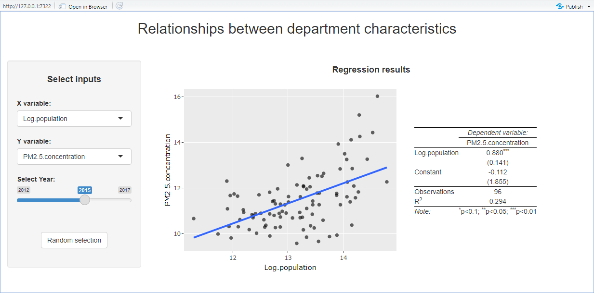

```{r setup, include = FALSE}
source(paste0(getwd(), "/../source/style.R"))
stargazer <- stargazer::stargazer
theme_minimal <- theme_Rcourse
options(htmltools.dir.version = F)
knitr::opts_chunk$set(echo = T, message = F, warning = F, fig.align = "center", dpi = 300)
```
<style> .left-column {width: 70%;} .right-column {width: 30%;} </style>

<h3>Today: Refresher on Introductory Econometrics</h3>

<p style = "margin-bottom:1.75cm;">

#### 1. Regressions with continuous variables
<p style = "margin-bottom:-.5cm;">
 * 1.1. Estimation
 * 1.2. Inference

#### 2. Regressions with discrete variables
<p style = "margin-bottom:-.5cm;">
 * 2.1. Binary dependent variable
 * 2.2. Binary independent variable
 * 2.3. Categorical independent variable
 
#### 3. Controls and interactions

#### (4. Interpretation)
 
---

### 1. Regressions with continuous variables

#### 1.1. Estimation

 * Consider these two relationships:

.left-column[

```{r, echo = F, fig.width = 8, fig.height = 4.5, out.width = "90%", fig.align='left'}
x <- rnorm(1000, 10, 1)
y1 <- 35 +(1.5*x) + rnorm(1000, -1.33, 1.33)
y2 <- (5*x) + rnorm(1000, -4.65, 4.65)

example <- tibble(x = c(x, x), y = c(y1, y2),
                  z = rep(paste("Relationship", 1:2), each = 1000))

ggplot(example, aes(x = x, y = y)) +
  geom_point(alpha = .3, color = "#014D64") + 
  facet_wrap(~z)
```

]

--

.right-column[

<p style = "margin-bottom:2.5cm;">
 
&#10140; One is less noisy but flatter
 
<p style = "margin-bottom:.5cm;">
 
&#10140; One is noisier but steeper

<p style = "margin-bottom:1.5cm;">
 
<h4>Both have a correlation of .75</h4>
 
]

---

### 1. Regressions with continuous variables

#### 1.1. Estimation

 * Consider these two relationships :

.left-column[

```{r, echo = F, fig.width = 8, fig.height = 4.5, out.width = "90%", fig.align='left'}
ols1 <- summary(lm(y ~ x, example %>% filter(z == "Relationship 1")))$coefficients
ols2 <- summary(lm(y ~ x, example %>% filter(z == "Relationship 2")))$coefficients

example <- example %>%
  mutate(cross1 = ifelse(z == "Relationship 1", 
                         ols1[1, 1] + (ols1[2, 1] * 8), 
                         ols2[1, 1] + (ols2[2, 1] * 8)),
         cross2 = ifelse(z == "Relationship 1", 
                         ols1[1, 1] + (ols1[2, 1] * 10), 
                         ols2[1, 1] + (ols2[2, 1] * 10)),
         border = ifelse(z == "Relationship 1", 6.9, 6.9),
         miny = ifelse(z == "Relationship 1",
                       ols1[1, 1] + (ols1[2, 1] * 6.9), 
                       ols2[1, 1] + (ols2[2, 1] * 6.9)),
         maxy = ifelse(z == "Relationship 1",
                       ols1[1, 1] + (ols1[2, 1] * 13.9), 
                       ols2[1, 1] + (ols2[2, 1] * 13.9)))

dash_color <- "black"

ggplot(example, aes(x = x, y = y)) +
  geom_point(alpha = .3, color = "#014D64") + 
  
  geom_segment(aes(x = 6.9, y = miny, xend = 13.9, yend = maxy), linetype = "dashed", color = dash_color) +
  
  geom_segment(aes(x = 8, y = 25, xend = 8, yend = cross1), linetype = "dashed", color = dash_color) +
  geom_segment(aes(x = 10, y = 25, xend = 10, yend = cross2), linetype = "dashed", color = dash_color) +
  geom_segment(aes(x = 8, y = cross1, xend = border, yend = cross1), linetype = "dashed", color = dash_color) +
  geom_segment(aes(x = 10, y = cross2, xend = border, yend = cross2), linetype = "dashed", color = dash_color) +
  
  geom_segment(aes(x = border, y = cross1, xend = border, yend = cross2), arrow = arrow(length = unit(0.2, "cm")), color = dash_color) +
  geom_segment(aes(x = border, y = cross2, xend = border, yend = cross1), arrow = arrow(length = unit(0.2, "cm")), color = dash_color) +
  facet_wrap(~z) 
```

]

.right-column[

<p style = "margin-bottom:3cm;">

***But a given increase in x is not associated with a same increase in y!***
 
]

---

### 1. Regressions with continuous variables

#### 1.1. Estimation

 * The idea of a regression is to find the line that fits the data the best
  * Such that its slope can indicate how we expect y to change if we increase x by 1 unit
 
--

```{r, echo = F, fig.width = 8, fig.height = 4.5, out.width = "65%"}
ggcurve <- read.csv("ggcurve.csv")
ols <- summary(lm(ige ~ gini, ggcurve))$coefficients
ggplot(ggcurve , aes(x = gini, y = ige, label = country)) +
  geom_point(alpha = .8, color = "#014D64") + geom_text(nudge_y = .02, alpha = .8, color = "#014D64") + 
  geom_segment(aes(x = min(ggcurve$gini), xend = max(ggcurve$gini), 
                   y = ols[1, 1] + (min(ggcurve$gini) * ols[2, 1]), 
                   yend = ols[1, 1] + (max(ggcurve$gini) * ols[2, 1])),
               color = "#014D64") +
  geom_segment(aes(x = .5, y = ols[1, 1] + (.5 * ols[2, 1]), xend = .6, yend = ols[1, 1] + (.5 * ols[2, 1])), 
               linetype = "dashed", color = dash_color) +
  geom_segment(aes(x = .6, y = ols[1, 1] + (.5 * ols[2, 1]), xend = .6, yend = ols[1, 1] + (.6 * ols[2, 1])), 
               linetype = "dashed", color = dash_color) +
  annotate("text", x = .625, y = .465, label = "slope (/10)")
```

---

### 1. Regressions with continuous variables

#### 1.1. Estimation

 * To do so we should minimize the distance between each point and the line

<p style = "margin-bottom:1cm;"></p>

--
 
```{r, echo = F, fig.width = 9.5, fig.height = 3.75, out.width = "90%"}
attempts <- ggcurve %>%
  mutate(`Attempt 3` = ols[1, 1] + (gini * ols[2, 1]),
         `Attempt 2` = (3 * gini) - 1,
         `Attempt 1` = .45) %>%
  pivot_longer(c(`Attempt 1`, `Attempt 2`, `Attempt 3`), names_to = "line_id", values_to = "line_value")

test <- attempts %>%
  mutate(obs = row_number()) %>%
  pivot_longer(c(ige, line_value), names_to = "dot_id", values_to = "dot")

dists <- attempts %>%
  group_by(line_id) %>%
  summarise(dist = sum(abs(ige-line_value))) %>%
  select(dist) %>%
  deframe() %>%
  round(., 2)

attempts %>%
  mutate(line_id = case_when(line_id == "Attempt 1" ~ paste("Attempt 1: sum dist. =", dists[1]),
                             line_id == "Attempt 2" ~ paste("Attempt 2: sum dist. =", dists[2]),
                             line_id == "Attempt 3" ~ paste("Attempt 3: sum dist. =", dists[3]))) %>%
  ggplot(., aes(x = gini, y = ige)) + 
  geom_point(alpha = .4, color = "#014D64") +
  geom_line(aes(y = line_value), alpha = .8, color = "#014D64") +
  geom_line(data = test%>%
  mutate(line_id = case_when(line_id == "Attempt 1" ~ paste("Attempt 1: sum dist. =", dists[1]),
                             line_id == "Attempt 2" ~ paste("Attempt 2: sum dist. =", dists[2]),
                             line_id == "Attempt 3" ~ paste("Attempt 3: sum dist. =", dists[3]))), 
  aes(x = gini, y = dot, group = obs), linetype = "dashed", alpha = .7, color = "#014D64") +
  facet_wrap(~line_id)
```

---

### 1. Regressions with continuous variables

#### 1.1. Estimation

.pull-left[

<p style = "margin-bottom:1cm;"></p>

Take for instance the 20<sup>th</sup> observation: Peru

```{r, echo = F, fig.width = 5.5, fig.height = 3.5, out.width = "100%"}
library(latex2exp)
xperu <- deframe(attempts[attempts$country == "Peru" & attempts$line_id == "Attempt 3", "gini"])
y1peru <- deframe(attempts[attempts$country == "Peru" & attempts$line_id == "Attempt 3", "line_value"])
y2peru <- deframe(attempts[attempts$country == "Peru" & attempts$line_id == "Attempt 3", "ige"])

attempts %>%
  mutate(focus = ifelse(country == "Peru", 1, 0)) %>%
  filter(line_id == "Attempt 3") %>%
  ggplot(., aes(x = gini, y = ige)) + 
  geom_point(aes(size = focus), alpha = .4, color = "#014D64", show.legend = F) +
  geom_point(aes(size = focus), alpha = .4, color = "#014D64", show.legend = F) +
  geom_line(aes(y = line_value), alpha = .8, color = "#014D64") +
  geom_segment(aes(x = xperu, xend = xperu, y = y1peru, yend = y2peru), arrow = arrow(length = unit(0.2, "cm"))) + 
  geom_segment(aes(x = xperu, xend = xperu, y = y2peru, yend = y1peru), arrow = arrow(length = unit(0.2, "cm"))) + 
  annotate("text", x = xperu - .015, y = y1peru, label = TeX("$\\widehat{y_{20}}$", output = "character"), parse = T) +
  annotate("text", x = xperu - .015, y = y2peru, label = TeX("$y_{20}$", output = "character"), parse = T) +
  annotate("text", x = xperu + .01, y = (y1peru + y2peru) / 2, label = TeX("$\\widehat{\\epsilon_{20}}$", output = "character"), parse = T)
```

]

--

.pull-right[

And consider the following notations:

  * We denote $y_i$ the ige of the $i^{\text{th}}$ country
  
  * We denote $x_i$ the gini of the $i^{\text{th}}$ country
  
  * We denote $\widehat{y_i}$ the value of the $y$ coordinate of our line when $x = x_i$

<p style = "margin-bottom:1.5cm;"></p>
  
&#10140; The distance between the $i^{\text{th}}$ y value and the line is thus $y_i - \widehat{y_i}$

 * We label that distance $\widehat{\varepsilon_i}$

]

---

### 1. Regressions with continuous variables

#### 1.1. Estimation

.pull-left[

<p style = "margin-bottom:2cm;"></p>

```{r, echo = F, fig.width = 5.5, fig.height = 3.5, out.width = "100%"}
attempts %>%
  filter(line_id == "Attempt 3") %>%
  ggplot(., aes(x = gini, y = ige)) + 
  geom_point(alpha = .4, color = "#014D64") +
  geom_line(aes(y = line_value), alpha = .8, color = "#014D64") +
  geom_line(data = test %>% filter(line_id == "Attempt 3"), 
  aes(x = gini, y = dot, group = obs), linetype = "dashed", alpha = .7, color = "#014D64")
```

]

.pull-right[
<p style = "margin-bottom:-1cm;"></p>

 * Because $\widehat{\varepsilon_i}$ is the value of the distance between a point $y_i$ and its corresponding value on the line $\widehat{y_i}$ we can write:

$$y_i = \widehat{y_i} + \widehat{\varepsilon_i}$$

 * And because $\widehat{y_i}$ is a straight line, it can be expressed as
 
$$\widehat{y_i} = \hat{\alpha} + \hat{\beta}x_i$$

 * Where:
  * $\hat{\alpha}$ is the y-intercept
  * $\hat{\beta}$ is the slope
  * Both are estimations of the actual $\alpha$ and $\beta$ of the unknown DGP
]

---

### 1. Regressions with continuous variables

#### 1.1. Estimation

 * Combining these two definitions yields the equation:

$$y_i = \hat{\alpha} + \hat{\beta}x_i + \widehat{\varepsilon_i} \begin{cases}  y_i = \widehat{y_i} + \widehat{\varepsilon_i}& \text{Definition of distance}\\
\widehat{y_i} = \hat{\alpha} + \hat{\beta}x_i & \text{Definition of the line}
\end{cases}$$

--

<p style = "margin-bottom:1cm;"></p>

 * Depending on the values of $\hat{\alpha}$ and $\hat{\beta}$, the value of every $\widehat{\varepsilon_i}$ will change

--

<p style = "margin-bottom:-.5cm;"></p>

.left-column[
```{r, echo = F, fig.width = 9.5, fig.height = 3.75, out.width = "90%", fig.align='left'}
attempts %>%
  mutate(line_id = case_when(line_id == "Attempt 1" ~ paste("Attempt 1: sum dist. =", dists[1]),
                             line_id == "Attempt 2" ~ paste("Attempt 2: sum dist. =", dists[2]),
                             line_id == "Attempt 3" ~ paste("Attempt 3: sum dist. =", dists[3]))) %>%
  ggplot(., aes(x = gini, y = ige)) + 
  geom_point(alpha = .4, color = "#014D64") +
  geom_line(aes(y = line_value), alpha = .8, color = "#014D64") +
  geom_line(data = test%>%
  mutate(line_id = case_when(line_id == "Attempt 1" ~ paste("Attempt 1: sum dist. =", dists[1]),
                             line_id == "Attempt 2" ~ paste("Attempt 2: sum dist. =", dists[2]),
                             line_id == "Attempt 3" ~ paste("Attempt 3: sum dist. =", dists[3]))), 
  aes(x = gini, y = dot, group = obs), linetype = "dashed", alpha = .7, color = "#014D64") +
  facet_wrap(~line_id)
```

]

.right-column[

<p style = "margin-bottom:-.25cm;"></p>

**Attempt 1:** $\hat{\alpha}$ is too high and $\hat{\beta}$ is too low &#10140; $\widehat{\varepsilon_i}$ are large
 
**Attempt 2:** $\hat{\alpha}$ is too low and $\hat{\beta}$ is too high &#10140; $\widehat{\varepsilon_i}$ are large
 
**Attempt 3:** $\hat{\alpha}$ and $\hat{\beta}$ seem appropriate &#10140; $\widehat{\varepsilon_i}$ are low

]

---

### 1. Regressions with continuous variables

#### 1.1. Estimation

 * We want to find the values of $\hat{\alpha}$ and $\hat{\beta}$ that minimize the overall distance between the points and the line

--

$$\min_{\hat{\alpha}, \hat{\beta}}\sum_{i=1}^{n}\widehat{\varepsilon_i}^2$$
<ul>
  <ul>
    <li>Note that we square \(\widehat{\varepsilon_i}\) to avoid that its positive and negative values compensate</li>
    <li>This method is what we call <b>Ordinary Least Squares (OLS)</b></li>
  </ul>
</ul>

<p style = "margin-bottom:1.5cm;"></p>

--

<ul>
  <li>If we replace \(\widehat{\varepsilon_i}\) with \(y_i -\hat{\alpha} - \hat{\beta}x_i\)</li>
  <ul>
    <li>We can solve the minimization problem (see Lecture 7) to obtain:</li>
  </ul>
</ul>

<p style = "margin-bottom:1cm;"></p>

$$\hat{\beta} = \frac{\text{Cov}(x_i, y_i)}{\text{Var}(x_i)} \:\:\:\:\:\:\:\:\: ; \:\:\:\:\:\:\:\:\: \hat{\alpha} = \bar{y} - \hat{\beta} \times\bar{x}$$

---

<center><h3> Vocabulary </h3></center>

<p style = "margin-bottom:1.5cm;"></p>

 * This equation we're working on is called a <b>regression model</b>
 
$$y_i = \alpha + \beta x_i + \varepsilon_i$$ 

--

<ul><ul>
<li> We say that we regress \(y\) on \(x\) to find the coefficients \(\hat{\alpha}\) and \(\hat{\beta}\) that characterize the regression line</li> <li> We often call \(\hat{\alpha}\) and \(\hat{\beta}\) <b><i>parameters</i></b> of the regression because it is what we tune to fit our model to the data</li>
</ul></ul>

<p style = "margin-bottom:1.25cm;"></p>

--

<ul>
  <li>We also have different names for the \(x\) and \(y\) variables</li>
  <ul>
    <li> \(y\) is called the <b><i>dependent</i></b> or <i>explained</i> variable
    <li> \(x\) is called the <b><i>independent</i></b> or <i>explanatory</i> variable
  </ul>
</ul>


--

<p style = "margin-bottom:1.25cm;"></p>

 * We call $\widehat{\varepsilon_i}$ the <b>residuals</b> because it is what is left after we fitted the data the best we could

--

<p style = "margin-bottom:1.25cm;"></p>

 * And $\hat{y_i} = \hat{\alpha} + \hat{\beta}x_i$, i.e., the value on the regression line for a given $x_i$ are called the <b>fitted values</b>

---

### 1. Regressions with continuous variables

#### 1.2. Inference

<ul>
  <li>Inference refers to the fact of being able to <b>conclude</b> something from our estimation</li>
  <ul>
    <li>The \(\hat{\beta}\) from our sample is actually an <b>estimation</b> of the unobserved \(\beta\) of the underlying population</li>
    <li>To make inference possible we would like to know how reliable \(\hat{\beta}\) is, <b>how confident we are</b> in its estimation</li>
    <li>The first step of inference is to compute the <b>standard error</b> of \(\hat{\beta}\)</li>
  </ul>
</ul>

--

<p style = "margin-bottom:1.5cm;"></p>

$$\text{se}(\hat{\beta}) = \sqrt{\widehat{\text{Var}(\hat{\beta})}} = \sqrt{\frac{\sum_{i = 1}^n\hat{\varepsilon_i}^2}{(n-\#\text{parameters})\sum_{i = 1}^n(x_i-\bar{x})^2}}$$

<p style = "margin-bottom:1.5cm;"></p>

--

<ul>
  <li>Notice that the variance, and thus the standard error of our estimate:</li>
  <ul>
    <li>Decreases as our sample gets bigger</li>
    <li>Gets larger if the points are further away from the regression line on average for a given variance of \(x\)</li>
  </ul>
</ul>

---

### 1. Regressions with continuous variables

#### 1.2. Inference

 * The magnitude of the standard error gives an indication of the <b>precision</b> of our estimate:
  * The larger the estimate relative to its standard error, the more precise the estimate

<p style = "margin-bottom:1cm;"></p>

--

 * But standard errors are not easily interpretable by themselves
  * A more direct way to get a sense of the precision for inference is to construct a <b>confidence interval</b>

<p style = "margin-bottom:1cm;"></p>

--

<center>&#10140; <b>Instead of saying that our estimation \(\hat{\beta}\) is equal to 1.02, we would like to say that we are 95% sure that the actual \(\beta\) lies between two given values</b></center>

<p style = "margin-bottom:.5cm;"></p>

--

 * To obtain a confidence interval we can use the fact that under specific conditions (that you're gonna see next year) it is possible to derive how this object is distributed:

$$\hat{t} \equiv \frac{\hat{\beta} - \beta}{\text{se}(\hat{\beta})}$$

---

### 1. Regressions with continuous variables

#### 1.2. Inference

 * Theory shows that $\hat{t} \equiv \frac{\hat{\beta} - \beta}{\text{se}(\hat{\beta})}$ follows a Student t distribution whose number of degrees of freedom is equal to $n$ (in our case 22 countries) minus the number of parameters estimated in the model (in our case 2: $\alpha$ and $\beta$)

--

```{r, echo = F, fig.width = 6, fig.height = 3.3, out.width = "65%"}
ggplot(tibble(x = c(rt(10000, 1), rt(10000, 5), rt(10000, 60)),
              df = rep(c("1", "5", "60"), each = 10000)) %>%
         filter(x>-4&x<4),
       aes(x = x, color = df, fill = df)) + 
  geom_density(alpha = .1, bw = .8) + xlab("") +
  ggtitle("Student t distributions") +
  theme(legend.direction = "vertical",
        legend.position = "right")
```

---

### 1. Regressions with continuous variables

#### 1.2. Inference

 * Denote $t_{97.5\%}$ the value such that 97.5% of the distribution is below that value
  * Then 95% of the distribution lies between $-t_{97.5\%}$ and $t_{97.5\%}$

--

<p style = "margin-bottom:1cm;"></p>

```{r, echo = F, fig.width = 6, fig.height = 3.3, out.width = "67%"}
ggplot(tibble(x = rt(10000, 20)) %>%
         filter(x>-4&x<4),
       aes(x = x)) + 
  geom_density(alpha = .1, bw = .8, fill = "#014D64", color ="#014D64") + 
  scale_x_continuous(" ", breaks = c(-2.5, 2.5), labels = c("-t[97.5%]", "t[97.5%]")) +
  geom_segment(x = -2.5, y = 0, xend = -2.5, yend = .0485, linetype = "dashed") +
  geom_segment(x = 2.5, y = 0, xend = 2.5, yend = .0485, linetype = "dashed") +
  annotate("text", x = 0, y = .16, label = "95%") +
  annotate("text", x = -2.82, y = .01, label = "2.5%") +
  annotate("text", x = 2.82, y = .01, label = "2.5%") +
  ylab("density")
```

---

### 1. Regressions with continuous variables

#### 1.2. Inference

 * Because we know that $\hat{t} \equiv \frac{\hat{\beta} - \beta}{\text{se}(\hat{\beta})}$ follows this distribution, we know that it has a 95% chance to fall within the two values $-t_{97.5\%}$ and $t_{97.5\%}$

--
 
$$\text{Pr}\left[-t_{97.5\%}\leq\frac{\hat{\beta} - \beta}{\text{se}(\hat{\beta})}\leq t_{97.5\%}\right] = 95\%$$

--

 * Rearranging the terms yields:

$$\text{Pr}\left[\hat{\beta} - t_{97.5\%}\times\text{se}(\hat{\beta})\leq \beta \leq\hat{\beta} + t_{97.5\%}\times\text{se}(\hat{\beta})\right] = 95\%$$

--

<p style = "margin-bottom:1.25cm;"></p>

.left-column[

 * Thus, we can say that there is a 95% chance for $\beta$ to be within
 
$$\hat{\beta} \pm t_{97.5\%}\times\text{se}(\hat{\beta}) $$

]

--

.right-column[

<p style = "margin-bottom:-.6cm;"></p>

 * To get $t_{97.5\%}$ with 20 df:
 
```{r, eval = F}
qt(.975, 20)
```

]

---

### 1. Regressions with continuous variables

#### 1.2. Inference

 * ***Confidence intervals*** are very effective to get a sense of the precision of our estimates and of the **range of values the true parameters could reasonably take**

--

 * But the ***p-value*** is what we tend to ultimately focus on, it is the **% chance that our estimation of the true parameter is different from 0 just coincidentally**
 
<p style = "margin-bottom:1cm;"></p>

--

<ul>
  <li><b>Confidence intervals and p-values are tightly linked</b></li>
  <ul>
    <li>If there is a 4% chance that a parameter equal to 2 is different from 0, I know that the 95% confidence interval will start above 0 but quite close, and stop a bit before 4</li>
    <li>If a 95% confidence interval is bounded by 4 and 5, I know the the p-value will be way below 5%</li>
  </ul>
</ul>

<p style = "margin-bottom:1cm;"></p>

--

<ul>
  <li>But these two indicators are <b>complementary</b> to easily get the full picture:</li>
  <ul>
    <li>With a p-value we can easily know how sure we are that the parameter is different from 0, but it is difficult to get a sense of the set of values the parameters can reasonably take</li>
    <li>With the confidence interval it is the opposite</li>
  </ul>
</ul>


---

### 1. Regressions with continuous variables

#### 1.2. Inference

<ul>
  <li><b>P-val. computation:</b> The principle is the same as for standard errors but the reasoning is reversed</li>
  <ul>
    <li>For <i>confidence intervals</i>: we want to know among which values the parameter has a given percentage chance to fall into</li>
    <li>For <i>p-value</i>: we want to know with which percentage chance 0 is out of the set of values that the parameter could reasonably take</li>
  </ul>
</ul>

<p style = "margin-bottom:1cm;"></p>

--

<ul>
  <li><b>Vocabulary:</b> We talk about <i>significance level</i></li>
  <ul>
    <li> When \(\text{P-value} \leq .05\), we say that the estimate is significant(ly different from 0) at the 5% level</li>
    <li> When the p-value is greater than a given threshold of acceptability, we say that the estimate is not significant</li>
  </ul>
</ul>

<p style = "margin-bottom:1cm;"></p>

--

<ul>
  <li><b>In practice:</b> Usually in Economics we use the 5% threshold</li>
  <ul>
    <li>But this is arbitrary, in other fields the benchmark p-value is different</li>
    <li>With this threshold we're wrong once in 20 times</li>
  </ul>
</ul>

---

<h3>Overview</h3>

<p style = "margin-bottom:1.75cm;">

#### 1. Regressions with continuous variables &#10004;
<p style = "margin-bottom:-.5cm;">
 * 1.1. Estimation
 * 1.2. Inference

#### 2. Regressions with discrete variables
<p style = "margin-bottom:-.5cm;">
 * 2.1. Binary dependent variable
 * 2.2. Binary independent variable
 * 2.3. Categorical independent variable
 
#### 3. Controls and interactions

#### (4. Interpretation)
 
---

<h3>Overview</h3>

<p style = "margin-bottom:1.75cm;">

#### 1. Regressions with continuous variables &#10004;
<p style = "margin-bottom:-.5cm;">
 * 1.1. Estimation
 * 1.2. Inference

#### 2. Regressions with discrete variables
<p style = "margin-bottom:-.5cm;">
 * 2.1. Binary dependent variable
 * 2.2. Binary independent variable
 * 2.3. Categorical independent variable
 
---

### 2. Regressions with discrete variables

#### 2.1. Binary dependent variable

<ul>
  <li>So far we've considered only continuous variables in our regression models</li>
  <ul>
    <li>But what if our dependent variable is discrete?</li>
  </ul>
</ul>

--

<ul>
  <li>Consider that we have data on candidates to a job:</li>
  <ul>
    <li>Their <i>Baccalauréat</i> grade (/20) </li>
    <li>Whether they got accepted</li>
  </ul>
</ul>
  
--

<p style = "margin-bottom:1.25cm;">

```{r, echo = F, fig.width = 7, fig.height = 3, out.width = "60%"}
data_bin <- tibble(x = rnorm(1000, 15, 1), 
                   noisy_x = x + runif(1000, -1, 1),
                   y = ifelse(noisy_x > mean(x), 1, 0))
ggplot(data_bin, aes(x = x, y = y)) +
  geom_point(alpha = .1, color = "#014D64") + xlab("Grade") +
  scale_y_continuous(name = "", limits = 0:1, breaks = 0:1, labels = c("Rejected", "Accepted"))
```

---

### 2. Regressions with discrete variables

#### 2.1. Binary dependent variable 

<ul>
  <li>Even if the outcome variable is binary we can regress it on the grade variable</li>
  <ul>
    <li>We can convert it into a <b>dummy</b> variable, a variable taking either the value 0 or 1</li>
    <li>Here consider a dummy variable taking the value 1 if the person was accepted</li>
  </ul>
</ul>

--

<p style = "margin-bottom:1.25cm;">

$$1\{y_i = \text{Accepted}\} = \hat{\alpha} + \hat{\beta} \times \text{Grade}_i + \hat{\varepsilon_i}$$

<p style = "margin-bottom:1cm;">

<style> .left-column {width: 65%;} .right-column {width: 35%;} </style>

```{r, echo = F, fig.width = 6, fig.height = 2.5, out.width = "60%"}
ggplot(data_bin, aes(x = x, y = y)) +
  geom_point(alpha = .1, color = "#014D64") + xlab("Grade") +
  geom_smooth(method = "lm", se = F, color = "#014D64") +
  scale_y_continuous(name = "", limits = 0:1, breaks = 0:1)
```

---


### 2. Regressions with discrete variables

#### 2.1. Binary dependent variable

<ul>
  <li>The fitted values can be viewed as the probability to be accepted for a given grade</li>
</ul>
<p style = "margin-bottom:-.5cm;"></p>

--

<ul>
  <ul>
    <li>The slope is thus by how much the probability of being accepted would increase on expectation for a 1 point increase in the grade</li>
    <li>That's why we call OLS regression models with a binary outcome <i>Linear Probability Models</i></li>
  </ul>
</ul>

<p style = "margin-bottom:1cm;"></p>

```{r, echo = F, fig.width = 7, fig.height = 3, out.width = "70%"}
coefs <- summary(lm(y ~ x, data_bin))$coefficients

slope_plot <- ggplot(data_bin, aes(x = x, y = y)) +
  geom_point(alpha = .1, color = "#014D64") + xlab("Grade") +
  geom_smooth(method = "lm", se = F, color = "#014D64") +
  scale_y_continuous(name = "", limits = 0:1, breaks = seq(0, 1, .5)) +
  scale_x_continuous(name = "Grade", limits = c(12, 18), breaks = 12:18) +
  geom_segment(x = 12, xend = 15, y = coefs[1, 1] + (15 * coefs[2, 1]), yend = coefs[1, 1] + (15 * coefs[2, 1]), linetype = "dashed") +
  geom_segment(x = 15, xend = 15, y = 0, yend = coefs[1, 1] + (15 * coefs[2, 1]), linetype = "dashed") +
  geom_segment(x = 12, xend = 16, y = coefs[1, 1] + (16 * coefs[2, 1]), yend = coefs[1, 1] + (16 * coefs[2, 1]), linetype = "dashed") +
  geom_segment(x = 16, xend = 16, y = 0, yend = coefs[1, 1] + (16 * coefs[2, 1]), linetype = "dashed") +
  geom_segment(x = 12, xend = 12, y = coefs[1, 1] + (15 * coefs[2, 1]) + .01, yend = coefs[1, 1] + (16 * coefs[2, 1]) - .01, arrow = arrow(ends = "both", length = unit(.2,"cm"))) +
  annotate("text", x = 12.2, y = (coefs[1, 1] + (15 * coefs[2, 1]) + coefs[1, 1] + (16 * coefs[2, 1]))/2, label = round(coefs[2, 1], 2))
slope_plot
```

---

### 2. Regressions with discrete variables

#### 2.1. Binary dependent variable

<ul>
  <li>But with an LPM you can end up with 'probabilities' that are lower than 0 and greater than 1</li>
  <ul>
    <li>Interpretation is only valid for values of x sufficiently close to the mean</li>
    <li>Keep that in mind and be careful when interpreting the results of an LPM</li>
  </ul>
</ul>

<p style = "margin-bottom:1.75cm;">

```{r, echo = F, fig.width = 7, fig.height = 3, out.width = "70%"}
ggplot(data_bin, aes(x = x, y = y)) +
  geom_point(alpha = .1, color = "#014D64") + xlab("Grade") +
  scale_y_continuous(name = "", limits = c(-5, 2), breaks = -5:2) +
  scale_x_continuous(name = "Grade", limits = c(0, 20), breaks = 0:20) +
  geom_segment(x = 0, xend = 20, y = coefs[1, 1], yend = coefs[1, 1] + (20 * coefs[2, 1]), color = "#014D64") +
  geom_segment(x = 0, xend = 10, y = coefs[1, 1] + (10*coefs[2, 1]), yend = coefs[1, 1] + (10*coefs[2, 1]), linetype = "dashed") +
  geom_segment(x = 10, xend = 10, y = -5, yend = coefs[1, 1] + (10*coefs[2, 1]), linetype = "dashed")
```

---

### 2. Regressions with discrete variables

#### 2.2. Binary independent variable

<ul>
  <li>Now consider that we individual data containing:</li>
  <ul>
    <li>The sex</li>
    <li>The height (centimeters)</li>
  </ul>
</ul>

--

<p style = "margin-bottom:1.5cm;">
 
<ul>
  <li>So instead of</li>
  <ul>
    <li>having a binary dependent variable :</li>
  </ul>
</ul>

$$1\{y_i = \text{Accepted}\} = \hat{\alpha} + \hat{\beta} \times \text{Grade}_i + \hat{\varepsilon_i}$$
 
<ul>
  <ul>
    <li>we have a binary independent variable</li>
  </ul>
</ul>
 
$$\text{Height}_i = \hat{\alpha} + \hat{\beta} \times 1\{x_i = \text{Male}\} + \hat{\varepsilon_i}$$

--

<p style = "margin-bottom:1.75cm;">

<center><h4><i> &#10140; How to interpret the coefficient \(\hat{\beta}\) from this regression?</i></h4></center>

---
 
### 2. Regressions with discrete variables

#### 2.2. Binary independent variable

<ul>
  <li>If the sex variable was continuous it would be the expected increase in height for a <i>'1 unit increase'</i> in sex</li>
  <ul>
    <li>Here the <i>'1 unit increase'</i> is switching from 0 to 1, i.e. from female to male</li>
    <li>Here is the traditionnal scatter plot representation</li>
  </ul>
</ul>

```{r, echo = F, fig.width = 6, fig.height = 4, out.width = "50%"}
data_binx <- tibble(x = rep(c(0, 1), each = 500), 
                    y = c(rnorm(500, 165, 10), rnorm(500, 175, 10)))

ggplot(data_binx, aes(x = as.factor(x), y = y)) +
  ylab("Height") +
  scale_x_discrete(name = "1{Sex[i] = Male}", labels = 0:1) +
  geom_point(data = data_binx %>% mutate(x =x +1), aes(x = x, y = y), alpha = .1, color = "#014D64") +
  geom_boxplot(alpha = .1, width = .1, color = NA) + 
  geom_smooth(data = data_binx %>% mutate(x =x +1), aes(x = x, y = y), method = "lm", se = F, color = "#014D64")
```

---
 
### 2. Regressions with discrete variables

#### 2.2. Binary independent variable

<ul>
  <li>Replacing the point geometry by the corresponding boxplots: </li>
  <ul>
    <li>What this <i>'1 unit increase'</i> corresponds to should be clearer</li>
    <li>The coefficient \(\hat{\beta}\) is actually the difference between the average height for males and females</li>
  </ul>
</ul>

```{r, echo = F, fig.width = 6, fig.height = 4, out.width = "50%"}
ggplot(data_binx, aes(x = as.factor(x), y = y)) +
  ylab("Height") +
  scale_x_discrete(name = "1{Sex[i] = Male}", labels = 0:1) +
  #geom_point(data = data_binx %>% mutate(x =x +1), aes(x = x, y = y), alpha = .1) +
  geom_boxplot(alpha = .1, width = .1, color = "#014D64", fill = "#014D64") + 
  geom_smooth(data = data_binx %>% mutate(x =x +1), aes(x = x, y = y), method = "lm", se = F, color = "#014D64")
```

---
 
### 2. Regressions with discrete variables

#### 2.2. Binary independent variable

 * Let's have a look at the regression results and at the summary statistics of both distributions:

--

<p style = "margin-bottom:-.5cm;"></p>

.pull-left[
```{r, echo = F}
stargazer(lm(Height ~ Sex, data_binx %>% mutate(Height = y, Sex = ifelse(x == 0, "Female", "Male"))), type = "text", 
          keep.stat = c("n", "rsq"), digits = 1)
```
]

--

.pull-right[

<p style = "margin-bottom:1cm;"></p>

```{r, echo = F}
data_binx %>% 
  mutate(Sex = ifelse(x == 0, "Female", "Male")) %>%
  group_by(Sex) %>%
  summarise(`Min` = min(y),
            `Q1` = quantile(y, .25),
            `Med` = median(y),
            `Mean` = mean(y),
            `Q3` = quantile(y, .75),
            `Max` = max(y)) %>%
  ungroup() %>%
  knitr::kable(., caption = "Height summary statistics by sex", digits = 1, booktabs = TRUE) %>% 
    kable_styling(bootstrap_options = c('hover', 'condensed'), full_width = F)
```

<p style = "margin-bottom:1.25cm;"></p>

&#10140; The $\hat{\alpha}$ coefficient is equal to the expected value of $y$ when $x = 0$, i.e., to the average height for females

<p style = "margin-bottom:.75cm;"></p>

&#10140; The $\hat{\beta}$ coefficient is equal to expected increase in $y$ when going from $x = 0$ to $x = 1$, i.e., to the difference between male and female average height

]

---
 
### 2. Regressions with discrete variables

#### 2.2. Binary independent variable

 * Let's think of it in terms of a regression model:
 
$$\text{Height}_i = \hat{\alpha} + \hat{\beta} \times 1\{x_i = \text{Male}\} + \hat{\varepsilon_i}$$

--

 * We now have $\hat{\alpha}$ and $\hat{\beta}$:
 
$$\text{Height}_i = 165.0 + 9.8 \times 1\{x_i = \text{Male}\} + \hat{\varepsilon_i}$$

--

 * The fitted values write:

$$\widehat{\text{Height}_i} =  165.0 + 9.8 \times 1\{x_i = \text{Male}\}$$

--

.pull-left[

 * When the dummy equals 0 (females):
 
$$\begin{align}
\widehat{\text{Height}_i} & = 165.0 + 9.8 \times 0\\
&= 165.0 =\overline{\text{Height}_{\left[x_i = \text{Female}\right]}}
\end{align}$$

]

--

.pull-right[

 * When the dummy equals 1 (males):
 
$$\begin{align}\widehat{\text{Height}_i} & = 165.0 + 9.8 \times 1\\
&= 174.8 =\overline{\text{Height}_{\left[x_i = \text{Male}\right]}}\end{align}$$

]

---
 
### 2. Regressions with discrete variables

#### 2.3. Categorical independent variable

<ul>
  <li>So far we've been working with binary categorical variables:</li>
  <ul>
    <li>Accepted vs. Rejected, Male vs. Female</li>
    <li>But what about discrete variables with more than two categories?</li>
  </ul>
</ul>
  
--

 * Take for instance the race variable:
 
```{r}
asec_2020 <- read.csv("asec_2020.csv")
kable(asec_2020 %>% group_by(Race) %>% summarise(N = n()) %>% t(),
      caption = "Distribution of the Race categorical variable")
```

--

<p style = "margin-bottom:.75cm;"></p>

<center><b><i>&#10140; How can we use this variable as an independent variable in our regression framework?</i></b></center>

---
 
### 2. Regressions with discrete variables

#### 2.3. Categorical independent variable

 * Just as we converted our $2$-category variable into $1$ dummy variable, we can convert an $n$-category variable into $n-1$ dummy variables:
 
--

.pull-left[
```{r, echo = F}
dummy_conversion <- tibble(Sex = rep(c("Female", "Male"), each = 4),
       Male = rep(c(0, 1), each = 4),
       ` ` = rep("    ", 8), 
       Race = rep(c("Asian", "Black", "Other", "White"), each = 2), 
       Black = c(0, 0, 1, 1, 0, 0, 0, 0),
       Other = c(0, 0, 0, 0, 1, 1, 0, 0),
       White = c(0, 0, 0, 0, 0, 0, 1, 1))

kable(dummy_conversion, caption = " ") %>%
  column_spec(3, width = "3em")
```
]

--

.pull-right[

<p style = "margin-bottom:-.25cm;"></p>

***&#10140; But why do we omit one category every time?***

 * Females are observations for which Male equals 0
 * Asians are observations for which Black, Other, and White each equals 0

&#10140; Females and Asians are ***reference categories***

 * The coefficient associated with the Male dummy was interpreted ***relative*** to females
 * The coefficients associated with the Black, Other, and White dummies will be interpreted ***relative*** to Asians

]

---

### 2. Regressions with discrete variables

#### 2.3. Categorical independent variable

 * Thus, regressing earnings on the race categorical variable amounts to estimate the equation:
 
$$\text{Earnings}_i = \hat{\alpha} + \hat{\beta_1} 1\{\text{Race}_i = \text{Black}\} + \hat{\beta_2} 1\{\text{Race}_i = \text{Other}\} + \hat{\beta_3} 1\{\text{Race}_i = \text{White}\} + \hat{\varepsilon_i}$$

--

<p style = "margin-bottom:1.25cm;"></p>

* And if we compare the regression results to the average earnings by group:

<p style = "margin-bottom:-.75cm;"></p>

--

.left-column[
```{r}
summary(lm(Earnings ~ Race, asec_2020))$coefficients
```

<p style = "margin-bottom:1cm;"></p>

<ul><ul>
<li>\(\alpha\) is still the average earnings for the reference category </li>
<li>coefficient are still <i>relative</i> to the reference category</li>
</ul></ul>
]

.right-column[
```{r, echo = F}
asec_2020 %>% group_by(Race) %>%
  summarise(`Mean earnings` = mean(Earnings)) %>%
  kable(., caption = "Mean earnings by race")
```
]

---

### 2. Regressions with discrete variables

#### 2.3. Categorical independent variable

 * As you can see from the previous regression results, by default R sorts categories by alphabetical order:
 
```{r, echo = F}
summary(lm(Earnings ~ Race, asec_2020))$coefficients
```

--

 * But oftentimes we would prefer the reference category to be the majority group
  * In R we can use the `relevel()` function to change the reference category of a factor

--

```{r}
summary(lm(Earnings ~ relevel(as.factor(Race), "White"), asec_2020))$coefficients[, c(1, 2, 4)]
```

---

<h3>Overview</h3>

<p style = "margin-bottom:1.75cm;">

#### 1. Regressions with continuous variables &#10004;
<p style = "margin-bottom:-.5cm;">
 * 1.1. Estimation
 * 1.2. Inference

#### 2. Regressions with discrete variables &#10004;
<p style = "margin-bottom:-.5cm;">
 * 2.1. Binary dependent variable
 * 2.2. Binary independent variable
 * 2.3. Categorical independent variable
 
#### 3. Controls and interactions

#### (4. Interpretation)
 
---

<h3>Overview</h3>

<p style = "margin-bottom:1.75cm;">

#### 1. Regressions with continuous variables &#10004;
<p style = "margin-bottom:-.5cm;">
 * 1.1. Estimation
 * 1.2. Inference

#### 2. Regressions with discrete variables &#10004;
<p style = "margin-bottom:-.5cm;">
 * 2.1. Binary dependent variable
 * 2.2. Binary independent variable
 * 2.3. Categorical independent variable
 
#### 3. Controls and interactions

---

### 3. Controls and interactions

<ul>
  <li>We can add a third variable z in the regression for two reasons:</li>
  <ul>
    <li><b>Controlling for z</b> allows to <b>net out</b> the relationship between x and y from how they both relate to <b>z</b></li>
    <li><b>Interacting x with z</b> allows to <b>estimate how the relationship</b> between x and y <b>varies with z</b></li>
  </ul>
</ul>

--

<ul>
  <li>Consider the following fictitious dataset at the household level</li>
  <ul>
    <li>Household annual income</li>
    <li>Number of children in the household</li>
    <li>Parents' education level</li>
  </ul>
</ul>

.pull-left[
```{r}
data <- read.csv("household_data.csv")
head(data, 7) # fictitious data
```
]

--

.pull-right[
```{r, echo = F, fig.width = 6, fig.height = 3.75, out.width = '85%'}
ggplot(data, aes(x = Income, y = Children)) +
  geom_point() + geom_smooth(method = "lm", se = F)
```
]

---

### 3. Controls and interactions

<ul>
  <li>There's a clear positive relationship</li>
</ul>
  
```{r, echo = F}
round(summary(lm(Children ~ Income, data))$coefficients[, c(1, 4)], 3)
```

--

<ul>
  <ul>
    <li>But what if this relationship was driven by a third variable?</li>
    <li>Maybe it's just that more educated parents tend to earn more and to have more children</li>
  </ul>
</ul>

--

```{r, echo = F, fig.width = 7.5, fig.height = 4.375, out.width = '50%'}
ggplot(data, aes(x = Income, y = Children)) +
  geom_point(aes(color = Education, shape = Education), size = 3) + 
  geom_smooth(method = "lm", se = F)
```

--

.pull-right[
<ul>
  <li>In this example, <b>education</b> is indeed <b>positively correlated with both variables</b></li>
  <ul>
    <li>So at least part of the positive relationship we observe is actually due to education</li>
    <li><b>Controlling</b> for education estimates the relationship by <b>netting our the contribution of education</b></li>
  </ul>
</ul>
]

---

### 3. Controls and interactions

<ul>
  <li><b>Controlling</b> for education does the same to the slope <b>as recentering</b> the graph with respect to education</li>
  <ul>
    <li>In that way, when moving along the x axis, <b>z</b> does not increase but <b>remains constant</b></li>
  </ul>
</ul>

<p style = "margin-bottom:-.75cm;"></p>

--

.pull-left[
```{r, echo = F, fig.width = 6, fig.height = 3.75, out.width = '100%'}
ggplot(data %>%
         group_by(Education) %>%
         mutate(meaninc = mean(Income),
                meanchi = mean(Children)) %>%
         ungroup(), aes(x = Income, y = Children)) +
  geom_point(aes(color = Education, shape = Education)) + 
  geom_point(aes(x = meaninc, y = meanchi, color = Education), shape = 3, size = 10, show.legend = F, alpha = .8) +
  geom_smooth(method = "lm", se = F)
```

<ul>
  <li>The crosses are located at the average x and y values for each education group</li>
  <ul>
    <li>Controlling for education shifts x and y by group such that crosses superimpose</li>
  </ul>
</ul>

]

--

.pull-right[
```{r, echo = F, fig.width = 6, fig.height = 3.75, out.width = '100%'}
recentered <- data %>%
  mutate(meaninc = mean(Income),
         meanchi = mean(Children)) %>%
  group_by(Education) %>%
  mutate(Income = Income - mean(Income) + meaninc,
         Children = Children - mean(Children) + meanchi) %>%
  ungroup()

ggplot(recentered, aes(x = Income, y = Children)) +
  geom_point(aes(color = Education, shape = Education)) + 
  geom_point(aes(x = meaninc, y = meanchi, color = Education), shape = 3, size = 10, show.legend = F, alpha = .8) +
  geom_smooth(method = "lm", se = F)
```
```{r, echo = F}
round(summary(lm(Children ~ Income + Education, data))$coefficients[, c(1, 4)], 3)
```
]

---

### 3. Controls and interactions

<ul>
  <li>Here when we <b>do not control</b> for education:</li>
</ul>

$$Children_i = \alpha + \beta Income_i + \varepsilon_i$$

<ul><ul>
  <li>We estimate the overall relationship (here, significantly positive)</li>
</ul></ul>

--

<p style = "margin-bottom:1.25cm;"></p>

<ul>
  <li>But when we <b>control</b> for education:</li>
</ul>

$$Children_i = \alpha + \beta Income_i + \gamma_1 1\{Education_i=\text{Highschool}\} + \gamma_2 1\{Education_i=\text{College}\} +\varepsilon_i$$

<ul><ul>
  <li>We estimate the relationship net of the effect of education (here, not significant)</li>
</ul></ul>

--

<p style = "margin-bottom:1.25cm;"></p>

<ul>
  <li><b>Interacting</b> the two variables is going one step further:</li>
</ul>

$$\begin{align}Children_i & = \alpha + \beta Income_i + \gamma_1 1\{Education_i=\text{Highschool}\} + \gamma_2 1\{Education_i=\text{College}\} + \\ 
& \delta_1 Income_i\times1\{Education_i=\text{Highschool}\} + \delta_2 Income_i \times 1\{Education_i=\text{College}\} + \varepsilon_i\end{align}$$

<ul><ul>
  <li>It is not simply taking into account the fact that education may plays a role</li>
  <li>It estimates by how much the relationship between x and y varies according to z</li>
</ul></ul>

---

### 3. Controls and interactions

 * <b>Interacting</b> income with education provides <b>one slope per education group</b>:

--

.pull-left[
```{r, echo = F, fig.width = 6, fig.height = 3.75, out.width = '100%'}
ggplot(recentered, aes(x = Income, y = Children, color = Education)) +
  geom_point(aes(, shape = Education)) + 
  #geom_point(aes(x = meaninc, y = meanchi, color = Education), shape = 3, size = 10, show.legend = F, alpha = .8) +
  geom_smooth(method = "lm", se = F)
```
]

.pull-right[
<p style = "margin-bottom:2.5cm;"></p>
```{r, echo = F}
round(summary(lm(Children ~ Income + Education + Income * Education, data))$coefficients[, c(1, 4)], 3)
```
]

--

<ul>
  <li>The principle is the same when the third variable is continuous:</li>
  <ul>
    <li>Controlling nets out the slope from how the third variable enters the relationship</li>
    <li>Interacting gives by how much the slope changes on expectation when the third variable increases by 1</li>
    <li>And we can control for/interact with multiple third variables</li>
  </ul>
</ul>

---

<h3>Overview</h3>

<p style = "margin-bottom:1.75cm;">

#### 1. Regressions with continuous variables &#10004;
<p style = "margin-bottom:-.5cm;">
 * 1.1. Estimation
 * 1.2. Inference

#### 2. Regressions with discrete variables &#10004;
<p style = "margin-bottom:-.5cm;">
 * 2.1. Binary dependent variable
 * 2.2. Binary independent variable
 * 2.3. Categorical independent variable
 
#### 3. Controls and interactions &#10004;

#### (4. Interpretation)

---

### (4. Interpretation)

#### If time train at interpreting randomly drawn relationships

<center><a href="https://sirugue.shinyapps.io/lecture15/"></a></center>
