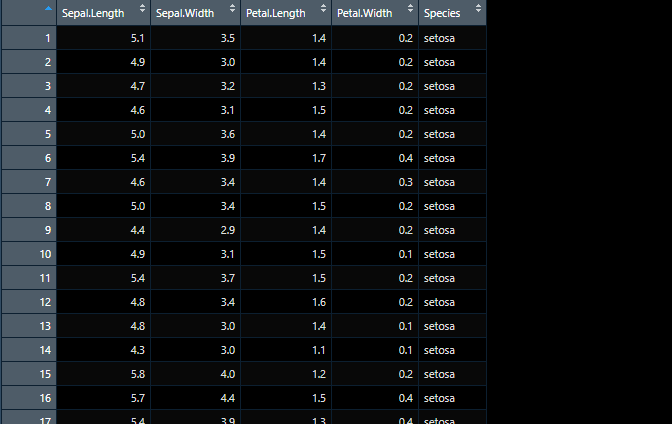
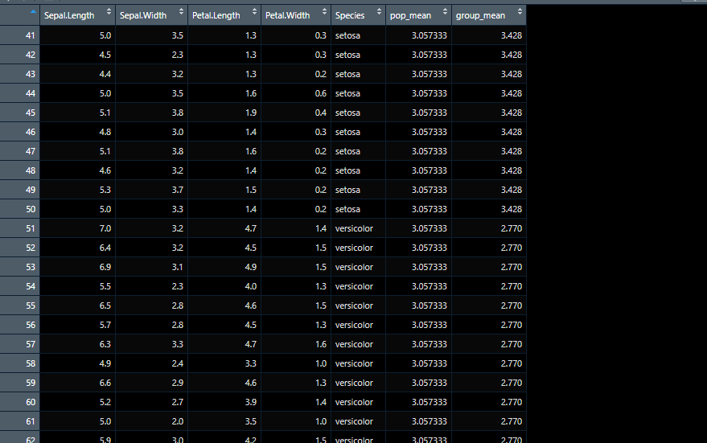
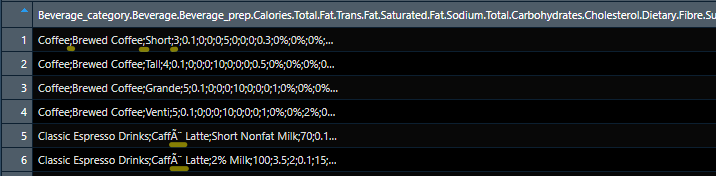

```{css, echo = F, eval = F}
body{background-color:black;filter:invert(1)}
```

```{r setup, include = FALSE}
source(paste0(getwd(), "/../source/style.R"))
stargazer <- stargazer::stargazer
theme_minimal <- theme_Rcourse
options(htmltools.dir.version = F)
knitr::opts_chunk$set(echo = T, message = F, warning = F, fig.align = "center")
```

### Last time we saw

#### 1. Distributions

  * The **distribution** of a variable documents all its possible values and how frequent they are

--

```{r, echo = F, fig.width = 12, fig.height = 4, dpi=300, out.width="95%"}
library("ggpubr")

myhist <- function(b) {
  ggplot(hist_data, aes(x = x)) + 
    geom_histogram(fill = "#6794A7", color = "#014D64", alpha = .8, bins = b) +
    ylab("") + xlab("") + ggtitle(paste(b, "bins")) + theme_minimal(base_size = 14)
}

mydens <- function(b) {
  ggplot(hist_data, aes(x = x)) +
  geom_density(fill = "#6794A7", color = "#014D64", alpha = .8, bw = b) +
    ylab("") + xlab("") + ggtitle(paste("Bandwidth:", b)) + theme_minimal(base_size = 14)
}

hist_data <- read.csv("hist_illustration.csv") %>%
  mutate(y = runif(1000, 0, 1.45))

data <- read.csv("distribution_data.csv")

ggarrange(ggplot(data, aes(x = V1)) +
  geom_bar(stat = "count", fill = "#6794A7", color = "#014D64", alpha = .8) +
  scale_y_continuous(limits = c(0, 9), breaks = 0:9) + 
  scale_x_discrete(name = "", limits = 1:8) + ylab("") +
  theme_minimal(base_size = 16) + ggtitle("Barplot"),
  myhist(50) + ggtitle("Histogram"), mydens(.25) + ggtitle('Density'), 
  nrow = 1)
```

--

<p style = "margin-bottom:-1cm;">

 * We can describe a distribution with:
  
---

### Last time we saw

#### 1. Distributions

  * The **distribution** of a variable documents all its possible values and how frequent they are

```{r, echo = F, fig.width = 12, fig.height = 4, dpi=300, out.width="95%"}
ggarrange(ggplot(data, aes(x = V1)) +
            geom_bar(stat = "count", fill = "#6794A7", color = "#014D64", alpha = .8) +
            scale_y_continuous(limits = c(0, 9), breaks = 0:9) + 
            scale_x_discrete(name = "", limits = 1:8) + ylab("") +
            theme_minimal(base_size = 16) + ggtitle("Barplot") +
            geom_vline(xintercept = mean(data$V1)),
          myhist(50) + ggtitle("Histogram") +
            geom_vline(xintercept = mean(hist_data$x)), 
          mydens(.25) + ggtitle('Density') +
            geom_vline(xintercept = mean(hist_data$x)), 
  nrow = 1)
```

<p style = "margin-bottom:-1cm;">

 * We can describe a distribution with:
  * Its **central tendency**

---

### Last time we saw

#### 1. Distributions

  * The **distribution** of a variable documents all its possible values and how frequent they are

```{r, echo = F, fig.width = 12, fig.height = 4, dpi=300, out.width="95%"}
ggarrange(ggplot(data, aes(x = V1)) +
            geom_bar(stat = "count", fill = "#6794A7", color = "#014D64", alpha = .8) +
            scale_y_continuous(limits = c(0, 9), breaks = 0:9) + 
            scale_x_discrete(name = "", limits = 1:8) + ylab("") +
            theme_minimal(base_size = 16) + ggtitle("Barplot") +
            geom_vline(xintercept = mean(data$V1)) + 
            annotate("segment", x = mean(data$V1), xend = mean(data$V1) - sd(data$V1), y = 5.65, yend = 5.65, 
                     arrow = arrow(length = unit(0.25, "cm"))) + 
            annotate("segment", x = mean(data$V1), xend = mean(data$V1) + sd(data$V1), y = 5.65, yend = 5.65, 
                     arrow = arrow(length = unit(0.25, "cm"))),
          
          myhist(50) + ggtitle("Histogram") +
            geom_vline(xintercept = mean(hist_data$x)) + 
            annotate("segment", x = mean(hist_data$x), xend = mean(hist_data$x) - sd(hist_data$x), y = 35.2, yend = 35.2, 
                     arrow = arrow(length = unit(0.25, "cm"))) + 
            annotate("segment", x = mean(hist_data$x), xend = mean(hist_data$x) + sd(hist_data$x), y = 35.2, yend = 35.2, 
                     arrow = arrow(length = unit(0.25, "cm"))), 
          
          mydens(.25) + ggtitle('Density') +
            geom_vline(xintercept = mean(hist_data$x)) + 
            annotate("segment", x = mean(hist_data$x), xend = mean(hist_data$x) - sd(hist_data$x), y = .165, yend = .165, 
                     arrow = arrow(length = unit(0.25, "cm"))) + 
            annotate("segment", x = mean(hist_data$x), xend = mean(hist_data$x) + sd(hist_data$x), y = .165, yend = .165, 
                     arrow = arrow(length = unit(0.25, "cm"))), 
  nrow = 1)
```

<p style = "margin-bottom:-1cm;">

 * We can describe a distribution with:
  * Its **central tendency**
  * And its **spread**
  
---

### Last time we saw

#### 2. Central tendency

--

.pull-left[

 * The **mean** is the sum of all values divided by the number of observations

$$\bar{x} = \frac{1}{N}\sum_{i = 1}^Nx_i$$ 

]

--

.pull-right[

 * The **median** is the value that divides the (sorted) distribution into two groups of equal size

$$\text{Med}(x) = \begin{cases} x[\frac{N+1}{2}] & \text{if } N \text{ is odd}\\
\frac{x[\frac{N}{2}]+x[\frac{N}{2}+1]}{2} & \text{if } N \text{ is even}
\end{cases}$$

]

--

#### 3. Spread

--

.pull-left[

 * The **standard deviation** is square root of the average squared deviation from the mean

$$\text{SD}(x) = \sqrt{\text{Var}(x)} = \sqrt{\frac{1}{N}\sum_{i = 1}^N(x_i-\bar{x})^2}$$
 
]

--

.pull-right[

<p style = "margin-bottom:-5.5cm;"></p>

 * The **interquartile range** is the difference between the maximum and the minimum value from the middle half of the distribution

<p style = "margin-bottom:1cm;"></p>

$$\text{IQR} = Q_3 - Q_1 $$

]

---

### Last time we saw

#### 4. Inference

<ul> 
  <li>In Statistics, we view variables as a given realization of a <b>data generating process</b></li>
  <ul>
    <li>Hence, the <b>mean</b> is what we call an <b>empirical moment</b>, which is an <b>estimation</b>...</li>
    <li>... of the <b>expected value</b>, the <b>theoretical moment</b> of the DGP we're interested in</li>
  </ul>
</ul>

--

<ul> 
  <li>To know how confident we can be in this estimation, we need to compute a <b>confidence interval</b></li>
</ul>

$$[\bar{x} - t_{n-1, \:97.5\%}\times\frac{\text{SD}(x)}{\sqrt{n}}; \:\bar{x} + t_{n-1, \:97.5\%}\times\frac{\text{SD}(x)}{\sqrt{n}}]$$

--

<ul>
  <ul>
    <li>It gets <b>larger</b> as the <b>variance</b> of the distribution of \(x\) increases</li>
    <li>And gets <b>smaller</b> as the <b>sample size</b> \(n\) increases</li>
  </ul>
</ul>

--

```{r, echo = F, fig.width = 12, fig.height = 1.75, dpi=300, out.width="95%"}
distribs <- tibble(val = c(rnorm(30, 0, 1), rnorm(100, 0, 1), rnorm(30, 0, 2), rnorm(100, 0, 2)),
                   dist = c(rep("d1",30), rep("d2", 100), rep("d3", 30), rep("d4", 100)),
                   y = 1) 

distribs <-distribs %>%
  bind_rows(distribs %>%
              group_by(dist) %>%
              summarise(lb = mean(val) - qt(.999, n()-1)*(sd(val)/sqrt(n())),
                        ub = mean(val) + qt(.999, n()-1)*(sd(val)/sqrt(n())),
                        val = mean(val),
                        y = 1.75) %>%
              pivot_longer(c(lb, ub), names_to = "interlab", values_to = "interval"))

ggplot() +
  geom_point(data = distribs %>% filter(y == 1), 
             aes(x = val, y = y, color = dist, fill = dist), 
             position = "jitter", show.legend = F) +
  geom_point(data = distribs %>% filter(y == 1.75), 
             aes(x = val, y = y, color = dist, fill = dist), 
             show.legend = F, size = 2) +
  geom_line(data = distribs, aes(x = interval, y = y, color = dist, fill = dist), show.legend = F, size = 1) +
  facet_wrap(~dist, nrow = 1) +
  theme(axis.title = element_blank(),
        axis.text.y = element_blank(),
        strip.text = element_blank(),
        strip.background = element_blank())
```

---

<h3>Today we learn how to manipulate data</h3>

--

<p style = "margin-bottom:2cm;">

#### 1. Datasets
<p style = "margin-bottom:-.5cm;">
 * 1.1. What is a dataset
 * 1.2. Import and eyeball data
 * 1.3. Subset data

#### 2. The dplyr grammar
<p style = "margin-bottom:-.5cm;">
 * 2.1. Basic functions
 * 2.2. Group by and summarise
 * 2.3. Merge and append data
 * 2.4. Reshape data

#### 3. Wrap up!

---

<h3>Today we learn how to manipulate data</h3>

<p style = "margin-bottom:2cm;">

#### 1. Datasets
<p style = "margin-bottom:-.5cm;">
 * 1.1. What is a dataset
 * 1.2. Import and eyeball data
 * 1.3. Subset data

---

### 1. Datasets

#### 1.1. What is a dataset?

&#10140; <b>Datasets</b> are typically tables in which each <b>row</b> corresponds to an <b>observation</b> and each <b>column</b> to a <b>variable</b>

--

<p style = "margin-bottom:-.25cm;">

<style> .left-column {width: 22%;} .right-column {width: 75%;} </style>

.left-column[

<p style = "margin-bottom:1.5cm;">

#### Observations can be:
<p style = "margin-bottom:-.5cm;">
 * Individuals
 * Countries
 * Years

<p style = "margin-bottom:1cm;">

#### Variables can be:
<p style = "margin-bottom:-.5cm;">
 * Age
 * GDP
 * Temperature
]

--

.right-column[
```{r, echo = F}
kable(read.csv("cereals.csv") %>% 
        select(name, calories, protein, fat, sodium, fiber, vitamins) %>%
        head(8), caption = "Excerpt of a dataset on cereals")
```
]

---

### 1. Datasets

#### 1.1. What is a dataset?

 * Each column of a dataset can be seen as a <b>vector</b> whose <b>n<sup>th</sup> element</b> is about the <b>n<sup>th</sup> individual</b>
   * This is how we can create a dataset: by assigning vectors to variable names in a data object

--

```{r, results='hide'}
departments <- data.frame(code = 1:4,
                          department = c("Ain", "Aisne", "Allier", "Alpes-de-Haute-Provence"),
                          capital = c("Bourg-en-Bresse", "Laon", "Moulin", "Digne-les-bains"))

print(departments, row.names = F)
```
--
```{r, echo=FALSE}
departments <- data.frame(code = 1:4,
                          department = c("Ain", "Aisne", "Allier", "Alpes-de-Haute-Provence"),
                          capital = c("Bourg-en-Bresse", "Laon", "Moulin", "Digne-les-bains"))

print(departments, row.names = F)
```

<p style = "margin-bottom:1.25cm;">

--

 * This illustrates what datasets are made of, but the point is not to write datasets ourselves 
 
<p style = "margin-bottom:-.35cm;">

--

<center><b> &#10140; We need to import data in R </b></center>

---

### 1. Datasets

#### 1.2. Import and eyeball data

<ul>
  <li>There are <b>various formats</b> of datasets, and as many ways to import them in R</li>
  <ul>
    <li>A very common format is the <b>.csv</b> (for <i>Comma Separated Values</i>), which basically looks like that:</li>
  </ul>
</ul>

```{r, eval = FALSE}
1,Ain,Bourg-en-Bresse
2,Aisne,Laon
3,Allier,Moulin         
4,Alpes-de-Haute-Provence,Digne-les-bains
```

--

To **import** csv data, you can use **`read.csv()`**. This function has **many parameters** you can change to import the data the way you want. Here are a few of them:
 * `skip`: how many **lines to skip** before reading the data
 * `header`: whether the first row contains **variables names**
 * `sep`: the **character** that **separates** each observations in the csv (usually `","` or `";"`)
 * `fileEncoding`: if the data contain **special characters** you should set the right encoding

--

```{r}
iris <- read.csv("iris.csv", skip = 0, header = TRUE, sep = ",", encoding = "UTF-8")
```

<!-- *Other data formats such xls, dta, sas, etc., typically have their own read function, very similar to this one.* -->

---

### 1. Datasets

#### 1.2. Import and eyeball data

 * The `head` function prints the **first rows** of a dataset  

```{r, results='hide'}
head(iris, 12) # Show the first 12 rows of the data
```
--
```{r, echo = FALSE}
head(iris, 12) # Show the first 12 rows of the data
```

---

### 1. Datasets

#### 1.2. Import and eyeball data

 *  The `view` function opens the **data in a new tab** in the code panel. It should look like that:

```{r, eval = F}
view(iris)
```

--

<center>

</center>

---

### 1. Datasets

#### 1.2. Import and eyeball data

<p style = "margin-bottom:.5cm;">

 * You can obtain the **dimension** of the data with the `dim()` function

```{r, results = 'hide'}
dim(iris)
```
--
```{r, echo = F}
dim(iris)
```

The data has 150 rows and 5 columns

--

<p style = "margin-bottom:1.75cm;">

 * You can access to the **variable names** with the `names()` function

```{r, results = 'hide'}
names(iris)
```
--
```{r, echo = F}
names(iris)
```

---

### 1. Datasets

#### 1.2. Import and eyeball data

 *  The function `summary()` allows you to get a concise **description of each variable** in your data
 
```{r, results = 'hide'}
summary(iris, digits = 2) # Choose how to round numeric values with 'digits'
```
--
```{r, echo = F}
summary(iris, digits = 2)
```

--

<p style = "margin-bottom:.75cm;">

**&#10140; What we learn:**
<p style = "margin-bottom:-.25cm;">
 * `Petal`/`Sepal.Lengths`/`Widths` are **numeric** while `Species` is a **character** variable
 * From the **mean** and the **range** of numeric variables: 
  * Petals tend to be smaller than sepals (for irises)
  * The range of numeric variables is quite large

---

### 1. Datasets

#### 1.2. Import and eyeball data


<ul>
  <li>In R you can handle datasets in <b>different formats</b>:</li>
  <ul>
    <li>data.frame</li>
    <li>tibble</li>
    <li>matrix</li>
    <li>data.table</li>
  </ul>
</ul>

--

<ul>
  <li>All these formats have their specificities</li>
  <ul>
    <li>In this course we'll focus on <b>data.frames</b> and <b>tibbles</b> (very similar) </li>
  </ul>
</ul>

<p style = "margin-bottom:-.25cm;">

--

<ul>
  <li>One specificity of the <b>tibble</b> can be observed when printing the data:</li>
  <ul>
    <li>It will display its <b>dimensions</b> (#rows \(\times\) #columns) and the <b>class</b> of each variable under its name</li>
  </ul>
</ul>

```{r, results='hide'}
head(as_tibble(iris), 2)
```
--
```{r, echo = F}
head(as_tibble(iris), 2)
```

---

### 1. Datasets

#### 1.3. Subset data: Extract values

<ul>
  <li>Just as with vectors, you can <b>access elements</b> of the data using <b>[]</b></li>
  <ul>
    <li>But while vectors have 1 dimension, datasets have <b>two dimensions</b>: rows and columns</li>
    <li>To access specific cells of the data, you must indicate the <b>row number(s)</b> and the <b>column number(s)</b> <i>separated by a comma in the brackets</i></li>
  </ul>
</ul>

--
```{r, results='hide'}
iris[5, 2] # Fifth observation of the second variable
```
--
```{r, echo=F}
iris[5, 2]
```
--
```{r, results='hide'}
iris[2, ] # Second observation of each variable
```
--
```{r, echo=F}
iris[2, ]
```
--
```{r, results='hide'}
iris[c(3, 6), 4] # Observations 3 and 6 of the fourth variable
```
--
```{r, echo=F}
iris[c(3, 6), 4]
```

---

### 1. Datasets

#### 1.3. Subset data: Get variables

 * The **`$`** allows to <b>access a variable</b> of the data

```{r, results='hide'}
iris$Sepal.Length
```
--
```{r, echo = F}
iris$Sepal.Length
```

--

 * Alternative solutions include using **double brackets** or the **column index**

```{r, eval = F}
iris[["Sepal.Length"]]
iris[, 1] 
```

---

### 1. Datasets

#### 1.3. Subset data: Conditional subsetting

 * A **logical vector** (`T` and `F` / a condition) **before the comma** will select every **row** that meets this condition    

```{r, results='hide'}
iris[iris$Petal.Length > 6.5, ]
```
--
```{r, echo = F}
iris[iris$Petal.Length > 6.5, ]
```

--

 * A **logical vector** (`T` and `F` / a condition) **after the comma** will select every **column** that meets this condition    

```{r, results='hide'}
iris[iris$Petal.Length > 6.5, names(iris) %in% c("Petal.Length", "Species")]
```
--
```{r, echo = F}
iris[iris$Petal.Length > 6.5, names(iris) %in% c("Petal.Length", "Species")]
```

---

<h3>Overview</h3>

<p style = "margin-bottom:2cm;">

#### 1. Datasets &#10004;
<p style = "margin-bottom:-.5cm;">
 * 1.1. What is a dataset
 * 1.2. Import and eyeball data
 * 1.3. Subset data

#### 2. The dplyr grammar
<p style = "margin-bottom:-.5cm;">
 * 2.1. Basic functions
 * 2.2. Group by and summarise
 * 2.3. Merge and append data
 * 2.4. Reshape data

#### 3. Wrap up!

---

<h3>Overview</h3>

<p style = "margin-bottom:2cm;">

#### 1. Datasets &#10004;
<p style = "margin-bottom:-.5cm;">
 * 1.1. What is a dataset
 * 1.2. Import and eyeball data
 * 1.3. Subset data
 
#### 2. The dplyr grammar
<p style = "margin-bottom:-.5cm;">
 * 2.1. Basic functions
 * 2.2. Group by and summarise
 * 2.3. Merge and append data
 * 2.4. Reshape data

---

### 2. The `dplyr` grammar

#### 2.1. Basic functions 

`dplyr` is a **grammar** of data manipulation, providing very **user-friendly functions** to handle the most common **data manipulation** tasks. The functions you will probably use the most are the following:

--

 * `mutate()`: add/modify variables
 * `select()`: keep/drop variables (columns)
 * `filter()`: keep/drop observations (rows)
 * `arrange()`: sort rows according to the values of given variable(s)
 * `summarise()`: aggregate the data into descriptive statistics

--

.left-column[

]

--

.right-column[

<p style = "margin-bottom:1.25cm;">

<ul>
  <li>A very handy <b>operator</b> to use with the <b>dplyr</b> grammar is the <b>pipe %>%</b></li>
</ul>

<p style = "margin-bottom:-.25cm;">

<ul>
  <ul>
    <li>You can basically read <b>a %>% b()</b> as <i>"apply function b() to object a"</i></li>
  </ul>
</ul>

<p style = "margin-bottom:-.25cm;">


<ul>
  <ul>
    <li>With this operator you can easily <b>chain the operations</b> you apply to an object</li>
  </ul>
</ul>

]

---

### 2. The `dplyr` grammar

#### 2.1. Basic functions 

```{r, eval = FALSE}
iris %>% 
  # Generate an new variable, the product of sepal length and width
  mutate(product = Sepal.Length * Sepal.Width) %>%
```
--
<p style = "margin-bottom:-1.01cm;"></p>
```{r, eval = FALSE}
  # Keep only this variable and the species in the dataset
  select(product, Species) %>%
```
--
<p style = "margin-bottom:-1.01cm;"></p>
```{r, eval = FALSE}
  # Keep only observations from the virginica species 
  filter(Species == "virginica") %>%
```
--
<p style = "margin-bottom:-1.01cm;"></p>
```{r, eval = FALSE}
  # Arrange rows by decreasing value of the product variable
  arrange(-product) %>%
```
--
<p style = "margin-bottom:-1.01cm;"></p>
```{r, eval = FALSE}
  # Show the first 5 observations
  head(5)
```
--
```{r, echo = F}
iris %>% 
  mutate(product = Sepal.Length * Sepal.Width) %>%
  select(product, Species) %>%
  filter(Species == "virginica") %>%
  arrange(-product) %>%
  head(5)
```

---

### 2. The `dplyr` grammar

<center><h4> &#9888; <i>Be careful when chaining operations with pipes, it's easy to get mixed up!</i> &#9888; </h4></center>

--

 * **Don't code blindfolded, `view()` your data at each step** to make sure that it goes the way you intend it to go 
 * Try to work on the subset of variables you actually need to make things easier

--

```{r, eval = F}
iris %>% 
  mutate(product = Sepal.Length * Sepal.Width) %>%
  view()
```
--
```{r, eval = F}
iris %>% 
  mutate(product = Sepal.Length * Sepal.Width) %>%
  select(product, Species) %>%
  view()
```
--
```{r, eval = F}
iris %>% 
  mutate(product = Sepal.Length * Sepal.Width) %>%
  select(product, Species) %>%
  filter(Species == "virginica") %>%
  view()
```

---

### 2. The `dplyr` grammar

#### 2.1. Basic functions: common mutate usage

 * Generate a variable as a function of other variables

```{r}
iris <- iris %>% mutate(new_var = (Sepal.Length * Sepal.Width) / 2)
```

--

 * Add a variable from elsewhere (dimensions must match)

```{r}
iris <- iris %>% mutate(new_var = 1:nrow(iris))
```

--

 * Use `ifelse(condition, value if condition is met, value if not)`

```{r}
iris <- iris %>% mutate(new_var = ifelse(Species == "virginica", 1, 0))
```

--

 * Use `case_when()` when there are more than 2 cases

```{r}
iris <- iris %>% mutate(new_var = case_when(Species == "versicolor" ~ "VER",
                                            Species == "virginica" ~ "VIR",
                                            Species == "setosa" ~ "SET"))
```

---

### 2. The `dplyr` grammar

#### 2.2. Group by and summarise

The `group_by()` function allows to modify the data **group by group** rather than on all observations

--

<p style = "margin-bottom:1cm;"></p>

<ul>
  <li>Imagine that you are interested in <b>comparing</b></li>
  <ul>
    <li>The average sepal width <b>by iris species</b></li>
    <li>And the average sepal width <b>overall</b></li>
  </ul>
</ul>

```{r, eval = FALSE}
iris_groups <- iris %>% # Let's save our modifications in a new dataset
```
--
<p style = "margin-bottom:-1.01cm;"></p>
```{r, eval = FALSE}
  mutate(pop_mean = mean(Sepal.Width)) %>% # First compute the mean of all observations
```
--
<p style = "margin-bottom:-1.01cm;"></p>
```{r, eval = FALSE}
  group_by(Species) %>% # Then group par specie
```
--
<p style = "margin-bottom:-1.01cm;"></p>
```{r, eval = FALSE}
  mutate(group_mean = mean(Sepal.Width)) # And compute the mean
```

```{r, echo =F}
iris_groups <- iris %>% 
  mutate(pop_mean = mean(Sepal.Width)) %>%
  group_by(Species) %>%
  mutate(group_mean = mean(Sepal.Width))
```

--

<p style = "margin-bottom:1.25cm;"></p>

 * Let's view our data to see how it went

```{r, eval = F}
view(iris_groups)
```

---

### 2. The `dplyr` grammar

<center></center>

---

### 2. The `dplyr` grammar

#### 2.2. Group by and summarise

<ul>
  <li>For each observation we now have the <b>average</b> sepal width of its <b>specie</b> and that of the whole <b>population</b></li>
  <ul>
    <li>But these results are <b>not conveyed clearly</b> because we still have individual-level info in the data</li>
    <li>We should keep <b>only</b> the <b>aggregated</b> variables with one row per specie</li>
  </ul>
</ul>

--

```{r, eval = FALSE}
iris_groups %>% 
  select(Species, pop_mean, group_mean) %>% # Select only the variables of interest
```
--
<p style = "margin-bottom:-1.01cm;"></p>
```{r, eval = FALSE}
  unique() # Drop duplicate rows
```
--

```{r, echo = F}
iris_groups %>% 
  select(Species, pop_mean, group_mean) %>% unique()
```

--

<p style = "margin-bottom:.75cm;"></p>

<ul>
  <li>We actually summarized the data into <b>descriptive statistics</b></li>
  <ul>
    <li>This is precisely what the <b>summarise()</b> function is made for</li>
  </ul>
</ul>

---

### 2. The `dplyr` grammar

#### 2.2. Group by and summarise

<ul>
  <li>The <b>summarise()</b> function was made to <b>do it all</b> that by itself:</li>
  <ul>
    <li><u>Step 1:</u> Indicate at which level you want to aggregate the data by putting the <b>grouping variable</b> in</li>
  </ul>
</ul>
  
<p style = "margin-left:3.95cm;margin-top:-.5cm;margin-bottom:-.5cm;"><b>group_by()</b></p>

<ul>
  <ul>
    <li><u>Step 2:</u> Generate the aggregate variables by specifying <b>which variable</b> you want <b>to aggregate</b> and what</li>
  </ul>
</ul>

<p style = "margin-left:3.95cm;margin-top:-.5cm;margin-bottom:-.1cm;"><b>group-level information</b> you want about it <i>(min, max, sum, number of observations, ...)</i></p>


--

```{r, eval = F}
iris %>% group_by(Species) %>%
  summarise(mean_length = mean(Sepal.Length),
            min_length = min(Sepal.Length),
            max_length = max(Sepal.Length),
            sum_width = sum(Sepal.Width),
            nb_obs = n())
```
--
```{r, echo = F}
iris %>% 
  group_by(Species) %>%
  summarise(mean_length = mean(Sepal.Length),
            min_length = min(Sepal.Length),
            max_length = max(Sepal.Length),
            sum_width = sum(Sepal.Width),
            nb_obs = n())
```

---

### 2. The `dplyr` grammar

####  2.2. Group by and summarise

Note that **`group_by()`** generally applies to **all operations until** you apply the **`ungroup()`** function 

--

* After computing the average sepal length by species, you may want to get the maximum value of that average:

--

```{r, eval = F}
iris %>%
  group_by(Species) %>% # Group by species
  mutate(mean_length = mean(Sepal.Length)) %>% # Compute the mean (by species)
  select(Species, mean_length) %>% # Select the two variables we're interested in
  unique() %>% # Drop duplicate row
```

--

<p style = "margin-bottom:-.80cm;"></p>

```{r, eval = F}
  mutate(forgot_ungroup = max(mean_length)) %>% # Compute max without ungroup
```

--

<p style = "margin-bottom:-.80cm;"></p>

```{r, eval = F}
  ungroup() %>% # Ungroup
  mutate(did_not_forget = max(mean_length)) # Compute max after ungroup
```
--

<p style = "margin-bottom:-1cm;"></p>

.pull-left[
```{r, echo = F}
iris %>%
  group_by(Species) %>% # Group by species
  mutate(mean_length = mean(Sepal.Length)) %>% # Compute the mean (by species)
  select(Species, mean_length) %>% # Select the two variables we're interested in
  unique() %>% # Drop duplicate row
  mutate(forgot_ungroup = max(mean_length)) %>% # Compute max without ungroup
  ungroup() %>% # Ungroup
  mutate(did_not_forget = max(mean_length)) # Compute max after ungroup
```
]

--

.right[
<br>
#### If you do not ungroup the data, 
<p style = "margin-bottom:-.75cm;"></p>
#### the maximum value is computed 
<p style = "margin-bottom:-.75cm;"></p>
#### *by* specie and not *across* species.
]

---

### Practice

**1) Import** `starbucks.csv` using the following command and **see what's wrong**

```{r, eval = F}
starbucks <- read.csv("YOUR_DIRECTORY/starbucks.csv")
```

<center><i>Your directory must look like "C:/Users/...", <b>make sure to use / instead of \</b></i></center>

--

<p style = "margin-bottom:1cm;"></p>

**2) Set** the `sep` and `encoding` **arguments** of `read.csv` function to import the data **correctly**

--

<p style = "margin-bottom:1cm;"></p>

**3)** Use `summarise()` to **compute** for each **beverage category** the average number of **calories** and the number of different **declinations** *(there is 1 row per declination)*

--

<p style = "margin-bottom:1cm;"></p>

**4)** Create a **subset** of the data called `maxcal` containing the **variables** `Beverage_category`, `Beverage_prep`, and `Calories`, for the **10 observations** with the **highest calorie** values

<center><i>You can use the row_number() function which gives the row numbers as a vector</i></center>

--

<center><h3><i>You've got 10 minutes!</i></h3></center>

---

### Solution

#### 1) Import `starbucks.csv` using the following command and see what's wrong

```{r, eval = F}
read.csv("starbucks.csv") %>% view()
```



--

#### 2) Set the `sep` and `encoding` arguments of `read.csv` function to import the data correctly

```{r}
starbucks <- read.csv("starbucks.csv", sep = ";", encoding = "UTF-8")
head(starbucks[4:5, 1:5])
```

---

### Solution

#### 3) Use `summarise()` to compute for each beverage category the average number of calories and the number of different declinations (there is 1 row per declination)

```{r}
starbucks %>%
  group_by(Beverage_category) %>%
  summarise(Declinations = n(),
            Mean_cal = mean(Calories))
```

---

### Solution

#### 4) Create a subset of the data called `maxcal` containing the variables `Beverage_category`, `Beverage_prep`, and `Calories`, for the 10 observation with the highest calorie values

```{r}
maxcal <- starbucks %>%
  arrange(-Calories) %>%
  select(Beverage_category, Beverage_prep, Calories) %>%
  filter(row_number() <= 10)

maxcal
```

---

### 2. The `dplyr` grammar

#### 2.3. Merge and append data

<ul>
  <li>Research projects often imply to <b>combine data</b> from different sources</li>
  <ul>
    <li>To <b>add observations</b> (append rows)</li>
    <li>To <b>add variables</b> (merge columns)</li>
  </ul>
</ul>

<p style = "margin-bottom:1.25cm;"></p>
<center></center>

---

### 2. The `dplyr` grammar

#### 2.3. Merge and append data

<ul>
  <li>Research projects often imply to <b>combine data</b> from different sources</li>
  <ul>
    <li>Either to <b>add observations</b> (append rows)</li>
    <li>Either to <b>add variables</b> (merge columns)</li>
  </ul>
</ul>

<p style = "margin-bottom:1.25cm;"></p>
<center></center>

---

### 2. The `dplyr` grammar

#### 2.3. Merge and append data

<ul>
  <li>Research projects often imply to <b>combine data</b> from different sources</li>
  <ul>
    <li>Either to <b>add observations</b> (append rows)</li>
    <li>Either to <b>add variables</b> (merge columns)</li>
  </ul>
</ul>

<p style = "margin-bottom:1.25cm;"></p> 
<center></center>

---

### 2. The `dplyr` grammar

#### 2.3. Append data: The `bind_rows()` function

--
.pull-left[
```{r}
read.csv("attainment_FR_UK_US.csv")
```
]
--
.pull-right[
```{r}
read.csv("attainment_IT_SP.csv")
```
]

--

```{r}
attainment <- read.csv("attainment_FR_UK_US.csv") %>%
  bind_rows(read.csv("attainment_IT_SP.csv"))
attainment
```

--

.pull-right[
<p style = "margin-bottom:-4cm;"></p>
**Variables** in the two datasets should be the same:
<p style = "margin-bottom:-.5cm;"></p>
 * **Same name**
 * **Same class**
]

---

### 2. The `dplyr` grammar

#### 2.3. Join data: `*_join()` functions

--

 * Join functions all work the same way:
  * A **dataset A** with a **variable X** and other variables
  * A **dataset B** with a **variable X** and other variables
  * X is the common variable, so datasets will be **joined *by* X**
  
--

<p style = "margin-bottom:1.25cm;"></p>

```{r, echo = F}
kable(tibble(Function = c('A %>% left_join(B, by = "X")', 
                          'A %>% right_join(B, by = "X")', 
                          'A %>% inner_join(B, by = "X")', 
                          'A %>% full_join(B, by = "X")'),
             `For X in A & B` = c("Kept", "Kept", "Kept", "Kept"),
             `For X in A only` = c("Kept", "Dropped", "Dropped", "Kept"),
             `For X in B only` = c("Dropped", "Kept", "Dropped", "Kept"),
             `Summary` = c("Only keeps what's in A", "Only keeps what's in B", "Only keeps what's common", "Keeps everything")), 
      caption = "The 4 main join functions")
```

---

### 2. The `dplyr` grammar

<center><h4> &#9888; <i>Beware of NAs!</i> &#9888; </h4></center>

<ul>
  <li>When you have <b>values</b> of X that are <b>not common</b> to both datasets</li>
  <ul>
    <li>Any other join than the inner_join() will <b>generate NAs</b></li>
  </ul>
</ul>

--

```{r}
attainment %>% full_join(read.csv("spending.csv"), by = "country")
```

--

   * Any variable from `A` (`B`) other than those stated in `by= ` will be `NA` for observations that are only in `B` (`A`)  

  

   * This holds when a variable that is not mentioned in the `by= ` argument appears in both datasets:
     * In that case, R adds a data-specific suffix to the names and keeps them both
     * The variable from `B` (here `year.y`) will be `NA` for observations that are only in `A` only (here `GBR`, `ITA`, `ESP`)

---

### 2. The `dplyr` grammar

#### 2.3. Join data: example

```{r, eval = F}
attainment %>% left_join(read.csv("spending.csv"), by = "country")
```
--
```{r, echo = F}
attainment %>% left_join(read.csv("spending.csv"), by = "country")
```
--
```{r, eval = F}
attainment %>% right_join(read.csv("spending.csv"), by = "country")
```
--
```{r, echo = F}
attainment %>% right_join(read.csv("spending.csv"), by = "country")
```
--

<p style = "margin-bottom:1cm;"></p>

<center><h4><i> &#10140; What would be the result of an inner_join() here?</i></h4></center>

---

### 2. The `dplyr` grammar

#### 2.4. Reshape data

<p style = "margin-bottom:1cm;"></p>

<ul>
  <li>It is important to be able to <b>switch from</b> the <b><i>long</i> to</b> the <b><i>wide</i></b> format and conversely</li>
  <ul>
    <li>Some computations should be done in one format or the other</li>
  </ul>
</ul>
 
 <br>
 
--

.pull-left[
```{r, echo = F}
kable(attainment %>% 
        inner_join(read.csv("spending.csv") %>%
                     select(-year), 
                   by = "country"), 
      caption = "Wide format")
```
]

--

.pull-right[
```{r, echo = F}
kable(attainment %>% 
        inner_join(read.csv("spending.csv") %>% 
                     select(-year), 
                   by = "country") %>%
        pivot_longer(c(share_tertiary, share_gdp), 
                     names_to = "Variable", 
                     values_to = "Value"), 
      caption = "Long format")
```
]

---

### 2. The `dplyr` grammar

#### 2.4. Reshape data: From wide to long with pivot_longer()

<p style = "margin-bottom:1cm;"></p>

```{r, eval = F}
wide <- attainment %>% 
  inner_join(read.csv("spending.csv") %>% select(-year), 
             by = "country")
wide
```
--
```{r, echo = F}
wide <- attainment %>% inner_join(read.csv("spending.csv") %>% select(-year), by = "country")
wide
```

--

<p style = "margin-bottom:1cm;"></p>

<i> &#10140; Pivoting to <b>long format</b> can be seen as putting <b>variables on top of each other</b> rather side to side </i>

--

 * We need to indicate:
  * **Which variables to stack**
  * The **name of** the variable in which we want the **values** of the stacked variables to be stored
  * The **name of** the variable that will indicate to which **variable** corresponds each value

---

### 2. The `dplyr` grammar

#### 2.4. Reshape data: From wide to long with pivot_longer()

<p style = "margin-bottom:1cm;"></p>

```{r, eval = F}
long <- wide %>%
               # Which variable to should be stacked
  pivot_longer(c(share_tertiary, share_gdp), 
```
--
<p style = "margin-bottom:-1.01cm;"></p>
```{r, eval = F}
               # Where their values should be stored
               values_to = "Value", 
```
--
<p style = "margin-bottom:-1.01cm;"></p>
```{r, eval = F}
               # Where to store which variable corresponds each value
               names_to = "Variable")
```
--
<p style = "margin-bottom:-1.01cm;"></p>
```{r, eval = F}
long
```

```{r, echo = F}
long <- wide %>%
  pivot_longer(c(share_tertiary, share_gdp), 
               names_to = "Variable", values_to = "Value")
long
```

---

### 2. The `dplyr` grammar

#### 2.4. Reshape data: From long to wide with pivot_wider()

--

<p style = "margin-bottom:1cm;"></p>

<ul>
  <li>To <b>pivot in a wide</b> format we need to indicate:</li>
  <ul>
    <li><b>Which variable</b> contains <b>values</b> of the variables we want to put side to side</li>
    <li><b>Which variable</b> indicates which <b>variable</b> correspond to each value</li>
  </ul>
</ul>

--

<p style = "margin-bottom:.5cm;"></p>

```{r, eval = F}
wide <- long %>%
              # Where the values are
  pivot_wider(values_from = "Value", 
```
--
<p style = "margin-bottom:-1.01cm;"></p>
```{r, eval = F}
              # Where the corresponding variable names are
              names_from = "Variable")
```
--
<p style = "margin-bottom:-1.01cm;"></p>
```{r, eval = F}
wide
```

```{r, echo = F}
wide <- long %>% pivot_wider(values_from = "Value", names_from = "Variable")
wide
```

---

<h3>Overview</h3>

<p style = "margin-bottom:2cm;">

#### 1. Datasets &#10004;
<p style = "margin-bottom:-.5cm;">
 * 1.1. What is a dataset
 * 1.2. Import and eyeball data
 * 1.3. Subset data
 
#### 2. The dplyr grammar &#10004;
<p style = "margin-bottom:-.5cm;">
 * 2.1. Basic functions
 * 2.2. Group by and summarise
 * 2.3. Merge and append data
 * 2.4. Reshape data
 
#### 3. Wrap up!

---

### 3. Wrap up!

#### Read data

```{r, eval = F}
starbucks <- read.csv("C:/User/Documents/folder/starbucks.csv", sep = ";", encoding = "UTF-8")
```

<center><b><i>&#10140; Make sure to use / and not \</i></b></center>

--

#### Chaining operations

```{r}
starbucks %>%
  arrange(-Calories) %>%
  select(Beverage_category, Beverage_prep, Calories) %>%
  filter(row_number() <= 3)
```

<p style = "margin-bottom:.8cm;"></p>
<center><b><i>&#10140; Make sure to view your data at each step</i></b></center>

---

### 3. Wrap up!

<p style = "margin-bottom:1.5cm;"></p>

```{r, echo = F}
kable(tibble(Function = c("mutate()", "select()", "filter()", 
                    "arrange()", "group_by()", "summarise()", 
                    "bind_rows()", "left/right/inner/full_join()", "pivot_longer/wider()"),
       Meaning = c("Modify or create a variable", "Keep a subset of variables", "Keep a subset of observations",
                   "Sort the data", "Group the data", "Summarizes variables into 1 observation per group",
                   "Append data", "Merge data", "Reshape data")),
      caption = "<b>Important functions of the dplyr grammar</b>")
```
