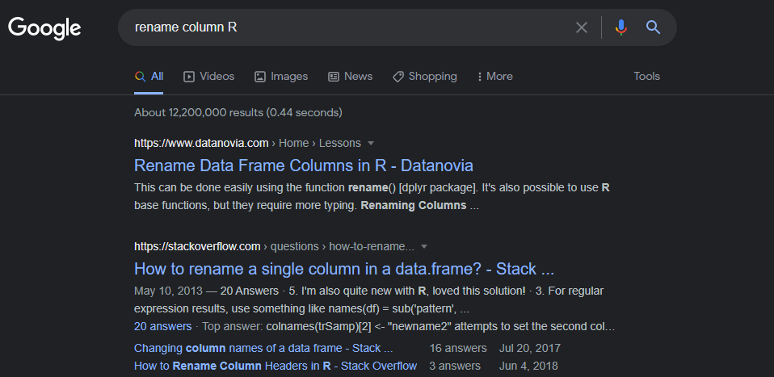

<style> .left-column {width: 65%;} .right-column {width: 31%;} </style>

```{css, echo = F, eval = params$dark}
body{background-color:black;filter:invert(1)}
```

```{r setup, include = FALSE}
source(paste0(getwd(), "/../source/style.R"))
stargazer <- stargazer::stargazer
theme_minimal <- theme_Rcourse
options(htmltools.dir.version = F)
knitr::opts_chunk$set(echo = T, message = F, warning = F, fig.align = "center")
Sys.setenv(LANG = "en")
```

### Quick reminder

#### 1. Distributions

  * The **distribution** of a variable documents all its possible values and how frequent they are

--

```{r, echo = F, fig.width = 12, fig.height = 4, dpi=300, out.width="95%"}
library("ggpubr")

myhist <- function(b) {
  ggplot(hist_data, aes(x = x)) + 
    geom_histogram(fill = "#6794A7", color = "#014D64", alpha = .8, bins = b) +
    ylab("") + xlab("") + ggtitle(paste(b, "bins")) + theme_minimal(base_size = 14)
}

mydens <- function(b) {
  ggplot(hist_data, aes(x = x)) +
  geom_density(fill = "#6794A7", color = "#014D64", alpha = .8, bw = b) +
    ylab("") + xlab("") + ggtitle(paste("Bandwidth:", b)) + theme_minimal(base_size = 14)
}

hist_data <- read.csv("hist_illustration.csv") %>%
  mutate(y = runif(1000, 0, 1.45))

data <- read.csv("distribution_data.csv")

ggarrange(ggplot(data, aes(x = V1)) +
  geom_bar(stat = "count", fill = "#6794A7", color = "#014D64", alpha = .8) +
  scale_y_continuous(limits = c(0, 9), breaks = 0:9) + 
  scale_x_discrete(name = "", limits = 1:8) + ylab("") +
  theme_minimal(base_size = 16) + ggtitle("Barplot"),
  myhist(50) + ggtitle("Histogram"), mydens(.25) + ggtitle('Density'), 
  nrow = 1)
```

--

<p style = "margin-bottom:-1cm;">

 * We can describe a distribution with:
  
---

### Quick reminder

#### 1. Distributions

  * The **distribution** of a variable documents all its possible values and how frequent they are

```{r, echo = F, fig.width = 12, fig.height = 4, dpi=300, out.width="95%"}
ggarrange(ggplot(data, aes(x = V1)) +
            geom_bar(stat = "count", fill = "#6794A7", color = "#014D64", alpha = .8) +
            scale_y_continuous(limits = c(0, 9), breaks = 0:9) + 
            scale_x_discrete(name = "", limits = 1:8) + ylab("") +
            theme_minimal(base_size = 16) + ggtitle("Barplot") +
            geom_vline(xintercept = mean(data$V1)),
          myhist(50) + ggtitle("Histogram") +
            geom_vline(xintercept = mean(hist_data$x)), 
          mydens(.25) + ggtitle('Density') +
            geom_vline(xintercept = mean(hist_data$x)), 
  nrow = 1)
```

<p style = "margin-bottom:-1cm;">

 * We can describe a distribution with:
  * Its **central tendency**

---

### Quick reminder

#### 1. Distributions

  * The **distribution** of a variable documents all its possible values and how frequent they are

```{r, echo = F, fig.width = 12, fig.height = 4, dpi=300, out.width="95%"}
ggarrange(ggplot(data, aes(x = V1)) +
            geom_bar(stat = "count", fill = "#6794A7", color = "#014D64", alpha = .8) +
            scale_y_continuous(limits = c(0, 9), breaks = 0:9) + 
            scale_x_discrete(name = "", limits = 1:8) + ylab("") +
            theme_minimal(base_size = 16) + ggtitle("Barplot") +
            geom_vline(xintercept = mean(data$V1)) + 
            annotate("segment", x = mean(data$V1), xend = mean(data$V1) - sd(data$V1), y = 5.65, yend = 5.65, 
                     arrow = arrow(length = unit(0.25, "cm"))) + 
            annotate("segment", x = mean(data$V1), xend = mean(data$V1) + sd(data$V1), y = 5.65, yend = 5.65, 
                     arrow = arrow(length = unit(0.25, "cm"))),
          
          myhist(50) + ggtitle("Histogram") +
            geom_vline(xintercept = mean(hist_data$x)) + 
            annotate("segment", x = mean(hist_data$x), xend = mean(hist_data$x) - sd(hist_data$x), y = 35.2, yend = 35.2, 
                     arrow = arrow(length = unit(0.25, "cm"))) + 
            annotate("segment", x = mean(hist_data$x), xend = mean(hist_data$x) + sd(hist_data$x), y = 35.2, yend = 35.2, 
                     arrow = arrow(length = unit(0.25, "cm"))), 
          
          mydens(.25) + ggtitle('Density') +
            geom_vline(xintercept = mean(hist_data$x)) + 
            annotate("segment", x = mean(hist_data$x), xend = mean(hist_data$x) - sd(hist_data$x), y = .165, yend = .165, 
                     arrow = arrow(length = unit(0.25, "cm"))) + 
            annotate("segment", x = mean(hist_data$x), xend = mean(hist_data$x) + sd(hist_data$x), y = .165, yend = .165, 
                     arrow = arrow(length = unit(0.25, "cm"))), 
  nrow = 1)
```

<p style = "margin-bottom:-1cm;">

 * We can describe a distribution with:
  * Its **central tendency**
  * And its **spread**
  
---

### Quick reminder

#### 2. Central tendency

--

.pull-left[

 * The **mean** is the sum of all values divided by the number of observations

$$\bar{x} = \frac{1}{N}\sum_{i = 1}^Nx_i$$ 

]

--

.pull-right[

 * The **median** is the value that divides the (sorted) distribution into two groups of equal size

$$\text{Med}(x) = \begin{cases} x[\frac{N+1}{2}] & \text{if } N \text{ is odd}\\
\frac{x[\frac{N}{2}]+x[\frac{N}{2}+1]}{2} & \text{if } N \text{ is even}
\end{cases}$$

]

--

#### 3. Spread

--

.pull-left[

 * The **standard deviation** is square root of the average squared deviation from the mean

$$\text{SD}(x) = \sqrt{\text{Var}(x)} = \sqrt{\frac{1}{N}\sum_{i = 1}^N(x_i-\bar{x})^2}$$
 
]

--

.pull-right[

<p style = "margin-bottom:-5.5cm;"></p>

 * The **interquartile range** is the difference between the maximum and the minimum value from the middle half of the distribution

<p style = "margin-bottom:1cm;"></p>

$$\text{IQR} = Q_3 - Q_1 $$

]

---

### Quick reminder

#### 4. Inference

<ul> 
  <li>In Statistics, we view variables as a given realization of a <b>data generating process</b></li>
  <ul>
    <li>Hence, the <b>mean</b> is what we call an <b>empirical moment</b>, which is an <b>estimation</b>...</li>
    <li>... of the <b>expected value</b>, the <b>theoretical moment</b> of the DGP we're interested in</li>
  </ul>
</ul>

--

<ul> 
  <li>To know how confident we can be in this estimation, we need to compute a <b>confidence interval</b></li>
</ul>

$$[\bar{x} - t_{n-1, \:97.5\%}\times\frac{\text{SD}(x)}{\sqrt{n}}; \:\bar{x} + t_{n-1, \:97.5\%}\times\frac{\text{SD}(x)}{\sqrt{n}}]$$

--

<ul>
  <ul>
    <li>It gets <b>larger</b> as the <b>variance</b> of the distribution of \(x\) increases</li>
    <li>And gets <b>smaller</b> as the <b>sample size</b> \(n\) increases</li>
  </ul>
</ul>

--

```{r, echo = F, fig.width = 12, fig.height = 1.75, dpi=300, out.width="95%"}
distribs <- tibble(val = c(rnorm(30, 0, 1), rnorm(100, 0, 1), rnorm(30, 0, 2), rnorm(100, 0, 2)),
                   dist = c(rep("d1",30), rep("d2", 100), rep("d3", 30), rep("d4", 100)),
                   y = 1) 

distribs <-distribs %>%
  bind_rows(distribs %>%
              group_by(dist) %>%
              summarise(lb = mean(val) - qt(.999, n()-1)*(sd(val)/sqrt(n())),
                        ub = mean(val) + qt(.999, n()-1)*(sd(val)/sqrt(n())),
                        val = mean(val),
                        y = 1.75) %>%
              pivot_longer(c(lb, ub), names_to = "interlab", values_to = "interval"))

ggplot() +
  geom_point(data = distribs %>% filter(y == 1), 
             aes(x = val, y = y, color = dist, fill = dist), 
             position = "jitter", show.legend = F) +
  geom_point(data = distribs %>% filter(y == 1.75), 
             aes(x = val, y = y, color = dist, fill = dist), 
             show.legend = F, size = 2) +
  geom_line(data = distribs, aes(x = interval, y = y, color = dist, fill = dist), show.legend = F, size = 1) +
  facet_wrap(~dist, nrow = 1) +
  theme(axis.title = element_blank(),
        axis.text.y = element_blank(),
        strip.text = element_blank(),
        strip.background = element_blank())
```

---

class: inverse, hide-logo

### Warm up practice

#### 1) Import the `ligue1.csv` dataset and store it in an object called `fb`

--

<p style = "margin-bottom:1.5cm;"></p>

#### 2) Create a subset of this dataset containing only matches that took place at 13h

--

<p style = "margin-bottom:1.5cm;"></p>

#### 3) Print the number of matches in this subset and compute the average attendance

--

<p style = "margin-bottom:1.5cm;"></p>

#### 4) Redo the same exercise on matches that took place at 20h45

--

<p style = "margin-bottom:3cm;"></p>

<center><h3><i>You've got 5 minutes!</i></h3></center>

`r countdown(minutes = 5, top = 0, right = 0, play_sound = F, color_border = "#DFE6EB", color_text = "#DFE6EB", color_running_background = "#DFE6EB", color_running_text = "#014D64", color_finished_background = "#014D64", color_finished_text = "#DFE6EB", start_immediately = T)`

---

class: inverse, hide-logo

### Solution

#### 1) Import the `ligue1.csv` dataset and store it in an object called `fb`

--

```{r, eval = F}
fb <- read.csv("C:/User/Documents/ligue1.csv", encoding = "UTF-8")
```

```{r, echo = F}
fb <- read.csv("ligue1.csv", encoding = "UTF-8")
```

--

#### 2) Create a subset of this dataset containing only matches that took place at 13h

--

```{r}
sub13 <- fb[fb$Time == "13:00", ]
```

--

#### 3) Print the number of matches in this subset and compute the average attendance

--

```{r}
nrow(sub13)
```

--

```{r}
mean(sub13$Attendance)
```

---

class: inverse, hide-logo

### Solution

<ul>
  <li>When there are <b>missing values</b> in a vector, the <b>mean</b> function returns <b>NA</b></li>
  <ul>
    <li>We need to set the <b>na.rm</b> option to <b>TRUE</b></li>
  </ul>
</ul>

--

#### 3) Print the number of matches in this subset and compute the average attendance

```{r}
mean(sub13$Attendance, na.rm = T)
```

--

#### 4) Redo the same exercise on matches that took place at 20h45

--

```{r}
sub2045 <- fb[fb$Time == "20:45", ]
nrow(sub2045)
mean(sub2045$Attendance, na.rm = T)
```

---

<h3>Today we learn how to manipulate data</h3>

<p style = "margin-bottom:3cm;"></p>

.pull-left[

<ul style = "margin-left:1.5cm;list-style: none">
  <li><b>1. The dplyr package</b></li>
  <ul style = "list-style: none">
    <li>1.1. Packages</li>
    <li>1.2. Basic functions</li>
    <li>1.3. group_by() and summarise()</li>
  </ul>
</ul>

<p style = "margin-bottom:2.25cm;"></p>

<ul style = "margin-left:1.5cm;list-style: none">
  <li><b>2. Merge and reshape</b></li>
  <ul style = "list-style: none">
    <li>2.1. Merge and append data</li>
    <li>2.2. Reshape data</li>
  </ul>
</ul>

]

.pull-right[

<ul style = "margin-left:-1cm;list-style: none">
  <li><b>3. A few words on learning R</b></li>
  <ul style = "list-style: none">
    <li>3.1. When it doesn't work the way you want</li>
    <li>3.2. Where to find help</li>
    <li>3.3. When it doesn't work at all</li>
  </ul>
</ul>
 
<p style = "margin-bottom:2.25cm;"></p>

<ul style = "margin-left:-1cm;list-style: none"><li><b>4. Wrap up!</b></li></ul>
]

---

<h3>Today we learn how to manipulate data</h3>

<p style = "margin-bottom:3cm;"></p>

.pull-left[

<ul style = "margin-left:1.5cm;list-style: none">
  <li><b>1. The dplyr package</b></li>
  <ul style = "list-style: none">
    <li>1.1. Packages</li>
    <li>1.2. Basic functions</li>
    <li>1.3. group_by() and summarise()</li>
  </ul>
</ul>

]

---

### 1. The `dplyr` package

#### 1.1. Packages

<ul>
  <li>So far we only used functions that are directly available in R</li>
  <ul>
    <li>But there are tons of <b>user-created functions</b> out there that can make your life so much easier</li>
    <li>These functions are shared in what we call <b>packages</b></li>
  </ul>
</ul>

--

<p style = "margin-bottom:1cm;"></p>

<ul>
  <li>Packages are <b>bundles of functions</b> that R users put at the disposal of other R users</li>
  <ul>
    <li>Packages are <b>centralized</b> on the <a href = "https://cran.r-project.org/">Comprehensive R Archive Network (CRAN)</a></li>
    <li>To <b>download</b> and install a CRAN package you can simply use <b>install.packages()</b></li>
  </ul>
</ul>

--

<p style = "margin-bottom:1cm;"></p>

<ul>
  <li>All the functions of the dplyr grammar are gathered in the <b>dplyr package</b></li>
  <ul>
    <li>We can download these functions and make them ready to use with the install.packages() function</li>
  </ul>
</ul>

--

```{r, eval = F}
install.packages("dplyr") # Requires an internet connection
```

--

<p style = "margin-bottom:1cm;"></p>

<ul>
  <li>The tidyverse package is <b>now installed</b> on your computer</li>
  <ul>
    <li>You won't have to do it again</li>
  </ul>
</ul>
 
---

### 1. The `dplyr` package

#### 1.1. Packages

 * The `dplyr` package is now <b>on your computer</b>, but it is <b>not loaded in R</b>

--

```{r, echo = F}
detach("package:dplyr", unload=TRUE)
```


```{r, error = TRUE}
ls("package:dplyr")
```

<p style = "margin-bottom:1.25cm;"></p>

<ul>
  <li>You need to use the <b>library()</b> command to load it</li>
</ul>

--

```{r}
library(dplyr)
ls("package:dplyr")[1:5]
```

--

<p style = "margin-bottom:1.25cm;"></p>

<ul>
  <li>But even though the package is permanently installed, it is <b>loaded only for your current session</b></li>
  <ul>
    <li>Each time you start a <b>new R session</b>, you'll have to load the packages you need with <b>library()</b></li>
  </ul>
</ul>

---

### 1. The `dplyr` package

#### 1.2. Basic functions


`dplyr` is a **grammar** of data manipulation providing very **user-friendly functions** to handle the most common **data manipulation** tasks:

--

 * `mutate()`: add/modify variables
 * `select()`: keep/drop variables (columns)
 * `filter()`: keep/drop observations (rows)
 * `arrange()`: sort rows according to the values of given variable(s)
 * `summarise()`: aggregate the data into descriptive statistics

--

<p style = "margin-bottom:1cm;"></p>


--


<p style = "margin-bottom:-5cm;"></p>

<ul style = "margin-left:6cm;">
  <li>A very handy <b>operator</b> to use with the <b>dplyr</b> grammar is the <b>pipe %>%</b></li>
</ul>

<p style = "margin-bottom:-.25cm;">

<ul style = "margin-left:6cm;">
  <ul>
    <li>You can basically read <b>a %>% b()</b> as <i>"apply function b() to object a"</i></li>
  </ul>
</ul>

<p style = "margin-bottom:-.25cm;">


<ul style = "margin-left:6cm;">
  <ul>
    <li>With this operator you can easily <b>chain the operations</b> you apply to an object</li>
  </ul>
</ul>

---

### 1. The `dplyr` package

#### 1.2. Basic functions

```{r, echo = F}
fb <- read.csv("ligue1.csv", encoding = "UTF-8")
```

```{r, eval = F}
fb 
                                                    #
                                                    #
                                                    #
                                                    #
                                                    #
                                                    #
```

```{r, eval = F, highlight=F}
##     Wk Day       Date  Time          Home  xG Score xG.1          Away Attendance  ...
## 1    1 Fri 2021-08-06 21:00        Monaco 2.0   1–1  0.3        Nantes       7500  ...
## 2    1 Sat 2021-08-07 17:00          Lyon 1.4   1–1  0.8         Brest      29018  ...
## 3    1 Sat 2021-08-07 21:00        Troyes 0.8   1–2  1.2     Paris S-G      15248  ...
## 4    1 Sun 2021-08-08 13:00        Rennes 0.6   1–1  2.0          Lens      22567  ...
## 5    1 Sun 2021-08-08 15:00      Bordeaux 0.7   0–2  3.3 Clermont Foot      18748  ...
## 6    1 Sun 2021-08-08 15:00    Strasbourg 0.4   0–2  0.9        Angers      23250  ...
## 7    1 Sun 2021-08-08 15:00          Nice 0.8   0–0  0.2         Reims      18030  ...
## 8    1 Sun 2021-08-08 15:00 Saint-Étienne 2.1   1–1  1.3       Lorient      20461  ...
## 9    1 Sun 2021-08-08 17:00          Metz 0.7   3–3  1.4         Lille      15551  ...
 ...  ... ...        ...   ...           ... ...   ...  ...           ...        ...  ...                      
```


---

### 1. The `dplyr` package

#### 1.2. Basic functions

```{r, eval= F}
fb %>%
  select(Home, xG, Score, xG.1, Away)               # Keep/drop certain columns
                                                    #
                                                    #
                                                    #
                                                    #
                                                    #
```

```{r, eval = F, highlight=F}
##              Home  xG Score xG.1          Away
## 1          Monaco 2.0   1–1  0.3        Nantes
## 2            Lyon 1.4   1–1  0.8         Brest
## 3          Troyes 0.8   1–2  1.2     Paris S-G
## 4          Rennes 0.6   1–1  2.0          Lens
## 5        Bordeaux 0.7   0–2  3.3 Clermont Foot
## 6      Strasbourg 0.4   0–2  0.9        Angers
## 7            Nice 0.8   0–0  0.2         Reims
## 8   Saint-Étienne 2.1   1–1  1.3       Lorient
## 9            Metz 0.7   3–3  1.4         Lille
 ...             ... ...   ...  ...           ...
```

---

### 1. The `dplyr` package

#### 1.2. Basic functions

```{r, eval = F}
fb %>%
  select(Home, xG, Score, xG.1, Away) %>%           # Keep/drop certain columns
  mutate(home_winner = xG > xG.1)                   # Create a new variable
                                                    #
                                                    #
                                                    #
                                                    #
```


```{r, eval = F, highlight=F}
##              Home  xG Score xG.1          Away home_winner
## 1          Monaco 2.0   1–1  0.3        Nantes        TRUE
## 2            Lyon 1.4   1–1  0.8         Brest        TRUE
## 3          Troyes 0.8   1–2  1.2     Paris S-G       FALSE
## 4          Rennes 0.6   1–1  2.0          Lens       FALSE
## 5        Bordeaux 0.7   0–2  3.3 Clermont Foot       FALSE
## 6      Strasbourg 0.4   0–2  0.9        Angers       FALSE
## 7            Nice 0.8   0–0  0.2         Reims        TRUE
## 8   Saint-Étienne 2.1   1–1  1.3       Lorient        TRUE
## 9            Metz 0.7   3–3  1.4         Lille       FALSE
 ...             ... ...   ...  ...           ...         ...
```

---

### 1. The `dplyr` package

#### 1.2. Basic functions

```{r, eval = F}
fb %>%
  select(Home, xG, Score, xG.1, Away) %>%           # Keep/drop certain columns
  mutate(home_winner = xG > xG.1) %>%               # Create a new variable
  filter(Home == "Rennes")                          # Keep/drop certain rows 
                                                    #
                                                    #
                                                    #
```

```{r, eval = F, highlight=F}
##      Home  xG Score xG.1          Away home_winner
## 1  Rennes 0.6   1–1  2.0          Lens       FALSE
## 2  Rennes 0.9   1–0  0.5        Nantes        TRUE
## 3  Rennes 1.0   0–2  0.5         Reims        TRUE
## 4  Rennes 2.4   6–0  0.3 Clermont Foot        TRUE
## 5  Rennes 0.8   2–0  1.4     Paris S-G       FALSE
## 6  Rennes 1.5   1–0  0.6    Strasbourg        TRUE
## 7  Rennes 3.8   4–1  1.1          Lyon        TRUE
## 8  Rennes 3.1   2–0  0.7   Montpellier        TRUE
## 9  Rennes 0.8   1–2  0.6         Lille        TRUE
         ... ...   ...  ...           ...         ...
```

---

### 1. The `dplyr` package

#### 1.2. Basic functions

```{r, eval = F}
fb %>%
  select(Home, xG, Score, xG.1, Away) %>%           # Keep/drop certain columns
  mutate(home_winner = xG > xG.1) %>%               # Create a new variable
  filter(Home == "Rennes") %>%                      # Keep/drop certain rows
  arrange(-xG)                                      # Sort rows
                                                    #
                                                    #
```

```{r, eval = F, highlight=F}
##      Home  xG Score xG.1          Away home_winner
## 1  Rennes 3.8   4–1  1.1          Lyon        TRUE
## 2  Rennes 3.3   6–0  0.4      Bordeaux        TRUE
## 3  Rennes 3.3   6–1  0.9          Metz        TRUE
## 4  Rennes 3.1   2–0  0.7   Montpellier        TRUE
## 5  Rennes 2.7   2–0  0.3         Brest        TRUE
## 6  Rennes 2.6   4–1  0.4        Troyes        TRUE
## 7  Rennes 2.4   6–0  0.3 Clermont Foot        TRUE
## 8  Rennes 1.9   2–3  2.9        Monaco       FALSE
## 9  Rennes 1.7   2–0  0.3        Angers        TRUE
         ... ...   ...  ...           ...         ...
```

---

### 1. The `dplyr` package

#### 1.2. Basic functions

```{r}
fb %>%
  select(Home, xG, Score, xG.1, Away) %>%           # Keep/drop certain columns
  mutate(home_winner = xG > xG.1) %>%               # Create a new variable
  filter(Home == "Rennes") %>%                      # Keep/drop certain rows
  arrange(-xG) %>%                                  # Sort rows
  summarise(expected_wins = mean(home_winner),      # Aggregate into statistics
            expected_goals = sum(xG))               #
```

---

### 1. The `dplyr` package

#### 1.2. Basic functions

 * Here are two very **handy functions** to use within `mutate()`
   
  <p style = "margin-bottom:1cm;"></p>

--

.pull-left[
<center><b>ifelse</b></center>

```{r}
fb %>%
  select(Home, Attendance) %>%  
  mutate(att_bin = ifelse(Attendance > 10000, 
                          "Large", 
                          "Low")
         ) %>% head()
```
]

--

.pull-right[
<center><b>case_when</b></center>

```{r}
fb %>%
  select(Home, xG, xG.1, Away) %>%  
  mutate(xWin = case_when(xG > xG.1 ~ "Home",
                          xG == xG.1 ~ "Draw",
                          xG < xG.1 ~ "Away")
         ) %>% head()
```
]

---

### 1. The `dplyr` package

#### 1.3. group_by() and summarise()

 * With `group_by()` you can perform **computations separately** for the different **categories of a variable**

--

.pull-left[
```{r}
fb %>%
  select(Wk, Home, xG) %>%
  mutate(all.xG = mean(xG)) %>%
  head(10)
```
]

--

.pull-right[
```{r, eval = F}
fb %>%
  select(Wk, Home, xG) %>%
* group_by(Home) %>%
  mutate(home.xG = mean(xG)) %>%
  head(6)
```
```{r, echo = F}
fb %>%
  select(Wk, Home, xG) %>%
  group_by(Home) %>%
  mutate(home.xG = mean(xG)) %>%
  head(6)
```
]

---

### 1. The `dplyr` package

#### 1.3. group_by() and summarise()

<ul>
  <li>It is particularly <b>useful with summarise()</b></li>
  <ul>
    <li>summarise keeps the grouping variable</li>
    <li>and computes <b>statistics for each category</b></li>
  </ul>
</ul>

--

.pull-left[

```{r}
fb %>%
  group_by(Wk) %>%
  summarise(n = n(),
            tot_xG = sum(xG)+sum(xG.1),
            avg_WG = tot_xG/n) %>%
  head(4)
```


]

--


.pull-right[

<p style = "margin-top:-6.3em"></p>

<center><b>mutate() \(\neq\) summarise()</b></center>

<ul>
  <li><b>mutate()</b> takes an operation that converts:</li>
  <ul>
    <li><b>A vector into another vector</b></li>
  </ul>
  <li><b>summarise()</b> takes an operation that converts:</li>
  <ul>
    <li><b>A vector into a value</b></li>
  </ul>
</ul>
]

--


.pull-right[

<p style = "margin-top:-15.5em"></p>

<center><b>Ungrouping</b></center>

<ul>
  <li><b>group_by()</b> applies to all subsequent operations</li>
  <li>To cancel its effect you must <b>ungroup()</b> the data</li>
</ul>

```{r, eval = F}
fb %>% 
  group_by(Wk) %>% 
  mutate(test = mean(xG)) %>% 
* ungroup() %>%
  ...
```
]

---

class: inverse, hide-logo

### Practice

#### 1) Start from the `fb` dataset and keep only the variables `Home`, `Score` and `Away`

--

#### 2) Use the `separate()` function from `tidyr` to split the `Score` variable into `home_score` and `away_score`

```{r}
data.frame(x = "a_b") %>% 
  separate(x, c("x", "y"), "_")
```

--

#### 3) Convert these two variables into numeric vectors

--

#### 4) Create a variable named `winner` that takes the values `Home`, `Draw` and `Away` depending on the score

--

#### 5) Use `group_by()` and `summarise() `to compute the percentage of draws, home wins and away wins

--

<center><h3><i>You've got 10 minutes!</i></h3></center>

`r countdown(minutes = 10, top = 0, right = 0, play_sound = F, color_border = "#DFE6EB", color_text = "#DFE6EB", color_running_background = "#DFE6EB", color_running_text = "#014D64", color_finished_background = "#014D64", color_finished_text = "#DFE6EB", start_immediately = T)`

---

class: inverse, hide-logo

### Solution

#### 1) Start from the `fb` dataset and keep only the variables `Home`, `Score` and `Away`

--

```{r, eval = F}
fb %>% 
* select(Home, Score, Away) %>%
  head(2)
```

--

```{r, echo = F}
fb %>% 
  select(Home, Score, Away) %>%
  head(2)
```

--

#### 2) Use the `separate()` function from `tidyr` to split the `Score` variable into `home_score` and `away_score`

--

```{r, eval = F}
fb %>% 
  select(Home, Score, Away) %>% 
* separate(Score, c("home_score", "away_score"), "-") %>%
  head(2)
```

--

```{r, echo = F}
fb %>% 
  select(Home, Score, Away) %>% 
  separate(Score, c("home_score", "away_score"), "-") %>%
  head(2)
```

---

class: inverse, hide-logo

### Solution

#### 3) Convert these two variables into numeric vectors

#### 4) Create a variable named `winner` that takes the values `Home`, `Draw` and `Away` depending on the score

--

```{r, eval = F}
fb %>% 
  select(Home, Score, Away) %>% 
  separate(Score, c("home_score", "away_score"), "-") %>%
* mutate(home_score = as.numeric(home_score),
*        away_score = as.numeric(away_score),
*        winner = case_when(home_score < away_score ~ "Away",
*                           home_score == away_score ~ "Draw",
*                           home_score > away_score ~ "Home")) %>%
  head()
```

--

```{r, echo = F}
fb %>% 
  select(Home, Score, Away) %>% 
  separate(Score, c("home_score", "away_score"), "-") %>%
  mutate(home_score = as.numeric(home_score),
         away_score = as.numeric(away_score),
         winner = case_when(home_score < away_score ~ "Away",
                            home_score == away_score ~ "Draw",
                            home_score > away_score ~ "Home")) %>%
  head()
```

---

class: inverse, hide-logo

### Solution

#### 5) Use `group_by()` and `summarise() `to compute the percentage of draws, home wins and away wins

--

```{r, eval = F}
fb %>% 
  select(Home, Score, Away) %>% 
  separate(Score, c("home_score", "away_score"), "-") %>%
  mutate(home_score = as.numeric(home_score),
         away_score = as.numeric(away_score),
         winner = case_when(home_score < away_score ~ "Away",
                            home_score == away_score ~ "Draw",
                            home_score > away_score ~ "Home")) %>%
* group_by(winner) %>%
* summarise(pct = 100 * (n() / nrow(fb)))
```

--

```{r, echo = F}
fb %>% 
  select(Home, Score, Away) %>% 
  separate(Score, c("home_score", "away_score"), "-") %>%
  mutate(home_score = as.numeric(home_score),
         away_score = as.numeric(away_score),
         winner = case_when(home_score < away_score ~ "Away",
                            home_score == away_score ~ "Draw",
                            home_score > away_score ~ "Home")) %>%
  group_by(winner) %>%
  summarise(pct = 100 * (n() / nrow(fb)))
```

---

<h3>Overview</h3>

<p style = "margin-bottom:3cm;"></p>

.pull-left[

<ul style = "margin-left:1.5cm;list-style: none">
  <li><b>1. The dplyr package &#10004;</b></li>
  <ul style = "list-style: none">
    <li>1.1. Packages</li>
    <li>1.2. Basic functions</li>
    <li>1.3. group_by() and summarise()</li>
  </ul>
</ul>

<p style = "margin-bottom:2.25cm;"></p>

<ul style = "margin-left:1.5cm;list-style: none">
  <li><b>2. Merge and reshape</b></li>
  <ul style = "list-style: none">
    <li>2.1. Merge and append data</li>
    <li>2.2. Reshape data</li>
  </ul>
</ul>

]

.pull-right[

<ul style = "margin-left:-1cm;list-style: none">
  <li><b>3. A few words on learning R</b></li>
  <ul style = "list-style: none">
    <li>3.1. When it doesn't work the way you want</li>
    <li>3.2. Where to find help</li>
    <li>3.3. When it doesn't work at all</li>
  </ul>
</ul>
 
<p style = "margin-bottom:2.25cm;"></p>

<ul style = "margin-left:-1cm;list-style: none"><li><b>4. Wrap up!</b></li></ul>
]

---

<h3>Overview</h3>

<p style = "margin-bottom:3cm;"></p>

.pull-left[

<ul style = "margin-left:1.5cm;list-style: none">
  <li><b>1. The dplyr package &#10004;</b></li>
  <ul style = "list-style: none">
    <li>1.1. Packages</li>
    <li>1.2. Basic functions</li>
    <li>1.3. group_by() and summarise()</li>
  </ul>
</ul>

<p style = "margin-bottom:2.25cm;"></p>

<ul style = "margin-left:1.5cm;list-style: none">
  <li><b>2. Merge and reshape</b></li>
  <ul style = "list-style: none">
    <li>2.1. Merge and append data</li>
    <li>2.2. Reshape data</li>
  </ul>
</ul>
]

---

### 2. Merge and reshape

#### 2.1. Merge and append data

<ul>
  <li>Research projects often imply to <b>combine data</b> from different sources</li>
  <ul>
    <li>Either to <b>add observations</b> (append rows)</li>
    <li>Either to <b>add variables</b> (merge columns)</li>
  </ul>
</ul>

<p style = "margin-bottom:1.25cm;"></p>
<center></center>

---

### 2. Merge and reshape

#### 2.1. Merge and append data

<ul>
  <li>Research projects often imply to <b>combine data</b> from different sources</li>
  <ul>
    <li>Either to <b>add observations</b> (append rows)</li>
    <li>Either to <b>add variables</b> (merge columns)</li>
  </ul>
</ul>

<p style = "margin-bottom:1.25cm;"></p>
<center></center>

---

### 2. Merge and reshape

#### 2.1. Merge and append data

<ul>
  <li>Research projects often imply to <b>combine data</b> from different sources</li>
  <ul>
    <li>Either to <b>add observations</b> (append rows)</li>
    <li>Either to <b>add variables</b> (merge columns)</li>
  </ul>
</ul>

<p style = "margin-bottom:1.25cm;"></p> 
<center></center>

---

### 2. Merge and reshape

#### 2.1. Merge and append data: The `bind_rows()` function

--
.pull-left[
```{r}
read.csv("attainment_FR_UK_US.csv")
```
]
--
.pull-right[
```{r}
read.csv("attainment_IT_SP.csv")
```
]

--

```{r}
attainment <- read.csv("attainment_FR_UK_US.csv") %>%
  bind_rows(read.csv("attainment_IT_SP.csv"))
attainment
```

--

.pull-right[
<p style = "margin-bottom:-4cm;"></p>
**Variables** in the two datasets should be the same:
<p style = "margin-bottom:-.5cm;"></p>
 * **Same name**
 * **Same class**
]

---

### 2. Merge and reshape

#### 2.1. Merge and append data: `*_join()` functions

--

 * Join functions all work the same way:
  * A **dataset A** with a **variable X** and other variables
  * A **dataset B** with a **variable X** and other variables
  * X is the common variable, so datasets will be **joined *by* X**
  
--

<p style = "margin-bottom:1.25cm;"></p>

```{r, echo = F}
kable(tibble(Function = c('A %>% left_join(B, by = "X")', 
                          'A %>% right_join(B, by = "X")', 
                          'A %>% inner_join(B, by = "X")', 
                          'A %>% full_join(B, by = "X")'),
             `For X in A & B` = c("Kept", "Kept", "Kept", "Kept"),
             `For X in A only` = c("Kept", "Dropped", "Dropped", "Kept"),
             `For X in B only` = c("Dropped", "Kept", "Dropped", "Kept"),
             `Summary` = c("Only keeps what's in A", "Only keeps what's in B", "Only keeps what's common", "Keeps everything")), 
      caption = "The 4 main join functions")
```

---

### 2. Merge and reshape

<center><h4> &#9888; <i>Beware of NAs!</i> &#9888; </h4></center>

<ul>
  <li>When you have <b>values</b> of X that are <b>not common</b> to both datasets</li>
  <ul>
    <li>Any other join than the inner_join() will <b>generate NAs</b></li>
  </ul>
</ul>

--

```{r}
attainment %>% full_join(read.csv("spending.csv"), by = "country")
```

--

   * Any variable from `A` (`B`) other than those stated in `by= ` will be `NA` for observations that are only in `B` (`A`)  

  

   * This holds when a variable that is not mentioned in the `by= ` argument appears in both datasets:
     * In that case, R adds a data-specific suffix to the names and keeps them both
     * The variable from `B` (here `year.y`) will be `NA` for observations that are only in `A` only (here `GBR`, `ITA`, `ESP`)

---

### 2. Merge and reshape

#### 2.1. Merge and append data: example

```{r, eval = F}
attainment %>% left_join(read.csv("spending.csv"), by = "country")
```
--
```{r, echo = F}
attainment %>% left_join(read.csv("spending.csv"), by = "country")
```
--
```{r, eval = F}
attainment %>% right_join(read.csv("spending.csv"), by = "country")
```
--
```{r, echo = F}
attainment %>% right_join(read.csv("spending.csv"), by = "country")
```
--

<p style = "margin-bottom:1cm;"></p>

<center><h4><i> &#10140; What would be the result of an inner_join() here?</i></h4></center>

---

### 2. Merge and reshape

#### 2.2. Reshape data

<p style = "margin-bottom:1cm;"></p>

<ul>
  <li>It is important to be able to <b>switch from</b> the <b><i>long</i> to</b> the <b><i>wide</i></b> format and conversely</li>
  <ul>
    <li>Some computations should be done in one format or the other</li>
  </ul>
</ul>
 
 <br>
 
--

.pull-left[
```{r, echo = F}
kable(attainment %>% 
        inner_join(read.csv("spending.csv") %>%
                     select(-year), 
                   by = "country"), 
      caption = "Wide format")
```
]

--

.pull-right[
```{r, echo = F}
kable(attainment %>% 
        inner_join(read.csv("spending.csv") %>% 
                     select(-year), 
                   by = "country") %>%
        pivot_longer(c(share_tertiary, share_gdp), 
                     names_to = "Variable", 
                     values_to = "Value"), 
      caption = "Long format")
```
]

---

### 2. Merge and reshape

#### 2.2. Reshape data: From wide to long with pivot_longer()

<p style = "margin-bottom:1cm;"></p>

```{r, eval = F}
wide <- attainment %>% 
  inner_join(read.csv("spending.csv") %>% select(-year), 
             by = "country")
wide
```
--
```{r, echo = F}
wide <- attainment %>% inner_join(read.csv("spending.csv") %>% select(-year), by = "country")
wide
```

--

<p style = "margin-bottom:1.5cm;"></p>

<i> &#10140; Pivoting to <b>long format</b> can be seen as putting <b>variables on top of each other</b> rather side to side </i>

<p style = "margin-bottom:1.25cm;"></p>

--

 * We need to indicate:
  * **Which variables to stack**
  * The **name of** the variable in which we want the **values** of the stacked variables to be stored
  * The **name of** the variable that will indicate to which **variable** corresponds each value

---

### 2. Merge and reshape

#### 2.2. Reshape data: From wide to long with pivot_longer()

<p style = "margin-bottom:1cm;"></p>

```{r, eval = F}
long <- wide %>%
               # Which variable to should be stacked
  pivot_longer(c(share_tertiary, share_gdp), 
```
--
<p style = "margin-bottom:-1.01cm;"></p>
```{r, eval = F}
               # Where their values should be stored
               values_to = "Value", 
```
--
<p style = "margin-bottom:-1.01cm;"></p>
```{r, eval = F}
               # Where to store which variable corresponds each value
               names_to = "Variable")
```
--
<p style = "margin-bottom:-1.01cm;"></p>
```{r, eval = F}
long
```

```{r, echo = F}
long <- wide %>%
  pivot_longer(c(share_tertiary, share_gdp), 
               names_to = "Variable", values_to = "Value")
long
```

---

### 2. Merge and reshape

#### 2.2. Reshape data: From long to wide with pivot_wider()

--

<p style = "margin-bottom:1cm;"></p>

<ul>
  <li>To <b>pivot in a wide</b> format we need to indicate:</li>
  <ul>
    <li><b>Which variable</b> contains <b>values</b> of the variables we want to put side to side</li>
    <li><b>Which variable</b> indicates which <b>variable</b> correspond to each value</li>
  </ul>
</ul>

--

<p style = "margin-bottom:.5cm;"></p>

```{r, eval = F}
wide <- long %>%
              # Where the values are
  pivot_wider(values_from = "Value", 
```
--
<p style = "margin-bottom:-1.01cm;"></p>
```{r, eval = F}
              # Where the corresponding variable names are
              names_from = "Variable")
```
--
<p style = "margin-bottom:-1.01cm;"></p>
```{r, eval = F}
wide
```

```{r, echo = F}
wide <- long %>% pivot_wider(values_from = "Value", names_from = "Variable")
wide
```

---
class: inverse, hide-logo

### Practice

#### 1) From the `fb` dataset, create a variable `league` equal to `"ligue1"` and a variable `season` equal to `"2021-2022"` and save this new data in an object named `full_fb`

--

#### 2) In data.zip you will find the rest of the data for the seasons 2019-2020 to 2021-2022 for the league 1, the bundesliga and the premier league. Append all these data to `full_fb`. Make sure to create the variables `league` and `season` in each data set before appending.

--

#### 3) Use the `separate` function from `tidyr` to extract the number of goals scored by the home and away team

--

#### 4) Convert these variables as numeric and create a variable equal to the sum of the goals from the two teams

--

#### 5) Summarise your data into the total number of goals score per league/season

--

#### 6) Reshape your data such that you have 1 row per league and 1 column per season

--

<center><h3><i>You've got 10 minutes!</i></h3></center>

`r countdown(minutes = 10, top = 0, right = 0, play_sound = F, color_border = "#DFE6EB", color_text = "#DFE6EB", color_running_background = "#DFE6EB", color_running_text = "#014D64", color_finished_background = "#014D64", color_finished_text = "#DFE6EB", start_immediately = T)`

---
class: inverse, hide-logo

### Solution

#### 1) From the `fb` dataset, create a variable `league` equal to `"ligue1"` and a variable `season` equal to `"2021-2022"` and save this new data in an object named `full_fb`

--

```{r}
full_fb <- fb %>% mutate(league = "ligue1", season = "2021-2022")
```

--

#### 2) In data.zip you will find the rest of the data for the seasons 2019-2020 to 2021-2022 for the league 1, the bundesliga and the premier league. Append all these data to `full_fb`. Make sure to create the variables `league` and `season` in each data set before appending.

--

```{r}
full_fb <- full_fb %>%
  bind_rows(read.csv("ligue1_2021.csv") %>% mutate(league = "ligue1", season = "2020-2021")) %>%
  bind_rows(read.csv("ligue1_1920.csv") %>% mutate(league = "ligue1", season = "2019-2020")) %>%
  bind_rows(read.csv("preml_2122.csv") %>% mutate(league = "preml", season = "2021-2022")) %>%
  bind_rows(read.csv("preml_2021.csv") %>% mutate(league = "preml", season = "2020-2021")) %>%
  bind_rows(read.csv("preml_1920.csv") %>% mutate(league = "preml", season = "2019-2020")) %>%
  bind_rows(read.csv("bundes_2122.csv") %>% mutate(league = "bundes", season = "2021-2022")) %>%
  bind_rows(read.csv("bundes_2021.csv") %>% mutate(league = "bundes", season = "2020-2021")) %>%
  bind_rows(read.csv("bundes_1920.csv") %>% mutate(league = "bundes", season = "2019-2020"))
```

---
class: inverse, hide-logo

### Solution

#### 3) Use the `separate` function from `tidyr` to extract the number of goals scored by the home and away team

--

```{r}
full_fb <- full_fb %>%
  separate(Score, c("home_score", "away_score"), "-") 
```

--

#### 4) Convert these variables as numeric and create a variable equal to the sum of the goals from the two teams

--

```{r}
full_fb <- full_fb %>%
  mutate(home_score = as.numeric(home_score),
         away_score = as.numeric(away_score),
         goals = home_score + away_score) 
```

--

#### 5) Summarise your data into the total number of goals score per league/season

--

```{r}
full_fb <- full_fb %>%
  group_by(league, season) %>%
  summarise(goals = sum(goals))
```

---
class: inverse, hide-logo

### Solution

#### 6) Reshape your data such that you have 1 row per league and 1 column per season

--

```{r}
full_fb %>%
  pivot_wider(names_from = "season", values_from = "goals")
```

---

<h3>Overview</h3>

<p style = "margin-bottom:3cm;"></p>

.pull-left[

<ul style = "margin-left:1.5cm;list-style: none">
  <li><b>1. The dplyr package &#10004;</b></li>
  <ul style = "list-style: none">
    <li>1.1. Packages</li>
    <li>1.2. Basic functions</li>
    <li>1.3. group_by() and summarise()</li>
  </ul>
</ul>

<p style = "margin-bottom:2.25cm;"></p>

<ul style = "margin-left:1.5cm;list-style: none">
  <li><b>2. Merge and reshape &#10004;</b></li>
  <ul style = "list-style: none">
    <li>2.1. Merge and append data</li>
    <li>2.2. Reshape data</li>
  </ul>
</ul>

]

.pull-right[

<ul style = "margin-left:-1cm;list-style: none">
  <li><b>3. A few words on learning R</b></li>
  <ul style = "list-style: none">
    <li>3.1. When it doesn't work the way you want</li>
    <li>3.2. Where to find help</li>
    <li>3.3. When it doesn't work at all</li>
  </ul>
</ul>
 
<p style = "margin-bottom:2.25cm;"></p>

<ul style = "margin-left:-1cm;list-style: none"><li><b>4. Wrap up!</b></li></ul>
]

---

<h3>Overview</h3>

<p style = "margin-bottom:3cm;"></p>

.pull-left[

<ul style = "margin-left:1.5cm;list-style: none">
  <li><b>1. The dplyr package &#10004;</b></li>
  <ul style = "list-style: none">
    <li>1.1. Packages</li>
    <li>1.2. Basic functions</li>
    <li>1.3. group_by() and summarise()</li>
  </ul>
</ul>

<p style = "margin-bottom:2.25cm;"></p>

<ul style = "margin-left:1.5cm;list-style: none">
  <li><b>2. Merge and reshape &#10004;</b></li>
  <ul style = "list-style: none">
    <li>2.1. Merge and append data</li>
    <li>2.2. Reshape data</li>
  </ul>
</ul>

]

.pull-right[

<ul style = "margin-left:-1cm;list-style: none">
  <li><b>3. A few words on learning R</b></li>
  <ul style = "list-style: none">
    <li>3.1. When it doesn't work the way you want</li>
    <li>3.2. Where to find help</li>
    <li>3.3. When it doesn't work at all</li>
  </ul>
</ul>
]

---

### 3. A few words on learning R

#### 3.1. When it doesn't work the way you want

<ul>
  <li>When things do not work the way you want, <b>NAs are the usual suspects</b></li>
  <ul>
    <li>For instance, this is how the mean function reacts to NAs:</li>
  </ul>
</ul>
 
--

```{r}
mean(c(1, 2, NA))
```
--
```{r}
mean(c(1, 2, NA), na.rm = T)
```

<p style = "margin-bottom:1.25cm;"></p>

--

<ul>
  <li>You should systematically <b>check for NAs!</b></li>
</ul>

--
 
```{r}
is.na(c(1, 2, NA))
```

---

### 3. A few words on learning R

#### 3.1. When it doesn't work the way you want

<ul>
  <li><b>Don't pipe blindfolded!</b></li>
  <ul>
    <li><b>Check</b> that each command does what it's expected to do</li>
    <li>View or print your data <b>at each step</b></li>
  </ul>
</ul>

--

```{r, eval = F}
fb %>% 
  select(Home, Score, Away) %>%
  head(1)
```

--

```{r, echo = F}
fb %>% 
  select(Home, Score, Away) %>%
  head(1)
```

--

```{r, eval = F}
fb %>% 
  select(Home, Score, Away) %>% 
  separate(Score, c("home_score", "away_score"), "-") %>%
  head(1)
```

--

```{r, echo = F}
fb %>% 
  select(Home, Score, Away) %>% 
  separate(Score, c("home_score", "away_score"), "-") %>%
  head(1)
```

---

### 3. A few words on learning R

#### 3.2. Where to find help

<ul>
  <li>Oftentimes things don't work either because:</li>
  <ul>
    <li><b>You don't understand</b> a function's argument</li>
    <li>Or <b>you don't know</b> that there exists an argument that you should use</li>
  </ul>
</ul>

--

<ul>
  <li>This is precisely what <b>help files</b> are made for</li>
  <ul>
    <li>Every function has a help file, just enter <b>?</b> and the name of your <b>function</b> in the console</li>
    <li>The help file will <b>pop up in the Help tab</b> of R studio</li>
  </ul>
</ul>

--

<p style = "margin-bottom:1cm;"></p>
 
```{r, eval = F}
?paste
```

--

<center>

</center>

---

### 3. A few words on learning R

#### 3.2. Where to find help

<ul>
  <li>Search on the internet!</li>
  <ul>
    <li>Your question is for sure already asked and answered on <a href = "https://stackoverflow.com/">stackoverflow</a></li>
  </ul>
</ul>
 
--

<center>

</center>

---

### 3. A few words on learning R

#### 3.3. When it doesn't work at all

 * Sometimes R breaks and returns an <b>error</b> (usually kind of cryptic)

--

```{r, error = TRUE}
read.csv("C:\Users\Documents\R")
```

--

<p style = "margin-bottom:1cm;"></p>

<ol>
  <li>Look for <b>keywords</b> that might help you understand where it comes from</li>
  <li>Paste in on <b>Google</b> with the name of your command</li>
</ol>

--

<center>

</center>

---

<h3>Overview</h3>

<p style = "margin-bottom:3cm;"></p>

.pull-left[

<ul style = "margin-left:1.5cm;list-style: none">
  <li><b>1. The dplyr package &#10004;</b></li>
  <ul style = "list-style: none">
    <li>1.1. Packages</li>
    <li>1.2. Basic functions</li>
    <li>1.3. group_by() and summarise()</li>
  </ul>
</ul>

<p style = "margin-bottom:2.25cm;"></p>

<ul style = "margin-left:1.5cm;list-style: none">
  <li><b>2. Merge and reshape &#10004;</b></li>
  <ul style = "list-style: none">
    <li>2.1. Merge and append data</li>
    <li>2.2. Reshape data</li>
  </ul>
</ul>

]

.pull-right[

<ul style = "margin-left:-1cm;list-style: none">
  <li><b>3. A few words on learning R &#10004;</b></li>
  <ul style = "list-style: none">
    <li>3.1. When it doesn't work the way you want</li>
    <li>3.2. Where to find help</li>
    <li>3.3. When it doesn't work at all</li>
  </ul>
</ul>
 
<p style = "margin-bottom:2.25cm;"></p>

<ul style = "margin-left:-1cm;list-style: none"><li><b>4. Wrap up!</b></li></ul>
]

---

### 4. Wrap up!

#### 1. Packages

```{r, eval = F}
library(dplyr)
```

--

<p style = "margin-bottom:1.5cm;"></p>

#### 2. Main dplyr functions

.left-column[
```{r, echo = F}
kable(tibble(Function = c("mutate()", "select()", "filter()", 
                    "arrange()", "group_by()", "summarise()"),
       Meaning = c("Modify or create a variable", "Keep a subset of variables", "Keep a subset of observations",
                   "Sort the data", "Group the data", "Summarizes variables into 1 observation per group")),
      caption = "")
```
]

--

.right-column[

]

---

### 4. Wrap up!

#### 3. Merge data

```{r}
a <- data.frame(x = c(1, 2, 3), y = c("a", "b", "c"))
b <- data.frame(x = c(4, 5, 6), y = c("d", "e", "f"))
c <- data.frame(x = 1:6, z = c("alpha", "bravo", "charlie", "delta", "echo", "foxtrot"))
```

--

```{r, eval = F}
a %>% bind_rows(b) %>% left_join(c, by = "x")
```

```{r, echo = F}
a %>% 
  bind_rows(b) %>% 
  left_join(c, by = "x") %>%
  kable(., caption = "")
```

---

### 4. Wrap up!

#### 4. Reshape data

```{r, echo = F}
kable(attainment %>% 
        inner_join(read.csv("spending.csv") %>%
                     select(-year), 
                   by = "country"), 
      caption = "")
```

--

<p style = margin-bottom:1.25cm;"></p>

```{r, eval = F}
data %>% pivot_longer(c(share_tertiary, share_gdp), names_to = "Variable", values_to = "Value")
```

<p style = margin-bottom:1.25cm;"></p>

--

```{r, echo = F}
kable(attainment %>% 
        inner_join(read.csv("spending.csv") %>% 
                     select(-year), 
                   by = "country") %>%
        pivot_longer(c(share_tertiary, share_gdp), 
                     names_to = "Variable", 
                     values_to = "Value"), 
      caption = "")
```

---

### For next time

<p style = margin-bottom:4cm;"></p>

<center><b><u>Install the R packages needed for Part I of the course:</u></b></center>

<p style = margin-bottom:1cm;"></p>

<center><b>ggplot2</b></center>
<p style = margin-bottom:.15cm;"></p>
<center><b>rmarkdown</b></center>
<p style = margin-bottom:.15cm;"></p>
<center><b>knitr</b></center>
<p style = margin-bottom:.15cm;"></p>
<center><b>DT</b></center>

