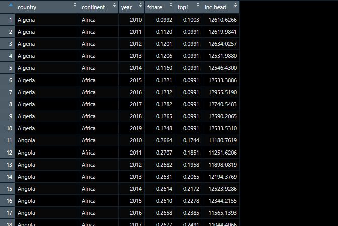
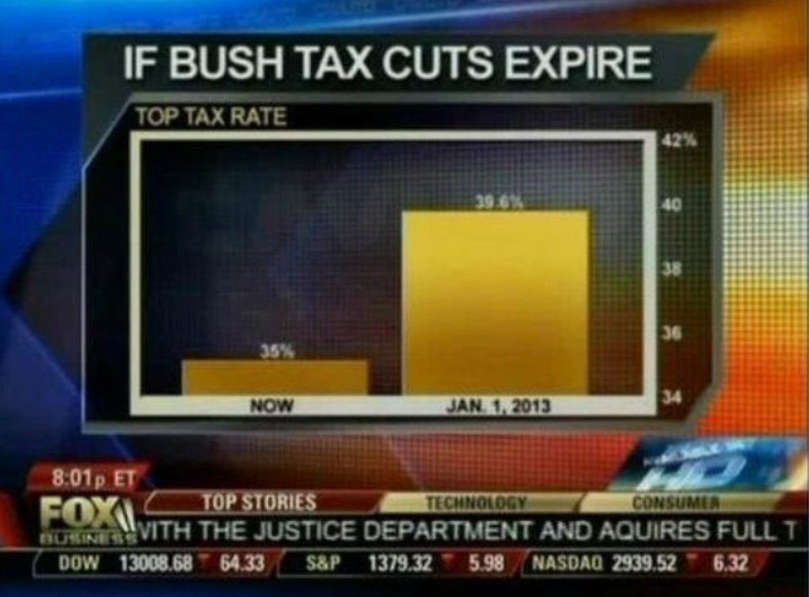
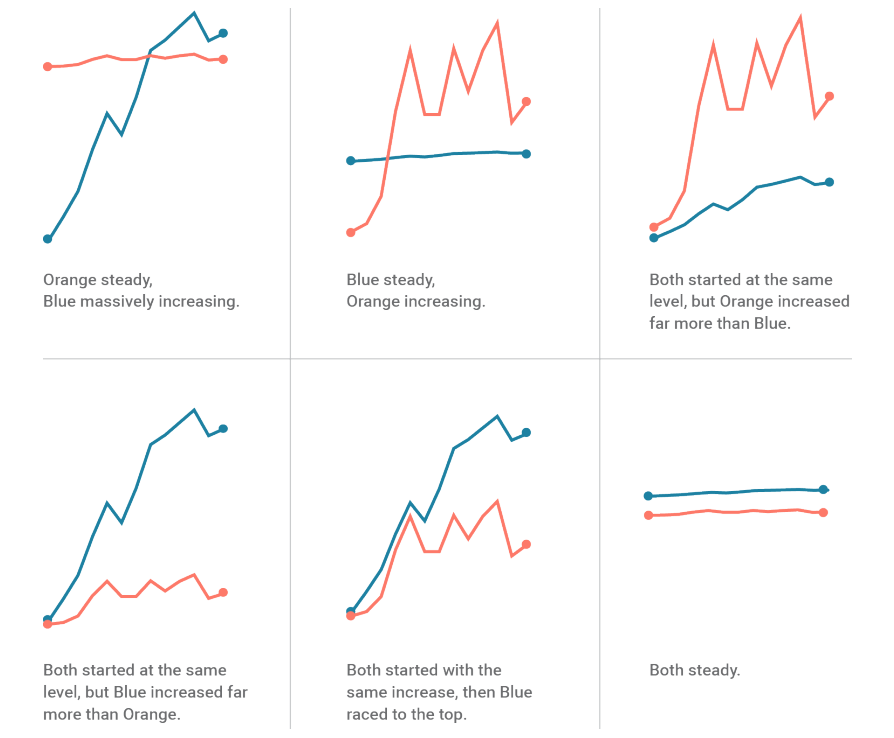

```{css, echo = F, eval = F}
body{background-color:black;filter:invert(1)}
```

```{r setup, include = FALSE}
source(paste0(getwd(), "/../source/style.R"))
stargazer <- stargazer::stargazer
options(htmltools.dir.version = F)
knitr::opts_chunk$set(echo = T, message = F, warning = F, fig.align = "center", dpi = 300, out.width = "100%")
theme_set(theme_gray())
```

<style> .left-column {width: 65%;} .right-column {width: 30%;} </style>

### Last time we saw

#### Read data

```{r, eval = F}
starbucks <- read.csv("C:/User/Documents/folder/starbucks.csv", sep = ";", encoding = "UTF-8")
```

```{r, echo = F}
starbucks <- read.csv("starbucks.csv", sep = ";", encoding = "UTF-8")
```

<center><b><i>&#10140; Make sure to use / and not \</i></b></center>

--

#### Chaining operations


```{r}
starbucks %>%
  arrange(-Calories) %>%
  select(Beverage_category, Beverage_prep, Calories) %>%
  filter(row_number() <= 3)
```

<p style = "margin-bottom:.8cm;"></p>
<center><b><i>&#10140; Make sure to view your data at each step</i></b></center>

---

### Last time we saw

<p style = "margin-bottom:1.5cm;"></p>

```{r, echo = F}
kable(tibble(Function = c("mutate()", "select()", "filter()", 
                    "arrange()", "group_by()", "summarise()", 
                    "bind_rows()", "left/right/inner/full_join()", "pivot_longer/wider()"),
       Meaning = c("Modify or create a variable", "Keep a subset of variables", "Keep a subset of observations",
                   "Sort the data", "Group the data", "Summarizes variables into 1 observation per group",
                   "Append data", "Merge data", "Reshape data")),
      caption = "<b>Important functions of the dplyr grammar</b>")
```

---

<h3>Today we learn how to plot data</h3>

<p style = "margin-bottom:2cm;">

--

.pull-left[
#### 1. The `ggplot()` function
<p style = "margin-bottom:-.5cm;">
 * 1.1. Basic structure
 * 1.2. Axes
 * 1.3. Theme
 * 1.4. Annotation
 
#### 2. Adding dimensions
<p style = "margin-bottom:-.5cm;">
 * 2.1. More axes
 * 2.2. More facets
 * 2.3. More labels
]

.pull-right[
#### 3. Types of geometry
<p style = "margin-bottom:-.5cm;">
 * 3.1. Points and lines
 * 3.2. Barplots and histograms
 * 3.3. Densities and boxplots
 
#### 4. How (not) to lie with graphics
<p style = "margin-bottom:-.5cm;">
 * 4.1. Cumulative representations
 * 4.2. Axis manipulations
 * 4.3. Interpolation
 
#### 5. Wrap up!
]

---

<h3>Today we learn how to plot data</h3>

<p style = "margin-bottom:2cm;">

.pull-left[
#### 1. The `ggplot()` function
<p style = "margin-bottom:-.5cm;">
 * 1.1. Basic structure
 * 1.2. Axes
 * 1.3. Theme
 * 1.4. Annotation
]

---

### 1. The `ggplot()` function

#### 1.1. Basic structure 

<ul>
  <li><b>ggplot()</b> is the function that we're gonna use for all our plots</li>
  <li>It takes the following <b>core arguments</b>:</li>
  <ul>
    <li><b>Data</b>: the values to plot</li>
    <li><b>Mapping</b> (aes, for aesthetics): the structure of the plot</li>
    <li><b>Geometry</b>: the type of plot</li>
  </ul>
</ul>

<p style = "margin-bottom:-1cm;">

<center></center>

--

<p style = "margin-bottom:1cm;"></p>

<ul>
  <li><b>Data and mapping</b> should be specified within the <b>parentheses</b></li>
  <li><b>Geometry</b> and any <b>other element</b> should be added with a <b>+</b> sign</li>
</ul>

```{r, eval = F}
ggplot(data, aes()) + geometry + anything_else
```

--

<p style = "margin-bottom:1.25cm;"></p>

  * You can also **apply** the `ggplot()` function to your data with a **pipe**
  
```{r, eval = F}
data %>% ggplot(aes()) + geometry
```

---

### 1. The `ggplot()` function

#### 1.1. Basic structure: Example 

```{r, eval = F}
test_data <- tibble(V1 = 1:6, V2 = c(64, 60, 16, 8, 16, 32))
```

--

```{r, eval = F}
ggplot(test_data, aes(x = V1, y = V2)) + geom_point(size = 3)
```

--

.pull-left[

 * We first specified our **data**: 
 
```{r, echo = F}
test_data <- tibble(V1 = 1:6, V2 = c(64, 60, 16, 8, 16, 32))
kable(t(test_data), caption = "")
```

<p style = "margin-bottom:1cm;">

<ul>
  <li>Then assigned in <b>aes()</b></li>
  <ul>
    <li>V1 to the x-axis</li>
    <li>V2 to the y-axis</li>
  </ul>
</ul>

<p style = "margin-bottom:.75cm;">
 
 * And chose the **point geometry** with a size of 3

]

--

.pull-right[
```{r, echo = F, fig.height=4.5, out.width='95%'}
ggplot(test_data, aes(x = V1, y = V2)) + geom_point(size = 3)
```
]

---

### 1. The `ggplot()` function

#### 1.2. Axes 

--

<p style = "margin-bottom:1cm;">

<ul>
  <li>Axes can be modified using with <b>scale functions</b>:</li>
  <ul>
    <li><b>scale_x_continuous()</b>: when a <b>continuous</b> variable is assigned to the <b>x-axis</b></li>
    <li><b>scale_x_discrete()</b>: when a <b>discrete</b> variable is assigned to the <b>x-axis</b></li>
    <li><b>scale_y_continuous()</b>: when a <b>continuous</b> variable is assigned to the <b>y-axis</b></li>
    <li><b>scale_y_discrete()</b>: when a <b>discrete</b> variable is assigned to the <b>y-axis</b></li>
  </ul>
</ul>
  
--

<p style = "margin-bottom:1cm;">

<ul>
  <li> The following <b>parameters</b> can be modified in these scale functions:</li>
  <ul>
    <li> <b>name:</b> The label of the corresponding axis </li>
    <li> <b>limits:</b> Where the axis should start and end </li>
    <li> <b>breaks:</b> Where to put ticks and values on the axis </li>
  </ul>
</ul>
  
--

<p style = "margin-bottom:1cm;">

```{r, eval = F}
ggplot(test_data, aes(x = V1, y = V2)) + geom_point(size = 3) +
  scale_x_continuous(name = "X variable label", limits = c(0, 7), breaks = 0:7) +
  scale_y_continuous(name = "Y variable label", limits = c(0, 70), breaks = seq(0, 70, 10))
```

---

### 1. The `ggplot()` function

#### 1.2. Axes 

```{r, echo = F, fig.width = 8, fig.height = 4.5, out.width = "75%"}
ggplot(test_data, aes(x = V1, y = V2)) + geom_point(size = 3) +
  scale_x_continuous(name = "X variable label", limits = c(0, 7), breaks = 0:7) +
  scale_y_continuous(name = "Y variable label", limits = c(0, 70), breaks = seq(0, 70, 10))
```

---

### 1. The `ggplot()` function

#### 1.3. Theme()

<ul>
  <li>You can use one of the <b>default R themes</b> to easily change the layout of your plot</li>
  <ul>
    <li> ... + theme_<b>bw</b>()</li>
    <li> ... + theme_<b>minimal</b>()</li>
    <li> ... + theme_<b>dark</b>()</li>
    <li>You can also tune the <b>font size</b> inside these functions with the <b>base_size</b> argument</li>
  </ul>
</ul>

--

```{r, echo = F, fig.width=12, fig.height=3.2, out.width="100%"}
library(ggpubr)

ggarrange(ggplot(test_data, aes(x = V1, y = V2)) + geom_point(size = 3) +
            scale_x_continuous(name = "X variable label", limits = c(0, 7), breaks = 0:7) +
            scale_y_continuous(name = "Y variable label", limits = c(0, 70), breaks = seq(0, 70, 10)) +
            theme_bw(base_size = 6) + ggtitle("+ theme_bw(base_size = 6)"),
          ggplot(test_data, aes(x = V1, y = V2)) + geom_point(size = 3) +
            scale_x_continuous(name = "X variable label", limits = c(0, 7), breaks = 0:7) +
            scale_y_continuous(name = "Y variable label", limits = c(0, 70), breaks = seq(0, 70, 10)) +
            theme_minimal(base_size = 10) + ggtitle("+ theme_minimal(base_size = 10)"),
          ggplot(test_data, aes(x = V1, y = V2)) + geom_point(size = 3) +
            scale_x_continuous(name = "X variable label", limits = c(0, 7), breaks = 0:7) +
            scale_y_continuous(name = "Y variable label", limits = c(0, 70), breaks = seq(0, 70, 10)) +
            theme_dark(base_size = 14) + ggtitle("+ theme_dark(base_size = 14)"),
          ncol = 3)
```

---

### 1. The `ggplot()` function

#### 1.3. Theme()

<ul>
  <li>You can also custom your graph using the <b>theme()</b> function</li>
  <ul>
    <li>It allows to <b>custom</b> virtually <b>anything</b></li>
    <li>Enter ?theme to see the <b>endless</b> list of possible <b>arguments</b></li>
    <li>Obviously we won't go through all of them but here are a few</li>
  </ul>
</ul>
 
<p style = "margin-bottom:1cm;">

--

```{r, eval = F}
ggplot(test_data, aes(x = V1, y = V2)) + 
  geom_point(size = 4) +
  # Axes
  scale_x_continuous(name = "X variable label", limits = c(0, 7), breaks = 0:7) +
  scale_y_continuous(name = "Y variable label", limits = c(0, 70), breaks = seq(0, 70, 10)) +
  # Theme
  theme_minimal(base_size = 14) + 
  theme(# Color of the background and of its border
        plot.background = element_rect(fill = "#DFE6EB", colour = "#DFE6EB"),
        # Size of the axis lines
        axis.line = element_line(size = rel(0.8)),
        # Color of the grid lines
        panel.grid = element_line(color = "gray85"))  
```

---

### 1. The `ggplot()` function

#### 1.3. Theme()

```{r, echo = F, fig.width = 8, fig.height = 4.5, out.width = "75%"}
ggplot(test_data, aes(x = V1, y = V2)) + 
  geom_point(size = 4) +
  # Axes
  scale_x_continuous(name = "X variable label", limits = c(0, 7), breaks = 0:7) +
  scale_y_continuous(name = "Y variable label", limits = c(0, 70), breaks = seq(0, 70, 10)) +
  # Theme
  theme_minimal(base_size = 14) + 
  theme(# Color of the background and of its border
        plot.background = element_rect(fill = "#DFE6EB", colour = "#DFE6EB"),
        # Size of the axis lines
        axis.line = element_line(size = rel(0.8)),
        # Color of the grid lines
        panel.grid = element_line(color = "gray85"))  
```

---

### 1. The `ggplot()` function

#### 1.3. Theme()

<ul>
  <li>Geometries can also be modified</li>
  <ul>
    <li><b>alpha:</b> opacity from 0 to 1</li>
    <li><b>color:</b> color of the geometry (for geometries that are filled such as bars, it will color the border)</li>
    <li><b>fill:</b> fill color for geometries such as bars</li>
    <li><b>size:</b> size of the geometry</li>
    <li><b>shape:</b> change shape for geometries like points</li>
    <li><b>linetype:</b> solid, dashed, dotted, etc., for line geometries</li>
    <li>...</li>
  </ul>
</ul>

--

<p style = "margin-bottom:-1cm;">

.pull-left[
<p style = "margin-bottom:1.5cm;">
```{r, eval = F}
ggplot(test_data, aes(x = V1, y = V2)) + 
  geom_point(size = 3, 
             color = "#6794A7",
             alpha = .6,
             shape = 18)  +
  theme_minimal(base_size = 14)
```

]

--

.pull-right[
```{r, echo = F, fig.height=3, fig.width=5, out.width="75%"}
ggplot(test_data, aes(x = V1, y = V2)) + 
  geom_point(size = 5, 
             color = "#014D64",
             alpha = .6,
             shape = 18) +
  theme_minimal(base_size = 14)
```
]

---

### 1. The `ggplot` function

#### 1.4. Annotation

<p style = "margin-bottom:.5cm;">

--

<ul>
  <li>It is sometimes useful to <b>annotate</b> a graph so that certain things become <b>more salient</b></li>
  <ul>
    <li><b>Separate</b> two groups with a <b>dashed line</b></li>
    <li>Add a few <b>words somewhere</b> for clarity</li>
    <li><b>Circle</b> a specific group of <b>data points</b></li>
    <li>Add <b>labels</b> to data points</li>
  </ul>
</ul>

--

<p style = "margin-bottom:1cm;">

 * **Straight lines** can easily be added with their respective geometry
 
```{r, eval=F}
+ geom_hline(yintercept = , linetype = )
```
 
```{r, eval=F}
+ geom_vline(xintercept = , linetype = )
```

--

<p style = "margin-bottom:1cm;">

 * And **punctual text annotations** can be added with `annotate()`
 
```{r, eval=F}
+ annotate("text", x = , y = , label = )
```

---

### 1. The `ggplot` function

#### 1.4. Annotation: Adding lines

--

.pull-left[
```{r, fig.height=4, eval = F}
ggplot(test_data, aes(x = V1, y = V2)) + 
  geom_point(size = 3) + 
  geom_hline(yintercept = 45)
```

<p style = "margin-bottom:1.14cm;">

```{r, fig.height=4, echo = F}
ggplot(test_data, aes(x = V1, y = V2)) + 
  geom_point(size = 3) + 
  geom_hline(yintercept = 45)
```
]

--

.pull-right[
```{r, fig.height=4}
ggplot(test_data, aes(x = V1, y = V2)) + 
  geom_point(size = 3) + 
  geom_vline(xintercept = 2.5, 
             linetype = "dashed")
```
]

---

### 1. The `ggplot` function

#### 1.4. Annotation: Adding text

```{r, eval = F, fig.width = 4.5, fig.height = 2.5}
ggplot(test_data, aes(x = V1, y = V2)) + geom_point(size = 3) + 
  annotate("text", x = 2.5, y = 40, label = "Relevant info", size = 5)
```
--
```{r, echo = F, fig.width = 8, fig.height = 4.5, out.width = "60%"}
ggplot(test_data, aes(x = V1, y = V2)) + 
  geom_point(size = 3) + annotate("text", x = 2.5, y = 40, label = "Relevant info", size = 5)
```

---

### 1. The `ggplot` function

#### Combining everything

--

```{r, eval = F}
ggplot(test_data, aes(x = V1, y = V2)) + 
```
--
<p style = "margin-bottom:-1.01cm;"></p>
```{r, eval = FALSE}
  geom_point(size = 5, color = "#014D64", alpha = .6) + 
```
--
<p style = "margin-bottom:-1.01cm;"></p>
```{r, eval = FALSE}
  # Annotations
  geom_vline(xintercept = 2.5, linetype = "dashed", size = 1, color = "#727272") +
```
--
<p style = "margin-bottom:-1.01cm;"></p>
```{r, eval = FALSE}
  annotate("text", x = 2.36, y = 7, label = "Threshold", angle = 90, size = 5, color = "#727272") +
```
--
<p style = "margin-bottom:-1.01cm;"></p>
```{r, eval = FALSE}
  # Axes
  scale_x_continuous(name = "X variable label", limits = c(0, 7), breaks = 0:7) +
```
--
<p style = "margin-bottom:-1.01cm;"></p>
```{r, eval = FALSE}
  scale_y_continuous(name = "Y variable label", limits = c(0, 70), breaks = seq(0, 70, 10)) +
```
--
<p style = "margin-bottom:-1.01cm;"></p>
```{r, eval = FALSE}
  # Theme
  theme_minimal(base_size = 14) + 
```
--
<p style = "margin-bottom:-1.01cm;"></p>
```{r, eval = FALSE}
        # Custom background 
  theme(plot.background = element_rect(fill = "#DFE6EB", colour = "#DFE6EB"),
        panel.grid = element_line(color = "gray85"),
```
--
<p style = "margin-bottom:-1.01cm;"></p>
```{r, eval = FALSE}
        # Custom axes
        axis.line.x = element_line(size = rel(0.8), color = "#727272"),
        axis.ticks.x = element_line(size = rel(0.4), color = "#727272"),
        axis.line.y = element_blank(), axis.ticks.y = element_blank(),
        axis.title.y = element_text(margin = margin(t = 0, r = 20, b = 0, l = 0)),
        axis.title.x = element_text(margin = margin(t = 20, r = 0, b = 0, l = 0)),
```

---

### 1. The `ggplot` function

#### Combining everything

```{r, echo = F, fig.width = 8, fig.height = 4.5, out.width = "75%"}
ggplot(test_data, aes(x = V1, y = V2)) + 
  geom_point(size = 5, color = "#014D64", alpha = .6) +
  geom_vline(xintercept = 2.5, linetype = "dashed", size = 1, color = "#727272") +
  annotate("text", x = 2.36, y = 7, label = "Threshold", angle = 90, size = 5, color = "#505050") +
  scale_x_continuous(name = "X variable label", limits = c(0, 7), breaks = 0:7) +
  scale_y_continuous(name = "Y variable label", limits = c(0, 70), breaks = seq(0, 70, 10)) +
  theme_minimal(base_size = 14) + 
        # Custom background 
  theme(plot.background = element_rect(fill = "#DFE6EB", colour = "#DFE6EB"),
        panel.grid = element_line(color = "gray85"),
        # Custom axes
        axis.line.x = element_line(size = rel(0.8), color = "#727272"),
        axis.ticks.x = element_line(size = rel(0.4), color = "#727272"),
        axis.line.y = element_blank(), axis.ticks.y = element_blank(),
        axis.title.y = element_text(margin = margin(t = 0, r = 20, b = 0, l = 0)),
        axis.title.x = element_text(margin = margin(t = 20, r = 0, b = 0, l = 0)))
```

---

<h3>Overview</h3>

<p style = "margin-bottom:2cm;"></p>

.pull-left[
#### 1. The `ggplot()` function &#10004;
<p style = "margin-bottom:-.5cm;">
 * 1.1. Basic structure
 * 1.2. Axes
 * 1.3. Theme
 * 1.4. Annotation
 
#### 2. Adding dimensions
<p style = "margin-bottom:-.5cm;">
 * 2.1. More axes
 * 2.2. More facets
 * 2.3. More labels
]

.pull-right[
#### 3. Types of geometry
<p style = "margin-bottom:-.5cm;">
 * 3.1. Points and lines
 * 3.2. Barplots and histograms
 * 3.3. Densities and boxplots
 
#### 4. How (not) to lie with graphics
<p style = "margin-bottom:-.5cm;">
 * 4.1. Cumulative representations
 * 4.2. Axis manipulations
 * 4.3. Interpolation
 
#### 5. Wrap up!
]

---

<h3>Overview</h3>

<p style = "margin-bottom:2cm;"></p>

.pull-left[
#### 1. The `ggplot()` function &#10004;
<p style = "margin-bottom:-.5cm;">
 * 1.1. Basic structure
 * 1.2. Axes
 * 1.3. Theme
 * 1.4. Annotation 
 
#### 2. Adding dimensions
<p style = "margin-bottom:-.5cm;">
 * 2.1. More axes
 * 2.2. More facets
 * 2.3. More labels
]

---

### 2. Adding dimensions

#### 2.1. More axes

<ul>
  <li>We now know how to produce a <b>scatter plot</b> involving two variables, \(x\) and \(y\)</li>
  <ul>
    <li>But often times it may be useful to add information from a <b>third variable</b></li>
  </ul>
</ul>

--

<ul>
  <li>To illustrate that, let's open an <b>actual dataset</b></li>
  <ul>
    <li>These data come from the <a href = "https://wid.world/">World Inequality database</a></li>
  </ul>
</ul>

```{r}
wid <- read.csv("wid.csv")
```

--

<ul>
  <li>It contains the following variables</li>
  <ul>
    <li><b>Observation level</b>: Continent/Country/Year</li>
    <li><b>f_share</b>: Female labor income share</li>
    <li><b>top1</b>: Top 1% income share</li>
    <li><b>inc_head</b>: Per adult national income</li>
  </ul>
</ul>

--

```{r}
names(wid)
```

---

### 2. Adding dimensions

#### 2.1. More axes

<center></center>

---

### 2. Adding dimensions

#### 2.1. More axes

<ul>
  <li>Let's start with a <b>simple scatterplot</b> for European countries in 2019</li>
  <ul>
    <li><b>Female labor income share</b> on the \(y\) axis, and <b>national income</b> per adult on the \(x\) axis</li>
  </ul>
</ul>

--

```{r, eval = F}
wid %>% filter(year == 2019 & continent == "Europe") %>%
  ggplot(aes(x = inc_head, y = top1)) + geom_point()
```

--

```{r, echo = F, fig.width = 6, fig.height = 3.5, out.width="48%"}
wid %>% 
  filter(year == 2019 & continent == "Europe") %>%
  ggplot(aes(x = inc_head, y = top1)) + 
  geom_point()
```

---

### 2. Adding dimensions

#### 2.1. More axes

<ul>
  <li>In some cases you would <b>convey information</b> with other means than a position on axis</li>
  <ul>
    <li>The <b>color, size, or shape</b> of a geometry can be used to represent a <b>third variable</b>:</li>
  </ul>
</ul>

<p style = "margin-bottom:.75cm;"></p>

--

<ul>
  <li>We can assign a <b>different color to each point</b> depending on its female labor income share</li>
  <ul>
    <li>This allows to see how \(x\) and \(y\) are related to this variable</li>
  </ul>
</ul>

<p style = "margin-bottom:.75cm;"></p>
--

<ul>
  <li>Here, the <b>color shade</b> should be viewed as a <b>dimension</b> just like x and y</li>
  <ul>
    <li>fshare should be assigned to the <i>"color axis"</i> in <b>aes()</b></li>
    <li>But because there is no proper <i>"color axis"</i>, a <b>legend</b> will be generated</li>
    <li>And just like <b>scale functions</b> custom axes of the x and y dimensions...
    <li>... scale functions also custom the legend of the color dimension</li>
  </ul>
</ul>
 
--

```{r, eval = F}
wid %>% 
  filter(year == 2019 & continent == "Europe") %>%
  ggplot(aes(x = inc_head, y = top1, color = fshare)) + 
  geom_point() +
  scale_color_gradient(name = "Female income %", low = "grey80", high = "steelblue")
```

---

### 2. Adding dimensions

#### 2.1. More axes

```{r, echo = F, fig.width = 8, fig.height = 3.75, out.width="90%"}
wid %>% 
  filter(year == 2019 & continent == "Europe") %>%
  ggplot(aes(x = inc_head, y = top1, color = fshare)) + 
  geom_point() +
  scale_color_gradient(name = "Female income %", 
                       low = "grey80", high = "steelblue")
```

---

### 2. Adding dimensions

#### 2.1. More axes

<ul>
  <li>The color axis can also be used to <b>distinguish</b> different <b>groups</b></li>
  <ul>
    <li>We can indeed assign a <b>discrete</b> variable to the <b>color</b> axis</li>
  </ul>
</ul>

--

<p style = "margin-bottom:1cm;"></p>

```{r, eval = F}
wid %>% 
  filter(year == 2019) %>%
  ggplot(aes(x = inc_head, y = top1, color = continent)) + 
  geom_point() + 
  scale_color_manual(values = c("red", "blue", "green", "purple", "yellow", "orange"))
```

--

<p style = "margin-bottom:1cm;"></p>

<ul>
  <li>But color is not this only <b>property</b> that can be used as a <b>dimension</b>, you can use:</li>
  <ul>
    <li><b>fill</b></li>
    <li><b>size</b></li>
    <li><b>shape</b></li>
    <li><b>alpha</b></li>
    <li><b>linetype</b></li>
    <li>...</li>
  </ul>
</ul>

---

.pull-left[
```{r, echo = F, fig.width = 6, fig.height = 3.5, out.width="100%"}
wid %>% 
  filter(year == 2019) %>%
  ggplot(aes(x = inc_head, y = top1, color = continent)) + 
  geom_point() + 
  scale_color_manual(values = c("red", "blue", "green", "purple", "yellow", "orange"))
```

```{r, echo = F, fig.width = 6, fig.height = 3.5, out.width="100%"}
wid %>% 
  filter(year == 2019) %>%
  ggplot(aes(x = inc_head, y = top1, shape = continent)) + 
  geom_point()
```
]

.pull-right[
```{r, echo = F, fig.width = 6, fig.height = 3.5, out.width="100%"}
wid %>% 
  filter(year == 2019) %>%
  ggplot(aes(x = inc_head, y = top1, size = continent)) + 
  geom_point()
```

```{r, echo = F, fig.width = 6, fig.height = 3.5, out.width="100%"}
wid %>% 
  filter(year == 2019) %>%
  ggplot(aes(x = inc_head, y = top1, alpha = continent)) + 
  geom_point()
```
]

---

### 2. Adding dimensions

#### 2.2. More facets

<ul>
  <li>Another way to <b>distinguish groups</b> is to divide the plot into <b>facets</b></li>
  <ul>
    <li>To do so, indicate your faceting variable into the <b>facet_wrap()</b> function</li>
  </ul>
</ul>

--

```{r, eval = F}
wid %>% 
  filter(year == 2019) %>%
  ggplot(aes(x = inc_head, y = top1)) + 
  geom_point() +
  facet_wrap(~continent, ncol = 3, scales = "fixed")
```

--

<ul>
  <li>You should specify the number of columns or rows:</li>
  <ul>
    <li><b>nrow</b> to indicate the number of rows</li>
    <li><b>ncol</b> to indicate the number of columns</li>
  </ul>
</ul>

--

<ul>
  <li>As well as which <b>scale</b> should be free or fixed</li>
  <ul>
    <li>The default <b>"fixed"</b> will set all facet on the same \(x\) and \(y\) scales</li>
    <li>Set scales to <b>"free_y"</b> to let the \(y\) axis fit the domain of each facet</li>
    <li>Set scales to <b>"free_x"</b> to let the \(x\) axis fit the domain of each facet</li>
    <li>Set scales to <b>"free"</b> to let the both axis fit the domain of each facet</li>
  </ul>
</ul>

---

### 2. Adding dimensions

#### 2.2. More facets

```{r, echo = F, fig.width = 8, fig.height = 3.75, out.width="90%"}
wid %>% 
  filter(year == 2019) %>%
  ggplot(aes(x = inc_head, y = top1)) + 
  geom_point() +
  facet_wrap(~continent, ncol = 3, scales = "fixed")
```

---

### 2. Adding dimensions

#### 2.3. More labels

<ul>
  <li>The last dimension I want to mention is the <b><i>label</i> axis</b></li>
  <ul>
    <li>When using <b>geom_text()</b> instead of geom_point(), it will plot the corresponding <b>text instead of points</b></li>
  </ul>
</ul>

--

```{r, eval = F}
wid %>% filter(year == 2019 & continent == "Europe") %>%
  ggplot(aes(x = inc_head, y = top1, label = country)) + geom_text(alpha = .6)
```

--

```{r, echo = F, fig.width = 6, fig.height = 3.5, out.width="48%"}
wid %>% filter(year == 2019 & continent == "Europe") %>%
  ggplot(aes(x = inc_head, y = top1, label = country)) + geom_text(alpha = .6)
```

---

### Practice

#### 1) Open the `starbucks.csv` data and reproduce that graph:

```{r, echo = F, fig.width = 8, fig.height = 3.75, out.width="70%"}
ggplot(starbucks, 
       aes(x = Calories, 
           y = Cholesterol,
           size = Trans.Fat, 
           color = Sugars)) + 
  geom_point(alpha = .3) + 
  scale_color_gradient(low = "green", high = "red") +
  theme_minimal(base_size = 14)
```

--

<p style = "margin-bottom:1cm;"></p>

<center><h3><i>You've got 10 minutes!</i></h3></center>

---

### Solution


#### 1) Open the `starbucks.csv` data and reproduce that graph:

```{r, eval = F}
starbucks <- read.csv("starbucks.csv", sep = ";", encoding = "UTF-8") # Same as last week
```
--
<p style = "margin-bottom:-.85cm;"></p>
```{r, eval = F}

# Use the ggplot function and specify the data
ggplot(starbucks, 
```
--
<p style = "margin-bottom:-.85cm;"></p>
```{r, eval = F}
       # In aes, assign the Calories variable to the x axis
       aes(x = Calories, 
```
--
<p style = "margin-bottom:-.85cm;"></p>
```{r, eval = F}
           # Cholesterol to the y axis
           y = Cholesterol,
```
--
<p style = "margin-bottom:-.85cm;"></p>
```{r, eval = F}
           # Trans.Fat to the size axis
           size = Trans.Fat, 
```
--
<p style = "margin-bottom:-.85cm;"></p>
```{r, eval = F}
           # Sugars to the color axis
           color = Sugars)) + 
```
--
<p style = "margin-bottom:-.85cm;"></p>
```{r, eval = F}
  # Add a point geometry and set opacity to 30%
  geom_point(alpha = .3) + 
```
--
<p style = "margin-bottom:-.85cm;"></p>
```{r, eval = F}
  # Custom the color gradient from green to red
  scale_color_gradient(low = "green", high = "red") +
```
--
<p style = "margin-bottom:-.85cm;"></p>
```{r, eval = F}
  # Apply the minimal default theme with a base font size of 14
  theme_minimal(base_size = 14)
```

---

<h3>Overview</h3>

<p style = "margin-bottom:2cm;"></p>

.pull-left[
#### 1. The `ggplot()` function &#10004;
<p style = "margin-bottom:-.5cm;">
 * 1.1. Basic structure
 * 1.2. Axes
 * 1.3. Theme
 * 1.4. Annotation
 
#### 2. Adding dimensions &#10004;
<p style = "margin-bottom:-.5cm;">
 * 2.1. More axes
 * 2.2. More facets
 * 2.3. More labels
]

.pull-right[
#### 3. Types of geometry
<p style = "margin-bottom:-.5cm;">
 * 3.1. Points and lines
 * 3.2. Barplots and histograms
 * 3.3. Densities and boxplots
 
#### 4. How (not) to lie with graphics
<p style = "margin-bottom:-.5cm;">
 * 4.1. Cumulative representations
 * 4.2. Axis manipulations
 * 4.3. Interpolation
 
#### 5. Wrap up!
]

---

<h3>Overview</h3>

<p style = "margin-bottom:2cm;"></p>

.pull-left[
#### 1. The `ggplot()` function &#10004;
<p style = "margin-bottom:-.5cm;">
 * 1.1. Basic structure
 * 1.2. Axes
 * 1.3. Theme
 * 1.4. Annotation
 
#### 2. Adding dimensions &#10004;
<p style = "margin-bottom:-.5cm;">
 * 2.1. More axes
 * 2.2. More facets
 * 2.3. More labels
]

.pull-right[
#### 3. Types of geometry
<p style = "margin-bottom:-.5cm;">
 * 3.1. Points and lines
 * 3.2. Barplots and histograms
 * 3.3. Densities and boxplots
]

---

### 3. Types of geometry

#### 3.1. Points and lines

<ul>
  <li>So far we only represented scatterplots, but <b>many other geometries</b> can be used</li>
  <ul>
    <li>For instance, <b>lines</b> are particularly suited for <b>evolutions</b> over time</li>
  </ul>
</ul>

--

```{r, eval = F}
ggplot(wid %>% filter(country == "USA"), aes(x = year, y = top1)) + 
  geom_point() + geom_line()
```

--

```{r, echo = F, fig.width = 6, fig.height = 3.5, out.width="48%"}
ggplot(wid %>% filter(country == "USA"), aes(x = year, y = top1)) + 
  geom_point() + geom_line()
```

---

### 3. Types of geometry

#### 3.2. Barplots and histograms

<ul>
  <li><b>Barplots</b> however are great for categorical \(x\) variables and continuous \(y\) variables</li>
  <ul>
    <li>Setting the <b>stat</b> argument to <b>"identity"</b> allows to display the corresponding <b>y value</b></li>
  </ul>
</ul>

--

```{r, eval = F}
ggplot(wid %>% filter(continent == "South America" & year == 2019), 
       aes(x = country, y = top1)) + geom_bar(stat = "identity")
```

--

```{r, echo = F, fig.width = 8, fig.height = 3.5, out.width="63%"}
ggplot(wid %>% filter(continent == "South America" & year == 2019), 
       aes(x = country, y = top1)) + geom_bar(stat = "identity")
```

---

### 3. Types of geometry

#### 3.2. Barplots and histograms

<ul>
  <li>Note that you can <b>reorder the bars</b> according to their y value using the reorder() function</li>
</ul>

--

```{r, eval = F}
ggplot(wid %>% filter(continent == "South America" & year == 2019), 
       aes(x = reorder(country, top1), y = top1)) + geom_bar(stat = "identity")
```

--

```{r, echo = F, fig.width = 8, fig.height = 3.5, out.width="68%"}
ggplot(wid %>% filter(continent == "South America" & year == 2019), 
       aes(x = reorder(country, top1), y = top1)) + geom_bar(stat = "identity")
```

---

### 3. Types of geometry

#### 3.2. Barplots and histograms

<ul>
  <li>You can also set stat to <b>"count"</b> to plot the <b>number of observations</b> per category</li>
  <ul>
    <li>In that case, no variable should be assigned to the y axis</li>
  </ul>
</ul>

--

```{r, eval = F}
ggplot(wid, aes(x = continent)) + geom_bar(stat = "count")
```

--

```{r, echo = F, fig.width = 8, fig.height = 3.5, out.width="68%"}
ggplot(wid, aes(x = continent)) + geom_bar(stat = "count")
```

---

### 3. Types of geometry

#### 3.2. Barplots and histograms

<ul>
  <li>Finally, histograms can be used to describe the distribution of a continuous variable</li>
  <ul>
    <li>You can tune the bin width with <b>binwidth</b> or the number of bins with <b>bins</b></li>
  </ul>
</ul>

--

```{r, eval = F}
ggplot(wid %>% filter(year == 2019), aes(x = fshare)) + 
  geom_histogram(bins = 20, color = "white", fill = "steelblue")
```

--

```{r, echo = F, fig.width = 8, fig.height = 3.5, out.width="63%"}
ggplot(wid %>% filter(year == 2019), aes(x = fshare)) + 
  geom_histogram(bins = 20, color = "white", fill = "steelblue")
```

---

### 3. Types of geometry

#### 3.3. Densities and boxplots

<ul>
  <li>As you may remember from last class, the <b>continuous</b> equivalent of the histogram is the <b>density</b></li>
  <ul>
    <li>Similarly you can tune the <b>bandwidth</b> with the <b>bw</b> argument <i>(don't do it)</i></li>
  </ul>
</ul>

--

```{r, eval = F}
ggplot(wid %>% filter(year == 2019), aes(x = fshare)) + 
    geom_density(color = "white", fill = "steelblue")
```

--

```{r, echo = F, fig.width = 8, fig.height = 3.5, out.width="63%"}
ggplot(wid %>% filter(year == 2019), aes(x = fshare)) + 
    geom_density(color = "white", fill = "steelblue")
```

---

### 3. Types of geometry

#### 3.3. Densities and boxplots

<ul>
  <li>A handy geometry to plot <b>densities</b> for different <b>groups</b> is the <b>violin</b></li>
  <ul>
    <li>Note that the <b>grouping variable</b> should be assigned to the <b>\(x\) axis</b></i></li>
  </ul>
</ul>

--

```{r, eval = F}
ggplot(wid %>% filter(year == 2019), aes(x = continent, y = fshare)) + 
    geom_violin(color = "white", fill = "steelblue") 
```

--

```{r, echo = F, fig.width = 8, fig.height = 3.5, out.width="63%"}
ggplot(wid %>% filter(year == 2019), aes(x = continent, y = fshare)) + 
    geom_violin(color = "white", fill = "steelblue") 
```

---

### 3. Types of geometry

#### 3.3. Densities and boxplots

<ul>
  <li><b>Violins</b> are particularly interesting when <b>combined with boxplots</b></li>
  <ul>
    <li>When overlaying these geometries, make sure to tune the <b>width and opacity</b> appropriately</li>
  </ul>
</ul>

--

```{r, eval = F}
ggplot(wid %>% filter(year == 2019), aes(x = continent, y = fshare)) + 
    geom_violin(fill = "steelblue", alpha = .4)  + geom_boxplot(width = .1, alpha = .4)
```

--

```{r, echo = F, fig.width = 8, fig.height = 3.5, out.width="63%"}
ggplot(wid %>% filter(year == 2019), aes(x = continent, y = fshare)) + 
    geom_violin(fill = "steelblue", alpha = .4)  + geom_boxplot(width = .1, alpha = .4)
```

---

### 3. Types of geometry

#### 3.3. Densities and boxplots

<ul>
  <li>This is how <b>boxplots</b> are constructed:</li>
</ul>

--

```{r, echo = F, fig.width = 8, fig.height = 3.5, out.width="90%"}
theme_set(theme_Rcourse())
den <- tibble(x = rnorm(5000, 0, 1))

ggarrange(ggplot(den, aes(x = x)) + 
            # Median
            geom_segment(aes(x = median(x), xend = median(x), y = 0, yend = 1), size = 2) +
            annotate("text", x = median(den$x), y = 1.25, label = "Median", size = 4.5) + 
            scale_x_continuous(limits = c(min(den$x), max(den$x))) +
            scale_y_continuous(limits = c(0, 1.5)) +
            theme(axis.title = element_blank(),
                  axis.text = element_blank(),
                  axis.line = element_blank(),
                  axis.ticks = element_blank()),
          ggplot(den, aes(x = x)) + 
            geom_density(color = "#014D64", fill = "#6794A7", alpha = .8, bw = .4) +
            scale_x_continuous(limits = c(min(den$x), max(den$x))) +
            theme(axis.title = element_blank(),
                  axis.text = element_blank(),
                  axis.line = element_blank(),
                  axis.ticks = element_blank()),
          nrow = 2)
```

---

### 3. Types of geometry

#### 3.3. Densities and boxplots

<ul>
  <li>This is how <b>boxplots</b> are constructed:</li>
</ul>

```{r, echo = F, fig.width = 8, fig.height = 3.5, out.width="90%"}
ggarrange(ggplot(den, aes(x = x)) + 
            # Median
            geom_segment(aes(x = median(x), xend = median(x), y = 0, yend = 1), size = 2) +
            annotate("text", x = median(den$x), y = 1.25, label = "Median", size = 4.5) + 
            # Quantiles
            geom_segment(aes(x = quantile(x, 1/4), xend = quantile(x, 1/4), y = 0, yend = 1)) +
            geom_segment(aes(x = quantile(x, 3/4), xend = quantile(x, 3/4), y = 0, yend = 1)) +
            geom_segment(aes(x = quantile(x, 1/4), xend = quantile(x, 3/4), y = 0, yend = 0)) +
            geom_segment(aes(x = quantile(x, 1/4), xend = quantile(x, 3/4), y = 1, yend = 1)) +
            annotate("text", x =  quantile(den$x, 1/4), y = 1.25, label = "Q1", size = 4.5) + 
            annotate("text", x =  quantile(den$x, 3/4), y = 1.25, label = "Q3", size = 4.5) + 
            scale_x_continuous(limits = c(min(den$x), max(den$x))) +
            scale_y_continuous(limits = c(0, 1.5)) +
            theme(axis.title = element_blank(),
                  axis.text = element_blank(),
                  axis.line = element_blank(),
                  axis.ticks = element_blank()),
          ggplot(den, aes(x = x)) + 
            geom_density(color = "#014D64", fill = "#6794A7", alpha = .8, bw = .4) +
            scale_x_continuous(limits = c(min(den$x), max(den$x))) +
            theme(axis.title = element_blank(),
                  axis.text = element_blank(),
                  axis.line = element_blank(),
                  axis.ticks = element_blank()),
          nrow = 2)
```


---

### 3. Types of geometry

#### 3.3. Densities and boxplots

<ul>
  <li>This is how <b>boxplots</b> are constructed:</li>
</ul>

```{r, echo = F, fig.width = 8, fig.height = 3.5, out.width="90%"}
ggarrange(ggplot(den, aes(x = x)) + 
            # Median
            geom_segment(aes(x = median(x), xend = median(x), y = 0, yend = 1), size = 2) +
            annotate("text", x = median(den$x), y = 1.25, label = "Median", size = 4.5) + 
            # Quantiles
            geom_segment(aes(x = quantile(x, 1/4), xend = quantile(x, 1/4), y = 0, yend = 1)) +
            geom_segment(aes(x = quantile(x, 3/4), xend = quantile(x, 3/4), y = 0, yend = 1)) +
            geom_segment(aes(x = quantile(x, 1/4), xend = quantile(x, 3/4), y = 0, yend = 0)) +
            geom_segment(aes(x = quantile(x, 1/4), xend = quantile(x, 3/4), y = 1, yend = 1)) +
            annotate("text", x =  quantile(den$x, 1/4), y = 1.25, label = "Q1", size = 4.5) + 
            annotate("text", x =  quantile(den$x, 3/4), y = 1.25, label = "Q3", size = 4.5) + 
            # 3IQR
            geom_segment(aes(x = quantile(x, 3/4), xend = quantile(x, 3/4) + 1.5*IQR(x), y = .5, yend = .5)) +
            geom_segment(aes(x = quantile(x, 1/4), xend = quantile(x, 1/4) - 1.5*IQR(x), y = .5, yend = .5)) +
            annotate("text", x = quantile(den$x, 1/4) - 1.5*IQR(den$x), y = 1, label = "Q1\n-\n1.5*IQR", size = 4.5) + 
            annotate("text", x = quantile(den$x, 3/4) + 1.5*IQR(den$x), y = 1, label = "Q3\n+\n1.5*IQR", size = 4.5) + 
            scale_x_continuous(limits = c(min(den$x), max(den$x))) +
            scale_y_continuous(limits = c(0, 1.5)) +
            theme(axis.title = element_blank(),
                  axis.text = element_blank(),
                  axis.line = element_blank(),
                  axis.ticks = element_blank()),
          ggplot(den, aes(x = x)) + 
            geom_density(color = "#014D64", fill = "#6794A7", alpha = .8, bw = .4) +
            scale_x_continuous(limits = c(min(den$x), max(den$x))) +
            theme(axis.title = element_blank(),
                  axis.text = element_blank(),
                  axis.line = element_blank(),
                  axis.ticks = element_blank()),
          nrow = 2)
```

---

### 3. Types of geometry

#### 3.3. Densities and boxplots

<ul>
  <li>This is how <b>boxplots</b> are constructed:</li>
</ul>

```{r, echo = F, fig.width = 8, fig.height = 3.5, out.width="90%"}
ggarrange(ggplot(den, aes(x = x)) + 
            # Median
            geom_segment(aes(x = median(x), xend = median(x), y = 0, yend = 1), size = 2) +
            annotate("text", x = median(den$x), y = 1.25, label = "Median", size = 4.5) + 
            # Quantiles
            geom_segment(aes(x = quantile(x, 1/4), xend = quantile(x, 1/4), y = 0, yend = 1)) +
            geom_segment(aes(x = quantile(x, 3/4), xend = quantile(x, 3/4), y = 0, yend = 1)) +
            geom_segment(aes(x = quantile(x, 1/4), xend = quantile(x, 3/4), y = 0, yend = 0)) +
            geom_segment(aes(x = quantile(x, 1/4), xend = quantile(x, 3/4), y = 1, yend = 1)) +
            annotate("text", x =  quantile(den$x, 1/4), y = 1.25, label = "Q1", size = 4.5) + 
            annotate("text", x =  quantile(den$x, 3/4), y = 1.25, label = "Q3", size = 4.5) + 
            # 3IQR
            geom_segment(aes(x = quantile(x, 3/4), xend = quantile(x, 3/4) + 1.5*IQR(x), y = .5, yend = .5)) +
            geom_segment(aes(x = quantile(x, 1/4), xend = quantile(x, 1/4) - 1.5*IQR(x), y = .5, yend = .5)) +
            annotate("text", x = quantile(den$x, 1/4) - 1.5*IQR(den$x), y = 1, label = "Q1\n-\n1.5*IQR", size = 4.5) + 
            annotate("text", x = quantile(den$x, 3/4) + 1.5*IQR(den$x), y = 1, label = "Q3\n+\n1.5*IQR", size = 4.5) + 
            # Outliers
            geom_point(data = den %>% filter(x < quantile(x, 1/4) - 1.5*IQR(x) |x > quantile(x, 3/4) + 1.5*IQR(x)),
                         aes(x = x, y = .5)) +
            annotate("text", x = min(den$x) + .075, y = 1, label = "Outliers", size = 4.5, angle = 90) + 
            annotate("text", x = max(den$x) - .075, y = 1, label = "Outliers", size = 4.5, angle = 90) + 
            scale_x_continuous(limits = c(min(den$x), max(den$x))) +
            scale_y_continuous(limits = c(0, 1.5)) +
            theme(axis.title = element_blank(),
                  axis.text = element_blank(),
                  axis.line = element_blank(),
                  axis.ticks = element_blank()),
          ggplot(den, aes(x = x)) + 
            geom_density(color = "#014D64", fill = "#6794A7", alpha = .8, bw = .4) +
            scale_x_continuous(limits = c(min(den$x), max(den$x))) +
            theme(axis.title = element_blank(),
                  axis.text = element_blank(),
                  axis.line = element_blank(),
                  axis.ticks = element_blank()),
          nrow = 2)

```

---

<h3>Overview</h3>

<p style = "margin-bottom:2cm;"></p>

.pull-left[
#### 1. The `ggplot()` function &#10004;
<p style = "margin-bottom:-.5cm;">
 * 1.1. Basic structure
 * 1.2. Axes
 * 1.3. Theme
 * 1.4. Annotation
 
#### 2. Adding dimensions &#10004;
<p style = "margin-bottom:-.5cm;">
 * 2.1. More axes
 * 2.2. More facets
 * 2.3. More labels
]

.pull-right[
#### 3. Types of geometry &#10004;
<p style = "margin-bottom:-.5cm;">
 * 3.1. Points and lines
 * 3.2. Barplots and histograms
 * 3.3. Densities and boxplots
 
#### 4. How (not) to lie with graphics
<p style = "margin-bottom:-.5cm;">
 * 4.1. Cumulative representations
 * 4.2. Axis manipulations
 * 4.3. Interpolation
 
#### 5. Wrap up!
]

---

<h3>Overview</h3>

<p style = "margin-bottom:2cm;"></p>

.pull-left[
#### 1. The `ggplot()` function &#10004;
<p style = "margin-bottom:-.5cm;">
 * 1.1. Basic structure
 * 1.2. Axes
 * 1.3. Theme
 * 1.4. Annotation
 
#### 2. Adding dimensions &#10004;
<p style = "margin-bottom:-.5cm;">
 * 2.1. More axes
 * 2.2. More facets
 * 2.3. More labels
]

.pull-right[
#### 3. Types of geometry &#10004;
<p style = "margin-bottom:-.5cm;">
 * 3.1. Points and lines
 * 3.2. Barplots and histograms
 * 3.3. Densities and boxplots
 
#### 4. How (not) to lie with graphics
<p style = "margin-bottom:-.5cm;">
 * 4.1. Cumulative representations
 * 4.2. Axis manipulations
 * 4.3. Interpolation
]

---

### 4. How (not) to lie with graphics

#### 4.1. Cumulative representations

<p style = "margin-bottom:1cm;"></p>

.left-column[
<center></center>
]
 
.right-column[
<p style = "margin-bottom:2cm;"></p>
<center>Donald Trump during his daily coronavirus task force briefing on April 6, 2020</center>
<p style = "margin-bottom:1.5cm;"></p>
<b>The legend indicates:</b> <i>''>1,790,000 tests completed through April 5''</i>
]

---

### 4. How (not) to lie with graphics

#### 4.1. Cumulative representations

<p style = "margin-bottom:1cm;"></p>

.left-column[
```{r, echo = F, fig.width = 8, fig.height=5, out.width = '100%'}
trump <- read.csv("data-atVjV.csv") %>%
  pivot_longer(-Date, names_to = "Dates", values_to = "tests") %>%
  pivot_wider(values_from = "tests", names_from = "Date") %>%
  mutate(order = row_number()) %>%
  filter(order <= 32)

ggplot(trump, aes(x = reorder(Dates, order), y = `Cumulative tests`)) +
  geom_bar(stat = 'identity', color = "#014D64", fill = "#6794A7", alpha = .8) + 
  xlab("") + scale_y_continuous("", limits = c(0, 1800000)) + 
  theme(axis.text.x = element_text(angle = 90))
```
]

.right-column[
<p style = "margin-bottom:2cm;"></p>
<center><b>Let's take a closer look</b></center>
  
<p style = "margin-bottom:1.5cm;"></p>
<center><i>''>1,790,000 tests completed through April 5''</i></center>
  
<p style = "margin-bottom:1.5cm;"></p>
<center>Isn't there something tricky here?</center>
]
---

### 4. How (not) to lie with graphics

#### 4.1. Cumulative representations

<p style = "margin-bottom:1cm;"></p>

.left-column[
```{r, echo = F, fig.width = 8, fig.height=5, out.width = '100%'}
ggplot(trump, aes(x = reorder(Dates, order), y = `Daily tests`)) +
  geom_bar(stat = 'identity', color = "#014D64", fill = "#6794A7", alpha = .8) + 
  xlab("") + scale_y_continuous(name = "", limits = c(0, 1800000)) + 
  theme(axis.text.x = element_text(angle = 90))
```
]

.right-column[
<p style = "margin-bottom:1.25cm;"></p>
<center><i>They plotted the <b>cumulative</b> number tests!</i></center>

<p style = "margin-bottom:1.5cm;"></p>
<ul><li>This make it <b>looks</b> like an <b>exponential</b> progression</li></ul>
  
<p style = "margin-bottom:1cm;"></p>
<ul><li>While the daily number of tests <b>actually did not increase that exponentially</b></li></ul>
]

---

### 4. How (not) to lie with graphics

#### 4.2. Axis manipulations

.left-column[
```{r, echo = F, fig.width = 8, fig.height=5, out.width = '100%'}
library(scales)
ggplot(tibble(Year = 2015:2021, Something = seq(9455, 9467, 2)),
       aes(x = Year, y = Something)) +
  geom_bar(stat = 'identity', color = "#014D64", fill = "#6794A7", alpha = .8) + 
  scale_y_continuous(limits = c(9450, 9470), oob = rescale_none) +
  scale_x_continuous(breaks = 2015:2021)
```
]

.right-column[
<p style = "margin-bottom:4cm;"></p>
<center><i><b>What about that increase?</b></i></center>
]

---

### 4. How (not) to lie with graphics

#### 4.2. Axis manipulations

.left-column[
```{r, echo = F, fig.width = 8, fig.height=5, out.width = '100%'}
library(scales)
ggplot(tibble(Year = 2015:2021, Something = seq(9455, 9467, 2)),
       aes(x = Year, y = Something)) +
  geom_bar(stat = 'identity', color = "#014D64", fill = "#6794A7", alpha = .8) + 
  scale_y_continuous(limits = c(0, 9470)) +
  scale_x_continuous(breaks = 2015:2021)
```
]

.right-column[
<p style = "margin-bottom:3cm;"></p>
<i><b>Same data</b>, but starting <b>from 0</b></i>
  
<p style = "margin-bottom:1.5cm;"></p>
&#10140; <b>Zooming</b> or unzooming on a graph can be very <b>misleading</b>
]

---

### 4. How (not) to lie with graphics

#### 4.2. Axis manipulations

<center></center>

---

### 4. How (not) to lie with graphics

#### 4.2. Axis manipulations

.pull-left[
```{r, echo = F, fig.width = 6, fig.height=5, out.width = '90%'}
ggplot(tibble(x = c("Now", "Jan 1, 2013"), 
              y = c(35, 39.6),
              order = 1:2,
              lab = c("35%", "39.6%")),
       aes(x = reorder(x, order), y = y, label = lab)) +
  geom_bar(stat = 'identity', color = "#014D64", fill = "#6794A7", alpha = .8) + 
  geom_text(vjust = -.8, size = 5) + 
  scale_y_continuous(name = "Top tax rate (%)", limits = c(34, 42), oob = rescale_none)  +
  xlab("")
```
<center><i><b>Misleading</b></i></center>
]

--

.pull-right[
```{r, echo = F, fig.width = 6, fig.height=5, out.width = '90%'}
ggplot(tibble(x = c("Now", "Jan 1, 2013"), 
              y = c(35, 39.6),
              order = 1:2,
              lab = c("35%", "39.6%")),
       aes(x = reorder(x, order), y = y, label = lab)) +
  geom_bar(stat = 'identity', color = "#014D64", fill = "#6794A7", alpha = .8) + 
  geom_text(vjust = -.8, size = 5) + 
  scale_y_continuous(name = "Top tax rate (%)", limits = c(0, 42), oob = rescale_none)  +
  xlab("")
```
<center><i><b>Not misleading</b></i></center>
]

---

### 4. How (not) to lie with graphics

#### 4.2. Axis manipulations

 * But in this case which is the most adequate representation?

.pull-left[
```{r, echo = F, fig.width = 4.8, fig.height=4, out.width = '100%'}
temp_data <- tibble(x = 1875:2021, 
              y = runif(147, 56.5, 57.5) + (1:147/200) + (1:147/175)^2.5,
              z = y - 5 - runif(147, 0, 1))
ggplot(temp_data, aes(x = x, y = y)) +
  geom_line(color = "#6794A7", alpha = .8) + xlab("") +
  scale_y_continuous("Temperature", limits = c(55, 60))
```
]

.pull-right[
```{r, echo = F, fig.width = 4.8, fig.height=4, out.width = '100%'}
ggplot(temp_data, aes(x = x, y = y)) +
  geom_line(color = "#6794A7", alpha = .8) + xlab("") +
  scale_y_continuous("Temperature", limits = c(0, 110))
```
]

---

### 4. How (not) to lie with graphics

#### 4.2. Axis manipulations

 * There is no universal rule, but always <b>pay attention to axes and scales</b>

.pull-left[

<p style = "margin-bottom:-1cm;"></p>

```{r, echo = F, fig.width = 6, fig.height=3, out.width = '95%'}
ggplot(temp_data, aes(x = x, y = y)) +
  geom_line(color = "#6794A7", alpha = .8) + xlab("") +
  scale_y_continuous("Temperature", limits = c(56.5, 58.8))
```
<p style = "margin-bottom:-1.25cm;"></p>
```{r, echo = F, fig.width = 6, fig.height=3, out.width = '95%'}
ggplot(temp_data, aes(x = x, y = y)) +
  geom_line(color = "#6794A7", alpha = .8) + xlab("") +
  scale_y_continuous("Temperature", limits = c(0, 110))
```
]

.pull-right[

<p style = "margin-bottom:-1cm;"></p>

```{r, echo = F, fig.width = 6, fig.height=3, out.width = '95%'}
ggplot(temp_data, aes(x = x, y = y)) +
  geom_line(color = "#6794A7", alpha = .8) + xlab("") +
  scale_y_continuous("Temperature", limits = c(56.5, 58.8)) +
  scale_x_continuous(limits = c(1700, 2500))
```
<p style = "margin-bottom:-1.25cm;"></p>
```{r, echo = F, fig.width = 6, fig.height=3, out.width = '95%'}
ggplot(temp_data, aes(x = x, y = y)) +
  geom_line(color = "#6794A7", alpha = .8) + xlab("") +
  scale_y_continuous("Temperature", limits = c(55, 60))
```
]

---

### 4. How (not) to lie with graphics

#### 4.2. Axis manipulations

.pull-left[
<center></center>
]

.pull-right[
<p style = "margin-bottom:3cm;"></p>
<center><b>&#9888; <i>Be very careful with double axes</i> &#9888; </b></center>

<p style = "margin-bottom:2cm;"></p>
<center><i>You can make a them tell basically everything</i></center>
]

---

### 4. How (not) to lie with graphics

#### 4.2. Interpolation

 * Here is the **previous graph** on the tax increase using a **line geometry**
 
.pull-left[
```{r, echo = F, fig.width = 4.8, fig.height=4, out.width = '100%'}
ggplot(tibble(x = c("Now", "Jan 1, 2013"), 
              y = c(35, 39.6),
              order = 1:2),
       aes(x = order, y = y)) +
  geom_line(color = "#6794A7", alpha = .8) + 
  scale_y_continuous(name = "Top tax rate (%)", limits = c(0, 42))  +
 scale_x_continuous(name = "", breaks = 1:2, labels = c("Now", "Jan 1, 2013"), 
                    limits = c(.9, 2.1))
```
]

--

.pull-right[
<p style = "margin-bottom:3cm;"></p>
<center>This line has <b>infinitely many</b> points</center>

<p style = "margin-bottom:2cm;"></p>
<center>But <b>only two</b> of them are <b>correct</b></center>
]

---

### 4. How (not) to lie with graphics

#### 4.2. Interpolation

<ul>
  <li>This figure also has <b>finitely many</b> values but feels more natural</li>
  <ul>
    <li>This is because values are <b>sufficiently close</b> to each other to be <b>considered</b> as <b>continuous</b></li>
  </ul>
</ul>

```{r, echo = F, fig.width = 6, fig.height=4, out.width = '60%'}
ggplot(temp_data, aes(x = x, y = y)) +
  geom_line(color = "#6794A7", alpha = .8) + xlab("") +
  scale_y_continuous("Temperature", limits = c(55, 60))
```

---

### 4. How (not) to lie with graphics

#### 4.2. Interpolation

<ul>
  <li>There is no rule either on when <b>lines</b> should be used or not</li>
  <ul>
    <li>But the <b>observation level</b> should be <b>clear</b> on the graph</li>
  </ul>
</ul>

<p style = "margin-bottom:1.5cm;"></p>

.pull-left[
```{r, echo = F, fig.width = 6, fig.height=4, out.width = '100%'}
ggplot(tibble(x = seq(1910, 1960, 10),
              y = c(4, 5, 5.5, 5.75, 6.25, 7.25)),
       aes(x = x, y = y)) +
  geom_line(color = "#6794A7", alpha = .8) + xlab("") + 
  scale_y_continuous(name = "", limits = c(0, 10))
```

]

.pull-right[
```{r, echo = F, fig.width = 6, fig.height=4, out.width = '100%'}
ggplot(tibble(x = seq(1910, 1960, 10),
              y = c(4, 5, 5.5, 5.75, 6.25, 7.25)),
       aes(x = x, y = y)) +
  geom_line(color = "#6794A7", alpha = .8) + xlab("") + 
  geom_point(color = "#6794A7", alpha = .8) +
  scale_y_continuous(name = "", limits = c(0, 10))
```
]

---

<h3>Overview</h3>


<p style = "margin-bottom:2cm;">

.pull-left[
#### 1. The `ggplot()` function &#10004;
<p style = "margin-bottom:-.5cm;">
 * 1.1. Basic structure
 * 1.2. Axes
 * 1.3. Theme
 * 1.4. Annotation
 
#### 2. Adding dimensions &#10004;
<p style = "margin-bottom:-.5cm;">
 * 2.1. More axes
 * 2.2. More facets
 * 2.3. More labels
]

.pull-right[
#### 3. Types of geometry &#10004;
<p style = "margin-bottom:-.5cm;">
 * 3.1. Points and lines
 * 3.2. Barplots and histograms
 * 3.3. Densities and boxplots
 
#### 4. How (not) to lie with graphics
<p style = "margin-bottom:-.5cm;">
 * 4.1. Cumulative representations
 * 4.2. Axis manipulations
 * 4.3. Interpolation
 
#### 5. Wrap up!
]

---

### 5. Wrap up!

<p style = "margin-bottom:2cm;">

<center><h4> The 3 core components of the ggplot() function </h4></center>

--

```{r, echo = F}
kable(tibble(Component = c("Data", "Mapping", "Geometry"),
             Contribution = c("Underlying values", "Axis assignment", "Type of plot"),
             Implementation = c("ggplot(data, | data %>% ggplot(.,", 
                                "aes(x = V1, y = V2, ...))",
                                "+ geom_point() + geom_line() + ...")), 
      caption = "",
      align = "lcc")
```

<p style = "margin-bottom:2cm;">

--

 * Any **other element** should be added with a **`+` sign**

--

```{r, eval = F}
ggplot(data, aes(x = V1, y = V2)) + 
  geom_point() + geom_line() +
  anything_else()
```

---

### 5. Wrap up!

.pull-left[
<p style = "margin-bottom:1.75cm;">
<center><h4> Main customization tools </h4></center>
```{r, echo = F}
kable(tibble(`Item to customize` = c("Axes", "Baseline theme", "Annotations", "Theme"),
             `Main functions` = c("scale_[x/y]_[continuous/discrete]", 
                                  "theme_[void/minimal/.../dark]()", 
                                  "geom_[[h/v]line/text](), annotate()",
                                  "theme(axis.[line/ticks].[x/y] = ...,")), 
      caption = "", align = "ll")
```
]

--

.pull-right[
<center><h4> Main types of geometry </h4></center>
```{r, echo = F}
kable(tibble(Geometry = c("Bar plot", "Histogram", "Area", "Line", 
                          "Density", "Boxplot", "Violin", "Scatter plot"),
             Function = c("geom_bar()", "geom_histogram()", "geom_area()", 
                          "geom_line()", "geom_density()", "geom_boxplot()",
                          "geom_violin()", "geom_point()")), caption = "", align = "lc") 
```
]

---

### 5. Wrap up!

.pull-left[

<center><h4> Main types of aesthetics </h4></center>

```{r, echo = F}
kable(tibble(Argument = c("alpha", "color", "fill", "size", "shape", "linetype"),
             Meaning = c("opacity from 0 to 1",
                         "color of the geometry", 
                         "fill color of the geometry", 
                         "size of the geometry", 
                         "shape for geometries like points", 
                         "solid, dashed, dotted, etc.")), caption = "")
```
]

--

.pull-right[

<p style = "margin-bottom:3.25cm;"></p>

<ul>
  <li>If specified <b>in the geometry</b></li>
  <ul>
    <li>It will apply uniformly to every <b>all the geometry</b></li>
  </ul>
</ul>
 
<p style = "margin-bottom:1cm;"></p>

<ul>
  <li>If assigned to a variable <b>in aes</b></li>
  <ul>
    <li>it will <b>vary with the variable</b> according to a scale documented in legend</li>
  </ul>
</ul>
]

<br>

--

```{r, eval = F}
ggplot(data, aes(x = V1, y = V2, size = V3)) + 
  geom_point(color = "steelblue", alpha = .6)
```

