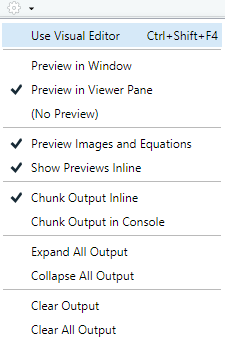
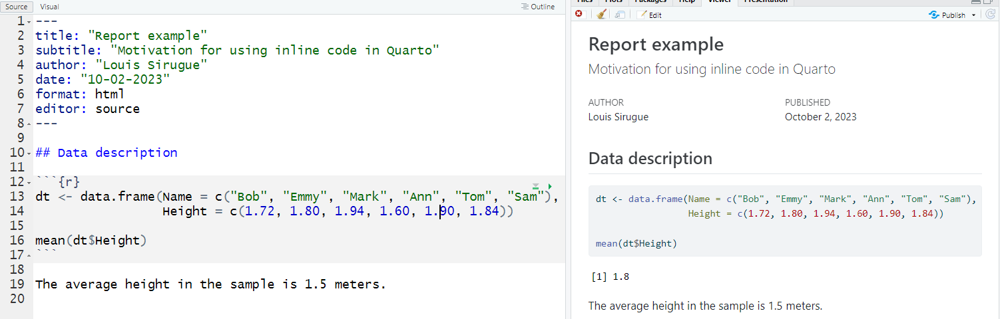

```{css, echo = F, eval = F}
body{background-color:black;filter:invert(1)}
```

```{r setup, include = FALSE}
source(paste0(getwd(), "/../source/style.R"))
stargazer <- stargazer::stargazer
theme_minimal <- theme_Rcourse
options(htmltools.dir.version = F)
knitr::opts_chunk$set(echo = T, message = F, warning = F, fig.align = "center")
```

### Last time we saw

<p style = "margin-bottom:2cm;">

<center><h4> The 3 core components of the ggplot() function </h4></center>

--

```{r, echo = F}
kable(tibble(Component = c("Data", "Mapping", "Geometry"),
             Contribution = c("Underlying values", "Axis assignment", "Type of plot"),
             Implementation = c("ggplot(data, | data %>% ggplot(.,", 
                                "aes(x = V1, y = V2, ...))",
                                "+ geom_point() + geom_line() + ...")), 
      caption = "",
      align = "lcc")
```

<p style = "margin-bottom:2cm;">

--

 * Any **other element** should be added with a **`+` sign**

--

```{r, eval = F}
ggplot(data, aes(x = V1, y = V2)) + 
  geom_point() + geom_line() +
  anything_else()
```

---

### Last time we saw

.pull-left[
<p style = "margin-bottom:1.75cm;">
<center><h4> Main customization tools </h4></center>
```{r, echo = F}
kable(tibble(`Item to customize` = c("Axes", "Baseline theme", "Annotations", "Theme"),
             `Main functions` = c("scale_[x/y]_[continuous/discrete]", 
                                  "theme_[void/minimal/.../dark]()", 
                                  "geom_[[h/v]line/text](), annotate()",
                                  "theme(axis.[line/ticks].[x/y] = ...,")), 
      caption = "", align = "ll")
```
]

--

.pull-right[
<center><h4> Main types of geometry </h4></center>
```{r, echo = F}
kable(tibble(Geometry = c("Bar plot", "Histogram", "Area", "Line", 
                          "Density", "Boxplot", "Violin", "Scatter plot"),
             Function = c("geom_bar()", "geom_histogram()", "geom_area()", 
                          "geom_line()", "geom_density()", "geom_boxplot()",
                          "geom_violin()", "geom_point()")), caption = "", align = "lc") 
```
]

---

### Last time we saw

.pull-left[

<center><h4> Main types of aesthetics </h4></center>

```{r, echo = F}
kable(tibble(Argument = c("alpha", "color", "fill", "size", "shape", "linetype"),
             Meaning = c("opacity from 0 to 1",
                         "color of the geometry", 
                         "fill color of the geometry", 
                         "size of the geometry", 
                         "shape for geometries like points", 
                         "solid, dashed, dotted, etc.")), caption = "")
```
]

--

.pull-right[

<p style = "margin-bottom:3.25cm;"></p>

<ul>
  <li>If specified <b>in the geometry</b></li>
  <ul>
    <li>It will apply uniformly to every <b>all the geometry</b></li>
  </ul>
</ul>
 
<p style = "margin-bottom:1cm;"></p>

<ul>
  <li>If assigned to a variable <b>in aes</b></li>
  <ul>
    <li>it will <b>vary with the variable</b> according to a scale documented in legend</li>
  </ul>
</ul>
]

<br>

--

```{r, eval = F}
ggplot(data, aes(x = V1, y = V2, size = V3)) + 
  geom_point(color = "steelblue", alpha = .6)
```

---

<h3>Today we learn how use R Markdown!</h3>

<p style = "margin-bottom:2cm;">

--

.pull-left[
#### 1. Basic principles
<p style = "margin-bottom:-.5cm;">
 * 1.1. What is R Markdown?
 * 1.2. YAML header
 * 1.3. Code chunks
 * 1.4. Text formatting
 * 1.5. Run and knit your code

#### 2. Useful features
<p style = "margin-bottom:-.5cm;">
 * 2.1. Inline code
 * 2.2. Tables
 * 2.3. Preset themes 
]

.pull-right[
#### 3. LaTeX for equations
<p style = "margin-bottom:-.5cm;">
 * 3.1. What is LaTeX?
 * 3.2. LaTeX syntax
 * 3.3. Large equations
 
#### 4. Wrap up!
 
#### 5. Guidelines for the homework
]

---

<h3>Today we learn how use R Markdown!</h3>

<p style = "margin-bottom:2cm;">

.pull-left[
#### 1. Basic principles
<p style = "margin-bottom:-.5cm;">
 * 1.1. What is R Markdown?
 * 1.2. YAML header
 * 1.3. Code chunks
 * 1.4. Text formatting
 * 1.5. Run and knit your code
]

---

### 1. Basic principles

#### 1.1. What is R Markdown?

<ul>
  <li><b>R Markdown</b> is a type of document in which you can both <b>write/run R code</b> and <b>edit text</b></li>
</ul>

<p style = "margin-bottom:1cm;">

--

<ul>
  <li>Here are some examples of R Markdown reports</li>
  <ul>
  <li><a href="https://louissirugue.github.io/data-analysis-course/archives/2021/homework1/correction.html">Last year homework</a></li>
  <li><a href="https://louissirugue.github.io/data-analysis-course/project/example">Example of research project</a></li>
  <li><a href="https://louissirugue.github.io/data-analysis-course/covariance_vs_correlation_with_code.html">Supplementary material</a></li>
  <li><a href="https://louissirugue.github.io/data-analysis-course/home.html">Course webpage and material</a></li>
  </ul>
</ul>

<p style = "margin-bottom:1cm;">

--

<ul>
  <li>It is structured around <b>3 types of content</b>:</li>
  <ul>
  <li><b>Code chunks</b> to run and render the output</li>
  <li><b>Editable text</b> to display</li>
  <li><b>YAML metadata</b> for the R Markdown build process</li>
  </ul>
</ul>

<p style = "margin-bottom:1cm;">

--

 <center><h4><i>&#10140; Let's go through them by creating our first R Markdown!</i></h4></center>

---

### 1. Basic principles

#### 1.1. What is R Markdown?

<center>&#10140; Click on <b>File > New File > Rmarkdown</b></center>

<p style = "margin-bottom:-.5cm;">

--

.pull-left[

]

--

.pull-right[
<p style = "margin-bottom:2.5cm;">

<ol>
  <li>Fill up the information and select <b>HTML</b></li>
  <li style = "margin-top:7cm;">Click on <b>OK</b></li>
</ol>
]

---

### 1. Basic principles

#### 1.1. What is R Markdown?

 * It creates a **template** containing the **3 types of content**:
 
--

.left-column[


<p style = "margin-bottom:1.25cm;">

<b>&nbsp;&nbsp;&nbsp;&nbsp;&nbsp;&nbsp;&nbsp;&nbsp;&nbsp;&nbsp;&nbsp;YAML header &#10140;</b>

<p style = "margin-bottom:.75cm;">

<b>&nbsp;&nbsp;&nbsp;&nbsp;&nbsp;&nbsp;&nbsp;&nbsp;&nbsp;&nbsp;&nbsp;&nbsp;Code chunks &#10140;</b>

<p style = "margin-bottom:1.25cm;">

<b>&nbsp;&nbsp;&nbsp;&nbsp;&nbsp;&nbsp;&nbsp;&nbsp;&nbsp;&nbsp;&nbsp;&nbsp;&nbsp;&nbsp;&nbsp;&nbsp;&nbsp;&nbsp;&nbsp;&nbsp;&nbsp;&nbsp;&nbsp;&nbsp;&nbsp;&nbsp;&nbsp;Text &#10140;</b>

<p style = "margin-bottom:1.75cm;">

<center><i>Let's go through them one by one!</i></center>

]

.right-column[
<center></center>
]

---

### 1. Basic principles

#### 1.2. YAML header

 * The **YAML header** contains general information related to the **file configuration**:

<p style = "margin-bottom:-.25cm;">

--

<ul>
<ul>
<li>Title/subtitle (in quotes)</li>
<li>Author (in quotes)</li>
<li>Date (in quotes)</li>
<li>Output type (html_document/pdf_document)</li>
<li>...</li>
</ul>
</ul>

--

<p style = "margin-bottom:1cm;">

* It should be specified at the **very beginning** of the document and surrounded by **three dashes** like so:

```{r, eval = F}
---
title: "My First Markdown Report"
author: "Louis Sirugue"
date: "24/09/2021"
output: html_document
---
```

---

### 1. Basic principles

#### 1.3. Code chunks

 * **Code chunks are blocks of R code** that can be run when working on and rendering the .Rmd file
 
--

<p style = "margin-bottom:1.5cm;">

 * You can insert a code chunk using `Ctrl + Alt + i` or by typing the **backticks chunk delimiters** as follows
 
````markdown
`r ''````{r}
1+1
```
````

<p style = "margin-bottom:.5cm;">

--

<p style = "margin-bottom:1cm;">

<ul>
  <li>When <b>rendering</b> the document, R will <b>execute</b> the code</li>
  <ul>
    <li>Both the <b>code</b> and the <b>output</b> will appear in the document like so:</li>
  </ul>
</ul>

```{r}
1+1
```

---

### 1. Basic principles

#### 1.3. Code chunks

 * The **content** to be **displayed** from the code chunk can be specified in **chunk options**
  * For instance, to display only the output and not the code chunk, you can set `echo` to `FALSE`

--

````markdown
`r ''````{r, echo = F}
1+1
```
````

--

<p style = "margin-bottom:1cm;">

 * And the output will only be
 
```{r, echo = F}
1+1
```

--

<p style = "margin-bottom:1cm;">

 * Instead of 
 
```{r}
1+1
```

---

### 1. Basic principles

#### 1.3. Code chunks

<center><h4> Chunk options to know </h4></center>

```{r, echo = F}
kable(tibble(Option = c("eval", "echo", "warning", "error", "message", 
                        "results", "fig.width", "fig.height"),
             Default = c("TRUE", "TRUE", "TRUE", "TRUE", 
                         "TRUE", "'markup'", "7", "7"),
             Effect = c("Whether to evaluate the code and include its results", 
             "Whether to display code along with its results", 
             "Whether to display warnings", 
             "Whether to display errors", 
             "Whether to display messages", 
             "'hide' to hide the output", 
             "Width in inches for plots created in chunk", 
             "Height in inches for plots created in chunk")), caption = "", align = "lcl") %>%
  row_spec(0, align = "c")
```

---

### 1. Basic principles

#### 1.4. Text formatting

<ul>
  <li>R Markdown is not only about rendering code but also about <b>writing</b> actual <b>text</b></li>
  <ul>
    <li>You can write <b>paragraphs</b> as you would normally do on a typical report</li>
    <li>And R Markdown provides convenient ways to <b>format</b> your text</li>
  </ul>
</ul>

<p style = "margin-bottom:1cm;">

--

<ul>
  <li>Basic formatting includes:</li>
  <ul>
    <li>Italics</li>
    <li>Bold</li>
    <li>hyperlinks</li>
    <li>headers</li>
    <li>block quote</li>
    <li>un/ordered lists</li>
    <li>...</li>
  </ul>
</ul>

<p style = "margin-bottom:1cm;">

--

<ul>
  <li>Unlike most text editing software, in R Markdown <b>text formatting</b> isn't about clicking on dedicated buttons</li>
  <ul>
    <li>It <b>relies on symbols</b> that should be written along with the text</li>
  </ul>
</ul>

---

### 1. Basic principles

#### 1.4. Text formatting

<p style = "margin-bottom:-1cm;">

.pull-left[
<center> <h4> Syntax </h4> </center>

`Plain text  ⠀`  
`End a line with two spaces for line break`

`*italics*`

`**bold**`

`# Header 1`

`## Header 2`

...


`###### Header 6`

`[link](https://www.rstudio.com)`

]

.pull-right[
<center> <h4> Output </h4> </center>

Plain text  
End a line with two spaces for line break

*italics*

**bold**

<p style = "margin-bottom:-1cm;">

# Header 1

<p style = "margin-bottom:-1cm;">

## Header 2

<p style = "margin-bottom:-1cm;">

...

<p style = "margin-bottom:-.5cm;">

###### Header 6

<p style = "margin-bottom:-.5cm;">

[link](https://www.rstudio.com)

]

---

### 1. Basic principles

#### 1.4. Text formatting

<p style = "margin-bottom:-1cm;">

.pull-left[
<center> <h4> Syntax </h4> </center>

`> block quote`

Horizontal rule:

`***`

`* unordered list`  
`* item 2`  
&nbsp;&nbsp;&nbsp;&nbsp;`+ sub-item 1`  
&nbsp;&nbsp;&nbsp;&nbsp;`+ sub-item 2`  


`1. ordered list`  
`2. item 2`  
&nbsp;&nbsp;&nbsp;&nbsp;`+ sub-item 1`  
&nbsp;&nbsp;&nbsp;&nbsp;`+ sub-item 2`  

]

.pull-right[
<center> <h4> Output </h4> </center>

> block quote

Horizontal rule:

<p style = "margin-bottom:.75cm;">

***

<p style = "margin-bottom:.75cm;">

* unordered list
* item 2
 + sub-item 1
 + sub-item 2
 
1. ordered list
2. item 2
 + sub-item 1
 + sub-item 2
 
]

---

### 1. Basic principles

#### 1.5. Run and knit your code

<ul>
  <li>To <b>execute</b> the content of a <b>code</b> chunk in R Markdown</li>
  <ul>
    <li>Click on the <b>green play button</b> at the top right of the chunk </li>
  </ul>
</ul>
 
--

.pull-left[

  <ul>
    <li>You can also:</li>
    <ul>
      <li><b>Run all chunks above</b> the current chunk </li>
      <li><b>Run all chunks</b> from the Run drop down menu at the top right (or Ctrl+Alt+R)</li>
    </ul>
  </ul>
  
  <center></center>
  
]

--

.pull-left[

  <ul>
    <li>To choose where the <b>output</b> must be <b>displayed</b>, click on the <i>"Options"</i> button</li>
    <ul>
      <li><b>Chunk output inline:</b> output displayed right</li>
    </ul>                             
  </ul>
  
  <p style = "margin-left:7.72cm; margin-top:-.55cm;">below the chunk in the</p>
  <p style = "margin-left:7.72cm; margin-top:-.55cm; margin-bottom:-.55cm;"><b>source panel</b></p>
  
  <ul><ul><li><b>Chunk output in console:</b> output displayed</li></ul></ul>
  
  <p style = "margin-left:8.88cm; margin-top:-.55cm;">in <b>console panel</b></p>
  
  <center></center>
  
]
  
---

### 1. Basic principles

#### 1.5. Run and knit your code

 * To **render** an R Markdown file, click on the **knit button** 
 
--

<center></center>

---

### 1. Basic principles

#### 1.5. Run and knit your code

 * To **render** an R Markdown file, click on the **knit button** 

<center></center>

---

<h3>Overview</h3>

<p style = "margin-bottom:2cm;">

.pull-left[
#### 1. Basic principles &#10004;
<p style = "margin-bottom:-.5cm;">
 * 1.1. What is R Markdown?
 * 1.2. YAML header
 * 1.3. Code chunks
 * 1.4. Text formatting
 * 1.5. Run and knit your code

#### 2. Useful features
<p style = "margin-bottom:-.5cm;">
 * 2.1. Inline code
 * 2.2. Tables
 * 2.3. Preset themes 
]

.pull-right[
#### 3. LaTeX for equations
<p style = "margin-bottom:-.5cm;">
 * 3.1. What is LaTeX?
 * 3.2. LaTeX syntax
 * 3.3. Large equations
 
#### 4. Wrap up!
 
#### 5. Guidelines for the homework
]

---

<h3>Overview</h3>

<p style = "margin-bottom:2cm;">

.pull-left[
#### 1. Basic principles &#10004;
<p style = "margin-bottom:-.5cm;">
 * 1.1. What is R Markdown?
 * 1.2. YAML header
 * 1.3. Code chunks
 * 1.4. Text formatting
 * 1.5. Run and knit your code

#### 2. Useful features
<p style = "margin-bottom:-.5cm;">
 * 2.1. Inline code
 * 2.2. Tables
 * 2.3. Preset themes 
]

---

### 2. Useful features

#### 2.1. Inline code

 * A big advantage of R Markdown is that you can <b>automate</b> your <b>reports</b>

--

<p style = "margin-bottom:1cm;">

<center><h4>Why is it useful?</h4></center>

<p style = "margin-bottom:1cm;">

<ul>
  <li>You might figure out quite late in the process that you need to <b>make a change</b> at the beginning of the analysis</li>
  <ul>
    <li>A change that potentially <b>impacts everything</b> that comes after in the report</li>
  </ul>
</ul>

<p style = "margin-bottom:1cm;">

--

<ul>
  <li>Imagine that you forgot to filter an irrelevant group of observations at the beginning</li>
  <ul>
    <li>If you simply filter your data at the beginning in a code chunk</li>
    <li>All your tables and figures will <b>update automatically</b></li>
  </ul>
</ul>

--

<p style = "margin-bottom:1cm;">

<ul>
  <li>But what if you wrote some of your results <b>within paragraphs?</b></li>
  <ul>
    <li>In a usual text formatting software you would have to update everything manually</li>
    <li>But here you can also make it <b>update automatically!</b></li>
  </ul>
</ul>

---

### 2. Useful features

#### 2.1. Inline code
 
 * Consider the following report :

<center></center>

---

### 2. Useful features

#### 2.1. Inline code

 * Imagine that there is a problem with the observation for which `dist > 100` and that you should discard it

<center></center>

---

### 2. Useful features

#### 2.1. Inline code

<ul>
  <li>All the results were updated automatically but not the text</li>
</ul>

<p style = "margin-bottom:-.5cm;">

--

<ul>
  <ul>
    <li>That's where <b>inline code</b> comes in!</li>
  </ul>
</ul>

--

<p style = "margin-bottom:.75cm;">
 
&#10140; **Inline code** allows to include the output of some **R code within text areas** of your report

<p style = "margin-bottom:.75cm;">

--

 * R code outside code chunks should be included between backticks:
  * Surrounding code with **backticks** in a text area will **change** the **format** to that of the code chunk
  * **Adding** the **`r`** letter right after the first backtick will **show** the **output** of the code instead of the code


--

.pull-left[
<center> <h4> Syntax </h4> </center>

```{r, eval=F}
`paste("a", "b", sep = "-")`
```

```{r, eval=F}
`r paste("a", "b", sep = "-")`
```

]

.pull-right[
<center> <h4> Output </h4> </center>

`paste("a", "b", sep = "-")`

<p style = "margin-bottom:1cm;">

`r paste("a", "b", sep = "-")`
 
]


---

### 2. Useful features

#### 2.1. Inline code

 * With inline code, **paragraphs** also do **update automatically**:

<center></center>


---

### 2. Useful features

#### 2.2. Tables

 * Displaying a table as a raw output can be unpleasant to read
 
--

```{r}
head(mtcars)
```

--

<p style = "margin-bottom:1.25cm;">

 * The `kable()` function from the `knitr` package allows to display tables in a nice way
 
```{r, eval = F}
library("knitr")
```

---

### 2. Useful features

#### 2.2. Tables

 * You just need to put the table you want to display inside the `kable()` function

```{r, eval = F}
kable(head(mtcars), caption = "First rows of the dataset")
```

--

```{r, echo = F}
kable(head(mtcars), caption = "First rows of the dataset")
```

---

### 2. Useful features

#### 2.2. Tables

 * For **big tables**, one solution is the `datatable()` function from the `DT` package
 
--
  
 * As with `kable()`, you just need to put the table you want to display inside the `datatable()` function
 
```{r, eval = FALSE}
install.packages("DT") # if not already installed
library("DT")
datatable(mtcars)
```

--

<p style = "margin-bottom:1cm;">

<ul>
  <li>The output will be an <b>interactive table</b> which allows to:</li>
  <ul>
    <li>Navigate in the table by displaying a limited number of rows at a time</li>
    <li>Choose the number of rows to display</li>
    <li>Search for a given element in the table</li>
  </ul>
</ul>

<p style = "margin-bottom:1cm;">

--

 * You can select the default number of rows to display as follows

```{r, eval = F}
datatable(mtcars, options = list(pageLength = 5))
```

---

### 2. Useful features

#### 2.2. Tables

```{r, echo = F}
library("DT")
datatable(mtcars, options = list(pageLength = 5))
```

--

<p style = "margin-bottom:1.5cm;">

<center><i>&#10140; Try to search for <b>"Toyota"</b> for instance</i></center>

---

### 2. Useful features

#### 2.3. Preset themes


<ul>
  <li>The <b>default theme</b> of R Markdown might seem <b>a bit dull</b></li>
  <ul>
    <li>The look of your reports can easily be <b>enhanced</b> using a variety of <b>preset</b> themes</li>
    <li>The preset theme to use should be specified in the <b>YAML header</b></li>
    <li>Add a theme argument to the html_document format specified as output</li>
  </ul>
</ul>

--

<p style = "margin-bottom:1cm;">
 
```{r, eval = F}
---
title: "My First Markdown Report"
author: "Louis Sirugue"
date: "24/09/2021"
output: 
  html_document:
    theme: cosmo
---
```

<p style = "margin-bottom:1cm;">

--

<ul>
  <li>When using themes from downloaded packages, how to set the theme can be slightly different</li>
  <ul>
    <li>Check the online documentation</li>
  </ul>
</ul>

---

### 2. Useful features

#### 2.3. Preset themes

<p style = "margin-bottom:-1cm;">

.pull-left[
<center><h4 style = "margin-bottom:0cm;">cosmo</h4>
</center>
]

--

.pull-right[
<center><h4 style = "margin-bottom:0cm;">cerulean</h4>
</center>
]

---

### 2. Useful features

#### 2.3. Preset themes

<p style = "margin-bottom:-1cm;">

.pull-left[
<center><h4 style = "margin-bottom:0cm;">cayman (from prettydoc)</h4>
</center>
]

--

.pull-right[
<center><h4 style = "margin-bottom:0cm;">tactile (from prettydoc)</h4>
</center>
]

---

### 2. Useful features

#### 2.3. Preset themes

<center><h4 style = "margin-bottom:0cm;">leonids (from prettydoc)</h4>
</center>

---

### 2. Useful features

#### 2.3. Preset themes

<p style = "margin-bottom:-.5cm;">

.pull-left[
<center><h4 style = "margin-bottom:0cm;">downcute (from rmdformats)</h4>
</center>
]

--

.pull-right[
<center><h4 style = "margin-bottom:.5cm;">downcute chaos (from rmdformats)</h4>
</center>
]

---

### 2. Useful features

#### 2.3. Preset themes


.pull-left[
<center><h4 style = "margin-bottom:0cm;">readthedown (from rmdformats)</h4>
</center>
]

--

.pull-right[
<center><h4 style = "margin-bottom:0cm;">robobook (from rmdformats)</h4>
</center>
]

---

<h3>Overview</h3>

<p style = "margin-bottom:2cm;">

.pull-left[
#### 1. Basic principles &#10004;
<p style = "margin-bottom:-.5cm;">
 * 1.1. What is R Markdown?
 * 1.2. YAML header
 * 1.3. Code chunks
 * 1.4. Text formatting
 * 1.5. Run and knit your code

#### 2. Useful features &#10004;
<p style = "margin-bottom:-.5cm;">
 * 2.1. Inline code
 * 2.2. Tables
 * 2.3. Preset themes 
]

.pull-right[
#### 3. LaTeX for equations
<p style = "margin-bottom:-.5cm;">
 * 3.1. What is LaTeX?
 * 3.2. LaTeX syntax
 * 3.3. Large equations
 
#### 4. Wrap up!
 
#### 5. Guidelines for the homework
]

---

<h3>Overview</h3>

<p style = "margin-bottom:2cm;">

.pull-left[
#### 1. Basic principles &#10004;
<p style = "margin-bottom:-.5cm;">
 * 1.1. What is R Markdown?
 * 1.2. YAML header
 * 1.3. Code chunks
 * 1.4. Text formatting
 * 1.5. Run and knit your code

#### 2. Useful features &#10004;
<p style = "margin-bottom:-.5cm;">
 * 2.1. Inline code
 * 2.2. Tables
 * 2.3. Preset themes 
]

.pull-right[
#### 3. LaTeX for equations
<p style = "margin-bottom:-.5cm;">
 * 3.1. What is LaTeX?
 * 3.2. LaTeX syntax
 * 3.3. Large equations
]

---

### 3. LaTeX for equations

#### 3.1. What is LaTeX?

 * $\LaTeX$ is a document preparation system

<p style = "margin-bottom:.95cm;">

--

<ul>
  <li>But LaTeX is not a <i>"what you see is what you get"</i> system</li>
  <ul>
    <li>In Microsoft Word or Google doc, you work directly on the "output document"</li>
    <li><b>LateX</b> works more like R Markdown: <b>Edit</b> your text <b>in a script using commands and symbols</b></li> 
  </ul>
</ul>

<p style = "margin-left:11.25cm; margin-top:-.55cm;"><b>Compile</b> the script to <b>get the output</b></p>


<p style = "margin-bottom:.95cm;">

--

<ul>
  <li>LaTeX is the <b>preferred</b> typesetting system for most <b>academic</b> fields mainly because:</li>
  <ul>
    <li>Many things can be <b>automated</b> in LaTeX</li>
    <li>It has a good way to typeset <b>mathematical formulas</b></li>
  </ul>
</ul>

<p style = "margin-bottom:.95cm;">

--

 * We're not gonna learn how to make $\LaTeX$ documents, but just how to make equations 
 
$$\overline{x}=\frac{1}{N}\sum_{i=1}^N x_i$$

---

### 3. LaTeX for equations

#### 3.1. What is LaTeX?

 * To include a **LaTeX equation** in R Markdown, you simply have to surround it with the **`$` sign**:
 
--
 
 <p style = "margin-bottom:-.5cm;">
 
.pull-left[
<center> <h4> Syntax </h4> </center>

`1 + 1`

`$1 + 1$`

]

.pull-right[
<h4> Output </h4>

1 + 1

$1 + 1$

]

--

<p style = "margin-bottom:1.25cm;">

 * LaTeX is a convenient way to display **mathematical symbols** and to **structure equations**
  * The **syntax** is mainly based on **backslashes \ and braces {}**

<p style = "margin-bottom:1cm;">

--

<center><h4 style = "margin-bottom:.25cm;"> Example: </h4></center> 
<p style = "margin-bottom:.25cm;">
&nbsp;&nbsp;&nbsp;&nbsp;&#10140; What you type in the text area: `$x \neq \frac{\alpha \times \beta}{2}$`  
</p>
&nbsp;&nbsp;&nbsp;&nbsp;&#10140; What is rendered when knitting the document: $x \neq \frac{\alpha \times \beta}{2}$

---

### 3. LaTeX for equations

#### 3.2. LaTeX syntax

&nbsp;&nbsp;&nbsp;&nbsp;&#10140; **Common greek letters** 

<p style = "margin-bottom:-.25cm;">
 
.pull-left[
<center> <h4> Syntax </h4> </center>

`$\alpha$`  
`$\beta$`  
`$\gamma$` `$\Gamma$`  
`$\delta$` `$\Delta$`  
`$\epsilon$` `$\varepsilon$`  
`$\lambda` `\Lambda$`  
`$\phi$` `$\Phi$`  
`$\pi$` `$\Pi$`  
`$\psi$` `$\Psi$`  
`$\theta$` `$\Theta$`  
`$\sigma$` `$\Sigma$`  
...

]

.pull-right[
<center> <h4> Output </h4> </center>

$\alpha$  
$\beta$  
$\gamma$ $\Gamma$  
$\delta$ $\Delta$  
$\epsilon$ $\varepsilon$  
$\lambda$ $\Lambda$  
$\phi$ $\Phi$  
$\pi$ $\Pi$  
$\psi$ $\Psi$  
$\theta$ $\Theta$  
$\sigma$ $\Sigma$  
...

]

---

### 3. LaTeX for equations

#### 3.2. LaTeX syntax
 
&nbsp;&nbsp;&nbsp;&nbsp;&#10140; **Common symbols** 
 
.pull-left[
<center> <h4> Syntax </h4> </center>

`$+ - \pm$`  
`$\times \div$`  
`$= \neq \equiv \approx$`  
`$> < \geq \leq \lessgt$`  
`$\rightarrow \leftarrow \Leftrightarrow$`  
`$\in \notin$`  
`$\forall \exists \nexists$`  
`$\infty$`  
`$\sum \prod \int$`  
...

]

.pull-right[
<center> <h4> Output </h4> </center>

$+$ $-$ $\pm$  
$\times$ $\div$  
$=$ $\neq$ $\equiv$ $\approx$  
$>$ $<$ $\geq$ $\leq$ $\lessgtr$  
$\rightarrow$ $\leftarrow$ $\Leftrightarrow$  
$\in$ $\notin$  
$\forall$ $\exists$ $\nexists$  
$\infty$  
$\sum$ $\prod$ $\int$  
...

]

---

### 3. LaTeX for equations

#### 3.2. LaTeX syntax
 
&nbsp;&nbsp;&nbsp;&nbsp;&#10140; **Exponents and accentuation**
 
.pull-left[
<center> <h4> Syntax </h4> </center>

`$x^a$`  
`$x_b$`  
`$x^a_b$`  
`$x^{a, i}_{b, j}$`  
<p style = "margin-bottom:.25cm;">  
`$\hat{\beta} \widehat{\beta_{i,j}}$`  
`$\tilde{\beta} \widetilde{\beta_{i,j}}$`  
`$\overline{x} \underline{x}$`  
`$\overrightarrow{x} \underleftarrow{x}$`  
...

]

.pull-right[
<center> <h4> Output </h4> </center>

$x^a$  
$x_b$  
$x^a_b$  
$x^{a, i}_{b, j}$  
$\hat{\beta}$ $\widehat{\beta_{i,j}}$  
$\tilde{\beta}$ $\widetilde{\beta_{i,j}}$  
$\overline{x}$ $\underline{x}$  
$\overrightarrow{x}$ $\underleftarrow{x}$  
...

]

---

### 3. LaTeX for equations

#### 3.2. LaTeX syntax
 
&nbsp;&nbsp;&nbsp;&nbsp;&#10140; **Math constructs and variable sized symbols**
 
.pull-left[
<center> <h4> Syntax </h4> </center>

`$\frac{a \times b}{c}$`  
`$\sqrt{x} \sqrt[n]{x}$`  
`$\sum_{i = 1}^N$`  
`$\prod_{i = 1}^N$`  
`$\int_a^b$`  
<p style = "margin-bottom:.5cm;">  
`$\overline{x}=\frac{1}{N}\sum_{i=1}^N x_i$`  
...

]

.pull-right[
<center> <h4> Output </h4> </center>

$\frac{a \times b}{c}$  
$\sqrt{x}$ $\sqrt[n]{x}$  
$\sum_{i = 1}^N$  
$\prod_{i = 1}^N$  
$\int_a^b$  

$\overline{x}=\frac{1}{N}\sum_{i=1}^N x_i$  
...

]

---

### 3. LaTeX for equations

#### 3.3. Large equations

<ul>
  <li>Surrounding a LaTeX input with <b>one $</b> on each side is suitable for <b>inline equation</b></li>
</ul>

--

<p style = "margin-bottom:1cm;"> 

<ul>
  <li>You can also surround a LaTeX input with <b>two $</b></li>
  <ul>
    <li>It puts the equation at the <b>center of a new line</b></li>
    <li>And gives <b>more vertical space</b> to the equation</li>
  </ul>
</ul> 
 
--

<p style = "margin-bottom:1cm;"> 

<ul>
  <li>To surround a LaTeX input with two $ is usually good for:</li>
  <ul>
    <li>Large equations</li>
    <li>Equations that should be emphasized</li>
  </ul>
</ul> 

--

<p style = "margin-bottom:-.25cm;"> 

.pull-left[

<h4 style = "margin-bottom:-.5cm;">The mean formula with one `$` on each side</h4>  
&nbsp;&nbsp;&nbsp;&nbsp;&#10140; For inline equations  
 
$\overline{x}=\frac{1}{N}\sum_{i=1}^N x_i$ 

]

.pull-right[

<h4 style = "margin-bottom:-.5cm;">The mean formula with two `$` on each side</h4>  
&nbsp;&nbsp;&nbsp;&nbsp;&#10140; For large/emphasized equations  
 
$$\overline{x}=\frac{1}{N}\sum_{i=1}^N x_i$$ 

]

---

### 3. LaTeX for equations

#### 3.3. Large equations

<ul>
  <li>Sometimes you do not want to <b>consecutive lines</b> of equations to be centered</li>
  <ul>
    <li>You may want to <b>align</b> them based on <b>common part</b> within the equations</li>
  </ul>
</ul>

--

<p style = "margin-bottom:1cm;">

 * This should be done in an **`aligned` environment** (`$\begin{aligned}...\end{aligned}$`)

<p style = "margin-bottom:-.5cm;">  

<ul>
  <ul>
    <li>Place the <b>"&"</b> symbol where the equations should be aligned</li>
    <li>And break a line using <b>"\\"</b></li>
  </ul>
</ul>

<p style = "margin-bottom:1cm;">

--

```{r, eval = F}
$$
\begin{aligned}
x & = (a + b) \times c \\
  & = (a \times c) + (b \times c)
\end{aligned}
$$
```

$$\begin{aligned}
x & = (a + b) \times c \\
  & = (a \times c) + (b \times c)
\end{aligned}$$

---

### 3. LaTeX for equations

#### 3.3. Large equations
 
 * The same principle applies within **`cases` environment**

--

```{r, eval = F}
$$\text{Med}(x) = \begin{cases} 
  x[\frac{N+1}{2}]                          & \text{if } N \text{ is odd}\\
  \frac{x[\frac{N}{2}]+x[\frac{N}{2}+1]}{2} & \text{if } N \text{ is even}
\end{cases}$$
```

$$\text{Med}(x) = \begin{cases} 
  x[\frac{N+1}{2}]                          & \text{if } N \text{ is odd}\\
  \frac{x[\frac{N}{2}]+x[\frac{N}{2}+1]}{2} & \text{if } N \text{ is even}
\end{cases}$$

--

 * Note that the **`text` function** allows to write text without it being interpreted as mathematical letters:

<p style = "margin-bottom:-.5cm;"> 

--

.pull-left[
```{r, eval = F}
$$Mean(x)=\frac{1}{N}\sum_{i=1}^N x_i$$
```
$$Mean(x)=\frac{1}{N}\sum_{i=1}^N x_i$$
]

.pull-right[
```{r, eval = F}
$$\text{Mean}(x)=\frac{1}{N}\sum_{i=1}^N x_i$$
```
$$\text{Mean}(x)=\frac{1}{N}\sum_{i=1}^N x_i$$
]

---

### Practice

.left-column[

<p style = "margin-bottom:2cm;"></p>

<center><b><i>Reproduce the following html output using R markdown</i></b></center>

<p style = "margin-bottom:5cm;"></p>

<center><h3><i>You've got 15 minutes!</i></h3></center>

]

.right-column[
<p style = "margin-bottom:-3.5cm;"></p>
<center></center>
]

---

### Solution

<p style = "margin-bottom:1.5cm;"></p>

````markdown
---
title: "Lecture 5 - Practice"
author: "Your name"
date: "03/10/2022"
output: 
  html_document:
    theme: cosmo
---

### 1. Setup

The packages needed in an Rmd must *always* be loaded in a code chunk at the beginning of the file.

̀ ̀ ̀ {r, message = F, warning = F}
library(tidyverse)
̀ ̀ ̀

However, the command `install.packages()` must **not** be written in an R markdown.  
It should be run only once in the console.
````

---

### Solution

<p style = "margin-bottom:1.5cm;"></p>

````markdown

### 2. Computations

The `rnorm(n, mean, sd)` command allows to generate n observations drawn from a normal distribution
with a given mean and standard deviation.

̀ ̀ ̀ {r}
x <- rnorm(1000, 0, 1)
̀ ̀ ̀

We can compute the mean $\overline{x}$ of this variable:

$$\overline{x}=\frac{1}{N}\sum_{i=1}^N x_i$$

̀ ̀ ̀ {r}
mean(x)
̀ ̀ ̀

Here is the result, written in **inline code** such that it updates automatically: ̀ r mean(x)̀ 
   ⠀
````

---

<h3>Overview</h3>

<p style = "margin-bottom:2cm;">

.pull-left[
#### 1. Basic principles &#10004;
<p style = "margin-bottom:-.5cm;">
 * 1.1. What is R Markdown?
 * 1.2. YAML header
 * 1.3. Code chunks
 * 1.4. Text formatting
 * 1.5. Run and knit your code

#### 2. Useful features &#10004;
<p style = "margin-bottom:-.5cm;">
 * 2.1. Inline code
 * 2.2. Tables
 * 2.3. Preset themes 
]

.pull-right[
#### 3. LaTeX for equations &#10004;
<p style = "margin-bottom:-.5cm;">
 * 3.1. What is LaTeX?
 * 3.2. LaTeX syntax
 * 3.3. Large equations
 
#### 4. Wrap up!
 
#### 5. Guidelines for the homework
]

---

<h3>Overview</h3>

<p style = "margin-bottom:2cm;">

.pull-left[
#### 1. Basic principles &#10004;
<p style = "margin-bottom:-.5cm;">
 * 1.1. What is R Markdown?
 * 1.2. YAML header
 * 1.3. Code chunks
 * 1.4. Text formatting
 * 1.5. Run and knit your code

#### 2. Useful features &#10004;
<p style = "margin-bottom:-.5cm;">
 * 2.1. Inline code
 * 2.2. Tables
 * 2.3. Preset themes 
]

.pull-right[
#### 3. LaTeX for equations &#10004;
<p style = "margin-bottom:-.5cm;">
 * 3.1. What is LaTeX?
 * 3.2. LaTeX syntax
 * 3.3. Large equations
 
#### 4. Wrap up!
]

---

### 4. Wrap up!

#### 1. Three types of contents

.left-column[
<p style = "margin-bottom:1.5cm;">

<b>&nbsp;&nbsp;&nbsp;&nbsp;&nbsp;&nbsp;&nbsp;&nbsp;&nbsp;&nbsp;&nbsp;YAML header &#10140;</b>

<p style = "margin-bottom:1.75cm;">

<b>&nbsp;&nbsp;&nbsp;&nbsp;&nbsp;&nbsp;&nbsp;&nbsp;&nbsp;&nbsp;&nbsp;&nbsp;Code chunks &#10140;</b>

<p style = "margin-bottom:1.75cm;">

<b>&nbsp;&nbsp;&nbsp;&nbsp;&nbsp;&nbsp;&nbsp;&nbsp;&nbsp;&nbsp;&nbsp;&nbsp;&nbsp;&nbsp;&nbsp;&nbsp;&nbsp;&nbsp;&nbsp;&nbsp;&nbsp;&nbsp;&nbsp;&nbsp;&nbsp;&nbsp;&nbsp;Text &#10140;</b>
]

.right-column[

]

---

### 4. Wrap up!

#### 2. Useful features

&#10140; **Inline code** allows to include the output of some **R code within text areas** of your report

<p style = "margin-bottom:-.5cm;">

--

.pull-left[
<center> <h4> Syntax </h4> </center>

```{r, eval=F}
`paste("a", "b", sep = "-")`
```

```{r, eval=F}
`r paste("a", "b", sep = "-")`
```

]

.pull-right[
<center> <h4> Output </h4> </center>

`paste("a", "b", sep = "-")`

<p style = "margin-bottom:1cm;">

`r paste("a", "b", sep = "-")`
 
]

<p style = "margin-bottom:2cm;">

--

&#10140; **`kable()`** for clean **html tables** and **`datatable()`** to navigate in **large tables**
 
```{r, eval = FALSE}
kable(results_table)
datatable(results_table)
```

---

### 4. Wrap up!

#### 3. LaTeX for equations

 * $\LaTeX$ is a convenient way to display **mathematical** symbols and to structure **equations**
  * The **syntax** is mainly based on **backslashes \ and braces {}**

--

<p style = "margin-bottom:1cm;">

&nbsp;&nbsp;&nbsp;&nbsp;&#10140; What you **type** in the text area: `$x \neq \frac{\alpha \times \beta}{2}$`  
&nbsp;&nbsp;&nbsp;&nbsp;&#10140; What is **rendered** when knitting the document: $x \neq \frac{\alpha \times \beta}{2}$

--

<p style = "margin-bottom:1.5cm;">

<center>To <b>include</b> a <b>LaTeX equation</b> in R Markdown, you simply have to surround it with the <b>$ sign</b></center>

<p style = "margin-bottom:0cm;">

.pull-left[

<h4 style = "margin-bottom:0cm;">The mean formula with one `$` on each side</h4>  
&nbsp;&nbsp;&nbsp;&nbsp;&#10140; For inline equations  
 
$\overline{x}=\frac{1}{N}\sum_{i=1}^N x_i$ 

]

.pull-right[

<h4 style = "margin-bottom:0cm;">The mean formula with two `$` on each side</h4>  
&nbsp;&nbsp;&nbsp;&nbsp;&#10140; For large/emphasized equations  
 
$$\overline{x}=\frac{1}{N}\sum_{i=1}^N x_i$$ 

]

---

<h3>Overview</h3>

<p style = "margin-bottom:2cm;">

.pull-left[
#### 1. Basic principles &#10004;
<p style = "margin-bottom:-.5cm;">
 * 1.1. What is R Markdown?
 * 1.2. YAML header
 * 1.3. Code chunks
 * 1.4. Text formatting
 * 1.5. Run and knit your code

#### 2. Useful features &#10004;
<p style = "margin-bottom:-.5cm;">
 * 2.1. Inline code
 * 2.2. Tables
 * 2.3. Preset themes 
]

.pull-right[
#### 3. LaTeX for equations &#10004;
<p style = "margin-bottom:-.5cm;">
 * 3.1. What is LaTeX?
 * 3.2. LaTeX syntax
 * 3.3. Large equations
 
#### 4. Wrap up! &#10004;
 
#### 5. Guidelines for the homework 
]

---

### 5. Guidelines for the homework

<ul>
  <li>The homework should be done with R Markdown</li>
  <ul>
    <li>Both the .Rmd and the corresponding .html should be sent</li>
    <li>Deadline: October 10</li>
  </ul>
</ul>

--

<ul>
  <li>You are expected to use (when relevant) the features covered today. It will be taken into account in the grading (see the <b>indicative</b> grading system <a href="https://louissirugue.github.io/data-analysis-course/homework1/grading.html">here</a>)</li>
  <ul>
    <li>Inline code</li>
    <li>kable</li>
    <li>LaTeX equations</li>
    <li>...</li>
  </ul>
</ul>

--

<ul>
  <li>Your Markdown report should run without error</li>
  <ul>
    <li>If you use absolute paths that I need to change, define it once at the very beginning and use paste0()</li>
  </ul>
</ul>

```{r, eval = F}
path <- "C:/Users/name/Desktop/homework/"
data1 <- read.csv(paste0(path, "file1.csv"))

...

data2 <- read.csv(paste0(path, "file2.csv"))
```
