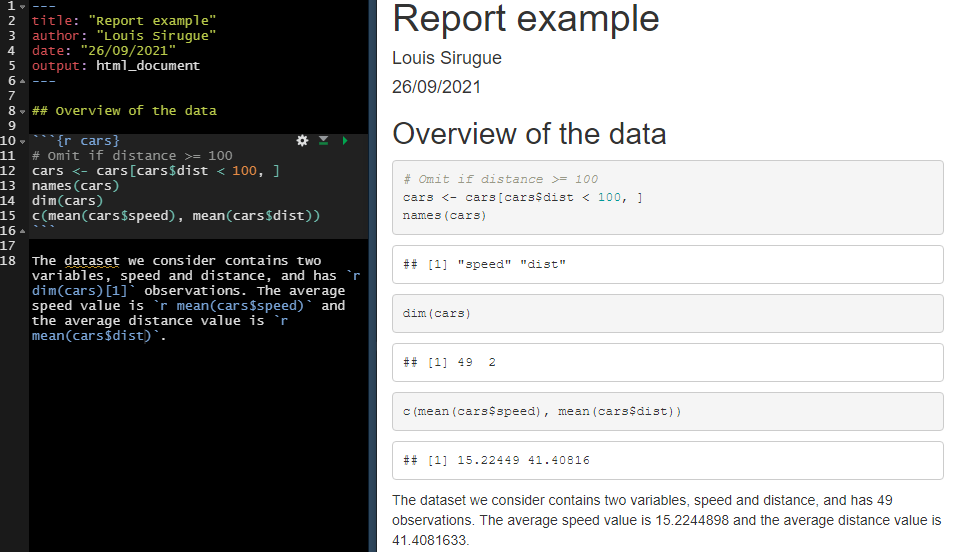

```{css, echo = F, eval = params$dark}
body{background-color:black;filter:invert(1)}
```

```{r setup, include = FALSE}
source(paste0(getwd(), "/../source/style.R"))
stargazer <- stargazer::stargazer
theme_minimal <- theme_Rcourse
options(htmltools.dir.version = F)
knitr::opts_chunk$set(echo = T, message = F, warning = F, fig.align = "center", dpi = 300, out.width = "100%")
set.seed(1)
```

### Part I recap

#### Import data

```{r, eval = F}
fb <- read.csv("C:/User/Documents/ligue1.csv", encoding = "UTF-8")
```
```{r, echo = F}
fb <- read.csv("ligue1.csv", encoding = "UTF-8")
```

--

<p style = "margin-bottom:1.5cm;"></p>

#### Class

```{r, eval = F}
is.numeric("1.6180339") # What would be the output?
```

--

```{r, echo = F}
is.numeric("1.6180339") # What would be the output?
```

--

<p style = "margin-bottom:1.5cm;"></p>

#### Subsetting

```{r}
fb$Home[3]
```

---

### Part I recap

#### Distributions

  * The **distribution** of a variable documents all its possible values and how frequent they are

--

```{r, echo = F, fig.width = 12, fig.height = 4, dpi=300, out.width="95%"}
library("ggpubr")

myhist <- function(b) {
  ggplot(hist_data, aes(x = x)) + 
    geom_histogram(fill = "#6794A7", color = "#014D64", alpha = .8, bins = b) +
    ylab("") + xlab("") + ggtitle(paste(b, "bins")) + theme_minimal(base_size = 14)
}

mydens <- function(b) {
  ggplot(hist_data, aes(x = x)) +
  geom_density(fill = "#6794A7", color = "#014D64", alpha = .8, bw = b) +
    ylab("") + xlab("") + ggtitle(paste("Bandwidth:", b)) + theme_minimal(base_size = 14)
}

hist_data <- read.csv("hist_illustration.csv") %>%
  mutate(y = runif(1000, 0, 1.45))

data <- read.csv("distribution_data.csv")

ggarrange(ggplot(data, aes(x = V1)) +
  geom_bar(stat = "count", fill = "#6794A7", color = "#014D64", alpha = .8) +
  scale_y_continuous(limits = c(0, 9), breaks = 0:9) + 
  scale_x_discrete(name = "", limits = 1:8) + ylab("") +
  theme_minimal(base_size = 16) + ggtitle("Barplot"),
  myhist(50) + ggtitle("Histogram"), mydens(.25) + ggtitle('Density'), 
  nrow = 1)
```

--

<p style = "margin-bottom:-1cm;">

 * We can describe a distribution with:
  
---

### Part I recap

#### Distributions

  * The **distribution** of a variable documents all its possible values and how frequent they are

```{r, echo = F, fig.width = 12, fig.height = 4, dpi=300, out.width="95%"}
ggarrange(ggplot(data, aes(x = V1)) +
            geom_bar(stat = "count", fill = "#6794A7", color = "#014D64", alpha = .8) +
            scale_y_continuous(limits = c(0, 9), breaks = 0:9) + 
            scale_x_discrete(name = "", limits = 1:8) + ylab("") +
            theme_minimal(base_size = 16) + ggtitle("Barplot") +
            geom_vline(xintercept = mean(data$V1)),
          myhist(50) + ggtitle("Histogram") +
            geom_vline(xintercept = mean(hist_data$x)), 
          mydens(.25) + ggtitle('Density') +
            geom_vline(xintercept = mean(hist_data$x)), 
  nrow = 1)
```

<p style = "margin-bottom:-1cm;">

 * We can describe a distribution with:
  * Its **central tendency**

---

### Part I recap

#### Distributions

  * The **distribution** of a variable documents all its possible values and how frequent they are

```{r, echo = F, fig.width = 12, fig.height = 4, dpi=300, out.width="95%"}
ggarrange(ggplot(data, aes(x = V1)) +
            geom_bar(stat = "count", fill = "#6794A7", color = "#014D64", alpha = .8) +
            scale_y_continuous(limits = c(0, 9), breaks = 0:9) + 
            scale_x_discrete(name = "", limits = 1:8) + ylab("") +
            theme_minimal(base_size = 16) + ggtitle("Barplot") +
            geom_vline(xintercept = mean(data$V1)) + 
            annotate("segment", x = mean(data$V1), xend = mean(data$V1) - sd(data$V1), y = 5.65, yend = 5.65, 
                     arrow = arrow(length = unit(0.25, "cm"))) + 
            annotate("segment", x = mean(data$V1), xend = mean(data$V1) + sd(data$V1), y = 5.65, yend = 5.65, 
                     arrow = arrow(length = unit(0.25, "cm"))),
          
          myhist(50) + ggtitle("Histogram") +
            geom_vline(xintercept = mean(hist_data$x)) + 
            annotate("segment", x = mean(hist_data$x), xend = mean(hist_data$x) - sd(hist_data$x), y = 35.2, yend = 35.2, 
                     arrow = arrow(length = unit(0.25, "cm"))) + 
            annotate("segment", x = mean(hist_data$x), xend = mean(hist_data$x) + sd(hist_data$x), y = 35.2, yend = 35.2, 
                     arrow = arrow(length = unit(0.25, "cm"))), 
          
          mydens(.25) + ggtitle('Density') +
            geom_vline(xintercept = mean(hist_data$x)) + 
            annotate("segment", x = mean(hist_data$x), xend = mean(hist_data$x) - sd(hist_data$x), y = .165, yend = .165, 
                     arrow = arrow(length = unit(0.25, "cm"))) + 
            annotate("segment", x = mean(hist_data$x), xend = mean(hist_data$x) + sd(hist_data$x), y = .165, yend = .165, 
                     arrow = arrow(length = unit(0.25, "cm"))), 
  nrow = 1)
```

<p style = "margin-bottom:-1cm;">

 * We can describe a distribution with:
  * Its **central tendency**
  * And its **spread**
  
---

### Part I recap

#### Central tendency

--

.pull-left[

 * The **mean** is the sum of all values divided by the number of observations

$$\bar{x} = \frac{1}{N}\sum_{i = 1}^Nx_i$$ 

]

--

.pull-right[

 * The **median** is the value that divides the (sorted) distribution into two groups of equal size

$$\text{Med}(x) = \begin{cases} x[\frac{N+1}{2}] & \text{if } N \text{ is odd}\\
\frac{x[\frac{N}{2}]+x[\frac{N}{2}+1]}{2} & \text{if } N \text{ is even}
\end{cases}$$

]

--

#### Spread

--

.pull-left[

 * The **standard deviation** is square root of the average squared deviation from the mean

$$\text{SD}(x) = \sqrt{\text{Var}(x)} = \sqrt{\frac{1}{N}\sum_{i = 1}^N(x_i-\bar{x})^2}$$
 
]

--

.pull-right[

<p style = "margin-bottom:-5.5cm;"></p>

 * The **interquartile range** is the difference between the maximum and the minimum value from the middle half of the distribution

<p style = "margin-bottom:1cm;"></p>

$$\text{IQR} = Q_3 - Q_1 $$

]

---

### Part I recap

#### Inference

<ul> 
  <li>In Statistics, we view variables as a given realization of a <b>data generating process</b></li>
  <ul>
    <li>Hence, the <b>mean</b> is what we call an <b>empirical moment</b>, which is an <b>estimation</b>...</li>
    <li>... of the <b>expected value</b>, the <b>theoretical moment</b> of the DGP we're interested in</li>
  </ul>
</ul>

--

<ul> 
  <li>To know how confident we can be in this estimation, we need to compute a <b>confidence interval</b></li>
</ul>

$$[\bar{x} - t_{n-1, \:97.5\%}\times\frac{\text{SD}(x)}{\sqrt{n}}; \:\bar{x} + t_{n-1, \:97.5\%}\times\frac{\text{SD}(x)}{\sqrt{n}}]$$

--

<ul>
  <ul>
    <li>It gets <b>larger</b> as the <b>variance</b> of the distribution of \(x\) increases</li>
    <li>And gets <b>smaller</b> as the <b>sample size</b> \(n\) increases</li>
  </ul>
</ul>

--

```{r, echo = F, fig.width = 12, fig.height = 1.75, dpi=300, out.width="95%"}
distribs <- tibble(val = c(rnorm(30, 0, 1), rnorm(100, 0, 1), rnorm(30, 0, 2), rnorm(100, 0, 2)),
                   dist = c(rep("d1",30), rep("d2", 100), rep("d3", 30), rep("d4", 100)),
                   y = 1) 

distribs <-distribs %>%
  bind_rows(distribs %>%
              group_by(dist) %>%
              summarise(lb = mean(val) - qt(.999, n()-1)*(sd(val)/sqrt(n())),
                        ub = mean(val) + qt(.999, n()-1)*(sd(val)/sqrt(n())),
                        val = mean(val),
                        y = 1.75) %>%
              pivot_longer(c(lb, ub), names_to = "interlab", values_to = "interval"))

ggplot() +
  geom_point(data = distribs %>% filter(y == 1), 
             aes(x = val, y = y, color = dist, fill = dist), 
             position = "jitter", show.legend = F) +
  geom_point(data = distribs %>% filter(y == 1.75), 
             aes(x = val, y = y, color = dist, fill = dist), 
             show.legend = F, size = 2) +
  geom_line(data = distribs, aes(x = interval, y = y, color = dist, fill = dist), show.legend = F, size = 1) +
  facet_wrap(~dist, nrow = 1) +
  theme(axis.title = element_blank(),
        axis.text.y = element_blank(),
        strip.text = element_blank(),
        strip.background = element_blank())
```

---

### Part I recap

#### Packages

```{r, eval = F}
library(dplyr)
```

--

<p style = "margin-bottom:1.5cm;"></p>

#### Main dplyr functions

.left-column[
```{r, echo = F}
kable(tibble(Function = c("mutate()", "select()", "filter()", 
                    "arrange()", "group_by()", "summarise()"),
       Meaning = c("Modify or create a variable", "Keep a subset of variables", "Keep a subset of observations",
                   "Sort the data", "Group the data", "Summarizes variables into 1 observation per group")),
      caption = "")
```
]

--

.right-column[

]

---

### Part I recap

#### Merge data

```{r}
a <- data.frame(x = c(1, 2, 3), y = c("a", "b", "c"))
b <- data.frame(x = c(4, 5, 6), y = c("d", "e", "f"))
c <- data.frame(x = 1:6, z = c("alpha", "bravo", "charlie", "delta", "echo", "foxtrot"))
```

--

```{r, eval = F}
a %>% bind_rows(b) %>% left_join(c, by = "x")
```

```{r, echo = F}
a %>% 
  bind_rows(b) %>% 
  left_join(c, by = "x") %>%
  kable(., caption = "")
```

---

### Part I recap

#### Reshape data

```{r, echo = F}
attainment <- read.csv("attainment_FR_UK_US.csv") %>%
  bind_rows(read.csv("attainment_IT_SP.csv"))
kable(attainment %>% 
        inner_join(read.csv("spending.csv") %>%
                     select(-year), 
                   by = "country"), 
      caption = "")
```

--

<p style = margin-bottom:1.25cm;"></p>

```{r, eval = F}
data %>% pivot_longer(c(share_tertiary, share_gdp), names_to = "Variable", values_to = "Value")
```

<p style = margin-bottom:1.25cm;"></p>

--

```{r, echo = F}
kable(attainment %>% 
        inner_join(read.csv("spending.csv") %>% 
                     select(-year), 
                   by = "country") %>%
        pivot_longer(c(share_tertiary, share_gdp), 
                     names_to = "Variable", 
                     values_to = "Value"), 
      caption = "")
```

---

### Part I recap

<p style = "margin-bottom:2cm;">

<center><h4> The 3 core components of the ggplot() function </h4></center>

```{r, echo = F}
kable(tibble(Component = c("Data", "Mapping", "Geometry"),
             Contribution = c("Underlying values", "Axis assignment", "Type of plot"),
             Implementation = c("ggplot(data, | data %>% ggplot(.,", 
                                "aes(x = V1, y = V2, ...))",
                                "+ geom_point() + geom_line() + ...")), 
      caption = "",
      align = "lcc")
```

<p style = "margin-bottom:2cm;">

--

 * Any **other element** should be added with a **`+` sign**

```{r, eval = F}
ggplot(data, aes(x = V1, y = V2)) + 
  geom_point() + geom_line() +
  anything_else()
```

---

### Part I recap

.pull-left[
<p style = "margin-bottom:1.75cm;">
<center><h4> Main customization tools </h4></center>
```{r, echo = F}
kable(tibble(`Item to customize` = c("Axes", "Baseline theme", "Annotations", "Theme"),
             `Main functions` = c("scale_[x/y]_[continuous/discrete]", 
                                  "theme_[void/minimal/.../dark]()", 
                                  "geom_[[h/v]line/text](), annotate()",
                                  "theme(axis.[line/ticks].[x/y] = ...,")), 
      caption = "", align = "ll")
```
]

--

.pull-right[
<center><h4> Main types of geometry </h4></center>
```{r, echo = F}
kable(tibble(Geometry = c("Bar plot", "Histogram", "Area", "Line", 
                          "Density", "Boxplot", "Violin", "Scatter plot"),
             Function = c("geom_bar()", "geom_histogram()", "geom_area()", 
                          "geom_line()", "geom_density()", "geom_boxplot()",
                          "geom_violin()", "geom_point()")), caption = "", align = "lc") 
```
]

---

### Part I recap

.pull-left[

<center><h4> Main types of aesthetics </h4></center>

```{r, echo = F}
kable(tibble(Argument = c("alpha", "color", "fill", "size", "shape", "linetype"),
             Meaning = c("opacity from 0 to 1",
                         "color of the geometry", 
                         "fill color of the geometry", 
                         "size of the geometry", 
                         "shape for geometries like points", 
                         "solid, dashed, dotted, etc.")), caption = "")
```
]

--

.pull-right[

<p style = "margin-bottom:3.25cm;"></p>

<ul>
  <li>If specified <b>in the geometry</b></li>
  <ul>
    <li>It will apply uniformly to every <b>all the geometry</b></li>
  </ul>
</ul>
 
<p style = "margin-bottom:1cm;"></p>

<ul>
  <li>If assigned to a variable <b>in aes</b></li>
  <ul>
    <li>it will <b>vary with the variable</b> according to a scale documented in legend</li>
  </ul>
</ul>
]

<br>

--

```{r, eval = F}
ggplot(data, aes(x = V1, y = V2, size = V3)) + 
  geom_point(color = "steelblue", alpha = .6)
```


---

### Part I recap

#### R Markdown: Three types of content

.left-column[



]

.right-column[
<p style = "margin-bottom:1.5cm;">

<b>YAML header</b>

<p style = "margin-bottom:1.75cm;">

<b>Code chunks</b>

<p style = "margin-bottom:5cm;">

<b>Text</b>
]

---

### Part I recap

#### Useful features

&#10140; **Inline code** allows to include the output of some **R code within text areas** of your report

<p style = "margin-bottom:-.5cm;">

--

.pull-left[
<center> <h4> Syntax </h4> </center>

```{r, eval=F}
`paste("a", "b", sep = "-")`
```

```{r, eval=F}
`r paste("a", "b", sep = "-")`
```

]

.pull-right[
<center> <h4> Output </h4> </center>

`paste("a", "b", sep = "-")`

<p style = "margin-bottom:1cm;">

`r paste("a", "b", sep = "-")`
 
]

<p style = "margin-bottom:2cm;">

--

&#10140; **`kable()`** for clean **html tables** and **`datatable()`** to navigate in **large tables**
 
```{r, eval = FALSE}
kable(results_table)
datatable(results_table)
```

---

### Part I recap

#### LaTeX for equations

 * $\LaTeX$ is a convenient way to display **mathematical** symbols and to structure **equations**
  * The **syntax** is mainly based on **backslashes \ and braces {}**

--

<p style = "margin-bottom:1cm;">

&nbsp;&nbsp;&nbsp;&nbsp;&#10140; What you **type** in the text area: `$x \neq \frac{\alpha \times \beta}{2}$`  
&nbsp;&nbsp;&nbsp;&nbsp;&#10140; What is **rendered** when knitting the document: $x \neq \frac{\alpha \times \beta}{2}$

--

<p style = "margin-bottom:1.5cm;">

<center>To <b>include</b> a <b>LaTeX equation</b> in R Markdown, you simply have to surround it with the <b>$ sign</b></center>

<p style = "margin-bottom:0cm;">

.pull-left[

<h4 style = "margin-bottom:0cm;">The mean formula with one `$` on each side</h4>  
&nbsp;&nbsp;&nbsp;&nbsp;&#10140; For inline equations  
 
$\overline{x}=\frac{1}{N}\sum_{i=1}^N x_i$ 

]

.pull-right[

<h4 style = "margin-bottom:0cm;">The mean formula with two `$` on each side</h4>  
&nbsp;&nbsp;&nbsp;&nbsp;&#10140; For large/emphasized equations  
 
$$\overline{x}=\frac{1}{N}\sum_{i=1}^N x_i$$ 

]

---

<h3>Today: <i>We start Econometrics!</i></h3>

--

<p style = "margin-bottom:3cm;"></p>

.pull-left[

<ul style = "margin-left:1.5cm;list-style: none">
  <li><b>1. Joint distributions</b></li>
  <ul style = "list-style: none">
    <li>1.1. Definition</li>
    <li>1.2. Covariance</li>
    <li>1.3. Correlation</li>
  </ul>
</ul>

<p style = "margin-bottom:1.5cm;"></p>

<ul style = "margin-left:1.5cm;list-style: none">
  <li><b>2. Univariate regressions</b></li>
  <ul style = "list-style: none">
    <li>2.1. Introduction to regressions</li>
    <li>2.2. Coefficients estimation</li>
  </ul>
</ul>

]

.pull-right[

<ul style = "margin-left:-1cm;list-style: none">
  <li><b>3. Binary variables</b></li>
  <ul style = "list-style: none">
    <li>3.1. Binary dependent variables</li>
    <li>3.2. Binary independent variables</li>
  </ul>
</ul>
 
<p style = "margin-bottom:1.5cm;"></p>

<ul style = "margin-left:-1cm;list-style: none"><li><b>4. Wrap up!</b></li></ul>
]

---

<h3>Today: <i>We start Econometrics!</i></h3>


<p style = "margin-bottom:3cm;"></p>

.pull-left[

<ul style = "margin-left:1.5cm;list-style: none">
  <li><b>1. Joint distributions</b></li>
  <ul style = "list-style: none">
    <li>1.1. Definition</li>
    <li>1.2. Covariance</li>
    <li>1.3. Correlation</li>
  </ul>
</ul>
]

---

### 1. Joint distributions

#### 1.1. Definition

<ul>
  <li>The <b>joint distribution</b> shows the <b>values</b> and associated <b>frequencies</b> for <b>two variables</b> simultaneously</li>
  <ul>
    <li>Remember how the <b>density</b> could represent the distribution of a <b>single variable</b></li>
  </ul>
</ul>

<p style = "margin-bottom: 2cm;"></p>

--

.pull-left[
<p style = "margin-bottom: 1cm;"></p>
```{r, echo = F, fig.width = 9, fig.height = 4, dpi=300, out.width="100%"}
ggplot(hist_data, aes(x = x, y = y)) + 
  geom_point(alpha = .15, size = 2, fill = "#6794A7", color = "#014D64", height = .5, width = 0) + 
  scale_y_continuous(name = "Random shift", limits = c(0, 1.6)) + xlab("Variable A") + 
  theme_minimal(base_size = 16) + theme(axis.text.y = element_blank()) 
```
]

.pull-right[
```{r, echo = F, fig.width = 9, fig.height = 5, dpi=300, out.width="100%"}
ggplot(hist_data, aes(x = x)) +
  geom_density(fill = "#6794A7", color = "#014D64", alpha = .8, bw = .5) +
  theme_minimal(base_size = 16) + xlab("Variable A") +
  theme(axis.text.y = element_blank())
```
]

---

### 1. Joint distributions

#### 1.1. Definition

<ul>
  <li>The <b>joint distribution</b> shows the <b>values</b> and associated <b>frequencies</b> for <b>two variables</b> simultaneously</li>
  <ul>
    <li>Remember how the <b>density</b> could represent the distribution of a <b>single variable</b></li>
    <li>The <b>joint density</b> can represent the joint distribution of <b>two variables</b></li>
  </ul>
</ul>

<p style = "margin-bottom: 1.25cm;"></p>

.pull-left[
```{r, echo = F, fig.width = 9, fig.height = 5, dpi=300, out.width="100%"}
hist_data <- hist_data %>%
  mutate(z = 3*x + rnorm(dim(hist_data)[1], 0, 4))

ggplot(hist_data, aes(x = x, y = z)) + 
  geom_point(alpha = .15, size = 2, fill = "#6794A7", color = "#014D64", height = .5, width = 0) + 
  scale_x_continuous(name = "Variable A") +
  scale_y_continuous(name = "Variable B") + 
  theme_minimal(base_size = 16) 
```
]

.pull-right[
```{r, echo = F, fig.width = 6, fig.height = 1.25, out.width= '100%'}
library(MASS)
den3d <- kde2d(hist_data$x, hist_data$z)

library(plotly)
plot_ly(x=den3d$x, y=den3d$y, z=den3d$z, colorscale ='YlGnBu') %>% add_surface() %>% 
  layout(plot_bgcolor = "#DFE6EB", paper_bgcolor = "#DFE6EB", fig_bgcolor = "#DFE6EB",
         scene = list(camera = list(eye = list(x = 0, y = -1, z = 0.75),
                                    center = list(x = 0, y = 0, z = -0.25)),
                      aspectratio = list(x = .9, y = .8, z = 0.4),
                      xaxis = list(title = "Variable A"),
                      yaxis = list(title = "Variable B"),
                      zaxis = list(title = "Joint density")))
```
]

---

### 1. Joint distributions

#### 1.2. Covariance 

<ul>
  <li>When describing a <b>single distribution</b>, we're interested in its <b>spread</b> and <b>central tendency</b></li>
  <li>When describing a <b>joint distribution</b>, we're interested in the <b>relationship</b> between the two variables</li>
  <ul>
    <li>This can be characterized by the <b><i>covariance</i></b></li>
  </ul>
</ul>
 
--

$$ \text{Cov}(x, y) = \frac{1}{N}\sum_{i=1}^{N}(x_i − \bar{x})(y_i − \bar{y}) $$

--

.pull-left[
<p style = "margin-bottom: -.5cm;"></p>
```{r, echo = F, fig.width = 9, fig.height = 5, dpi=300, out.width="97%"}
hist_data <- hist_data %>%
         mutate(cov_impact = (x - mean(x))*(z - mean(z)),
                cov_impact = ifelse(cov_impact < 0, -sqrt(sqrt(abs(cov_impact))), sqrt(sqrt(cov_impact))))

ggplot(hist_data, 
       aes(x = x, y = z, color = cov_impact)) + 
  geom_point(alpha = .6, size = 2, show.legend = F) + 
  scale_colour_gradientn(colors = c("#AB3F3F", "#BD8586", "#C6A8AA", "#CECBCD", "#9BACB3", "#688C99", "#014D64"), 
                         breaks = c(quantile(hist_data$cov_impact[hist_data$cov_impact < 0], 1:3/4), 0,
                                    quantile(hist_data$cov_impact[hist_data$cov_impact > 0], 1:3/4))) +
  scale_x_continuous(name = "Variable A") +
  scale_y_continuous(name = "Variable B") + 
  geom_hline(yintercept = mean(hist_data$z), linetype = "dashed") +
  geom_vline(xintercept = mean(hist_data$x), linetype = "dashed") +
  theme_minimal(base_size = 16) 
```
]

.pull-right[
<p style = "margin-bottom: 1.25cm;"></p>
<center><i>If <b>y</b> tends to be <b>large</b> relative to its mean when <b>x</b> is <b>large</b> relative to its mean, their <b>covariance</b> is <b>positive</b></i></center>

<p style = "margin-bottom: 1.25cm;"></p>
<center><i>Conversely, if <b>one</b> tends to be <b>large</b> when the <b>other</b> tends to be <b>low</b>, the <b>covariance</b> is <b>negative</b></i></center>
]


---

### 1. Joint distributions

#### 1.2. Covariance 

```{r, echo = F, fig.width = 15, fig.height = 6.25, dpi=300, out.width="100%"}
data1 <- mvrnorm(2000, c(1, 10), matrix(c(1, -.8, -.8, 1), nrow = 2, byrow = T))
data2 <- mvrnorm(2000, c(1, 10), matrix(c(1, 0, 0, 1), nrow = 2, byrow = T))
data3 <- mvrnorm(2000, c(1, 10), matrix(c(1, .8, .8, 1), nrow = 2, byrow = T))

data_cov <- tibble(`Variable A` = c(data1[,1], data2[,1], data3[,1]),
       `Variable B` = c(data1[,2], data2[,2], data3[,2]),
       relationship = rep(c("Negative covariance", "Null covariance", "Positive covariance"), each = 2000)) %>%
         mutate(cov_impact = (`Variable A` - mean(`Variable A`))*(`Variable B` - mean(`Variable B`)),
                cov_impact = ifelse(cov_impact < 0, -sqrt(sqrt(abs(cov_impact))), sqrt(sqrt(cov_impact))))

ggplot(data_cov, aes(x = `Variable A`, y = `Variable B`, color = cov_impact)) +
  geom_point(alpha = .5, size = 2, show.legend = F) + 
  scale_colour_gradientn(colors = c("#AB3F3F", "#BD8586", "#C6A8AA", "#CECBCD", "#9BACB3", "#688C99", "#014D64"), 
                         breaks = c(quantile(data_cov$cov_impact[data_cov$cov_impact < 0], 1:3/4), 0,
                                    quantile(data_cov$cov_impact[data_cov$cov_impact > 0], 1:3/4))) +
  geom_hline(yintercept = 10, linetype = "dashed") +
  geom_vline(xintercept = 1, linetype = "dashed") +
  facet_wrap(~relationship) + theme_minimal(base_size = 16)
```

---

### 1. Joint distributions

#### 1.2. Covariance 

$$\begin{align}
    \text{Cov}(X, a) = & 0\\[1.5em]
    \text{Cov}(X, X) = & \text{Var}(X)\\[1.5em]
    \text{Cov}(X, Y) = & \text{Cov}(Y, X)\\[1.5em]
    \text{Cov}(aX, bY) = & ab\text{Cov}(X, Y)\\[1.5em]
    \text{Cov}(X + a, Y + b) = & \text{Cov}(X, Y)\\[1.5em]
    \text{Cov}(aX + bY, cW + dZ) = & ac\text{Cov}(X, W) +   ad\text{Cov}(X, Z) + \\
    & bc\text{Cov}(Y, W) +  bd\text{Cov}(Y, Z) 
\end{align}$$
---

### 1. Joint distributions

#### 1.3. Correlation

<ul>
  <li>One disadvantage of the <b>covariance</b> is that is it <b>not standardized</b></li>
  <ul>
    <li>You <b>cannot</b> directly <b>compare</b> the covariance of two pairs of completely different variables</li>
    <li>Given distance variables will have a larger covariance in centimeters than in meters</li>
  </ul>
</ul>

<p style = "margin-bottom: 1cm;"></p>

--
 
<center>&#10140; Theoretically the <b>covariance</b> can take <b>values</b> from \(-\infty\) to \(+\infty\)</center>

<p style = "margin-bottom: 1.5cm;"></p>

--

<ul>
  <li>To <b>net out</b> the covariance from the <b>unit</b> of the data, we can <b>divide</b> it by \(\text{SD}(x)\times\text{SD}(y)\)</li>
  <ul>
    <li>We call this <b>standardized</b> measure the <b>correlation</b></li>
    <li>Correlations coefficients are <b>comparable</b> because they are independent from the unit of the data</li>
  </ul>
</ul>

--

$$\text{Corr}(x, y) = \frac{\text{Cov}(x, y)}{\text{SD}(x)\times\text{SD}(y)}$$

<p style = "margin-bottom: 1cm;"></p>

--

<center>&#10140; The <b>correlation</b> coefficient is bounded between <b>values</b> from \(-1\) to \(1\)</center>

---

### 1. Joint distributions

#### 1.3. Correlation

```{r, echo = F, fig.width = 15, fig.height = 6.25, dpi=300, out.width="100%"}

corr_set <- c(-.9, -.7, -.5, -.3, 0, .2, .4, .6, .8, 1)
corr_data <- mvrnorm(2000, c(1, 10), matrix(c(1, corr_set[1], corr_set[1], 1), nrow = 2, byrow = T))

for (i in corr_set[2:length(corr_set)]) {
  corr_data <- rbind(corr_data, mvrnorm(2000, c(1, 10), matrix(c(1, i, i, 1), nrow = 2, byrow = T)))
}

tibble(`Variable A` = corr_data[, 1],
       `Variable B` = corr_data[, 2],
       relationship = rep(paste("Correlation =", corr_set), each = 2000),
       order = rep(1:10, each = 2000)) %>%
  ggplot(., aes(x = `Variable A`, y = `Variable B`)) +
  geom_point(alpha = .15, size = 2, fill = "#6794A7", color = "#014D64") + 
  facet_wrap(~reorder(relationship, order), nrow = 2) + theme_minimal(base_size = 16)
```

---

### 1. Joint distributions

<center><i><b>&#10140; But a same correlation can hide very different relationships</b></i></center>

```{r, echo = F, fig.width = 15, fig.height = 6.25, dpi=300, out.width="100%"}
tibble(`Variable A` = c(10, 8, 13, 9, 11, 14, 6, 4, 12, 7, 5,
                        10, 8, 13, 9, 11, 14, 6, 4, 12, 7, 5,
                        10, 8, 13, 9, 11, 14, 6, 4, 12, 7, 5,
                        8, 8, 8, 8, 8, 8, 8, 19, 8, 8, 8),
       `Variable B` = c(8.04, 6.95,  7.58, 8.81,  8.33,  9.96, 7.24,  4.26, 10.84,  4.82,  5.68,
             9.14, 8.14,  8.74, 8.77,  9.26,  8.10, 6.13,  3.10,  9.13,  7.26,  4.74,
             7.46, 6.77, 12.74, 7.11,  7.81,  8.84, 6.08,  5.39,  8.15,  6.42,  5.73,
             6.58, 5.76,  7.71, 8.84,  8.47,  7.04, 5.25, 12.50,  5.56,  7.91,  6.89),
       relationship = as.character(rep(paste("Relationship", c("A", "B", "C", "D")), each = 11))) %>%
  ggplot(., aes(x = `Variable A`, y = `Variable B`)) +
  #geom_smooth(method = "lm", color = "#333333", linetype = "dotted", se = F) +
  geom_point(alpha = .4, size = 4, fill = "#6794A7", color = "#014D64") + 
  facet_wrap(~relationship, nrow = 1) + theme_minimal(base_size = 16) 
```

---

### 1. Joint distributions

<center><i><b>&#10140; Covariance and correlation in R</b></i></center>


```{r}
x <- c(50, 70, 60, 80, 60)
y <- c(10, 30, 20, 30, 40)
```

--

<p style = "margin-bottom:1.5cm;">

* The <b>covariance</b> can be obtain with the function `cov()`

```{r}
cov(x, y)
```

<p style = "margin-bottom:1.5cm;">

--

* The <b>correlation</b> can be obtain with the function `cor()`

```{r}
cor(x, y)
```

---

<h3>Overview</h3>

<p style = "margin-bottom:3cm;"></p>

.pull-left[

<ul style = "margin-left:1.5cm;list-style: none">
  <li><b>1. Joint distributions &#10004;</b></li>
  <ul style = "list-style: none">
    <li>1.1. Definition</li>
    <li>1.2. Covariance</li>
    <li>1.3. Correlation</li>
  </ul>
</ul>

<p style = "margin-bottom:1.5cm;"></p>

<ul style = "margin-left:1.5cm;list-style: none">
  <li><b>2. Univariate regressions</b></li>
  <ul style = "list-style: none">
    <li>2.1. Introduction to regressions</li>
    <li>2.2. Coefficients estimation</li>
  </ul>
</ul>

]

.pull-right[

<ul style = "margin-left:-1cm;list-style: none">
  <li><b>3. Binary variables</b></li>
  <ul style = "list-style: none">
    <li>3.1. Binary dependent variables</li>
    <li>3.2. Binary independent variables</li>
  </ul>
</ul>
 
<p style = "margin-bottom:1.5cm;"></p>

<ul style = "margin-left:-1cm;list-style: none"><li><b>4. Wrap up!</b></li></ul>
]

---

<h3>Overview</h3>


<p style = "margin-bottom:3cm;"></p>

.pull-left[

<ul style = "margin-left:1.5cm;list-style: none">
  <li><b>1. Joint distributions &#10004;</b></li>
  <ul style = "list-style: none">
    <li>1.1. Definition</li>
    <li>1.2. Covariance</li>
    <li>1.3. Correlation</li>
  </ul>
</ul>

<p style = "margin-bottom:1.5cm;"></p>

<ul style = "margin-left:1.5cm;list-style: none">
  <li><b>2. Univariate regressions</b></li>
  <ul style = "list-style: none">
    <li>2.1. Introduction to regressions</li>
    <li>2.2. Coefficients estimation</li>
  </ul>
</ul>

]


---

### 2. Univariate regressions

#### 2.1. Introduction to regressions

.pull-left[

 * Consider the following dataset
 
```{r}
ggcurve <- read.csv("ggcurve.csv")
kable(head(ggcurve, 5), "First 5 rows")
```
]

--

.pull-right[
  
  <p style = "margin-bottom:2cm;"></p>
  The data contains <b>2 variables</b> at the <b>country level</b>:
  <p style = "margin-bottom:1cm;">
  <ul style = "margin-left:-.5cm;list-style: none">
    <li>1. <b>IGE:</b> Intergenerational elasticity, which captures</i>
  </ul>
  
  <p style = "margin-left:2.38cm; margin-top:-.5cm">the % average increase in child income for</p>
  <p style = "margin-left:2.38cm; margin-top:-.5cm">a 1% increase in parental income</p>
  
  <p style = "margin-bottom:1.5cm;">
  
  <ul style = "margin-left:-.5cm;list-style: none">
    <li>2. <b>Gini:</b> Gini index of income inequality between </i>
  </ul>
  
  <p style = "margin-left:2.53cm; margin-top:-.5cm">0: everybody has the same income</p>
  <p style = "margin-left:2.53cm; margin-top:-.5cm">1: a single individual has all the income</p>
  
]


---

### 2. Univariate regressions

#### 2.1. Introduction to regressions

 * To investigate the **relationship** between these two variables we can start with a **scatterplot**

--

```{r, eval = F, fig.width = 8, fig.height = 4.5, out.width = "60%"}
ggplot(ggcurve , aes(x = gini, y = ige, label = country)) + geom_text()
```
```{r, echo = F, fig.width = 8, fig.height = 4.5, out.width = "60%"}
ggplot(ggcurve , aes(x = gini, y = ige, label = country)) + geom_text(color = "#014D64", alpha = .7, size = 5)
```

---

### 2. Univariate regressions

#### 2.1. Introduction to regressions

<ul>
  <li>We see that the two variables are <b>positively correlated</b> with each other:</li>
  <ul>
    <li>When <b>one</b> tends to be <b>high</b> relative to its mean, <b>the other as well</b></li>
    <li>When <b>one</b> tends to be <b>low</b> relative to its mean, <b>the other as well</b></li>
  </ul>
</ul>
  
--

<p style = "margin-bottom:1cm;">

```{r}
cor(ggcurve$gini, ggcurve$ige)
```
<p style = "margin-bottom:1cm;">

<ul>
  <li>The <b>correlation</b> coefficient is equal to <b>.65</b></li>
  <ul>
    <li>Remember that the correlation can take values from -1 to 1</li>
    <li>Here the correlation is indeed <b>positive</b> and <b>fairly strong</b></li>
  </ul>
</ul>

<p style = "margin-bottom:1cm;">

--

<ul>
  <li>But how useful is this for real-life applications? We may want more <b>practical</b> information:</li>
  <ul>
    <li>Like by how much \(y\) is <b>expected</b> to <b>increas</b>e for a given change in \(x\)</li>
    <li>This is of particular interest for economists and <b>policy</b> makers</li>
  </ul>
</ul>

---

<style> .left-column {width: 70%;} .right-column {width: 30%;} </style>

### 2. Univariate regressions

#### 2.1. Introduction to regressions

 * Consider these two relationships :

.left-column[

```{r, echo = F, fig.width = 8, fig.height = 4.5, out.width = "90%", fig.align='left'}
x <- rnorm(1000, 10, 1)
y1 <- 35 +(1.5*x) + rnorm(1000, -1.33, 1.33)
y2 <- (5*x) + rnorm(1000, -4.65, 4.65)

example <- tibble(x = c(x, x), y = c(y1, y2),
                  z = rep(paste("Relationship", 1:2), each = 1000))

ggplot(example, aes(x = x, y = y)) +
  geom_point(alpha = .3, color = "#014D64") + 
  facet_wrap(~z)+
  scale_x_continuous(limits = c(6.5, 14))
```

]

.right-column[

<p style = "margin-bottom:2.5cm;">
 
&#10140; One is less noisy but flatter
 
<p style = "margin-bottom:.5cm;">
 
&#10140; One is noisier but steeper

<p style = "margin-bottom:1.5cm;">
 
<h4>Both have a correlation of .75</h4>
 
]

---

### 2. Univariate regressions

#### 2.1. Introduction to regressions

 * Consider these two relationships :

.left-column[

```{r, echo = F, fig.width = 8, fig.height = 4.5, out.width = "90%", fig.align='left'}
ols1 <- summary(lm(y ~ x, example %>% filter(z == "Relationship 1")))$coefficients
ols2 <- summary(lm(y ~ x, example %>% filter(z == "Relationship 2")))$coefficients

example <- example %>%
  mutate(cross1 = ifelse(z == "Relationship 1", 
                         ols1[1, 1] + (ols1[2, 1] * 8), 
                         ols2[1, 1] + (ols2[2, 1] * 8)),
         cross2 = ifelse(z == "Relationship 1", 
                         ols1[1, 1] + (ols1[2, 1] * 10), 
                         ols2[1, 1] + (ols2[2, 1] * 10)),
         border = ifelse(z == "Relationship 1", 6.9, 6.9),
         miny = ifelse(z == "Relationship 1",
                       ols1[1, 1] + (ols1[2, 1] * 6.6), 
                       ols2[1, 1] + (ols2[2, 1] * 6.6)),
         maxy = ifelse(z == "Relationship 1",
                       ols1[1, 1] + (ols1[2, 1] * 13.9), 
                       ols2[1, 1] + (ols2[2, 1] * 13.9)))

dash_color <- "black"

ggplot(example, aes(x = x, y = y)) +
  geom_point(alpha = .3, color = "#014D64") + 
  
  geom_segment(aes(x = 6.6, y = miny, xend = 13.9, yend = maxy), linetype = "solid", color = dash_color) +
  
  geom_segment(aes(x = 8, y = 25, xend = 8, yend = cross1), linetype = "dashed", color = dash_color) +
  geom_segment(aes(x = 10, y = 25, xend = 10, yend = cross2), linetype = "dashed", color = dash_color) +
  geom_segment(aes(x = 8, y = cross1, xend = border, yend = cross1), linetype = "dashed", color = dash_color) +
  geom_segment(aes(x = 10, y = cross2, xend = border, yend = cross2), linetype = "dashed", color = dash_color) +
  
  geom_segment(aes(x = border, y = cross1, xend = border, yend = cross2), arrow = arrow(length = unit(0.2, "cm")), color = dash_color) +
  geom_segment(aes(x = border, y = cross2, xend = border, yend = cross1), arrow = arrow(length = unit(0.2, "cm")), color = dash_color) +
  facet_wrap(~z) +
  scale_x_continuous(limits = c(6.5, 14))
```

]

.right-column[
<p style = "margin-bottom:3cm;">
<center><b><i>But a given increase in \(x\)</i></b></center>
<center><b><i>is not associated with</i></b></center>
<center><b><i>a same increase in \(y\)!</i></b></center>
]

---

### 2. Univariate regressions

#### 2.1. Introduction to regressions

<ul>
  <li>Knowing that income inequality is <b>negatively correlated</b> with intergenerational mobility is one thing</li>
</ul>

<p style = "margin-bottom:1.25cm;">

--

<ul>
  <li>But how much more intergenerational mobility could we expect for a given reduction in inequality?</li>
  <ul>
    <li>We need to characterize the <b><i>"steepness"</i></b> of the relationship!</li>
  </ul>
</ul>

<p style = "margin-bottom:1.25cm;">

--

<ul>
  <li>It is usually the <b>type of questions</b> we're interested in:</li>
  <ul>
    <li><i>How much more should I expect to earn for an additional year of education?</i></li>
    <li><i>By how many years would life expectancy be expected to decrease for a given increase in air pollution?</i></li>
    <li><i>By how much would test scores increase for a given decrease in the number of students per teacher?</i></li>
  </ul>
</ul>

<p style = "margin-bottom:1.25cm;">

--

 * And once again, this is typically what is of interest for <b>policymakers</b>

<p style = "margin-bottom:1.25cm;">

--

<center><h4><i>&#10140; But how to compute this expected change in \(y\) for a given change of \(x\)?</i></h4></center>

---

### 2. Univariate regressions

#### 2.2. Coefficients estimation

<ul>
  <li>The idea is to find the <b>line that fits the data</b> the best</li>
  <ul>
    <li>Such that its <b>slope</b> can indicate how we <b>expect y to change</b> if we <b>increase x by 1</b> unit</li>
  </ul>
</ul>
 
--

```{r, echo = F, fig.width = 8, fig.height = 4.5, out.width = "65%"}
ols <- summary(lm(ige ~ gini, ggcurve))$coefficients
ggplot(ggcurve , aes(x = gini, y = ige, label = country)) +
  geom_point(alpha = .8, color = "#014D64") + geom_text(nudge_y = .02, alpha = .8, color = "#014D64") + 
  geom_segment(aes(x = min(ggcurve$gini), xend = max(ggcurve$gini), 
                   y = ols[1, 1] + (min(ggcurve$gini) * ols[2, 1]), 
                   yend = ols[1, 1] + (max(ggcurve$gini) * ols[2, 1])),
               color = "#014D64") +
  geom_segment(aes(x = .5, y = ols[1, 1] + (.5 * ols[2, 1]), xend = .6, yend = ols[1, 1] + (.5 * ols[2, 1])), 
               linetype = "dashed", color = dash_color) +
  geom_segment(aes(x = .6, y = ols[1, 1] + (.5 * ols[2, 1]), xend = .6, yend = ols[1, 1] + (.6 * ols[2, 1])), 
               linetype = "dashed", color = dash_color) +
  annotate("text", x = .58, y = .46, label = "slope")
```

---

### 2. Univariate regressions

#### 2.2. Coefficients estimation

 * But how do we <b>find that line?</b>
 
--
 
```{r, echo = F, fig.width = 9.5, fig.height = 3.75, out.width = "100%"}
attempts <- ggcurve %>%
  mutate(`Attempt 3` = ols[1, 1] + (gini * ols[2, 1]),
         `Attempt 2` = (3 * gini) - 1,
         `Attempt 1` = .45) %>%
  pivot_longer(c(`Attempt 1`, `Attempt 2`, `Attempt 3`), names_to = "line_id", values_to = "line_value")

ggplot(attempts, aes(x = gini, y = ige)) + 
  geom_point(alpha = .4, color = "#014D64") +
  geom_line(aes(y = line_value), alpha = .8, color = "#014D64") +
  facet_wrap(~line_id)
```

---

### 2. Univariate regressions

#### 2.2. Coefficients estimation

 * We try to <b>minimize the distance</b> between each point and our line
 
```{r, echo = F, fig.width = 9.5, fig.height = 3.75, out.width = "100%"}
test <- attempts %>%
  mutate(obs = row_number()) %>%
  pivot_longer(c(ige, line_value), names_to = "dot_id", values_to = "dot")

dists <- attempts %>%
  group_by(line_id) %>%
  summarise(dist = sum(abs(ige-line_value))) %>%
  select(dist) %>%
  deframe() %>%
  round(., 2)

attempts %>%
  mutate(line_id = case_when(line_id == "Attempt 1" ~ paste("Attempt 1: sum dist. =", dists[1]),
                             line_id == "Attempt 2" ~ paste("Attempt 2: sum dist. =", dists[2]),
                             line_id == "Attempt 3" ~ paste("Attempt 3: sum dist. =", dists[3]))) %>%
  ggplot(., aes(x = gini, y = ige)) + 
  geom_point(alpha = .4, color = "#014D64") +
  geom_line(aes(y = line_value), alpha = .8, color = "#014D64") +
  geom_line(data = test%>%
  mutate(line_id = case_when(line_id == "Attempt 1" ~ paste("Attempt 1: sum dist. =", dists[1]),
                             line_id == "Attempt 2" ~ paste("Attempt 2: sum dist. =", dists[2]),
                             line_id == "Attempt 3" ~ paste("Attempt 3: sum dist. =", dists[3]))), 
  aes(x = gini, y = dot, group = obs), linetype = "dashed", alpha = .7, color = "#014D64") +
  facet_wrap(~line_id)
```

---

### 2. Univariate regressions

#### 2.2. Coefficients estimation
 
.pull-left[

<p style = "margin-bottom:1cm;"></p>

Take for instance the 20<sup>th</sup> observation: Peru

```{r, echo = F, fig.width = 5.5, fig.height = 3.5, out.width = "100%"}
library(latex2exp)
xperu <- deframe(attempts[attempts$country == "Peru" & attempts$line_id == "Attempt 3", "gini"])
y1peru <- deframe(attempts[attempts$country == "Peru" & attempts$line_id == "Attempt 3", "line_value"])
y2peru <- deframe(attempts[attempts$country == "Peru" & attempts$line_id == "Attempt 3", "ige"])

attempts %>%
  mutate(focus = ifelse(country == "Peru", 1, 0)) %>%
  filter(line_id == "Attempt 3") %>%
  ggplot(., aes(x = gini, y = ige)) + 
  geom_point(aes(size = focus), alpha = .4, color = "#014D64", show.legend = F) +
  geom_line(aes(y = line_value), alpha = .8, color = "#014D64") +
  geom_segment(aes(x = xperu, xend = xperu, y = y1peru, yend = y2peru), arrow = arrow(length = unit(0.2, "cm"))) + 
  geom_segment(aes(x = xperu, xend = xperu, y = y2peru, yend = y1peru), arrow = arrow(length = unit(0.2, "cm"))) + 
  annotate("text", x = xperu - .015, y = y1peru, label = TeX("$\\widehat{y_{20}}$", output = "character"), parse = T) +
  annotate("text", x = xperu - .015, y = y2peru, label = TeX("$y_{20}$", output = "character"), parse = T) +
  annotate("text", x = xperu + .01, y = (y1peru + y2peru) / 2, label = TeX("$\\widehat{\\epsilon_{20}}$", output = "character"), parse = T)
```

]

--

.pull-right[

And consider the following **notations**:

  * We denote $y_i$ the ige of the $i^{\text{th}}$ country
  
  * We denote $x_i$ the gini of the $i^{\text{th}}$ country
  
  * We denote $\widehat{y_i}$ the value of the $y$ coordinate of our line for $x = x_i$

<p style = "margin-bottom:1.25cm;"></p>
  
<center>&#10140; The distance between the \(i^{\text{th}}\) y value and the line is \(y_i - \widehat{y_i}\)</center>

<p style = "margin-bottom:1.25cm;"></p>

 * We label that distance $\widehat{\varepsilon_i}$

]

---

### 2. Univariate regressions

#### 2.2. Coefficients estimation

.pull-left[

<p style = "margin-bottom:2.375cm;"></p>

```{r, echo = F, fig.width = 5.5, fig.height = 3.5, out.width = "100%"}
attempts %>%
  filter(line_id == "Attempt 3") %>%
  ggplot(., aes(x = gini, y = ige)) + 
  geom_point(alpha = .4, color = "#014D64") +
  geom_line(aes(y = line_value), alpha = .8, color = "#014D64") +
  geom_line(data = test %>% filter(line_id == "Attempt 3"), 
  aes(x = gini, y = dot, group = obs), linetype = "dashed", alpha = .7, color = "#014D64")
```

]

.pull-right[

 * $\widehat{\varepsilon_i}$ being the distance between a point $y_i$ and its corresponding value on the line $\widehat{y_i}$, we can write:

$$y_i = \widehat{y_i} + \widehat{\varepsilon_i}$$

<p style = "margin-bottom:1cm;"></p>

 * And because $\widehat{y_i}$ is a **straight line**, it can be expressed as
 
$$\widehat{y_i} = \hat{\alpha} + \hat{\beta}x_i$$

<p style = "margin-bottom:1cm;"></p>

 * Where:
  * $\hat{\alpha}$ is the **intercept**
  * $\hat{\beta}$ is the **slope**
]

---

### 2. Univariate regressions

#### 2.2. Coefficients estimation

 * **Combining** these two **definitions** yields the equation:

$$y_i = \hat{\alpha} + \hat{\beta}x_i + \widehat{\varepsilon_i} \begin{cases}  y_i = \widehat{y_i} + \widehat{\varepsilon_i}& \text{Definition of distance}\\
\widehat{y_i} = \hat{\alpha} + \hat{\beta}x_i & \text{Definition of the line}
\end{cases}$$

--

<p style = "margin-bottom:1.25cm;"></p>

 * Depending on the values of $\hat{\alpha}$ and $\hat{\beta}$, the value of every $\widehat{\varepsilon_i}$ will change

--

<p style = "margin-bottom:-.5cm;"></p>

.left-column[
```{r, echo = F, fig.width = 9.5, fig.height = 3.75, out.width = "90%", fig.align='left'}
attempts %>%
  mutate(line_id = case_when(line_id == "Attempt 1" ~ paste("Attempt 1: sum dist. =", dists[1]),
                             line_id == "Attempt 2" ~ paste("Attempt 2: sum dist. =", dists[2]),
                             line_id == "Attempt 3" ~ paste("Attempt 3: sum dist. =", dists[3]))) %>%
  ggplot(., aes(x = gini, y = ige)) + 
  geom_point(alpha = .4, color = "#014D64") +
  geom_line(aes(y = line_value), alpha = .8, color = "#014D64") +
  geom_line(data = test%>%
  mutate(line_id = case_when(line_id == "Attempt 1" ~ paste("Attempt 1: sum dist. =", dists[1]),
                             line_id == "Attempt 2" ~ paste("Attempt 2: sum dist. =", dists[2]),
                             line_id == "Attempt 3" ~ paste("Attempt 3: sum dist. =", dists[3]))), 
  aes(x = gini, y = dot, group = obs), linetype = "dashed", alpha = .7, color = "#014D64") +
  facet_wrap(~line_id)
```

]

.right-column[

<p style = "margin-bottom:-.75cm;"></p>

**Attempt 1:** $\hat{\alpha}$ is too high and $\hat{\beta}$ is 
<p style = "margin-left:2.97cm;margin-top:-.5cm;">too low &#10140; \(\widehat{\varepsilon_i}\) are large</p>
 
**Attempt 2:** $\hat{\alpha}$ is too low and $\hat{\beta}$ is 
<p style = "margin-left:2.97cm;margin-top:-.5cm;">too high &#10140; \(\widehat{\varepsilon_i}\) are large</p>
 
**Attempt 3:** both $\hat{\alpha}$ and $\hat{\beta}$ seem 
<p style = "margin-left:2.97cm;margin-top:-.5cm;">right &#10140; \(\widehat{\varepsilon_i}\) are low</p>

]

---

### 2. Univariate regressions

#### 2.2. Coefficients estimation

 * We want to find the values of $\hat{\alpha}$ and $\hat{\beta}$ that **minimize** the overall **distance** between the points and the line

--

$$\min_{\hat{\alpha}, \hat{\beta}}\sum_{i=1}^{n}\widehat{\varepsilon_i}^2$$
<ul>
  <ul>
    <li>Note that we square \(\widehat{\varepsilon_i}\) to avoid that its positive and negative values compensate</li>
    <li>This method is what we call <b>Ordinary Least Squares (OLS)</b></li>
  </ul>
</ul>

<p style = "margin-bottom:1.5cm;"></p>

--

 * To solve this **optimization problem**, we need to express $\widehat{\varepsilon_i}$ it in terms of alpha $\hat{\alpha}$ and $\hat{\beta}$

$$y_i = \hat{\alpha} + \hat{\beta}x_i + \widehat{\varepsilon_i}$$ 
$$\Longleftrightarrow$$
$$\widehat{\varepsilon_i} = y_i -\hat{\alpha} - \hat{\beta}x_i$$

---

### 2. Univariate regressions

#### 2.2. Coefficients estimation

 * And our minimization problem writes

$$\min_{\hat{\alpha}, \hat{\beta}}\sum_{i=1}^{n}(y_i -\hat{\alpha} - \hat{\beta}x_i)^2$$

--

$$
\begin{align}
\frac{\partial}{\partial\hat{\alpha}} = 0 & \:\: \Longleftrightarrow \:\: -2\sum_{i=1}^n(y_i - \hat{\alpha} - \hat{\beta}x_i) = 0 \\
\frac{\partial}{\partial\hat{\beta}}  = 0 & \:\: \Longleftrightarrow \:\: -2x_i\sum_{i=1}^n(y_i - \hat{\alpha} - \hat{\beta}x_i) = 0
\end{align}
$$

<p style = "margin-bottom:1cm;"></p>

--

 * Rearranging the first equation yields
 
$$\sum_{i=1}^ny_i - n\hat{\alpha} - \sum_{i=1}^n\hat{\beta}x_i = 0 \:\: \Longleftrightarrow \:\: \hat{\alpha} =\bar{y} - \hat{\beta}\bar{x}$$

---

### 2. Univariate regressions

#### 2.2. Coefficients estimation

 * Replacing $\hat{\alpha}$ in the second equation by its new expression writes

$$-2x_i\sum_{i=1}^n(y_i - \hat{\alpha} - \hat{\beta}x_i) = 0  \:\: \Longleftrightarrow \:\: -2x_i\sum_{i=1}^n\left[y_i - (\bar{y} - \hat{\beta}\bar{x}) - \hat{\beta}x_i\right] = 0$$

--

<p style = "margin-bottom:1.25cm;"></p>

 * And by rearranging the terms we obtain
 
$$\hat{\beta} = \frac{\sum_{i = 1}^n(x_i-\bar{x})(y_i-\bar{y})}{\sum_{i = 1}^n(x_i-\bar{x})^2}$$

--

<p style = "margin-bottom:1.25cm;"></p>

  * Notice that multiplying the nominator and the denominator by $1/n$ yields:
  
$$\hat{\beta} = \frac{\text{Cov}(x_i, y_i)}{\text{Var}(x_i)} \:\:\:\:\:\:\:\:\: ; \:\:\:\:\:\:\:\:\: \hat{\alpha} = \bar{y} - \frac{\text{Cov}(x_i, y_i)}{\text{Var}(x_i)} \times\bar{x}$$

---
class: inverse, hide-logo

### Practice

#### 1) Import `ggcurve.csv` and compute the $\hat{\alpha}$ and $\hat{\beta}$ coefficients of that equation:
 
$$\text{IGE}_i = \hat{\alpha} + \hat{\beta}\times\text{gini}_i + \widehat{\varepsilon_i}$$

--

<p style = "margin-bottom:1cm;"></p>

#### 2) Create a new variable in the dataset for $\widehat{\text{IGE}}$

--

<p style = "margin-bottom:1cm;"></p>

#### 3) Plot your results (scatter plot + line)

*Hints: You can use different y variables for different geometries by specifying the mapping within the geometry function:*

<p style = "margin-bottom:-.5cm;"></p>
<center><i>geom_point(aes(y = y))</i></center>
<p style = "margin-bottom:1cm;"></p>

$$\hat{\beta} = \frac{\text{Cov}(x_i, y_i)}{\text{Var}(x_i)} \:\:\:\:\:\:\:\:\:\:\:\:\:\:\:\:\:\:\:\:\:\:\:\: \hat{\alpha} = \bar{y} - \frac{\text{Cov}(x_i, y_i)}{\text{Var}(x_i)} \times\bar{x}$$

--

<p style = "margin-bottom:1.25cm;"></p>

<center><h3><i>You've got 10 minutes!</i></h3></center>

`r countdown(minutes = 10, top = 0, right = 0, play_sound = F, color_border = "#DFE6EB", color_text = "#DFE6EB", color_running_background = "#DFE6EB", color_running_text = "#014D64", color_finished_background = "#014D64", color_finished_text = "#DFE6EB", start_immediately = T)`

---
class: inverse, hide-logo

### Solution

#### 1) Import `ggcurve.csv` and compute the $\hat{\alpha}$ and $\hat{\beta}$ coefficients of that equation:

--

```{r}
# Read the data
ggcurve <- read.csv("ggcurve.csv")
# Compute beta
beta <- cov(ggcurve$gini, ggcurve$ige) / var(ggcurve$gini)
# Compute alpha
alpha <- mean(ggcurve$ige) - (beta * mean(ggcurve$gini))
```

--

```{r}
c(alpha, beta)
```

--

#### 2) Create a new variable in the dataset for $\widehat{\text{IGE}}$

--

```{r}
ggcurve <- ggcurve %>%
  mutate(fit = alpha + beta * gini)
```

---
class: inverse, hide-logo

### Solution

#### 3) Plot your results (scatter plot + line)

--

```{r, eval = F, fig.width = 8, fig.height = 5, out.width = "57%"}
ggplot(ggcurve, aes(x = gini)) + 
  geom_point(aes(y = ige)) + geom_line(aes(y = fit))
```
 
--

```{r, echo = F, fig.width = 6, fig.height = 3.875, out.width = "57%"}
ggplot(ggcurve, aes(x = gini)) + 
  geom_point(aes(y = ige), color = "#dfe6eb") + geom_line(aes(y = fit), color = "#dfe6eb") +
  theme(plot.background = element_rect(color = "#014d64", fill = "#014d64"),
        panel.background = element_rect(color = "#014d64", fill = "#014d64"),
        panel.grid = element_blank(),
        axis.title = element_text(color = "#dfe6eb"),
        axis.text = element_text(color = "#dfe6eb"),
        axis.line = element_line(color = "#dfe6eb"),
        axis.ticks = element_line(color = "#dfe6eb"))
```

---

### 2. Univariate regressions

#### 2.2. Coefficients estimation

 * As usual there are <b>functions</b> to do that <b>in R</b>
 
--
 
.pull-left[

<ul>
  <li><b>lm()</b> to estimate regression coefficients</li>
  <li>It has two main <b>arguments:</b></li>
  <ul>
    <li><b>Formula:</b> written as <b>y ~ x</b></li>
    <li><b>Data:</b> where y and x are</li>
  </ul>
</ul>

```{r}
lm(ige ~ gini, ggcurve)
```

]

--

.pull-right[

<ul>
  <li><b>geom_smooth()</b> to plot the fit</li>
</ul>

```{r, fig.width = 4, fig.height = 2.5, out.width = "80%"}
ggplot(ggcurve, aes(x = gini, y = ige)) + 
  geom_point() + 
  geom_smooth(method = "lm", formula = y ~ x)
```

]

---
class: inverse, hide-logo

<center><h3> Vocabulary </h3></center>

<p style = "margin-bottom:1.5cm;"></p>

 * This equation we're working on is called a <b>regression model</b>
 
$$y_i = \hat{\alpha} + \hat{\beta}x_i + \widehat{\varepsilon_i}$$ 

--

<ul>
  <ul>
  <li> We say that we <b>regress \(y\) on \(x\)</b> to find the coefficients \(\hat{\alpha}\) and \(\hat{\beta}\) that characterize the regression line</li>
  <li> We often call \(\hat{\alpha}\) and \(\hat{\beta}\) <b>parameters</b> of the regression because we tune them to fit our model to the data</li>
  </ul>
</ul>

<p style = "margin-bottom:1.25cm;"></p>

--

<ul>
  <li>We also have different names for the \(x\) and \(y\) variables</li>
  <ul>
    <li> \(y\) is called the <b>dependent</b> or <b>explained</b> variable
    <li> \(x\) is called the <b>independent</b> or <b>explanatory</b> variable
  </ul>
</ul>


--

<p style = "margin-bottom:1.25cm;"></p>

 * We call $\widehat{\varepsilon_i}$ the <b>residuals</b> because it is what is left after we fitted the data the best we could

--

<p style = "margin-bottom:1.25cm;"></p>

 * And $\hat{y_i} = \hat{\alpha} + \hat{\beta}x_i$, i.e., the value on the regression line for a given $x_i$ are called the <b>fitted values</b>

---

<h3>Overview</h3>

<p style = "margin-bottom:3cm;"></p>

.pull-left[

<ul style = "margin-left:1.5cm;list-style: none">
  <li><b>1. Joint distributions &#10004;</b></li>
  <ul style = "list-style: none">
    <li>1.1. Definition</li>
    <li>1.2. Covariance</li>
    <li>1.3. Correlation</li>
  </ul>
</ul>

<p style = "margin-bottom:1.5cm;"></p>

<ul style = "margin-left:1.5cm;list-style: none">
  <li><b>2. Univariate regressions &#10004;</b></li>
  <ul style = "list-style: none">
    <li>2.1. Introduction to regressions</li>
    <li>2.2. Coefficients estimation</li>
  </ul>
</ul>

]

.pull-right[

<ul style = "margin-left:-1cm;list-style: none">
  <li><b>3. Binary variables</b></li>
  <ul style = "list-style: none">
    <li>3.1. Binary dependent variables</li>
    <li>3.2. Binary independent variables</li>
  </ul>
</ul>
 
<p style = "margin-bottom:1.5cm;"></p>

<ul style = "margin-left:-1cm;list-style: none"><li><b>4. Wrap up!</b></li></ul>
]

---

<h3>Overview</h3>

<p style = "margin-bottom:3cm;"></p>

.pull-left[

<ul style = "margin-left:1.5cm;list-style: none">
  <li><b>1. Joint distributions &#10004;</b></li>
  <ul style = "list-style: none">
    <li>1.1. Definition</li>
    <li>1.2. Covariance</li>
    <li>1.3. Correlation</li>
  </ul>
</ul>

<p style = "margin-bottom:1.5cm;"></p>

<ul style = "margin-left:1.5cm;list-style: none">
  <li><b>2. Univariate regressions &#10004;</b></li>
  <ul style = "list-style: none">
    <li>2.1. Introduction to regressions</li>
    <li>2.2. Coefficients estimation</li>
  </ul>
</ul>

]

.pull-right[

<ul style = "margin-left:-1cm;list-style: none">
  <li><b>3. Binary variables</b></li>
  <ul style = "list-style: none">
    <li>3.1. Binary dependent variables</li>
    <li>3.2. Binary independent variables</li>
  </ul>
</ul>
 
]

---

### 3. Binary variables

#### 3.1. Binary dependent variables

<ul>
  <li><b>So far</b> we've considered only <b>continuous variables</b> in our regression models</li>
  <ul>
    <li>But what if our <b>dependent</b> variable is <b>discrete?</b></li>
  </ul>
</ul>

--

<ul>
  <li>Consider that we have data on candidates to a job:</li>
  <ul>
    <li>Their <i>Baccalauréat</i> grade (/20) </li>
    <li>Whether they got accepted</li>
  </ul>
</ul>
  
--

<p style = "margin-bottom:1.25cm;">

```{r, echo = F, fig.width = 6, fig.height = 2.5, out.width = "60%"}
data_bin <- tibble(x = rnorm(1000, 15, 1), 
                   noisy_x = x + runif(1000, -1, 1),
                   y = ifelse(noisy_x > mean(x), 1, 0))
ggplot(data_bin, aes(x = x, y = y)) +
  geom_point(alpha = .1, color = "#014D64") + xlab("Grade") +
  scale_y_continuous(name = "", limits = c(-.2, 1.2), breaks = 0:1, labels = c("Rejected", "Accepted"))
```

---

### 3. Binary variables

#### 3.1. Binary dependent variables

<ul>
  <li>Even if the <b>outcome variable</b> is binary we can regress it on the grade variable</li>
  <ul>
    <li>We can convert it into a <b>dummy</b> variable, a variable taking either the value <b>0 or 1</b></li>
    <li>Here consider a dummy variable taking the value 1 if the person was accepted</li>
  </ul>
</ul>

--

<p style = "margin-bottom:1.25cm;">

$$1\{y_i = \text{Accepted}\} = \hat{\alpha} + \hat{\beta} \times \text{Grade}_i + \hat{\varepsilon_i}$$

<p style = "margin-bottom:1cm;">

<style> .left-column {width: 65%;} .right-column {width: 35%;} </style>

.left-column[

```{r, echo = F, fig.width = 6, fig.height = 2.5, out.width = "85%"}
ggplot(data_bin, aes(x = x, y = y)) +
  geom_point(alpha = .1, color = "#014D64") + xlab("Grade") +
  geom_smooth(method = "lm", se = F, color = "#014D64") +
  scale_y_continuous(name = "", limits = c(-.2, 1.2), breaks = 0:1)
```

]

--

.right-column[

<p style = "margin-bottom:2cm;">

<center><h4><i> &#10140; How would you interpret the beta coefficient from this regression?</i></h4></center>

]

---

### 3. Binary variables

#### 3.1. Binary dependent variables

<ul>
  <li>The <b>fitted values</b> can be viewed as the <b>probability</b> to be accepted for a given grade</li>
  <ul>
    <li>\(\hat{\beta}\) is thus by how much this probability would vary on expectation for a 1 point increase in the grade</li>
    <li>That's why we call OLS regression models with a binary outcome <b>Linear <i>Probability</i> Models</b></li>
  </ul>
</ul>

<p style = "margin-bottom:1.35cm;"></p>

```{r, echo = F, fig.width = 7, fig.height = 2.9, out.width = "70%"}
coefs <- summary(lm(y ~ x, data_bin))$coefficients

slope_plot <- ggplot(data_bin, aes(x = x, y = y)) +
  geom_point(alpha = .1, color = "#014D64") + xlab("Grade") +
  geom_smooth(method = "lm", se = F, color = "#014D64") +
  scale_y_continuous(name = "", limits = c(-.2, 1.2), breaks = seq(0, 1, .5)) +
  scale_x_continuous(name = "Grade", limits = c(12, 18), breaks = 12:18) +
  geom_segment(x = 12, xend = 15, y = coefs[1, 1] + (15 * coefs[2, 1]), yend = coefs[1, 1] + (15 * coefs[2, 1]), linetype = "dashed") +
  geom_segment(x = 15, xend = 15, y = 0, yend = coefs[1, 1] + (15 * coefs[2, 1]), linetype = "dashed") +
  geom_segment(x = 12, xend = 16, y = coefs[1, 1] + (16 * coefs[2, 1]), yend = coefs[1, 1] + (16 * coefs[2, 1]), linetype = "dashed") +
  geom_segment(x = 16, xend = 16, y = 0, yend = coefs[1, 1] + (16 * coefs[2, 1]), linetype = "dashed") +
  geom_segment(x = 12, xend = 12, y = coefs[1, 1] + (15 * coefs[2, 1]) + .01, yend = coefs[1, 1] + (16 * coefs[2, 1]) - .01, arrow = arrow(ends = "both", length = unit(.2,"cm"))) +
  annotate("text", x = 12.3, y = (coefs[1, 1] + (15 * coefs[2, 1]) + coefs[1, 1] + (16 * coefs[2, 1]))/2, label = round(coefs[2, 1], 2))
slope_plot
```

---

### 3. Binary variables

#### 3.1. Binary dependent variables

<ul>
  <li>But what kind of <b>problems</b> could we encounter with <b>such models?</b></li>
  <ul>
    <li>What would be the \(\hat{\alpha}\) coefficient here?</li>
    <li>And what's the probability to be accepted for a grade of 18?</li>
  </ul>
</ul>

<p style = "margin-bottom:1.5cm;"></p>

```{r, echo = F, fig.width = 7, fig.height = 2.9, out.width = "70%"}
slope_plot
```

---

### 3. Binary variables

#### 3.1. Binary dependent variables

<ul>
  <li>With an <b>LPM</b> you can end up with <b><i>"probabilities"</i></b> that are <b>lower than 0</b> and <b>greater than 1</b></li>
  <ul>
    <li><b>Interpretation</b> is only <b>valid</b> for values of x sufficiently <b>close to the mean</b></li>
    <li>Keep that in mind and be <b>careful</b> when interpreting the results of an LPM</li>
  </ul>
</ul>

<p style = "margin-bottom:1.5cm;"></p>

```{r, echo = F, fig.width = 7, fig.height = 2.9, out.width = "70%"}
ggplot(data_bin, aes(x = x, y = y)) +
  geom_point(alpha = .1, color = "#014D64") + xlab("Grade") +
  scale_y_continuous(name = "", limits = c(-5, 2), breaks = -5:2) +
  scale_x_continuous(name = "Grade", limits = c(0, 20), breaks = 0:20) +
  geom_segment(x = 0, xend = 20, y = coefs[1, 1], yend = coefs[1, 1] + (20 * coefs[2, 1]), color = "#014D64") +
  geom_segment(x = 0, xend = 10, y = coefs[1, 1] + (10*coefs[2, 1]), yend = coefs[1, 1] + (10*coefs[2, 1]), linetype = "dashed") +
  geom_segment(x = 10, xend = 10, y = -5, yend = coefs[1, 1] + (10*coefs[2, 1]), linetype = "dashed")
```

---

### 3. Binary variables

#### 3.2. Binary independent variables

<ul>
  <li>Now consider that we have individual <b>data</b> containing</li>
  <ul>
    <li>The <b>sex</b></li>
    <li>The <b>height</b> (centimeters)</li>
  </ul>
</ul>

--

<p style = "margin-bottom:1.5cm;">
 
<ul>
  <li>So the situation is different</li>
  <ul>
    <li>We used to have a <b>binary dependent variable:</b></li>
  </ul>
</ul>

$$1\{y_i = \text{Accepted}\} = \hat{\alpha} + \hat{\beta} \times \text{Grade}_i + \hat{\varepsilon_i}$$
 
<ul>
  <ul>
    <li>We now have a <b>binary independent variable:</b></li>
  </ul>
</ul>
 
$$\text{Height}_i = \hat{\alpha} + \hat{\beta} \times 1\{\text{Sex}_i = \text{Male}\} + \hat{\varepsilon_i}$$

--

<p style = "margin-bottom:1.25cm;">

<center><h4><i> &#10140; How would you interpret the coefficient \(\hat{\beta}\) from this regression?</i></h4></center>

---

### 3. Binary variables

#### 3.2. Binary independent variables

<ul>
  <li>If the sex variable was <b>continuous</b> it would be the expected increase in height for a <b><i>"1 unit increase"</i></b> in sex</li>
  <ul>
    <li>Here the <b><i>"1 unit increase"</i></b> is switching from 0 to 1, i.e. <b>from female to male</b></li>
    <li>With that in mind, how would you interpret the coefficient \(\hat{\beta}\)?</li>
  </ul>
</ul>

```{r, echo = F, fig.width = 6, fig.height = 4, out.width = "50%"}
data_binx <- tibble(x = rep(c(0, 1), each = 500), 
                    y = c(rnorm(500, 165, 10), rnorm(500, 175, 10)))

ggplot(data_binx, aes(x = as.factor(x), y = y)) +
  ylab("Height") +
  scale_x_discrete(name = "1{Sex[i] = Male}", labels = 0:1) +
  geom_point(data = data_binx %>% mutate(x =x +1), aes(x = x, y = y), alpha = .1, color = "#014D64") +
  geom_boxplot(alpha = .1, width = .1, color = NA) + 
  geom_smooth(data = data_binx %>% mutate(x =x +1), aes(x = x, y = y), method = "lm", se = F, color = "#014D64")
```

---

### 3. Binary variables

#### 3.2. Binary independent variables

<ul>
  <li>If I replace the point geometry by the corresponding <b>boxplots</b></li>
  <ul>
    <li>What this <b><i>"1 unit increase"</i></b> corresponds to should be <b>clearer</b></li>
    <li>The coefficient \(\hat{\beta}\) is actually the <b>difference</b> between the <b>average height</b> for males and females</li>
  </ul>
</ul>

```{r, echo = F, fig.width = 6, fig.height = 4, out.width = "50%"}
binbp <- ggplot(data_binx, aes(x = as.factor(x), y = y)) +
  ylab("Height") +
  scale_x_discrete(name = "1{Sex[i] = Male}", labels = 0:1) +
  #geom_point(data = data_binx %>% mutate(x =x +1), aes(x = x, y = y), alpha = .1) +
  geom_boxplot(alpha = .1, width = .1, color = "#014D64", fill = "#014D64") + 
  geom_smooth(data = data_binx %>% mutate(x =x +1), aes(x = x, y = y), method = "lm", se = F, color = "#014D64")
binbp
```

---

### 3. Binary variables

#### 3.2. Binary independent variables

.pull-left[

$\overline{\text{Height}_{\left[\text{Sex}_i = \text{Female}\right]}} = 165$  

$\overline{\text{Height}_{\left[\text{Sex}_i = \text{Male}\right]}} = 176$  

<p style = "margin-bottom:1.5cm;">

$$\text{Height}_i = \hat{\alpha} + \hat{\beta} \times 1\{\text{Sex}_i = \text{Male}\} + \hat{\varepsilon_i}$$
$$\hat{\alpha} = 165 \:\:\:\:\:\:\:\:\:\:\:\:\:\: \hat{\beta} = 11$$

<p style = "margin-bottom:1.5cm;">

$$\text{Height}_i = \hat{\alpha} + \hat{\beta} \times 1\{\text{Sex}_i = \text{Female}\} + \hat{\varepsilon_i}$$
$$\hat{\alpha} = 176 \:\:\:\:\:\:\:\:\:\:\:\:\:\: \hat{\beta} = -11$$

]
 
.pull-right[
<p style = "margin-bottom:1cm;">
```{r, echo = F, fig.width = 6, fig.height = 4, out.width = "100%"}
binbp
```
]
 

---

### 3. Binary variables

#### 3.2. Binary independent variables

 * In terms of <b>fitted values:</b>
 
$$\text{Height}_i = \hat{\alpha} + \hat{\beta} \times 1\{\text{Sex}_i = \text{Male}\} + \hat{\varepsilon_i}$$

--

 * We now have $\hat{\alpha}$ and $\hat{\beta}$:
 
$$\text{Height}_i = 165 + 11 \times 1\{\text{Sex}_i = \text{Male}\} + \hat{\varepsilon_i}$$

--

 * The fitted values write:

$$\widehat{\text{Height}_i} =  165 + 11 \times 1\{\text{Sex}_i = \text{Male}\}$$

--

.pull-left[

 * When the dummy equals 0 *(females)*:
 
$$\begin{align}
\widehat{\text{Height}_i} & = 165 + 11 \times 0\\
&= 165 =\overline{\text{Height}_{\left[\text{Sex}_i = \text{Female}\right]}}
\end{align}$$

]

--

.pull-right[

 * When the dummy equals 1 *(males)*:
 
$$\begin{align}\widehat{\text{Height}_i} & = 165 + 11 \times 1\\
&= 176 =\overline{\text{Height}_{\left[\text{Sex}_i = \text{Male}\right]}}\end{align}$$

]

---

<h3>Overview</h3>

<p style = "margin-bottom:3cm;"></p>

.pull-left[

<ul style = "margin-left:1.5cm;list-style: none">
  <li><b>1. Joint distributions &#10004;</b></li>
  <ul style = "list-style: none">
    <li>1.1. Definition</li>
    <li>1.2. Covariance</li>
    <li>1.3. Correlation</li>
  </ul>
</ul>

<p style = "margin-bottom:1.5cm;"></p>

<ul style = "margin-left:1.5cm;list-style: none">
  <li><b>2. Univariate regressions &#10004;</b></li>
  <ul style = "list-style: none">
    <li>2.1. Introduction to regressions</li>
    <li>2.2. Coefficients estimation</li>
  </ul>
</ul>

]

.pull-right[

<ul style = "margin-left:-1cm;list-style: none">
  <li><b>3. Binary variables &#10004;</b></li>
  <ul style = "list-style: none">
    <li>3.1. Binary dependent variables</li>
    <li>3.2. Binary independent variables</li>
  </ul>
</ul>
 
<p style = "margin-bottom:1.5cm;"></p>

<ul style = "margin-left:-1cm;list-style: none"><li><b>4. Wrap up!</b></li></ul>
]

---

### 4. Wrap up!

#### 1. Joint distribution

<center>The <b>joint distribution</b> shows the possible <b>values</b> and associated <b>frequencies</b> for <b>two variables</b> simultaneously</center>

--

.pull-left[
```{r, echo = F, fig.width = 7, fig.height = 5.5, dpi=300, out.width="100%"}
ggplot(hist_data, aes(x = x, y = z)) + 
  geom_point(alpha = .15, size = 2, fill = "#6794A7", color = "#014D64", height = .5, width = 0) + 
  scale_x_continuous(name = "Variable A", limits = c(-1.1775, 10.4925), breaks = seq(0, 10, 2.5)) +
  scale_y_continuous(name = "Variable B") + 
  theme_minimal(base_size = 16) 
```
]

--

.pull-right[

<p style = "margin-bottom:1.5cm;"></p>

```{r, echo = F, fig.width = 6, fig.height = 1.25, out.width= '100%'}
plot_ly(x=den3d$x, y=den3d$y, z=den3d$z, colorscale ='YlGnBu') %>% add_surface() %>% 
  layout(plot_bgcolor = "#DFE6EB", paper_bgcolor = "#DFE6EB", fig_bgcolor = "#DFE6EB",
         scene = list(camera = list(eye = list(x = 0, y = -1, z = 0.75),
                                    center = list(x = 0, y = 0, z = -0.25)),
                      aspectratio = list(x = .9, y = .8, z = 0.4),
                      xaxis = list(title = "Variable A"),
                      yaxis = list(title = "Variable B"),
                      zaxis = list(title = "Joint density")))
```
]


---

### 4. Wrap up!

#### 1. Joint distribution

<center><h4>  &#10140; <i> When describing a joint distribution, we're interested in the relationship between the two variables </i></h4></center>

<p style = "margin-bottom:1.5cm;"></p>

--

<ul>
  <li>The <b>covariance</b> quantifies the joint deviation of two variables from their respective mean</li>
  <ul>
    <li>It can take values from \(-\infty\) to \(\infty\) and depends on the unit of the data</li>
  </ul>
</ul>
 
$$ \text{Cov}(x, y) = \frac{1}{N}\sum_{i=1}^{N}(x_i − \bar{x})(y_i − \bar{y})$$

<p style = "margin-bottom:1.5cm;"></p>

--


<ul>
  <li>The <b>correlation</b> is the covariance of two variables divided by the product of their standard deviation</li>
  <ul>
    <li>It can take values from \(-1\) to \(1\) and is independent from the unit of the data</li>
  </ul>
</ul>
 
 $$\text{Corr}(x, y) = \frac{\text{Cov}(x, y)}{\text{SD}(x)\times\text{SD}(y)}$$
 
---

### 4. Wrap up!

#### 2. Regression

.pull-left[
<p style = "margin-bottom:-.75cm;"></p>
```{r, echo = F, fig.width = 5.5, fig.height = 3.5, out.width = "100%"}
attempts %>%
  filter(line_id == "Attempt 3") %>%
  ggplot(., aes(x = gini, y = ige)) + 
  geom_point(alpha = .4, color = "#014D64") +
  geom_line(aes(y = line_value), alpha = .8, color = "#014D64") +
  geom_line(data = test %>% filter(line_id == "Attempt 3"), 
  aes(x = gini, y = dot, group = obs), linetype = "dashed", alpha = .7, color = "#014D64") +
  xlab("x") + ylab("y")
```
<p style = "margin-bottom:-1.2cm;"></p>
```{r, echo = F}
data <- read.csv("ggcurve.csv") %>%
  rename(x = gini, y = ige)
lm(y ~ x, data)
```
]

--

.pull-right[

 * This can be expressed with the **regression equation:**
 
$$y_i = \hat{\alpha} + \hat{\beta}x_i + \hat{\varepsilon_i}$$


 * Where $\hat{\alpha}$ is the **intercept** and $\hat{\beta}$ the **slope** of the **line** $\hat{y_i} = \hat{\alpha} + \hat{\beta}x_i$, and $\hat{\varepsilon_i}$ the **distances** between the points and the line

<p style = "margin-bottom:1cm;">

$$\hat{\beta} = \frac{\text{Cov}(x_i, y_i)}{\text{Var}(x_i)}$$ 

$$\hat{\alpha} = \bar{y} - \hat{\beta} \times\bar{x}$$

* $\hat{\alpha}$ and $\hat{\beta}$ minimize $\hat{\varepsilon_i}$

]

---

### 4. Wrap up!

#### 3. Binary variables

.pull-left[
<center>Binary <b>dependent</b> variables</center>

<ul>
  <li>The <b>fitted values</b> can be viewed as <b>probabilities</b></li>
  <ul>
    <li>\(\hat{\beta}\) is the expected increase in the probability that \(y = 1\) for a one unit increase in \(x\)</li>
  </ul>
</ul>

<p style = "margin-bottom:1cm;">

```{r, echo = F, fig.width = 7, fig.height = 2.9, out.width = "100%"}
slope_plot
```

<p style = "margin-bottom:1cm;">

<ul>
  <ul>
    <li>We call that a <b>Linear Probability Model</b></li>
  </ul>
</ul>

]

--

.pull-right[
<center>Binary <b>independent</b> variables</center>

<ul>
  <li>The \(x\) variable should be viewed as a <b>dummy 0/1</b></li>
  <ul>
    <li>\(\hat{\beta}\) is the difference between the average \(y\) for the group \(x = 1\) and the group \(x = 0\)</li>
  </ul>
</ul>

```{r, echo = F, fig.width = 6, fig.height = 4, out.width = "90%"}
ggplot(data_binx, aes(x = as.factor(x), y = y)) +
  ylab("Height") +
  scale_x_discrete(name = "1{Sex[i] = Male}", labels = 0:1) +
  geom_boxplot(alpha = .1, width = .1, color = alpha("#014D64", .2)) + 
  geom_point(data = data_binx %>% mutate(x =x +1), aes(x = x, y = y), alpha = .1, color = "#014D64") +
  geom_smooth(data = data_binx %>% mutate(x =x +1), aes(x = x, y = y), method = "lm", se = F, color = "#014D64")
```
]
