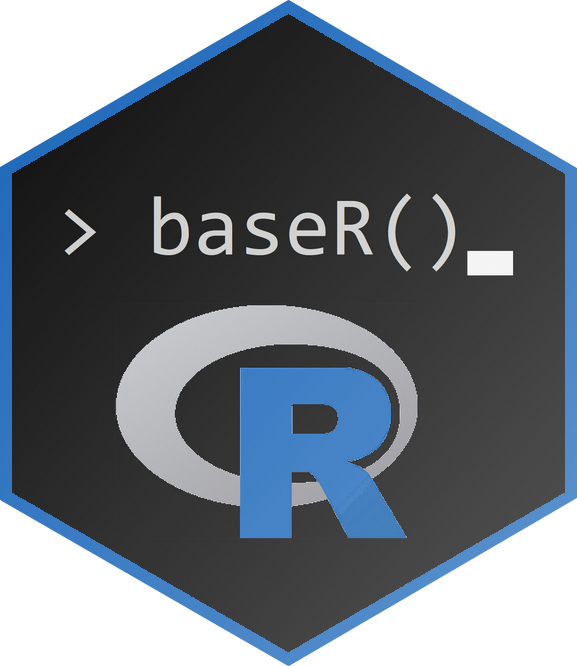
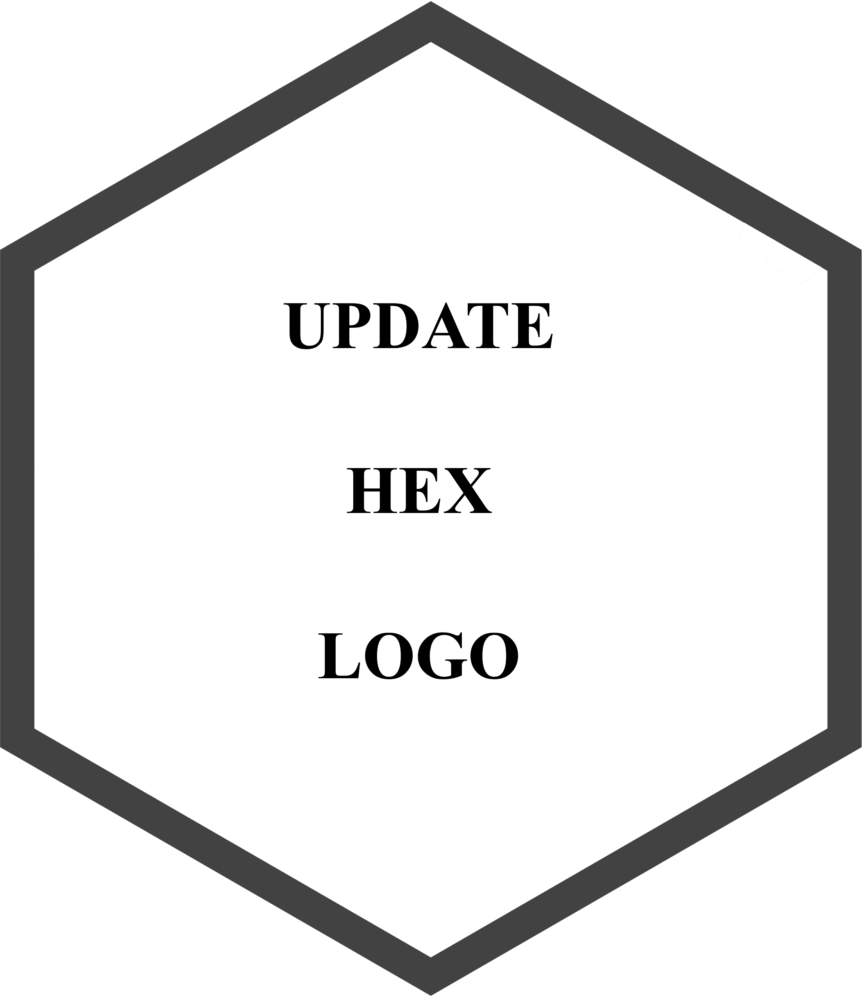
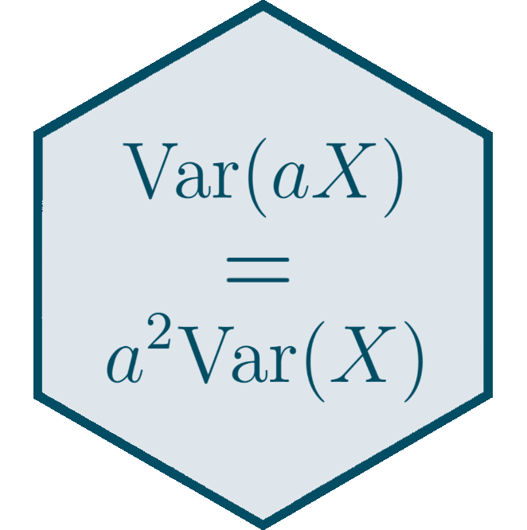
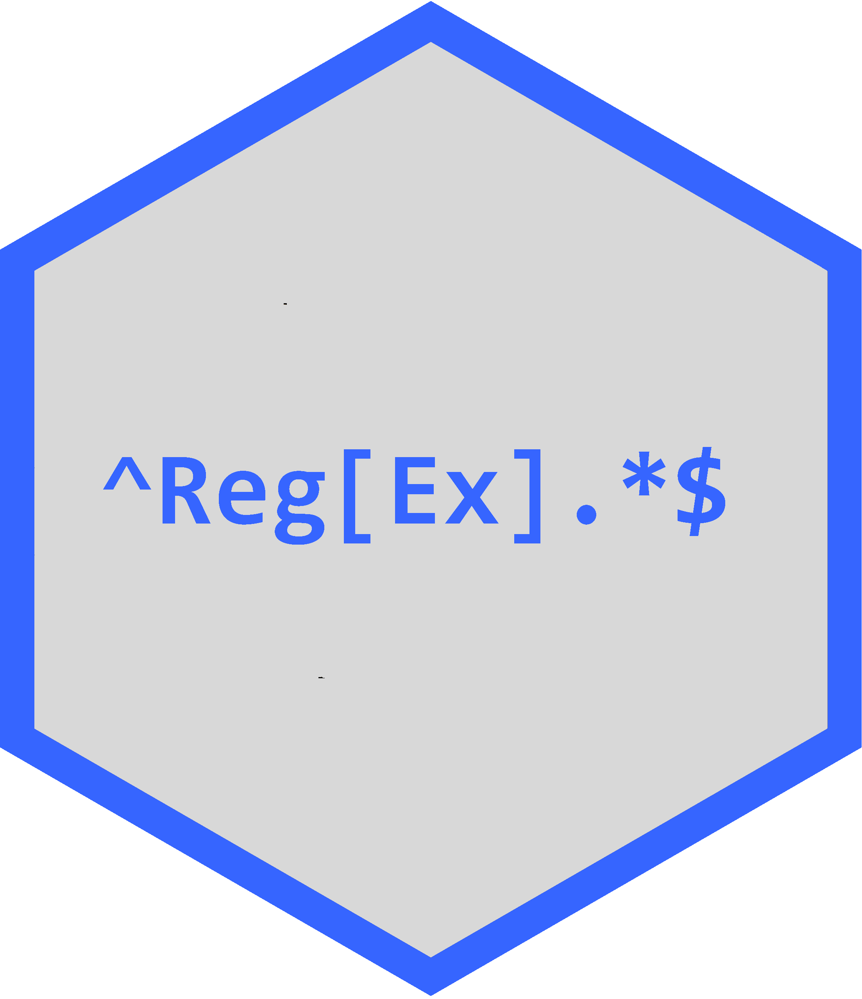
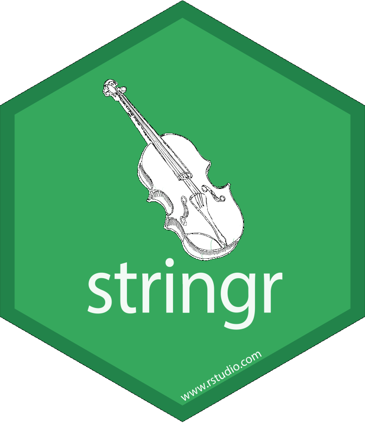

```{r setup, include = F}
knitr::opts_chunk$set(echo = F, message = F, warning = F)
lapply(c("tidyverse", "kableExtra"), library, character.only = T)
root <- "https://louissirugue.github.io/metrics_on_R/"
```

```{css, echo = F, eval = !params$dark}
.share-box {
  width: 40px;
  height: 40px;
  background: #DFE6EB;
  border-radius: 80px;
  text-align:left;
  padding:24px;
  box-shadow: 4px 4px 6px #c7c4c4, 
              -4px -4px 6px #E7EDF0;
}

.share-box:active {
  box-shadow: inset 4px 4px 6px #c7c4c4, 
              inset -4px -4px 6px #E7EDF0
}
```

```{css, echo = F, eval = params$dark}
body{background-color:#201914;filter:invert(1)}

.share-box {
  width: 40px;
  height: 40px;
  background: #DFE6EB;
  border-radius: 80px;
  text-align:left;
  padding:24px;
  box-shadow: 4px 4px 6px #F3F5F7, 
              -4px -4px 6px #D8DEE3;
}

.share-box:active {
  box-shadow: inset 4px 4px 6px #F3F5F7, 
              inset -4px -4px 6px #D8DEE3
}
```

```{r, echo = F}
dark <- ifelse(params$dark, "_dark", "")
astre <- ifelse(params$dark, "sun", "moon")
```

````{=html}
```{r, echo=FALSE, results='asis'}
writeLines(paste0('<div class = "share-box" style ="margin-top:-13em;margin-left: auto; margin-right: 3em;"><a href = "https://louissirugue.github.io/metrics_on_R/home', ifelse(params$dark, "", "_dark"), '.html"><p style = "margin-left:-.51cm;margin-top:-.51cm;width:40px">  </p> </a></div>'), 'astre.html')
xfun::file_string('astre.html')
```
````

<p style = "margin-bottom:5cm;">

### {.tabset}

#### Material {.tabset}

<p style = "margin-bottom:.5cm;">

##### Fall semester

<br>

```{r}
s1 <- data.frame(a = c(" ", 
                       paste("Lecture", 1:14)),
                 
                 b = c(" ",
                       "Introduction to R",
                       "Descriptive statistics",
                       "Basic data manipulation",
                       "Data visualization",
                       "Quarto & \\(\\LaTeX\\)",
                       "Text data & sentiment analysis",
                       "Homework correction",
                       
                       "Univariate regressions",
                       "Multivariate regressions",
                       
                       "Inference",
                       "Causality",
                       "Interpretation",
                       "Applications in academic research",
                       
                       "Maps and geolocalized data"),
                 
                 c = c("Slides", 
                       paste0("[html](", root, "lecture1/slides", dark, ".html) - [pdf](", root, "lecture1/slides", dark, ".pdf)"),
                       paste0("[html](", root, "lecture2/slides", dark, ".html) - [pdf](", root, "lecture2/slides", dark, ".pdf)"),
                       paste0("[html](", root, "lecture3/slides", dark, ".html) - [pdf](", root, "lecture3/slides", dark, ".pdf)"),
                       paste0("[html](", root, "lecture4/slides", dark, ".html) - [pdf](", root, "lecture4/slides", dark, ".pdf)"),
                       paste0("[html](", root, "lecture5/slides", dark, ".html) - [pdf](", root, "lecture5/slides", dark, ".pdf)"),
                       paste0("[html](", root, "lecture6/slides", dark, ".html) - [pdf](", root, "lecture6/slides", dark, ".pdf)"),
                       paste0("[html](", root, "lecture7/homework", dark, ".html) - [pdf](", root, "lecture7/homework", dark, ".pdf)"),
                       paste0("[html](", root, "lecture8/slides", dark, ".html) - [pdf](", root, "lecture8/slides", dark, ".pdf)"),
                       paste0("[html](", root, "lecture9/slides", dark, ".html) - [pdf](", root, "lecture9/slides", dark, ".pdf)"),
                       paste0("[html](", root, "lecture10/slides", dark, ".html) - [pdf](", root, "lecture10/slides", dark, ".pdf)"),
                       paste0("[html](", root, "lecture11/slides", dark, ".html) - [pdf](", root, "lecture11/slides", dark, ".pdf)"),
                       paste0("[html](", root, "lecture12/slides", dark, ".html) - [pdf](", root, "lecture12/slides", dark, ".pdf)"),
                       paste0("[html](", root, "lecture13/slides", dark, ".html) - [pdf](", root, "lecture13/slides", dark, ".pdf)"),
                       paste0("[html](", root, "lecture14/slides", dark, ".html) - [pdf](", root, "lecture14/slides", dark, ".pdf)")),
                 
                 
                 d = c("Quizzes", 
                       "[Quiz 1](https://sirugue.shinyapps.io/quiz1/)",
                       "[Quiz 2](https://sirugue.shinyapps.io/quiz2/)",
                       "[Quiz 3](https://sirugue.shinyapps.io/quiz3/)",
                       " ", " ", 
                       " ", " ", 
                       "[Quiz 4](https://sirugue.shinyapps.io/quiz4/)", 
                       "Quiz 5", 
                       "Quiz 6",
                       " ", " ", 
                       " ", " "),
                 
                 e = c("Data", 
                       paste0("[data](", root, "lecture1/data.zip)"),
                       " ", 
                       paste0("[data](", root, "lecture3/data.zip)"),
                       paste0("[data](", root, "lecture4/data.zip)"),
                       paste0("[data](", root, "lecture5/data.zip)"),
                       paste0("[data](", root, "lecture6/data.zip)"),
                       paste0("[data](", root, "lecture7/data.zip)"),
                       paste0("[data](", root, "lecture8/data.zip)"),
                       paste0("[data](", root, "lecture9/data.zip)"),
                       paste0("[data](", root, "lecture10/data.zip)"),
                       " ",
                       " ",
                       paste0("[data](", root, "lecture13/data.zip)"),
                       paste0("[data](", root, "lecture14/data.zip)")))

kable(s1, col.names = NULL, align = "llcccc") %>%
  row_spec(1, font_size = 17)  %>%
  column_spec(1, width_max = "8em", width = "8em", width_min = "6em") %>%
  column_spec(2, width_max = "16em", width = "16em", width_min = "14em") %>%
  column_spec(3, width_max = "5em", width = "5em", width_min = "5em") %>%
  column_spec(4, width_max = "5em", width = "5em", width_min = "4em") %>%
  column_spec(5, width_max = "5em", width = "5em", width_min = "3em") %>%
  kable_styling(bootstrap_options = c("condensed", "hover"), full_width = F) %>%
  pack_rows("Part 1: Introduction to R programming", 2, 8) %>%
  pack_rows("\nPart 2: Introduction to Econometrics", 9, 15) 
```
<br>
```{r}
exs1 <- data.frame(a = c(" ", 
                       "Homework"),
                 
                 b = c("Guidelines", 
                       paste0("[html](", root, "homework/homework.html) - [pdf](", 
                              root, "homework/homework.pdf)")),
                       
                 c = c("Source",
                       paste0("[qmd](", root, "homework/homework.zip)")),
                 
                 d = c("Data", 
                       "[data](https://data.education.gouv.fr/explore/dataset/fr-en-ips_lycees/)"))
                 
kable(exs1, col.names = NULL, align = "lccc")  %>%
  row_spec(1, font_size = 17) %>%
  column_spec(1, width_max = "24em", width = "24em", width_min = "20em") %>%
  column_spec(2, width_max = "5em", width = "5em", width_min = "5em") %>%
  column_spec(3, width_max = "5em", width = "5em", width_min = "4em") %>%
  column_spec(4, width_max = "5em", width = "5em", width_min = "3em") %>%
  kable_styling(bootstrap_options = c("condensed", "hover"), full_width = F) %>% 
  pack_rows("Exams", 2, 2)
```

<br><br><br><br><br>

##### Spring semester

<br>

```{r}
s2 <- data.frame(a = c(" ", paste("Lecture", 16:18)),
                 b = c(" ", "How to conduct a research project", "Refresher: R Programming", 
                       "Refresher: Econometrics"),
                 c = c("Slides", 
                       paste0("[html](", root, "lecture16/slides", dark, ".html) - [pdf](", root, "lecture16/slides", dark, ".pdf)"),
                       paste0("[html](", root, "lecture17/slides", dark, ".html) - [pdf](", root, "lecture17/slides", dark, ".pdf)"),
                       paste0("[html](", root, "lecture18/slides", dark, ".html) - [pdf](", root, "lecture18/slides", dark, ".pdf)")),
                 d = c("Data",
                       " ",
                       paste0("[data](", root, "lecture17/data.zip)"),
                       " "))

kable(s2, col.names = NULL, align = "llccc") %>%
  row_spec(1, font_size = 17) %>%
  column_spec(1, width_max = "8em", width = "8em", width_min = "6em") %>%
  column_spec(2, width_max = "21em", width = "21em", width_min = "21em") %>%
  column_spec(3, width_max = "5em", width = "5em", width_min = "5em") %>%
  column_spec(4, width_max = "5em", width = "5em", width_min = "4em") %>%
  kable_styling(bootstrap_options = c("condensed", "hover"), full_width = F) %>% 
  pack_rows("Guidelines and refreshers", 2, 4) 
```

<br>

```{r}
exs2 <- data.frame(a = c(" ",  
                       "Research project"),
                 
                 b = c("Guidelines", 
                       paste0("[html](", root, "project/example.html) - [pdf](", root, "project/example.pdf)")),
                       
                 c = c("Grading",
                       paste0("[html](", root, "project/grading.html) - [pdf](", root, "project/grading.pdf)")),
                 d = c("Data", 
                       paste0("[data](", root, "project/data.zip)")))

kable(exs2, col.names = NULL, align = "lccc")  %>%
  #add_header_above(c("Semester 1" = 3)) %>%
  row_spec(1, font_size = 17) %>%
  column_spec(1, width_max = "21em", width = "21em", width_min = "21em") %>%
  column_spec(2, width_max = "7em", width = "7em", width_min = "7em") %>%
  column_spec(3, width_max = "7em", width = "7em", width_min = "7em") %>%
  column_spec(4, width_max = "5em", width = "5em", width_min = "5em") %>%
  kable_styling(bootstrap_options = c("condensed", "hover"), full_width = F) %>% 
  pack_rows("Exams", 2, 2) 
```

<br><br><br><br><br><br><br><br><br><br>

##### Cheatsheets

<br><br><br>

<a href = "https://louissirugue.github.io/metrics_on_R/cheatsheets/rstudio.pdf"></a>
<a href = "https://louissirugue.github.io/metrics_on_R/cheatsheets/baser.pdf"></a>
<a href = "https://louissirugue.github.io/metrics_on_R/cheatsheets/readr.pdf"></a>
<a href = "https://louissirugue.github.io/metrics_on_R/cheatsheets/dplyr.pdf"></a>
<a href = "https://louissirugue.github.io/metrics_on_R/cheatsheets/tidyr.pdf"></a>
<a href = "https://louissirugue.github.io/metrics_on_R/cheatsheets/ggplot.pdf"></a>
<a href = "https://louissirugue.github.io/metrics_on_R/cheatsheets/latex.pdf"></a>
<a href = "https://louissirugue.github.io/metrics_on_R/cheatsheets/rmarkdown.pdf"></a>
<a href = "https://louissirugue.github.io/metrics_on_R/cheatsheets/moments.pdf"></a>
<br>
<a href = "https://louissirugue.github.io/metrics_on_R/cheatsheets/regex.pdf"></a>
<a href = "https://louissirugue.github.io/metrics_on_R/cheatsheets/strings.pdf"></a>
<a href = "https://louissirugue.github.io/metrics_on_R/cheatsheets/cartography.pdf"></a>
<a href = "https://louissirugue.github.io/metrics_on_R/cheatsheets/sf.pdf"></a>

<br><br><br><br><br><br><br><br><br><br>

<!---

<h4>Functions glossary</h4>

<p style = "margin-bottom:1cm;"></p>

```{r, echo = F, eval = params$update_functions, results = "hide"}
library(readxl)

functions <- read_xlsx("functions.xlsx")

# Get the last R documentation version of each package
packages <- functions %>% select(package) %>% unique()
version <- lapply(packages$package, function(a) {
  return(gsub('^.*versionsArray":\\["|".*$', '', 
              paste(readLines(paste0('https://www.rdocumentation.org/packages/',  a)), collapse = "")))
})

# Get the alias of each function
lapply(packages$package, require, character.only = TRUE)
alias <- lapply(functions$`function`, function(a) {
  hf <- as.character(help(a))
  keep <- grepl(paste0(functions %>% filter(`function` == a) %>% pull(package), "/help"), hf)
  return(gsub("^.*/", "", hf[keep]))
})

# Form URL
functions <- functions %>%
  left_join(packages %>% mutate(version = unlist(as.character(version)))) %>%
  mutate(alias = unlist(alias)) %>%
  # Manual modifications
  mutate(alias = ifelse(`function` %in% c("n", "log", "scale_x_discrete", 
                                          "element_rect", "element_line", "rel"), 
                        `function`, alias),
         alias = ifelse(`function` == "scale_y_discrete", "scale_x_discrete", alias),
         alias = ifelse(`function` == "scale_color_manual", "scale_colour_manual", alias),
         alias = ifelse(`function` == "scale_color_gradient", "scale_colour_gradient", alias),
         alias = ifelse(alias == "reorder.factor", "reorder.default", alias),
         version = ifelse(`function` %in% c("scale_color_manual", "geom_text", "geom_histogram"), 
                          "0.9.1", version),
         version = ifelse(`function` %in% c("element_rect", "element_line", "rel"), 
                          "2.1.0", version))%>%
  filter(`function` != "rename") %>%
  # Now form urls
  mutate(doc = paste0("https://www.rdocumentation.org/packages/", package, 
                      "/versions/", version, 
                      "/topics/", alias))

write.csv(functions, "processed_functions.csv", row.names = F)
```


```{r, echo = F}
library(DT)
datatable(read.csv("processed_functions.csv") %>% 
              mutate(doc = paste0('<a href = "', doc, '">', alias, '</a>'),
                     lecture = paste("Lecture", lecture)) %>%
              rename(`function` = function., documentation = doc) %>%
              select(lecture, `function`, package, documentation), 
          escape = F, rownames = F, options = list(pageLength = 5), 
          class = list(stripe = FALSE)) %>% 
  formatStyle(c("lecture", "function", "package", "documentation"), 
              backgroundColor = "#DFE6EB")
```

--->

#### Contents {.tabset}

<p style = "margin-bottom:.5cm;">

##### Fall semester

<br><br>

```{r, include = F}
roman <- c("I.", "II.", "III.", "IV.", "V.", "VI.", "VII.",
           "VIII.", "IX.", "X.", "XI.", "XII.", "XIII.", "XIV.")

slides <- tibble(x = NA_character_, type = NA_character_, 
                 link = NA_character_, bullet = NA_character_,
                 last = NA_character_, n = NA) %>% na.omit()

for (i in 1:length(roman)) {
  
  if (i == 7) {
    slides <- slides %>%
      bind_rows(tibble(x = "VII. Homework correction", 
                       type = "title", 
                       link = paste0(root, "lecture7/homework.html"), 
                       bullet = "item",
                       last = "title",
                       n = NA))
  } 
  
  else {
    
    lecture <- tibble(x = readLines(paste0("../Lecture", i, "/slides.Rmd")))
    
    fourticks <- lecture %>%
        mutate(row = row_number()) %>%
        filter(grepl("^````", x))
    
    if (nrow(fourticks) > 0) {
      
      fourticks <- fourticks %>%
        mutate(x = rep(1:(nrow(.)/2), each = 2),
               group = ifelse(row_number() %% 2, "start", "stop")) %>%
        pivot_wider(names_from = "group", values_from = "row")
      
      for (j in nrow(fourticks):1) {
        lecture <- lecture %>%
          filter(!row_number() %in% fourticks$start[j]:fourticks$stop[j])
      }
      
    }

    slides <- slides %>%
      bind_rows(tibble(x = paste(roman[i], gsub('title: \"|\"', "", lecture$x[2])),
                       type = "title",
                       link = paste0(root, "lecture", i, "/slides.html#1"),
                       bullet = "detail",
                       last = "",
                       n = NA)) %>%
      bind_rows(lecture %>%
                  mutate(type = case_when(grepl("^-", x) ~ "Dashed",
                                          grepl("^### [0-9]. ", x) ~ "Section",
                                          grepl("^#### [0-9].[0-9]. ", x) ~ "Subsection"),
                         x = gsub(":.*$", "", x)) %>%
                  na.omit() %>%
                  group_by(x) %>%
                  filter(type == "Dashed" | row_number() == 1) %>%
                  ungroup() %>%
                  group_by(type == "Dashed") %>%
                  mutate(toc_element = ifelse(type != "Dashed", row_number(), NA)) %>%
                  ungroup() %>%
                  mutate(slide = row_number() - toc_element,
                         x = sub("#* ", "", x)) %>%
                  na.omit() %>%
                  select(x, type, slide) %>%
                  mutate(section = substr(x, 1, 1)) %>%
                  group_by(section) %>%
                  mutate(n = n(),
                         last = ifelse(row_number() == n(), "Section", "")) %>%
                  ungroup() %>%
                  mutate(bullet = ifelse(type == "Section" & n > 1, "detail", "item"),
                         link = paste0(root, "lecture", i, "/slides", 
                                       ifelse(params$dark, "_dark", ""), ".html#", slide),
                         last = ifelse(row_number() == n(), "title", last)) %>%
                  select(x, type, link, bullet, last, n))
  }
}
slides <- slides %>% mutate(x = gsub("`", "", x))


htmlcode <- '<div class="row">'

for (i in 1:nrow(slides)) {
  
  if (grepl("^I\\.", slides$x[i])) {
    htmlcode <- paste0(htmlcode, '<div class="column" style = "margin-left:2cm;">')
  }
  
  if (grepl("^VIII\\.", slides$x[i])) {
    htmlcode <- paste0(htmlcode, '<br><br></div><div class="column" style = "margin-left:-2cm;">')
  }
  
  # Open level 1
  if (slides$type[i] == "title") {
    if (slides$bullet[i] == "detail") {
      htmlcode <- paste0(htmlcode, '<details open style = "margin-left:1cm;"><summary><a href = "', 
                         slides$link[i], '">', slides$x[i], '</a></summary>')
    }
    if (slides$bullet[i] == "item") {
      htmlcode <- paste0(htmlcode, '<ul style = "margin-left:.4cm;"><li><a href = "', 
                         slides$link[i], '">', slides$x[i], '</li></ul><p style = "margin-bottom:.75cm;"></p>')
    }
  }
  
  # Open level 2
  
  if (slides$type[i] == "Section") {
    if (slides$bullet[i] == "detail") {
      htmlcode <- paste0(htmlcode, '<details style = "margin-left:1cm;"><summary><a href = "', 
                         slides$link[i], '">', slides$x[i], '</a></summary>')
    }
    if (slides$bullet[i] == "item") {
      htmlcode <- paste0(htmlcode, '<ul style = "margin-left:.4cm;margin-bottom:0cm;"><li><a href = "', 
                         slides$link[i], '">', slides$x[i], '</a></li></ul>')
    }
  }
  
  # Level 3
  if (slides$type[i] == "Subsection") {
    htmlcode <- paste0(htmlcode, '<ul style = "margin-left:.6cm;margin-bottom:0cm;"><li><a href = "', 
                         slides$link[i], '">', slides$x[i], '</a></li></ul>')
  }
  
  # Close level 2
  if (slides$last[i] == "Section" & slides$n[i] > 1) {
    htmlcode <- paste0(htmlcode, '</details>')
    }
  
  # Close level 1
  if (slides$last[i] == "title") {htmlcode <- paste0(htmlcode, '</details><p style = "margin-bottom:.75cm;"></p>')}

}
htmlcode <- paste0(htmlcode, '</div></div>')

#toc <- read.csv("toc.csv", sep = ";")
#
#htmlcode <- ""
#for (i in unique(toc$Course)) {
#  sect <- unique(toc %>% filter(Course == i) %>% select(Section) %>% deframe)
#  
#  # If more than level 1
#  if (sect != "") {
#    
#    htmlcode <- paste0(htmlcode, '<details open style = "margin-left:1cm;"><summary>', i, '</summary>')
#    for (j in sect) {
#      sub <- toc %>% filter(Course == i & Section == j) %>% select(Subsection) %>% deframe
#      
#      # If more than level 2
#      if (sub != "") {
#        
#        htmlcode <- paste0(htmlcode, '<details style = "margin-left:1cm;"><summary>', j, '</summary>')
#        for (k in sub) {
#          htmlcode <- paste0(htmlcode, '<ul style = "margin-left:.6cm;margin-bottom:0cm;"><li>', k, '</li></ul>')
#        }
#        htmlcode <- paste0(htmlcode, '</details>') 
#        
#        # If only level 2
#      } else {
#        htmlcode <- paste0(htmlcode, '<ul style = "margin-left:.4cm;margin-bottom:0cm;"><li>', j, '</li></ul>')
#      }
#    }
#    
#    htmlcode <- paste0(htmlcode, '</details><p style = "margin-bottom:.75cm;"></p>') 
#    # If only level 1
#  } else{
#    htmlcode <- paste0(htmlcode, '<ul style = "margin-left:.4cm;"><li>', i, 
#                       '</li></ul><p style = "margin-bottom:.75cm;"></p>')
#  }
#  
#}

writeLines(htmlcode, "toc.html")
```


````{=html}
```{r, echo=FALSE, results='asis'}
xfun::file_string('toc.html')
```
````

<br><br><br><br><br><br><br><br><br><br><br><br>

##### Spring semester

<br><br>

```{r, include = F}
roman <- c("I.", "II.", "III.")

slides <- tibble(x = NA_character_, type = NA_character_, 
                 link = NA_character_, bullet = NA_character_,
                 last = NA_character_, n = NA) %>% na.omit()

for (i in 1:length(roman)) {
  
    
    lecture <- tibble(x = readLines(paste0("../Lecture", i + 15, "/slides.Rmd")))
    
    fourticks <- lecture %>%
        mutate(row = row_number()) %>%
        filter(grepl("^````", x))
    
    if (nrow(fourticks) > 0) {
      
      fourticks <- fourticks %>%
        mutate(x = rep(1:(nrow(.)/2), each = 2),
               group = ifelse(row_number() %% 2, "start", "stop")) %>%
        pivot_wider(names_from = "group", values_from = "row")
      
      for (j in nrow(fourticks):1) {
        lecture <- lecture %>%
          filter(!row_number() %in% fourticks$start[j]:fourticks$stop[j])
      }
      
    }

    slides <- slides %>%
      bind_rows(tibble(x = paste(roman[i], gsub('title: \"|\"', "", lecture$x[2])),
                       type = "title",
                       link = paste0(root, "lecture", i + 15, "/slides.html#1"),
                       bullet = "detail",
                       last = "",
                       n = NA)) %>%
      bind_rows(lecture %>%
                  mutate(type = case_when(grepl("^-", x) ~ "Dashed",
                                          grepl("^### [0-9]. ", x) ~ "Section",
                                          grepl("^#### [0-9].[0-9]. ", x) ~ "Subsection"),
                         x = gsub(":.*$", "", x)) %>%
                  na.omit() %>%
                  group_by(x) %>%
                  filter(type == "Dashed" | row_number() == 1) %>%
                  ungroup() %>%
                  group_by(type == "Dashed") %>%
                  mutate(toc_element = ifelse(type != "Dashed", row_number(), NA)) %>%
                  ungroup() %>%
                  mutate(slide = row_number() - toc_element,
                         x = sub("#* ", "", x)) %>%
                  na.omit() %>%
                  select(x, type, slide) %>%
                  mutate(section = substr(x, 1, 1)) %>%
                  group_by(section) %>%
                  mutate(n = n(),
                         last = ifelse(row_number() == n(), "Section", "")) %>%
                  ungroup() %>%
                  mutate(bullet = ifelse(type == "Section" & n > 1, "detail", "item"),
                         link = paste0(root, "lecture", i + 15, "/slides", 
                                       ifelse(params$dark, "_dark", ""), ".html#", slide),
                         last = ifelse(row_number() == n(), "title", last)) %>%
                  select(x, type, link, bullet, last, n))
}

slides <- slides %>% mutate(x = gsub("`", "", x))

htmlcode <- ""
for (i in 1:nrow(slides)) {
  
  # Open level 1
  if (slides$type[i] == "title") {
    if (slides$bullet[i] == "detail") {
      htmlcode <- paste0(htmlcode, '<details open style = "margin-left:8.5cm;"><summary><a href = "', 
                         slides$link[i], '">', slides$x[i], '</a></summary>')
    }
    if (slides$bullet[i] == "item") {
      htmlcode <- paste0(htmlcode, '<ul style = "margin-left:.4cm;"><li><a href = "', 
                         slides$link[i], '">', slides$x[i], '</li></ul><p style = "margin-bottom:.75cm;"></p>')
    }
  }
  
  # Open level 2
  
  if (slides$type[i] == "Section") {
    if (slides$bullet[i] == "detail") {
      htmlcode <- paste0(htmlcode, '<details style = "margin-left:1cm;"><summary><a href = "', 
                         slides$link[i], '">', slides$x[i], '</a></summary>')
    }
    if (slides$bullet[i] == "item") {
      htmlcode <- paste0(htmlcode, '<ul style = "margin-left:.4cm;margin-bottom:0cm;"><li><a href = "', 
                         slides$link[i], '">', slides$x[i], '</a></li></ul>')
    }
  }
  
  # Level 3
  if (slides$type[i] == "Subsection") {
    htmlcode <- paste0(htmlcode, '<ul style = "margin-left:.6cm;margin-bottom:0cm;"><li><a href = "', 
                         slides$link[i], '">', slides$x[i], '</a></li></ul>')
  }
  
  # Close level 2
  if (slides$last[i] == "Section" & slides$n[i] > 1) {
    htmlcode <- paste0(htmlcode, '</details>')
    }
  
  # Close level 1
  if (slides$last[i] == "title") {htmlcode <- paste0(htmlcode, '</details></details><p style = "margin-bottom:.75cm;"></p>')}

}

writeLines(htmlcode, "tocs2.html")
```


````{=html}
```{r, echo=FALSE, results='asis'}
xfun::file_string('tocs2.html')
```
````

<br><br><br><br><br><br><br><br><br><br><br><br>


#### Syllabus {.tabset}

<p style = "margin-bottom:.5cm;">

##### Course description

<br>

<blockquote style =  "font-size: 12.5pt !important;"><i><p style = "margin-left:1cm;"></p>The objective of this course is to provide you with the necessary statistical and data visualization tools to perform well-structured and meaningful data analyses for your own research projects. By the end of this course you should be able to produce relevant statistics and compelling graphics to include in your future reports, presentations, or research projects. To this end, this course combines notions of R programming, basic Statistics, and introductory Econometrics.</i></blockquote>

During the first semester, the emphasis will successively be put on R Programming and Econometrics. Still, all along the course bridges will be built between these two dimensions of data analysis. The second semester will be dedicated to a research project. You will have to carry out an original data analysis by applying the tools covered in class during the first semester to your own research question. For your soon-acquired programming and data analysis skills to be easily valuated on an online CV or as a writing sample, you will learn how to make your final project look like [this document](https://louissirugue.github.io/metrics_on_R/project/example.html).

<p style = "margin-bottom:.75cm;"></p>

<center><span style = "font-size:15pt;"><b>Practical matters</b></span></center>  

<p style = "margin-bottom:.75cm;"></p>

<indent></indent> The course will be taught in French but the material is written in English. It is meant to be accessible without prior knowledge in R programming or Statistics. Lectures will take place at Campus Jourdan - Room 3-38, every Monday from 13:30 to 15:30. Please reach me at <a href="mailto:louis.sirugue@psemail">louis.sirugue@psemail</a> for any question or comment about the course.

Please make sure to download and install R, RStudio, and Quarto before the first lecture, and to bring your laptop with you at each class.  

 * [Download R](https://cran.r-project.org/)
 * [Download RStudio](https://posit.co/download/rstudio-desktop/#download)
 * [Download Quarto](https://quarto.org/docs/get-started/)

Don't hesitate to send me an email if you're already facing issues at that stage.

<br><br><br>

##### Grading system {.tabset}

###### Fall semester

<br>

The grading of the first semester will be based on:  

  * Six weekly online quizzes - 25%
  * One homework - 30%
  * One final exam - 45%   

<p style = "margin-bottom:.75cm;"></p>

Online **quizzes** consist in sets of 3 to 5 short questions related to the content of the previous class. Links to the quizzes will be available in the *Material* section of the course webpage. You will be able to log in to each quiz using the verification code received by email. You will have the possibility to retry the quiz as many times as you want before submitting. When you're done with a quiz you must click on *download results* and send the downloaded file to me by email. This is to keep track of your answers in case of disagreement about the grading. You have until the beginning of the following lecture to submit your results and send them to me by email.   

<p style = "margin-bottom:.75cm;"></p>

The **homework** is a set of exercises related to the first five lectures of the course. It can be done alone or by pairs, and must be handed over via email by the end of the sixth week (15<sup>th</sup> of October 18:00). Late submissions will be penalized by half a point for each 30min beyond the deadline. It will soon be available on the *Material* section of the course webpage. The precise grading system of the homework is also available on the *Material* section of the course webpage already. You are very welcome to help each other, but you must write your answers yourselves. Copy-pasting is not permitted.  

<p style = "margin-bottom:.75cm;"></p>

The **final exam** will be a paper exam in classroom. You are allowed to bring a cheatsheet with you to the exam as long as it is handwritten and standing on a single A4 (21cm x 29.7cm) page, i.e., *recto* only. Cheatsheets that do not comply with these rules will be confiscated. Beyond that, standard examination rules apply. 

<br><br><br>

###### Spring semester

<br>

The grading of the second semester will be entirely based on your research project that you will carry out all along the semester. Research projects must be done by groups of two, so both members of a pair will have the same grade. You will be evaluated three times, at three different stages of the research process:

  * Presentation of research idea - 25%
  * Midterm report - 30%
  * Final project/presentation - 45%  
  
<p style = "margin-bottom:.75cm;"></p>

As the first three lectures of the second semester will be refreshers on the notions seen during the first semester, you will have some time to come up with your own research question and to find relevant data to test your hypotheses empirically (you will be guided on where and how to look for data). Then, in each session you will have to apply a given step of the research process to your research project: data cleaning, descriptive statistics, data visualization, hypothesis testing, etc.  until your final presentation. [Here](https://louissirugue.github.io/metrics_on_R/project/example.html) is an example of what the final document should look like, and the guidelines and grading system are available in the Material section of the homepage. You will have the possibility to write it in French or in English depending on what you think would be the most useful for you.

<br><br><br><br>

##### Schedule {.tabset}

###### Fall semester 

<br>

```{r s1, echo = FALSE}
s1 <- data.frame(c = c("04/09/23", 
                       "11/09/23", 
                       "18/09/23", 
                       "25/09/23",
                       "02/10/23", 
                       "09/10/23", 
                       "16/10/23", 
                       "23/10/23", 
                       "06/11/23",
                       "13/11/23", 
                       "20/11/23", 
                       "04/12/23", 
                       "11/12/23", 
                       "18/12/23", 
                       "15/01/24"),
                 
                 a = c(paste("Lecture", 1:3, '<span style = "color:#00A2D9;">*</span>'), 
                       paste("Lecture", 4:7),
                       paste("Lecture", 8:10, '<span style = "color:#00A2D9;">*</span>'), 
                       paste("Lecture", 11:13), 
                       "Lecture 14",  "Lecture 15"),
                 
                 b = c("Introduction to R",
                       "Descriptive statistics",
                       "Basic data manipulation",
                       "Data visualization",
                       "R markdown & \\(\\LaTeX\\)",
                       "Text data & sentiment analysis",
                       "Homework correction",
                       "Univariate regressions",
                       "Multivariate regressions",
                       "Inference",
                       "Causality",
                       "Interpretation",
                       "Applications in academic research",
                       "Maps and geolocalized data", 
                       "Final exam"))

kable(s1, col.names = NULL, escape= F)  %>%
  kable_styling(bootstrap_options = c("hover", "condensed"), full_width = F) %>%
  #add_header_above(c("Semester 1" = 3)) %>%
  #row_spec(0, font_size = 20) %>%
  pack_rows("Part 1: Introduction to R programming", 1, 7) %>%
  pack_rows("Part 2: Introduction to Econometrics", 8, 15) %>%
  
  column_spec(1, width = "12em", width_min = "8em", width_max = "12em") %>%
  column_spec(2, width = "12em", width_min = "8em", width_max = "12em") %>%
  column_spec(3, width = "24em", width_min = "15em", width_max = "24em") %>%
  
  row_spec(c(8, 11, 14), extra_css = "border-bottom: dashed 1px #014D64 !important;") %>%
  row_spec(c(1:5, 8:13), color = "#014D64") %>%
  row_spec(c(6, 14), color = "#6794A7") %>%
  row_spec(c(7, 15), color = "#00A2D9") # %>%  row_spec(c(8, 12, 16, 18), color = "#86D7F2")
```

<span style = "color:#014D64;"><u>Standard lectures:</u></span>  

During these lectures we will cover the material core material of the course.  

<span style = "color:#6794A7;"><u>Buffer lectures:</u></span>   

These lectures are slightly more advanced, but their content will not be needed for the exams. There are two buffer lectures, each placed before an exam to give you time to prepare for the exam.  

<span style = "color:#00A2D9;"><u>Exams:</u></span>  

The homework is due by the 15<sup>th</sup> of October 18:00, and will be corrected in class during the 7<sup>th</sup> lecture.  
The final exam will take place during the very last lecture.  
The six online quizzes will take place during the first three weeks of each part of the course. The corresponding lectures are marked with a <span style = "color:#00A2D9;">*</span> symbol.

```{r, echo = F}
tibble(a = c("")) %>%
  kable(col.names = NULL) %>%
  kable_styling(bootstrap_options ="condensed") %>%
  row_spec(1, extra_css = "border-bottom: dashed 1px #014D64 !important;")
```

Horizontal dashed lines represent break periods. They all last 1 week except the 3-week-long Christmas break.

<br><br><br><br>

###### Spring semester

<br>

```{r s2, echo = FALSE}
s2 <- data.frame(a = c(" ", paste("Lecture", 1:15)),
                 c = c("Group 1",
                       rep("TBA", 15)),
                 d = c("Group 2",
                       rep("TBA", 15)),
                 b = c(" ", "How to conduct a research project",
                       "Refresher: R Programming",
                       "Refresher: Econometrics",
                       "Presentation of your research question and dataset",
                       "Follow-up: Data cleaning I",
                       "Follow-up: Data cleaning II",
                       "Follow-up: Descriptive statistics",
                       "Follow-up: Visualizing the data",
                       "Follow-up: Regression analysis",
                       "Follow-up: Midterm report feedback",
                       "Follow-up: Causality assessment",
                       "Follow-up: Robustness",
                       "Follow-up: Heterogeneity",
                       "Follow-up: Last tips",
                       "Final presentation"))

kable(s2, col.names = NULL, align = "lccl")  %>%
  #add_header_above(c("Semester 2" = 3)) %>%
  #row_spec(0, font_size = 20) %>%
  kable_styling(bootstrap_options = c("hover", "condensed"), full_width = F) %>%
  row_spec(1, font_size = 17)  %>%
  pack_rows("Part 1: Guidelines and refreshers", 2, 4) %>%
  pack_rows("Part 2: Research project", 5, 16) %>%
  
  column_spec(1, width = "7em", width_min = "7em", width_max = "7em") %>%
  column_spec(2, width = "5em", width_min = "5em", width_max = "5em") %>%
  column_spec(3, width = "5em", width_min = "5em", width_max = "5em") %>%
  column_spec(4, width = "20em", width_min = "14em", width_max = "20em") %>%
  
  row_spec(c(6:10, 12:15), color = "#014D64") %>%
  row_spec(2:4, color = "#6794A7") %>%
  row_spec(c(5, 11, 16), color = "#00A2D9")
```

<span style = "color:#6794A7;"><u>Guidelines and refreshers:</u></span>  

The first lecture will cover in detail how to conduct your research project, and the next two lectures will go back on the most important notions seen during the first semester. These are meant to give you time to form groups of 2 and to find your research question and your dataset. You will be guided on where and how to look for data, and both the data and the research question can be taken from an existing academic article. 

<span style = "color:#014D64;"><u>Follow-ups:</u></span>   

Follow-up sessions are meetings during which you will be given feedback on what you've done and indications on what to do next. Between each session you will have to apply a given step of the research process to your research project: data cleaning, descriptive statistics, data visualization, hypothesis testing, etc., until your final presentation. [Here](https://louissirugue.github.io/metrics_on_R/project/example.html) is an example of what the final document should look like, and the guidelines and grading system are available at the bottom of the *Material* section of the homepage. You will have the possibility to write it in French or in English depending on what you think would be the most useful for you.

<span style = "color:#00A2D9;"><u>Exams:</u></span>  

The 4<sup>th</sup> lecture will be dedicated to the presentation of your research questions and datasets.  
A midterm report must be handed out by email after the 9<sup>th</sup> lecture. Lecture 10 will be devoted to giving you feedback about it.  
The last lecture will be dedicated to your final presentations.  
More detailed guidelines are provided above and in the first set of slides *"How to conduct a research project".*

```{r, echo = F}
tibble(a = c("")) %>%
  kable(col.names = NULL) %>%
  kable_styling(bootstrap_options ="condensed") %>%
  row_spec(1, extra_css = "border-bottom: dashed 1px #014D64 !important;")
```

Horizontal dashed lines represent break periods.

<br><br><br><br>

##### References

<br><br>

This course is inspired by:

 * [Introduction to R](https://introtor-pse.appspot.com/), <i>by H. Bull and P. Charousset.</i> Paris School of Economics (2020)
 * [Advanced Mircoeconometrics](https://enseignements.ehess.fr/2020-2021/ue/798), <i>by D. Margolis and F. Libois.</i> Paris School of Economics (2020)
 * [How to Lie with Graphics](http://data.visualisation.free.fr/Papers/Part1-HowToLie.pdf), <i>by C. Bontemps.</i> Toulouse School of Economics (2020)
 * [Introduction to Econometrics with R](https://scpoecon.github.io/ScPoEconometrics/), <i>by F. Oswald, V. Viers, P. Villedieu, and G. Kenedi.</i> SciencesPo Dep. of Economics (2020)
 * Introduction to Causal Inference, <i>by L. Zabrocki.</i> Paris Sciences et Lettres - CPES (2020)
 * Geolocalized Datasets and Applications for Economics, <i>by F. Libois and E. Madinier.</i> Paris School of Economics (2020)
 * Countless posts on [stackoverflow](https://stackoverflow.com/) and [R-bloggers](https://www.r-bloggers.com/)
 
<br><br><br><br><br><br><br><br><br><br><br><br>

<!---

#### Archives

<br>

```{r}
archives <- data.frame(a = c(" ", 
                       "Homework 1 - Introduction to R programming", 
                       "Homework 2 - Data analysis"),
                 b = c("Guidelines", 
                       paste0("[html](", root, "2021_homework1/guidelines.html)"),
                       paste0("[html](", root, "2021_homework2/guidelines.html)")),
                 c = c("Grading",
                       paste0("[html](", root, "2021_homework1/grading.html)"),
                       paste0("[html](", root, "2021_homework2/grading.html)")),
                 d = c("Data", 
                       paste0("[data](", root, "2021_homework1/data.zip)"),
                       paste0("[data](", root, "2021_homework2/data.zip)")))
                 
kable(archives, col.names = NULL, align = "lccc")  %>%
  row_spec(1, font_size = 16) %>%
  kable_styling(bootstrap_options = c("condensed", "hover")) %>%
  pack_rows("2021", 2, 3)
```

<p style = "margin-bottom:30cm;">

<br><br><br><br>

--->
